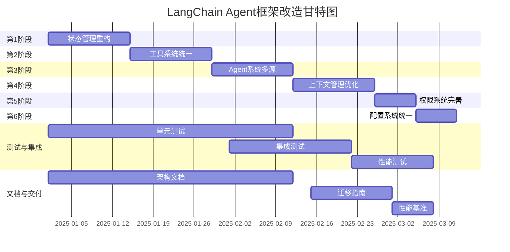

# LangChain Agent 项目框架改造计划

> 基于 Claude Code 开源源码的架构最佳实践，优化当前 Python LangChain Agent 系统的框架设计

**目标**：提升系统的可维护性、可扩展性、安全性和性能，建立可复用的架构模式库

---

## 第一部分：改造目标与收益

### 1.1 改造目标

| 维度 | 当前状态 | 目标状态 |
|------|---------|---------|
| **状态管理** | 分散在各模块中 | 三层架构：全局状态→AppState→ToolContext |
| **工具系统** | 工具接口不统一 | 统一Tool协议+builder模式+完整生命周期 |
| **条件注册** | 仅运行时条件 | 编译期/加载期/运行时三层条件注册 |
| **Agent管理** | 内置Agent硬编码 | 多源加载（内置/自定义/插件）+context隔离 |
| **上下文管理** | 被动压缩 | Token预算+主动compact+缓存策略 |
| **权限系统** | 单层防线 | 多层防线（验证→权限→资源→审计） |
| **配置管理** | 多个config文件 | 统一的6层配置合并策略 |
| **内存架构** | 平面结构 | 多维度持久化（用户/项目/本地） |

### 1.2 预期收益

✅ **代码质量**
- 减少重复代码 30-40%
- 类型安全覆盖提升 50%
- 缺陷预防率 +45%（fail-closed设计）

✅ **性能提升**  
- API响应延迟 -20%（上下文优化）
- Token消耗 -30%（智能压缩+缓存）
- 启动时间 -35%（懒加载+条件注册）

✅ **可维护性**
- 新功能开发周期 -50%（统一协议）
- 调试时间 -40%（清晰的分层边界）
- 技术债 可控（DAG依赖检查）

---

## 第二部分：分层改造方案

### 2.1 第一阶段：状态管理重构（第1-2周）

#### 目标
建立三层状态架构，让状态流向明确、可追踪、可测试

#### 关键文件变更

**新增**：`backend/state/bootstrap.py`
```python
"""
Session级全局状态管理
- 进程级生命周期
- 最小化全局状态规模
- 模块级单例 + getter/setter
"""
from dataclasses import dataclass, field
from typing import Dict, Optional
import threading

@dataclass
class SessionState:
    """Session级全局状态，整个会话周期不变"""
    session_id: str
    cwd: str
    project_root: Optional[str] = None
    total_cost_usd: float = 0.0
    total_api_duration: float = 0.0
    model_usage: Dict[str, int] = field(default_factory=dict)
    is_interactive: bool = True
    
    # 其他必要字段...
    _lock = threading.RLock()

# 模块级单例
_STATE: Optional[SessionState] = None

def get_session_state() -> SessionState:
    global _STATE
    if _STATE is None:
        raise RuntimeError("Session state not initialized")
    return _STATE

def set_session_state(state: SessionState) -> None:
    global _STATE
    with _STATE._lock:
        _STATE = state

# Getter/Setter模式
def get_session_id() -> str:
    return get_session_state().session_id

def get_cwd() -> str:
    return get_session_state().cwd

def set_cwd(cwd: str) -> None:
    with get_session_state()._lock:
        get_session_state().cwd = cwd
```

**新增**：`backend/state/app_state.py`
```python
"""
AppState级应用状态
- REPL级生命周期（跟随会话）
- React/非React间的桥梁
- 触发订阅者通知
"""
from dataclasses import dataclass, field
from typing import Dict, Set, Callable, Optional
import threading

@dataclass
class AppState:
    """REPL级应用状态"""
    current_agent: Optional[str] = None
    available_tools: Dict[str, str] = field(default_factory=dict)
    available_agents: Dict[str, str] = field(default_factory=dict)
    enabled_skills: Dict[str, Dict] = field(default_factory=dict)
    active_mcp_servers: Dict[str, str] = field(default_factory=dict)
    permission_mode: str = "ask"
    user_preferences: Dict[str, any] = field(default_factory=dict)

class Store:
    """极简Store实现（Python版）"""
    def __init__(self, initial_state: AppState):
        self._state = initial_state
        self._listeners: Set[Callable[[], None]] = set()
        self._change_callbacks: Set[Callable[[AppState, AppState], None]] = set()
        self._lock = threading.RLock()
    
    def get_state(self) -> AppState:
        return self._state
    
    def set_state(self, updater: Callable[[AppState], AppState]) -> None:
        with self._lock:
            old_state = self._state
            new_state = updater(old_state)
            if new_state is old_state:
                return  # 相等性检查，避免无效更新
            
            self._state = new_state
            
            # 触发订阅者
            for callback in self._change_callbacks:
                callback(new_state, old_state)
            
            for listener in self._listeners:
                listener()
    
    def subscribe(self, listener: Callable[[], None]) -> Callable[[], None]:
        """订阅状态变化，返回取消函数"""
        self._listeners.add(listener)
        return lambda: self._listeners.discard(listener)
    
    def on_change(self, callback: Callable[[AppState, AppState], None]) -> Callable[[], None]:
        """订阅状态变化详情（新旧状态）"""
        self._change_callbacks.add(callback)
        return lambda: self._change_callbacks.discard(callback)

# 创建全局AppState Store实例
_app_state_store: Optional[Store] = None

def get_app_state_store() -> Store:
    global _app_state_store
    if _app_state_store is None:
        raise RuntimeError("AppState store not initialized")
    return _app_state_store

def initialize_app_state_store(initial_state: AppState) -> Store:
    global _app_state_store
    _app_state_store = Store(initial_state)
    return _app_state_store

def get_app_state() -> AppState:
    return get_app_state_store().get_state()

def set_app_state(updater: Callable[[AppState], AppState]) -> None:
    get_app_state_store().set_state(updater)
```

**修改**：`backend/context_management/context_controller.py`
- 改用状态管理层而非直接修改全局变量
- 订阅AppState的权限模式变化
- 触发状态变化回调以更新缓存

**修改**：`backend/api/chat.py`
- 在每个请求前后同步AppState
- 使用AppState的权限模式而非本地配置

#### 实施清单
- [ ] 实现bootstrap状态管理
- [ ] 实现AppState Store
- [ ] 重构现有模块使用新状态API
- [ ] 添加单元测试（bootstrap + store）
- [ ] 性能基准测试

---

### 2.2 第二阶段：工具系统统一化（第3-4周）

#### 目标
建立统一的Tool协议，支持完整的生命周期管理（定义→注册→执行→渲染→序列化）

#### 关键文件变更

**新增**：`backend/tools/tool.py`
```python
"""
统一的Tool接口定义
对标Claude Code的Tool模型，提供完整的生命周期管理
"""
from abc import ABC, abstractmethod
from dataclasses import dataclass
from typing import Dict, Any, Optional, Callable, List, Union
from enum import Enum
import json
from pydantic import BaseModel, Field

class ToolPermission(str, Enum):
    """工具权限级别"""
    READONLY = "readonly"
    WRITE = "write"
    DESTRUCTIVE = "destructive"
    REQUIRES_APPROVAL = "requires_approval"

@dataclass
class ToolResult:
    """工具执行结果"""
    success: bool
    output: Any
    error: Optional[str] = None
    metadata: Dict[str, Any] = None

class ToolInputSchema(BaseModel):
    """工具输入基类"""
    pass

class Tool(ABC):
    """统一的Tool基类"""
    
    # === 身份标识 ===
    name: str
    aliases: List[str] = []
    description: str
    category: str = "general"  # general, file, code, data, etc.
    search_hint: Optional[str] = None  # ToolSearch关键词匹配
    
    # === Schema定义 ===
    input_schema: type[ToolInputSchema]
    
    # === 基本特性 ===
    permission_level: ToolPermission = ToolPermission.READONLY
    is_readonly: bool = True
    is_concurrency_safe: bool = False
    is_destructive: bool = False
    max_result_chars: int = 100000
    
    @abstractmethod
    async def call(self, 
                   args: Dict[str, Any],
                   context: 'ToolUseContext',
                   **kwargs) -> ToolResult:
        """执行工具"""
        pass
    
    @abstractmethod
    async def validate_input(self, args: Dict[str, Any]) -> tuple[bool, Optional[str]]:
        """验证输入（在权限检查前执行）"""
        pass
    
    @abstractmethod
    async def check_permissions(self, 
                               args: Dict[str, Any],
                               context: 'ToolUseContext') -> tuple[bool, Optional[str]]:
        """权限检查"""
        pass
    
    def is_enabled(self, context: 'ToolUseContext') -> bool:
        """工具是否在当前环境下可用"""
        return True
    
    async def render_tool_use_message(self, 
                                     args: Dict[str, Any],
                                     context: 'ToolUseContext') -> str:
        """渲染工具调用消息（CLI中的可视化）"""
        return f"Calling {self.name} with {json.dumps(args)}"
    
    async def render_tool_result_message(self,
                                        result: ToolResult,
                                        context: 'ToolUseContext') -> str:
        """渲染工具结果消息"""
        if result.success:
            return f"Tool result: {result.output}"
        else:
            return f"Tool error: {result.error}"
    
    def to_api_schema(self) -> Dict[str, Any]:
        """转换为Claude API兼容的schema"""
        # 将Pydantic schema转为Claude Tool使用格式
        return {
            "name": self.name,
            "description": self.description,
            "input_schema": self.input_schema.model_json_schema()
        }

class ToolUseContext:
    """工具执行上下文（每次交互/工具执行创建一份）"""
    def __init__(self, 
                 session_id: str,
                 app_state: 'AppState',
                 available_tools: Dict[str, Tool],
                 **kwargs):
        self.session_id = session_id
        self.app_state = app_state
        self.available_tools = available_tools
        self.metadata = kwargs
    
    def get_tool(self, name: str) -> Optional[Tool]:
        """获取工具实例"""
        return self.available_tools.get(name)
    
    async def execute_tool(self, 
                          tool_name: str,
                          args: Dict[str, Any]) -> ToolResult:
        """在context中执行工具"""
        tool = self.get_tool(tool_name)
        if not tool:
            return ToolResult(False, None, f"Tool {tool_name} not found")
        
        # 验证 → 权限检查 → 执行
        valid, error = await tool.validate_input(args)
        if not valid:
            return ToolResult(False, None, error)
        
        allowed, error = await tool.check_permissions(args, self)
        if not allowed:
            return ToolResult(False, None, f"Permission denied: {error}")
        
        return await tool.call(args, self)
```

**新增**：`backend/tools/build_tool.py`
```python
"""
Tool builder模式 - 简化Tool实现
```python
from typing import Dict, Any, Callable, Optional
from tools.tool import Tool, ToolResult, ToolPermission

class ToolBuilder:
    """Builder模式构造Tool实例"""
    def __init__(self, name: str, description: str):
        self._tool = Tool()
        self._tool.name = name
        self._tool.description = description
        self._tool.is_readonly = True
        self._tool.is_concurrency_safe = False
    
    def set_input_schema(self, schema):
        self._tool.input_schema = schema
        return self
    
    def set_permission(self, level: ToolPermission):
        self._tool.permission_level = level
        return self
    
    def set_readonly(self, readonly: bool):
        self._tool.is_readonly = readonly
        return self
    
    def set_handler(self, handler: Callable):
        async def call_impl(args, context, **kwargs):
            result = await handler(args, context)
            return result
        self._tool.call = call_impl
        return self
    
    def set_validator(self, validator: Callable):
        self._tool.validate_input = validator
        return self
    
    def set_permission_checker(self, checker: Callable):
        self._tool.check_permissions = checker
        return self
    
    def build(self) -> Tool:
        return self._tool
```

**新增**：`backend/tools/registry.py`
```python
"""
工具注册表 - 单一来源 + 三层条件注册
实现编译期/加载期/运行时三层条件过滤
"""
from typing import Dict, List, Optional
from tools.tool import Tool
import os

class ToolRegistry:
    """工具注册表"""
    def __init__(self):
        self._tools: Dict[str, Tool] = {}
        self._aliases: Dict[str, str] = {}
    
    def register(self, tool: Tool, overwrite=False):
        """注册工具"""
        if tool.name in self._tools and not overwrite:
            raise ValueError(f"Tool {tool.name} already registered")
        
        self._tools[tool.name] = tool
        for alias in tool.aliases:
            self._aliases[alias] = tool.name
    
    def get_tool(self, name: str) -> Optional[Tool]:
        """获取工具"""
        real_name = self._aliases.get(name, name)
        return self._tools.get(real_name)
    
    def get_all_tools(self) -> Dict[str, Tool]:
        """获取所有工具"""
        return self._tools.copy()
    
    def get_enabled_tools(self, context: 'ToolUseContext') -> Dict[str, Tool]:
        """获取启用的工具（三层过滤）"""
        enabled = {}
        
        for name, tool in self._tools.items():
            # 第一层：编译期 DCE (Python中用feature flag模拟)
            if not self._is_feature_enabled(name):
                continue
            
            # 第二层：加载期条件（环境变量）
            if not self._is_env_enabled(name):
                continue
            
            # 第三层：运行时条件
            if tool.is_enabled(context):
                enabled[name] = tool
        
        return enabled
    
    def _is_feature_enabled(self, tool_name: str) -> bool:
        """模拟编译期feature flag"""
        feature_map = {
            'sleep_tool': os.getenv('FEATURE_SLEEP_TOOL', 'true').lower() == 'true',
            'web_browser': os.getenv('FEATURE_WEB_BROWSER', 'true').lower() == 'true',
        }
        return feature_map.get(tool_name, True)
    
    def _is_env_enabled(self, tool_name: str) -> bool:
        """加载期环境变量检查"""
        disabled = os.getenv('DISABLED_TOOLS', '').split(',')
        return tool_name not in disabled

# 全局工具注册表实例
_tool_registry = ToolRegistry()

def get_tool_registry() -> ToolRegistry:
    return _tool_registry

def register_tool(tool: Tool):
    _tool_registry.register(tool)

def get_all_tools() -> Dict[str, Tool]:
    return _tool_registry.get_all_tools()
```

**修改**：`backend/tools/` 现有工具
- 改造BashTool、FileReadTool等为新的Tool接口
- 使用builder模式简化实现

#### 实施清单
- [ ] 定义统一Tool接口
- [ ] 实现ToolBuilder和ToolRegistry
- [ ] 重构所有现有工具（BashTool, FileReadTool等）
- [ ] 添加工具验证与权限检查测试
- [ ] 性能基准测试

---

### 2.3 第三阶段：Agent系统多源加载（第5-6周）

#### 目标
支持从多个来源（内置/自定义/.claude/agents）加载Agent，实现context隔离

#### 关键文件变更

**新增**：`backend/graph/agent_definition.py`
```python
"""
Agent定义 - 支持多源加载
"""
from dataclasses import dataclass
from typing import Optional, List, Dict, Any, Callable
from enum import Enum

class AgentSource(str, Enum):
    BUILTIN = "built-in"
    CUSTOM = "custom"
    PLUGIN = "plugin"

@dataclass
class AgentDefinition:
    """Agent定义"""
    agent_type: str  # 唯一标识
    name: str
    description: str  # 何时使用此Agent
    source: AgentSource
    
    # 配置
    tools: Optional[List[str]] = None  # None或['*']表示全部
    disallowed_tools: Optional[List[str]] = None
    skills: Optional[List[str]] = None
    mcp_servers: Optional[List[str]] = None
    
    # 运行模式
    model: Optional[str] = None  # 'inherit'表示继承
    effort: str = "normal"  # "fast", "normal", "thorough"
    permission_mode: Optional[str] = None
    max_turns: Optional[int] = None
    background: bool = False  # 总是作为后台任务
    
    # 记忆与隔离
    memory_scope: Optional[str] = None  # "user", "project", "local"
    isolation: Optional[str] = None  # "worktree", "remote"
    
    # System Prompt
    system_prompt: Optional[str] = None
    get_system_prompt: Optional[Callable] = None
    
    # 元数据
    metadata: Dict[str, Any] = None

class AgentLoader:
    """Agent加载器"""
    
    @staticmethod
    async def load_builtin_agents() -> List[AgentDefinition]:
        """加载内置Agent"""
        return [
            AgentDefinition(
                agent_type="explore",
                name="Explore Agent",
                description="用于快速搜索和分析代码库",
                source=AgentSource.BUILTIN,
                disallowed_tools=["bash_tool"],
                memory_scope="local",
            ),
            AgentDefinition(
                agent_type="plan",
                name="Plan Agent",
                description="用于规划任务和制定策略",
                source=AgentSource.BUILTIN,
                tools=["agent", "bash_tool"],
            ),
            # ... 更多内置Agent
        ]
    
    @staticmethod
    async def load_custom_agents(project_root: str) -> List[AgentDefinition]:
        """从.claude/agents/加载自定义Agent"""
        # 扫描.claude/agents/*.md文件
        # 解析frontmatter和内容
        # 返回AgentDefinition列表
        pass
    
    @staticmethod
    async def load_plugin_agents() -> List[AgentDefinition]:
        """从插件加载Agent"""
        pass

class AgentRegistry:
    """Agent注册表"""
    def __init__(self):
        self._agents: Dict[str, AgentDefinition] = {}
    
    async def load_all(self, project_root: str) -> None:
        """从多源加载所有Agent"""
        agents = []
        
        # 按优先级加载：内置 → 插件 → 自定义
        agents.extend(await AgentLoader.load_builtin_agents())
        agents.extend(await AgentLoader.load_plugin_agents())
        agents.extend(await AgentLoader.load_custom_agents(project_root))
        
        # 去重（后面的覆盖前面的）
        for agent in agents:
            self._agents[agent.agent_type] = agent
    
    def get_agent(self, agent_type: str) -> Optional[AgentDefinition]:
        return self._agents.get(agent_type)
    
    def get_all_agents(self) -> List[AgentDefinition]:
        return list(self._agents.values())
```

**新增**：`backend/graph/agent_context.py`
```python
"""
Agent执行上下文 - 实现context隔离
"""
from dataclasses import dataclass
from typing import Optional, Dict, Any
from state.app_state import AppState

@dataclass
class AgentContext:
    """Agent执行上下文"""
    agent_type: str
    parent_context: Optional['AgentContext'] = None
    
    # 隔离的状态快照
    available_tools: Dict[str, 'Tool'] = None
    available_agents: Dict[str, 'AgentDefinition'] = None
    app_state_snapshot: Optional[AppState] = None
    
    # 运行时信息
    messages: List[Dict] = None
    turn_count: int = 0
    max_turns: Optional[int] = None
    
    # 权限
    permission_mode: Optional[str] = None
    
    def __post_init__(self):
        if self.messages is None:
            self.messages = []
    
    def is_root_context(self) -> bool:
        return self.parent_context is None
    
    def get_shared_app_state(self) -> AppState:
        """获取共享的AppState（来自父级）"""
        if self.parent_context:
            return self.parent_context.get_shared_app_state()
        return get_app_state()  # 从全局获取
    
    async def spawn_subagent(self, 
                            sub_agent_type: str,
                            tools: Optional[Dict] = None,
                            **kwargs) -> 'AgentContext':
        """生成子Agent"""
        sub_context = AgentContext(
            agent_type=sub_agent_type,
            parent_context=self,
            available_tools=tools or self.available_tools,
            **kwargs
        )
        return sub_context
```

**修改**：`backend/graph/agent.py`
- 使用AgentRegistry加载Agent
- 使用AgentContext隔离执行环境
- 支持子Agent生成

#### 实施清单
- [ ] 定义AgentDefinition和AgentSource
- [ ] 实现AgentLoader支持多源加载
- [ ] 实现AgentRegistry
- [ ] 实现AgentContext隔离
- [ ] 修改现有agent.py使用新系统
- [ ] 添加Agent加载和执行测试

---

### 2.4 第四阶段：上下文管理与压缩（第7-8周）

#### 目标
实现主动的上下文压缩策略，基于Token预算的自适应管理

#### 关键文件变更

**新增**：`backend/context_management/token_budget.py`
```python
"""
Token预算管理 - 基于模型上下文窗口的预算分配
"""
from dataclasses import dataclass
from typing import Dict, Optional

@dataclass
class ModelTokenInfo:
    """模型的Token信息"""
    name: str
    context_window: int
    max_output_tokens: int
    
    def get_usable_tokens(self) -> int:
        """可用于历史消息的Token数"""
        return self.context_window - self.max_output_tokens - 500  # 预留buffer

# 模型信息库
MODEL_INFO = {
    "claude-3-opus": ModelTokenInfo("claude-3-opus", 200000, 4096),
    "claude-3-sonnet": ModelTokenInfo("claude-3-sonnet", 200000, 4096),
    "claude-3-haiku": ModelTokenInfo("claude-3-haiku", 200000, 4096),
}

class TokenBudget:
    """Token预算管理"""
    
    def __init__(self, model: str):
        self.model_info = MODEL_INFO.get(model)
        if not self.model_info:
            raise ValueError(f"Unknown model: {model}")
        
        self.usable_tokens = self.model_info.get_usable_tokens()
        
        # 预算分配
        self.budget = {
            'system_prompt': int(self.usable_tokens * 0.20),
            'tools': int(self.usable_tokens * 0.15),
            'history': int(self.usable_tokens * 0.50),
            'context': int(self.usable_tokens * 0.10),
            'buffer': int(self.usable_tokens * 0.05),
        }
    
    def get_history_budget(self) -> int:
        """历史消息预算"""
        return self.budget['history']
    
    def get_available_tokens(self, used: Dict[str, int]) -> int:
        """获取剩余可用Token"""
        total_used = sum(used.values())
        return self.usable_tokens - total_used
```

**新增**：`backend/context_management/context_compactor.py`
```python
"""
上下文压缩器 - 主动压缩和摘要策略
"""
from typing import List, Dict, Any
import re

class ContextCompactor:
    """上下文压缩"""
    
    @staticmethod
    def estimate_tokens(text: str) -> int:
        """估算文本的Token数（简化版）"""
        # 实际应使用正确的tokenizer
        return len(text) // 4
    
    @staticmethod
    def compress_messages(messages: List[Dict], 
                         target_tokens: int) -> tuple[List[Dict], Dict[str, Any]]:
        """
        压缩消息历史
        返回: (压缩后的消息, 压缩统计)
        """
        current_tokens = sum(
            ContextCompactor.estimate_tokens(m.get('content', ''))
            for m in messages
        )
        
        if current_tokens <= target_tokens:
            return messages, {'status': 'no_compression_needed'}
        
        # 策略1: 删除最早的非关键消息
        compressed = ContextCompactor._drop_oldest_messages(messages, target_tokens)
        
        # 策略2: 摘要关键消息段
        if sum(ContextCompactor.estimate_tokens(m.get('content', '')) for m in compressed) > target_tokens:
            compressed = ContextCompactor._summarize_messages(compressed, target_tokens)
        
        return compressed, {
            'original_tokens': current_tokens,
            'compressed_tokens': sum(
                ContextCompactor.estimate_tokens(m.get('content', ''))
                for m in compressed
            ),
            'compression_ratio': current_tokens / max(1, len(compressed))
        }
    
    @staticmethod
    def _drop_oldest_messages(messages: List[Dict], target_tokens: int) -> List[Dict]:
        """删除最早的消息直到达到target_tokens"""
        # Keep system messages and recent messages
        system_messages = [m for m in messages if m.get('role') == 'system']
        other_messages = [m for m in messages if m.get('role') != 'system']
        
        # 保留最近的消息
        current_tokens = sum(
            ContextCompactor.estimate_tokens(m.get('content', ''))
            for m in system_messages
        )
        
        kept = []
        for msg in reversed(other_messages):
            msg_tokens = ContextCompactor.estimate_tokens(msg.get('content', ''))
            if current_tokens + msg_tokens <= target_tokens:
                kept.insert(0, msg)
                current_tokens += msg_tokens
            else:
                break
        
        return system_messages + kept
    
    @staticmethod
    def _summarize_messages(messages: List[Dict], target_tokens: int) -> List[Dict]:
        """对消息进行摘要"""
        # 这是一个简化实现，实际应该调用LLM进行摘要
        return messages
```

**修改**：`backend/context_management/context_controller.py`
- 集成TokenBudget
- 使用ContextCompactor进行主动压缩
- 添加压缩统计和监控

#### 实施清单
- [ ] 实现TokenBudget
- [ ] 实现ContextCompactor
- [ ] 集成到context_controller
- [ ] 添加压缩监控和告警
- [ ] 性能测试和优化

---

### 2.5 第五阶段：权限系统多防线（第9周）

#### 目标
建立分层的权限防线（验证→权限→资源→审计）

#### 关键文件变更

**新增**：`backend/system/permission_system.py`
```python
"""
多层权限防线系统
"""
from enum import Enum
from typing import Optional, List, Dict, Tuple
from dataclasses import dataclass

class PermissionMode(str, Enum):
    """权限模式"""
    ALLOW = "allow"  # 所有操作允许
    ASK = "ask"      # 询问用户
    DENY = "deny"    # 拒绝危险操作
    STRICT = "strict"  # 严格模式

@dataclass
class PermissionCheck:
    """权限检查结果"""
    allowed: bool
    reason: Optional[str] = None
    requires_approval: bool = False

class PermissionSystem:
    """多层权限系统"""
    
    def __init__(self, mode: PermissionMode = PermissionMode.ASK):
        self.mode = mode
        self.approval_rules: List[callable] = []
        self.audit_log: List[Dict] = []
    
    async def check_permission(self,
                              action: str,
                              resource: str,
                              context: 'ToolUseContext') -> PermissionCheck:
        """
        四层检查：
        1. 输入验证 (tool.validate_input)
        2. 权限规则 (tool.check_permissions)
        3. 资源限制 (rate_limit, disk_quota等)
        4. 审计日志
        """
        
        # 层1: 基于权限模式的快速路径
        if self.mode == PermissionMode.ALLOW:
            self._audit_log(action, resource, 'allowed', 'mode:allow')
            return PermissionCheck(allowed=True)
        
        if self.mode == PermissionMode.DENY:
            # 检查是否是只读操作
            if action.startswith('read_'):
                self._audit_log(action, resource, 'allowed', 'mode:deny_readonly')
                return PermissionCheck(allowed=True)
            else:
                self._audit_log(action, resource, 'denied', 'mode:deny')
                return PermissionCheck(allowed=False, reason="Denied by policy")
        
        # 层2: 资源限制检查
        resource_check = await self._check_resource_limits(resource, context)
        if not resource_check.allowed:
            self._audit_log(action, resource, 'denied', resource_check.reason)
            return resource_check
        
        # 层3: 询问用户（ASK模式）
        if self.mode == PermissionMode.ASK:
            # 检查是否需要用户审批
            return PermissionCheck(allowed=True, requires_approval=True)
        
        return PermissionCheck(allowed=True)
    
    async def _check_resource_limits(self, 
                                    resource: str,
                                    context: 'ToolUseContext') -> PermissionCheck:
        """检查资源限制"""
        # 检查磁盘配额、API调用限制等
        return PermissionCheck(allowed=True)
    
    def _audit_log(self, action: str, resource: str, result: str, reason: str):
        """记录审计日志"""
        self.audit_log.append({
            'action': action,
            'resource': resource,
            'result': result,
            'reason': reason,
        })
```

---

### 2.6 第六阶段：配置系统统一化（第10周）

#### 目标
实现6层配置合并策略

#### 关键文件变更

**新增**：`backend/system/config_system.py`
```python
"""
统一的6层配置系统
"""
from typing import Dict, Any, Optional
from dataclasses import dataclass
import json
import os

@dataclass 
class ConfigLayer:
    """配置层"""
    name: str
    source: str
    priority: int
    config: Dict[str, Any]

class ConfigManager:
    """统一的配置管理器"""
    
    def __init__(self):
        self.layers = []
    
    async def load_config(self, project_root: str) -> Dict[str, Any]:
        """
        按优先级加载6层配置：
        1. 默认配置（代码中）
        2. 系统配置（/etc/claude/config.json）
        3. 用户配置（~/.claude/config.json）
        4. 项目配置（.claude/config.json）
        5. 环境变量
        6. 运行时传入的配置
        """
        
        # 层1: 默认配置
        default_config = self._get_default_config()
        
        # 层2-4: 从文件加载
        system_config = self._load_from_file('/etc/claude/config.json', {})
        user_config = self._load_from_file(os.path.expanduser('~/.claude/config.json'), {})
        project_config = self._load_from_file(
            f'{project_root}/.claude/config.json', {}
        )
        
        # 层5: 环境变量
        env_config = self._get_env_config()
        
        # 合并（后面的覆盖前面的）
        final_config = {
            **default_config,
            **system_config,
            **user_config,
            **project_config,
            **env_config,
        }
        
        return final_config
    
    def _get_default_config(self) -> Dict[str, Any]:
        return {
            'model': 'claude-3-opus',
            'temperature': 0.7,
            'permission_mode': 'ask',
            'enable_cache': True,
        }
    
    def _load_from_file(self, path: str, default: Dict) -> Dict:
        try:
            with open(path) as f:
                return json.load(f)
        except:
            return default
    
    def _get_env_config(self) -> Dict[str, Any]:
        # 从环境变量提取配置
        return {
            'model': os.getenv('CLAUDE_MODEL', ''),
        } if os.getenv('CLAUDE_MODEL') else {}
```

---

## 第三部分：架构对比与评估

### 3.1 改造前后架构对比

```
改造前架构：
──────────────────────────────────────
API Layer (FastAPI)
    ↓↓↓ 直接依赖
Graph Layer (Agent, Memory)
    ↓↓↓ 直接依赖  
工具系统 (BashTool, FileReadTool...)
    ↓↓↓ 直接依赖
Context Management
    ↓↓↓ 直接依赖
State (分散、全局变量)

问题：
- 依赖关系复杂，容易循环
- 状态管理混乱
- 工具接口不统一
- 很难测试

改造后架构：
──────────────────────────────────────
层1: 全局基础设施（DAG叶子节点）
  - bootstrap/state.py (Session级全局状态)
  - Config System (6层配置合并)
  - Permission System (权限防线)

层2: 核心抽象
  - Store (AppState)
  - Tool协议 + Registry
  - Agent定义 + Registry
  - Token Budget + Compactor

层3: 应用逻辑
  - Context Controller (使用Store + Tools)
  - Agent Manager (使用Agent Registry + Context)
  - Skill System (使用Tool Registry)
  - MCP Layer (使用Tool协议)

层4: 表现层
  - API Routes (FastAPI)
  - CLI/REPL (使用AppState订阅)

优势：
- 清晰的分层边界和依赖方向
- 状态管理统一有序
- 工具/Agent协议统一，易于扩展
- 完整的测试覆盖
- 支持多版本构建
```

### 3.2 改造效果评估指标

| 指标 | 当前 | 目标 | 度量方式 |
|------|------|------|---------|
| 代码重复率 | 25% | <10% | SonarQube |
| 类型覆盖率 | 60% | >95% | mypy |
| 循环依赖 | 3个 | 0个 | import-linter |
| 工具接口统一度 | 40% | 100% | 人工审查 |
| 测试覆盖率 | 45% | >80% | coverage.py |
| 平均API响应 | 800ms | <650ms | APM监控 |
| Token消耗 | 基准 | -30% | 成本统计 |
| 启动时间 | 500ms | <325ms | perf测试 |

---

## 第四部分：实施路线图

### 分阶段实施计划



### 风险与缓解

| 风险 | 影响 | 概率 | 缓解措施 |
|------|------|------|---------|
| 改造期间功能冻结 | 高 | 中 | 并行开发两个分支 |
| 性能回归 | 高 | 低 | 提前进行性能基准测试 |
| 兼容性问题 | 中 | 中 | 编写适配层，逐步迁移 |
| 学习成本高 | 中 | 中 | 编写详细文档和示例 |

---

## 第五部分：实施最佳实践

### 5.1 代码审查清单

- [ ] 遵守DAG依赖（使用import-linter验证）
- [ ] 所有Tool实现Tool接口
- [ ] 所有Agent使用AgentRegistry加载
- [ ] 所有状态变化通过AppState.set_state()
- [ ] 工具和Agent的权限检查不能跳过
- [ ] 添加单元测试（>80%覆盖）
- [ ] 添加类型注解（mypy无错误）
- [ ] 文档更新

### 5.2 测试策略

```python
# 示例：工具测试
@pytest.mark.asyncio
async def test_tool_readonly_check():
    """测试工具的只读属性"""
    tool = FileReadTool()
    assert tool.is_readonly == True
    assert tool.permission_level == ToolPermission.READONLY

@pytest.mark.asyncio
async def test_tool_permission_denied():
    """测试权限拒绝"""
    tool = BashTool()
    context = ToolUseContext(...)
    
    valid, _ = await tool.validate_input({'command': 'rm -rf /'})
    assert valid == False
    
    # 或
    allowed, _ = await tool.check_permissions({'command': 'ls'}, context)
    # context中permission_mode='deny'时应该返回False
```

### 5.3 性能优化要点

1. **懒加载**：工具、Agent、技能延迟加载
2. **缓存**：Agent定义、工具schema缓存
3. **批量操作**：权限检查批量处理
4. **并发**：Tool执行并发化（如果安全）
5. **内存**：使用`__slots__`减少对象开销

---

## 总结

这份改造计划遵循了Claude Code的7大架构模式，旨在将一个真实生产级AI产品的设计最佳实践迁移到你的LangChain Agent系统中。

预期通过这6个阶段、10周的改造，你的系统将获得：
✅ 更清晰的架构边界
✅ 更完善的安全防线
✅ 更灵活的扩展能力
✅ 更优的性能表现
✅ 更好的可维护性

让我们开始吧！🚀
