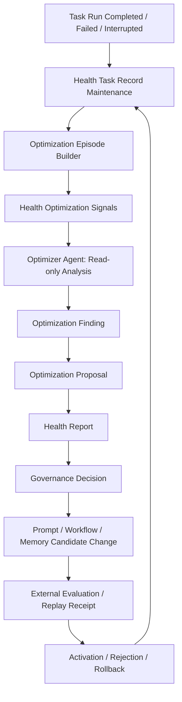

# 健康系统升级计划书：任务记录治理、优化师闭环与前端工作台重构

日期：2026-06-09

状态：待用户确认后实施

## 1. 升级目标

本计划将健康系统从“运行风险与成本治理面板”升级为“Agent 系统正向优化循环的治理中枢”。

目标不是让健康系统自动修改 prompt、workflow 或 memory policy，而是让健康系统负责：

- 管理和保护任务记录。
- 将任务记录、运行轨迹、prompt manifest、reasoning_content、tool observation、outcome、用户反馈聚合为可分析 episode。
- 让优化师 agent 基于 episode 输出结构化诊断和优化建议。
- 将优化建议沉淀为 HealthReport、OptimizationProposal 和治理决策记录。
- 为后续 prompt/workflow/memory/tool policy 的候选变更提供证据、回放依据和审批入口。

正确的终态是：

```text
任务执行
  -> 健康系统管理任务记录
  -> 构建 OptimizationEpisode
  -> 优化师只读分析
  -> 生成优化发现和候选建议
  -> 健康系统记录治理报告
  -> 人或治理层决定是否进入候选变更
  -> 对应系统执行变更、评估、灰度、回滚
  -> 健康系统继续观测效果
```

## 2. 当前系统调研结论

### 2.1 后端健康系统现状

`backend/health_system/README.md` 当前定义健康系统为 Agent 运行治理系统，负责任务风险、系统风险、Token 消耗和运行效率。现有边界强调：

```text
任务记录
  -> 运行监控
      -> 健康治理
```

当前核心模块：

- `backend/health_system/governance.py`
  聚合任务记录、运行监控、token 数据，生成 overview、task detail、risk、token usage、efficiency、maintenance view。
- `backend/health_system/models.py`
  已有 `HealthIssue`、`HealthAgentRun`、`HealthReport`、`HealthManagementCommand`、`HealthManagementReceipt`。
- `backend/health_system/store.py`
  已有 issue、report、command、receipt、agent run、conversation、agent result 的 JSONL 存储。
- `backend/health_system/registry.py`
  已有健康 issue、健康 agent run、health action、runtime contract、conversation 入口。
- `backend/api/health_system.py`
  已有 overview、tasks、task detail、risks、system risks、token usage、efficiency、maintenance、issues、reports、commands、agent-runs 等 API。

这说明健康系统已经具备“记录、聚合、报告、命令、agent run”的基础结构，适合承接优化闭环的观察和报告层。

### 2.2 任务记录与证据基础

可复用证据来源：

- Runtime trace：`backend/runtime/trace/service.py`
  已有 trace、span、event。
- Runtime fact ledger：`backend/runtime/facts/schema.py`
  默认 `model_visibility="never"`，适合存内部诊断事实。
- Prompt manifest：`backend/prompt_library/manifest.py`
  已记录 prompt refs、dynamic refs、volatile refs、cache boundary、diagnostics。
- Prompt accounting：`backend/runtime/prompt_accounting/ledger.py`
  已记录 token usage、cache、segment、stability。
- Outcome/completion verifier：`backend/runtime/outcome/completion.py`、`backend/runtime/outcome/builder.py`
  已能识别 missing deliverables、unsupported claims、completion_allowed、verification_passed。
- DeepSeek reasoning_content：
  系统已保存到 API transcript/provider protocol history，用于 DeepSeek thinking mode 和 tool-call round trip。普通 public history 不暴露它。

结论：优化师不需要读散乱日志，应由健康系统先组装 `OptimizationEpisode`，再交给优化师分析。

### 2.3 前端健康系统现状

当前前端入口：

- `frontend/src/components/workspace/views/HealthSystemView.tsx`
  单文件承载 overview、tasks、maintenance、cost 四个页面，以及大量局部组件。
- `frontend/src/features/health/useHealthSystemController.ts`
  集中加载 overview、maintenance、task detail。
- `frontend/src/features/health/healthSelectors.ts`
  生成 token chart、summary、maintenance view model。
- `frontend/src/features/health/healthFormatters.ts`
  格式化状态、风险、token、时间等。
- `frontend/src/components/health/*`
  已有 `HealthIssuePanel`、`HealthReportView`、`HealthTraceTimeline`、`HealthAgentDock`，但尚未成为健康系统主工作台的一等页面。
- `frontend/src/app/globals.css`
  包含大量 `.health-*` 样式，健康系统样式集中但偏大。

当前问题：

- 页面层级混在一个主组件里，难以扩展优化闭环。
- overview、任务记录、维护、成本、issue/report/agent dock 的信息层级尚未统一。
- 任务记录管理和优化建议还没有在同一个治理流里串起来。
- 前端组件的职责边界不够清晰，后续继续堆功能会进一步膨胀。

## 3. 外部成熟方案借鉴

本升级借鉴以下成熟思想，但不照搬：

- Reflexion：失败反馈和反思可以提升后续任务表现。
- Self-Refine：生成、反馈、修正可以形成迭代闭环。
- DSPy：prompt/program 优化应基于样本、指标和评估，而不是凭感觉改词。

本项目采用更保守的工程化版本：

```text
反思不是自动自改。
优化师只生成证据化候选建议。
核心 prompt/workflow/memory/tool policy 变更必须经过候选、评估、审批、灰度、回滚。
```

## 4. 目标架构

### 4.1 责任边界

健康系统负责：

- 任务记录生命周期管理。
- 优化 episode 构建。
- 风险、低效、失败、返工、用户纠正、unsupported claims 等信号聚合。
- reasoning_content 的内部诊断摘要和证据引用。
- 优化师 agent 的只读分析运行。
- HealthReport、OptimizationFinding、OptimizationProposal、OptimizationDecision 的持久化和展示。

健康系统不负责：

- 直接修改 prompt。
- 直接修改 workflow graph。
- 直接修改 memory policy。
- 直接执行 regression suite 或长场景实验。
- 自动让候选建议生效。

对应系统负责：

- Prompt 系统：prompt resource、prompt pack、manifest、版本和回滚。
- Workflow/Task 系统：任务图、节点、边、验证门、重试策略。
- Memory 系统：记忆候选、提交、治理和可见性。
- Runtime/Model Gateway：模型调用、provider protocol、tool round trip。
- 未来验证系统：replay、regression、canary、experiment 运行。健康系统只保存评估结果和治理收据。

### 4.2 固定执行流



### 4.3 新增数据模型

建议新增 `backend/health_system/optimization_models.py`，避免继续膨胀 `models.py`。

#### HealthOptimizationEpisode

一次任务的可分析记录。

字段：

- `episode_id`
- `task_run_id`
- `session_id`
- `task_id`
- `status`
- `terminal_reason`
- `created_at`
- `updated_at`
- `trace_refs`
- `prompt_manifest_refs`
- `reasoning_refs`
- `tool_observation_refs`
- `outcome_refs`
- `user_feedback_refs`
- `token_summary`
- `risk_signals`
- `optimization_signals`
- `evidence_refs`
- `visibility`
- `authority = "health_system.optimization_episode"`

原则：

- 保存证据引用和摘要。
- raw reasoning_content 默认不进入普通 UI。
- 需要 raw reasoning_content 时，只在内部诊断包或受控 API 中读取。

#### HealthOptimizationFinding

优化师发现的问题。

字段：

- `finding_id`
- `episode_refs`
- `finding_type`
- `root_cause_category`
- `severity`
- `confidence`
- `affected_system`
- `affected_refs`
- `evidence_refs`
- `summary`
- `diagnosis`
- `repeat_count`
- `authority = "health_system.optimization_finding"`

建议分类：

- `prompt_ambiguity`
- `prompt_conflict`
- `workflow_edge_error`
- `verification_gate_missing`
- `tool_boundary_mismatch`
- `memory_recall_mismatch`
- `context_pollution`
- `task_decomposition_error`
- `completion_premature`
- `provider_protocol_issue`
- `cost_efficiency_regression`

#### HealthOptimizationProposal

优化建议，不是实际变更。

字段：

- `proposal_id`
- `finding_refs`
- `proposal_type`
- `target_system`
- `target_refs`
- `candidate_summary`
- `candidate_patch`
- `expected_effect`
- `validation_plan`
- `risk_assessment`
- `rollback_plan`
- `status`
- `authority = "health_system.optimization_proposal"`

`proposal_type`：

- `prompt_patch_candidate`
- `workflow_patch_candidate`
- `tool_policy_candidate`
- `memory_policy_candidate`
- `verification_gate_candidate`
- `runtime_observability_candidate`

#### HealthOptimizationDecision

治理层决定。

字段：

- `decision_id`
- `proposal_ref`
- `decision`
- `decided_by`
- `reason`
- `evaluation_refs`
- `activated_refs`
- `rollback_refs`
- `created_at`
- `authority = "health_system.optimization_decision"`

`decision`：

- `needs_more_evidence`
- `accepted_for_evaluation`
- `rejected`
- `accepted_for_implementation`
- `applied`
- `rolled_back`

## 5. 优化师 Agent 设计

### 5.1 Runtime 权限

优化师 agent 应是健康系统内的系统管理 agent，但必须只读。

允许：

- `op.model_response`
- `op.memory_read`
- `op.read_file`
- `op.search_text`
- 必要时读取 runtime trace、prompt manifest、health issue、health report。

禁止：

- `op.write_file`
- `op.edit_file`
- `op.shell`
- `op.python_repl`
- `op.memory_write_candidate`
- `op.git_push`
- 直接修改 prompt/workflow/memory/runtime 配置。

### 5.2 Agent Prompt

建议新增 prompt ref：

```text
agent.health_system_agent.optimization_review.work_role
```

Prompt 草案：

```text
你是一名 Agent 系统优化师。

你只分析健康系统提供的任务记录、运行轨迹、工具观测、验证结果、prompt manifest、reasoning 摘要和用户反馈。
你不得臆测模型隐藏信息，不得把没有证据的推测当作事实。
你不得直接修改 prompt、workflow、memory、工具策略或运行配置。

你的职责是：
1. 判断任务失败、低效、返工、用户纠正或提前完成背后的系统性原因。
2. 区分问题属于 prompt、workflow、tool boundary、context、memory、verification gate、runtime protocol 还是成本效率。
3. 为每个判断提供 evidence_refs。
4. 输出结构化 finding 和 proposal。
5. 如果证据不足，必须给出 needs_more_evidence，并说明缺少哪些证据。
6. 每个优化建议必须包含验证方法和回滚建议。

你的输出必须是 JSON 对象，包含：
- findings
- proposals
- evidence_gaps
- risk_assessment
- recommended_next_action
```

### 5.3 reasoning_content 使用规则

- reasoning_content 可以作为内部诊断证据。
- 不把 raw reasoning_content 展示在普通健康系统 UI。
- 优化师可以读健康系统生成的 reasoning 摘要和 evidence ref。
- 只有调试详情或受控内部报告可引用 raw reasoning_content 的安全摘录。
- reasoning_content 不能单独作为事实依据，必须和 trace、tool observation、outcome、用户反馈交叉验证。

## 6. 后端实施计划

### Phase 0：计划确认

目标：

- 用户确认健康系统升级边界。
- 确认第一期只读，不自动改 prompt/workflow。

完成标准：

- 本计划被确认。
- 未确认前不修改核心 runtime、prompt、workflow、memory。

### Phase 1：优化数据模型与存储

新增：

- `backend/health_system/optimization_models.py`
- `backend/health_system/optimization_store.py` 或扩展 `store.py`

修改：

- `backend/health_system/__init__.py`
- `backend/health_system/store.py`
- `backend/health_system/README.md`

实现：

- `append_optimization_episode`
- `list_optimization_episodes`
- `append_optimization_finding`
- `list_optimization_findings`
- `append_optimization_proposal`
- `list_optimization_proposals`
- `append_optimization_decision`
- `list_optimization_decisions`

完成标准：

- 新模型可序列化、反序列化。
- JSONL 存储可追加和读取。
- 不影响现有 issue/report/command API。

### Phase 2：Episode Builder

新增：

- `backend/health_system/optimization_episode_builder.py`

修改：

- `backend/health_system/governance.py`
- `backend/api/health_system.py`

API：

- `GET /api/health-system/optimization/overview`
- `GET /api/health-system/tasks/{task_run_id}/optimization`

实现：

- 从 `build_task_detail` 结果构建 episode。
- 合并 task record、risks、recent_events、prompt_accounting、outcome、trace refs。
- 接入 api transcript/provider protocol 的 reasoning_content 元数据，但默认只输出摘要和 ref。

完成标准：

- 单个 task_run_id 可生成稳定 episode。
- 无 reasoning_content 的任务也能分析。
- 证据不足时明确返回 evidence_gaps。

### Phase 3：优化师只读分析

新增：

- `backend/health_system/optimization_agent.py`
- `backend/health_system/optimization_report_builder.py`

修改：

- `backend/health_system/registry.py`
- `backend/health_system/runtime_lane_registry.py` 或相关 lane 注册位置
- `backend/agent_system/profiles/runtime_profile_registry.py`
- `backend/prompt_library/agent_prompts.py`
- `backend/api/health_system.py`

新增 health action：

```text
agent_optimization_review
```

新增 report type：

```text
agent_optimization_report
prompt_optimization_candidate
workflow_optimization_candidate
context_policy_optimization_candidate
tool_boundary_optimization_candidate
verification_gate_optimization_candidate
```

完成标准：

- 对一个 HealthIssue 或 task_run_id 启动优化师分析。
- 产出 HealthReport 和 OptimizationProposal。
- 只读权限被验证。
- 不产生 prompt/workflow/memory 实际变更。

### Phase 4：治理决策与候选状态

新增或扩展：

- `backend/health_system/optimization_governance.py`
- `backend/api/health_system.py`

API：

- `GET /api/health-system/optimization/proposals`
- `GET /api/health-system/optimization/proposals/{proposal_id}`
- `POST /api/health-system/optimization/proposals/{proposal_id}/decisions`

完成标准：

- proposal 有状态流转。
- decision 有 receipt。
- rejected、needs_more_evidence、accepted_for_evaluation 可记录。
- 不触发真实系统变更。

### Phase 5：未来评估系统对接

本阶段只设计接口，不把评估执行挂进健康系统。

健康系统可记录：

- replay request ref
- regression suite ref
- evaluation receipt
- canary metrics
- rollback receipt

实际评估执行由独立验证系统或对应领域系统负责。

完成标准：

- 健康系统能展示评估状态。
- 健康系统不运行测试和实验。

## 7. 前端重构计划

### 7.1 产品定位

产品类型：

```text
Agent 运行治理工作台
```

用户角色：

- Agent 系统设计者
- 运行治理/调试人员
- prompt/workflow/memory 维护者

主对象：

- Task Record
- Optimization Episode
- Optimization Finding
- Optimization Proposal
- Health Issue
- Health Report

界面类型：

```text
密集型治理工作台，不是营销页，不是单纯 dashboard。
```

### 7.2 信息架构

重构后健康系统分为六个一级页面：

1. `总览`
   系统健康结论、关键风险、正向优化循环状态。

2. `任务记录`
   任务记录列表、任务详情、trace、outcome、prompt accounting、reasoning 摘要入口。

3. `优化循环`
   OptimizationEpisode、Finding、Proposal、Decision。这里是新增核心页。

4. `问题与报告`
   HealthIssue、HealthReport、HealthAgentRun、TraceTimeline、HealthAgentDock。

5. `成本与效率`
   Token usage、cache savings、efficiency、低效任务。

6. `维护治理`
   task record maintenance、保护规则、维护回执。

原则：

- 不把不同层级混在一页。
- 一级页面用清晰的卡片式入口或 segmented navigation。
- 工作台内部用三栏布局：列表、详情、检查器。
- 任务记录页不直接承担优化建议页的职责。
- 优化循环页不直接承担问题聊天或成本图表职责。

### 7.3 视觉方向

基于 UI/UX 设计检索，适合采用：

- Data-Dense + Drill-Down
- Operational Dashboard
- Dense workbench

但需要根据项目规则做调整：

- 避免全页面紫色或蓝紫渐变。
- 采用安静的中性色底，局部使用 teal、amber、red、indigo 标识状态。
- 卡片圆角不超过 8px。
- 使用 lucide icons。
- 不使用装饰性 orb、bokeh、营销式 hero。
- 不用可见文案解释“怎么使用系统”，界面文字只表达对象和状态。
- 保持专业、紧凑、可扫描。

建议色彩：

```text
Background: #F6F7F8
Surface: #FFFFFF
Ink: #172026
Muted: #64707D
Border: #D9E0E6
Teal: #0F766E
Amber: #B7791F
Red: #B42318
Indigo: #4F46E5
```

### 7.4 前端文件重构

当前：

- `frontend/src/components/workspace/views/HealthSystemView.tsx` 过大。
- `useHealthSystemController.ts` 同时负责 overview、maintenance、detail。
- `healthSelectors.ts` 同时承担 token、maintenance、task selection。
- `globals.css` 健康系统样式过于集中。

目标结构：

```text
frontend/src/components/workspace/views/HealthSystemView.tsx
  仅保留页面入口和 HealthSystemWorkbench 挂载。

frontend/src/features/health/workbench/HealthSystemWorkbench.tsx
  健康系统工作台 shell。

frontend/src/features/health/workbench/HealthSystemNav.tsx
  一级页面切换。

frontend/src/features/health/pages/HealthOverviewPage.tsx
frontend/src/features/health/pages/HealthTaskRecordsPage.tsx
frontend/src/features/health/pages/HealthOptimizationPage.tsx
frontend/src/features/health/pages/HealthIssuesReportsPage.tsx
frontend/src/features/health/pages/HealthCostEfficiencyPage.tsx
frontend/src/features/health/pages/HealthMaintenancePage.tsx

frontend/src/features/health/components/HealthMetricStrip.tsx
frontend/src/features/health/components/HealthTaskRecordList.tsx
frontend/src/features/health/components/HealthTaskRecordDetail.tsx
frontend/src/features/health/components/HealthOptimizationEpisodePanel.tsx
frontend/src/features/health/components/HealthOptimizationProposalPanel.tsx
frontend/src/features/health/components/HealthEvidenceInspector.tsx
frontend/src/features/health/components/HealthDecisionTimeline.tsx

frontend/src/features/health/hooks/useHealthOverview.ts
frontend/src/features/health/hooks/useHealthTaskRecords.ts
frontend/src/features/health/hooks/useHealthOptimization.ts
frontend/src/features/health/hooks/useHealthMaintenance.ts

frontend/src/features/health/selectors/healthOverviewSelectors.ts
frontend/src/features/health/selectors/healthTaskSelectors.ts
frontend/src/features/health/selectors/healthOptimizationSelectors.ts
frontend/src/features/health/selectors/healthCostSelectors.ts

frontend/src/features/health/healthFormatters.ts
  保留通用格式化。
```

CSS 处理：

- 第一阶段可继续使用 `frontend/src/app/globals.css`，但删除旧健康系统冗余样式。
- 新样式统一使用 `health-workbench-*`、`health-optimization-*`、`health-record-*` 命名前缀。
- 如果项目后续允许 CSS Modules，再迁移为模块化样式。当前阶段不强行改变全局 CSS 体系。

### 7.5 页面设计细节

#### 总览页

布局：

- 顶部 status strip：任务数、风险数、优化候选数、待决策数、token 总量。
- 左侧：风险摘要。
- 中央：优化循环状态。
- 右侧：最近治理动作。

不展示 raw reasoning。

#### 任务记录页

布局：

- 左栏：任务记录表，可按风险、状态、token、时间过滤。
- 中栏：任务详情，包含 outcome、trace、prompt accounting、recent events。
- 右栏：证据检查器，展示 prompt manifest refs、reasoning summary ref、tool observation refs、outcome refs。

操作：

- 生成优化 episode。
- 创建健康 issue。
- 启动优化师分析。

#### 优化循环页

布局：

- 左栏：episodes/findings/proposals 切换列表。
- 中栏：当前 proposal 详情。
- 右栏：治理决策、验证计划、风险和回滚建议。

状态：

- needs_more_evidence
- proposed
- accepted_for_evaluation
- rejected
- accepted_for_implementation
- applied
- rolled_back

#### 问题与报告页

复用并整理：

- `HealthIssuePanel`
- `HealthReportView`
- `HealthTraceTimeline`
- `HealthAgentDock`

目标：

- 不再作为散落组件，而是成为完整问题处理工作台。

#### 成本与效率页

保留现有 token/cost 能力，但拆成独立 page。

增强：

- 关联低效任务到 OptimizationEpisode。
- 显示成本异常是否已形成 finding。

#### 维护治理页

保留现有 task record maintenance。

增强：

- 受保护原因更清晰。
- 显示哪些记录因为没有健康报告或优化报告而被保护。

## 8. 前端实施阶段

### UI Phase 1：拆分工作台 shell

目标：

- `HealthSystemView.tsx` 变薄。
- 引入 `HealthSystemWorkbench`。
- 一级页面导航从数据页面解耦。

完成标准：

- 现有 overview/tasks/maintenance/cost 功能不丢失。
- UI 层级清晰。
- 现有 tests 通过。

### UI Phase 2：任务记录页重构

目标：

- 任务记录列表、详情、证据检查器独立组件化。
- task detail 加入 optimization signals 占位。

完成标准：

- 选择任务、加载 detail、错误状态、空状态完整。
- 不与维护页混用职责。

### UI Phase 3：优化循环页

目标：

- 接入新增 optimization API。
- 展示 episodes、findings、proposals、decisions。
- 支持启动优化师分析。

完成标准：

- 无数据时显示明确空状态。
- 有 proposal 时能看证据、建议、验证计划、回滚计划。
- 不展示 raw reasoning_content。

### UI Phase 4：问题与报告页整合

目标：

- 将 `HealthIssuePanel`、`HealthReportView`、`HealthTraceTimeline`、`HealthAgentDock` 纳入统一页面。
- 调整 HealthAgentDock 的角色，从浮动玩具感变成工作台辅助分析器。

完成标准：

- issue 选择、agent run、trace report、报告展示链路完整。
- 组件文字不混入开发式说明。

### UI Phase 5：样式清理

目标：

- 删除旧健康页面的冗余 CSS。
- 统一新命名和视觉规则。

完成标准：

- 不保留旧页面壳里的重复布局。
- 移动端、平板、桌面无重叠和横向滚动。

## 9. API 计划

新增 API：

```text
GET  /api/health-system/optimization/overview
GET  /api/health-system/tasks/{task_run_id}/optimization
POST /api/health-system/tasks/{task_run_id}/optimization/episodes
POST /api/health-system/tasks/{task_run_id}/optimization/review
GET  /api/health-system/optimization/proposals
GET  /api/health-system/optimization/proposals/{proposal_id}
POST /api/health-system/optimization/proposals/{proposal_id}/decisions
```

现有 API 保持：

```text
/api/health-system/overview
/api/health-system/tasks
/api/health-system/tasks/{task_run_id}
/api/health-system/task-records/maintenance
/api/health-system/task-records/prune
/api/health-system/issues
/api/health-system/reports
/api/health-system/agent-runs
```

不删除现有 API，但前端不再把旧数据流混在单页里。

## 10. 迁移与切换规则

### 10.1 数据迁移

第一期不需要迁移旧数据。

优化记录使用新增 JSONL 文件：

```text
health_system/optimization_episodes.jsonl
health_system/optimization_findings.jsonl
health_system/optimization_proposals.jsonl
health_system/optimization_decisions.jsonl
```

旧 issue/report/command/receipt 不改结构。

### 10.2 前端切换

切换策略：

- 先用新 Workbench 复刻旧功能。
- 再接入优化循环。
- 最后删除旧 `HealthSystemView.tsx` 内部大段页面逻辑。

允许短暂存在 wrapper，但不允许长期保留旧页面主链路。

### 10.3 回滚

后端回滚：

- 新 API 和新 JSONL 是增量，不影响旧 API。
- 如果优化功能失败，可隐藏前端入口，保留旧健康系统。

前端回滚：

- 若新工作台有严重问题，可临时恢复旧 `HealthSystemView.tsx`。
- 计划实施完成后，不保留双主链路。若要回滚，使用 git 级回滚，不在代码里留下永久兼容壳。

## 11. 验证计划

### 后端测试

新增或更新：

- `backend/tests/health_optimization_models_test.py`
- `backend/tests/health_optimization_store_test.py`
- `backend/tests/health_optimization_episode_builder_test.py`
- `backend/tests/health_optimization_api_test.py`
- `backend/tests/health_optimization_agent_policy_test.py`

验证：

- episode 构建不依赖 reasoning_content。
- reasoning_content 只作为内部诊断证据，不进入 public payload。
- optimization proposal 不会触发真实 prompt/workflow/memory 修改。
- HealthReport 可保存优化报告。
- proposal decision 状态流转正确。

### 前端测试

新增或更新：

- `frontend/src/features/health/healthSelectors.test.ts`
- `frontend/src/features/health/selectors/healthOptimizationSelectors.test.ts`
- `frontend/src/features/health/workbench/HealthSystemWorkbench.test.tsx`
- `frontend/src/features/health/pages/HealthOptimizationPage.test.tsx`

验证：

- 页面切换不会丢失 selected task。
- 空状态、加载状态、错误状态可见。
- proposal 状态展示正确。
- raw reasoning_content 不在普通页面渲染。

### 真实运行验证

涉及运行链路和前端改动，实施时必须使用固定端口真实启动：

```text
前端： http://127.0.0.1:3000
后端： http://127.0.0.1:8003
API：  http://127.0.0.1:8003/api
```

验证步骤：

1. CLI 启动后端 8003。
2. CLI 启动前端 3000，必要时先清理 `.next`。
3. 打开健康系统页面。
4. 验证 overview、任务记录、维护、成本与效率。
5. 验证优化循环页空状态。
6. 用已有 task_run_id 生成 episode。
7. 启动优化师只读分析。
8. 查看 report/proposal/decision。
9. 检查控制台无 React error。
10. 检查移动端宽度无文本重叠。

## 12. 风险控制

### 12.1 自我修改风险

风险：

优化师根据一次任务失败直接建议并触发 prompt 修改。

控制：

- 优化师只读。
- proposal 只是候选。
- 变更必须由 prompt/workflow/memory 对应系统接收。
- 健康系统不直接调用写入接口。

### 12.2 reasoning_content 滥用风险

风险：

把 reasoning_content 当成绝对真实的思维事实。

控制：

- reasoning_content 只作为诊断证据。
- 必须与 trace、tool observation、outcome、user feedback 交叉验证。
- 普通 UI 不展示 raw reasoning_content。

### 12.3 健康系统职责膨胀

风险：

健康系统重新变成测试、实验、修复、执行系统。

控制：

- 健康系统只记录 evaluation receipt，不运行实验。
- 修复由对应系统执行。
- README 明确新边界。

### 12.4 前端重构过度

风险：

一次性大改导致健康系统不可用。

控制：

- 先拆 shell，后接优化页。
- 每阶段保持现有功能可用。
- 删除旧代码只在新页面覆盖后进行。

## 13. 文件级执行清单

### 后端

- `backend/health_system/README.md`
  更新定位和职责边界。

- `backend/health_system/optimization_models.py`
  新增 episode、finding、proposal、decision 数据模型。

- `backend/health_system/store.py`
  增加优化记录 JSONL 读写。

- `backend/health_system/optimization_episode_builder.py`
  从 task detail、trace、prompt accounting、outcome、reasoning refs 构建 episode。

- `backend/health_system/optimization_report_builder.py`
  将优化师输出转换为 HealthReport 和 proposal。

- `backend/health_system/registry.py`
  增加 `agent_optimization_review` health action。

- `backend/health_system/governance.py`
  增加 optimization overview 和 task optimization detail。

- `backend/api/health_system.py`
  增加 optimization API。

- `backend/agent_system/profiles/runtime_profile_registry.py`
  增加或调整只读优化师 profile。

- `backend/health_system/runtime_lane_registry.py`
  增加只读优化分析 lane，或复用现有 trace read lane 并明确 health_action。

- `backend/prompt_library/agent_prompts.py`
  增加健康系统优化师 prompt。

### 前端

- `frontend/src/components/workspace/views/HealthSystemView.tsx`
  改为薄入口。

- `frontend/src/features/health/workbench/HealthSystemWorkbench.tsx`
  新增工作台 shell。

- `frontend/src/features/health/workbench/HealthSystemNav.tsx`
  新增一级页面导航。

- `frontend/src/features/health/pages/HealthOverviewPage.tsx`
  拆出总览页。

- `frontend/src/features/health/pages/HealthTaskRecordsPage.tsx`
  拆出任务记录页。

- `frontend/src/features/health/pages/HealthOptimizationPage.tsx`
  新增优化循环页。

- `frontend/src/features/health/pages/HealthIssuesReportsPage.tsx`
  整合 issue、report、trace、agent dock。

- `frontend/src/features/health/pages/HealthCostEfficiencyPage.tsx`
  拆出成本与效率页。

- `frontend/src/features/health/pages/HealthMaintenancePage.tsx`
  拆出维护治理页。

- `frontend/src/features/health/hooks/*`
  拆分 controller。

- `frontend/src/features/health/selectors/*`
  拆分 view model。

- `frontend/src/lib/api.ts`
  增加 optimization 类型和 API client。

- `frontend/src/app/globals.css`
  清理旧 health CSS，加入新工作台样式。

## 14. 不允许的实现方式

- 不允许让优化师直接写 prompt 文件。
- 不允许让健康系统直接 patch workflow graph。
- 不允许把 raw reasoning_content 展示给普通用户。
- 不允许把一次失败直接升级为全局 prompt 修改。
- 不允许为了让测试通过而 mock 掉核心分析逻辑。
- 不允许保留新旧两套健康系统主页面长期并存。
- 不允许用“兼容”名义保留废弃 UI 分支。

## 15. 第一阶段建议交付物

第一阶段实施后应具备：

- 健康系统 README 新边界。
- OptimizationEpisode 数据模型和存储。
- 单任务 episode 构建 API。
- 健康系统前端新 Workbench shell。
- 旧 overview/tasks/maintenance/cost 功能迁入新页面。
- Optimization 页显示空状态和 task episode 入口。
- 测试覆盖 episode 模型、存储、API 和基础前端 selector。

第一阶段不做：

- 自动 prompt 修改。
- workflow patch 生效。
- replay/regression 执行。
- raw reasoning_content 展示。

