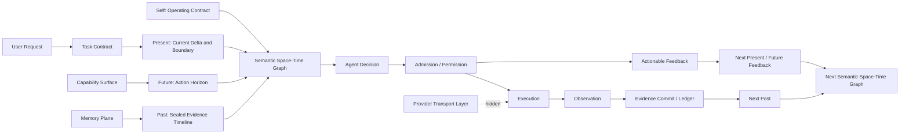

# Agent Semantic Operating Model

日期：2026-06-28  
状态：设计文档，作为后续语义空间重构、能力系统重构、工具契约重构和缓存优化的上层模型。

## 1. 问题定义

当前系统的问题不是单纯的 prompt 过长、dynamic tail 过重、工具契约不统一或 provider cache 未命中。这些只是外显症状。真正缺失的是一个统一的 agent 智力构造模型：系统还没有明确规定 agent 应该如何认识任务、如何发现能力、如何获得证据、如何理解权限边界、如何从失败反馈中继续推进，以及哪些语义应该稳定、哪些语义只能当前回合有效。

正确目标不是继续维护散装语义空间，而是建立一个产品级的 Agent Semantic Operating Model。它应该像一个语义操作系统，把信息、状态、能力、权限、证据、反馈、缓存和 provider transport 放到各自的层级中，让 agent 每一回合都能清楚理解：

- 我是谁，当前目标是什么。
- 我已经知道什么，哪些事实需要验证。
- 我可以使用什么能力，如何获取更多信息。
- 当前权限、预算、工具状态和运行边界是什么。
- 上一轮行动发生了什么，为什么失败或成功。
- 下一步应该继续观察、调用工具、询问用户、阻塞还是交付。

本文档的目标是定义这套模型，并把它映射到当前代码结构和后续落地计划。

## 2. 成熟参考

本模型参考成熟 agent 产品和协议的共同结构，而不是复制任何单一框架。

- Anthropic 的 agent 经验强调：workflow 是预定义代码路径，agent 是模型根据环境反馈动态决定工具和流程；成熟 agent 必须让模型在执行中获得环境反馈并持续推进。参考：[Building effective agents](https://www.anthropic.com/research/building-effective-agents)。
- OpenAI Agents SDK 将 agent 拆成 instructions、tools、handoffs、guardrails、sessions 和 tracing，说明成熟 agent 不是一段 prompt，而是运行时、工具、会话和保护边界的组合。参考：[OpenAI Agents SDK](https://openai.github.io/openai-agents-python/)。
- MCP 把能力分成 tools、resources、prompts。Tools 是可执行动作，resources 是上下文来源，prompts 是工作流模板。这对本项目区分 Tools、MCP、Skills 很关键。参考：[MCP Specification](https://modelcontextprotocol.io/specification/2025-06-18)。
- LangGraph 区分 thread-level checkpoint 和 cross-thread store，适合本项目区分短期运行状态、可恢复状态和长期记忆。参考：[LangGraph persistence](https://langchain-ai.github.io/langgraph/concepts/persistence/)。
- LangChain / LangGraph 的 human-in-the-loop 将中断、审批、编辑、拒绝和继续执行表达成运行时反馈，而不是静默停止。参考：[Human-in-the-loop](https://docs.langchain.com/oss/python/langchain/human-in-the-loop)。

这些参考的共同结论是：agent 的智能不只在模型里，也在语义空间结构里。系统需要组织环境，让模型能稳定地感知、判断、行动和恢复。

## 3. 本项目现有基础

当前项目已经有几个正确雏形，应该保留并提升为统一模型。

| 当前模块 | 现有职责 | 应进入的新模型层 |
|---|---|---|
| `backend/runtime/context_management/context_pipeline.py` | 上下文候选、capability filter、ledger、physical plan 的主入口 | Context Physical / Ledger Pipeline |
| `backend/runtime/context_management/context_segment_policy.py` | stable / append / dynamic tail 的分段策略 | Context Segment Policy |
| `backend/runtime/context_management/provider_visible_context_ledger.py` | provider-visible 历史上下文封存和 replay | Sealed Timeline Ledger |
| `backend/harness/runtime/tool_call_contract.py` | provider tool selection 和 action object 工具契约分离 | Action Contract / Tool Transport Boundary |
| `backend/harness/runtime/dynamic_context/runtime_delta_projector.py` | 当前运行边界投影 | Current Runtime Boundary |
| `backend/harness/runtime/incremental_context_frame.py` | 当前 invocation delta 游标 | Current Delta Cursor |
| `backend/memory_system/runtime_context_provider.py` | runtime memory 选择和投影 | Memory Plane |
| `backend/capability_system/*` | tools / MCP / skills 目录和供给包 | Capability Registry / Resolver |
| `backend/harness/graph*` -> target `backend/graph_system` | 可执行图拓扑、图运行状态、图调度、checkpoint、graph work order | Graph Execution System |

当前主要缺口：

- 语义空间还没有统一的图模型，仍然主要靠 message spec、kind、metadata 和 prompt 文本约定连接。
- 可执行图系统当前还挂在 `harness` 下，容易让图状态机、图调度和 agent 语义控制混层；后续应独立为 `graph_system`，由 harness 通过 adapter 执行图节点 agent work order。
- `context_segment_policy` 解决了物理位置和缓存策略，但还没有完整表达 agent 认知层级。
- Tool、MCP、Skill 的能力生命周期没有完全统一，容易在 prompt、runtime、provider transport 中混层。
- Runtime boundary、permission feedback、model action repair、tool observation feedback 还没有完全统一成同一种 agent 可理解的行动反馈。
- Cache 诊断已经能发现前缀漂移，但还需要以语义层级解释“哪些 miss 是合理动态，哪些是语义污染”。

## 4. 核心产品模型

目标模型命名为：

```text
Agent Semantic Operating Model
```

内部核心数据结构命名为：

```text
Semantic Space-Time Graph
```

它不是直接给模型看的 JSON 大对象，而是运行时内部的统一语义图。最终 prompt、provider payload、前端 inspector、缓存诊断、权限反馈都从这张图投影出来。

### 4.1 固定智力链

```text
User Request
-> Intent / Task Contract
-> Semantic Space-Time Graph
-> Capability Resolver
-> Current Runtime Boundary
-> Agent Decision
-> Admission / Permission
-> Execution
-> Observation
-> Evidence Commit
-> Next Semantic Space-Time Graph
```

关键原则：

- Agent 决定下一步行动。
- 系统组织语义空间，不替 agent 改写意图。
- 系统可以拒绝越界执行，但必须把拒绝转成 agent 可理解的反馈。
- 历史事实只能 replay，不能重新决定当前边界。
- Provider transport 是隐藏传输层，不进入 agent 记忆层。

### 4.2 语义时间四段

当前系统可以继续使用四段物理拼接来服务 provider cache、ledger replay 和 dynamic tail，但 agent 真正需要理解的不是物理段名，而是语境上的时间结构：

```text
Self
-> Past
-> Present
-> Future
```

补充说明：`Self / Past / Present / Future` 暂时是本项目的哲学模型和上层语义判断框架，不直接作为代码落地约束。它用于帮助设计者判断语义空间是否清楚、是否存在污染、是否让 agent 能理解自己、过去事实、当前现实和下一步行动空间；后续如果要工程化为字段、目录、prompt 结构或 runtime contract，必须另写实施计划并确认，不应直接把这套哲学模型硬塞进代码。

四段语义时间的定义：

| 语义时间 | agent 看到的意义 | 典型内容 | 稳定性 |
|---|---|---|---|
| Self | 我是谁，我长期遵守什么，我以什么方式行动 | operating identity、长期系统契约、稳定行动语法、稳定工具使用原则 | invariant / stable |
| Past | 已经发生什么，哪些事实已经被观察或封存 | sealed history、tool observations、file evidence、ledger、已提交结果、需验证的 memory hints | append-only / replay |
| Present | 当前这一回合真实发生了什么，当前边界是什么 | 用户最新输入、当前任务 delta、当前权限、预算、运行边界、刚发生的 denial / observation / repair feedback | current turn |
| Future | 下一步可以怎样推进，哪些行动空间可用 | 当前可用能力、可执行工具面、待完成目标、下一步约束、可恢复路径、是否需要询问用户 | current action horizon |

关键规则：

- `Self` 不是过去；它是 agent 的自我结构和长期契约。
- `Past` 是已发生事实，必须可 replay，但不能重新授权当前行动。
- `Present` 只描述当前现实，不能混入长期身份，也不能把历史边界当成当前边界。
- `Future` 提供行动空间，不替 agent 决策。
- provider tools sidecar 属于 hidden transport，不属于 Self / Past / Present / Future 任一语义时间。

物理分段和语义时间的映射：

| 物理层 | 主要服务 | 可承载的语义时间 | 禁止 |
|---|---|---|---|
| stable prefix | provider cache、长期规则稳定 | Self，以及稳定能力原则 | 放入当前权限、当前工具结果、当前 sidecar hash |
| sealed / append context | 历史 replay、证据复用 | Past | 改写已封存字节、把旧边界 replay 成当前授权 |
| current delta | 当前输入和运行状态 | Present | 重复注入 Self、吞并 Past 证据 |
| dynamic tail / action tail | 当前反馈和下一步行动空间 | Present + Future，但必须用节点分开 | 把反馈、权限、工具面、下一步提示混成不可诊断文本块 |
| provider transport sidecar | provider request 绑定 | 无 agent 语义时间 | 进入 agent memory、stable prompt 或 sealed history |

因此，后续优化 dynamic tail 时，目标不是简单缩短文本，而是把 `Present` 和 `Future` 分成不同 `ContextContractNode`，让 agent 清楚地区分“现在发生了什么”和“下一步能怎么推进”。

### 4.3 八层语义空间

| 层级 | 名称 | agent 看到的意义 | 稳定性 | 典型来源 |
|---|---|---|---|---|
| L1 | Operating Identity | 我是谁，长期规则是什么 | 稳定 | agent profile、项目规则、AGENTS.md |
| L2 | Task Contract | 当前任务目标、范围、验收是什么 | task stable | task run contract、work mode contract |
| L3 | Capability Surface | 我有哪些能力，如何获取更多信息 | stable index + current availability | tool catalog、MCP、skills |
| L4 | Memory Plane | 可参考的偏好、长期事实、架构记忆 | selected / must verify | memory provider |
| L5 | Evidence Timeline | 已经发生过什么，哪些事实已确认 | append-only | tool transcript、file evidence、observations |
| L6 | Current Runtime Boundary | 本轮能做什么，权限和预算是什么 | current request only | runtime delta projector |
| L7 | Action / Feedback Loop | 上轮反馈、失败原因、下一步要求 | current / append when observed | admission、executor、repair feedback |
| L8 | Provider Transport Layer | provider tools、API 参数、sidecar | hidden current request | provider payload adapter |

Agent 可见 prompt 只能由 L1-L7 投影。L8 只允许影响 provider request，不允许作为 agent memory 或历史上下文出现。

八层语义空间是“职责层级”，四段语义时间是“agent 的语境时间”。两者需要同时标注：例如 L3 Capability Surface 的稳定能力原则属于 Self，但当前可用工具和下一步选择属于 Future；L7 Action Feedback 中刚发生的拒绝属于 Present，它提供的可恢复路径属于 Future。

### 4.4 语义时空图



图上的核心边：

- `supports`：记忆、证据、工具能力支持当前判断。
- `authorizes`：运行边界授权当前行动类型。
- `requests_more_info`：agent 通过能力面获取更多事实。
- `observes`：工具执行后产生观察。
- `commits`：观察被封存到 evidence timeline。
- `supersedes`：新的运行边界覆盖旧边界。
- `rejects_with_feedback`：权限拒绝转成可恢复反馈。

## 5. 标准上下文契约节点

每个进入语义空间的片段都应该先归一成 `ContextContractNode`，再投影成 prompt message、ledger entry、cache segment 或 inspector 视图。

建议字段：

```text
node_id
semantic_kind
semantic_layer
semantic_time
authority
source_ref
scope
ttl
visibility
agent_use_contract
commit_policy
replay_policy
cache_tier
content_mode
refs
supersedes
diagnostics
```

字段解释：

| 字段 | 含义 |
|---|---|
| `semantic_kind` | operating_contract、task_contract、capability_surface、memory_hint、evidence、runtime_boundary、feedback、action_horizon 等 |
| `semantic_layer` | L1-L8 |
| `semantic_time` | Self、Past、Present、Future、HiddenTransport |
| `authority` | 谁有权产生这个节点 |
| `scope` | global、project、session、task、turn、provider_request |
| `ttl` | stable、append_only、current_turn、current_provider_request |
| `visibility` | agent_visible、runtime_hidden、provider_transport |
| `agent_use_contract` | agent 应该如何使用这段信息 |
| `commit_policy` | never_commit、append_once、seal_on_provider_success |
| `replay_policy` | replay_as_history、current_only、never_replay |
| `cache_tier` | provider_global、session、task、volatile、hidden |
| `content_mode` | full、summary、ref_only、cursor |

硬规则：

- 没有 `agent_use_contract` 的 agent-visible 片段不能进入 prompt。
- `provider_transport` 节点不能进入 provider-visible history。
- `current_provider_request` 节点不能 seal 成当前授权。
- `append_only` 节点一旦 provider success，后续 replay 字节不可改。
- `memory_hint` 必须声明需要当前证据验证。
- `runtime_boundary` 必须声明有效期和覆盖规则。
- agent-visible 节点必须声明 `semantic_time`，并且不能把 `Present` 与 `Future` 合并成不可诊断的动态尾文本。
- `HiddenTransport` 只能用于 L8 provider transport，不能投影为 agent-visible prompt。

## 6. Agent 可见语义投影

Agent 每回合收到的语义空间不应是内部字段堆叠，而应是清晰的时间化操作地图：先知道自己是谁，再理解过去事实，再看清当前现实，最后看到下一步行动空间。

目标顺序：

```text
Self: Operating Contract
-> Self: Stable Action / Capability Principles
-> Past: Sealed Evidence Timeline
-> Past: Selected Memory Hints
-> Present: Task Contract and Current User Delta
-> Present: Current Runtime Boundary
-> Present: Current Feedback / Observation Cursor
-> Future: Agent Capability Surface
-> Future: Action Horizon / Recovery Options
```

每段都要回答一个具体问题：

| 语义时间 | 段 | 回答的问题 |
|---|---|---|
| Self | Operating Contract | 你是谁，长期遵守什么 |
| Self | Stable Action / Capability Principles | 你通常如何选择能力、如何表达行动 |
| Past | Sealed Evidence Timeline | 已经确认过什么 |
| Past | Selected Memory Hints | 哪些偏好或长期信息可参考，哪些仍需验证 |
| Present | Task Contract and Current User Delta | 当前任务和最新输入到底是什么 |
| Present | Current Runtime Boundary | 本轮允许做什么，权限和预算是什么 |
| Present | Feedback / Observation Cursor | 上一步刚发生了什么 |
| Future | Agent Capability Surface | 你现在可以怎样获取更多信息或执行动作 |
| Future | Action Horizon / Recovery Options | 下一步有哪些可恢复、可推进、可询问的路径 |

禁止的投影：

- 把 `dynamic_tail`、`cache_role`、`provider sidecar`、`runtime node` 当作 agent 语义。
- 同一含义用两个名字重复出现，例如 `action_surface` 和 `model_decision_contract` 同时表达同一动作面。
- 把稳定工具 schema 同时塞进 message prefix 和 provider sidecar。
- 把历史运行边界 replay 成当前授权。
- 把权限拒绝表达成系统停止，而不是行动反馈。
- 用一个 dynamic tail 同时表达 Present 和 Future，导致 agent 分不清当前事实与下一步行动空间。

## 7. 能力系统模型

Tools、MCP、Skills 必须进入同一个 Capability 模型，但不能混成同一种东西。

```text
Capability Package
-> Capability Registry
-> Capability Resolver
-> Runtime Supply Package
-> Agent Capability Surface
-> Provider Transport Binding
-> Admission / Execution
-> Observation / Audit
```

| 类型 | 本质 | 是否执行 | 是否进入 prompt | 远程安装 |
|---|---|---:|---:|---:|
| Tool | 本地运行时执行单元 | 是 | 只投影能力摘要和 schema ref | 不作为第一优先级 |
| MCP | 外部或本地 MCP provider | 通过 MCP client | 只投影授权后的 tool/resource/prompt | 是 |
| Skill | 知识、流程、提示词、资源包 | 否，除非调用工具 | 仅激活时注入 | 是 |

目标规则：

- Capability Registry 是事实源。
- Capability Resolver 根据任务、权限、环境、profile 选择当前可用能力。
- Agent Capability Surface 只告诉 agent 能做什么、怎么选择，不放 provider transport detail。
- Provider sidecar 只从同一 capability ref 派生，是隐藏传输绑定。
- MCP tool 必须经过同一 permission admission。
- Skill 不能伪装成 tool；Skill 是认知和流程增强，不是执行通道。

## 8. 权限与反馈模型

权限系统不是 agent 的上级决策者。权限系统负责边界执行和反馈生成。

正确链路：

```text
Agent Action Proposal
-> Admission
-> Permit / Reject / Needs Approval
-> Execution or Feedback
-> Agent Re-decides
```

拒绝反馈必须包含：

- 被拒绝的 action 或 tool。
- 拒绝原因。
- 当前仍可用的动作。
- 如何继续推进。
- 是否需要询问用户。

禁止：

- 过权限边界后直接停止 agent。
- 工具次数耗尽后静默终止。
- 用系统安全名义阻断 agent 合法表达。
- 让权限层重新解释用户目标。

权限层的合法职责：

- 校验工具名、参数、文件写入边界、网络边界、审批要求。
- 拒绝越界执行。
- 将拒绝转成 `ActionableFeedback`。
- 记录审计。

## 9. 记忆与证据模型

记忆不是证据。记忆只是定位线索和偏好提示。

模型分层：

```text
Long-term Memory Hint
-> Current Evidence Verification
-> Sealed Evidence Timeline
-> Agent Reasoning
```

规则：

- Memory Plane 输出 action-oriented memory hints，不输出维护流水。
- 记忆必须带 `requires_verification_before_use=true`。
- 文件事实、工具结果、运行结果必须来自 Evidence Timeline。
- 已封存 evidence 只能 append/replay，不重新摘要覆盖。
- 读文件复用应表达为 freshness confirmation，而不是重新播放旧全文。

## 10. 缓存模型

缓存优化不应压倒语义正确性。正确目标是让语义分层自然形成稳定前缀。

缓存层级：

| cache tier | 主要语义时间 | 内容 |
|---|---|---|
| provider_global | Self | global static、稳定 action schema、长期行动原则 |
| session | Self | operating identity、project rules、稳定 capability index |
| task | Self / Past | task contract、artifact scope、sealed task state |
| append-only | Past | tool transcript、read evidence、memory evidence |
| volatile | Present / Future | current runtime boundary、feedback cursor、current invocation state、action horizon |
| hidden | HiddenTransport | provider sidecar、API params |

判断标准：

- 第三轮 cache hit rate 比第二轮更重要。
- 第二轮常受 provider 自动缓存预热块影响，不作为主要判断。
- 如果 stable prefix hash 全等但 provider cached tokens 波动，先判断 provider 回读块，不判定语义漂移。
- 语义污染的定义是：稳定 Self 被反复塞进 volatile，Past 被改写，Present 进入 stable prefix，Future 被误封存，或 HiddenTransport 泄漏到 agent-visible prompt。

## 11. 固定执行流

目标执行流：

```text
1. Capture request facts
2. Resolve or create task contract
3. Build Semantic Space-Time Graph with Self / Past / Present / Future
4. Resolve capabilities
5. Compile agent-visible semantic prompt
6. Bind hidden provider transport
7. Model decides action
8. Admission validates action
9. Runtime executes permitted action
10. Observation becomes feedback
11. Evidence commits on provider/runtime success
12. Next turn replays sealed timeline and emits current boundary
```

各阶段禁止事项：

| 阶段 | 禁止 |
|---|---|
| Capture | 改写用户目标 |
| Task Contract | 偷偷扩大范围 |
| Semantic Graph | 把 provider transport 混入 agent memory |
| Capability Resolve | 绕过权限暴露工具 |
| Prompt Compile | 用开发字段替代 agent 语义 |
| Provider Bind | 把 sidecar 当 stable context |
| Admission | 替 agent 决策 |
| Execution | 无反馈停止 |
| Commit | 修改旧 ledger 字节 |

## 12. 目标模块设计

建议新增或收口以下模块。

```text
backend/harness/runtime/context_contract/
  nodes.py
  authority_rules.py
  manifest.py
  diagnostics.py
  inspection_payload.py
```

职责：

- `nodes.py`：定义 `ContextContractNode`、`ContextContractEdge`、`ContextContractManifest`。
- `authority_rules.py`：按真实 harness 调用链声明各上下文片段的 authority、visibility、ttl、semantic_time 和 cache tier。
- `manifest.py`：从现有 packet context、message specs、dynamic context、tool plan、memory context 生成 shadow 上下文契约清单。
- `diagnostics.py`：检查语义污染、重复权威、cache tier 错配、current-only 泄漏，以及 Present / Future 被混成不可诊断 dynamic tail 的问题。
- `inspection_payload.py`：给前端语义空间检查器提供结构化数据。

现有模块迁移方向：

| 当前文件 | 目标动作 |
|---|---|
| `harness/runtime/compiler.py` | 保持 packet compiler public entry，逐步接入 context contract diagnostics |
| `context_pipeline.py` | 保持 physical/cache/provider-visible ledger authority，不承担 agent 语义裁决 |
| `context_segment_policy.py` | 保留为 physical/cache policy，但不再承担完整语义层职责 |
| `context_candidates.py` | 保持低层候选追踪输入，可被 context contract diagnostics 引用 |
| `provider_visible_context_ledger.py` | 保持 sealed timeline authority |
| `tool_call_contract.py` | 保持 action/tool transport boundary authority |
| `runtime_delta_projector.py` | 收口为 Current Runtime Boundary projector |
| `incremental_context_frame.py` | 收口为 Current Feedback Cursor |
| `runtime_context_provider.py` | 输出 Memory Hint nodes，不直接决定 prompt 形态 |
| `capability_system/*` | 保持 Capability Registry / Supply facts，当前回合解析由 harness runtime 完成 |

## 13. 产品化视图

前端应有一个 Semantic Space Inspector，不只是看 prompt 文本。

需要展示：

- 本轮语义空间 8 层。
- 每个片段的 authority、ttl、cache tier、commit policy。
- 哪些内容进入 agent prompt。
- 哪些内容进入 hidden provider transport。
- 哪些内容被 seal 到 ledger。
- 哪些内容是 current-only。
- 哪些内容造成 cache miss。
- 哪些内容被判定为语义污染或重复。

这能让用户看到 agent 为什么这么行动，而不是只能看最终 message。

## 14. 分阶段落地计划

### Phase 1：模型和诊断先行

目标：不改变运行行为，先构建 shadow Context Contract Manifest。

改动：

- 新增 `backend/harness/runtime/context_contract/nodes.py`。
- 新增 `backend/harness/runtime/context_contract/authority_rules.py`。
- 新增 `backend/harness/runtime/context_contract/manifest.py`。
- 从现有 message specs 生成 shadow context contract manifest。
- 在 diagnostics 中输出 L1-L8 分层、重复语义、current-only 泄漏、stable/volatile 错配。

完成标准：

- 不改变 provider payload。
- 不改变工具调用行为。
- 每个 provider request 可生成 context contract report。

### Phase 2：agent-visible prompt 从上下文契约派生

目标：prompt 编译从散装 message spec 过渡到 context contract projection。

改动：

- `harness/runtime/compiler.py` 接入 context contract manifest。
- `runtime_delta_projector.py` 只产 runtime boundary node。
- `incremental_context_frame.py` 只产 feedback cursor node。
- stable / append / volatile 由 context contract policy 派生。

完成标准：

- 第三轮 stable prefix hash 不漂移。
- 当前运行边界仍在最后动态尾部。
- 工具动作和反馈不退化。

### Phase 3：Capability Registry / Resolver 标准化

目标：Tools、MCP、Skills 统一生命周期和运行时供给。

改动：

- 建立统一 capability package/store。
- MCP 和 Skills 支持远程安装、校验、启用、禁用、升级、回滚。
- Provider tool sidecar 只从 resolved capability package 派生。
- Agent capability surface 只投影摘要、边界和 refs。

完成标准：

- Tool、MCP、Skill 不再混层。
- MCP tool 经过统一 admission。
- Skill 只在激活时进入 prompt。

### Phase 4：权限反馈统一

目标：所有拒绝、越界、预算耗尽、工具失败都变成 ActionableFeedback。

改动：

- Admission 输出统一 feedback node。
- Task executor、single turn、tool loop 统一消费 feedback node。
- 模型修复提示不再暴露开发式字段。

完成标准：

- 权限拒绝不会直接停 agent。
- 工具次数耗尽会反馈 agent 当前可选动作。
- agent 能根据反馈继续 respond / ask_user / block。

### Phase 5：Semantic Space Inspector

目标：前端可解释语义空间。

改动：

- 输出 inspector payload。
- 前端展示 L1-L8、cache tier、commit policy、source refs、miss budget。

完成标准：

- 用户能看到 agent 当前收到的语义地图。
- 能定位哪一段污染缓存或重复控制。

## 15. 文件级执行清单

优先新增：

- `backend/harness/runtime/context_contract/nodes.py`
- `backend/harness/runtime/context_contract/authority_rules.py`
- `backend/harness/runtime/context_contract/manifest.py`
- `backend/harness/runtime/context_contract/diagnostics.py`
- `backend/harness/runtime/context_contract/inspection_payload.py`

优先改造：

- `backend/runtime/context_management/context_pipeline.py`
- `backend/runtime/context_management/context_candidates.py`
- `backend/runtime/context_management/context_segment_policy.py`
- `backend/harness/runtime/compiler.py`
- `backend/harness/runtime/dynamic_context/runtime_delta_projector.py`
- `backend/harness/runtime/incremental_context_frame.py`
- `backend/harness/runtime/tool_call_contract.py`
- `backend/memory_system/runtime_context_provider.py`
- `backend/capability_system/supply.py`
- `backend/capability_system/catalog_models.py`

后续联动：

- `backend/runtime/model_gateway/provider_payload.py`
- `backend/runtime/model_gateway/model_runtime.py`
- `backend/harness/loop/single_agent_turn.py`
- `backend/harness/loop/task_executor.py`
- `backend/runtime/tool_runtime/*`
- 前端 semantic inspector 页面。

## 16. 验证矩阵

| 维度 | 验证方式 |
|---|---|
| 语义层级 | 每个 node 必须有 L1-L8 |
| 当前边界 | runtime boundary 不被 replay 成授权 |
| 工具契约 | provider transport hidden，agent 只看 capability/action contract |
| 权限反馈 | 拒绝后产生 ActionableFeedback |
| 记忆 | memory hint 不替代 evidence |
| 缓存 | 第三轮 stable prefix hash 全等，volatile token budget 可解释 |
| Fork / resume | restore candidates 不能覆盖 current turn truth |
| 输出 | final answer 只能消费 sealed evidence 和当前可见事实 |

## 17. 不允许的反模式

- 用 prompt 文案补结构缺失。
- 在旧工具体系外面再包一层新工具体系。
- 把 provider sidecar 放进 stable agent context。
- 把权限系统写成 agent 的上级裁决者。
- 把 memory 当 evidence。
- 把 runtime boundary 封存后仍当当前授权。
- 为了缓存命中删除 agent 必须理解的当前边界。
- 在 compiler、executor、permission、prompt 多处重复决定同一件事。
- 保留旧链路作为“兼容兜底”但没有明确删除条件。

## 18. 推荐决策

本项目应选择“语义图先行”的路线，而不是继续按 prompt 片段局部优化。

决策：

```text
Semantic Space-Time Graph 是上层事实模型。
Context Pipeline 是它的编译和物理落地链路。
Provider Visible Ledger 是历史事实封存权威。
Capability Registry / Resolver 是能力事实和当前供给权威。
Admission 是权限执行权威，但不是用户意图裁决权威。
Agent 是当前行动决策者。
Provider Transport 是隐藏传输层。
```

这样才能把 agent 的智力构造产品化：agent 不再面对散装语义污染，而是面对清晰、稳定、可恢复、可行动的语义空间。
