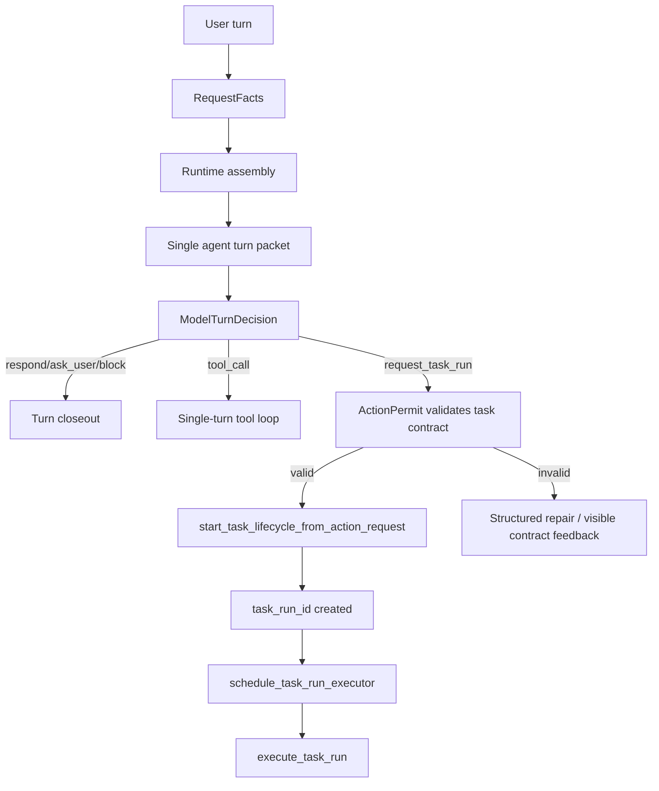
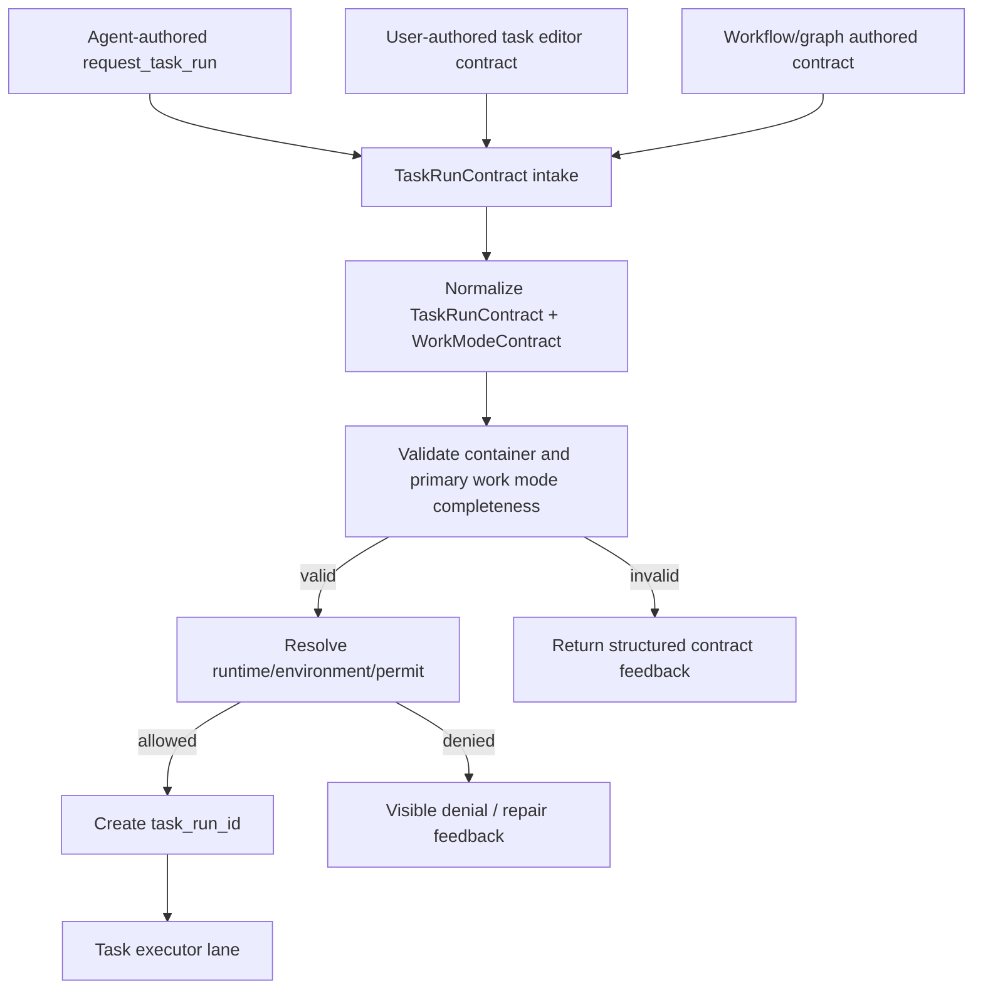

# Task Mode 长期任务运行架构文档

## 0. 工程状态

本文是 Task Mode 后续实施前的架构蓝图。它用于对齐目标链路、权责边界和文件级执行清单，不表示当前 runtime 代码已经完成重构。

当前工作区存在早前围绕 `request_task_run`、单 turn repair 和 runtime prompt 的临时草稿改动；后续实施时必须按本文重新审阅、保留或删除，不能把临时草稿直接当作目标架构。

## 1. 目的

Task Mode 的核心不是考验 agent 会不会“说我要开任务”，而是考验系统能否在 agent 选择进入长期任务后，提供一条稳定、可恢复、可投影、可验收的执行通路。

本文定义 Task Mode 的目标架构、权责边界、动作契约、系统支持能力、迁移步骤和文件级实施清单。后续代码落地必须以本文为准，禁止继续用旧链路、隐式兜底或提示词补丁来替代系统架构。

Task Mode 解决的是这类问题：

```text
一次用户目标无法可靠地在单 turn 内完成；
需要跨多轮工具、跨用户 steer、跨暂停/恢复、跨失败恢复持续推进；
用户需要知道任务为什么启动、当前做到哪里、为什么失败、还能否继续；
系统需要保留身份、状态、证据、控制点和最终验收，而不是只展示一串工具调用。
```

## 2. 当前设计缺口

### 2.1 观察到的失败模式

本轮问题暴露出四类链路缺口。

1. agent 口头说要发起任务，但真实动作没有提交 `request_task_run`，因此没有 `task_run_id`，后续也不会产生 task-run 投影。
2. 停止按钮已经有取消 model task 和 tool invocation 的雏形，但停止后的 terminal closeout、投影、任务记忆检查点还没有形成不可绕过的统一契约。
3. 失败、协议不通过、输出未提交等路径容易只停在内部状态，没有稳定给出用户可见的失败原因和收口反馈。
4. 投影系统有 turn projection、task monitor projection、chronological ledger、closeout view 等多条线，若完整性和顺序契约不统一，就会出现消息不全、顺序错乱、日志入口消失或 reasoning 投影断线。

### 2.2 深层原因

根因不是 agent 不够聪明，而是系统没有把长期任务需要的支持能力做成一条明确的运行车道。

当前代码里已经有不少必要组件：

```text
model action contract
task lifecycle
task executor
runtime control signal
provider-visible context ledger
runtime monitor
public projection frame
frontend chronological ledger
output commit authority
```

但它们还没有被统一成一个固定的 Task Mode 合同链路。结果就是：agent 的语义决策、系统的执行状态、用户看到的投影、失败 closeout、后续恢复记忆之间可能断开。

### 2.3 正确终态

正确终态是：

```text
任务运行合同 TaskRunContract 是 Task Mode 容器的核心对象；
WorkModeContract 是容器内的工作语义对象；
TaskRunContract 和 WorkModeContract 可以由 agent 填写，也可以由用户/前端/上游 workflow 填写；
agent 在普通 chat turn 中决定是否提交 request_task_run 来申请任务生命周期；
系统只校验合同形状、权限和资源，不凭自然语言猜测任务语义；
一旦 TaskRunContract 合格、primary Work Mode 合法且启动入口合法，系统创建 task_run_id 并进入长期任务车道；
后续所有执行、控制、投影、恢复、验收、失败收口都绑定同一个 task_run_id；
停止和失败不会造成记忆断线，用户也一定能看到为什么结束。
```

## 3. 源码依据

### 3.1 当前入口和决策链

主要入口：

```text
backend/harness/entrypoint/runtime_facade.py
```

当前主要流程：

```text
HarnessRuntimeRequest
-> assemble_runtime(...)
-> _runtime_branch_projection(...)
-> build_turn_input_facts(...)
-> decide_current_work_boundary(...)
-> run_single_agent_turn(...)
-> start_task_lifecycle_from_action_request(...)
-> schedule_task_run_executor(...)
-> execute_task_run(...)
```

重要事实：

```text
single_agent_turn 路径下，Task Mode 只有在 agent 返回 action_type=request_task_run 后才启动。
runtime_facade.py 还存在 explicit_contract_task 分支，用于 system-issued explicit contract。
这个分支必须被限制为 workflow/graph/用户任务编辑器/上游系统已经签发的显式合同，不能靠普通用户输入的自然语言猜测触发。
```

### 3.2 当前动作合同

主要文件：

```text
backend/harness/loop/model_action_protocol.py
backend/harness/runtime/compiler.py
backend/harness/loop/single_agent_turn.py
```

当前合同已经包含：

```text
action_type=respond|ask_user|tool_call|request_task_run|active_work_control|resume_recoverable_work|block
task_run_contract_seed
public_progress_note
public_action_state
completion_contract
permission_request
```

但目标架构要进一步明确：

```text
TaskRunContract 是任务生命周期容器的权威合同。
WorkModeContract 是任务工作语义的权威合同。
request_task_run 是 agent 在普通 turn 中提交 TaskRunContract 草案和 primary Work Mode 的动作，不是普通工具调用。
显式用户合同、前端任务编辑器合同、workflow/graph 合同也必须规范化为同一个 TaskRunContract + WorkModeContract 模型。
task_run_contract_seed/explicit_contract 只描述任务容器、工作模式、生命周期、反馈、记忆和验收。
工具、skill、环境、权限、memory 写入不由 task_run_contract_seed 授权，只能由 runtime profile/environment/action permit 解析。
```

### 3.3 当前执行器和控制链

主要文件：

```text
backend/harness/loop/task_executor.py
backend/harness/loop/task_run_execution_control.py
backend/harness/runtime/task_run_control_gateway.py
```

已有能力：

```text
request_executor_control_signal(...) 可发布 pause/stop/replan 控制信号。
attach_model_task(...) 会把当前 model task 绑定到 executor epoch。
收到控制信号时可以 task.cancel(...)，并取消 active tool invocation registry。
execute_task_run(...) 已有 executor_epoch、step loop、model action wait heartbeat、tool execution、terminal finish。
```

需要收束的点：

```text
控制信号不能只做到“尝试取消”；必须形成统一 terminal/pause closeout。
停止必须硬中断当前 model/tool，同时保留 task_run 状态和最后 checkpoint。
暂停必须保留 task_run_id、executor_epoch 历史、runtime scope 和恢复包，不破坏身份。
```

### 3.4 当前投影链

主要文件：

```text
backend/harness/runtime/projection/projector.py
backend/harness/runtime/run_monitor/projector.py
frontend/src/lib/projection/chronological/accumulator.ts
frontend/src/lib/projection/chronological/viewModel.ts
backend/harness/runtime/projection/closeout_ledger_contract.md
```

当前投影事实：

```text
public_projection_frame 是主聊天投影事实来源。
backend projector 负责把 runtime event 转成 projection frame。
frontend accumulator 按 offset 归约 frame。
viewModel 根据 committed/closeout 状态生成 activity_archive、final body 和 log_entry。
run_monitor projector 为任务列表和详情提供 task state view。
```

目标架构要保证：

```text
task run 进入后，每个公开 frame 都有 task_run_id anchor。
tool/request/permission/start/complete/status/final/commit 的 offset 顺序不可反转。
committed/closeout projection slice 不允许裁剪成弱历史。
reasoning_projection 如果合同允许公开，就必须作为状态投影帧保留，不能被 Task Mode 截断或吞掉。
```

### 3.5 当前上下文和记忆链

主要文件：

```text
backend/runtime/context_management/provider_visible_context_ledger.py
backend/runtime/context_management/context_assembly.py
backend/runtime/context_management/provider_visible_context_cache_strategy_report.md
backend/runtime/context_management/agent_context_system_group_architecture_plan.md
```

已确立原则：

```text
provider-visible 旧内容原样 replay。
新内容只能 append。
semantic memory 与 provider-visible replay-only 分离。
动态控制不是事实记忆。
```

Task Mode 必须继承这个原则：

```text
任务记忆连续性不是把所有 runtime 控制文本塞进长期记忆。
正确做法是：task checkpoint、confirmed observations、accepted artifacts、closeout reason 进入任务状态和恢复包；provider-visible replay-only 继续用于 provider 协议稳定。
```

## 4. 外部成熟架构参照

本文不复制外部产品实现，只借用成熟 agent 系统的稳定性质。

参考方向：

```text
OpenAI Agents SDK: agent、tools、handoffs、guardrails、tracing 分层。
Anthropic Claude Code: tools、hooks、memory、subagents 和执行可观测性分层。
Mature coding agent runtime: request facts -> boundary policy -> context candidates -> model decision -> action permit -> runtime packet -> execution loop。
```

参考资料：

```text
https://openai.github.io/openai-agents-python/agents/
https://openai.github.io/openai-agents-python/tools/
https://openai.github.io/openai-agents-python/guardrails/
https://openai.github.io/openai-agents-python/tracing/
https://openai.github.io/openai-agents-python/results/
https://docs.anthropic.com/en/docs/claude-code/sdk
https://docs.anthropic.com/en/docs/claude-code/hooks
https://docs.anthropic.com/en/docs/claude-code/memory
https://docs.anthropic.com/en/docs/claude-code/sub-agents
```

可借用的原则：

```text
模型负责语义决策。
系统负责权限、边界、状态、观测和恢复。
工具执行必须有可追踪 receipt。
长期任务必须有稳定 run identity。
失败和中断必须是显式 lifecycle event，而不是静默消失。
```

不借用的做法：

```text
不让系统根据用户自然语言自动创建任务。
不让旧 intent classifier 替代 model action decision。
不靠 prompt 文案承担权限控制、恢复控制或执行调度。
不通过自然语言短语解析来决定 task lifecycle。
```

## 5. 权责边界

### 5.1 单向权威链

Task Mode 的目标权威链固定为：

```text
RequestFacts
-> BoundaryPolicy
-> ContextCandidates
-> ModelTurnDecision
-> ActionPermit
-> TaskRunStartPacket
-> ExecutionLoop
-> ProjectionLedger
-> MemoryCheckpoint
-> AcceptanceCloseout
```

### 5.2 分层职责

| 层 | 拥有什么权力 | 禁止做什么 |
| --- | --- | --- |
| RequestFacts | 记录用户输入、附件、活动任务、可恢复句柄、环境绑定 | 猜用户是否要开任务 |
| BoundaryPolicy | 判断运行权限、产品边界、确认要求 | 替 agent 把普通请求改成任务 |
| ContextCandidates | 提供历史、恢复包、文件证据、任务状态、工具目录 | 把候选上下文变成隐藏指令 |
| ModelTurnDecision | 选择 `respond`、`tool_call`、`request_task_run` 等语义动作 | 给自己授权，绕过 action permit |
| ActionPermit | 校验动作类型、字段、权限、工具准入 | 失败后生成替代动作 |
| TaskRunStartPacket | 从合格 `request_task_run` 创建 task lifecycle | 修改任务目标或扩大范围 |
| ExecutionLoop | 执行任务、观察工具、处理控制信号、记录状态 | 猜测旧状态并继续 |
| ProjectionLedger | 按 offset 和 anchor 输出完整公开轨迹 | 补造不存在的工具/反馈 |
| MemoryCheckpoint | 保存任务检查点、证据、恢复包 | 把 runtime 控制尾巴当事实记忆 |
| AcceptanceCloseout | 验收完成、失败、停止、阻塞，并给用户可见收口 | 失败后静默终止 |

## 6. 固定执行流

### 6.1 普通对话到任务启动



关键规则：

```text
用户要求长期执行不是系统启动任务的充分条件。
agent 提交合格 request_task_run 才是普通 chat turn 进入 Task Mode 的语义入口。
系统可以拒绝、修复、要求补齐合同，但不能把 tool_call 改写成 request_task_run。
```

### 6.2 合同 intake 到任务启动

Task Mode 的启动入口分成“合同来源”和“启动许可”两层。



关键规则：

```text
合同可以由 agent、用户或上游系统填写。
进入执行前必须统一规范化为 TaskRunContract + WorkModeContract。
普通 chat 中，系统不能因为用户自然语言“看起来像任务”而自填合同。
用户在任务编辑器/前端表单中显式提交结构化合同，属于 user-authored contract，不是系统猜测。
workflow/graph 签发的合同属于 system-authored contract，但它的语义来源是上游已建模任务，不是当前 turn 的自然语言推断。
```

### 6.3 任务执行循环

```text
task_run_id
-> load task contract
-> assemble runtime for task execution
-> compile task execution packet
-> model action JSON
-> action permit
-> tool execution / ask_user / block / respond
-> observation ledger
-> projection frame
-> checkpoint
-> continue / pause / stop / replan / closeout
```

每一轮任务执行必须产出：

```text
runtime_invocation_packet_ref
executor_epoch
invocation_index
model_action_request or structured protocol failure
public progress frame or explicit no-public-feedback diagnostic
observation refs
checkpoint delta
```

### 6.4 显式系统合同入口

`explicit_contract_task` 只能用于系统已经拥有结构化 TaskRunContract + WorkModeContract 的场景，例如 graph/workflow 已签发的任务节点，或用户在任务编辑器里显式保存并提交的任务合同。

允许：

```text
graph node work order
workflow assigned task contract
project automation contract
用户已经在 UI/任务编辑器里提交并保存的结构化合同
```

禁止：

```text
普通 chat turn 根据“用户看起来想长期执行”直接走 explicit_contract_task。
runtime_facade 根据关键词替 agent 创建 task_run。
explicit_contract_task 与 request_task_run 并行成为普通对话的双入口。
```

## 7. TaskRunContract 与 WorkModeContract 合同设计

Task Mode 是长期运行容器，不是 Goal、Plan、Todo 三者本身。它负责身份、控制、投影、检查点、恢复、记忆和收口；真正的工作语义由容器内的 Work Mode 承载。

目标结构固定为：

```text
TaskRunContract：任务运行容器合同，必需。
WorkModeContract：工作模式合同，必需且至少有一个 primary mode。
GoalMode / PlanMode / TodoMode：三类核心工作模式，彼此独立。
Investigation / Recovery / Monitor / OpenWork：其他可扩展工作模式。
```

这意味着 Task Mode 可以容纳 Goal Mode，也可以容纳 Plan Mode 或 Todo Mode。没有 goal 但有 plan，可以以 Plan Mode 进入；只有 todo list，可以以 Todo Mode 进入；只有恢复句柄，可以以 Recovery Mode 进入。Task Mode 不把这些语义片段揉成一个大字段，而是为它们提供稳定运行车道。

### 7.1 设计目标

TaskRunContract 必须回答容器层问题：

```text
谁提出了这个长期运行请求？
为什么需要进入 Task Mode 容器？
当前 primary Work Mode 是什么？
运行中如何暂停、停止、恢复和重规划？
系统应该给 agent 哪些反馈、投影和检查点？
哪些状态必须进入任务记忆、恢复包和最终收口？
```

WorkModeContract 必须回答语义层问题：

```text
这个模式在解决什么工作问题？
它的最低可执行输入是什么？
它是否依赖其他模式的版本引用？
它如何推进、阻塞、完成、修订或切换？
它向模型、UI、记忆和验收分别投影什么？
```

关键分离：

```text
TaskRunContract 的 container_contract 不承载具体 goal、plan、todo 内容。
具体工作语义只进入对应 WorkModeContract。
GoalModeContract 不承载工具步骤。
PlanModeContract 不冒充最终目标。
TodoModeContract 不设定任务意义。
```

### 7.2 合同作者

TaskRunContract 和 WorkModeContract 的作者可以有三类。

| 作者 | 来源 | 启动方式 | 约束 |
| --- | --- | --- | --- |
| agent-authored | agent 在普通 chat turn 中判断需要长期任务 | `request_task_run` | agent 填容器合同和 primary work mode，系统校验 |
| user-authored | 用户在任务编辑器、前端表单或结构化 UI 中填写 | explicit contract intake | 用户显式提交，不靠自然语言猜 |
| system-authored | workflow、graph、automation、上游编排器生成 | explicit contract intake | 上游系统必须已经拥有结构化合同 |

这三类作者共享同一个 canonical TaskRunContract 和 WorkModeContract。区别只在 `contract_origin`、可修改权限和启动入口，不在执行器里分叉出三套任务语义。

### 7.3 Canonical TaskRunContract

```json
{
  "contract_id": "task-run-contract:...",
  "contract_version": "task_run_contract_v1",
  "contract_origin": {
    "author_type": "agent|user|system",
    "source": "request_task_run|task_editor|workflow|graph|automation",
    "source_ref": "",
    "created_turn_id": "",
    "created_by": "",
    "created_at": 0
  },
  "container_contract": {
    "entry_reason": "",
    "continuity_required": true,
    "control_required": true,
    "projection_required": true,
    "checkpoint_required": true,
    "minimum_viable_next_step": "",
    "primary_work_mode_ref": "work-mode:primary",
    "supporting_mode_refs": [],
    "mode_transition_policy": {
      "agent_may_propose_transition": true,
      "system_may_infer_transition": false,
      "requires_accepted_event": true
    },
    "authority": "task_run_contract_v1"
  },
  "work_modes": [
    {
      "mode_instance_id": "work-mode:primary",
      "mode_kind": "goal|plan|todo|investigation|recovery|monitor|open_work",
      "mode_role": "primary|supporting",
      "status": "draft|active|blocked|completed|superseded|aborted",
      "depends_on_mode_refs": [],
      "contract": {}
    }
  ],
  "lifecycle_contract": {
    "pause_policy": {},
    "resume_policy": {},
    "stop_policy": {},
    "replan_policy": {},
    "mode_transition_policy": {},
    "failure_recovery_policy": {},
    "terminal_policy": {}
  },
  "feedback_contract": {
    "feedback_sources": ["tool_observation", "runtime_observation", "user_steer", "lifecycle_signal", "verification_signal"],
    "projection_requirements": ["mode_progress", "stage_progress", "tool_trace", "reasoning_trace_when_allowed", "failure_closeout"],
    "public_feedback_policy": {},
    "feedback_identity_binding": "task_run_id_required"
  },
  "memory_contract": {
    "checkpoint_policy": {},
    "semantic_memory_policy": {},
    "provider_visible_replay_policy": {},
    "recovery_package_policy": {}
  },
  "acceptance_contract": {
    "acceptance_mode": "strict|best_effort|checkpoint|user_review|none_yet",
    "completion_criteria": [],
    "required_artifacts": [],
    "required_verifications": [],
    "evidence_refs_required": true,
    "final_answer_requirements": []
  },
  "runtime_requirements": {
    "permission_requirements": {},
    "resource_requirements": {},
    "safety_boundaries": []
  }
}
```

`work_modes[].contract` 是 discriminated union，必须由 `mode_kind` 决定具体 schema。系统不能在同一个无类型对象里混放 goal、plan、todo。

### 7.4 WorkModeContract 类型

三类核心模式必须分开建模。

| 模式 | 解决什么问题 | 最低可执行内容 | 禁止 |
| --- | --- | --- | --- |
| `GoalModeContract` | 为什么做、成功如何定义、什么不做 | `user_visible_goal` 或 `success_definition`，至少一个 scope/evidence 线索 | 不承载具体工具步骤，不塞 todo |
| `PlanModeContract` | 按什么路线推进、何时 replan、阶段如何验收 | `strategy_summary`、`major_steps` 或 `external_plan_ref` | 不冒充最终 goal，不塞低层工具明细 |
| `TodoModeContract` | 当前可执行清单、活跃项、检查项状态 | `items`，以及 `active_item_id` 或可选择起点 | 不设定任务意义，不替代 plan |

推荐 schema：

```json
{
  "mode_kind": "goal",
  "contract": {
    "user_visible_goal": "",
    "task_run_goal": "",
    "success_definition": "",
    "non_goals": [],
    "completion_evidence": [],
    "working_scope": {},
    "evidence_contract": {}
  }
}
```

```json
{
  "mode_kind": "plan",
  "contract": {
    "strategy_summary": "",
    "major_steps": [],
    "plan_status": "agent_managed|user_approved|system_assigned",
    "replan_policy": {},
    "external_plan_ref": {},
    "working_scope": {}
  }
}
```

```json
{
  "mode_kind": "todo",
  "contract": {
    "todo_list_id": "",
    "items": [],
    "active_item_id": "",
    "completion_policy": "all_done|checkpoint_only|user_review|required_by_acceptance",
    "source_mode_ref": "",
    "working_scope": {}
  }
}
```

三者的关系是：

```text
Goal Mode 告诉 agent 为什么跑。
Plan Mode 告诉 agent 按什么路线跑。
Todo Mode 告诉 agent 当前脚下踩哪一步。
Task Mode 给这三类模式提供可持续运行的路、补给和路标。
```

### 7.5 合同完整性分级

合同完整性按 primary WorkModeInstance 的 `mode_kind` 判定，不再用旧的 `mode_kind + primary_work_surface` 双重字段。

| Primary Work Mode | 可以没有 | 必须有 |
| --- | --- | --- |
| `goal` | 详细 plan、todo | goal 或成功定义，至少一个工作范围或目标对象 |
| `plan` | goal、严格验收 | plan steps 或 external plan ref，下一步执行边界 |
| `todo` | goal、plan | todo items，active item 或可选起点 |
| `investigation` | goal、todo、严格验收 | 调查范围、问题边界、阶段反馈策略 |
| `recovery` | goal、plan | recovery handle、上一状态、恢复/停止策略 |
| `monitor` | goal、plan、todo | 监控对象、触发条件、反馈/停止策略 |
| `open_work` | 完整 goal、完整 plan、严格验收 | entry reason、工作模式、下一步最小动作 |

最低进入要求：

```text
contract_origin
container_contract.entry_reason
container_contract.primary_work_mode_ref
container_contract.minimum_viable_next_step
work_modes 至少一个 mode_role=primary 的 WorkModeInstance
primary WorkModeContract 满足对应 mode_kind 的最低可执行内容
lifecycle_contract.pause/resume/stop 基本策略
feedback_contract.projection_requirements
memory_contract.checkpoint_policy
acceptance_contract.acceptance_mode
```

完成验收可以暂缺，但必须显式标记：

```text
acceptance_contract.acceptance_mode = none_yet|checkpoint|user_review
```

这样系统知道当前任务是“先进入长期执行/观察/恢复车道”，而不是假装已经有完整最终验收标准。

### 7.6 模式组合和模式切换

Task Mode 容器允许一个 primary mode 和多个 supporting modes。

允许组合：

```text
primary=goal：目标明确，计划和 todo 可后续生成。
primary=plan：已有路线或外部计划，goal 可缺省或作为 supporting mode。
primary=todo：已有执行清单，适合 checklist/task-run 模式。
primary=goal + supporting=plan：目标和策略都明确。
primary=plan + supporting=todo：路线和执行项明确，适合直接执行。
primary=todo + supporting=goal：用户给了清单，同时附带目标解释。
primary=recovery：从恢复句柄进入，恢复后可 transition 到 plan 或 todo。
```

模式切换必须是显式事件：

```text
work_mode.transition_proposed
work_mode.transition_accepted
work_mode.primary_changed
work_mode.supporting_attached
work_mode.supporting_detached
```

禁止：

```text
系统因为自然语言推断自动切 primary mode。
Todo done 自动切到 Goal satisfied。
Plan completed 自动切到 Task completed。
supporting mode 覆盖 primary mode 的语义权威。
```

### 7.7 Goal / Plan / Todo 三类上下文位置

合同是持久 truth；上下文是当前 model turn 可见的投影。Goal/Plan/Todo 的上下文顺序是投影顺序，不是语义嵌套关系。

| 上下文 | 来源 | Model-visible 位置 | Cache/记忆策略 | UI 投影 |
| --- | --- | --- | --- | --- |
| `TaskRunContext` | container contract + active mode refs | task stable identity，紧跟 action schema 后 | provider-visible 以稳定前缀 replay | 任务摘要、控制能力、恢复能力 |
| `GoalContext` | active `GoalModeContract` + accepted goal revisions | task stable context，位于 TaskRunContext 后 | 可进入 semantic task memory | 通常不作为高频活动块展示 |
| `PlanContext` | active `PlanModeContract` + active plan revision | task plan context，位于 goal 之后、todo 之前 | 当前 active plan 可见；旧 plan 以 revision/checkpoint 保留 | 阶段计划或 replan 事件 |
| `TodoContext` | active `TodoModeContract` + work_rollout/todo state | dynamic execution context，位于 plan 之后、observations/control 之前 | 高频变化，不污染 stable goal | todo/status/activity |

固定装配顺序：

```text
runtime identity / action schema
-> Task Mode entrance guidance
-> TaskRunContext
-> WorkModeContext index
-> GoalContext
-> PlanContext
-> TodoContext
-> Evidence / observations
-> Runtime control signals
-> Acceptance / closeout guidance
```

位置规则：

```text
GoalContext 不能被 TodoContext 覆盖。
PlanContext 可以解释 TodoContext 的组织方式，但不能删除已确认 goal。
TodoContext 只能表达当前执行面，不能把临时工具步骤提升为任务目标。
Primary mode 决定本轮工作语义；context order 只决定模型可见排布。
用户 steer 修改 goal 时，生成 goal revision；修改路线时，生成 plan revision；修改检查项时，生成 todo revision。
```

这三类上下文的位置也对应系统职责：

```text
TaskRunContract -> task_contract_manifest / task_state_context stable identity section
GoalModeContract -> task_contract_manifest / task_state_context stable goal section
PlanModeContract -> task_plan_context / active_contract_revisions middle section
TodoModeContract -> work_rollout / todo_plan_projection / dynamic execution tail
```

### 7.8 Goal / Plan / Todo 三类生命周期

Goal/Plan/Todo 是三类 Work Mode，各自有独立生命周期。生命周期事件必须绑定 `task_run_id` 和 `mode_instance_id`，系统只执行和校验生命周期事件，不能用 todo 的变化偷偷改 goal，也不能用 plan 的重排覆盖用户已确认的目标。

生命周期事件必须满足：

```text
每个事件都有 task_run_id。
每个事件都有 mode_instance_id。
每个事件都有 work_mode_kind。
每个事件都有 source_authority：agent|user|system|runtime。
每个事件都 append 到 lifecycle ledger，不原地覆盖历史。
每个 active record 都引用自己的上游版本和所属 mode instance。
跨模式变更只能通过显式 transition/revision 事件传播。
```

#### 7.8.1 Goal Mode 生命周期

Goal Mode 是稳定意图模式，回答“为什么做、做到什么算成功、哪些不做”。它的变化频率最低，不能被执行细节污染。

| 状态 | 含义 |
| --- | --- |
| `draft` | GoalMode 草案尚未被 intake 接受 |
| `proposed` | agent/user/system 提出了 goal，等待接受 |
| `active` | 当前模式实例的有效 goal |
| `revision_proposed` | 有新的 goal 修订提案，但尚未生效 |
| `superseded` | 被新的 goal version 替代，保留历史 |
| `suspended` | goal 暂不推进，但任务身份和历史保留 |
| `satisfied` | 验收或用户确认后判定目标已满足 |
| `abandoned` | 明确放弃该 goal，不允许继续按该 goal 执行 |

允许事件：

```text
goal.proposed
goal.accepted
goal.revision_proposed
goal.revision_accepted
goal.superseded
goal.suspended
goal.satisfied
goal.abandoned
```

规则：

```text
Goal revision 必须写明 mode_instance_id、reason、source_authority 和 changed_paths。
Todo Mode 不能修改 Goal Mode。
Plan Mode 可以提出 goal revision，但不能自动生效。
Todo completed 不能直接推出 goal satisfied；goal satisfied 必须来自 acceptance result、用户确认或 system-authored workflow verdict。
Goal 实质变化后，依赖旧 goal_version_ref 的 Plan/Todo mode 必须进入 needs_replan/stale 或标记 explicitly_compatible。
```

#### 7.8.2 Plan Mode 生命周期

Plan Mode 是策略和路线模式，回答“按什么阶段推进、何时重规划、当前阶段如何解释 todo”。它可以比 goal 更频繁变化，但不能像 todo 一样每个工具动作都改。

| 状态 | 含义 |
| --- | --- |
| `draft` | 已生成路线草案，但尚未成为执行依据 |
| `active` | 当前模式实例的有效 plan revision |
| `executing` | 执行器正在按该 plan revision 推进 |
| `needs_replan` | 上游 goal、scope、失败或用户 steer 使当前 plan 失效 |
| `replanning` | agent 正在生成或协商新 plan revision |
| `superseded` | 被新 plan revision 替代 |
| `completed` | plan 中要求的阶段已完成，但不等于 goal satisfied |
| `blocked` | plan 当前无法继续，需要用户、权限、资源或外部条件 |

允许事件：

```text
plan.created
plan.activated
plan.step_started
plan.step_completed
plan.replan_requested
plan.revised
plan.superseded
plan.completed
plan.blocked
```

规则：

```text
Plan Mode 可以从 Goal Mode、Todo Mode、external_work_ref 或 recovery handle 创建。
没有 Goal Mode 时，Plan Mode 仍然可以作为 primary work mode 独立有效。
Plan revision 不删除旧 plan；只创建新的 active revision。
Plan 可以引用 goal_version_ref；没有 goal 时显式标记 goal_version_ref=null。
Todo item 有可用 plan step 时必须绑定 plan_step_ref。
Plan completed 只能说明路线完成，不能自动完成 task run。
```

#### 7.8.3 Todo Mode 生命周期

Todo Mode 是执行光标和检查清单模式，回答“现在做哪一项、哪些项已完成、哪些项卡住”。它变化最高频，必须适合投影和 checkpoint，但不能污染稳定合同。

| 状态 | 含义 |
| --- | --- |
| `open` | todo 已创建，尚未成为当前执行项 |
| `active` | 当前候选执行项 |
| `in_progress` | 执行器正在推进该项 |
| `blocked` | 当前项被权限、资源、失败或用户输入阻塞 |
| `done` | 当前项已完成并产生 checkpoint evidence |
| `skipped` | 被明确跳过，需记录原因 |
| `cancelled` | 因 stop、scope 变化或用户决定取消 |
| `stale` | plan/goal/scope 变化后，该项不再可靠 |

允许事件：

```text
todo.created
todo.activated
todo.started
todo.blocked
todo.completed
todo.skipped
todo.cancelled
todo.reopened
todo.staled_by_plan_revision
```

规则：

```text
Todo Mode 可以来自 plan 分解、用户 checklist、agent 当前工作或 recovery package。
Todo Mode 不能设定 goal，也不能替代 plan。
Todo completed 必须生成 checkpoint evidence 或明确 no_evidence_reason。
Plan revision 可以把 todo 标记为 stale，也可以通过 remap event 绑定到新 plan_step_ref。
Todo 更新投影为 todo/status/activity，不写入稳定 GoalContext。
```

#### 7.8.4 生命周期绑定和跨模式不变量

三类生命周期通过引用绑定，不通过文本覆盖绑定。

| 引用 | 绑定对象 | 用途 |
| --- | --- | --- |
| `mode_instance_id` | WorkModeInstance | 区分同一 task_run 内的不同工作模式 |
| `goal_version_ref` | active goal version | plan、acceptance、memory 判断目标语义是否一致 |
| `plan_revision_ref` | active plan revision | todo、checkpoint、projection 判断路线是否一致 |
| `todo_item_ref` | 当前执行项 | tool observation、activity frame、checkpoint 判断工作光标 |
| `checkpoint_ref` | 任务检查点 | pause/resume/failure/closeout 恢复依据 |
| `event_offset` | lifecycle ledger 顺序 | 投影和恢复的唯一排序依据 |
| `source_authority` | agent/user/system/runtime | 决定事件能否改变 active record |

跨模式不变量：

```text
Todo 可以推动 plan progress，但不能宣布 goal satisfied。
Plan 可以提出 goal revision，但不能自动改 active goal。
Goal revision 会使依赖旧 goal 的 plan/todo 进入 needs_replan/stale，除非有 explicitly_compatible 事件。
同一个 mode_instance_id 内只能有一个 active goal version、一个 active plan revision 或一个 active todo cursor。
同一个 task_run_id 内只能有一个 primary WorkModeInstance。
暂停保留 task_run active mode refs；停止冻结 active mode refs 为 read-only outcome。
恢复必须从 checkpoint_ref + active mode refs 继续，不重新解释旧聊天文本。
```

模型可见投影：

```text
TaskRunContext：展示容器身份、primary mode、supporting modes 和控制能力。
GoalContext：只展示 active goal 和已接受修订摘要，不展示被拒绝 proposal。
PlanContext：展示 active plan revision、plan status、needs_replan/blocker。
TodoContext：展示 active todo cursor、最近 todo 变化和当前阻塞原因。
Evidence/Observation：展示与 todo_item_ref、plan_step_ref 或 mode_instance_id 绑定的证据。
Control：展示 pause/stop/replan/resume/transition 的最新信号和终端效果。
```

UI 投影：

```text
TaskRun lifecycle 展示为任务容器状态、控制能力和恢复能力。
goal lifecycle 通常作为任务摘要、验收变化或重大 steer 展示。
plan lifecycle 展示为阶段计划、重规划、阻塞和路线完成。
todo lifecycle 展示为实时清单、活动轨迹、工具关联状态。
任何 closeout 必须同时携带 active mode refs 的最终快照，避免用户看到“停止了但不知道停在哪”。
```

记忆策略：

```text
Goal satisfied / abandoned / accepted revision 可以进入任务语义记忆。
Plan revision 和 completed step 进入任务 checkpoint，不默认进入长期语义记忆。
Todo done / skipped / blocked 进入 checkpoint evidence 和 projection ledger，不进入 stable memory prefix。
Mode transition 和 primary mode change 进入恢复包和任务状态，不由聊天文本重推。
Failure closeout 和 recovery_action 进入恢复包，供后续任务上下文引用。
```

#### 7.8.5 生命周期事件处理顺序和权威矩阵

生命周期不是 prompt 里的自我描述，而是 runtime ledger 中的状态转换。事件处理顺序固定为：

```text
receive lifecycle proposal/control/observation
-> validate source_authority, task_run_id, mode_instance_id and scope
-> append LifecycleEvent
-> derive active WorkModeRecord / lifecycle records
-> emit ProjectionFrame
-> write checkpoint delta
-> compile next model-visible context
```

权威边界：

| 来源 | 可以做 | 禁止做 |
| --- | --- | --- |
| `agent` | 提出 work mode；提出 goal/plan/todo；推进 plan/todo；提交 replan/transition；声明已完成并交给验收 | 绕过 acceptance 直接完成任务；修改 user/system 已锁定 goal；给自己授权 |
| `user` | 接受/拒绝 revision；发出 steer；暂停、停止、恢复；显式修改结构化合同 | 通过普通自然语言绕过合同 intake 的结构校验 |
| `system` | 执行 user-authored 或 workflow-authored 的结构化合同；校验、投影、保存、验收 | 根据普通聊天文本自造任务目标；替 agent 选择 request_task_run 或 primary mode |
| `runtime` | 根据工具结果、控制信号、权限结果标记 blocked/stale/aborted；生成 checkpoint 和 closeout | 生成新的语义 goal；把 todo 完成推导为 goal satisfied；自动切 primary mode |

active record 更新规则：

```text
accepted 事件才能改变 active mode refs。
proposal 事件只进入 ledger 和上下文提示，不改变 active refs。
runtime 派生事件只能改变执行状态或终端状态，不能改变语义目标。
validation failure 只能产生 repair feedback，不产生 active lifecycle mutation。
```

### 7.9 启动引导合同

Task Mode 需要一段专门的 agent-facing 启动引导，位置在 action schema 之后、`request_task_run` JSON shape 之前。它不是开发说明，而是 agent 可直接执行的判断标准。

引导应包含：

```text
你负责判断当前工作是否需要进入持续任务模式。
进入任务模式前，先填写 TaskRunContract 容器合同。
然后选择一个 primary Work Mode：goal、plan、todo、investigation、recovery、monitor 或 open_work。
不要因为 goal 不完整就放弃任务模式；如果当前可执行语义是 plan，就以 Plan Mode 进入；如果只有清单，就以 Todo Mode 进入。
缺失的模式不要编造；可以添加 supporting modes，但 primary mode 只能有一个。
如果连 entry_reason、primary Work Mode 和 minimum_viable_next_step 都无法判断，先 ask_user。
如果当前 turn 可以直接完成、验证并收口，不要启动任务。
```

启动引导的输出义务：

```text
public_progress_note：告诉用户为什么需要进入持续任务模式。
public_action_state.current_judgment：说明当前选择的 primary Work Mode。
public_action_state.next_action：说明进入任务后第一步做什么。
task_run_contract_seed.container_contract：必须填。
task_run_contract_seed.work_modes：必须至少填一个 mode_role=primary 的真实 WorkModeContract。
```

### 7.10 合同修订

长期任务必须支持合同修订，但修订不能覆盖历史。

```text
用户 steer = append revision proposal。
agent replan = append plan revision。
agent transition = append work_mode.transition_proposed。
系统权限变化 = append runtime requirement resolution。
验收标准变化 = append acceptance revision，需要来源和原因。
```

每次修订必须保留：

```text
revision_id
parent_contract_id
mode_instance_id
changed_paths
author_type
source_ref
reason
accepted_by
created_at
```

执行器只读取已接受的 active contract revision 和 active mode refs，不从聊天文本猜最新合同。

## 8. `request_task_run` 动作契约

### 8.1 合同定位

`request_task_run` 是 agent 提交给系统的生命周期启动请求。它表达：

```text
我判断当前工作需要持续任务生命周期；
我已经把进入 Task Mode 容器的理由、primary Work Mode、控制、反馈、记忆和验收写成 TaskRunContract 草案；
请系统为这个合同建立 task_run_id，并按 primary Work Mode 进入执行车道。
```

它不表达：

```text
我已经获得全部工具权限。
我可以改变运行环境。
我可以绕过用户确认。
我可以把 skill/environment/memory 写入权限塞进任务合同。
```

### 8.2 推荐结构

```json
{
  "authority": "harness.loop.model_action_request",
  "action_type": "request_task_run",
  "public_progress_note": "我判断这需要持续任务来保持计划、进度、恢复点和收口结果一致。",
  "public_action_state": {
    "visible_status": "thinking",
    "current_judgment": "当前工作应以 Plan Mode 进入 Task Mode 容器，并由系统保留状态、投影进展、支持暂停和恢复。",
    "next_action": "建立任务生命周期并进入执行流程。",
    "completion_status": "working"
  },
  "task_run_contract_seed": {
    "container_contract": {
      "entry_reason": "当前工作需要持续执行车道、阶段投影、暂停/恢复和检查点。",
      "continuity_required": true,
      "control_required": true,
      "projection_required": true,
      "checkpoint_required": true,
      "minimum_viable_next_step": "执行计划中的第一个可行动步骤。",
      "primary_work_mode_ref": "work-mode:plan:primary",
      "supporting_mode_refs": ["work-mode:todo:supporting"],
      "mode_transition_policy": {
        "agent_may_propose_transition": true,
        "system_may_infer_transition": false,
        "requires_accepted_event": true
      }
    },
    "work_modes": [
      {
        "mode_instance_id": "work-mode:plan:primary",
        "mode_kind": "plan",
        "mode_role": "primary",
        "status": "draft",
        "depends_on_mode_refs": [],
        "contract": {
          "strategy_summary": "先按已有计划推进，必要时再补齐 goal 和验收。",
          "major_steps": [],
          "plan_status": "agent_managed",
          "replan_policy": {},
          "working_scope": {
            "target_objects": [],
            "workspace_refs": [],
            "source_refs": [],
            "excluded_scope": [],
            "known_constraints": []
          }
        }
      },
      {
        "mode_instance_id": "work-mode:todo:supporting",
        "mode_kind": "todo",
        "mode_role": "supporting",
        "status": "draft",
        "depends_on_mode_refs": ["work-mode:plan:primary"],
        "contract": {
          "todo_list_id": "",
          "items": [],
          "active_item_id": "",
          "completion_policy": "checkpoint_only",
          "source_mode_ref": "work-mode:plan:primary"
        }
      }
    ],
    "lifecycle_contract": {
      "pause_policy": {},
      "resume_policy": {},
      "stop_policy": {},
      "mode_transition_policy": {},
      "failure_recovery_policy": {},
      "terminal_policy": {}
    },
    "feedback_contract": {
      "feedback_sources": ["tool_observation", "runtime_observation", "user_steer", "lifecycle_signal", "verification_signal"],
      "projection_requirements": ["stage_progress", "tool_trace", "failure_closeout"],
      "dynamic_context_slots": ["dynamic_runtime_context", "task_plan_context", "tail_user_steer"],
      "feedback_identity_binding": "task_run_id_required"
    },
    "memory_contract": {
      "checkpoint_policy": {},
      "semantic_memory_policy": {},
      "provider_visible_replay_policy": {},
      "recovery_package_policy": {}
    },
    "acceptance_contract": {
      "acceptance_mode": "checkpoint",
      "completion_criteria": [],
      "required_artifacts": [],
      "required_verifications": [],
      "evidence_refs_required": true,
      "final_answer_requirements": []
    }
  },
  "diagnostics": {
    "agent_decision_basis": "why_task_mode"
  }
}
```

### 8.3 最小必填

合格启动至少需要：

```text
task_run_contract_seed.container_contract.entry_reason
task_run_contract_seed.container_contract.primary_work_mode_ref
task_run_contract_seed.container_contract.minimum_viable_next_step
task_run_contract_seed.work_modes 内必须有且只有一个 mode_role=primary 的 WorkModeInstance
task_run_contract_seed.container_contract.primary_work_mode_ref 必须指向这个 primary WorkModeInstance
primary WorkModeContract 必须满足对应 mode_kind 的最低可执行内容
task_run_contract_seed.lifecycle_contract
task_run_contract_seed.feedback_contract
task_run_contract_seed.memory_contract
task_run_contract_seed.acceptance_contract.acceptance_mode
public_progress_note
public_action_state.current_judgment 或 public_action_state.next_action
```

如果 `acceptance_contract.acceptance_mode` 是 `none_yet`、`checkpoint` 或 `user_review`，允许没有最终完成标准；但 agent 必须说明当前任务先进入哪种 primary Work Mode，以及接下来如何补齐其他 supporting mode 或验收。

### 8.4 不允许字段

以下内容不能作为 task contract 的授权字段：

```text
selected_skill_ids
capability_intent
skill_intent
observation_contract
allowed_operations
runtime_profile
environment_id
tool package selection
memory write grant
provider/model selection
```

如果 agent 需要表达资源需求，只能写成声明式需求：

```text
WorkModeContract.contract.working_scope
permission_requirements
resource_requirements
safety_boundaries
```

最终是否允许由 runtime profile、environment policy、permission policy、action permit 决定。

### 8.5 合同修复

当 `request_task_run` 不合格时，系统只做三件事：

```text
1. 拒绝启动 task_run。
2. 把结构化错误反馈给 agent。
3. 要求 agent 在 allowed actions 内重新选择：补齐 request_task_run、ask_user、respond 或 block。
```

禁止：

```text
系统替 agent 补目标、补验收、补工具策略或切换 primary Work Mode。
系统把普通 tool_call 改写成 request_task_run。
系统根据 public_progress_note 的自然语言短语创建任务。
```

## 9. Agent-facing Prompt 原则

Task Mode 的 prompt 只能告诉 agent 自己的角色、可选动作、判断标准和失败处理，不能把开发说明当作 prompt。

好的表达：

```text
你负责选择本轮动作。
当你判断当前工作需要跨多轮执行、可恢复状态、阶段投影、检查点或长期控制时，可以提交 request_task_run。
只有合格的 request_task_run 才会启动持续任务生命周期。
进入任务模式时，先填写 TaskRunContract 容器合同，再选择一个 primary Work Mode。
如果目标和成功定义最清楚，选择 Goal Mode；如果路线最清楚，选择 Plan Mode；如果只有执行清单，选择 Todo Mode。
如果没有完整 goal 或最终验收，但已有 plan、todo、scope、recovery handle 或外部 work order，可以进入对应的 Plan/Todo/Recovery/OpenWork Mode，并把 acceptance_mode 标为 checkpoint、user_review 或 none_yet。
缺失模式不要编造；supporting modes 只在真实存在时填写；如果连进入模式的理由、primary Work Mode 或下一步最小动作都不清楚，先向用户提问。
如果当前 turn 能直接完成、验证并收口，不要启动任务。
```

不好的表达：

```text
这是 runtime 节点。
根据任务图执行 task_contract_intake。
这个字段用于启动后端 TaskRun。
```

公开反馈一致性也必须靠结构化合同，而不是自然语言短语黑名单。

目标方向：

```text
public_progress_note 是用户可见说明，不是 lifecycle authority。
action_type 是动作权威。
public_action_state 可以增加结构化 next_action_kind/action_intent 字段用于校验一致性。
自然语言短语检查最多作为质量诊断，不能启动任务，不能替换动作，不能吞掉 reasoning。
```

## 10. 系统支持能力

### 10.1 Stable Identity

Task Mode 一旦启动，系统必须创建并持久化：

```text
task_run_id
task_id
session_id
turn_id
agent_run_id
executor_epoch
task_run_contract_ref
primary_work_mode_instance_id
active_work_mode_refs
origin
runtime_scope
```

所有后续事件必须能追溯到 `task_run_id`。

### 10.2 Durable Work State

长期任务状态不能只存在于 prompt 或前端。

必须持久化：

```text
task_run_contract snapshot
active WorkModeInstance records
primary_work_mode_instance_id
active goal_version_ref
active plan_revision_ref
active todo_item_ref
goal/plan/todo lifecycle records with mode_instance_id
work_mode_transition events
current plan/todo cursor
accepted user steers
pending user steers
completed steps
open risks
observation refs
artifact refs
last good checkpoint
recoverable_error
recovery_action
terminal_reason
```

### 10.3 Resource Lane

Task Mode 需要独立资源车道：

```text
runtime profile
environment binding
permission policy
tool authorization index
artifact scope
file management policy
sandbox execution scope
memory read/write policy
provider physical policy
```

这些由系统解析，不由 TaskRunContract 或 WorkModeContract 自行授权。

### 10.4 Control Surface

控制动作必须绑定 `task_run_id` 和 `executor_epoch`。

| 控制 | 语义 | 结果 |
| --- | --- | --- |
| pause | 在可恢复边界中断当前执行 | status=`waiting_executor`，保留恢复包 |
| stop | 硬中断当前 model/tool，终止任务 | status=`aborted`，terminal_reason=`user_aborted` |
| resume | 从同一 task_run_id 的 checkpoint 继续 | 新 executor_epoch，保留历史 |
| replan | 用户 steer 导致当前步骤中断并重规划 | status=`waiting_executor`，recovery_action=`resume_task_run` |

暂停不会破坏身份认证。正确语义是：

```text
暂停释放当前 executor lease；
保留 task_run_id、runtime scope、TaskRunContract、active WorkModeInstance 和恢复点；
resume 时重新建立 executor epoch；
权限由 permission policy/action permit 重新校验；
不复用已失效的临时工具凭证，也不丢失任务身份。
```

### 10.5 Projection

任务投影必须有两条互相对齐的线：

```text
chat projection: 用户当前会话里看到的过程、最终回复、折叠轨迹、日志入口。
runtime monitor projection: 任务列表、任务详情、状态、控制按钮、恢复能力。
```

共同约束：

```text
frame 必须有 anchor：session_id、turn_id、task_run_id、turn_run_id 中至少一个稳定值。
task-run 事件优先用 task_run_id 做 projection key。
work-mode 事件必须携带 mode_instance_id。
tool lifecycle 顺序必须是 request -> permission -> started -> completed。
assistant_public_feedback、tool、todo、status、reasoning、final body 按 offset 排序。
committed/closeout slice 不允许裁剪历史 frame。
log_entry 必须来自同一个 committed/recovery ledger，不由 UI 伪造。
```

### 10.6 Reasoning Projection

reasoning 投影是投影系统能力，不是动作权威。

规则：

```text
如果 runtime_contract 允许 reasoning_projection.public_visible，Task Mode 不得屏蔽 reasoning frame。
reasoning_content 可以作为 collapsible trace/status frame 展示。
reasoning_content 不得用于启动 task、授权工具或替代 action_type。
provider 协议需要 reasoning_content replay 时，由 provider adapter 和 ledger 处理。
```

### 10.7 Acceptance Closeout

长期任务必须有可解释收口，但不一定从一开始就有严格最终验收。收口由 `acceptance_contract.acceptance_mode` 决定。

| acceptance_mode | 含义 |
| --- | --- |
| `strict` | 必须满足 completion criteria、artifact 和 verification 后才能完成 |
| `best_effort` | 尽力交付并说明未满足项 |
| `checkpoint` | 当前阶段只要求形成检查点和下一步 |
| `user_review` | 需要用户复核后确认完成或继续 |
| `none_yet` | 入场时尚无验收，后续必须补齐或以 checkpoint 收口 |

完成时：

```text
按 acceptance_mode 检查对应标准。
严格模式下检查 completion_criteria。
如有 required_artifacts，收集交付物。
如有 required_verifications，执行验证。
写入 final_answer。
提交 output commit。
记录 acceptance result。
```

失败时：

```text
写清 terminal_reason。
写入 recoverable_error 或不可恢复原因。
记录已完成/未完成/已保留证据。
给用户可见 closeout。
如可继续，明确 recovery_action。
```

停止时：

```text
硬取消当前 model/tool。
写 task_run_stopped。
finish_task_lifecycle(status=aborted, terminal_reason=user_aborted)。
输出“已停止”及最后状态摘要。
保留 task state 供后续上下文引用，但不允许同 task_run resume。
```

## 11. 数据契约

### 11.1 TaskRunContractIntakeResult

```text
intake_id
task_run_contract_id
contract_version
author_type: agent|user|system
source: request_task_run|task_editor|workflow|graph|automation
source_ref
normalized_task_run_contract_ref
primary_work_mode_ref
supporting_mode_refs
validation_status: accepted|rejected
validation_errors
repair_feedback
runtime_requirement_summary
authority
```

### 11.2 WorkModeInstance

```text
mode_instance_id
task_run_id
task_run_contract_id
mode_kind: goal|plan|todo|investigation|recovery|monitor|open_work
mode_role: primary|supporting
status: draft|active|blocked|completed|superseded|aborted
contract_ref
active_revision_ref
depends_on_mode_refs
created_at
updated_at
source_authority: agent|user|system|runtime
```

### 11.3 WorkModeTransitionEvent

```text
event_id
task_run_id
from_mode_instance_id
to_mode_instance_id
transition_kind: proposed|accepted|rejected|primary_changed|supporting_attached|supporting_detached
source_authority: agent|user|system|runtime
reason
created_at
accepted_by
checkpoint_ref
projection_frame_ref
```

### 11.4 TaskRunStartPacket

```text
task_run_id
session_id
turn_id
agent_id
agent_profile_id
task_run_contract_ref
contract_origin
active_contract_revision_ref
primary_work_mode_instance_id
active_work_mode_refs
runtime_assembly_ref
start_context_handoff_ref
origin_kind
created_at
```

### 11.5 TaskCheckpoint

```text
task_run_id
executor_epoch
invocation_index
checkpoint_kind
created_at
task_run_contract_ref
primary_work_mode_instance_id
active_work_mode_refs
goal_version_ref
plan_revision_ref
active_todo_item_ref
lifecycle_event_refs
plan_state
work_rollout_ref
observation_refs
artifact_refs
pending_steer_refs
runtime_control_state
provider_visible_checkpoint_ref
semantic_memory_checkpoint_ref
```

### 11.6 ControlSignal

```text
signal_id
task_run_id
executor_epoch
signal_kind: pause|stop|replan
requested_by
requested_at
reason
steer_ref
control_event_ref
observed_at
consumed_at
terminal_effect
```

### 11.7 ProjectionFrame

```text
frame_id
projection_key
offset
source_event_type
source_authority
op
slot
main_visibility
retention
anchor
mode_instance_id
trace_refs
```

### 11.8 AcceptanceResult

```text
task_run_id
primary_work_mode_instance_id
status: completed|failed|blocked|aborted
terminal_reason
criteria_results
verification_results
artifact_refs
observation_refs
final_answer_ref
output_commit
recoverable_error
recovery_action
```

### 11.9 GoalLifecycleRecord

```text
record_id
task_run_id
task_run_contract_id
mode_instance_id
work_mode_kind: goal
goal_version_ref
status: draft|proposed|active|revision_proposed|superseded|suspended|satisfied|abandoned
source_authority: agent|user|system|runtime
created_at
updated_at
event_refs
parent_ref
depends_on
checkpoint_refs
accepted_by
reason
```

### 11.10 PlanLifecycleRecord

```text
record_id
task_run_id
task_run_contract_id
mode_instance_id
work_mode_kind: plan
goal_version_ref
plan_revision_ref
status: draft|active|executing|needs_replan|replanning|superseded|completed|blocked
source_authority: agent|user|system|runtime
created_at
updated_at
event_refs
parent_ref
depends_on
checkpoint_refs
blocker_ref
compatibility_status: compatible|needs_replan|unknown
```

### 11.11 TodoLifecycleRecord

```text
record_id
task_run_id
task_run_contract_id
mode_instance_id
work_mode_kind: todo
goal_version_ref
plan_revision_ref
todo_item_ref
plan_step_ref
status: open|active|in_progress|blocked|done|skipped|cancelled|stale
source_authority: agent|user|system|runtime
created_at
updated_at
event_refs
parent_ref
depends_on
checkpoint_refs
evidence_refs
stale_reason
```

### 11.12 LifecycleEvent

```text
event_id
task_run_id
mode_instance_id
work_mode_kind
event_offset
event_kind
source_authority: agent|user|system|runtime
source_ref
goal_version_ref
plan_revision_ref
todo_item_ref
checkpoint_ref
payload
created_at
projection_frame_ref
```

## 12. 失败和边界策略

### 12.1 失败必须可见

以下失败都必须进入 closeout：

```text
task_run_contract_missing
task_run_contract_invalid
primary_work_mode_missing
primary_work_mode_invalid
model_action_invalid
model_action_protocol_repair_required
model_call_recovery_required
tool_permission_denied
tool_execution_failed
task_execution_step_budget_exhausted
session_output_commit_failed
runtime_cell_missing_after_restart
user_aborted
```

用户可见反馈至少包含：

```text
发生了什么。
为什么没有继续。
哪些状态已经保留。
是否可继续。
需要用户做什么，或为什么已停止。
```

### 12.2 硬停止

硬停止必须满足：

```text
立即发布 control.signal.requested。
取消当前 model task。
取消当前 active tool invocation。
阻止后续 step 继续编译 packet。
写入 task_run_stopped。
finish lifecycle 为 aborted/user_aborted。
投影 terminal_event。
保留最后 checkpoint 和事件 ledger。
```

硬停止不是：

```text
等 agent 自己跑完几轮再停。
仅把 UI 状态改成 stopped。
仅取消 SSE 而不取消 executor/model/tool。
```

### 12.3 暂停

暂停必须满足：

```text
中断当前 model/tool。
写入 waiting_executor。
保留 recoverable_error/recovery_action。
保留 start_context_handoff、observations、work_rollout 和 task checkpoint。
resume 时从同一 task_run_id 继续，但使用新的 executor_epoch。
```

### 12.4 协议修复

协议修复只能反馈给 agent：

```text
上一条动作未执行。
哪些字段不合格。
allowed actions 是什么。
如果继续同一语义动作，如何补齐结构。
```

协议修复不能：

```text
替 agent 选择 request_task_run。
把用户问题改写成任务目标。
吞掉 reasoning 投影。
绕过 output commit。
```

## 13. 系统组接线

Task Mode 必须打开并接准这些系统组。

| 系统组 | 必须提供的线 |
| --- | --- |
| task_run_contract_intake | `request_task_run` schema、TaskRunContract validation、WorkModeContract validation、repair feedback |
| task_mode_entrance_guidance | agent-facing Task Mode entry criteria、TaskRunContract filling guide、primary Work Mode selection |
| work_mode_lifecycle | WorkModeInstance、WorkModeTransitionEvent、goal/plan/todo lifecycle events、active refs、跨模式不变量校验 |
| goal_plan_todo_context | TaskRunContext、GoalContext、PlanContext、TodoContext 的固定装配顺序、active mode refs 和 revision/checkpoint 投影 |
| react_loop | model action -> tool/action -> observation -> next action |
| tool_runtime | tool catalog、permission、execution receipt |
| context_memory | provider-visible replay、semantic memory、task state context |
| lifecycle_resume_steer | pause/resume/stop/replan、user steer append |
| output_projection | public projection frame、final body、activity archive |
| recovery_closeout | structured failure、recoverable error、visible closeout |
| memory_governance | memory candidate、checkpoint、long-term write gate |
| reasoning_projection | allowed reasoning status frames |

系统组关闭时，相关 prompt、context、feedback、projection 线都必须关闭。禁止只关 prompt、不关 executor；也禁止只接工具、不接失败反馈。

## 14. 迁移计划

### Phase 1：统一合同 intake 和入口权威

目标：

```text
建立统一 TaskRunContract + WorkModeContract intake。
普通 chat turn 的语义启动只接受 agent 的 request_task_run。
user-authored / system-authored 合同只通过显式结构化合同入口进入。
explicit_contract_task 只保留给用户显式提交或上游已签发结构化合同。
```

涉及文件：

```text
backend/harness/entrypoint/runtime_facade.py
backend/harness/loop/model_action_protocol.py
backend/harness/runtime/compiler.py
backend/harness/loop/single_agent_turn.py
```

完成标准：

```text
没有自然语言 classifier 可以启动 task。
没有系统分支根据普通 user turn 自动创建 task_run。
agent-authored、user-authored、system-authored 合同都被规范化为同一个 TaskRunContract + WorkModeContract 模型。
request_task_run 校验失败时不启动任务，并给 agent 结构化 repair。
```

### Phase 2：重建 TaskRunContract、WorkModeContract 与 `request_task_run` 合同

目标：

```text
把 task_run_contract_seed / explicit_contract 收束为 canonical TaskRunContract + WorkModeContract。
合同分层包含 origin、container_contract、work_modes、lifecycle、feedback、memory、acceptance、runtime_requirements。
goal、plan、todo、investigation、recovery、monitor、open_work 是独立 Work Mode，不是统一大合同里的 work fragments。
建立 Task Mode entrance guidance，指导 agent 先填 TaskRunContract 容器，再选择 primary Work Mode。
固定 TaskRunContext -> WorkModeContext index -> GoalContext -> PlanContext -> TodoContext -> Evidence/Observation -> Control 的模型可见顺序。
建立 WorkModeInstance、WorkModeTransitionEvent、GoalLifecycleRecord、PlanLifecycleRecord、TodoLifecycleRecord 和 LifecycleEvent，三类模式状态通过 mode_instance_id 互相引用但不互相改写。
移除 execution setting 混入 TaskRunContract 或 WorkModeContract 的旧字段。
增加结构化 action_intent/next_action_kind，替代自然语言短语一致性检查。
```

涉及文件：

```text
backend/harness/loop/model_action_protocol.py
backend/harness/loop/task_lifecycle.py
backend/harness/task_contract_normalization.py
backend/harness/runtime/task_contract_manifest.py
backend/harness/runtime/dynamic_context/task_mode_tail_context.py
backend/harness/runtime/dynamic_context/todo_plan_projection.py
backend/harness/runtime/dynamic_context/task_state_projector.py
backend/harness/runtime/compiler.py
```

完成标准：

```text
三类合同作者共享同一规范化模型。
agent 能在 primary=goal、primary=plan、primary=todo、primary=recovery 场景提交合法 TaskRunContract。
TaskRunContext、GoalContext、PlanContext、TodoContext 不混排、不互相覆盖。
WorkMode lifecycle event append-only，active mode refs 可追踪。
Todo 不能修改 goal；Plan 只能提出 goal revision，不能自动改 active goal。
Goal revision 会使依赖旧 goal 的 plan/todo 进入 needs_replan/stale，除非显式 compatible。
系统不会自动切 primary Work Mode。
合同错误可解释。
agent 可以按 repair 重新提交。
系统不补语义合同。
执行资源仍由 runtime assembly/action permit 控制。
```

### Phase 3：硬中断和暂停收束

目标：

```text
pause/stop/replan 都成为 task_run_id 绑定的强控制信号。
stop 立刻取消 model/tool 并 terminal closeout。
pause 保留恢复点，不破坏身份。
```

涉及文件：

```text
backend/harness/loop/task_run_execution_control.py
backend/harness/loop/task_executor.py
backend/harness/runtime/task_run_control_gateway.py
backend/harness/runtime/runtime_gateway.py
backend/harness/runtime/control_events.py
```

完成标准：

```text
控制信号有 requested/observed/consumed/terminal effect。
stop 后不会继续跑下一轮 model action。
pause 后可从同一 task_run_id resume。
target unavailable 时有可见诊断，不静默失败。
```

### Phase 4：投影完整性统一

目标：

```text
task run 过程、reasoning、工具、状态、final、commit 全部进入同一个 chronological ledger。
committed/closeout slice 不裁剪。
失败也有 recovery/terminal block 和 log entry。
```

涉及文件：

```text
backend/harness/runtime/projection/projector.py
backend/harness/runtime/run_monitor/projector.py
backend/harness/runtime/session_timeline.py
frontend/src/lib/projection/chronological/accumulator.ts
frontend/src/lib/projection/chronological/viewModel.ts
frontend/src/components/chat/PublicTimelineActivity.tsx
```

完成标准：

```text
feedback、tool、reasoning、final 的顺序由 offset 决定。
工具轨迹在 final 上方折叠。
reasoning 投影不被 Task Mode 吞掉。
失败 closeout 有可见原因。
```

### Phase 5：任务记忆和恢复包

目标：

```text
TaskCheckpoint 成为 pause/stop/failure/resume 的状态依据。
停止后保留 read-only outcome，暂停后保留 resumable checkpoint。
checkpoint 保存 primary_work_mode_instance_id、active_work_mode_refs、goal_version_ref、plan_revision_ref、active_todo_item_ref 和 lifecycle_event_refs。
```

涉及文件：

```text
backend/runtime/context_management/provider_visible_context_ledger.py
backend/runtime/context_management/recovery_package.py
backend/harness/loop/task_run_recovery_state.py
backend/harness/runtime/dynamic_context/task_state_projector.py
backend/harness/loop/turn_to_task_context_handoff.py
```

完成标准：

```text
resume 不猜旧消息。
steer 只 append。
失败原因和恢复动作进入后续上下文。
provider-visible replay-only 不污染语义记忆。
恢复从 checkpoint refs、WorkModeInstance 和 lifecycle records 继续，不重新解释旧消息。
```

### Phase 6：端到端验证

目标：

```text
用 CLI 真实启动前后端，在固定端口验证完整链路。
```

验证场景：

```text
agent 提交 request_task_run -> 创建 task_run_id -> task projection 出现。
普通 chat 中 agent 未提交 request_task_run -> 不创建 task_run_id，并可解释。
用户通过任务编辑器提交结构化 TaskRunContract + WorkModeContract -> explicit contract intake -> 创建 task_run_id。
workflow/graph 签发结构化 TaskRunContract + WorkModeContract -> explicit contract intake -> 创建 task_run_id。
task 运行中 stop -> model/tool 立即取消 -> aborted/user_aborted -> 用户可见 closeout。
task 运行中 pause -> waiting_executor -> resume 继续同 task_run_id。
协议失败 -> visible contract feedback -> 不静默卡住。
reasoning_projection 开启 -> Task Mode 中仍可见。
失败 output commit -> recovery event/log entry 可见。
goal revision -> plan/todo 标记 needs_replan/stale，不发生隐式覆盖。
todo completed -> checkpoint evidence 可见，但不自动 task completed。
work_mode.transition_proposed -> 不改变 primary mode，直到 transition_accepted。
```

## 15. 文件级清单

| 文件 | 当前角色 | 目标动作 |
| --- | --- | --- |
| `backend/harness/entrypoint/runtime_facade.py` | API/runtime 分支入口 | 建立 TaskRunContract + WorkModeContract intake；普通 chat 语义启动走 agent `request_task_run`；显式合同走 explicit intake |
| `backend/harness/loop/model_action_protocol.py` | model action 解析和校验 | 重建 `request_task_run` schema；规范化 agent-authored TaskRunContract 和 WorkModeContract；移除自然语言生命周期 authority |
| `backend/harness/loop/task_lifecycle.py` | task lifecycle 创建和完成 | 从 canonical TaskRunContract 创建 lifecycle；记录 contract origin、primary Work Mode、revision 和 acceptance |
| `backend/harness/runtime/task_contract_manifest.py` | 任务合同模型可见 manifest | 输出 TaskRunContext、WorkModeContext index、GoalContext、PlanContext、TodoContext 的稳定顺序、active mode refs 和来源诊断 |
| `backend/harness/runtime/compiler.py` | prompt/context/action schema 编译 | 只写 agent-facing 契约；避免开发说明；接入 task mode 能力说明 |
| `backend/harness/runtime/dynamic_context/task_mode_tail_context.py` | task mode dynamic-tail 上下文投影 | 分别承载 Goal、Plan、Todo 三个独立 dynamic-tail 段；Plan 只保留计划基线，Todo 独立承载执行游标 |
| `backend/harness/runtime/dynamic_context/todo_plan_projection.py` | todo 运行投影 | 承载 TodoContext、todo lifecycle state 和 checklist 状态，靠 checkpoint 保存变化 |
| `backend/harness/runtime/dynamic_context/task_state_projector.py` | task state 模型投影 | 按 TaskRunContext -> WorkModeContext index -> GoalContext -> PlanContext -> TodoContext 输出任务状态和 active mode refs |
| `backend/harness/loop/single_agent_turn.py` | 单 turn 执行和 repair | repair 保留 agent 语义决策；失败必须可见 closeout；reasoning projection 不被屏蔽 |
| `backend/harness/loop/task_executor.py` | 长期任务执行器 | stop/pause/replan 强控制；checkpoint；失败 closeout |
| `backend/harness/loop/task_run_execution_control.py` | executor 控制信号 | control signal requested/observed/consumed/terminal effect 完整化 |
| `backend/harness/runtime/task_run_control_gateway.py` | 用户控制入口 | user control preflight、stop/pause/resume 统一返回可见结果 |
| `backend/harness/loop/task_run_recovery_state.py` | 恢复能力判断 | 区分 stopped、paused、recoverable、graph-controlled |
| `backend/harness/runtime/projection/projector.py` | public frame 投影 | 任务 anchor、reasoning、terminal/recovery frame 完整化 |
| `backend/harness/runtime/run_monitor/projector.py` | monitor item 投影 | 控制能力、失败原因、latest public progress 与 task state 对齐 |
| `backend/harness/runtime/session_timeline.py` | committed projection slice | closeout slice 完整性 metadata，不裁剪 |
| `frontend/src/lib/projection/chronological/accumulator.ts` | 前端 projection ledger | 严格 offset、anchor、dedupe、diagnostics |
| `frontend/src/lib/projection/chronological/viewModel.ts` | closeout view | final 上方折叠轨迹、reasoning/live、log entry 顺序稳定 |
| `frontend/src/components/chat/PublicTimelineActivity.tsx` | UI 展示 | 只消费 view model，不补造轨迹 |

## 16. 禁止的捷径

```text
禁止系统根据用户文字自动创建 task_run。
禁止把 prompt 文案当权限、调度或恢复机制。
禁止自然语言 phrase classifier 成为 task lifecycle authority。
禁止保留旧 intent fallback 作为兼容路径。
禁止 task_run_contract_seed 或 WorkModeContract 混入 tools/skills/environment/model 选择。
禁止 stop 只断 SSE、不取消 model/tool。
禁止失败后只写内部状态不给用户 closeout。
禁止投影缺帧时由 UI 补造工具轨迹或日志入口。
禁止 committed/closeout projection 使用 live 轻量裁剪。
禁止暂停/resume 重新解释旧消息或重写 provider-visible prefix。
```

## 17. 预期结果

完成后，Task Mode 应具备以下性质：

```text
agent 有清晰的任务启动契约。
系统有清晰的长期执行车道。
用户能看到任务为什么启动、现在在哪、为什么停止或失败。
暂停不破坏身份，停止不拖泥带水。
投影顺序稳定，reasoning 不断线，失败有收口。
记忆和 provider-visible replay 各司其职。
后续实现不再靠旧链路、关键词兜底或 UI 补丁维持表象。
```

Task Mode 最终应该成为系统对 agent 的支持，而不是系统对 agent 的替代：

```text
agent 决策；
系统执行、校验、记录、投影、恢复、验收；
用户获得可理解、可控制、可继续的长期任务体验。
```
