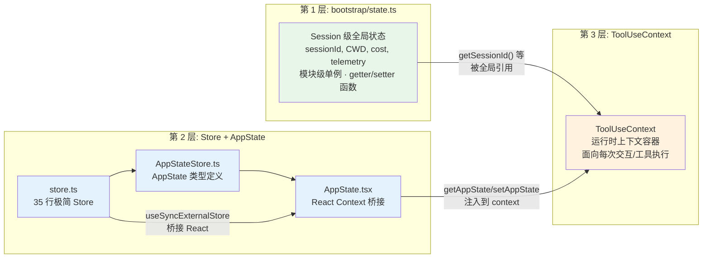
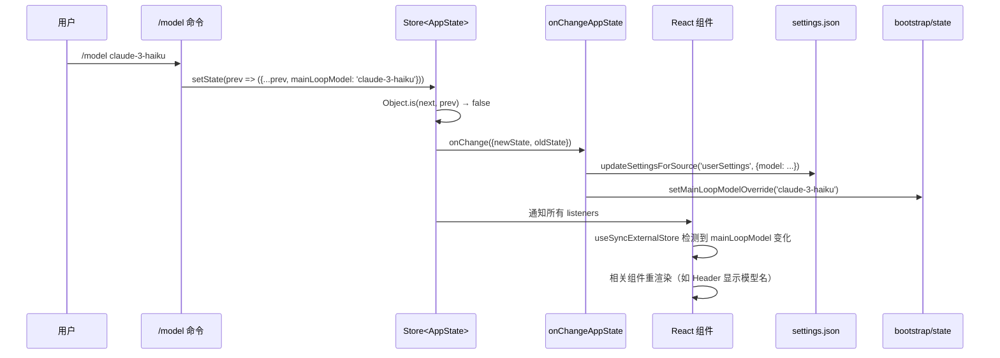

# 第 3 篇：状态管理 — React 与非 React 世界的状态桥接

> 本篇是《深入 Claude Code 源码》系列的第 3 篇。我们将深入分析 Claude Code 如何用一个 35 行的极简 Store 实现，桥接 React UI 与非 React 业务逻辑之间的状态管理，并理解三层状态架构的设计哲学。

## 为什么状态管理值得单独一篇？

Claude Code 面临一个独特的状态管理难题：它**既是一个 React 应用，又不完全是**。

终端 UI 用 Ink（React for CLI）渲染，组件需要响应式的状态更新。但核心业务逻辑 —— API 调用、工具执行、Agent 编排 —— 运行在 React 树之外。一次工具调用的结果需要同时：
1. 更新 React 组件（显示在终端 UI 上）
2. 被非 React 的 `query.ts` 对话循环读取
3. 被 Agent 子系统使用（可能运行在隔离的上下文中）

如果用 Redux/Zustand 这类库？太重了。React 内置的 `useState`/`useReducer`？无法从 React 树外部访问。模块级全局变量？无法触发 React 重渲染。

Claude Code 的答案是：**三层状态架构 + 一个 35 行的自研 Store**。

---

## 一、三层状态架构全景

在深入代码之前，先建立全局认知。Claude Code 的状态分布在三个层次，各有明确的职责边界：



| 层次 | 文件 | 生命周期 | 核心用途 |
|------|------|---------|---------|
| Session 全局 | `bootstrap/state.ts` | 进程级，整个 session 存活 | sessionId、CWD、成本统计、遥测 |
| AppState Store | `state/store.ts` + `AppStateStore.ts` + `AppState.tsx` | REPL 级，跟随 React 树 | UI 状态、权限、工具、插件、MCP |
| ToolUseContext | `Tool.ts:158-254` | 每次交互/工具执行级 | 工具执行所需的全部运行时上下文 |

这三层的设计原则是**向下依赖，向上隔离**：ToolUseContext 引用 AppState 的 getter/setter；AppState 可以读取 bootstrap/state 的值；但反过来不成立。

---

## 二、第 1 层：bootstrap/state.ts — Session 级全局状态

**文件**：`bootstrap/state.ts`（约 600+ 行）

这是整个项目最底层的状态模块。文件开头有一条醒目的注释：

```typescript
// DO NOT ADD MORE STATE HERE - BE JUDICIOUS WITH GLOBAL STATE
```

以及初始化函数前的另一条：

```typescript
// ALSO HERE - THINK THRICE BEFORE MODIFYING
```

这两条注释透露了一个重要的设计决策：**严格控制全局状态的规模**。

### 2.1 为什么需要 bootstrap/state？

有些状态天然是进程级别的，不属于任何 React 组件，也不属于任何单次 query 循环：

- **sessionId**：标识当前会话，从启动到退出不变（除非 resume 另一个 session）
- **CWD / projectRoot**：工作目录，全局唯一
- **成本统计**：`totalCostUSD`、`totalAPIDuration` 等累加器
- **遥测计数器**：OpenTelemetry 的 `Meter`、`Counter` 实例
- **模型使用统计**：`modelUsage` 按模型名累积 token 用量

### 2.2 实现方式：模块级单例 + getter/setter

```typescript
// bootstrap/state.ts:429
const STATE: State = getInitialState()

export function getSessionId(): SessionId {
  return STATE.sessionId
}

export function getCwdState(): string {
  return STATE.cwd
}

export function setCwdState(cwd: string): void {
  STATE.cwd = cwd.normalize('NFC')
}

export function addToTotalCostState(
  cost: number,
  modelUsage: ModelUsage,
  model: string,
): void {
  STATE.modelUsage[model] = modelUsage
  STATE.totalCostUSD += cost
}
```

这是最朴素的状态管理模式 —— **模块级闭包单例**。`STATE` 是一个模块私有的对象，通过导出的 getter/setter 函数提供访问。没有发布-订阅，没有响应式，就是纯粹的命令式读写。

### 2.3 为什么不用 Store？

你可能会问：为什么不把这些状态也放进 AppState Store 里？

答案在于 **import DAG（依赖有向无环图）的约束**。`bootstrap/state.ts` 处于 import 树的最底部（叶子节点），几乎不 import 其他业务模块。需要澄清的是，`state/store.ts` 和 `state/AppStateStore.ts` 本身并不依赖 React —— 真正引入 React 的是 `state/AppState.tsx`。但问题的核心不在于 React 依赖，而在于**分层约束**：如果 bootstrap/state 反向依赖了更高层的应用状态模块（无论是 Store 还是 AppStateStore），就会破坏 DAG 的叶子节点地位，极易引入循环依赖。源码注释也明确提到这一点：

```typescript
// bootstrap can't import listeners directly (DAG leaf), so
// callers register themselves.
```

这是一个很有价值的工程决策：**将最基础的状态放在依赖树的叶子节点，让所有人都能安全地引用它，而它不引用任何人。**

### 2.4 State 类型的规模

`State` 类型定义了约 80+ 个字段，涵盖：

| 类别 | 代表字段 | 用途 |
|------|---------|------|
| 身份标识 | `sessionId`, `parentSessionId` | 会话追踪 |
| 路径信息 | `originalCwd`, `projectRoot`, `cwd` | 目录管理 |
| 成本与性能 | `totalCostUSD`, `totalAPIDuration`, `turnToolCount` | 统计与计费 |
| 模型配置 | `mainLoopModelOverride`, `initialMainLoopModel` | 模型选择 |
| 遥测基础设施 | `meter`, `sessionCounter`, `loggerProvider` | OpenTelemetry |
| Session 标记 | `isInteractive`, `kairosActive`, `isRemoteMode` | 运行模式 |
| 缓存状态 | `promptCache1hEligible`, `afkModeHeaderLatched` | API 优化 |

---

## 三、第 2 层：Store + AppState — React 与非 React 的桥梁

这是整个状态管理系统最精妙的部分。它由三个文件组成，各司其职。

### 3.1 store.ts — 35 行极简 Store

**文件**：`state/store.ts`（35 行）

先看完整代码 —— 真的只有 35 行：

```typescript
// state/store.ts - 完整源码
type Listener = () => void
type OnChange<T> = (args: { newState: T; oldState: T }) => void

export type Store<T> = {
  getState: () => T
  setState: (updater: (prev: T) => T) => void
  subscribe: (listener: Listener) => () => void
}

export function createStore<T>(
  initialState: T,
  onChange?: OnChange<T>,
): Store<T> {
  let state = initialState
  const listeners = new Set<Listener>()

  return {
    getState: () => state,

    setState: (updater: (prev: T) => T) => {
      const prev = state
      const next = updater(prev)
      if (Object.is(next, prev)) return
      state = next
      onChange?.({ newState: next, oldState: prev })
      for (const listener of listeners) listener()
    },

    subscribe: (listener: Listener) => {
      listeners.add(listener)
      return () => listeners.delete(listener)
    },
  }
}
```

这个 Store 的 API 只有三个方法：

| 方法 | 签名 | 用途 |
|------|------|------|
| `getState` | `() => T` | 同步读取当前状态 |
| `setState` | `(updater: (prev: T) => T) => void` | 函数式更新（避免 stale closure） |
| `subscribe` | `(listener: () => void) => () => void` | 订阅变更，返回取消函数 |

几个值得注意的设计细节：

1. **`Object.is` 相等性检查**：如果 updater 返回的是同一个引用，跳过通知。这避免了不必要的重渲染。

2. **`onChange` 回调**：创建 Store 时可以传入一个 `onChange`，每次状态变更时被调用，携带新旧两个状态。这个回调被用来做**全局副作用** —— 比如同步权限模式到外部系统。

3. **`updater` 函数式更新**：不接受直接赋值（`setState(newValue)`），只接受函数（`setState(prev => newValue)`）。这是故意的 —— 函数式更新确保每次调用都基于最新的状态快照，避免 stale snapshot 问题，也让多次异步更新可以正确组合（后一次 updater 拿到的 `prev` 是前一次更新后的结果）。

4. **`Set<Listener>` 而非数组**：用 Set 存储 listener，`add/delete` 操作都是 O(1)，且天然去重。

### 3.2 为什么自研而不用 Zustand？

Zustand 的核心 API 也是 `getState/setState/subscribe`，看起来很像。但 Claude Code 选择自研有几个原因：

- **零依赖**：35 行代码，不需要引入任何库
- **完全可控**：`onChange` 回调是 Zustand 不直接支持的特性
- **TypeScript 优先**：类型定义完全贴合项目需求
- **不需要中间件**：没有 devtools、persist、immer 等需求

这个 Store 的 API 设计恰好匹配了 React 18 的 `useSyncExternalStore` 要求 —— 这不是巧合，而是**为了桥接而精确设计的接口**。

### 3.3 AppStateStore.ts — AppState 类型定义

**文件**：`state/AppStateStore.ts`（约 570 行）

这个文件定义了 `AppState` 类型和 `getDefaultAppState()` 工厂函数。`AppState` 是整个应用 UI 层面的**单一状态树**。

```typescript
// state/AppStateStore.ts:89（简化展示核心字段）
export type AppState = DeepImmutable<{
  // 用户配置
  settings: SettingsJson
  verbose: boolean
  mainLoopModel: ModelSetting

  // 权限系统
  toolPermissionContext: ToolPermissionContext

  // MCP 协议
  mcp: {
    clients: MCPServerConnection[]
    tools: Tool[]
    commands: Command[]
    resources: Record<string, ServerResource[]>
  }

  // 插件系统
  plugins: {
    enabled: LoadedPlugin[]
    disabled: LoadedPlugin[]
    commands: Command[]
    errors: PluginError[]
  }

  // UI 状态
  thinkingEnabled: boolean | undefined
  expandedView: 'none' | 'tasks' | 'teammates'
  footerSelection: FooterItem | null

  // ... 还有约 60+ 个字段
}> & {
  // 这些字段排除在 DeepImmutable 之外
  tasks: { [taskId: string]: TaskState }
  agentNameRegistry: Map<string, AgentId>
}
```

几个关键设计点：

**1. `DeepImmutable<T>` 包装**

整个 AppState 被 `DeepImmutable<T>` 包装，所有属性递归变成 `readonly`。这强制所有状态变更必须通过 `setState` 函数进行，防止任何地方直接修改状态对象。

但注意 `& { tasks, agentNameRegistry }` 被排除在 `DeepImmutable` 之外。源码对 `tasks` 的原因给出了明确注释（`AppStateStore.ts:159`）：

```typescript
// Unified task state - excluded from DeepImmutable because TaskState contains function types
tasks: { [taskId: string]: TaskState }
```

`TaskState` 包含函数类型（如 `abortController`），而 `DeepImmutable` 无法正确处理函数类型。`agentNameRegistry`（`Map<string, AgentId>`）也被放在 `DeepImmutable` 之外，但源码没有给出同样明确的因果说明 —— 可能是因为 `Map` 类型与 `DeepImmutable` 的递归 readonly 转换不兼容，但这属于结构推断，读者应区分对待。

**2. 嵌套结构的组织**

状态不是扁平的，而是按领域分组：`mcp.*` 管理 MCP 连接、`plugins.*` 管理插件、`inbox.*` 管理收件箱。这种结构让 selector 可以精确地订阅某个子树，只在相关状态变化时触发重渲染。

**3. `getDefaultAppState()` 的初始化**

```typescript
// state/AppStateStore.ts:456-569
export function getDefaultAppState(): AppState {
  return {
    settings: getInitialSettings(),
    tasks: {},
    agentNameRegistry: new Map(),
    verbose: false,
    mainLoopModel: null,
    toolPermissionContext: {
      ...getEmptyToolPermissionContext(),
      mode: initialMode,
    },
    thinkingEnabled: shouldEnableThinkingByDefault(),
    promptSuggestionEnabled: shouldEnablePromptSuggestion(),
    // ... 70+ 字段的默认值
  }
}
```

注意有些默认值是动态计算的 —— 如 `shouldEnableThinkingByDefault()` 会根据当前模型能力决定是否默认开启 thinking。

### 3.4 AppState.tsx — React Context 桥接

**文件**：`state/AppState.tsx`

这是桥接的核心。它把非 React 的 `Store<AppState>` 连接到 React 的组件树中。

**Provider 组件**：

```typescript
// state/AppState.tsx（原始 TypeScript 源码，非编译后版本）
export const AppStoreContext = React.createContext<AppStateStore | null>(null)

export function AppStateProvider({
  children,
  initialState,
  onChangeAppState,
}: Props): React.ReactNode {
  // 禁止嵌套
  const hasAppStateContext = useContext(HasAppStateContext)
  if (hasAppStateContext) {
    throw new Error(
      'AppStateProvider can not be nested within another AppStateProvider',
    )
  }

  // Store 创建一次，永不变更 — 稳定的 context value 意味着
  // Provider 永远不触发重渲染
  const [store] = useState(() =>
    createStore<AppState>(
      initialState ?? getDefaultAppState(),
      onChangeAppState,
    ),
  )

  // 监听外部配置变更并同步到 AppState
  const onSettingsChange = useEffectEvent((source: SettingSource) =>
    applySettingsChange(source, store.setState),
  )
  useSettingsChange(onSettingsChange)

  return (
    <HasAppStateContext.Provider value={true}>
      <AppStoreContext.Provider value={store}>
        <MailboxProvider>
          <VoiceProvider>{children}</VoiceProvider>
        </MailboxProvider>
      </AppStoreContext.Provider>
    </HasAppStateContext.Provider>
  )
}
```

核心技巧在这行：`const [store] = useState(() => createStore(...))`。

Provider 的 context value 是 `store`（Store 实例本身），而不是 `store.getState()`。Store 实例在创建后永远不变 —— 所以 **context value 的稳定性避免了"因 context value 改变而导致的消费者全树重渲染"**。当然，Provider 组件本身仍可能因父组件重渲染而重新执行（React 的正常行为），但这不会因 context value 变化而向下传播。真正驱动消费者更新的是 `useSyncExternalStore` 的 subscription 机制，而非 context 变更。这是一个关键的性能设计。

**Consumer hook — useSyncExternalStore 桥接**：

```typescript
// state/AppState.tsx:142-163
export function useAppState<T>(selector: (state: AppState) => T): T {
  const store = useAppStore()

  const get = () => {
    const state = store.getState()
    const selected = selector(state)
    return selected
  }

  return useSyncExternalStore(store.subscribe, get, get)
}
```

`useSyncExternalStore` 是 React 18 提供的官方 API，专门用于订阅外部数据源。它需要三个参数：
- `subscribe`：注册监听函数
- `getSnapshot`：获取当前值
- `getServerSnapshot`：SSR 用，这里传同一个函数

当 `store.setState` 被调用时，所有 listener 被触发，`useSyncExternalStore` 内部重新调用 `get()`，如果 selector 返回值与上次不同（`Object.is` 比较），组件重渲染。

**使用方式**：

```typescript
// 组件中这样使用 — 只在 verbose 变化时重渲染
const verbose = useAppState(s => s.verbose)
const model = useAppState(s => s.mainLoopModel)

// 获取 setter — 永远不触发重渲染
const setAppState = useSetAppState()

// 获取整个 store 实例 — 传给非 React 代码
const store = useAppStateStore()
```

还有一个容错版本 `useAppStateMaybeOutsideOfProvider`，在没有 Provider 的上下文中返回 `undefined` 而不是 throw：

```typescript
// state/AppState.tsx:186-199
export function useAppStateMaybeOutsideOfProvider<T>(
  selector: (state: AppState) => T,
): T | undefined {
  const store = useContext(AppStoreContext)
  return useSyncExternalStore(
    store ? store.subscribe : NOOP_SUBSCRIBE,
    () => store ? selector(store.getState()) : undefined,
  )
}
```

### 3.5 onChangeAppState — 全局副作用处理

**文件**：`state/onChangeAppState.ts`（172 行）

还记得 `createStore` 的第二个参数 `onChange` 吗？`onChangeAppState` 就是那个回调。它在**每次状态变更后**被调用，负责将 AppState 的变更同步到外部系统：

```typescript
// state/onChangeAppState.ts:43-92（核心片段）
export function onChangeAppState({
  newState,
  oldState,
}: {
  newState: AppState
  oldState: AppState
}) {
  // 权限模式变更 → 通知 CCR 和 SDK
  const prevMode = oldState.toolPermissionContext.mode
  const newMode = newState.toolPermissionContext.mode
  if (prevMode !== newMode) {
    const prevExternal = toExternalPermissionMode(prevMode)
    const newExternal = toExternalPermissionMode(newMode)
    if (prevExternal !== newExternal) {
      notifySessionMetadataChanged({
        permission_mode: newExternal,
      })
    }
    notifyPermissionModeChanged(newMode)
  }

  // 模型变更 → 持久化到 settings
  if (newState.mainLoopModel !== oldState.mainLoopModel) {
    if (newState.mainLoopModel === null) {
      updateSettingsForSource('userSettings', { model: undefined })
    } else {
      updateSettingsForSource('userSettings', { model: newState.mainLoopModel })
    }
  }

  // 配置变更 → 清除认证缓存
  if (newState.settings !== oldState.settings) {
    clearApiKeyHelperCache()
    clearAwsCredentialsCache()
    clearGcpCredentialsCache()
  }
}
```

这个设计非常巧妙 —— 注释中解释了历史背景：

> Prior to this block, mode changes were relayed to CCR by only 2 of 8+ mutation paths... Every other path mutated AppState without telling CCR, leaving external_metadata stale.

过去，权限模式变更需要在每个修改它的地方手动通知外部系统，导致 8 个修改路径中只有 2 个正确同步。现在通过 `onChange` 回调，**任何** `setState` 调用导致的变更都会被集中处理，零遗漏。

---

## 四、第 3 层：ToolUseContext — 工具执行的运行时上下文

**文件**：`Tool.ts:158-254`

`ToolUseContext` 不是存储在 Store 中的状态，而是**面向一次交互或一次工具执行的运行时上下文容器**。它最常见的构建场景是 query 对话循环，但不限于此 —— REPL 命令执行（`screens/REPL.tsx`）、权限弹窗流转、side question fallback（`utils/queryContext.ts:142-170`）等路径也会构建 ToolUseContext。它是连接所有状态层的"传话人"。

```typescript
// Tool.ts:158-254（核心字段）
export type ToolUseContext = {
  options: {
    commands: Command[]
    tools: Tools
    mainLoopModel: string
    thinkingConfig: ThinkingConfig
    mcpClients: MCPServerConnection[]
    isNonInteractiveSession: boolean
    agentDefinitions: AgentDefinitionsResult
    // ...
  }
  abortController: AbortController
  readFileState: FileStateCache

  // AppState 的 getter/setter — 连接第 2 层
  getAppState(): AppState
  setAppState(f: (prev: AppState) => AppState): void

  // 任务级 setter — 即使 setAppState 被 no-op，这个也能到达根 Store
  setAppStateForTasks?: (f: (prev: AppState) => AppState) => void

  // 工具执行进度的回调
  setInProgressToolUseIDs: (f: (prev: Set<string>) => Set<string>) => void
  setResponseLength: (f: (prev: number) => number) => void

  // 文件历史和归因追踪
  updateFileHistoryState: (updater: (prev: FileHistoryState) => FileHistoryState) => void
  updateAttributionState: (updater: (prev: AttributionState) => AttributionState) => void

  // Agent 相关
  agentId?: AgentId
  agentType?: string
  messages: Message[]
  // ...
}
```

### 4.1 为什么不直接传 Store？

ToolUseContext 明确包含 `getAppState()` 和 `setAppState()` 而不是直接传 Store 实例，这是有意为之的。因为**不同的调用者需要不同版本的 getAppState/setAppState**：

- **主对话循环**：直接连接真实 Store
- **同步 Agent**（如 Explore Agent）：共享父级的 Store
- **异步 Agent**（如后台 Agent）：`setAppState` 被替换为 no-op，防止干扰 UI

### 4.2 createSubagentContext — Agent 隔离的关键

**文件**：`utils/forkedAgent.ts:345-435`

当一个 Agent 工具创建子 Agent 时，不能直接复用父级的 ToolUseContext —— 那会导致状态互相污染。`createSubagentContext` 负责创建隔离的上下文：

```typescript
// utils/forkedAgent.ts:345-435（简化展示）
export function createSubagentContext(
  parentContext: ToolUseContext,
  overrides?: SubagentContextOverrides,
): ToolUseContext {
  // 1. AbortController: 新建子 controller，链接到父级（父级 abort 会传播）
  const abortController = overrides?.shareAbortController
    ? parentContext.abortController
    : createChildAbortController(parentContext.abortController)

  // 2. getAppState: 包装以设置 shouldAvoidPermissionPrompts
  const getAppState = overrides?.shareAbortController
    ? parentContext.getAppState
    : () => ({
        ...parentContext.getAppState(),
        toolPermissionContext: {
          ...parentContext.getAppState().toolPermissionContext,
          shouldAvoidPermissionPrompts: true,
        },
      })

  return {
    // 3. FileStateCache: 克隆，避免相互影响
    readFileState: cloneFileStateCache(
      overrides?.readFileState ?? parentContext.readFileState,
    ),

    // 4. 新的集合实例 — 防止跨 Agent 污染
    nestedMemoryAttachmentTriggers: new Set<string>(),
    loadedNestedMemoryPaths: new Set<string>(),

    // 5. setAppState: 默认 no-op，除非显式 opt-in 共享
    getAppState,
    setAppState: overrides?.shareSetAppState
      ? parentContext.setAppState
      : () => {},

    // 6. setAppStateForTasks: 始终连接到根 Store！
    setAppStateForTasks:
      parentContext.setAppStateForTasks ?? parentContext.setAppState,

    // ... 其他字段
  }
}
```

这里最精妙的设计是 **`setAppStateForTasks` 的"始终穿透"特性**：

即使 `setAppState` 被设为 no-op（异步 Agent 不应该修改 UI 状态），`setAppStateForTasks` 仍然连接到根 Store。为什么？因为后台 Agent 启动的 bash 任务需要注册到全局任务列表中，否则在进程退出时无法被正确清理 —— 注释中记录了血泪教训：

> Task registration/kill must always reach the root store, even when setAppState is a no-op — otherwise async agents' background bash tasks are never registered and never killed (PPID=1 zombie).

### 4.3 Selectors — 派生状态

**文件**：`state/selectors.ts`（77 行）

Claude Code 也有 selector 的概念，但非常轻量 —— 只用于从 AppState 派生需要复杂计算的视图状态：

```typescript
// state/selectors.ts:59-76
export function getActiveAgentForInput(
  appState: AppState,
): ActiveAgentForInput {
  const viewedTask = getViewedTeammateTask(appState)
  if (viewedTask) {
    return { type: 'viewed', task: viewedTask }
  }

  const { viewingAgentTaskId, tasks } = appState
  if (viewingAgentTaskId) {
    const task = tasks[viewingAgentTaskId]
    if (task?.type === 'local_agent') {
      return { type: 'named_agent', task }
    }
  }

  return { type: 'leader' }
}
```

这个 selector 用**可区分联合类型（Discriminated Union）** 返回结果，调用方可以用 `switch(result.type)` 做类型安全的分支处理。

---

## 五、数据流全景：一次状态变更的完整旅程

让我们追踪一个具体场景：**用户通过 `/model` 命令切换模型**。



1. 用户输入 `/model claude-3-haiku`
2. 命令处理器调用 `store.setState(prev => ({...prev, mainLoopModel: 'claude-3-haiku'}))`
3. Store 内部 `Object.is` 检查 —— 新旧不同，接受更新
4. `onChangeAppState` 被触发：
   - 将模型写入 `settings.json`（持久化）
   - 更新 `bootstrap/state` 的 `mainLoopModelOverride`（进程级）
5. 所有 React listener 被通知
6. 使用了 `useAppState(s => s.mainLoopModel)` 的组件重渲染

注意这个流程中，**一次 `setState` 调用同时完成了三件事**：更新内存状态、持久化到磁盘、通知 UI。这就是集中式 `onChange` 的威力。

---

## 六、可迁移的设计模式

### 模式 1：极简 Store + useSyncExternalStore

用 35 行代码实现一个 Store，通过 React 18 的 `useSyncExternalStore` 桥接到 React 组件。适用于任何需要在 React 和非 React 代码之间共享状态的场景。

**关键要点**：
- Context value 放 Store 实例（稳定引用），不放 state 值，避免因 context value 变化导致消费者全树重渲染
- 用 selector 订阅切片，避免全量重渲染
- `setState` 接受 updater 函数，避免 stale snapshot，让多次异步更新可正确组合

**适用场景**：中小型应用，不想引入 Zustand/Redux 等外部依赖，又需要跨 React/非 React 边界的状态共享。

### 模式 2：onChange 集中式副作用

在 Store 创建时传入 `onChange` 回调，集中处理所有状态变更的副作用（持久化、外部通知、缓存清理）。这比在每个 `setState` 调用处手动触发副作用可靠得多。

**适用场景**：状态变更需要同步到多个外部系统（数据库、API、其他进程），且修改入口很多（CLI 命令、UI 交互、配置文件变更）。

### 模式 3：Context 隔离 + 选择性共享

为子系统（如子 Agent）创建隔离的上下文副本，默认所有可变状态都是隔离的（no-op setter、克隆的缓存），只有经过明确 opt-in 的通道（如 `setAppStateForTasks`）才允许穿透到共享状态。

**关键要点**：
- 默认隔离，显式共享 —— 比默认共享、显式隔离安全得多
- 某些关键操作（如任务注册/清理）必须穿透隔离，否则会造成资源泄漏

**适用场景**：多 Agent/多租户系统、插件系统、任何需要在隔离环境中运行不受信代码的场景。

---

## 下一篇预告

[第 4 篇：System Prompt 工程 — 精密控制模型行为的提示词体系](./04-System-Prompt-工程.md)

我们将深入 `constants/prompts.ts` 和 `constants/systemPromptSections.ts`，揭示 Claude Code 如何将数千字的系统提示词分段组装、分区缓存，以及如何通过提示词精确控制模型的行为（代码风格约束、安全指令、工具使用优先级）。

---

*全部内容请关注 https://github.com/luyao618/Claude-Code-Source-Study (求一颗免费的小星星)*
