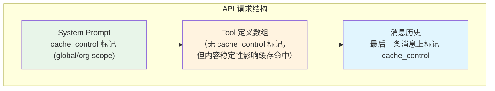

# 第 7 篇：Prompt Cache — 跨模块的缓存策略如何降低 API 成本

> 本篇是《深入 Claude Code 源码》系列的第 7 篇。我们将从一个横切视角，解析 Prompt Cache 机制如何贯穿 System Prompt、对话循环、上下文管理三大模块，以及 Fork Agent 如何通过精密的参数对齐实现跨进程缓存共享。

## 为什么需要理解 Prompt Cache？

调用大模型 API 最大的成本来自 **input tokens**。在一个典型的 Claude Code 交互式会话中，每次用户提问都会把完整的 System Prompt（约 2 万 token）、工具定义（几千 token）、以及之前所有的对话历史一起发送给 API。如果对话进行了 50 轮，每轮平均 5 万 input tokens，那一个会话就消耗 250 万 input tokens。

Anthropic 的 Prompt Caching 机制可以将 **重复前缀** 的成本降低 90%。服务端会缓存请求前缀（System Prompt + 工具定义 + 消息历史前缀），只要下次请求的前缀字节完全一致，就可以从缓存中读取，而非重新处理。

但"字节完全一致"这个要求极其严苛 —— **哪怕多一个空格、换一个 JSON 字段顺序、改一个 `cache_control` 的 scope，整个缓存就失效了。** Claude Code 的源码中充斥着对这个约束的防御性设计。本篇将揭示这些设计的全貌。

本篇将回答三个核心问题：
1. **缓存是怎么标记的？** — `cache_control` 标记的放置策略与作用域选择
2. **缓存是怎么保护的？** — 从 System Prompt 分段到 Cached Microcompact，如何避免缓存失效
3. **缓存是怎么共享的？** — Fork Agent 如何通过 `CacheSafeParams` 实现跨线程缓存命中

---

## 一、Prompt Cache 的基本原理与标记策略

### 1.1 `cache_control` 标记：告诉 API "请缓存到这里"

Anthropic 的 Prompt Caching 通过在请求中的特定位置放置 `cache_control: { type: 'ephemeral' }` 标记来工作。API 服务端会缓存从请求开头到最后一个 `cache_control` 标记之间的所有内容。

Claude Code 在两个层级放置缓存标记：



> **注意**：`toolToAPISchema()` 的接口支持 `cacheControl` 选项（`utils/api.ts:129`），但当前主查询路径调用它时**并未传入 `cacheControl`**（`services/api/claude.ts:1235-1245`）。源码中有一条遗留注释 "toolSchemas (which carries the cache_control marker)"（`claude.ts:1388`），但这与当前代码行为不一致 —— 工具数组上目前没有 `cache_control` 标记。尽管如此，工具定义的字节稳定性仍然至关重要：它们是 API 请求前缀的一部分，任何变化都会导致缓存失效，这也是 `toolSchemaCache` 存在的原因（详见第五节）。

**第一层：System Prompt 块上的标记**

```typescript
// services/api/claude.ts:3213-3237
export function buildSystemPromptBlocks(
  systemPrompt: SystemPrompt,
  enablePromptCaching: boolean,
  options?: {
    skipGlobalCacheForSystemPrompt?: boolean
    querySource?: QuerySource
  },
): TextBlockParam[] {
  return splitSysPromptPrefix(systemPrompt, {
    skipGlobalCacheForSystemPrompt: options?.skipGlobalCacheForSystemPrompt,
  }).map(block => {
    return {
      type: 'text' as const,
      text: block.text,
      ...(enablePromptCaching &&
        block.cacheScope !== null && {
          cache_control: getCacheControl({
            scope: block.cacheScope,
            querySource: options?.querySource,
          }),
        }),
    }
  })
}
```

每个 System Prompt 块可以独立设置 `cacheScope`（`'global'`、`'org'` 或 `null`），不同 scope 有不同的缓存共享范围。

**第二层：消息历史上的标记**

```typescript
// services/api/claude.ts:3063-3106
export function addCacheBreakpoints(
  messages: (UserMessage | AssistantMessage)[],
  enablePromptCaching: boolean,
  querySource?: QuerySource,
  useCachedMC = false,
  newCacheEdits?: CachedMCEditsBlock | null,
  pinnedEdits?: CachedMCPinnedEdits[],
  skipCacheWrite = false,
): MessageParam[] {
  // 只在最后一条消息上放置 cache_control 标记
  // skipCacheWrite 模式下放在倒数第二条（避免 fork 子进程的末尾消息污染缓存）
  const markerIndex = skipCacheWrite ? messages.length - 2 : messages.length - 1
  const result = messages.map((msg, index) => {
    const addCache = index === markerIndex
    if (msg.type === 'user') {
      return userMessageToMessageParam(msg, addCache, enablePromptCaching, querySource)
    }
    return assistantMessageToMessageParam(msg, addCache, enablePromptCaching, querySource)
  })
  // ...
}
```

关键设计：**每个请求只放一个消息级 `cache_control` 标记**。注释中解释了原因 —— API 服务端的 KV 缓存页管理器（`page_manager/index.rs`）只会保留最后一个 `cache_control` 位置的本地注意力 KV 页。如果放两个标记，倒数第二个位置的页面会被保护一个额外的 turn 却永远不会被恢复，浪费缓存空间。

### 1.2 缓存作用域：Global vs Org vs 无标记

`getCacheControl()` 函数根据条件返回不同的缓存控制参数：

```typescript
// services/api/claude.ts:358-374
export function getCacheControl({
  scope,
  querySource,
}: {
  scope?: CacheScope
  querySource?: QuerySource
} = {}): {
  type: 'ephemeral'
  ttl?: '1h'
  scope?: CacheScope
} {
  return {
    type: 'ephemeral',
    ...(should1hCacheTTL(querySource) && { ttl: '1h' }),
    ...(scope === 'global' && { scope }),
  }
}
```

三种作用域的含义：

| 作用域 | 含义 | wire 上的表现 | 适用内容 |
|--------|------|--------------|---------|
| `global` | 所有用户共享缓存 | `{ type: 'ephemeral', scope: 'global' }` | System Prompt 中不变的静态部分 |
| `org` | 同一组织内用户共享 | `{ type: 'ephemeral' }`（省略 scope 字段） | System Prompt 中组织级别相同的部分 |
| `null`（无标记） | 不设置缓存 | 不添加 `cache_control` | 每次请求都不同的动态内容 |

注意 `getCacheControl()` 只在 `scope === 'global'` 时才在 wire 上显式发送 `scope` 字段（`claude.ts:372`）。`org` 是 Claude Code 内部的抽象概念（`cacheScope: 'org'`），在实际 API 请求中表现为省略 scope —— 这是 Anthropic API 的默认缓存行为（组织级隔离）。

### 1.3 缓存 TTL：5 分钟 vs 1 小时

默认的 `ephemeral` 缓存 TTL 是 5 分钟。但对于符合条件的用户（Anthropic 内部员工或付费订阅用户且未超限），可以获得 1 小时的 TTL：

```typescript
// services/api/claude.ts:393-434
function should1hCacheTTL(querySource?: QuerySource): boolean {
  // 3P Bedrock 用户通过环境变量 opt-in
  if (getAPIProvider() === 'bedrock' &&
      isEnvTruthy(process.env.ENABLE_PROMPT_CACHING_1H_BEDROCK)) {
    return true
  }

  // 在 session 级别锁定（latch）资格判断，防止中途 TTL 翻转导致缓存失效
  let userEligible = getPromptCache1hEligible()
  if (userEligible === null) {
    userEligible = process.env.USER_TYPE === 'ant' ||
      (isClaudeAISubscriber() && !currentLimits.isUsingOverage)
    setPromptCache1hEligible(userEligible)  // 锁定，不再重新计算
  }
  if (!userEligible) return false

  // GrowthBook 配置的 allowlist 也被锁定
  let allowlist = getPromptCache1hAllowlist()
  if (allowlist === null) {
    const config = getFeatureValue_CACHED_MAY_BE_STALE<{
      allowlist?: string[]
    }>('tengu_prompt_cache_1h_config', {})
    allowlist = config.allowlist ?? []
    setPromptCache1hAllowlist(allowlist)  // 锁定
  }
  // ...
}
```

注意 **latch（锁存）模式**：TTL 相关的判断结果在 session 级别被锁定，即使中途用户超出配额或 GrowthBook 配置更新，都不会改变已经生效的 TTL。这防止了 mid-session 的 TTL 翻转（从 `1h` 变成 `5m` 或反过来），因为 TTL 翻转会改变 `cache_control` 的序列化字节，导致缓存失效。

---

## 二、System Prompt 的缓存分块策略

### 2.1 `SYSTEM_PROMPT_DYNAMIC_BOUNDARY`：静态与动态的分界线

System Prompt 由多个 section 组成（详见第 4 篇），其中一些是所有用户共享的（如核心指令、工具使用规范），另一些是会话特定的（如 Git 状态、CLAUDE.md 内容、语言设置）。如果把它们合并成一个块做缓存标记，任何动态部分的变化都会导致整个 System Prompt 的缓存失效。

Claude Code 的解决方案是插入一个 **边界标记**：

```typescript
// constants/prompts.ts:114-115
export const SYSTEM_PROMPT_DYNAMIC_BOUNDARY =
  '__SYSTEM_PROMPT_DYNAMIC_BOUNDARY__'
```

这个标记被插入在 System Prompt 的静态 section 和动态 section 之间：

```typescript
// constants/prompts.ts:568-577
  getActionsSection(),
  getUsingYourToolsSection(enabledTools),
  getSimpleToneAndStyleSection(),
  getOutputEfficiencySection(),
  // === BOUNDARY MARKER - DO NOT MOVE OR REMOVE ===
  ...(shouldUseGlobalCacheScope() ? [SYSTEM_PROMPT_DYNAMIC_BOUNDARY] : []),
  // --- Dynamic content (registry-managed) ---
  ...resolvedDynamicSections,
```

### 2.2 `splitSysPromptPrefix()`：按边界拆分为缓存块

`splitSysPromptPrefix()` 根据边界标记将 System Prompt 拆分为最多 4 个块，并为每个块分配不同的 `cacheScope`：

```typescript
// utils/api.ts:321-435
export function splitSysPromptPrefix(
  systemPrompt: SystemPrompt,
  options?: { skipGlobalCacheForSystemPrompt?: boolean },
): SystemPromptBlock[] {
  // ...
```

根据不同条件，有两种主要的拆分策略（以及一个降级的 MCP 分支）：

| 模式 | 条件 | 块划分 |
|------|------|--------|
| **Global cache 模式** | 1P 用户 + 有边界标记 + 无非 defer 的 MCP 工具 | Attribution(`null`) → Prefix(`null`) → 静态内容(`global`) → 动态内容(`null`) |
| **有 MCP 工具时** | 1P + 有非 defer 的 MCP 工具 | `skipGlobalCacheForSystemPrompt=true`，降级为 Attribution(`null`) → Prefix(`org`) → 其余内容(`org`) |
| **默认模式** | 3P 或无边界 | Attribution(`null`) → Prefix(`org`) → 其余内容(`org`) |

Global cache 模式的核心思想是：**静态部分用 `global` scope 标记，可以跨所有用户共享缓存**。当 10 万用户发送相同的静态 System Prompt 前缀时，只需要缓存一份。动态部分不设缓存标记（`null`），因为它每个用户都不同。

当有非 defer 的 MCP 工具时，主查询路径会将 `globalCacheStrategy` 设为 `'none'`（`claude.ts:1225-1229`），并通过 `skipGlobalCacheForSystemPrompt` 使 System Prompt 降级到 `org` scope。这是因为 MCP 工具定义是用户级别的（不同用户配置的 MCP 服务器不同），使用 `global` scope 缓存 System Prompt 但工具定义不同，前缀无法整体匹配。

> **源码考古**：`GlobalCacheStrategy` 类型定义中还保留了 `'tool_based'` 值（`services/api/logging.ts:46`），但当前主查询路径只会产生 `'system_prompt'` 或 `'none'`。`'tool_based'` 可能是早期设计的遗留，或为未来的工具级缓存标记预留。

### 2.3 `systemPromptSection()` vs `DANGEROUS_uncachedSystemPromptSection()`

System Prompt 的各个 section 通过注册机制管理缓存行为：

```typescript
// constants/systemPromptSections.ts:20-38
export function systemPromptSection(
  name: string,
  compute: ComputeFn,
): SystemPromptSection {
  return { name, compute, cacheBreak: false }  // 缓存，只计算一次
}

export function DANGEROUS_uncachedSystemPromptSection(
  name: string,
  compute: ComputeFn,
  _reason: string,  // 强制解释为什么要破坏缓存
): SystemPromptSection {
  return { name, compute, cacheBreak: true }  // 每次重新计算
}
```

`systemPromptSection()` 创建的 section 只在第一次被求值，之后缓存在 bootstrap state 中复用。而 `DANGEROUS_uncachedSystemPromptSection()` 每次都重新计算 —— 函数名中的 `DANGEROUS_` 前缀是刻意为之的：**如果计算结果发生变化，会破坏 Prompt Cache**。它要求调用者必须传入一个 `_reason` 参数解释为什么必须这样做。

```typescript
// constants/systemPromptSections.ts:43-58
export async function resolveSystemPromptSections(
  sections: SystemPromptSection[],
): Promise<(string | null)[]> {
  const cache = getSystemPromptSectionCache()
  return Promise.all(
    sections.map(async s => {
      if (!s.cacheBreak && cache.has(s.name)) {
        return cache.get(s.name) ?? null  // 命中缓存，不重新计算
      }
      const value = await s.compute()
      setSystemPromptSectionCacheEntry(s.name, value)
      return value
    }),
  )
}
```

---

## 三、Cached Microcompact：在保护缓存的同时清理上下文

### 3.1 问题：清理旧的工具结果 vs 保护缓存前缀

在长对话中，早期的工具调用结果（如 `FileRead` 读取的文件内容、`Bash` 的命令输出）会占用大量 token，但随着对话推进，这些结果已经不再有用。第 6 篇介绍了 Microcompact 机制来清理它们。

但传统的 Microcompact 有一个问题：**修改消息内容会改变请求前缀的字节，导致缓存失效**。假设服务端缓存了 `[sysprompt, msg1, msg2(tool_result="file content..."), msg3]` 这个前缀，如果我们把 `msg2` 的 `tool_result` 替换为 `"[Old tool result content cleared]"`，前缀就不匹配了。

### 3.2 两条路径：Time-based vs Cached Microcompact

`microcompactMessages()` 函数实现了两条互斥的路径：

```typescript
// services/compact/microCompact.ts:253-293
export async function microcompactMessages(
  messages: Message[],
  toolUseContext?: ToolUseContext,
  querySource?: QuerySource,
): Promise<MicrocompactResult> {
  // 路径 1：Time-based（缓存已过期，直接清理）
  const timeBasedResult = maybeTimeBasedMicrocompact(messages, querySource)
  if (timeBasedResult) {
    return timeBasedResult
  }

  // 路径 2：Cached MC（缓存仍有效，通过 cache_edits API 清理）
  if (feature('CACHED_MICROCOMPACT')) {
    const mod = await getCachedMCModule()
    const model = toolUseContext?.options.mainLoopModel ?? getMainLoopModel()
    if (mod.isCachedMicrocompactEnabled() &&
        mod.isModelSupportedForCacheEditing(model) &&
        isMainThreadSource(querySource)) {
      return await cachedMicrocompactPath(messages, querySource)
    }
  }

  return { messages }
}
```

**Time-based 路径**（缓存冷态）：

当距离上一次 API 响应超过配置的时间阈值（默认 5 分钟，即缓存已过期）时，直接修改消息内容：

```typescript
// services/compact/microCompact.ts:446-529
function maybeTimeBasedMicrocompact(
  messages: Message[],
  querySource: QuerySource | undefined,
): MicrocompactResult | null {
  const trigger = evaluateTimeBasedTrigger(messages, querySource)
  if (!trigger) return null

  // 缓存已冷，直接替换内容
  const result: Message[] = messages.map(message => {
    // ...替换 tool_result 内容为 TIME_BASED_MC_CLEARED_MESSAGE
  })

  // 重置 Cached MC 状态（因为缓存已失效，旧状态无用）
  resetMicrocompactState()
  return { messages: result }
}
```

**Cached MC 路径**（缓存热态）：

当缓存仍然有效时，不修改消息内容，而是通过 Anthropic 的 `cache_edits` API 告诉服务端 "删除缓存中某些 tool_result 的内容"：

```typescript
// services/compact/microCompact.ts:305-399
async function cachedMicrocompactPath(
  messages: Message[],
  querySource: QuerySource | undefined,
): Promise<MicrocompactResult> {
  const mod = await getCachedMCModule()
  const state = ensureCachedMCState()

  // 注册新发现的 tool results
  for (const message of messages) {
    if (message.type === 'user' && Array.isArray(message.message.content)) {
      for (const block of message.message.content) {
        if (block.type === 'tool_result' && compactableToolIds.has(block.tool_use_id)) {
          mod.registerToolResult(state, block.tool_use_id)
        }
      }
    }
  }

  // 计算哪些工具结果需要删除
  const toolsToDelete = mod.getToolResultsToDelete(state)

  if (toolsToDelete.length > 0) {
    // 创建 cache_edits block（稍后在 addCacheBreakpoints 中注入）
    const cacheEdits = mod.createCacheEditsBlock(state, toolsToDelete)
    pendingCacheEdits = cacheEdits  // 存入模块级变量，等待 API 层消费

    // 返回消息不变 — cache_edits 在 API 层注入
    return {
      messages,  // 注意：消息内容未被修改！
      compactionInfo: {
        pendingCacheEdits: { trigger: 'auto', deletedToolIds: toolsToDelete, ... }
      },
    }
  }
  return { messages }
}
```

### 3.3 `cache_edits` 和 `cache_reference` 的注入

Cached MC 的核心是两个 API 扩展字段：

- **`cache_reference`**：标记在 `tool_result` 块上，告诉 API "这个结果可以被引用删除"
- **`cache_edits`**：放在 user message 中，指令 API "删除这些 cache_reference 对应的内容"

这些字段在 `addCacheBreakpoints()` 函数中注入：

```typescript
// services/api/claude.ts:3141-3208
// 1. 插入新的 cache_edits 到最后一条 user message
if (newCacheEdits && result.length > 0) {
  const dedupedNewEdits = deduplicateEdits(newCacheEdits)
  if (dedupedNewEdits.edits.length > 0) {
    for (let i = result.length - 1; i >= 0; i--) {
      const msg = result[i]
      if (msg && msg.role === 'user') {
        insertBlockAfterToolResults(msg.content, dedupedNewEdits)
        pinCacheEdits(i, newCacheEdits)  // 记录位置，后续请求需要在相同位置重新发送
        break
      }
    }
  }
}

// 2. 给缓存前缀内的 tool_result 添加 cache_reference
if (enablePromptCaching) {
  for (let i = 0; i < lastCCMsg; i++) {
    // ...为每个 tool_result 块添加 cache_reference: tool_use_id
    msg.content[j] = Object.assign({}, block, {
      cache_reference: block.tool_use_id,
    })
  }
}
```

**Pinned edits 机制**：一旦某个 `cache_edits` block 在某个位置被发送，后续所有请求都必须在**相同的 message index** 重新发送它。这是 API 的要求 —— `cache_edits` 本身也是请求前缀的一部分，如果只在一次请求中出现，前缀就不一致了。

```typescript
// services/compact/microCompact.ts:100-118
export function getPinnedCacheEdits(): PinnedCacheEdits[] {
  if (!cachedMCState) return []
  return cachedMCState.pinnedEdits
}

export function pinCacheEdits(
  userMessageIndex: number,
  block: CacheEditsBlock,
): void {
  if (cachedMCState) {
    cachedMCState.pinnedEdits.push({ userMessageIndex, block })
  }
}
```

---

## 四、Fork Agent 的缓存共享：CacheSafeParams

### 4.1 为什么 Fork Agent 需要共享缓存？

Claude Code 会在后台 fork 出子 Agent 执行各种任务：session memory 提取、prompt suggestion 生成、post-turn summary 等。每个 fork 都会发起独立的 API 请求。如果每个 fork 的请求前缀都不同，就无法利用主线程已经创建的缓存 —— 意味着每个 fork 都需要重新处理几万 token 的前缀，这是巨大的浪费。

### 4.2 `CacheSafeParams`：必须与父线程一致的参数

`CacheSafeParams` 类型精确定义了哪些参数必须与父线程保持一致才能共享缓存：

```typescript
// utils/forkedAgent.ts:46-68
/**
 * Parameters that must be identical between the fork and parent API requests
 * to share the parent's prompt cache. The Anthropic API cache key is composed of:
 * system prompt, tools, model, messages (prefix), and thinking config.
 */
export type CacheSafeParams = {
  /** System prompt - must match parent for cache hits */
  systemPrompt: SystemPrompt
  /** User context - prepended to messages, affects cache */
  userContext: { [k: string]: string }
  /** System context - appended to system prompt, affects cache */
  systemContext: { [k: string]: string }
  /** Tool use context containing tools, model, and other options */
  toolUseContext: ToolUseContext
  /** Parent context messages for prompt cache sharing */
  forkContextMessages: Message[]
}
```

API 的缓存键由 5 个要素组成：**system prompt + tools + model + messages prefix + thinking config**。`CacheSafeParams` 把前 4 个显式携带（thinking config 从 `toolUseContext.options.thinkingConfig` 继承）。

### 4.3 `saveCacheSafeParams()` / `getLastCacheSafeParams()`：跨 turn 参数复用

在主线程每个 turn 结束后，`handleStopHooks` 会保存当前的 `CacheSafeParams`：

```typescript
// utils/forkedAgent.ts:70-81
// Slot written by handleStopHooks after each turn so post-turn forks
// (promptSuggestion, postTurnSummary, /btw) can share the main loop's
// prompt cache without each caller threading params through.
let lastCacheSafeParams: CacheSafeParams | null = null

export function saveCacheSafeParams(params: CacheSafeParams | null): void {
  lastCacheSafeParams = params
}

export function getLastCacheSafeParams(): CacheSafeParams | null {
  return lastCacheSafeParams
}
```

后续的 post-turn fork（如 prompt suggestion、session memory）直接读取这个 slot，无需每个调用方手动线程化参数。

### 4.4 `runForkedAgent()`：使用缓存安全参数发起请求

```typescript
// utils/forkedAgent.ts:489-556
export async function runForkedAgent({
  promptMessages,
  cacheSafeParams,
  // ...
}: ForkedAgentParams): Promise<ForkedAgentResult> {
  const {
    systemPrompt,
    userContext,
    systemContext,
    toolUseContext,
    forkContextMessages,
  } = cacheSafeParams

  // 创建隔离的上下文（mutable state 隔离，但 options 不变 → 同 model、同 tools）
  const isolatedToolUseContext = createSubagentContext(toolUseContext, overrides)

  // 消息前缀 = 父线程的完整历史 + fork 的新 prompt
  const initialMessages: Message[] = [...forkContextMessages, ...promptMessages]

  // 使用与父线程相同的 systemPrompt、userContext、systemContext 发起查询
  for await (const message of query({
    messages: initialMessages,
    systemPrompt,
    userContext,
    systemContext,
    canUseTool,
    toolUseContext: isolatedToolUseContext,
    querySource,
    maxOutputTokensOverride: maxOutputTokens,
    // ...
  })) {
    // 收集结果...
  }
}
```

### 4.5 Fork Subagent 的 byte-exact prompt threading

Fork 子 Agent 有一个更激进的缓存优化 —— **直接复用父线程已渲染的 System Prompt 字节**，而非重新调用 `getSystemPrompt()` 重新生成：

```typescript
// tools/AgentTool/forkSubagent.ts:44-71
/**
 * The getSystemPrompt here is unused: the fork path passes
 * `override.systemPrompt` with the parent's already-rendered system prompt
 * bytes, threaded via `toolUseContext.renderedSystemPrompt`. Reconstructing
 * by re-calling getSystemPrompt() can diverge (GrowthBook cold→warm) and
 * bust the prompt cache; threading the rendered bytes is byte-exact.
 */
export const FORK_AGENT = {
  // ...
  getSystemPrompt: () => '',  // 永远不会被调用
} satisfies BuiltInAgentDefinition
```

为什么不能重新生成 System Prompt？因为 GrowthBook（A/B 测试框架）的状态可能在 fork 时已经从 "cold"（未初始化）变成了 "warm"（已加载），导致生成的 System Prompt 包含不同的 Feature Flag 分支 —— 即使语义完全一致，字节上的差异也会导致缓存失效。

### 4.6 `contentReplacementState` 的克隆：保证工具结果替换决策一致

`forkedAgent.ts` 的 `createSubagentContext()` 中有一个精妙的细节 —— 工具结果的替换状态（`contentReplacementState`）默认是**克隆**而非重新创建：

```typescript
// utils/forkedAgent.ts:389-403
// Clone by default (not fresh): cache-sharing forks process parent
// messages containing parent tool_use_ids. A fresh state would see
// them as unseen and make divergent replacement decisions → wire
// prefix differs → cache miss. A clone makes identical decisions →
// cache hit.
contentReplacementState:
  overrides?.contentReplacementState ??
  (parentContext.contentReplacementState
    ? cloneContentReplacementState(parentContext.contentReplacementState)
    : undefined),
```

背景：Claude Code 有一个工具结果预算管理机制，会把超大的工具结果（如读取了一个 1 万行的文件）替换为磁盘上的摘要版本。这个替换决策记录在 `contentReplacementState` 中。如果 fork 子进程用一个全新的 state，它在处理父线程的消息前缀时会做出不同的替换决策 —— 某些结果在父线程被替换了，在 fork 中却保留了原文 —— 导致序列化的消息字节不一致，缓存失效。

```typescript
// utils/toolResultStorage.ts:399-412
/**
 * Clone replacement state for a cache-sharing fork.
 * The fork needs state identical to the source at fork time so
 * enforceToolResultBudget makes the same choices → same wire prefix →
 * prompt cache hit.
 */
export function cloneContentReplacementState(
  source: ContentReplacementState,
): ContentReplacementState {
  return {
    seenIds: new Set(source.seenIds),
    replacements: new Map(source.replacements),
  }
}
```

### 4.7 Fork 消息的 byte-identical 构造

Fork 子进程的消息前缀也需要精心构造以最大化缓存共享：

```typescript
// tools/AgentTool/forkSubagent.ts:95-105
/**
 * For prompt cache sharing, all fork children must produce byte-identical
 * API request prefixes. This function:
 * 1. Keeps the full parent assistant message (all tool_use blocks, thinking, text)
 * 2. Builds a single user message with tool_results for every tool_use block
 *    using an identical placeholder, then appends a per-child directive text block
 *
 * Result: [...history, assistant(all_tool_uses), user(placeholder_results..., directive)]
 * Only the final text block differs per child, maximizing cache hits.
 */
```

所有 fork 子进程共享相同的 `tool_result` 占位符文本（`'Fork started — processing in background'`），只有最后的 directive 文本块不同。由于 `cache_control` 标记放在最后一条消息的最后一个块上，而 directive 正好是最后一个块 —— 前面所有相同的部分都可以被缓存命中。

```typescript
// tools/AgentTool/forkSubagent.ts:91-93
/** Placeholder text used for all tool_result blocks in the fork prefix.
 * Must be identical across all fork children for prompt cache sharing. */
const FORK_PLACEHOLDER_RESULT = 'Fork started — processing in background'
```

### 4.8 `skipCacheWrite`：避免 fork 污染缓存

Fork 子进程通常是 fire-and-forget（执行完就丢弃），它的末尾消息不需要被缓存：

```typescript
// services/api/claude.ts:3084-3089
// For fire-and-forget forks (skipCacheWrite) we shift the
// marker to the second-to-last message: that's the last shared-prefix
// point, so the write is a no-op merge on mycro (entry already exists)
// and the fork doesn't leave its own tail in the KVCC.
const markerIndex = skipCacheWrite ? messages.length - 2 : messages.length - 1
```

`skipCacheWrite` 模式将 `cache_control` 标记移到倒数第二条消息 —— 这恰好是父线程和 fork 共享的最后一个前缀点。在这个点写入缓存是一个 no-op（因为父线程已经缓存过了），而 fork 自己的末尾消息不会被写入 KVCC（Key-Value Cache Collection），避免了缓存污染。

---

## 五、Prompt Cache Break Detection：当缓存失效时

### 5.1 两阶段检测机制

即使有了上述所有保护措施，缓存仍然可能意外失效。Claude Code 实现了一个完整的**缓存失效检测系统**，帮助团队追踪和诊断缓存问题：

```typescript
// services/api/promptCacheBreakDetection.ts:247-430
// 阶段 1（pre-call）：记录当前请求的 prompt 状态快照
export function recordPromptState(snapshot: PromptStateSnapshot): void {
  // 计算 systemPrompt hash、tools hash、model、betas 等
  // 与上次请求的快照对比，记录哪些发生了变化
}

// 阶段 2（post-call）：检查 API 响应的缓存 token
export async function checkResponseForCacheBreak(
  querySource, cacheReadTokens, cacheCreationTokens, messages, agentId, requestId
): Promise<void> {
  // 如果 cache_read_tokens 下降超过 5%，判定为缓存失效
  // 结合阶段 1 的 pending changes 生成原因分析
}
```

检测器跟踪 **12 个可能导致缓存失效的维度**：

| 维度 | 说明 |
|------|------|
| `systemPromptChanged` | System Prompt 文本变化（去除 cache_control 后的 hash） |
| `toolSchemasChanged` | 工具定义变化（逐工具 hash 对比） |
| `modelChanged` | 模型切换 |
| `fastModeChanged` | Fast mode 开关 |
| `cacheControlChanged` | cache_control 的 scope 或 TTL 变化 |
| `globalCacheStrategyChanged` | Global cache 策略变化（当前仅使用 `system_prompt` / `none`） |
| `betasChanged` | Beta header 列表变化 |
| `autoModeChanged` | Auto mode 开关 |
| `overageChanged` | 用量超限状态变化 |
| `cachedMCChanged` | Cached microcompact 开关 |
| `effortChanged` | Effort 级别变化 |
| `extraBodyChanged` | 额外 API body 参数变化 |

### 5.2 Latch 模式：防止状态翻转导致缓存失效

源码中多处使用 **latch（锁存）** 模式来防止 session 中途的状态翻转破坏缓存：

```typescript
// services/api/claude.ts:117-132（bootstrap/state.ts 中的 latch 状态）
import {
  getAfkModeHeaderLatched,
  getCacheEditingHeaderLatched,
  getFastModeHeaderLatched,
  // ...
  setAfkModeHeaderLatched,
  setCacheEditingHeaderLatched,
  setFastModeHeaderLatched,
  // ...
} from 'src/bootstrap/state.js'
```

以 AFK mode 为例：一旦 auto mode 在 session 中首次激活，AFK beta header 就被锁存为 `true`，即使后续 auto mode 被关闭，header 也不会被移除。这确保了 beta header 列表在整个 session 中保持稳定，不会因为 header 列表的变化导致缓存失效。

同样的模式应用于 cache editing header、fast mode header 等 —— **一旦开启就不关闭，直到 session 结束、`/clear` 或 `/compact`。** 源码中 `clearSystemPromptSections()` 明确在 `/clear` 和 `/compact` 时同时清除 section cache 和 beta header latches（`systemPromptSections.ts:60-68`），因为 compact 后对话已被重新摘要，相当于开始一段新的缓存前缀。

### 5.3 Tool Schema Cache：防止工具定义抖动

工具定义是缓存键的重要组成部分。如果某个工具的 `description`（来自 `tool.prompt()`）每次请求都微妙不同，缓存就会不断失效。

```typescript
// utils/api.ts:139-209
export async function toolToAPISchema(tool: Tool, options): Promise<BetaToolUnion> {
  // Session-stable base schema: name, description, input_schema, strict,
  // eager_input_streaming. These are computed once per session and cached to
  // prevent mid-session GrowthBook flips or tool.prompt() drift from churning
  // the serialized tool array bytes.
  const cache = getToolSchemaCache()
  let base = cache.get(cacheKey)
  if (!base) {
    base = {
      name: tool.name,
      description: await tool.prompt({ ... }),
      input_schema,
    }
    cache.set(cacheKey, base)
  }
  // ...
}
```

工具的 `name`、`description`、`input_schema` 在 session 内只计算一次并缓存。即使 GrowthBook 的 feature flag 在 session 中途翻转（比如 `tengu_tool_pear` 从 false 变成 true），也不会改变已经缓存的工具 schema。

---

## 六、缓存策略全景图

```mermaid
graph TD
    subgraph "System Prompt 层"
        SP_STATIC["静态部分<br/>scope: global / org"]
        SP_BOUNDARY["DYNAMIC_BOUNDARY<br/>分界标记"]
        SP_DYNAMIC["动态部分<br/>scope: null (不缓存)"]
        SP_STATIC --> SP_BOUNDARY --> SP_DYNAMIC
    end

    subgraph "Tool 定义层"
        TOOL_CACHE["toolSchemaCache<br/>session 级缓存"]
        TOOL_SCHEMA["序列化的工具数组<br/>无 cache_control 标记<br/>但字节稳定性影响缓存"]
        TOOL_CACHE --> TOOL_SCHEMA
    end

    subgraph "消息层"
        MSG_PREFIX["消息历史前缀<br/>与上一轮请求共享"]
        MSG_LAST["最后一条消息<br/>标记 cache_control"]
        MC_TIME["Time-based MC<br/>缓存冷 → 直接清理内容"]
        MC_CACHED["Cached MC<br/>缓存热 → cache_edits API"]
        MSG_PREFIX --> MSG_LAST
        MSG_PREFIX --> MC_TIME
        MSG_PREFIX --> MC_CACHED
    end

    subgraph "Fork Agent 层"
        CSP["CacheSafeParams<br/>5 要素对齐"]
        BYTE_EXACT["byte-exact prompt<br/>复用已渲染的字节"]
        CRS["contentReplacementState<br/>克隆替换决策"]
        SKIP_WRITE["skipCacheWrite<br/>避免 fork 污染缓存"]
        CSP --> BYTE_EXACT
        CSP --> CRS
        CSP --> SKIP_WRITE
    end

    subgraph "防御层"
        LATCH["Latch 模式<br/>TTL/header/flag 锁存"]
        SECTION_CACHE["Section Cache<br/>System Prompt 分段缓存"]
        DETECT["Cache Break Detection<br/>12 维度监控"]
        LATCH --> DETECT
        SECTION_CACHE --> DETECT
    end

    style SP_STATIC fill:#e8f5e9
    style MC_CACHED fill:#e1f5fe
    style CSP fill:#fff3e0
    style LATCH fill:#fce4ec
```



---

## 七、可迁移的设计模式

### 模式 1：分层缓存标记 + 静态/动态分界

将请求内容分为"所有用户共享的静态部分"和"用户特定的动态部分"，用不同的缓存作用域标记。静态部分用最广的 scope（全局或组织级），动态部分不标记或用窄 scope。这种模式适用于任何有 prompt caching 的 LLM API。

**适用场景**：调用任何支持 prompt caching 的 LLM API 的应用，尤其是多用户共享基础 prompt 的 SaaS 产品。

### 模式 2：Latch（锁存）防止 mid-session 翻转

对于影响缓存键的配置（TTL、beta headers、feature flags），在 session 开始时评估一次并锁存，整个 session 期间不再重新评估。这避免了配置热更新或用户状态变化导致的缓存失效。

**适用场景**：任何使用 feature flags / A/B testing 且关心缓存一致性的系统。

### 模式 3：Fork 子进程的 byte-exact 参数传递

在 fork 子进程中，不要重新计算/渲染父线程已有的数据（如 System Prompt），而是直接传递父线程已经序列化好的字节。重新计算可能因为环境状态的微小差异产生不同的结果，破坏缓存前缀的一致性。

**适用场景**：任何需要并行执行多个 API 请求且希望共享缓存前缀的场景（如 agent swarm、并发搜索）。

---

## 下一篇预告

[第 8 篇：Thinking 与推理控制 — 让模型"想"多少](./08-Thinking-与推理控制.md)

我们将探索 Claude Code 如何通过 `ThinkingConfig`、`adaptive` / `enabled` / `disabled` 三种模式、以及 `ultrathink` 关键词来精细控制模型的推理深度。你会看到 thinking budget 与 output token 限制之间微妙的交互关系。

---

*全部内容请关注 https://github.com/luyao618/Claude-Code-Source-Study (求一颗免费的小星星)*
