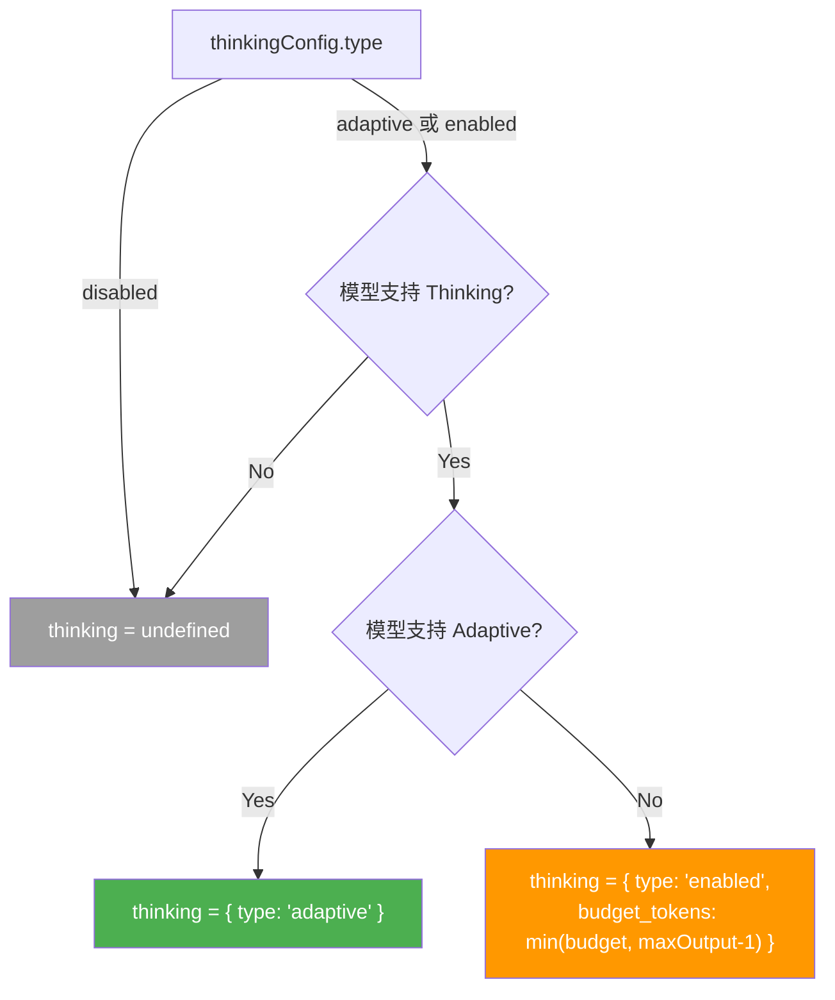
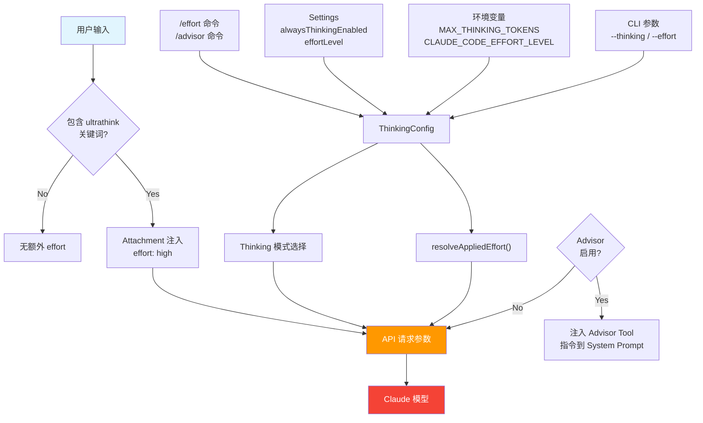

# 第 8 篇：Thinking 与推理控制 — 让模型"想"多少

> 本篇是《深入 Claude Code 源码》系列的第 8 篇。我们将深入分析 Claude Code 如何精细控制模型的推理深度——从 Extended Thinking 的三种模式、Effort 级别系统、`ultrathink` 关键词触发，到 Advisor 这一"更强模型审阅"机制。
>
> 这些机制共同回答了一个核心问题：**在速度、质量和成本之间，如何给用户最大的控制权？**

## 为什么需要推理控制？

大语言模型的推理能力不是免费的。当模型"想得更深"时，它消耗更多的 token、花费更多的时间、产生更高的成本。但并非所有任务都需要深度推理——重命名一个变量和重构整个模块的架构，需要的思考量天差地别。

Claude Code 面对的工程挑战是：**如何让用户（和系统）灵活地在"快速响应"和"深度思考"之间切换，同时确保不同模型版本的行为一致性？**

源码中围绕这个问题构建了四个相互关联的子系统：

1. **ThinkingConfig** — 控制模型是否开启 Extended Thinking 及其模式
2. **Effort** — 控制模型的推理努力程度（low / medium / high / max）
3. **Ultrathink** — 用户在输入中键入关键词即可临时提升推理深度
4. **Advisor** — 在主模型之外引入一个更强的"审阅者"模型

---

## 一、ThinkingConfig — Extended Thinking 的三种模式

### 1.1 类型定义

**文件**：`utils/thinking.ts:10-13`

```typescript
export type ThinkingConfig =
  | { type: 'adaptive' }
  | { type: 'enabled'; budgetTokens: number }
  | { type: 'disabled' }
```

三种模式的含义清晰明确：

| 模式 | 含义 | 适用场景 |
|------|------|---------|
| `adaptive` | 模型自主决定是否思考及思考多少 | 新模型（4.6+），推荐默认 |
| `enabled` + `budgetTokens` | 强制开启思考，指定 token 预算上限 | 旧模型或需要精确控制思考预算时 |
| `disabled` | 完全关闭思考 | Side query、classifier 等辅助调用 |

### 1.2 默认值的确定：谁来决定"想不想"？

**文件**：`utils/thinking.ts:146-162`

```typescript
export function shouldEnableThinkingByDefault(): boolean {
  if (process.env.MAX_THINKING_TOKENS) {
    return parseInt(process.env.MAX_THINKING_TOKENS, 10) > 0
  }

  const { settings } = getSettingsWithErrors()
  if (settings.alwaysThinkingEnabled === false) {
    return false
  }

  // Enable thinking by default unless explicitly disabled.
  return true
}
```

优先级链非常清晰：

1. **环境变量 `MAX_THINKING_TOKENS`** — 如果设置了，值 > 0 就开启
2. **Settings 中的 `alwaysThinkingEnabled`** — 显式设为 `false` 则关闭
3. **默认开启** — 注释中特别标注了 `IMPORTANT`：不要在不通知模型发布 DRI 和研究团队的情况下修改默认值

这种"默认开启 + 多层覆盖"的设计体现了一个产品理念：**Extended Thinking 是模型质量的重要组成部分，应该尽可能开启，但必须给用户和运维提供关闭的手段。**

### 1.3 ThinkingConfig 在启动时的初始化

**文件**：`main.tsx:2456-2488`

```typescript
let thinkingEnabled = shouldEnableThinkingByDefault();
let thinkingConfig: ThinkingConfig = thinkingEnabled !== false ? {
  type: 'adaptive'
} : {
  type: 'disabled'
};

if (options.thinking === 'adaptive' || options.thinking === 'enabled') {
  thinkingEnabled = true;
  thinkingConfig = { type: 'adaptive' };
} else if (options.thinking === 'disabled') {
  thinkingEnabled = false;
  thinkingConfig = { type: 'disabled' };
} else {
  const maxThinkingTokens = process.env.MAX_THINKING_TOKENS
    ? parseInt(process.env.MAX_THINKING_TOKENS, 10)
    : options.maxThinkingTokens;
  if (maxThinkingTokens !== undefined) {
    if (maxThinkingTokens > 0) {
      thinkingEnabled = true;
      thinkingConfig = { type: 'enabled', budgetTokens: maxThinkingTokens };
    } else if (maxThinkingTokens === 0) {
      thinkingEnabled = false;
      thinkingConfig = { type: 'disabled' };
    }
  }
}
```

初始化逻辑的优先级：CLI 参数 `--thinking` → 环境变量 `MAX_THINKING_TOKENS` → CLI 参数 `--max-thinking-tokens` → 默认值。注意一个细节：当用户指定了 `--thinking enabled` 时，实际创建的是 `{ type: 'adaptive' }`——因为 adaptive 是 enabled 的超集，对新模型更优。

### 1.4 模型能力检测：谁支持"想"？

并非所有模型都支持 Extended Thinking。源码中有两个层次的能力检测：

**文件**：`utils/thinking.ts:90-144`

```typescript
// 基础思考能力
export function modelSupportsThinking(model: string): boolean {
  const supported3P = get3PModelCapabilityOverride(model, 'thinking')
  if (supported3P !== undefined) return supported3P

  const canonical = getCanonicalName(model)
  const provider = getAPIProvider()
  // 1P and Foundry: all Claude 4+ models (including Haiku 4.5)
  if (provider === 'foundry' || provider === 'firstParty') {
    return !canonical.includes('claude-3-')
  }
  // 3P (Bedrock/Vertex): only Opus 4+ and Sonnet 4+
  return canonical.includes('sonnet-4') || canonical.includes('opus-4')
}

// Adaptive Thinking（更高级）
export function modelSupportsAdaptiveThinking(model: string): boolean {
  const supported3P = get3PModelCapabilityOverride(model, 'adaptive_thinking')
  if (supported3P !== undefined) return supported3P

  const canonical = getCanonicalName(model)
  // Supported by a subset of Claude 4 models
  if (canonical.includes('opus-4-6') || canonical.includes('sonnet-4-6')) {
    return true
  }
  // ...legacy models return false

  // Default to true for unknown model strings on 1P and Foundry
  const provider = getAPIProvider()
  return provider === 'firstParty' || provider === 'foundry'
}
```

这里有一个**关键的设计决策**：对于 1P（Anthropic 直连）和 Foundry 上的未知模型字符串，adaptive thinking 默认返回 `true`。注释解释了原因：

> Newer models (4.6+) are all trained on adaptive thinking and MUST have it enabled for model testing. DO NOT default to false for first party, otherwise we may silently degrade model quality.

这体现了"安全默认值"的思维——宁可多发一个模型可能忽略的参数，也不能静默降低模型质量。

### 1.5 三方模型覆盖：ModelCapabilityOverride

**文件**：`utils/model/modelSupportOverrides.ts`

```typescript
export type ModelCapabilityOverride =
  | 'effort'
  | 'max_effort'
  | 'thinking'
  | 'adaptive_thinking'
  | 'interleaved_thinking'

export const get3PModelCapabilityOverride = memoize(
  (model: string, capability: ModelCapabilityOverride): boolean | undefined => {
    if (getAPIProvider() === 'firstParty') return undefined
    const m = model.toLowerCase()
    for (const tier of TIERS) {
      const pinned = process.env[tier.modelEnvVar]
      const capabilities = process.env[tier.capabilitiesEnvVar]
      if (!pinned || capabilities === undefined) continue
      if (m !== pinned.toLowerCase()) continue
      return capabilities.toLowerCase().split(',').map(s => s.trim())
        .includes(capability)
    }
    return undefined
  },
  (model, capability) => `${model.toLowerCase()}:${capability}`,
)
```

三方平台（Bedrock、Vertex）的模型能力可能与 1P 不同。这个覆盖机制通过环境变量 `ANTHROPIC_DEFAULT_OPUS_MODEL_SUPPORTED_CAPABILITIES` 等，让部署方以逗号分隔列表声明模型支持的能力。`memoize` 确保同一模型+能力的检测只执行一次。

---

## 二、Thinking 如何注入 API 请求

### 2.1 claude.ts 中的核心决策逻辑

**文件**：`services/api/claude.ts:1596-1630`

ThinkingConfig 在 `queryModel()` 函数中被翻译为 API 参数：

```typescript
const hasThinking =
  thinkingConfig.type !== 'disabled' &&
  !isEnvTruthy(process.env.CLAUDE_CODE_DISABLE_THINKING)
let thinking: BetaMessageStreamParams['thinking'] | undefined = undefined

if (hasThinking && modelSupportsThinking(options.model)) {
  if (
    !isEnvTruthy(process.env.CLAUDE_CODE_DISABLE_ADAPTIVE_THINKING) &&
    modelSupportsAdaptiveThinking(options.model)
  ) {
    // 支持 adaptive 的模型：始终使用 adaptive，不设 budget
    thinking = { type: 'adaptive' }
  } else {
    // 不支持 adaptive 的模型：使用带 budget 的 enabled 模式
    let thinkingBudget = getMaxThinkingTokensForModel(options.model)
    if (
      thinkingConfig.type === 'enabled' &&
      thinkingConfig.budgetTokens !== undefined
    ) {
      thinkingBudget = thinkingConfig.budgetTokens
    }
    thinkingBudget = Math.min(maxOutputTokens - 1, thinkingBudget)
    thinking = {
      budget_tokens: thinkingBudget,
      type: 'enabled',
    }
  }
}
```

注释中的 `IMPORTANT` 标注再次出现：

> Do not change the adaptive-vs-budget thinking selection below without notifying the model launch DRI and research.

这段逻辑的核心决策树：



一个关键约束：`budget_tokens` 必须严格小于 `max_tokens`（API 要求），所以用 `Math.min(maxOutputTokens - 1, thinkingBudget)` 保证。对于已弃用的旧路径，`getMaxThinkingTokensForModel()` 直接返回 `upperLimit - 1`。

### 2.2 Temperature 与 Thinking 的互斥

**文件**：`services/api/claude.ts:1691-1694`

```typescript
// Only send temperature when thinking is disabled — the API requires
// temperature: 1 when thinking is enabled, which is already the default.
const temperature = !hasThinking
  ? (options.temperatureOverride ?? 1)
  : undefined
```

API 要求 Extended Thinking 开启时 temperature 必须为 1。源码直接在 thinking 开启时不发送 temperature 参数，依赖服务端默认值，避免冲突。

### 2.3 运维逃生阀：Kill Switch 环境变量

源码中散布着多个可以在运行时紧急关闭推理特性的环境变量，这些在生产事故中至关重要：

| 环境变量 | 作用 | 检查位置 |
|---------|------|---------|
| `CLAUDE_CODE_DISABLE_THINKING` | 完全关闭 Extended Thinking | `claude.ts:1597` |
| `CLAUDE_CODE_DISABLE_ADAPTIVE_THINKING` | 仅关闭 adaptive 模式，回退到 budget 模式 | `claude.ts:1606` |
| `CLAUDE_CODE_EFFORT_LEVEL` | 强制覆盖 effort（设为 `unset` 则不发送） | `effort.ts:137-142` |
| `CLAUDE_CODE_ALWAYS_ENABLE_EFFORT` | 无视模型检测，强制启用 effort 参数 | `effort.ts:25-27` |
| `CLAUDE_CODE_DISABLE_ADVISOR_TOOL` | 关闭 Advisor 功能 | `advisor.ts:61` |
| `DISABLE_INTERLEAVED_THINKING` | 关闭 Interleaved Thinking beta | `betas.ts:258` |

此外，内部用户（`process.env.USER_TYPE === 'ant'`）在多处获得特殊待遇：`modelSupportsThinking()` 中通过 `resolveAntModel()` 扩展模型支持范围（`thinking.ts:95-99`）；`modelSupportsMaxEffort()` 为 ant 用户开放所有内部模型的 `max` effort（`effort.ts:61-63`）；`getDefaultEffortForModel()` 中 ant 用户有独立的默认值链路，可通过 GrowthBook 配置的 `defaultModel` 覆盖（`effort.ts:282-301`）。

### 2.4 Interleaved Thinking（ISP）与 Context Management

Extended Thinking 还影响两个相关的 API 特性。

**Interleaved Thinking（交错思考）**：允许 thinking block 出现在工具调用之间，而非仅在回复开头。

**文件**：`utils/betas.ts:92-110, 254-261`

```typescript
export function modelSupportsISP(model: string): boolean {
  // ...
  const provider = getAPIProvider()
  if (provider === 'foundry') return true      // Foundry 全部支持
  if (provider === 'firstParty') {
    return !canonical.includes('claude-3-')    // 1P: Claude 4+ 支持
  }
  return canonical.includes('sonnet-4') || canonical.includes('opus-4')
}

// 在 getMergedBetas() 中注入 beta header
if (!isEnvTruthy(process.env.DISABLE_INTERLEAVED_THINKING) && modelSupportsISP(model)) {
  betaHeaders.push(INTERLEAVED_THINKING_BETA_HEADER)
}
```

### 2.5 Thinking 清理（Context Management 层面）

当对话空闲超过 1 小时后，Prompt Cache 已经失效，保留旧的 thinking block 没有缓存收益，反而浪费 token。

**文件**：`services/api/claude.ts:1443-1456`

```typescript
let thinkingClearLatched = getThinkingClearLatched() === true
if (!thinkingClearLatched && isAgenticQuery) {
  const lastCompletion = getLastApiCompletionTimestamp()
  if (
    lastCompletion !== null &&
    Date.now() - lastCompletion > CACHE_TTL_1HOUR_MS
  ) {
    thinkingClearLatched = true
    setThinkingClearLatched(true)
  }
}
```

这个 `thinkingClearLatched` 机制是一个**会话级单向锁存器（latch）**：在一个对话中，一旦检测到缓存超时，就锁定为"清理"模式，不会自行翻转回去。原因是：如果翻转回"保留所有 thinking"，会破坏刚刚因清理而预热的新缓存。但它**并非永久锁定**——`clearBetaHeaderLatches()`（`bootstrap/state.ts:1744-1749`）会在 `/clear` 和 `/compact` 时将其重置为 `null`，让新的对话获得全新的 header 评估。

该信号最终传递给 API Context Management：

**文件**：`services/compact/apiMicrocompact.ts:64-87`

```typescript
export function getAPIContextManagement(options?: {
  hasThinking?: boolean
  isRedactThinkingActive?: boolean
  clearAllThinking?: boolean
}): ContextManagementConfig | undefined {
  // ...
  if (hasThinking && !isRedactThinkingActive) {
    strategies.push({
      type: 'clear_thinking_20251015',
      keep: clearAllThinking
        ? { type: 'thinking_turns', value: 1 }
        : 'all',
    })
  }
  // ...
}
```

当 `clearAllThinking` 为 `true` 时，只保留最后 1 个 thinking turn（API 要求 `value >= 1`），其余全部清除；否则保留所有。当 `isRedactThinkingActive`（redacted thinking）时跳过——redacted block 没有模型可见内容，不需要管理。

### 2.6 非流式回退的 Thinking Budget 调整

**文件**：`services/api/claude.ts:3356-3385`

当流式请求失败需要回退到非流式时，`max_tokens` 被限制到 64K。此时 thinking budget 也需要同步调整：

```typescript
export function adjustParamsForNonStreaming<
  T extends {
    max_tokens: number
    thinking?: BetaMessageStreamParams['thinking']
  },
>(params: T, maxTokensCap: number): T {
  const cappedMaxTokens = Math.min(params.max_tokens, maxTokensCap)

  const adjustedParams = { ...params }
  if (
    adjustedParams.thinking?.type === 'enabled' &&
    adjustedParams.thinking.budget_tokens
  ) {
    adjustedParams.thinking = {
      ...adjustedParams.thinking,
      budget_tokens: Math.min(
        adjustedParams.thinking.budget_tokens,
        cappedMaxTokens - 1,  // Must be at least 1 less than max_tokens
      ),
    }
  }
  // ...
}
```

---

## 三、Effort 级别 — 与 Thinking 相关但独立的推理控制旋钮

Effort 和 Thinking 是两个**相关但独立的 API 控制面**。ThinkingConfig 决定"是否启用 Extended Thinking 以及使用什么模式"，Effort 则控制"模型在处理请求时投入多少推理精力"。在实现层面，`resolveAppliedEffort()` 和 `configureEffortParams()` 的代码路径独立于 `hasThinking` 分支（`services/api/claude.ts:1458, 1559-1569, 440-466`），两者各自直接写入 API 请求参数，互不依赖。

### 3.1 四个级别

**文件**：`utils/effort.ts:13-18`

```typescript
export const EFFORT_LEVELS = [
  'low',
  'medium',
  'high',
  'max',
] as const satisfies readonly EffortLevel[]

export type EffortValue = EffortLevel | number
```

每个级别有明确的语义描述：

| 级别 | 描述 | 典型场景 |
|------|------|---------|
| `low` | 快速、直接的实现 | 简单的代码修改 |
| `medium` | 平衡的方法 | 常规开发任务 |
| `high` | 全面的实现、广泛测试 | 复杂功能开发 |
| `max` | 最深度的推理（仅 Opus 4.6） | 架构级决策 |

注意 `EffortValue` 是一个联合类型：除了字符串级别，内部版本（`ant`）还支持**数值型 effort**，提供更精细的控制。

### 3.2 Effort 的优先级链

**文件**：`utils/effort.ts:152-167`

```typescript
export function resolveAppliedEffort(
  model: string,
  appStateEffortValue: EffortValue | undefined,
): EffortValue | undefined {
  const envOverride = getEffortEnvOverride()
  if (envOverride === null) return undefined    // env 设为 'unset' → 不发送

  const resolved =
    envOverride ?? appStateEffortValue ?? getDefaultEffortForModel(model)

  // API rejects 'max' on non-Opus-4.6 models — downgrade to 'high'.
  if (resolved === 'max' && !modelSupportsMaxEffort(model)) {
    return 'high'
  }
  return resolved
}
```

优先级链：`CLAUDE_CODE_EFFORT_LEVEL` 环境变量 → AppState 中的用户设置 → 模型默认值。

一个精妙的降级逻辑：`max` effort 仅 Opus 4.6 支持，其他模型会被自动降级为 `high`，而不是报错。这体现了"优雅降级优于硬性失败"的设计原则。

### 3.3 模型默认 Effort 的设定策略

**文件**：`utils/effort.ts:279-329`

```typescript
export function getDefaultEffortForModel(
  model: string,
): EffortValue | undefined {
  // ...

  // Default effort on Opus 4.6 to medium for Pro.
  if (model.toLowerCase().includes('opus-4-6')) {
    if (isProSubscriber()) return 'medium'
    if (getOpusDefaultEffortConfig().enabled &&
        (isMaxSubscriber() || isTeamSubscriber())) {
      return 'medium'
    }
  }

  // When ultrathink feature is on, default effort to medium
  // (ultrathink bumps to high)
  if (isUltrathinkEnabled() && modelSupportsEffort(model)) {
    return 'medium'
  }

  // Fallback to undefined, which means we don't set an effort level.
  // This should resolve to high effort level in the API.
  return undefined
}
```

这段代码揭示了一个有趣的产品策略：**Opus 4.6 的默认 effort 被设为 `medium` 而非 `high`**。注释解释了原因——这是为了"balance speed and intelligence and maximize rate limits"（平衡速度与智能并最大化速率限制）。结合 `ultrathink` 机制，用户可以在需要时临时提升到 `high`。

默认 effort 配置还通过 GrowthBook 进行 A/B 测试（`getOpusDefaultEffortConfig()`），说明 Anthropic 在持续实验最优的默认设置。

### 3.4 Effort 如何注入 API

**文件**：`services/api/claude.ts:436-466`

```typescript
function configureEffortParams(
  effortValue: EffortValue | undefined,
  outputConfig: BetaOutputConfig,
  extraBodyParams: Record<string, unknown>,
  betas: string[],
  model: string,
): void {
  if (!modelSupportsEffort(model) || 'effort' in outputConfig) return

  if (effortValue === undefined) {
    betas.push(EFFORT_BETA_HEADER)        // 不发值，仅启用 beta
  } else if (typeof effortValue === 'string') {
    outputConfig.effort = effortValue      // 字符串级别直接设置
    betas.push(EFFORT_BETA_HEADER)
  } else if (process.env.USER_TYPE === 'ant') {
    // 数值型 effort — ant-only，通过 anthropic_internal 传递
    const existingInternal =
      (extraBodyParams.anthropic_internal as Record<string, unknown>) || {}
    extraBodyParams.anthropic_internal = {
      ...existingInternal,
      effort_override: effortValue,
    }
  }
}
```

三种注入路径：
1. **未设置 effort**：仅发送 beta header，让 API 使用默认值
2. **字符串级别**：设置 `output_config.effort`
3. **数值型（ant-only）**：通过 `anthropic_internal.effort_override` 传递，绕过标准 API 接口

### 3.5 `/effort` 命令 — 运行时调整

**文件**：`commands/effort/effort.tsx`

用户可以通过 `/effort` 斜杠命令在会话中动态调整 effort：

```typescript
export function executeEffort(args: string): EffortCommandResult {
  const normalized = args.toLowerCase()
  if (normalized === 'auto' || normalized === 'unset') {
    return unsetEffortLevel()
  }
  if (!isEffortLevel(normalized)) {
    return {
      message: `Invalid argument: ${args}. Valid options are: low, medium, high, max, auto`
    }
  }
  return setEffortValue(normalized)
}
```

`setEffortValue()` 同时做两件事：更新 AppState（影响当前会话）和持久化到 `userSettings`（影响未来会话）。但有一个限制——`toPersistableEffort()` 会过滤掉 `max`（非 ant 用户）和数值型 effort，因为它们被设计为仅 session 级有效：

```typescript
export function toPersistableEffort(
  value: EffortValue | undefined,
): EffortLevel | undefined {
  if (value === 'low' || value === 'medium' || value === 'high') return value
  if (value === 'max' && process.env.USER_TYPE === 'ant') return value
  return undefined  // 不持久化
}
```

---

## 四、Ultrathink — 关键词触发的推理加速

### 4.1 机制概览

Ultrathink 是一个巧妙的 UX 设计：用户只需在输入中包含 `ultrathink` 这个关键词，Claude Code 就自动将当前 turn 的 effort 提升到 `high`。

**文件**：`utils/thinking.ts:19-31`

```typescript
export function isUltrathinkEnabled(): boolean {
  if (!feature('ULTRATHINK')) return false  // 编译期门控
  return getFeatureValue_CACHED_MAY_BE_STALE('tengu_turtle_carbon', true)
}

export function hasUltrathinkKeyword(text: string): boolean {
  return /\bultrathink\b/i.test(text)
}
```

双重门控：编译期 `feature('ULTRATHINK')` 控制代码是否包含在构建中，GrowthBook `tengu_turtle_carbon` 控制运行时是否启用。这是第 19 篇将详述的 Feature Flag 模式的典型应用。

### 4.2 通过 Attachment 系统注入

关键词检测后，ultrathink 通过 Attachment 系统（第 5 篇提到的消息附件机制）注入到对话中：

**文件**：`utils/attachments.ts:1446-1452`

```typescript
function getUltrathinkEffortAttachment(input: string | null): Attachment[] {
  if (!isUltrathinkEnabled() || !input || !hasUltrathinkKeyword(input)) {
    return []
  }
  logEvent('tengu_ultrathink', {})
  return [{ type: 'ultrathink_effort', level: 'high' }]
}
```

这个 Attachment 在 `utils/messages.ts:4170-4176` 中被转化为注入模型的指令：

```typescript
case 'ultrathink_effort': {
  return wrapMessagesInSystemReminder([
    createUserMessage({
      content: `The user has requested reasoning effort level: ${attachment.level}. Apply this to the current turn.`,
      isMeta: true,
    }),
  ])
}
```

需要注意的是，ultrathink 关键词**仅通过 Attachment 向模型注入一条 meta 指令**（"本轮请用 high effort"），并**不会改写本轮 API 请求中的 `output_config.effort` 参数**。真正写入 API effort 的是 `resolveAppliedEffort()` → `configureEffortParams()`，这条链路与当前 prompt 中是否出现 `ultrathink` 无关。

不过，ultrathink 的启用会**间接影响 effort 默认值**：当 `isUltrathinkEnabled()` 返回 `true` 时，`getDefaultEffortForModel()` 会将默认 effort 设为 `medium`（`utils/effort.ts:321-324`）。这意味着在 ultrathink 功能开启的环境下，模型默认以 `medium` effort 运行，而 `ultrathink` 关键词通过 prompt 层面的指令引导模型在该 turn 内投入更多推理——但这是模型自身的行为调整，不是客户端改写了 API 参数。

### 4.3 彩虹高亮 — 视觉反馈

Ultrathink 还有一个独特的 UI 特性：关键词在输入框中以**彩虹色**高亮显示。

**文件**：`utils/thinking.ts:60-86`

```typescript
const RAINBOW_COLORS: Array<keyof Theme> = [
  'rainbow_red', 'rainbow_orange', 'rainbow_yellow',
  'rainbow_green', 'rainbow_blue', 'rainbow_indigo', 'rainbow_violet',
]

export function getRainbowColor(
  charIndex: number, shimmer: boolean = false,
): keyof Theme {
  const colors = shimmer ? RAINBOW_SHIMMER_COLORS : RAINBOW_COLORS
  return colors[charIndex % colors.length]!
}
```

**文件**：`components/PromptInput/PromptInput.tsx:686-698`

```typescript
// Rainbow highlighting for ultrathink keyword (per-character cycling colors)
if (isUltrathinkEnabled()) {
  for (const trigger of thinkTriggers) {
    for (let i = trigger.start; i < trigger.end; i++) {
      highlights.push({
        start: i,
        end: i + 1,
        color: getRainbowColor(i),
        // ...
      })
    }
  }
}
```

每个字符使用不同的彩虹色，配合 shimmer 动画效果，给用户明确的视觉反馈："超级思考模式已激活"。同时，一个临时通知会出现 5 秒钟：

```typescript
// components/PromptInput/PromptInput.tsx:748-758
useEffect(() => {
  if (thinkTriggers.length && isUltrathinkEnabled()) {
    addNotification({
      key: 'ultrathink-active',
      text: 'Effort set to high for this turn',
      priority: 'immediate',
      timeoutMs: 5000
    });
  } else {
    removeNotification('ultrathink-active');
  }
}, [addNotification, removeNotification, thinkTriggers.length]);
```

---

## 五、Advisor — 引入更强的"审阅者"

Advisor 是推理控制的另一个维度：不是让主模型"想得更深"，而是引入一个**不同的、可能更强的模型**来审阅主模型的工作。

### 5.1 核心概念

**文件**：`utils/advisor.ts:9-34`

```typescript
export type AdvisorServerToolUseBlock = {
  type: 'server_tool_use'
  id: string
  name: 'advisor'
  input: { [key: string]: unknown }
}

export type AdvisorToolResultBlock = {
  type: 'advisor_tool_result'
  tool_use_id: string
  content:
    | { type: 'advisor_result'; text: string }
    | { type: 'advisor_redacted_result'; encrypted_content: string }
    | { type: 'advisor_tool_result_error'; error_code: string }
}
```

Advisor 以 **server-side tool** 的形式存在——它是一个名为 `advisor` 的工具，但不是由客户端执行，而是由 API 服务端在收到调用请求时，自动将对话历史转发给审阅模型。这意味着主模型可以像调用其他工具一样"调用 advisor"，而无需客户端做任何特殊处理。

### 5.2 启用条件与配置

**文件**：`utils/advisor.ts:53-96`

```typescript
function getAdvisorConfig(): AdvisorConfig {
  return getFeatureValue_CACHED_MAY_BE_STALE<AdvisorConfig>(
    'tengu_sage_compass', {},
  )
}

export function isAdvisorEnabled(): boolean {
  if (isEnvTruthy(process.env.CLAUDE_CODE_DISABLE_ADVISOR_TOOL)) return false
  if (!shouldIncludeFirstPartyOnlyBetas()) return false  // 3P 不支持
  return getAdvisorConfig().enabled ?? false
}

export function modelSupportsAdvisor(model: string): boolean {
  const m = model.toLowerCase()
  return m.includes('opus-4-6') || m.includes('sonnet-4-6') ||
    process.env.USER_TYPE === 'ant'
}
```

Advisor 目前仅支持 Opus 4.6 和 Sonnet 4.6 作为主模型（因为需要模型知道如何调用 `advisor` 工具）。其启用依赖 `shouldIncludeFirstPartyOnlyBetas()`，该函数（`utils/betas.ts:215-219`）对 **firstParty 和 Foundry** 两种 provider 返回 `true`，明确排除了 Bedrock 和 Vertex 等三方平台。配置通过 GrowthBook（`tengu_sage_compass`）进行灰度控制。

### 5.3 Advisor 的 System Prompt 指令

**文件**：`utils/advisor.ts:130-145`

这段 prompt 是理解 Advisor 设计哲学的关键：

```typescript
export const ADVISOR_TOOL_INSTRUCTIONS = `# Advisor Tool

You have access to an \`advisor\` tool backed by a stronger reviewer model.
It takes NO parameters -- when you call it, your entire conversation history
is automatically forwarded.

Call advisor BEFORE substantive work -- before writing code, before committing
to an interpretation, before building on an assumption.

Also call advisor:
- When you believe the task is complete.
- When stuck -- errors recurring, approach not converging.
- When considering a change of approach.

BEFORE this call, make your deliverable durable: write the file, stage the
change, save the result. The advisor call takes time; if the session ends
during it, a durable result persists and an unwritten one doesn't.`
```

几个设计要点：

1. **调用时机指导**："在实质性工作之前调用"，避免先写代码再审阅导致返工
2. **持久化优先**："调用前先保存工作成果"——因为 advisor 调用耗时，session 可能中断
3. **冲突解决协议**："如果你已经有证据指向 A，而 advisor 指向 B，发起一次调解调用"——而非盲目服从

### 5.4 `/advisor` 命令

**文件**：`commands/advisor.ts`

用户可以通过 `/advisor` 命令配置审阅模型：

```typescript
const advisor = {
  type: 'local',
  name: 'advisor',
  description: 'Configure the advisor model',
  argumentHint: '[<model>|off]',
  isEnabled: () => canUserConfigureAdvisor(),
  get isHidden() {
    return !canUserConfigureAdvisor()
  },
  // ...
} satisfies Command
```

注意 `isHidden` 使用了 `canUserConfigureAdvisor()`——如果用户无权配置 advisor（由 GrowthBook `canUserConfigure` 控制），命令直接从命令列表中隐藏，而不是显示后报错。

---

## 六、Thinking Block 的流式处理与消息规范化

Extended Thinking 在流式响应中引入了 `thinking` 和 `redacted_thinking` 两种新的 content block 类型，需要在多个层面特殊处理。

### 6.1 流式接收

**文件**：`services/api/claude.ts:2030-2160`

```typescript
case 'thinking':
  contentBlocks[part.index] = {
    ...part.content_block,
    thinking: '',
    signature: '',  // 初始化，即使 signature_delta 永远不到达
  }
  break

// ...

case 'thinking_delta':
  if (contentBlock.type !== 'thinking') {
    throw new Error('Content block is not a thinking block')
  }
  contentBlock.thinking += delta.thinking
  break
```

每个 thinking block 都携带一个 `signature`——这是 API 用于验证思考内容真实性的加密签名。如果用户切换了 API Key（如 `/login`），旧的签名会失效，导致 API 返回 400 错误。

### 6.2 签名绑定导致的清理需求

**文件**：`utils/messages.ts:5060-5090`

```typescript
/**
 * Strip signature-bearing blocks (thinking, redacted_thinking, connector_text)
 * from all assistant messages. Their signatures are bound to the API key that
 * generated them; after a credential change (e.g. /login) they're invalid and
 * the API rejects them with a 400.
 */
export function stripSignatureBlocks(messages: Message[]): Message[] {
  // ...strips thinking/redacted_thinking/connector_text blocks...
}
```

### 6.3 孤儿 Thinking 消息的过滤

**文件**：`utils/messages.ts:4980-5057`

流式传输中，每个 content block 被独立推送为一条消息。如果用户取消了请求，可能留下只包含 thinking block 的"孤儿"消息。这些消息会导致 API 错误：

```typescript
export function filterOrphanedThinkingOnlyMessages(
  messages: Message[],
): Message[] {
  // 第一遍：收集有非 thinking 内容的 message.id
  const messageIdsWithNonThinkingContent = new Set<string>()
  for (const msg of messages) {
    if (msg.type !== 'assistant') continue
    const hasNonThinking = content.some(
      block => block.type !== 'thinking' && block.type !== 'redacted_thinking',
    )
    if (hasNonThinking && msg.message.id) {
      messageIdsWithNonThinkingContent.add(msg.message.id)
    }
  }

  // 第二遍：过滤真正的孤儿（没有同 id 的非 thinking 消息可以合并）
  return messages.filter(msg => {
    // ...keep if it has non-thinking content or has a merge partner...
  })
}
```

这是一个典型的**流式消息模型带来的边缘情况**——在非流式场景下永远不会出现，但流式传输中每个 content block 被拆分为独立消息后，中断、重试、compact 等操作都可能创造出不符合 API 要求的消息序列。

---

## 七、Side Query 中的 Thinking 控制

主对话循环之外，Claude Code 还有大量辅助查询（side query）——分类器判断、compact 总结、session memory 提取等。这些场景对 thinking 有不同的需求。

**文件**：`utils/sideQuery.ts:58-59, 169-177`

```typescript
/** Thinking budget (enables thinking), or `false` to send `{ type: 'disabled' }`. */
thinking?: number | false

// ...

let thinkingConfig: BetaThinkingConfigParam | undefined
if (thinking === false) {
  thinkingConfig = { type: 'disabled' }
} else if (thinking !== undefined) {
  thinkingConfig = {
    type: 'enabled',
    budget_tokens: Math.min(thinking, max_tokens - 1),
  }
}
```

Side query 使用简化的 thinking 接口：`false` 关闭，`number` 指定预算。大多数辅助查询（如 `classifyBashCommand`、`compactConversation`）都传入 `{ type: 'disabled' }`——在成本敏感的辅助调用中，不需要模型进行深度推理。

---

## 八、全景：四个子系统如何协作



四个子系统各有分工但相互配合：
- **ThinkingConfig** 控制"是否允许 Extended Thinking"和"思考的模式"
- **Effort** 独立于 Thinking，控制"模型投入多少推理精力"
- **Ultrathink** 通过 prompt 层面的指令引导模型在当前 turn 投入更多推理（不改写 API effort 参数）
- **Advisor** 提供质量审阅的正交维度

---

## 九、可迁移的设计模式

### 模式 1：能力检测 + 优雅降级

不要假设所有模型都支持同一组特性。为每个特性建立能力检测函数（`modelSupportsThinking()`、`modelSupportsEffort()`），在不支持时优雅降级（`max` → `high`）。结合环境变量覆盖（`get3PModelCapabilityOverride()`），让部署方可以声明自定义模型的能力。

**适用场景**：任何需要适配多个版本/提供商的 AI 应用——不同的 LLM 提供商、不同版本的模型、不同的 API 兼容层。

### 模式 2：多层优先级链 + 单一解析函数

将"某个配置值从哪里来"的决策集中到一个 `resolve*()` 函数中（如 `resolveAppliedEffort()`），明确列出优先级：环境变量 → 用户设置 → 模型默认。这比在多处散落的 `if/else` 更容易理解和维护。

**适用场景**：任何有多个配置来源的系统——CLI 参数、环境变量、配置文件、远程配置。

### 模式 3：关键词触发的行为修饰

通过用户输入中的特定关键词触发行为变化（如 `ultrathink` 提升 effort），而不是要求用户执行单独的命令或修改配置。这种"内联修饰"模式降低了认知负担——用户不需要记住 `/effort high`，只需在自然语言请求中加入一个词。

**适用场景**：CLI 工具、聊天应用、文本编辑器——任何"用户已经在输入文本"的场景都适合通过关键词触发行为变化。

---

## 下一篇预告

[第 9 篇：工具系统设计 — buildTool() 的抽象之美](./09-工具系统设计.md)

我们将进入 Part 3，深入 Claude Code 的工具系统。你会看到 `Tool` 接口如何定义一个工具的完整生命周期——从 JSON Schema 验证、权限检查到 UI 渲染——以及 `buildTool()` 的 builder 模式如何让工具定义既类型安全又简洁。

---

*全部内容请关注 https://github.com/luyao618/Claude-Code-Source-Study (求一颗免费的小星星)*
