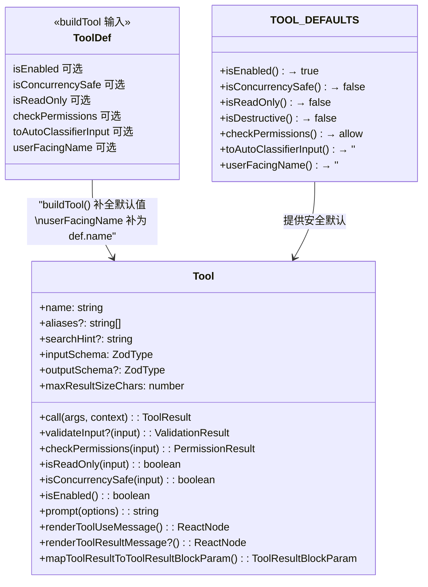

# 第 9 篇：工具系统设计 — buildTool() 的抽象之美

> 本篇是《深入 Claude Code 源码》系列的第 9 篇。我们将深入工具系统的核心设计：从 `Tool` 接口的核心方法，到 `buildTool()` 的 builder 模式，到 `tools.ts` 的注册表架构，再到 ToolSearch 的延迟加载机制，揭示一个生产级 AI Agent 如何管理 40+ 个内置工具和无限数量的 MCP 工具。

## 为什么工具系统是 Agent 的灵魂？

一个 AI Agent 与普通 chatbot 的本质区别在于：**Agent 能执行动作**。当模型决定读取一个文件、运行一条 Shell 命令、或搜索代码时，它依赖的就是工具系统。

Claude Code 拥有 40+ 个内置工具（BashTool、FileReadTool、GlobTool……）和通过 MCP 协议接入的无限数量外部工具。管理这样规模的工具集面临几个核心挑战：

1. **接口一致性**：每个工具需要统一的调用、验证、权限检查、UI 渲染协议
2. **安全默认**：工具涉及文件系统和 Shell 操作，默认行为必须 fail-closed
3. **条件注册**：不同构建版本、不同运行模式下可用的工具不同
4. **规模可扩展**：当工具数量超过模型上下文窗口的承载能力时，需要动态发现机制

本篇将回答这些问题，并从中提炼出可迁移到自己项目的设计模式。

---

## 一、Tool 核心接口：一个工具需要实现什么？

### 1.1 接口定义

`Tool.ts` 是整个工具系统的类型基础，定义了完整的 `Tool` 接口。这个接口有 **30+ 个方法/属性**，下面展示按职责域分组的核心子集（完整接口还包括 `interruptBehavior`、`isSearchOrReadCommand`、`shouldDefer`/`alwaysLoad`、`mcpInfo`、`strict`、`backfillObservableInput`、`preparePermissionMatcher`、`extractSearchText`、`renderToolUseTag`、`renderToolUseQueuedMessage`、`isResultTruncated` 等方法，详见 `Tool.ts:362-695`）：

```typescript
// Tool.ts:362-695 (简化展示)
export type Tool<
  Input extends AnyObject = AnyObject,
  Output = unknown,
  P extends ToolProgressData = ToolProgressData,
> = {
  // ── 身份标识 ──
  readonly name: string
  aliases?: string[]
  searchHint?: string           // ToolSearch 关键词匹配用

  // ── Schema 定义 ──
  readonly inputSchema: Input   // Zod schema
  readonly inputJSONSchema?: ToolInputJSONSchema  // MCP 工具直接用 JSON Schema
  outputSchema?: z.ZodType<unknown>

  // ── 核心方法 ──
  call(args, context, canUseTool, parentMessage, onProgress?): Promise<ToolResult<Output>>
  description(input, options): Promise<string>
  prompt(options): Promise<string>

  // ── 安全与权限 ──
  validateInput?(input, context): Promise<ValidationResult>
  checkPermissions(input, context): Promise<PermissionResult>
  isReadOnly(input): boolean
  isDestructive?(input): boolean
  isConcurrencySafe(input): boolean
  isEnabled(): boolean

  // ── UI 渲染协议（6 个 render 方法）──
  renderToolUseMessage(input, options): React.ReactNode
  renderToolResultMessage?(content, progressMessages, options): React.ReactNode
  renderToolUseProgressMessage?(progressMessages, options): React.ReactNode
  renderToolUseRejectedMessage?(input, options): React.ReactNode
  renderToolUseErrorMessage?(result, options): React.ReactNode
  renderGroupedToolUse?(toolUses, options): React.ReactNode | null

  // ── 结果序列化 ──
  mapToolResultToToolResultBlockParam(content, toolUseID): ToolResultBlockParam

  // ── 辅助方法 ──
  maxResultSizeChars: number
  userFacingName(input): string
  getPath?(input): string
  toAutoClassifierInput(input): unknown
  // ...更多
}
```

这个接口体现了一个重要的设计哲学：**工具不仅仅是"执行逻辑"，它是一个完整的"微服务"**，自带输入验证、权限控制、UI 渲染、结果序列化。



### 1.2 方法分组详解

**安全相关方法**（fail-closed 设计）：

| 方法 | 作用 | 默认行为 |
|------|------|---------|
| `isEnabled()` | 工具是否在当前环境下可用 | `true` |
| `isReadOnly()` | 是否为只读操作 | `false`（假设写入） |
| `isConcurrencySafe()` | 是否可以并发执行 | `false`（假设不安全） |
| `isDestructive()` | 是否为不可逆操作 | `false` |
| `validateInput()` | 输入预校验（在权限检查之前） | 无（跳过） |
| `checkPermissions()` | 权限检查 | `allow`（交给通用权限系统） |

注意默认值的设计意图：`isReadOnly` 和 `isConcurrencySafe` 都默认 `false`，这是 **fail-closed** 原则 —— 如果工具作者忘了声明，系统会采用最保守的假设（假设会写入、假设不能并发）。

**UI 渲染协议**（1 个必需 + 5 个可选的 render 方法，以及 `renderToolUseTag`、`renderToolUseQueuedMessage`、`isResultTruncated`、`extractSearchText` 等辅助展示方法）：

每个工具可以定制从「工具调用中」到「结果展示」的完整 UI 生命周期。其中 `renderToolUseMessage` 是**必需**的（展示工具调用意图），其余为可选：

```
模型发出 tool_use → renderToolUseMessage（展示工具调用意图）
                  → renderToolUseProgressMessage（展示执行进度）
                  → renderToolResultMessage（展示结果）
                  → renderToolUseRejectedMessage（用户拒绝时）
                  → renderToolUseErrorMessage（执行出错时）
                  → renderGroupedToolUse（多个同类工具批量展示）
```

这套协议让 BashTool 可以展示命令输出和进度条，FileEditTool 可以展示 diff 视图，GlobTool 可以展示文件列表 —— 全部通过统一的接口，由 Ink React 组件渲染。

---

## 二、buildTool()：安全默认的 Builder 模式

### 2.1 为什么需要 buildTool()？

`Tool` 接口有 30+ 个方法，如果每个工具都要实现全部方法，开发体验会很差。更重要的是，**忘记实现安全相关方法可能导致安全漏洞**（比如忘记声明 `isConcurrencySafe` 应返回 `true`，会导致本可并发执行的只读工具串行执行，影响性能但安全；反过来如果默认 `true` 就危险了）。

`buildTool()` 解决了这两个问题：

```typescript
// Tool.ts:757-792
const TOOL_DEFAULTS = {
  isEnabled: () => true,
  isConcurrencySafe: (_input?: unknown) => false,  // 假设不安全
  isReadOnly: (_input?: unknown) => false,          // 假设写入
  isDestructive: (_input?: unknown) => false,
  checkPermissions: (input, _ctx?) =>
    Promise.resolve({ behavior: 'allow', updatedInput: input }),
  toAutoClassifierInput: (_input?: unknown) => '',
  userFacingName: (_input?: unknown) => '',
}

export function buildTool<D extends AnyToolDef>(def: D): BuiltTool<D> {
  return {
    ...TOOL_DEFAULTS,
    userFacingName: () => def.name,
    ...def,
  } as BuiltTool<D>
}
```

运行时逻辑只有一行：`{ ...TOOL_DEFAULTS, userFacingName: () => def.name, ...def }`。这是一个经典的 **对象展开合并**（spread merge）—— 先铺好默认值，然后用 `() => def.name` 覆盖 `TOOL_DEFAULTS` 中返回空字符串的 `userFacingName`，最后再用工具定义 `def` 覆盖（如果工具自己定义了 `userFacingName`，会覆盖这个默认的 `def.name`）。

### 2.2 类型层的精巧设计

`buildTool()` 真正复杂的部分不在运行时，而在 **类型系统**：

```typescript
// Tool.ts:707-726
// 可以有默认值的方法列表
type DefaultableToolKeys =
  | 'isEnabled'
  | 'isConcurrencySafe'
  | 'isReadOnly'
  | 'isDestructive'
  | 'checkPermissions'
  | 'toAutoClassifierInput'
  | 'userFacingName'

// ToolDef：这些方法变为可选
export type ToolDef<...> =
  Omit<Tool<...>, DefaultableToolKeys> &
  Partial<Pick<Tool<...>, DefaultableToolKeys>>

// BuiltTool<D>：类型层模拟 { ...TOOL_DEFAULTS, ...def }
type BuiltTool<D> = Omit<D, DefaultableToolKeys> & {
  [K in DefaultableToolKeys]-?: K extends keyof D
    ? undefined extends D[K]
      ? ToolDefaults[K]   // D 没提供 → 用默认值类型
      : D[K]              // D 提供了 → 用 D 的类型
    : ToolDefaults[K]
}
```

关键在 `BuiltTool<D>` 类型：它精确地在类型层面模拟了运行时的 spread 语义。如果工具定义了 `isReadOnly`，返回类型中就用工具自己的实现类型；如果没定义，返回类型中就是默认值的类型。

### 2.3 实际使用：GlobTool 示例

来看一个中等复杂度的工具 —— GlobTool：

```typescript
// tools/GlobTool/GlobTool.ts:57-198
export const GlobTool = buildTool({
  name: GLOB_TOOL_NAME,
  searchHint: 'find files by name pattern or wildcard',
  maxResultSizeChars: 100_000,

  async description() { return DESCRIPTION },

  // ── Schema（延迟求值）──
  get inputSchema(): InputSchema { return inputSchema() },
  get outputSchema(): OutputSchema { return outputSchema() },

  // ── 覆盖默认值 ──
  isConcurrencySafe() { return true },   // 只读搜索，可以并发
  isReadOnly() { return true },          // 不会修改文件

  // ── 工具特有逻辑 ──
  async validateInput({ path }): Promise<ValidationResult> {
    if (path) {
      const absolutePath = expandPath(path)
      // UNC 路径安全检查，防止 NTLM 凭据泄露
      if (absolutePath.startsWith('\\\\') || absolutePath.startsWith('//')) {
        return { result: true }
      }
      // 验证目录存在
      // ...
    }
    return { result: true }
  },

  async checkPermissions(input, context) {
    return checkReadPermissionForTool(GlobTool, input, ...)
  },

  async call(input, { abortController, getAppState, globLimits }) {
    const { files, truncated } = await glob(
      input.pattern,
      GlobTool.getPath(input),
      { limit: globLimits?.maxResults ?? 100 },
      abortController.signal,
    )
    return { data: { filenames: files.map(toRelativePath), ... } }
  },

  // ── UI 委托给独立文件 ──
  renderToolUseMessage,       // 来自 ./UI.tsx
  renderToolResultMessage,    // 复用 GrepTool 的实现
  renderToolUseErrorMessage,  // 来自 ./UI.tsx
  // ...
} satisfies ToolDef<InputSchema, Output>)
```

几个值得注意的模式：

1. **`satisfies ToolDef<...>`**：TypeScript 4.9 的 `satisfies` 关键字确保对象结构符合 `ToolDef`，同时保留字面量类型（比 `as` 更安全）
2. **UI 分离**：渲染逻辑在独立的 `UI.tsx` 文件中，工具定义文件专注于业务逻辑
3. **Schema 延迟求值**：`get inputSchema() { return inputSchema() }` — 为什么不直接赋值？

### 2.4 lazySchema：延迟 Zod Schema 构造

```typescript
// utils/lazySchema.ts
export function lazySchema<T>(factory: () => T): () => T {
  let cached: T | undefined
  return () => (cached ??= factory())
}
```

这个 8 行的工具函数解决了一个实际问题：Zod schema 的构造在模块加载时就会执行，而 CLI 工具需要极快的启动速度。`lazySchema` 把 schema 构造推迟到第一次访问时，配合 `get inputSchema()` getter，实现了**按需构造**。

---

## 三、工具注册表：tools.ts 的单一来源设计

### 3.1 getAllBaseTools()：唯一的工具清单

`tools.ts` 是所有内置工具的**单一注册来源**（single source of truth）。`getAllBaseTools()` 函数返回完整的工具列表：

```typescript
// tools.ts:193-251
export function getAllBaseTools(): Tools {
  return [
    AgentTool,
    TaskOutputTool,
    BashTool,
    // 嵌入式搜索工具存在时，移除 Glob/Grep
    ...(hasEmbeddedSearchTools() ? [] : [GlobTool, GrepTool]),
    ExitPlanModeV2Tool,
    FileReadTool,
    FileEditTool,
    FileWriteTool,
    NotebookEditTool,
    WebFetchTool,
    TodoWriteTool,
    WebSearchTool,
    // ... 更多工具
    // 条件注册
    ...(process.env.USER_TYPE === 'ant' ? [ConfigTool] : []),
    ...(SleepTool ? [SleepTool] : []),
    ...cronTools,
    ...(isToolSearchEnabledOptimistic() ? [ToolSearchTool] : []),
    // 测试专用
    ...(process.env.NODE_ENV === 'test' ? [TestingPermissionTool] : []),
  ]
}
```

### 3.2 三种条件注册机制

工具注册表使用三种不同的条件机制来控制工具可用性：

**机制一：编译期 `feature()` + 条件 `require()`（DCE）**

```typescript
// tools.ts:25-28
const SleepTool =
  feature('PROACTIVE') || feature('KAIROS')
    ? require('./tools/SleepTool/SleepTool.js').SleepTool
    : null
```

当 `feature('PROACTIVE')` 编译为 `false` 时，整个 `require()` 分支被 Bun bundler 删除，不占用最终包体积。这是**编译期 DCE**。

**机制二：`process.env` 运行时检查**

```typescript
// tools.ts:16-19
const REPLTool =
  process.env.USER_TYPE === 'ant'
    ? require('./tools/REPLTool/REPLTool.js').REPLTool
    : null
```

这些检查在运行时执行，用于区分内部版（`ant`）和外部版。

**机制三：`isEnabled()` 运行时检查**

```typescript
// tools.ts:325-326 (getTools 内部)
const isEnabled = allowedTools.map(_ => _.isEnabled())
return allowedTools.filter((_, i) => isEnabled[i])
```

每个工具的 `isEnabled()` 方法可以检查更复杂的运行时条件（GrowthBook feature flag、环境变量组合等）。

这三种机制形成了一个**层级过滤漏斗**：

```
编译期 DCE → 模块加载时环境变量 → 运行时 isEnabled() → 权限 deny rules
```

### 3.3 getTools() 与 assembleToolPool()：从注册到可用

从注册表到模型实际可用的工具，经过多层过滤：

```typescript
// tools.ts:271-327
export const getTools = (permissionContext: ToolPermissionContext): Tools => {
  // 1. 简单模式：只有 Bash, Read, Edit
  if (isEnvTruthy(process.env.CLAUDE_CODE_SIMPLE)) {
    return filterToolsByDenyRules([BashTool, FileReadTool, FileEditTool], ...)
  }

  // 2. 获取所有基础工具（排除特殊工具）
  const tools = getAllBaseTools().filter(tool => !specialTools.has(tool.name))

  // 3. 应用 deny rules 过滤
  let allowedTools = filterToolsByDenyRules(tools, permissionContext)

  // 4. REPL 模式过滤：隐藏被 REPL 包装的原始工具
  if (isReplModeEnabled()) { /* ... */ }

  // 5. isEnabled() 过滤
  return allowedTools.filter((_, i) => isEnabled[i])
}

// tools.ts:345-367 — 合并内置工具与 MCP 工具
export function assembleToolPool(
  permissionContext: ToolPermissionContext,
  mcpTools: Tools,
): Tools {
  const builtInTools = getTools(permissionContext)
  const allowedMcpTools = filterToolsByDenyRules(mcpTools, permissionContext)

  // 按名称排序（prompt cache 稳定性），built-in 优先
  const byName = (a: Tool, b: Tool) => a.name.localeCompare(b.name)
  return uniqBy(
    [...builtInTools].sort(byName).concat(allowedMcpTools.sort(byName)),
    'name',
  )
}
```

`assembleToolPool()` 的排序设计值得关注：built-in 和 MCP 工具分别排序后再拼接，而不是混合排序。注释解释了原因 —— **prompt cache 稳定性**。API 服务端在 built-in 工具的最后一个位置设置了 cache breakpoint，如果 MCP 工具混入 built-in 区间，会导致所有下游 cache key 失效。

### 3.4 懒 require() 打破循环依赖

```typescript
// tools.ts:62-72
// Lazy require to break circular dependency:
// tools.ts -> TeamCreateTool/TeamDeleteTool -> ... -> tools.ts
const getTeamCreateTool = () =>
  require('./tools/TeamCreateTool/TeamCreateTool.js')
    .TeamCreateTool as typeof import('./tools/TeamCreateTool/TeamCreateTool.js').TeamCreateTool
```

函数包装 + `as typeof import(...)` 是处理循环依赖的标准模式：
1. **函数包装** `require()` —— 延迟执行，避免模块加载时的循环
2. **`as typeof import(...)`** —— 保留完整类型信息，不丢失类型安全

---

## 四、工具执行编排：并发安全分区

当模型一次返回多个 tool_use 调用时，工具系统需要决定哪些可以并行、哪些必须串行。

### 4.1 partitionToolCalls()：安全分区算法

```typescript
// services/tools/toolOrchestration.ts:91-116
function partitionToolCalls(
  toolUseMessages: ToolUseBlock[],
  toolUseContext: ToolUseContext,
): Batch[] {
  return toolUseMessages.reduce((acc: Batch[], toolUse) => {
    const tool = findToolByName(toolUseContext.options.tools, toolUse.name)
    const parsedInput = tool?.inputSchema.safeParse(toolUse.input)
    const isConcurrencySafe = parsedInput?.success
      ? (() => {
          try {
            return Boolean(tool?.isConcurrencySafe(parsedInput.data))
          } catch {
            return false  // 解析失败 → 保守处理
          }
        })()
      : false

    // 连续的并发安全工具合并为一个 batch
    if (isConcurrencySafe && acc[acc.length - 1]?.isConcurrencySafe) {
      acc[acc.length - 1]!.blocks.push(toolUse)
    } else {
      acc.push({ isConcurrencySafe, blocks: [toolUse] })
    }
    return acc
  }, [])
}
```

算法逻辑清晰：
1. 先用 Zod 的 `safeParse` 验证输入
2. 调用 `isConcurrencySafe()` 判断能否并发
3. 连续的安全工具合并为一个并发 batch
4. 不安全的工具各自独立为一个串行 batch

执行时，并发 batch 内的工具通过 `all()` 工具并行执行（最大并发度默认 10），串行 batch 逐个执行：

```typescript
// services/tools/toolOrchestration.ts:19-82
export async function* runTools(...): AsyncGenerator<MessageUpdate, void> {
  for (const { isConcurrencySafe, blocks } of partitionToolCalls(...)) {
    if (isConcurrencySafe) {
      // 并发执行，事后按序应用 contextModifier
      for await (const update of runToolsConcurrently(blocks, ...)) {
        yield { message: update.message, newContext: currentContext }
      }
    } else {
      // 串行执行
      for await (const update of runToolsSerially(blocks, ...)) {
        yield { message: update.message, newContext: currentContext }
      }
    }
  }
}
```

### 4.2 ToolUseContext：工具执行的运行时上下文

每次工具调用都接收一个 `ToolUseContext` 对象，它是工具执行的完整运行时环境：

```typescript
// Tool.ts:158-300 (核心字段)
export type ToolUseContext = {
  options: {
    tools: Tools              // 当前可用的所有工具
    commands: Command[]       // 可用的斜杠命令
    mcpClients: MCPServerConnection[]
    mainLoopModel: string     // 当前模型
    thinkingConfig: ThinkingConfig
    isNonInteractiveSession: boolean
    // ...
  }
  abortController: AbortController   // 取消信号
  readFileState: FileStateCache      // 文件状态缓存（LRU）
  getAppState(): AppState            // 获取全局状态
  setAppState(f): void               // 修改全局状态
  messages: Message[]                // 当前对话历史
  setInProgressToolUseIDs: (f) => void
  // ...
}
```

`ToolUseContext` 是第 3 篇讲过的"运行时上下文容器"。它最关键的设计是 `getAppState/setAppState` 对 —— subagent 的 `setAppState` 可以是 no-op（参见 `createSubagentContext()`），实现了 Agent 隔离。

---

## 五、ToolSearch：延迟加载的动态发现机制

当 MCP 工具数量很多时（几十甚至上百个），把所有工具定义都塞进 system prompt 会消耗大量 token。ToolSearch 机制解决了这个问题。

### 5.1 Deferred Tool 机制

工具是否应该延迟加载，由 `isDeferredTool()` 决定：

```typescript
// tools/ToolSearchTool/prompt.ts:62-108
export function isDeferredTool(tool: Tool): boolean {
  // 显式 opt-out：alwaysLoad = true 的工具永远不延迟
  if (tool.alwaysLoad === true) return false

  // MCP 工具：总是延迟（按需发现）
  if (tool.isMcp === true) return true

  // ToolSearch 自身：永远不延迟（模型需要它来加载其他工具）
  if (tool.name === TOOL_SEARCH_TOOL_NAME) return false

  // Agent 工具在 fork 模式下：不延迟（第一轮就需要）
  if (feature('FORK_SUBAGENT') && tool.name === AGENT_TOOL_NAME) {
    if (m.isForkSubagentEnabled()) return false
  }

  // 其他：通过 shouldDefer 标记
  return tool.shouldDefer === true
}
```

延迟的工具以名称列表形式告知模型，但具体的呈现方式取决于运行模式。源码中存在两条路径（`tools/ToolSearchTool/prompt.ts:31-42`）：

- **Delta 模式**（`isDeferredToolsDeltaEnabled()` 为 true，即内部用户或 `tengu_glacier_2xr` feature flag 开启时）：deferred 工具通过增量 attachment 出现在 `<system-reminder>` 消息中，只通知新增/移除的工具
- **Legacy 模式**：deferred 工具出现在 `<available-deferred-tools>` 消息块中，每次列出全量

无论哪种模式，模型都看不到 deferred 工具的参数 schema 和详细描述，只能看到工具名称：

```
<available-deferred-tools>
mcp__slack__slack_send_message
mcp__slack__slack_list_conversations
mcp__github__create_pull_request
...
</available-deferred-tools>
```

### 5.2 ToolSearchTool：工具的搜索引擎

当模型需要使用某个 deferred 工具时，它先调用 `ToolSearchTool`：

```typescript
// tools/ToolSearchTool/ToolSearchTool.ts:304-471 (核心逻辑)
export const ToolSearchTool = buildTool({
  name: TOOL_SEARCH_TOOL_NAME,
  isEnabled() { return isToolSearchEnabledOptimistic() },
  isConcurrencySafe() { return true },
  isReadOnly() { return true },

  async call(input, { options: { tools }, getAppState }) {
    const { query, max_results = 5 } = input
    const deferredTools = tools.filter(isDeferredTool)

    // 模式一：select:Name1,Name2 — 精确选择
    const selectMatch = query.match(/^select:(.+)$/i)
    if (selectMatch) {
      // 直接按名称查找
      // ...
    }

    // 模式二：关键词搜索
    const matches = await searchToolsWithKeywords(query, deferredTools, tools, max_results)
    return buildSearchResult(matches, query, deferredTools.length)
  },

  // 返回 tool_reference 块，API 会展开为完整工具定义
  mapToolResultToToolResultBlockParam(content, toolUseID) {
    return {
      type: 'tool_result',
      tool_use_id: toolUseID,
      content: content.matches.map(name => ({
        type: 'tool_reference',
        tool_name: name,
      })),
    }
  },
})
```

搜索算法支持两种模式：

1. **`select:Name`** — 精确选择，按工具名查找（支持逗号分隔多选）
2. **关键词搜索** — 按 tool name 分词 + searchHint + description 综合评分

关键词搜索的评分逻辑（`searchToolsWithKeywords`）：

```typescript
// tools/ToolSearchTool/ToolSearchTool.ts:259-301
// 评分权重
// - name 部分精确匹配：MCP 12 分 / 普通 10 分
// - name 部分包含匹配：MCP 6 分 / 普通 5 分
// - searchHint 匹配：4 分
// - description 匹配：2 分
```

`searchHint` 是每个工具的简短能力描述（3-10 个词），专门用于帮助模型通过关键词找到工具：

```typescript
// GlobTool.ts
searchHint: 'find files by name pattern or wildcard'

// FileReadTool.ts
searchHint: 'read files, images, PDFs, notebooks'
```

### 5.3 启用策略：从乐观检查到最终决策

ToolSearch 的启用分为两层：**乐观检查**（`isToolSearchEnabledOptimistic()`）和**最终决策**（`isToolSearchEnabled()`）。

乐观检查用于决定是否将 ToolSearchTool 注册到工具列表中。它首先检查 `getToolSearchMode()`：

```typescript
// utils/toolSearch.ts:172-198
// ENABLE_TOOL_SEARCH    Mode
// auto / auto:1-99      tst-auto（超过阈值才延迟）
// true / auto:0         tst（总是延迟）
// false / auto:100      standard（从不延迟）
// (unset)               tst（默认：总是延迟 MCP 和 shouldDefer 工具）
```

但即使 mode 不是 `standard`，乐观检查还有一个重要的**代理网关守卫**（`utils/toolSearch.ts:299-311`）：当 `ENABLE_TOOL_SEARCH` 未显式设置、且 `ANTHROPIC_BASE_URL` 指向非 Anthropic 第一方地址时（即用户通过第三方代理访问 API），ToolSearch 会被禁用。这是因为 `tool_reference` 是一个 beta content type，第三方代理通常不支持。用户如果确认代理支持 `tool_reference`，可以显式设置 `ENABLE_TOOL_SEARCH=true` 来覆盖。

最终决策 `isToolSearchEnabled()` 在实际 API 调用前执行，额外检查模型兼容性（Haiku 不支持 `tool_reference`）和 `tst-auto` 模式的阈值判定。

`tst-auto` 模式特别有趣：它计算所有 deferred 工具定义占上下文窗口的比例，超过阈值（默认 10%）才启用延迟加载：

```typescript
// utils/toolSearch.ts:104-109
function getAutoToolSearchTokenThreshold(model: string): number {
  const contextWindow = getContextWindowForModel(model, betas)
  const percentage = getAutoToolSearchPercentage() / 100
  return Math.floor(contextWindow * percentage)
}
```

---

## 六、工具的目录组织模式

每个工具遵循统一的目录结构：

```
tools/
├── GlobTool/
│   ├── GlobTool.ts      # 工具定义（buildTool + call 逻辑）
│   ├── prompt.ts        # 工具名常量 + description 文本
│   └── UI.tsx           # render* 方法的实现
├── BashTool/
│   ├── BashTool.tsx     # 主文件（最复杂的单个工具）
│   ├── prompt.ts        # description + 超时配置
│   ├── UI.tsx           # 渲染逻辑
│   ├── bashPermissions.ts    # 权限匹配逻辑
│   ├── bashSecurity.ts       # AST 安全分析
│   ├── commandSemantics.ts   # 命令语义分类
│   ├── shouldUseSandbox.ts   # 沙箱决策
│   └── ...（18 个文件）
├── FileReadTool/
│   ├── FileReadTool.ts
│   ├── prompt.ts
│   ├── UI.tsx
│   ├── limits.ts        # 读取限制配置
│   └── imageProcessor.ts
└── ...（40+ 个工具目录）
```

这种组织方式的核心原则：
- **工具名和 description 作为常量** 放在 `prompt.ts` 中，其他模块（如 `constants/tools.ts`）可以不加载整个工具就引用工具名
- **UI 渲染逻辑独立** 放在 `UI.tsx`，保持工具定义的纯粹性
- **复杂工具可自由拆分** 子模块（BashTool 有 18 个文件），不需要遵循固定模板

---

## 七、可迁移的设计模式

### 模式 1：Builder + 安全默认

用 builder 函数包装接口实现，提供 fail-closed 的默认值。工具作者只需关注自己的特殊逻辑，不可能忘记处理安全性。

```typescript
// 模式抽象
const DEFAULTS = {
  isReadOnly: () => false,      // 默认假设不安全
  canRunConcurrently: () => false,
}

function buildPlugin(def) {
  return { ...DEFAULTS, ...def }
}
```

**适用场景**：任何插件/中间件系统，特别是涉及安全敏感操作时。

### 模式 2：分层条件注册

将条件注册分为编译期（DCE）、模块加载期（env var）、运行时（`isEnabled()`）三层，形成过滤漏斗。编译期条件可以彻底删除代码路径，运行时条件可以响应动态配置。

```
编译期 feature() → 模块加载时 env check → 运行时 isEnabled() → 权限 deny rules
```

**适用场景**：需要从同一份代码构建多个版本，且不同版本有不同功能集的项目。

### 模式 3：并发安全分区

通过 `isConcurrencySafe` 标记将批量操作分区为可并发组和必须串行组。默认 `false` 确保安全，显式声明 `true` 才启用并发。

**适用场景**：任何需要批量执行异构任务的系统（如构建工具、数据管道、API 网关）。

---

## 下一篇预告

[第 10 篇：BashTool 深度剖析 — 最复杂的单个工具](./10-BashTool-深度剖析.md)

我们将深入 BashTool 的 18 个文件，看看一个 Shell 命令执行工具如何处理命令语义分析、AST 安全检查、沙箱执行、输出截断、权限匹配等复杂问题。BashTool 是工具系统设计模式的极致体现。

---

*全部内容请关注 https://github.com/luyao618/Claude-Code-Source-Study (求一颗免费的小星星)*
