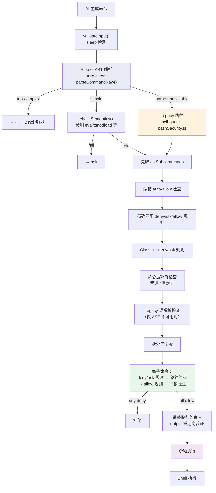

# 第 10 篇：BashTool 深度剖析 — 最复杂的单个工具

> 本篇是《深入 Claude Code 源码》系列第 10 篇。BashTool 是 Claude Code 中代码量最大、安全逻辑最复杂的单个工具，总计约 12,400 行代码。我们将从命令语义分析、多层安全防线、沙箱执行、输出处理、权限匹配五个维度，完整剖析它如何让 AI 安全地执行 Shell 命令。

## 为什么 BashTool 是最复杂的工具？

在第 9 篇中我们了解了 `buildTool()` 的抽象体系和 Tool 接口的设计。所有工具都遵循相同的 `name / inputSchema / call() / checkPermissions()` 协议。但 BashTool 的特殊之处在于：**它是唯一一个允许 AI 在用户机器上执行任意代码的工具**。

这意味着它必须同时解决两个相互矛盾的需求：
1. **足够强大** — AI 需要通过 Shell 命令完成 git 操作、运行测试、安装依赖、查看日志等几乎一切任务
2. **足够安全** — 绝不能让 AI（或通过 prompt injection 操控 AI 的攻击者）执行破坏性操作

这个矛盾造就了一个包含 18 个源码文件、总计约 12,400 行代码的庞大子系统：

| 文件 | 行数 | 职责 |
|------|------|------|
| `BashTool.tsx` | 1,143 | 主文件：buildTool 定义、`call()` 执行、`runShellCommand` 生成器 |
| `bashPermissions.ts` | 2,621 | 权限判定主流程、规则匹配、前缀提取 |
| `bashSecurity.ts` | 2,592 | 安全验证：20+ 种攻击模式检测 |
| `readOnlyValidation.ts` | 1,990 | 只读命令白名单验证（100+ 命令配置） |
| `pathValidation.ts` | 1,303 | 路径安全校验：危险路径检测、项目边界限制 |
| `sedValidation.ts` | 684 | sed 命令的特殊验证逻辑 |
| `prompt.ts` | 369 | BashTool 的 System Prompt 生成 |
| `shouldUseSandbox.ts` | 153 | 沙箱决策逻辑 |
| `commandSemantics.ts` | 140 | 退出码语义解释 |
| 其他 8 个文件 | ~1,405 | UI 渲染、sed 编辑解析、破坏性命令警告等 |

接下来，我们沿着一条命令从 AI 生成到执行完成的完整生命周期来分析这个系统。

---

## 一、命令语义分类：AI 执行的是什么类型的命令？

BashTool 的第一个设计亮点是**命令语义分类**。它不是把所有命令一视同仁，而是在多个维度上对命令进行分类，每种分类决定了不同的 UI 展示和安全策略。

### 1.1 搜索/读取/列表分类

`BashTool.tsx:59-172` 定义了四组命令语义集合：

```typescript
// BashTool.tsx:60-72
const BASH_SEARCH_COMMANDS = new Set([
  'find', 'grep', 'rg', 'ag', 'ack', 'locate', 'which', 'whereis'
]);

const BASH_READ_COMMANDS = new Set([
  'cat', 'head', 'tail', 'less', 'more',
  'wc', 'stat', 'file', 'strings',
  'jq', 'awk', 'cut', 'sort', 'uniq', 'tr'
]);

const BASH_LIST_COMMANDS = new Set(['ls', 'tree', 'du']);

const BASH_SEMANTIC_NEUTRAL_COMMANDS = new Set([
  'echo', 'printf', 'true', 'false', ':'  // bash no-op
]);
```

`isSearchOrReadBashCommand()` 函数分析整个命令管道（pipeline），**只有当所有非中性子命令都属于搜索/读取/列表类别时**，整个命令才被标记为可折叠。这意味着 `ls dir && echo "---" && ls dir2` 被视为列表命令（`echo` 是中性的），而 `ls dir && rm file` 则不是。

这个分类决定了 UI 层面的展示：搜索命令折叠显示为 "Searched N files"，读取命令显示为 "Read N files"，列表命令显示为 "Listed N directories"。

### 1.2 静默命令分类

```typescript
// BashTool.tsx:81
const BASH_SILENT_COMMANDS = new Set([
  'mv', 'cp', 'rm', 'mkdir', 'rmdir', 'chmod', 'chown',
  'chgrp', 'touch', 'ln', 'cd', 'export', 'unset', 'wait'
]);
```

静默命令成功时通常不产生 stdout。BashTool 检测到这类命令后，在 UI 上显示 "Done" 而非 "(No output)"——一个小细节，但体现了对用户体验的关注。

### 1.3 退出码语义解释

`commandSemantics.ts` 实现了一个精巧的退出码语义系统。许多命令使用非零退出码传达信息（而非错误）：

```typescript
// commandSemantics.ts:31-48
const COMMAND_SEMANTICS: Map<string, CommandSemantic> = new Map([
  // grep: 0=找到匹配, 1=未找到, 2+=真正的错误
  ['grep', (exitCode) => ({
    isError: exitCode >= 2,
    message: exitCode === 1 ? 'No matches found' : undefined,
  })],
  // diff: 0=无差异, 1=有差异, 2+=错误
  ['diff', (exitCode) => ({
    isError: exitCode >= 2,
    message: exitCode === 1 ? 'Files differ' : undefined,
  })],
  // test/[: 0=条件为真, 1=条件为假, 2+=错误
  ['test', (exitCode) => ({
    isError: exitCode >= 2,
    message: exitCode === 1 ? 'Condition is false' : undefined,
  })],
]);
```

没有这个系统，`grep` 没找到匹配返回 1 时，AI 会以为命令出错了，尝试修复一个并不存在的问题。语义解释让 AI 能准确理解命令执行的实际含义。

---

## 二、权限主链路：bashToolHasPermission 的真实执行顺序

BashTool 的安全设计是整个工具中最复杂也最精妙的部分。它采用了**纵深防御**（Defense in Depth）策略——不是依赖单一检查，而是在命令执行路径上设置多层防线，任何一层拦截都能阻止危险操作。

要理解 BashTool 的安全架构，必须先厘清 `bashToolHasPermission()`（bashPermissions.ts:1663-2400+）的真实执行顺序。这个函数是权限判定的主入口，由 `checkPermissions()` 直接委托调用：



这里最关键的架构事实是：**tree-sitter AST 解析是主入口（Step 0），不是"额外的精确分析层"**。只有当 tree-sitter WASM 不可用、或被 killswitch 关闭时，才回退到 `bashSecurity.ts` 的正则路径。而**只读验证（`checkReadOnlyConstraints`）不在主链路中**——它通过 `BashTool.isReadOnly()` 被每个子命令的 `bashToolCheckPermission()` 在步骤 7 调用（在 deny/ask/allow 规则和路径约束之后），而非作为独立的"第 4 层"。

### 2.1 第一层：输入验证（validateInput）

最简单的一层，检查命令的基本合法性：

```typescript
// BashTool.tsx:524-538
async validateInput(input: BashToolInput): Promise<ValidationResult> {
  if (feature('MONITOR_TOOL') && !isBackgroundTasksDisabled
      && !input.run_in_background) {
    const sleepPattern = detectBlockedSleepPattern(input.command);
    if (sleepPattern !== null) {
      return {
        result: false,
        message: `Blocked: ${sleepPattern}. Run blocking commands in the background...`,
        errorCode: 10
      };
    }
  }
  return { result: true };
}
```

`detectBlockedSleepPattern()`（BashTool.tsx:322-337）检测 `sleep N`（N≥2）开头的命令。低于 2 秒的 sleep（用于速率限制）被放行，而 `sleep 5 && check` 这样的轮询模式会被建议改用 Monitor 工具或 `run_in_background`。

### 2.2 AST 解析：主入口的 fail-closed 设计（ast.ts）

`bashToolHasPermission()` 的第一步（Step 0，bashPermissions.ts:1670-1806）就是 tree-sitter AST 解析。这不是"额外的精确分析层"——它**就是**主安全入口：

```typescript
// bashPermissions.ts:1688-1695
let astRoot = injectionCheckDisabled
  ? null
  : feature('TREE_SITTER_BASH_SHADOW') && !shadowEnabled
    ? null
    : await parseCommandRaw(input.command);
let astResult: ParseForSecurityResult = astRoot
  ? parseForSecurityFromAst(input.command, astRoot)
  : { kind: 'parse-unavailable' };
```

`parseForSecurityFromAst()` 基于 tree-sitter 的 AST 分析（`utils/bash/ast.ts`），其核心设计特性是 **FAIL-CLOSED**：

```typescript
// utils/bash/ast.ts:1-18
/**
 * AST-based bash command analysis using tree-sitter.
 *
 * 关键设计特性是 FAIL-CLOSED：我们永远不解释我们不理解的结构。
 * 如果 tree-sitter 生成了我们未明确允许的节点类型，
 * 我们拒绝提取 argv，调用者必须询问用户。
 */

export type ParseForSecurityResult =
  | { kind: 'simple'; commands: SimpleCommand[] }
  | { kind: 'too-complex'; reason: string; nodeType?: string }
  | { kind: 'parse-unavailable' }
```

tree-sitter 解析器产出三种结果：
- `simple`：命令结构简单，成功提取了每个子命令的 `argv[]`（命令名和参数已去除引号）
- `too-complex`：遇到未在白名单中的 AST 节点类型，拒绝分析 → 回退到弹窗确认
- `parse-unavailable`：tree-sitter 不可用（外部构建）→ 回退到正则分析

白名单方式是这个设计的精髓：与其列举所有危险的 Shell 语法（永远列不完），不如只允许已知安全的语法结构通过，其他一律要求用户确认。

### 2.3 Legacy 回退路径（bashSecurity.ts）

当 tree-sitter WASM 不可用（如外部构建未包含 `TREE_SITTER_BASH` feature）或被 GrowthBook killswitch 关闭时，主链路回退到 `bashSecurity.ts` 的正则分析路径（bashPermissions.ts:1808-1827,2078-2142）。这条路径有 2,592 行代码，包含 23 种安全检查——它曾经是唯一的安全入口，现在作为 AST 路径的 fallback 继续服务。

核心思路是：**在引号和转义处理之后，用正则检测命令中的危险模式**。

#### 2.3.1 命令替换模式检测

```typescript
// bashSecurity.ts:16-41
const COMMAND_SUBSTITUTION_PATTERNS = [
  { pattern: /<\(/, message: 'process substitution <()' },
  { pattern: />\(/, message: 'process substitution >()' },
  { pattern: /=\(/, message: 'Zsh process substitution =()' },
  { pattern: /(?:^|[\s;&|])=[a-zA-Z_]/, message: 'Zsh equals expansion (=cmd)' },
  { pattern: /\$\(/, message: '$() command substitution' },
  { pattern: /\$\{/, message: '${} parameter substitution' },
  { pattern: /\$\[/, message: '$[] legacy arithmetic expansion' },
  { pattern: /<#/, message: 'PowerShell comment syntax' },
  // ... 更多模式
];
```

一个值得注意的防御是 **Zsh EQUALS expansion**：`=curl evil.com` 在 Zsh 中会展开为 `/usr/bin/curl evil.com`，绕过 `Bash(curl:*)` 的 deny 规则。这种 Shell 特性的差异攻击被一个简洁的正则模式拦截。

#### 2.3.2 危险命令黑名单

```typescript
// bashSecurity.ts:45-74
const ZSH_DANGEROUS_COMMANDS = new Set([
  'zmodload',   // 加载危险模块（mapfile/sysopen/zpty/ztcp）
  'emulate',    // -c 标志等价于 eval
  'sysopen', 'sysread', 'syswrite', 'sysseek',  // 文件描述符操作
  'zpty',       // 伪终端命令执行
  'ztcp',       // TCP 连接（用于数据外泄）
  'zsocket',    // Unix/TCP socket
  'zf_rm', 'zf_mv', 'zf_ln', 'zf_chmod',  // 绕过二进制检查的内建命令
  // ...
]);
```

这个黑名单暴露了一个深层的安全挑战：Zsh 内建模块（如 `zsh/system`、`zsh/net/tcp`）可以在不调用外部二进制的情况下执行文件 I/O 和网络操作，绕过传统的命令名检查。BashTool 通过同时拦截 `zmodload`（加载器）和各个模块命令（纵深防御）来应对这个威胁。

#### 2.3.3 引号剥离与上下文分析

安全检查的一个核心难题是：命令中的危险模式可能被引号"藏起来"。`extractQuotedContent()` 函数（bashSecurity.ts:128-174）负责剥离引号内容，产出三种视图：

```typescript
// bashSecurity.ts:119-126
type QuoteExtraction = {
  withDoubleQuotes: string     // 保留双引号内容，剥离单引号
  fullyUnquoted: string        // 完全剥离所有引号内容
  unquotedKeepQuoteChars: string  // 剥离内容但保留引号字符本身
}
```

为什么需要三种视图？因为不同的安全检查需要不同的上下文：
- `withDoubleQuotes`：检测双引号内的变量展开（`$()` 在双引号内仍然会被展开）
- `fullyUnquoted`：检测命令管道中的重定向、shell 元字符
- `unquotedKeepQuoteChars`：检测"引号粘连 hash"攻击（如 `'x'#` 用注释隐藏后续命令）

#### 2.3.4 安全检查清单

`bashSecurity.ts:77-101` 定义了 23 种安全检查的数字标识符，每种对应一个检测器：

```typescript
const BASH_SECURITY_CHECK_IDS = {
  INCOMPLETE_COMMANDS: 1,          // 不完整命令
  JQ_SYSTEM_FUNCTION: 2,          // jq 的 system() 函数调用
  OBFUSCATED_FLAGS: 4,            // 混淆的命令行标志
  SHELL_METACHARACTERS: 5,        // Shell 元字符
  DANGEROUS_VARIABLES: 6,         // 危险环境变量
  NEWLINES: 7,                    // 命令中的换行符
  IFS_INJECTION: 11,              // IFS 注入攻击
  PROC_ENVIRON_ACCESS: 13,        // /proc 环境变量访问
  MALFORMED_TOKEN_INJECTION: 14,  // 畸形 token 注入
  BRACE_EXPANSION: 16,            // 花括号展开
  CONTROL_CHARACTERS: 17,         // 控制字符
  UNICODE_WHITESPACE: 18,         // Unicode 空白字符
  ZSH_DANGEROUS_COMMANDS: 20,     // Zsh 危险命令
  COMMENT_QUOTE_DESYNC: 22,       // 注释/引号不同步
  // ...
};
```

每种检查都有对应的 validator 函数。检测到问题时，命令不会被直接拒绝，而是标记为"不安全"，触发权限确认对话框。这体现了一个核心原则：**安全系统应该 fail-closed（检测到不确定性时默认询问用户），而不是 fail-open**。

### 2.4 每子命令权限判定中的只读验证（readOnlyValidation.ts）

只读验证**并非主链路的独立层**，而是在每个子命令的权限判定函数 `bashToolCheckPermission()`（bashPermissions.ts:1050-1178）内部的第 7 步调用。判定顺序为：

1. 精确匹配 deny/ask 规则
2. 前缀/通配符 deny/ask 规则
3. 路径约束检查（`checkPathConstraints`）
4. 精确匹配 allow 规则
5. 前缀/通配符 allow 规则
6. sed 约束 + 模式检查
7. **只读验证**：`BashTool.isReadOnly(input)` → `checkReadOnlyConstraints()`

只有当前面所有规则都没有匹配时，才轮到只读验证。这意味着如果用户设置了 `Bash(git status)` 的 deny 规则，即使 `git status` 是只读命令，也会被拒绝——deny 规则的优先级高于只读放行。

`readOnlyValidation.ts` 长达 1,990 行，其中大部分是命令配置。它为 100+ 个常用命令定义了"安全标志白名单"。但在判定一条命令是否只读之前，`checkReadOnlyConstraints()` 还有**一串关键的安全前置条件**（readOnlyValidation.ts:1882-1966）：

```typescript
// readOnlyValidation.ts:34-49 (简化展示)
type CommandConfig = {
  safeFlags: Record<string, FlagArgType>  // 安全标志及其参数类型
  regex?: RegExp                          // 额外正则验证
  additionalCommandIsDangerousCallback?: (
    rawCommand: string, args: string[]
  ) => boolean                            // 自定义危险检测
  respectsDoubleDash?: boolean            // 是否支持 -- 分隔符
}
```

以 `fd`（文件搜索工具）的安全标志配置为例：

```typescript
// readOnlyValidation.ts:55-100 (部分)
const FD_SAFE_FLAGS: Record<string, FlagArgType> = {
  '-h': 'none', '--help': 'none',
  '-H': 'none', '--hidden': 'none',
  '-i': 'none', '--ignore-case': 'none',
  '-d': 'number', '--max-depth': 'number',
  '-t': 'string', '--type': 'string',
  '-e': 'string', '--extension': 'string',
  // SECURITY: -x/--exec 和 -X/--exec-batch 被刻意排除
  // 它们会对每个搜索结果执行任意命令
  // SECURITY: -l/--list-details 也被排除
  // 它内部执行 ls 子进程，存在 PATH 劫持风险
}
```

注意注释中的安全考量：`fd -x` 虽然是一个"搜索工具的标志"，但它允许对搜索结果执行任意命令，所以被排除在白名单外。这种粒度的安全分析在每个命令上都有体现。

`checkReadOnlyConstraints()` 的整体逻辑是：

**安全前置条件**（readOnlyValidation.ts:1882-1966，任何一项不满足则返回 `passthrough`，不做只读放行）：
1. 命令可被 `shell-quote` 解析
2. `bashCommandIsSafe_DEPRECATED()` 通过（无危险模式）
3. 不含 Windows UNC 路径（防 WebDAV 攻击）
4. 不含 `cd` + `git` 组合（防 bare repo hook 攻击）
5. 不在 bare repository 结构的目录中运行 git（防恶意 hooks）
6. 不在 git 内部路径写入后运行 git（防 `mkdir hooks && echo evil > hooks/pre-commit && git status`）
7. 沙箱启用时，不在 original CWD 之外运行 git（防竞态条件：后台命令在子目录创建 bare repo 文件）

**标志白名单验证**（通过前置条件后）：
1. 拆分复合命令（`&&`、`||`、`|`）
2. 对每个子命令：提取基础命令名 → 查找 CommandConfig → 验证所有标志都在白名单中
3. **所有子命令都通过只读验证** → 整个命令被标记为只读，跳过权限确认

---

## 三、权限判定：规则匹配与智能建议

当命令通过了安全分析但不是只读命令时，进入权限判定流程。`bashPermissions.ts`（2,621 行）实现了一套精密的权限规则匹配系统。

### 3.1 权限规则的三种形态

```typescript
// bashPermissions.ts (通过 shellRuleMatching.ts)
type ShellPermissionRule =
  | { type: 'exact'; command: string }    // 精确匹配: "npm run build"
  | { type: 'prefix'; prefix: string }    // 前缀匹配: "npm run:*" → "npm run"
  | { type: 'wildcard'; pattern: string } // 通配符: "git *"
```

权限规则有三种来源：`alwaysAllowRules`（自动批准）、`alwaysDenyRules`（自动拒绝）、`alwaysAskRules`（总是询问）。规则按 source 分层（参见第 16 篇权限系统）。

### 3.2 环境变量剥离与包装器剥离

一个巧妙的设计是"安全包装器剥离"。当 AI 执行 `NODE_ENV=test npm run build` 时，权限系统需要把它识别为 `npm run build` 来匹配规则。

```typescript
// bashPermissions.ts:378-399 (部分)
const SAFE_ENV_VARS = new Set([
  'GOEXPERIMENT', 'GOOS', 'GOARCH', 'CGO_ENABLED', 'GO111MODULE',
  'RUST_BACKTRACE', 'RUST_LOG',
  'NODE_ENV',
  'PYTHONUNBUFFERED', 'PYTHONDONTWRITEBYTECODE',
  // ...
]);
// SECURITY: 以下变量绝不能加入白名单:
// PATH, LD_PRELOAD, LD_LIBRARY_PATH, DYLD_*（执行/库加载）
// PYTHONPATH, NODE_PATH（模块加载）
// GOFLAGS, RUSTFLAGS, NODE_OPTIONS（可含代码执行标志）
```

安全白名单严格区分了"只改变行为配置"的环境变量和"可以执行代码"的环境变量。`PATH=evil npm run build` 不会被剥离——因为 `PATH` 可以用来劫持二进制。

类似地，安全的包装器命令（`nice`、`timeout`、`time` 等）也会被剥离后再进行匹配。但 `sudo`、`env`、`bash -c` 等**永远不会被建议为权限规则前缀**，因为 `Bash(sudo:*)` 等价于 `Bash(*)`：

```typescript
// bashPermissions.ts:196-226
const BARE_SHELL_PREFIXES = new Set([
  'sh', 'bash', 'zsh', 'fish', 'csh', 'ksh', 'dash',
  'env', 'xargs',
  'nice', 'stdbuf', 'nohup', 'timeout', 'time',
  'sudo', 'doas', 'pkexec',
]);
```

### 3.3 智能规则建议

当用户批准一条命令时，系统会自动建议可复用的权限规则。`getSimpleCommandPrefix()` 提取命令前缀（如 `git commit`），`suggestionForExactCommand()` 决定建议的规则形式：

```typescript
// bashPermissions.ts:161-188
export function getSimpleCommandPrefix(command: string): string | null {
  const tokens = command.trim().split(/\s+/).filter(Boolean);
  // 跳过安全环境变量赋值
  let i = 0;
  while (i < tokens.length && ENV_VAR_ASSIGN_RE.test(tokens[i]!)) {
    const varName = tokens[i]!.split('=')[0]!;
    if (!SAFE_ENV_VARS.has(varName)) return null; // 非安全环境变量 → 不建议前缀
    i++;
  }
  const remaining = tokens.slice(i);
  if (remaining.length < 2) return null;
  const subcmd = remaining[1]!;
  // 第二个 token 必须"看起来像子命令"（小写字母数字）
  if (!/^[a-z][a-z0-9]*(-[a-z0-9]+)*$/.test(subcmd)) return null;
  return remaining.slice(0, 2).join(' ');
}
```

`git commit -m "fix typo"` → 建议规则 `Bash(git commit:*)`
`NODE_ENV=prod npm run build` → 建议规则 `Bash(npm run:*)`
`MY_VAR=val npm run build` → 不建议前缀（`MY_VAR` 不是安全变量）

对于包含 heredoc 的命令，由于 heredoc 内容每次都不同，精确匹配规则永远不会再次命中。系统自动提取 heredoc 前的前缀作为规则建议。

### 3.4 复合命令的安全上限

为防止恶意构造的超长复合命令导致系统卡死，权限检查设置了硬上限：

```typescript
// bashPermissions.ts:103
export const MAX_SUBCOMMANDS_FOR_SECURITY_CHECK = 50;
// bashPermissions.ts:110
export const MAX_SUGGESTED_RULES_FOR_COMPOUND = 5;
```

超过 50 个子命令时直接要求用户确认（安全默认值），超过 5 条建议规则时合并为"similar commands"。这个限制源自一个真实的性能事件（CC-643）：某些复合命令在 `splitCommand` 后产生指数级增长的子命令数组，每个子命令都要跑 tree-sitter 解析 + 20+ 个安全检查 + logEvent，最终导致事件循环饿死。

---

## 四、沙箱执行：命令运行时的隔离

通过了所有安全检查后，命令进入执行阶段。`shouldUseSandbox.ts` 决定命令是否在沙箱中运行。

### 4.1 沙箱决策逻辑

```typescript
// shouldUseSandbox.ts:130-153
export function shouldUseSandbox(input: Partial<SandboxInput>): boolean {
  if (!SandboxManager.isSandboxingEnabled()) return false;
  // 显式禁用且策略允许
  if (input.dangerouslyDisableSandbox
      && SandboxManager.areUnsandboxedCommandsAllowed()) return false;
  if (!input.command) return false;
  // 用户配置的排除命令
  if (containsExcludedCommand(input.command)) return false;
  return true;
}
```

沙箱的排除检查（`containsExcludedCommand`）同样经过精心设计。它不只检查整个命令，而是先拆分复合命令，对每个子命令独立检查。这防止了 `docker ps && curl evil.com` 因为 `docker` 在排除列表中而整个命令跳出沙箱的攻击。

### 4.2 排除命令的迭代剥离

```typescript
// shouldUseSandbox.ts:82-101
const candidates = [trimmed];
const seen = new Set(candidates);
let startIdx = 0;
while (startIdx < candidates.length) {
  const endIdx = candidates.length;
  for (let i = startIdx; i < endIdx; i++) {
    const cmd = candidates[i]!;
    const envStripped = stripAllLeadingEnvVars(cmd, BINARY_HIJACK_VARS);
    if (!seen.has(envStripped)) { candidates.push(envStripped); seen.add(envStripped); }
    const wrapperStripped = stripSafeWrappers(cmd);
    if (!seen.has(wrapperStripped)) { candidates.push(wrapperStripped); seen.add(wrapperStripped); }
  }
  startIdx = endIdx;
}
```

这个"不动点迭代"算法处理交错出现的环境变量和包装器，如 `timeout 300 FOO=bar bazel run`——单次剥离无法处理，但迭代直到没有新候选项产生即可。

### 4.3 沙箱的 Prompt 指令

`prompt.ts:172-273` 中的 `getSimpleSandboxSection()` 将沙箱配置（文件系统读写权限、网络白名单）序列化为 JSON 注入 System Prompt，让模型知道沙箱的限制：

```typescript
// prompt.ts:188-203 (简化)
const filesystemConfig = {
  read: { denyOnly: dedup(fsReadConfig.denyOnly) },
  write: {
    allowOnly: normalizeAllowOnly(fsWriteConfig.allowOnly),
    denyWithinAllow: dedup(fsWriteConfig.denyWithinAllow),
  },
};
```

一个细节：临时目录路径（如 `/private/tmp/claude-1001/`）被规范化为 `$TMPDIR`，避免因用户 UID 不同导致 prompt 差异，从而破坏跨用户的全局 Prompt Cache。

---

## 五、命令执行与输出处理

### 5.1 AsyncGenerator 驱动的执行

`runShellCommand()`（BashTool.tsx:826-1143）是一个 AsyncGenerator，通过 `yield` 产出进度更新，通过 `return` 返回最终结果：

```typescript
// BashTool.tsx:826-853 (类型签名)
async function* runShellCommand(params): AsyncGenerator<
  { type: 'progress'; output: string; fullOutput: string;
    elapsedTimeSeconds: number; totalLines: number;
    totalBytes?: number; taskId?: string; timeoutMs?: number },
  ExecResult,  // return 类型
  void
> {
  // ...
}
```

调用端用 `do...while` 循环消费生成器：

```typescript
// BashTool.tsx:660-682
let generatorResult;
do {
  generatorResult = await commandGenerator.next();
  if (!generatorResult.done && onProgress) {
    const progress = generatorResult.value;
    onProgress({
      toolUseID: `bash-progress-${progressCounter++}`,
      data: { type: 'bash_progress', ...progress }
    });
  }
} while (!generatorResult.done);
result = generatorResult.value;  // 最终的 ExecResult
```

### 5.2 进度显示的 2 秒阈值

```typescript
// BashTool.tsx:55
const PROGRESS_THRESHOLD_MS = 2000;
```

命令启动后的前 2 秒内不显示进度。如果命令在 2 秒内完成（大多数情况），用户看到的是即时结果，没有闪烁的进度条。只有超过 2 秒的命令才显示实时输出：

```typescript
// BashTool.tsx:1006-1014
const initialResult = await Promise.race([
  resultPromise,
  new Promise<null>(resolve => {
    const t = setTimeout(r => r(null), PROGRESS_THRESHOLD_MS, resolve);
    t.unref();  // 不阻止进程退出
  })
]);
if (initialResult !== null) {
  shellCommand.cleanup();
  return initialResult;  // 2 秒内完成，直接返回
}
```

### 5.3 前台/后台任务转换

BashTool 支持三种后台化方式：

1. **AI 主动后台化**：`run_in_background: true`（BashTool.tsx:989-1001）
2. **超时自动后台化**：超过默认超时时间后自动转入后台（BashTool.tsx:967-971）
3. **用户手动后台化**：Ctrl+B 将正在运行的前台命令转为后台（UI.tsx:31-84）
4. **Assistant 模式自动后台化**：主 agent 超过 15 秒的阻塞命令自动后台化（BashTool.tsx:976-983）

```typescript
// BashTool.tsx:57
const ASSISTANT_BLOCKING_BUDGET_MS = 15_000;

// BashTool.tsx:976-983
if (feature('KAIROS') && getKairosActive() && isMainThread
    && !isBackgroundTasksDisabled && run_in_background !== true) {
  setTimeout(() => {
    if (shellCommand.status === 'running' && backgroundShellId === undefined) {
      assistantAutoBackgrounded = true;
      startBackgrounding('tengu_bash_command_assistant_auto_backgrounded');
    }
  }, ASSISTANT_BLOCKING_BUDGET_MS).unref();
}
```

### 5.4 大输出的持久化处理

BashTool 的输出持久化有两个独立的机制：

**机制一：Shell 层面的文件模式输出。** 当 Shell 命令的 stdout 超过一定大小时，`TaskOutput` 会将输出写入磁盘文件而非全部保存在内存中。命令执行完成后，BashTool 检测到 `result.outputFilePath` 存在时，将输出文件硬链接（失败则复制）到 `tool-results/` 目录，并生成 `<persisted-output>` 格式的预览供模型读取：

```typescript
// BashTool.tsx:732
const MAX_PERSISTED_SIZE = 64 * 1024 * 1024;  // 64MB 上限，超过则截断
```

**机制二：通用 tool_result 持久化阈值。** `maxResultSizeChars: 30_000` 是 Tool 接口的通用机制（定义在 Tool.ts），当工具返回的结果文本超过此阈值时，由框架层将结果持久化到磁盘。BashTool 将此阈值设为 30K（其他工具默认 100K），因为 Shell 输出通常较长。

这两个机制是互补的：Shell 层面的文件模式处理的是**执行期间**的大量输出流，而 `maxResultSizeChars` 处理的是**结果返回时**的大小控制。

### 5.5 图片输出检测

```typescript
// BashTool.tsx:785-802
let isImage = isImageOutput(strippedStdout);
if (isImage) {
  const resized = await resizeShellImageOutput(
    strippedStdout, result.outputFilePath, persistedOutputSize
  );
  if (resized) {
    compressedStdout = resized;
  } else {
    isImage = false;  // 解析失败或文件过大，回退为文本
  }
}
```

当命令输出是 base64 编码的图片时（如截图工具），BashTool 检测到后将其作为 `image` content block 发送给模型，让 Claude 能"看到"图片内容。过大的图片会被压缩或回退为文本。

---

## 六、Prompt 工程：引导 AI 正确使用 BashTool

`prompt.ts` 生成的 BashTool 描述不仅告诉模型这个工具能做什么，还包含了大量行为引导指令。

### 6.1 工具偏好引导

```typescript
// prompt.ts:280-291
const toolPreferenceItems = [
  `File search: Use ${GLOB_TOOL_NAME} (NOT find or ls)`,
  `Content search: Use ${GREP_TOOL_NAME} (NOT grep or rg)`,
  `Read files: Use ${FILE_READ_TOOL_NAME} (NOT cat/head/tail)`,
  `Edit files: Use ${FILE_EDIT_TOOL_NAME} (NOT sed/awk)`,
  `Write files: Use ${FILE_WRITE_TOOL_NAME} (NOT echo >/cat <<EOF)`,
  'Communication: Output text directly (NOT echo/printf)',
];
```

这些指令引导模型优先使用专用工具（Glob、Grep、FileRead 等）而非通过 BashTool 调用对应的命令行工具。原因是专用工具有更好的 UI 呈现和权限控制。

### 6.2 Git 安全协议

`prompt.ts:81-161` 包含了完整的 Git Safety Protocol，直接嵌入 BashTool 的 System Prompt：

- 永远不要更新 git config
- 永远不要跳过 hooks（`--no-verify`）
- 永远不要 force push 到 main/master
- 永远创建 NEW commit 而不是 amend（pre-commit hook 失败后 amend 会修改前一个 commit）
- 用 HEREDOC 格式传递 commit message（确保正确格式化）

### 6.3 Input Schema 的安全设计

```typescript
// BashTool.tsx:227-259
const fullInputSchema = lazySchema(() => z.strictObject({
  command: z.string(),
  timeout: semanticNumber(z.number().optional()),
  description: z.string().optional(),
  run_in_background: semanticBoolean(z.boolean().optional()),
  dangerouslyDisableSandbox: semanticBoolean(z.boolean().optional()),
  _simulatedSedEdit: z.object({
    filePath: z.string(),
    newContent: z.string()
  }).optional()
}));

// 从模型可见的 schema 中移除 _simulatedSedEdit
const inputSchema = lazySchema(() =>
  fullInputSchema().omit({ _simulatedSedEdit: true })
);
```

`_simulatedSedEdit` 是一个内部字段，用于 sed 编辑预览后的精确写入。它被从模型可见的 schema 中移除，因为**暴露它会让模型绕过权限检查和沙箱**——模型可以发送一个无害的 command 配合任意 `_simulatedSedEdit` 来写入任何文件。

---

## 七、特殊处理：sed 编辑的文件编辑化

BashTool 对 `sed -i` 命令有一套完整的特殊处理流程。`sedEditParser.ts`（322 行）将 sed 命令解析为结构化的编辑操作：

```typescript
// sedEditParser.ts:23-33
export type SedEditInfo = {
  filePath: string        // 被编辑的文件路径
  pattern: string         // 搜索模式（正则）
  replacement: string     // 替换字符串
  flags: string           // 替换标志（g, i 等）
  extendedRegex: boolean  // 是否使用扩展正则（-E/-r）
}
```

当检测到 `sed -i 's/old/new/g' file.txt` 时：
1. **UI 渲染**：不显示 sed 命令，而是像 FileEditTool 一样显示文件路径（UI.tsx:99-103）
2. **权限预览**：在权限确认对话框中显示文件 diff 预览
3. **精确写入**：用户确认后，不执行 sed 命令，而是通过 `applySedEdit()` 直接写入预览内容（BashTool.tsx:360-419），确保用户看到什么就写入什么

这个"模拟执行"模式（`_simulatedSedEdit`）解决了一个微妙的一致性问题：如果在用户预览和实际执行之间文件被修改了，sed 命令的结果可能与预览不同。通过在预览时就计算好最终内容并保存，写入时直接使用，消除了 TOCTOU（Time-of-Check-to-Time-of-Use）竞态。

---

## 八、破坏性命令警告

`destructiveCommandWarning.ts` 为常见的破坏性命令提供额外的可视化警告。需要注意，这套警告机制受 GrowthBook feature flag `tengu_destructive_command_warning` 控制——只有当该 flag 开启时，`BashPermissionRequest` 组件才会调用 `getDestructiveCommandWarning()`（BashPermissionRequest.tsx:274）：

```typescript
// destructiveCommandWarning.ts:12-89 (部分)
const DESTRUCTIVE_PATTERNS: DestructivePattern[] = [
  { pattern: /\bgit\s+reset\s+--hard\b/,
    warning: 'Note: may discard uncommitted changes' },
  { pattern: /\bgit\s+push\b[^;&|\n]*--force\b/,
    warning: 'Note: may overwrite remote history' },
  { pattern: /\bgit\s+clean\b(?![^;&|\n]*--dry-run)[^;&|\n]*-[a-zA-Z]*f/,
    warning: 'Note: may permanently delete untracked files' },
  { pattern: /\bkubectl\s+delete\b/,
    warning: 'Note: may delete Kubernetes resources' },
  { pattern: /\bterraform\s+destroy\b/,
    warning: 'Note: may destroy Terraform infrastructure' },
];
```

注意 `git clean` 的正则排除了 `--dry-run` 标志——如果命令包含 dry run，就不需要警告。这种对 CLI 工具语义的精确理解贯穿了整个 BashTool 的设计。

---

## 九、可迁移的设计模式

### 模式 1：纵深防御架构

将安全检查分为多个独立的维度（AST 结构验证 → 语义检查 → 权限规则匹配 → 路径约束 → 只读白名单 → 沙箱），在权限主链路中按优先级编排。任何一个维度都可以独立地阻止危险操作，同时 AST 不可用时可以回退到正则路径。

**适用场景**：任何允许用户/AI 执行动态操作的系统。不要依赖单一的安全检查点。

### 模式 2：Fail-Closed 白名单模式

使用明确的白名单（而非黑名单）来定义安全行为。tree-sitter AST 分析中，只有白名单中的节点类型被允许通过，所有未知结构默认拒绝。只读命令验证中，只有白名单标志被认为安全。

**适用场景**：安全敏感的解析和验证场景。黑名单永远不完整（有无限种攻击方式），白名单则有有限的已知安全项。

### 模式 3：语义分类驱动的差异化处理

对输入进行语义分类（搜索/读取/列表/静默/破坏性），根据分类结果采取不同的 UI 展示和安全策略。这比"一刀切"的处理方式能同时提供更好的用户体验和更精确的安全控制。

**适用场景**：处理多种类型输入的工具系统。电商系统中的订单（预付/货到付款/退款）、日志系统中的事件（info/warn/error）等都可以从语义分类中获益。

---

## 下一篇预告

[第 11 篇：命令系统 — 斜杠命令的聚合与扩展架构](./11-命令系统.md)

我们将深入 `commands.ts`，看 Claude Code 如何将内建命令、Skills 命令、Plugin 命令和 Workflow 命令统一聚合成一个可扩展的斜杠命令体系。

---

*全部内容请关注 https://github.com/luyao618/Claude-Code-Source-Study (求一颗免费的小星星)*
