# 第 13 篇：内置 Agent 设计模式 — Explore、Plan、Verification 的 Prompt 设计

> 本篇是《深入 Claude Code 源码》系列第 13 篇。我们将深入 6 个内置 Agent 的 System Prompt 设计，揭示如何通过 prompt 工程将同一套工具系统塑造出截然不同的 Agent 人格与行为模式，并解析自定义 Agent 的 markdown frontmatter 配置全貌。

## 为什么需要内置 Agent？

在第 12 篇中，我们了解了 Agent 系统的整体架构 —— `AgentDefinition` 数据结构、`runAgent()` 生命周期、`createSubagentContext()` 的隔离机制。但架构只是骨架，真正赋予 Agent "灵魂"的是它们的 **System Prompt 设计**。

一个核心问题：Claude Code 拥有 40+ 个工具，为什么不让一个通用 Agent 做所有事？答案藏在工程实践中：

1. **成本控制** —— Explore Agent 用 Haiku 模型就够了，不需要用 Opus 来做文件搜索
2. **安全隔离** —— Verification Agent 禁止修改项目目录，否则"检验者"自己改代码就失去了意义
3. **prompt 精度** —— 越专注的角色定义，模型的行为越可预测
4. **token 节约** —— 只读 Agent 不需要 CLAUDE.md 中的 commit/PR/lint 规则，省下 5-15 Gtok/周

Claude Code 通过 6 个内置 Agent（General-purpose、Statusline-setup、Explore、Plan、Guide、Verification），展示了一套**角色化 prompt 设计模式** —— 同样的工具集合，通过不同的 System Prompt 约束，产生完全不同的行为。本篇重点剖析其中 5 个设计最具代表性的 Agent（Statusline-setup 偏领域特化，仅在架构图中列出）。

---

## 一、内置 Agent 全景：注册与门控

所有内置 Agent 的注册入口在 `builtInAgents.ts` 中的 `getBuiltInAgents()` 函数：

```typescript
// tools/AgentTool/builtInAgents.ts:22-72
export function getBuiltInAgents(): AgentDefinition[] {
  // SDK 用户可通过环境变量禁用所有内置 Agent
  if (
    isEnvTruthy(process.env.CLAUDE_AGENT_SDK_DISABLE_BUILTIN_AGENTS) &&
    getIsNonInteractiveSession()
  ) {
    return []
  }

  // Coordinator 模式下替换为 worker agents
  if (feature('COORDINATOR_MODE')) {
    if (isEnvTruthy(process.env.CLAUDE_CODE_COORDINATOR_MODE)) {
      const { getCoordinatorAgents } =
        require('../../coordinator/workerAgent.js')
      return getCoordinatorAgents()
    }
  }

  const agents: AgentDefinition[] = [
    GENERAL_PURPOSE_AGENT,
    STATUSLINE_SETUP_AGENT,
  ]

  if (areExplorePlanAgentsEnabled()) {
    agents.push(EXPLORE_AGENT, PLAN_AGENT)
  }

  // 非 SDK 入口才加载 Guide Agent
  if (isNonSdkEntrypoint) {
    agents.push(CLAUDE_CODE_GUIDE_AGENT)
  }

  // Verification Agent 受 feature flag + GrowthBook 双重门控
  if (
    feature('VERIFICATION_AGENT') &&
    getFeatureValue_CACHED_MAY_BE_STALE('tengu_hive_evidence', false)
  ) {
    agents.push(VERIFICATION_AGENT)
  }

  return agents
}
```

这段代码有几个值得注意的设计：

| 设计要点 | 解释 |
|---------|------|
| SDK 禁用开关 | `CLAUDE_AGENT_SDK_DISABLE_BUILTIN_AGENTS` 让 SDK 用户获得"白板" |
| Coordinator 替换 | Coordinator 模式下内置 Agent 被完全替换为 worker agents |
| Explore/Plan 受 A/B 测试 | `areExplorePlanAgentsEnabled()` 通过 GrowthBook `tengu_amber_stoat` 控制 |
| Verification 双重门控 | 编译期 `feature()` + 运行时 `getFeatureValue_CACHED_MAY_BE_STALE()` |
| General-purpose 始终可用 | 作为兜底，无条件注册 |

---

## 二、五个内置 Agent 逐一解析

### 2.1 Explore Agent：只读搜索专家

**文件**：`tools/AgentTool/built-in/exploreAgent.ts`

Explore Agent 的核心定位是**快速、只读的代码搜索**。它的 System Prompt 开头就树立了严格的身份约束：

```typescript
// tools/AgentTool/built-in/exploreAgent.ts:24-56
return `You are a file search specialist for Claude Code...

=== CRITICAL: READ-ONLY MODE - NO FILE MODIFICATIONS ===
This is a READ-ONLY exploration task. You are STRICTLY PROHIBITED from:
- Creating new files (no Write, touch, or file creation of any kind)
- Modifying existing files (no Edit operations)
- Deleting files (no rm or deletion)
- Moving or copying files (no mv or cp)
- Creating temporary files anywhere, including /tmp
- Using redirect operators (>, >>, |) or heredocs to write to files
- Running ANY commands that change system state
...

NOTE: You are meant to be a fast agent that returns output as quickly as possible.
In order to achieve this you must:
- Make efficient use of the tools that you have at your disposal
- Wherever possible you should try to spawn multiple parallel tool calls...`
```

**Prompt 设计亮点**：

1. **"CRITICAL" 大写警告** —— 从 prompt engineering 实践来看，全大写 + "STRICTLY PROHIBITED" 通常是约束模型行为的有效手段，Claude Code 在多个只读 Agent 的 prompt 中一致使用了这种模式
2. **穷举禁止行为** —— 不仅说"不能修改文件"，还列出了 7 种具体的修改方式（touch、mv、重定向等），堵住模型可能绕过的每条路
3. **效率导向** —— 明确要求"as quickly as possible"和"spawn multiple parallel tool calls"，引导模型并行执行工具

Agent 定义中的配置同样精心设计：

```typescript
// tools/AgentTool/built-in/exploreAgent.ts:64-83
export const EXPLORE_AGENT: BuiltInAgentDefinition = {
  agentType: 'Explore',
  disallowedTools: [
    AGENT_TOOL_NAME,          // 不能嵌套 Agent
    EXIT_PLAN_MODE_TOOL_NAME, // 不需要 plan 模式
    FILE_EDIT_TOOL_NAME,      // 不能编辑
    FILE_WRITE_TOOL_NAME,     // 不能写入
    NOTEBOOK_EDIT_TOOL_NAME,  // 不能编辑 notebook
  ],
  // 内部用户继承主 Agent 模型；外部用户用 Haiku（速度优先）
  model: process.env.USER_TYPE === 'ant' ? 'inherit' : 'haiku',
  // 不需要 CLAUDE.md 中的 commit/PR/lint 规则
  omitClaudeMd: true,
  getSystemPrompt: () => getExploreSystemPrompt(),
}
```

**双重安全保障**：System Prompt 通过自然语言告诉模型"不能修改"，`disallowedTools` 则在工具注册层面直接移除写入工具。这是"Prompt 约束 + 工具约束"的双保险模式。

**成本优化**：`omitClaudeMd: true` 是一个关键优化。在 `runAgent.ts:386-398` 中，这个标记使 Agent 启动时跳过 CLAUDE.md 注入：

```typescript
// tools/AgentTool/runAgent.ts:390-398
const shouldOmitClaudeMd =
  agentDefinition.omitClaudeMd &&
  !override?.userContext &&
  getFeatureValue_CACHED_MAY_BE_STALE('tengu_slim_subagent_claudemd', true)
const { claudeMd: _omittedClaudeMd, ...userContextNoClaudeMd } =
  baseUserContext
const resolvedUserContext = shouldOmitClaudeMd
  ? userContextNoClaudeMd
  : baseUserContext
```

源码注释透露了惊人的数据：**每周 3400 万+ 次 Explore Agent 调用**，省掉 CLAUDE.md 可节约 5-15 Gtok/周。同样，Explore 和 Plan 还省掉了 `gitStatus` 上下文（最多 40KB），因为它们需要的话会自己运行 `git status` 获取最新数据（`runAgent.ts:400-410`）。

此外，`whenToUse` 字段还引入了"彻底程度"参数 —— 调用者可以指定 `"quick"`、`"medium"` 或 `"very thorough"` 来控制搜索深度。这是一个用自然语言做参数传递的巧妙设计。

### 2.2 Plan Agent：只读架构师

**文件**：`tools/AgentTool/built-in/planAgent.ts`

Plan Agent 和 Explore Agent 共享 READ-ONLY 约束，但角色定位完全不同 —— 它是**软件架构师**：

```typescript
// tools/AgentTool/built-in/planAgent.ts:21-71
return `You are a software architect and planning specialist for Claude Code.
Your role is to explore the codebase and design implementation plans.

=== CRITICAL: READ-ONLY MODE - NO FILE MODIFICATIONS ===
...

## Your Process
1. **Understand Requirements**: Focus on the requirements provided...
2. **Explore Thoroughly**: Read files, find patterns, understand architecture...
3. **Design Solution**: Create implementation approach...
4. **Detail the Plan**: Step-by-step implementation strategy...

## Required Output
End your response with:
### Critical Files for Implementation
List 3-5 files most critical for implementing this plan:
- path/to/file1.ts
- path/to/file2.ts`
```

**Prompt 设计亮点**：

1. **结构化流程** —— 用编号步骤（1-4）引导模型按顺序思考，而不是跳跃式分析
2. **约定输出格式** —— 要求以 "Critical Files for Implementation" 结尾。这是一个 prompt 层面的输出契约（prompt contract），使主 Agent 可以预期到结构化的文件列表输出。需要注意，源码中并未包含一个硬编码的解析器来提取这些文件——约束是通过 prompt 而非代码执行的
3. **角色分离** —— "your assigned perspective" 暗示调用方可以给不同的 Plan Agent 分配不同的视角（如安全性、性能、可维护性），实现"多视角审查"

```typescript
// tools/AgentTool/built-in/planAgent.ts:73-92
export const PLAN_AGENT: BuiltInAgentDefinition = {
  agentType: 'Plan',
  disallowedTools: [ /* 与 Explore 相同 */ ],
  tools: EXPLORE_AGENT.tools,     // 复用 Explore 的工具配置
  model: 'inherit',               // 继承主 Agent 模型（需要更强的推理能力）
  omitClaudeMd: true,
  getSystemPrompt: () => getPlanV2SystemPrompt(),
}
```

注意 Plan Agent 直接引用了 `EXPLORE_AGENT.tools`，避免了配置重复。与 Explore 使用 Haiku 不同，Plan 配置为 `'inherit'`（继承主 Agent 模型）—— 从配置意图来看，架构设计可能需要比文件搜索更强的推理能力。

### 2.3 Verification Agent：对抗性验证者

**文件**：`tools/AgentTool/built-in/verificationAgent.ts`

这是内置 Agent 中 System Prompt **最长、设计最精密** 的一个（约 130 行纯 prompt 文本）。它的核心理念是：**验证者的价值在于找到问题，而不是确认正确**。

与 Explore/Plan 的"完全 READ-ONLY"不同，Verification Agent 的约束更精细 —— **项目目录只读，但允许在临时目录写入测试脚本**：

```
=== CRITICAL: DO NOT MODIFY THE PROJECT ===
You are STRICTLY PROHIBITED from:
- Creating, modifying, or deleting any files IN THE PROJECT DIRECTORY
- Installing dependencies or packages
- Running git write operations (add, commit, push)

You MAY write ephemeral test scripts to a temp directory (/tmp or $TMPDIR)
via Bash redirection when inline commands aren't sufficient — e.g.,
a multi-step race harness or a Playwright test. Clean up after yourself.
```

这是一个值得注意的设计区别：Explore/Plan 使用 "NO FILE MODIFICATIONS" 绝对禁令（包括 `/tmp`），而 Verification Agent 允许在临时目录写入——因为某些验证场景（如并发竞态测试、多步骤 Playwright 脚本）确实需要临时文件。

Prompt 开篇直击要害 —— 告诉模型它自己的两个天然弱点：

```typescript
// tools/AgentTool/built-in/verificationAgent.ts:10-12
const VERIFICATION_SYSTEM_PROMPT = `You are a verification specialist.
Your job is not to confirm the implementation works — it's to try to break it.

You have two documented failure patterns. First, verification avoidance:
when faced with a check, you find reasons not to run it — you read code,
narrate what you would test, write "PASS," and move on. Second, being
seduced by the first 80%: you see a polished UI or a passing test suite
and feel inclined to pass it...`
```

**这段可以理解为一种"元认知 Prompt"设计** —— 它不是在教模型做什么，而是在告诉模型它会犯什么错。这种设计思路可能基于一个实践观察：LLM 倾向于"阅读代码然后宣布正确"，而不是真正去运行和测试。

接下来，Prompt 用了大量篇幅列举**具体的验证策略**，按变更类型分类：

```
**Frontend changes**: Start dev server → check browser automation tools → curl subresources...
**Backend/API changes**: Start server → curl endpoints → verify response shapes...
**CLI/script changes**: Run with representative inputs → verify stdout/stderr/exit codes...
**Bug fixes**: Reproduce the original bug → verify fix → run regression tests...
**Refactoring**: Existing test suite MUST pass unchanged → diff public API surface...
```

然后是最有价值的部分 —— **反躲避指令**，直接预判并阻止模型的"理性化逃避"：

```typescript
// tools/AgentTool/built-in/verificationAgent.ts:54-61
=== RECOGNIZE YOUR OWN RATIONALIZATIONS ===
You will feel the urge to skip checks. These are the exact excuses you reach for:
- "The code looks correct based on my reading" — reading is not verification. Run it.
- "The implementer's tests already pass" — the implementer is an LLM. Verify independently.
- "This is probably fine" — probably is not verified. Run it.
- "Let me start the server and check the code" — no. Start the server and hit the endpoint.
- "I don't have a browser" — did you actually check for mcp__claude-in-chrome__*?
```

**输出格式强制执行**，通过正反例对比教学：

```
Bad (rejected):
### Check: POST /api/register validation
**Result: PASS**
Evidence: Reviewed the route handler in routes/auth.py...
(No command run. Reading code is not verification.)

Good:
### Check: POST /api/register rejects short password
**Command run:** curl -s -X POST localhost:8000/api/register ...
**Output observed:** {"error": "password must be at least 8 characters"}
**Result: PASS**
```

最后是三级 verdict 协议：

```
VERDICT: PASS   — 所有检查通过
VERDICT: FAIL   — 发现问题（必须包含复现步骤）
VERDICT: PARTIAL — 仅限环境限制（无测试框架、工具不可用）
```

Verification Agent 的配置也有独到之处：

```typescript
// tools/AgentTool/built-in/verificationAgent.ts:134-152
export const VERIFICATION_AGENT: BuiltInAgentDefinition = {
  agentType: 'verification',
  color: 'red',                    // 红色 UI 标识 —— 警告性质
  background: true,                // 始终在后台运行
  disallowedTools: [ /* 不能编辑文件 */ ],
  model: 'inherit',
  getSystemPrompt: () => VERIFICATION_SYSTEM_PROMPT,
  // 每一轮都重复注入的关键提醒（注意措辞：项目目录禁写，tmp 允许）
  criticalSystemReminder_EXPERIMENTAL:
    'CRITICAL: This is a VERIFICATION-ONLY task. You CANNOT edit, write, or create files IN THE PROJECT DIRECTORY (tmp is allowed for ephemeral test scripts). You MUST end with VERDICT: PASS, VERDICT: FAIL, or VERDICT: PARTIAL.',
}
```

`criticalSystemReminder_EXPERIMENTAL` 是一个特殊字段 —— 它会在 Agent 的**每个 user turn** 都被重新注入，防止模型在长对话中"忘记"自己的约束。注意这条 reminder 的措辞精确区分了"项目目录禁写"和"tmp 允许"，与 System Prompt 中的约束保持一致。这在 `runAgent.ts:711` 中通过 `createSubagentContext()` 传递给 `ToolUseContext`。

### 2.4 General-purpose Agent：通用万能工

**文件**：`tools/AgentTool/built-in/generalPurposeAgent.ts`

与前三个 Agent 的长篇 prompt 形成鲜明对比，General-purpose Agent 的 System Prompt 极其精简：

```typescript
// tools/AgentTool/built-in/generalPurposeAgent.ts:3-16
const SHARED_PREFIX = `You are an agent for Claude Code...
Given the user's message, you should use the tools available to complete the task.
Complete the task fully—don't gold-plate, but don't leave it half-done.`

const SHARED_GUIDELINES = `Your strengths:
- Searching for code, configurations, and patterns across large codebases
- Analyzing multiple files to understand system architecture
...
Guidelines:
...
- NEVER create files unless they're absolutely necessary for achieving your goal.
- NEVER proactively create documentation files (*.md) or README files.`
```

**配置上的关键差异**：

```typescript
// tools/AgentTool/built-in/generalPurposeAgent.ts:25-34
export const GENERAL_PURPOSE_AGENT: BuiltInAgentDefinition = {
  agentType: 'general-purpose',
  tools: ['*'],                  // 通配符 —— 拥有所有工具
  source: 'built-in',
  baseDir: 'built-in',
  // model 故意省略 —— 使用 getDefaultSubagentModel()
  getSystemPrompt: getGeneralPurposeSystemPrompt,
}
```

`tools: ['*']` 是通配符模式，在 `agentToolUtils.ts:163-173` 中处理：

```typescript
// tools/AgentTool/agentToolUtils.ts:163-173
const hasWildcard =
  agentTools === undefined ||
  (agentTools.length === 1 && agentTools[0] === '*')
if (hasWildcard) {
  return {
    hasWildcard: true,
    resolvedTools: allowedAvailableTools,  // 所有可用工具
  }
}
```

General-purpose Agent 在**不指定 `subagent_type` 且 fork subagent 未启用时**，是默认的回退选择。源码中的路由逻辑如下（`AgentTool.tsx:322`）：

```typescript
// subagent_type 设置了 → 使用它
// subagent_type 省略 + fork 开启 → fork path（继承父 context）
// subagent_type 省略 + fork 关闭 → 默认 general-purpose
const effectiveType = subagent_type
  ?? (isForkSubagentEnabled() ? undefined : GENERAL_PURPOSE_AGENT.agentType);
```

当 fork subagent 功能启用时（编译期 `feature('FORK_SUBAGENT')` + 非 Coordinator 模式 + 交互式会话），省略 `subagent_type` 会走 fork path 而非 general-purpose。Fork path 会让子 Agent 继承父 Agent 的完整对话上下文，这是一种完全不同的执行模式（详见第 12 篇）。

General-purpose 的设计哲学是"不限制，但给引导" —— 不限制工具，但通过 prompt 引导"不要镀金（gold-plate）"和"不要主动创建文档"。

### 2.5 Claude Code Guide Agent：文档导航专家

**文件**：`tools/AgentTool/built-in/claudeCodeGuideAgent.ts`

Guide Agent 是最"动态"的内置 Agent —— 它的 System Prompt 会根据用户的当前配置动态生成：

```typescript
// tools/AgentTool/built-in/claudeCodeGuideAgent.ts:121-204
getSystemPrompt({ toolUseContext }) {
  const commands = toolUseContext.options.commands

  const contextSections: string[] = []

  // 1. 注入用户的自定义技能列表
  const customCommands = commands.filter(cmd => cmd.type === 'prompt')
  if (customCommands.length > 0) {
    contextSections.push(`**Available custom skills:**\n${commandList}`)
  }

  // 2. 注入自定义 Agent 列表
  const customAgents = toolUseContext.options.agentDefinitions
    .activeAgents.filter(a => a.source !== 'built-in')
  // 3. 注入 MCP 服务器列表
  // 4. 注入插件命令列表
  // 5. 注入用户 settings.json
  ...
}
```

Guide Agent 的独特配置：

```typescript
// tools/AgentTool/built-in/claudeCodeGuideAgent.ts:98-119
export const CLAUDE_CODE_GUIDE_AGENT: BuiltInAgentDefinition = {
  agentType: 'claude-code-guide',
  tools: [GLOB_TOOL_NAME, GREP_TOOL_NAME, FILE_READ_TOOL_NAME,
          WEB_FETCH_TOOL_NAME, WEB_SEARCH_TOOL_NAME],  // 精确工具列表
  model: 'haiku',                 // 用最便宜的模型
  permissionMode: 'dontAsk',      // 不弹权限对话框（只做只读操作）
}
```

三个设计要点：
1. **精确工具列表**（而非通配符）—— 只需要搜索和网络访问工具。需要注意的是，当 `hasEmbeddedSearchTools()` 为 true 时（Ant 内部构建将 find/grep 别名为嵌入式 bfs/ugrep），Glob/Grep 会被替换为 Bash + Read + WebFetch + WebSearch，即工具列表并非固定不变，而是根据构建环境适配
2. **`dontAsk` 权限模式** —— Guide Agent 只做搜索和 fetch，不需要用户确认
3. **动态 System Prompt** —— `getSystemPrompt` 接收 `toolUseContext` 参数，是所有内置 Agent 中唯一使用运行时上下文来构建 prompt 的

---

## 三、内置 Agent 的共性设计模式

```mermaid
graph TD
    subgraph "内置 Agent 层次"
        BUILTIN["builtInAgents.ts<br/>注册中心"]
        BUILTIN --> GP["General-purpose<br/>tools: ['*'], model: default"]
        BUILTIN --> EX["Explore<br/>disallowedTools, model: haiku"]
        BUILTIN --> PL["Plan<br/>disallowedTools, model: inherit"]
        BUILTIN --> VE["Verification<br/>disallowedTools, background: true"]
        BUILTIN --> GU["Guide<br/>tools: [精确列表], model: haiku"]
        BUILTIN --> SL["Statusline-setup<br/>tools: [Read, Edit], model: sonnet"]
    end

    subgraph "工具约束策略"
        W["Wildcard ['*']<br/>全部工具"] -.-> GP
        D["disallowedTools<br/>黑名单排除"] -.-> EX
        D -.-> PL
        D -.-> VE
        A["tools: [精确列表]<br/>白名单限定"] -.-> GU
        A -.-> SL
    end

    subgraph "Prompt 约束层级"
        P1["READ-ONLY 硬约束<br/>穷举禁止行为"] -.-> EX
        P1 -.-> PL
        P2["项目只读 + 对抗性验证<br/>反躲避指令 + tmp可写"] -.-> VE
        P3["精简引导<br/>不限制但给方向"] -.-> GP
        P4["动态上下文注入<br/>感知用户配置"] -.-> GU
    end

    style BUILTIN fill:#ff9800,color:#fff
    style GP fill:#4caf50,color:#fff
    style EX fill:#2196f3,color:#fff
    style PL fill:#2196f3,color:#fff
    style VE fill:#f44336,color:#fff
    style GU fill:#9c27b0,color:#fff
    style SL fill:#795548,color:#fff
```



从内置 Agent 中，可以提炼出三种**工具约束策略**：

| 策略 | 代表 Agent | 实现方式 | 适用场景 |
|------|-----------|---------|---------|
| 白名单（Allowlist） | Guide、Statusline-setup | `tools: ['Read', 'Edit']` | 功能明确、工具少的专用 Agent |
| 黑名单（Denylist） | Explore、Plan、Verification | `disallowedTools: [...]` | 需要大部分工具，但排除危险操作 |
| 通配符（Wildcard） | General-purpose | `tools: ['*']` 或省略 | 通用 Agent，不限制工具 |

以及三种 **Prompt 约束层级**：

| 层级 | 代表 | 手段 |
|------|------|------|
| 绝对只读 | Explore/Plan | "STRICTLY PROHIBITED" + 穷举禁止行为（含 /tmp） |
| 项目只读 + 对抗性约束 | Verification | 项目目录禁写但允许临时目录 + 预判模型逃避借口并驳斥 |
| 软引导 | General-purpose | "don't gold-plate" 给方向但不严格限制 |

---

## 四、自定义 Agent：markdown frontmatter 配置全解

除了内置 Agent，用户可以在 `.claude/agents/` 目录下用 markdown 文件定义自定义 Agent。解析逻辑在 `loadAgentsDir.ts:541-755` 的 `parseAgentFromMarkdown()` 中实现。

### 4.1 Frontmatter 字段全表

一个完整的自定义 Agent markdown 文件格式如下：

```markdown
---
name: my-reviewer
description: "代码审查专家，用于审查 PR 变更"
model: inherit
tools: Read, Glob, Grep, Bash
disallowedTools: Agent
permissionMode: plan
maxTurns: 20
color: blue
effort: high
memory: project
isolation: worktree
skills: my-linting-skill, code-standards
mcpServers:
  - github                          # 按名称引用已有 MCP 服务器
  - custom-server:                   # 内联定义：{ serverName: config } 格式
      type: stdio
      command: node
      args: ["server.js"]
hooks:
  SubagentStart:
    - command: echo "Agent started"
      timeout: 5000
---
你是一个代码审查专家。你的职责是...

（这里是 System Prompt 正文，即 markdown body）
```

`mcpServers` 字段接受两种格式（`AgentMcpServerSpec` 类型，`loadAgentsDir.ts:58-67`）：
1. **字符串引用** —— 如 `"github"`，引用已在 MCP 配置中定义的服务器
2. **单键对象** —— 如 `{ custom-server: { type: "stdio", command: "node", args: [...] } }`，以 `{ serverName: McpServerConfig }` 的形式内联定义

注意内联格式**不是** `{ name, command, args }` 结构，而是以服务器名称为键、配置对象为值的 map。

各字段的解析逻辑和作用：

| 字段 | 类型 | 默认值 | 作用 | 源码位置 |
|------|------|--------|------|---------|
| `name` | `string` (必需) | — | Agent 类型标识，用于 `subagent_type` 参数 | `loadAgentsDir.ts:549` |
| `description` | `string` (必需) | — | 描述何时使用，显示给主 Agent | `loadAgentsDir.ts:550` |
| `model` | `string` | `getDefaultSubagentModel()` | 模型选择，`'inherit'` 继承主 Agent | `loadAgentsDir.ts:568-573` |
| `tools` | `string` (逗号分隔) | `undefined`（全部工具） | 工具白名单，`'*'` 表示全部 | `loadAgentsDir.ts:660` |
| `disallowedTools` | `string` (逗号分隔) | `undefined` | 工具黑名单 | `loadAgentsDir.ts:677-681` |
| `permissionMode` | `string` | 继承父级 | 权限模式。解析层接受 `PERMISSION_MODES` 中的所有值（`default`/`plan`/`acceptEdits`/`bypassPermissions`/`dontAsk`，内部构建额外支持 `auto`），实际行为受运行环境约束 | `loadAgentsDir.ts:635-645` |
| `maxTurns` | `number` | 无限制 | 最大对话轮次 | `loadAgentsDir.ts:648-654` |
| `color` | `string` | 自动分配 | UI 标识颜色 | `loadAgentsDir.ts:567` |
| `background` | `boolean` | 未设置（行为上等价于非后台运行） | 始终在后台运行 | `loadAgentsDir.ts:576-591` |
| `effort` | `'low'\|'medium'\|'high'\|number` | 继承父级 | 推理努力级别 | `loadAgentsDir.ts:624-632` |
| `memory` | `'user'\|'project'\|'local'` | 无记忆 | 持久记忆作用域 | `loadAgentsDir.ts:594-605` |
| `isolation` | `'worktree'\|'remote'` | 无隔离 | 运行环境隔离 | `loadAgentsDir.ts:608-621` |
| `skills` | `string` (逗号分隔) | 无 | 预加载的 Skill 列表 | `loadAgentsDir.ts:684` |
| `mcpServers` | `array` | 无 | Agent 专属 MCP 服务器 | `loadAgentsDir.ts:693-708` |
| `hooks` | `object` | 无 | Agent 生命周期钩子 | `loadAgentsDir.ts:711` |
| `initialPrompt` | `string` | 无 | 首轮 user turn 前置内容 | `loadAgentsDir.ts:686-689` |

### 4.2 Agent 类型系统

Agent 定义被分为三种类型，通过 TypeScript 联合类型建模：

```typescript
// tools/AgentTool/loadAgentsDir.ts:136-165
// 内置 Agent —— 动态 prompt，需要 toolUseContext 参数
export type BuiltInAgentDefinition = BaseAgentDefinition & {
  source: 'built-in'
  getSystemPrompt: (params: {
    toolUseContext: Pick<ToolUseContext, 'options'>
  }) => string
}

// 自定义 Agent —— 静态 prompt（从 markdown body 读取）
export type CustomAgentDefinition = BaseAgentDefinition & {
  getSystemPrompt: () => string  // 无参数
  source: SettingSource           // userSettings | projectSettings | policySettings
}

// 插件 Agent —— 类似自定义，但带插件元数据
export type PluginAgentDefinition = BaseAgentDefinition & {
  getSystemPrompt: () => string
  source: 'plugin'
  plugin: string
}

export type AgentDefinition =
  | BuiltInAgentDefinition
  | CustomAgentDefinition
  | PluginAgentDefinition
```

注意内置 Agent 的 `getSystemPrompt` 接收 `toolUseContext` 参数（Guide Agent 用它来注入用户配置），而自定义和插件 Agent 的 prompt 是无参数的闭包。

### 4.3 Agent 优先级与覆盖

当多个来源定义了同名 Agent 时，`getActiveAgentsFromList()` 通过遍历顺序实现优先级覆盖：

```typescript
// tools/AgentTool/loadAgentsDir.ts:193-221
export function getActiveAgentsFromList(
  allAgents: AgentDefinition[],
): AgentDefinition[] {
  const agentGroups = [
    builtInAgents,     // 最低优先级
    pluginAgents,
    userAgents,
    projectAgents,
    flagAgents,
    managedAgents,     // 最高优先级
  ]

  const agentMap = new Map<string, AgentDefinition>()
  for (const agents of agentGroups) {
    for (const agent of agents) {
      agentMap.set(agent.agentType, agent)  // 后写入覆盖先写入
    }
  }
  return Array.from(agentMap.values())
}
```

优先级从低到高：`built-in` → `plugin` → `userSettings` → `projectSettings` → `flagSettings` → `policySettings`。这意味着企业策略（managed/policy）可以覆盖任何 Agent 定义，甚至内置 Agent。

### 4.4 Memory 与 Skill 注入

当 Agent 启用 `memory` 时，解析阶段会自动注入文件读写工具并追加 memory prompt：

```typescript
// tools/AgentTool/loadAgentsDir.ts:663-674
if (isAutoMemoryEnabled() && memory && tools !== undefined) {
  const toolSet = new Set(tools)
  for (const tool of [FILE_WRITE_TOOL_NAME, FILE_EDIT_TOOL_NAME, FILE_READ_TOOL_NAME]) {
    if (!toolSet.has(tool)) {
      tools = [...tools, tool]
    }
  }
}
```

Skill 预加载发生在 `runAgent.ts:578-645` —— Agent 启动时，frontmatter 中指定的 Skill 内容被加载并作为 user message 注入到对话开头。

---

## 五、AgentTool Prompt 的动态生成

`prompt.ts` 中的 `getPrompt()` 函数负责生成 AgentTool 的工具描述（即模型看到的关于如何使用 Agent 工具的说明）。它不是任何一个 Agent 的 System Prompt，而是**主 Agent 用来决定何时调用哪个子 Agent 的指南**。

一个巧妙的优化是**Agent 列表外置**。源码注释揭示了动机：

```typescript
// tools/AgentTool/prompt.ts:53-63
// 动态 Agent 列表占 fleet cache_creation token 的 ~10.2%：
// MCP 异步连接、/reload-plugins、权限模式变更都会改变列表 →
// 描述变化 → 工具 schema 缓存完全失效。
export function shouldInjectAgentListInMessages(): boolean {
  ...
  return getFeatureValue_CACHED_MAY_BE_STALE('tengu_agent_list_attach', false)
}
```

当此开关打开时，Agent 列表从工具描述中移出，改为通过 `system-reminder` 消息注入。工具描述变为静态字符串，避免因 Agent 列表变化导致的 prompt cache 失效。这是**缓存稳定性与信息完整性之间的权衡**。

`getPrompt()` 还会根据 fork subagent 是否启用，生成不同的使用指南和示例。当 fork 启用时，Prompt 中增加了 "When to fork" 章节和 fork 特有的示例；当不启用时，使用传统的 agent 调用示例。

---

## 六、可迁移的设计模式

### 模式 1：角色化 Prompt + 工具约束双保险

仅靠 System Prompt 告诉模型"不要做 X"是不够的 —— 模型有时会忽略指令。Claude Code 的做法是同时在两个层面限制：Prompt 中用自然语言约束行为，`disallowedTools` 在工具层面直接移除危险工具。两层独立生效，任何一层失效都不会导致安全问题。

**适用场景**：任何需要限制 AI Agent 行为边界的系统。

### 模式 2：对抗性 Prompt —— 预判逃避行为

Verification Agent 的 "RECOGNIZE YOUR OWN RATIONALIZATIONS" 段落展示了一种高级 prompt 技巧：不是告诉模型"应该做什么"，而是告诉它"你会如何逃避，以及为什么那是错的"。这种"元认知 prompt"对需要模型执行高标准、违背其"懒惰倾向"的任务特别有效。

**适用场景**：代码审查、安全审计、质量检测等需要严格执行标准的 AI 任务。

### 模式 3：配置层级覆盖 —— 从内置到企业策略

Agent 定义支持 6 级来源（built-in → plugin → user → project → flag → managed），后者可以覆盖前者。这意味着：
- 开发者可以通过 `.claude/agents/` 覆盖内置 Agent 的行为
- 企业管理员可以通过 managed settings 强制特定的 Agent 配置
- 插件可以贡献新的 Agent 类型

**适用场景**：需要支持多级配置的平台型产品（IDE 插件、CLI 工具、SaaS 平台）。

---

## 下一篇预告

[第 14 篇：任务系统 — Agent 的并发执行引擎](./14-任务系统.md)

我们将深入 `tasks/` 目录，揭示 Agent 的前台/后台执行模型、`TaskOutput` 的流式输出收集、以及 coordinator mode 下的多 Agent 协作架构。

---

*全部内容请关注 https://github.com/luyao618/Claude-Code-Source-Study (求一颗免费的小星星)*
