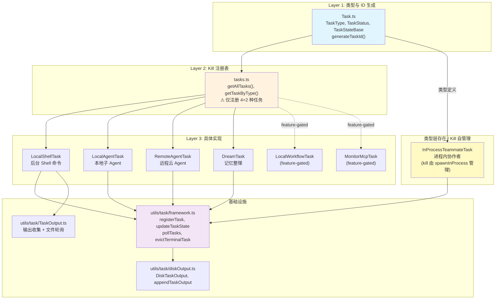

# 第 14 篇：任务系统 — Agent 的并发执行引擎

> 本篇是《深入 Claude Code 源码》系列的第 14 篇。我们将深入分析 Claude Code 如何通过一套统一的任务系统，管理从后台 Shell 命令到多 Agent 并行协作的所有异步工作。

## 为什么需要任务系统？

在前几篇中，我们已经见过了 Agent 系统（第 12 篇）和内置 Agent 设计模式（第 13 篇）。但有一个关键问题尚未解决：**当模型同时发起多个 Agent、多个后台 Shell 命令、甚至一个"做梦"式的记忆整理任务时，这些并发工作如何被统一管理？**

想象一个真实场景：Coordinator 模式下，主 Agent 同时派出 3 个 Worker 去研究代码库的不同部分，每个 Worker 又可能启动自己的后台 Shell 命令。此时系统需要：

1. **追踪所有任务的生命周期**（pending → running → completed/failed/killed）
2. **安全地终止任务**（包括清理子进程、释放文件句柄）
3. **收集并转发任务输出**（任务完成时通知主 Agent）
4. **隔离任务状态**（一个任务的失败不应波及其他任务）
5. **在终端 UI 中展示后台任务进度**（底部状态栏的"2 local agents, 1 shell"指示器）

这就是任务系统要解决的问题。它是 Claude Code 的**并发执行引擎**，将所有异步工作统一在一个类型安全、生命周期完整的框架下。

---

## 一、架构全景：Task 接口与 TaskState 类型体系

### 1.1 核心抽象：三层分离设计

任务系统采用了一个清晰的三层分离架构：



**Layer 1**（`Task.ts`）定义了所有任务共享的类型：`TaskType`、`TaskStatus`、`TaskStateBase`，以及 ID 生成逻辑。

**Layer 2**（`tasks.ts`）是 kill 分发注册表，模式与 `tools.ts` 一致 — `getAllTasks()` 返回所有注册的任务类型实例，`getTaskByType()` 按类型查找。需要注意的是，**并非所有 `TaskType` 都注册在此**：当前 `getAllTasks()` 只包含 `LocalShellTask`、`LocalAgentTask`、`RemoteAgentTask`、`DreamTask` 和两个 feature-gated 任务。`InProcessTeammateTask` 虽然在 `TaskType` 联合类型和 `TaskState` 联合类型中存在，也使用 `registerTask()` 注册到 AppState、在 UI 层（pill、面板）中展示，但它的 kill 逻辑由 `killInProcessTeammate()`（`utils/swarm/spawnInProcess.ts`）直接处理，而不通过 `tasks.ts` 的通用 `getTaskByType()` 分发。这意味着 `stopTask.ts` 对 `in_process_teammate` 类型会抛出 `unsupported_type` 错误。

**Layer 3** 是具体任务实现，每种任务类型都是一个目录，包含自己的状态类型、生命周期逻辑和 kill 方法。

### 1.2 TaskType 与状态机

任务系统定义了 7 种任务类型：

```typescript
// Task.ts:6-14
export type TaskType =
  | 'local_bash'          // 后台 Shell 命令
  | 'local_agent'         // 本地子 Agent
  | 'remote_agent'        // 远程云 Agent
  | 'in_process_teammate' // 进程内协作者（Swarm 模式）
  | 'local_workflow'      // 工作流脚本（feature-gated）
  | 'monitor_mcp'         // MCP 监控任务（feature-gated）
  | 'dream'               // 记忆整理（自动做梦）
```

每种类型都有唯一的 ID 前缀，生成 `prefix + 8位随机字符` 格式的 ID：

```typescript
// Task.ts:79-87
const TASK_ID_PREFIXES: Record<string, string> = {
  local_bash: 'b',           // b3k9m2x7p
  local_agent: 'a',          // a7f2h8k3m
  remote_agent: 'r',         // r9n4p6q1s
  in_process_teammate: 't',  // t2j5l8n0q
  local_workflow: 'w',
  monitor_mcp: 'm',
  dream: 'd',
}
```

所有任务共享同一个状态机，只有 5 个状态：

```
pending → running → completed
                  → failed
                  → killed
```

`isTerminalTaskStatus()` 函数判断一个任务是否处于终态（`completed`/`failed`/`killed`），这在整个系统中被广泛用于防止向已死任务注入消息、触发清理逻辑等。

### 1.3 极简的 Task 接口

`Task` 接口设计得极度简洁 — **只有一个方法**：

```typescript
// Task.ts:72-76
export type Task = {
  name: string
  type: TaskType
  kill(taskId: string, setAppState: SetAppState): Promise<void>
}
```

源码注释直接说明了为什么这么精简：

> What getTaskByType dispatches for: kill. spawn/render were never called polymorphically (removed in #22546). All six kill implementations use only setAppState — getAppState/abortController were dead weight.

换言之，`spawn` 和 `render` 最初是 `Task` 接口的方法，但在实际演进中发现它们从未被多态调用 — 每种任务的创建方式差异太大，不适合统一接口。只有 `kill` 需要多态分发（`stopTask.ts` 通过 `getTaskByType(task.type)` 找到实现后调用 `taskImpl.kill()`），所以接口收敛到只剩 `kill`。需要注意的是，并非所有 `TaskType` 都注册在 `tasks.ts` 中（详见 1.4 节），未注册的类型通过 `stopTask()` 终止时会得到 `unsupported_type` 错误。

这是一个**从实践中涌现的极简设计** — 不是一开始就设计好的，而是在重构中删除了不被使用的抽象。

### 1.4 注册表：镜像 tools.ts 的模式

```typescript
// tasks.ts:22-32
export function getAllTasks(): Task[] {
  const tasks: Task[] = [
    LocalShellTask,
    LocalAgentTask,
    RemoteAgentTask,
    DreamTask,
  ]
  if (LocalWorkflowTask) tasks.push(LocalWorkflowTask)
  if (MonitorMcpTask) tasks.push(MonitorMcpTask)
  return tasks
}
```

注意 `LocalWorkflowTask` 和 `MonitorMcpTask` 使用了 `feature()` 门控 + 条件 `require()` 的模式（与第 1 篇介绍的编译期 DCE 机制一致）。在外部构建中，这两个任务类型的代码会被完全删除。

---

## 二、基础设施层：framework.ts 与输出管理

### 2.1 framework.ts — 任务的"操作系统"

`utils/task/framework.ts` 是任务系统的核心基础设施，提供了所有任务类型共用的 CRUD 操作：

**registerTask()** — 在 AppState 中注册任务：

```typescript
// utils/task/framework.ts:77-117
export function registerTask(task: TaskState, setAppState: SetAppState): void {
  let isReplacement = false
  setAppState(prev => {
    const existing = prev.tasks[task.id]
    isReplacement = existing !== undefined
    // Carry forward UI-held state on re-register (resumeAgentBackground
    // replaces the task; user's retain shouldn't reset)
    const merged =
      existing && 'retain' in existing
        ? {
            ...task,
            retain: existing.retain,
            startTime: existing.startTime,
            messages: existing.messages,
            diskLoaded: existing.diskLoaded,
            pendingMessages: existing.pendingMessages,
          }
        : task
    return { ...prev, tasks: { ...prev.tasks, [task.id]: merged } }
  })
  // ...
}
```

这里有一个精妙的细节：当 `resumeAgentBackground`（恢复后台 Agent）重新注册已有任务时，它保留了用户的 `retain`（保持在 UI 中显示的标记）、`startTime`（保持面板排序稳定）和 `messages`（保持已查看的对话记录）。这是一种**面向用户体验的状态合并**策略。

**updateTaskState()** — 泛型更新操作：

```typescript
// utils/task/framework.ts:48-72
export function updateTaskState<T extends TaskState>(
  taskId: string,
  setAppState: SetAppState,
  updater: (task: T) => T,
): void {
  setAppState(prev => {
    const task = prev.tasks?.[taskId] as T | undefined
    if (!task) return prev
    const updated = updater(task)
    if (updated === task) {
      // Updater returned the same reference (early-return no-op). Skip the
      // spread so s.tasks subscribers don't re-render on unchanged state.
      return prev
    }
    return { ...prev, tasks: { ...prev.tasks, [taskId]: updated } }
  })
}
```

这个函数的**引用相等性优化**值得注意：如果 updater 返回了相同的引用（表示无需更新），它跳过 spread 操作，避免触发 React 不必要的重渲染。这与第 3 篇介绍的 Store 中 `Object.is` 检查是同一个模式。

**evictTerminalTask()** — 终态任务的提前驱逐：

```typescript
// utils/task/framework.ts:125-144
export function evictTerminalTask(taskId: string, setAppState: SetAppState): void {
  setAppState(prev => {
    const task = prev.tasks?.[taskId]
    if (!task) return prev
    if (!isTerminalTaskStatus(task.status)) return prev
    if (!task.notified) return prev
    // Panel grace period — blocks eviction until deadline passes.
    if ('retain' in task && (task.evictAfter ?? Infinity) > Date.now()) {
      return prev
    }
    const { [taskId]: _, ...remainingTasks } = prev.tasks
    return { ...prev, tasks: remainingTasks }
  })
}
```

驱逐逻辑分为两层检查。前两个条件对所有任务通用：(1) 必须处于终态（completed/failed/killed）(2) 必须已通知（`notified = true`）。第三个条件则只对**带面板保持语义的任务**（即包含 `retain` 字段的 `LocalAgentTaskState`）生效：如果 `evictAfter` 时间戳尚未过期（默认 `PANEL_GRACE_MS = 30_000`，即 30 秒），则暂缓驱逐，确保 Coordinator 面板中完成的 Agent 不会立即消失。对于 `LocalShellTask`、`DreamTask` 等没有 `retain` 字段的任务，通过前两个条件即可驱逐。

### 2.2 DiskTaskOutput — 高性能磁盘写入队列

后台任务的输出可能非常大（最大 5GB），需要一套精心设计的磁盘写入机制。`DiskTaskOutput` 类是这套机制的核心：

```typescript
// utils/task/diskOutput.ts:97-131
export class DiskTaskOutput {
  #path: string
  #fileHandle: FileHandle | null = null
  #queue: string[] = []
  #bytesWritten = 0
  #capped = false

  append(content: string): void {
    if (this.#capped) return
    this.#bytesWritten += content.length
    if (this.#bytesWritten > MAX_TASK_OUTPUT_BYTES) {
      this.#capped = true
      this.#queue.push(
        `\n[output truncated: exceeded ${MAX_TASK_OUTPUT_BYTES_DISPLAY} disk cap]\n`,
      )
    } else {
      this.#queue.push(content)
    }
    if (!this.#flushPromise) {
      this.#flushPromise = new Promise<void>(resolve => {
        this.#flushResolve = resolve
      })
      void track(this.#drain())
    }
  }
  // ...
}
```

源码中有一段极其严肃的注释，揭示了内存管理的关键约束：

```typescript
// utils/task/diskOutput.ts:178-186
#writeAllChunks(): Promise<void> {
  // This code is extremely precise.
  // You **must not** add an await here!! That will cause memory to balloon
  // as the queue grows.
  return this.#fileHandle!.appendFile(this.#queueToBuffers())
}
```

设计要点：
- **写队列模式**：`append()` 只往 `#queue` 数组里推数据，真正的 I/O 由 `#drain()` 异步循环驱动
- **内存即时释放**：`#queueToBuffers()` 使用 `splice(0, length)` 原地清空数组，让 GC 尽快回收
- **5GB 磁盘上限**：超限后写入截断提示，防止填满磁盘
- **安全防护**：使用 `O_NOFOLLOW` 防止沙箱内的 symlink 攻击（攻击者不能通过创建指向 `/etc/passwd` 的符号链接来让 Claude Code 往任意文件写入）

### 2.3 TaskOutput — 双模式输出收集

`TaskOutput` 类统一了两种输出收集模式：

| 模式 | 用途 | 数据流 |
|------|------|--------|
| **File 模式** | Bash 命令 | stdout/stderr 直接写文件 fd（不经过 JS），进度通过轮询文件尾部获取 |
| **Pipe 模式** | Hook 脚本 | 数据经过 `writeStdout()`/`writeStderr()`，先在内存缓冲，超 8MB 溢出到磁盘 |

File 模式的进度轮询特别有意思 — 它使用了一个**静态注册表 + 按需轮询**的架构：

```typescript
// utils/task/TaskOutput.ts:53-56
static #registry = new Map<string, TaskOutput>()    // 全部已注册
static #activePolling = new Map<string, TaskOutput>() // 当前正在轮询的
static #pollInterval: ReturnType<typeof setInterval> | null = null
```

React 组件通过 `startPolling(taskId)` / `stopPolling(taskId)` 控制哪些任务需要被轮询。当没有任何任务在轮询时，interval 被自动清除（`.unref()` 确保不阻止进程退出）。这是一种**UI 驱动的按需资源分配**模式。

---

## 三、任务类型详解

### 3.1 LocalShellTask — 后台 Shell 命令

这是最基础的任务类型，用于运行后台 Bash 命令。它的状态类型扩展了 `TaskStateBase`：

```typescript
// tasks/LocalShellTask/guards.ts:11-32
export type LocalShellTaskState = TaskStateBase & {
  type: 'local_bash'
  command: string
  result?: { code: number; interrupted: boolean }
  completionStatusSentInAttachment: boolean
  shellCommand: ShellCommand | null
  isBackgrounded: boolean
  agentId?: AgentId   // 哪个 Agent 创建了这个任务
  kind?: BashTaskKind // 'bash' 或 'monitor'
}
```

`agentId` 字段实现了一个重要的**生命周期绑定**：当 Agent 退出时，它创建的所有 Shell 任务也会被终止：

```typescript
// tasks/LocalShellTask/killShellTasks.ts:53-76
export function killShellTasksForAgent(
  agentId: AgentId,
  getAppState: () => AppState,
  setAppState: SetAppStateFn,
): void {
  const tasks = getAppState().tasks ?? {}
  for (const [taskId, task] of Object.entries(tasks)) {
    if (
      isLocalShellTask(task) &&
      task.agentId === agentId &&
      task.status === 'running'
    ) {
      killTask(taskId, setAppState)
    }
  }
  // Purge any queued notifications addressed to this agent
  dequeueAllMatching(cmd => cmd.agentId === agentId)
}
```

注释中透露了这个设计的动机：**prevents 10-day fake-logs.sh zombies** — 没有这个清理机制，Agent 启动的后台进程会变成僵尸进程，持续运行直到系统重启。

LocalShellTask 还实现了**卡顿检测**（`startStallWatchdog()`，`STALL_THRESHOLD_MS = 45_000`）— 对于已经在后台运行的 Shell 任务，如果超过 45 秒没有新输出，系统会读取文件尾部并检查其最后一行是否匹配已知的交互式 prompt 模式（如 `(y/n)`、`Press any key`、`Continue?` 等），如果匹配则发送一条 `<task-notification>` 告知模型该任务可能卡在了交互式输入上，建议 kill 后用管道输入重跑。注意，这个 watchdog 不会自动将任务后台化 — 前台到后台的转换是另一条独立的路径（由 `registerForeground()` / `backgroundExistingForegroundTask()` 等逻辑处理）。

### 3.2 LocalAgentTask — 本地子 Agent

LocalAgentTask 管理通过 AgentTool 在本地进程中启动的子 Agent。它的状态比 Shell 任务丰富得多：

```typescript
// tasks/LocalAgentTask/LocalAgentTask.tsx:116-148
export type LocalAgentTaskState = TaskStateBase & {
  type: 'local_agent'
  agentId: string
  prompt: string
  selectedAgent?: AgentDefinition
  agentType: string
  model?: string
  abortController?: AbortController
  result?: AgentToolResult
  progress?: AgentProgress
  isBackgrounded: boolean
  pendingMessages: string[]    // 队列中等待发送的消息
  retain: boolean              // UI 是否保持显示
  diskLoaded: boolean          // 是否已从磁盘加载对话记录
  evictAfter?: number          // 面板显示截止时间
}
```

这里有几个关键设计：

**pendingMessages 队列**：Coordinator 通过 `SendMessage` 工具向正在运行的 Agent 发送后续指令。这些消息不能直接注入 Agent 的对话循环（会破坏正在进行的 API 调用），而是放入 `pendingMessages` 队列，在工具轮次边界（tool-round boundary）被 `drainPendingMessages()` 消耗。

**retain + diskLoaded**：当用户在 UI 中查看某个 Agent 的对话记录时，`retain = true` 阻止任务被驱逐。`diskLoaded` 标记是否已从磁盘 JSONL 文件加载了完整对话记录（初始只有实时流式追加的消息）。

**进度追踪**（`ProgressTracker`）：

```typescript
// tasks/LocalAgentTask/LocalAgentTask.tsx:41-57
export type ProgressTracker = {
  toolUseCount: number
  latestInputTokens: number      // API input_tokens 是累积的，取最新值
  cumulativeOutputTokens: number  // output_tokens 是每轮的，需要累加
  recentActivities: ToolActivity[]
}
```

注释揭示了一个常见的 Token 统计陷阱：Claude API 的 `input_tokens` 是**累积的**（包含所有之前的上下文），而 `output_tokens` 是**每轮的**。如果简单地把两者都累加，input token 数会被严重高估。

### 3.3 RemoteAgentTask — 远程云 Agent

RemoteAgentTask 管理通过 Teleport 协议在 Anthropic 云端运行的 Agent session。它不在本地执行代码，而是**轮询远程 session 的事件流**：

```typescript
// tasks/RemoteAgentTask/RemoteAgentTask.tsx:22-59
export type RemoteAgentTaskState = TaskStateBase & {
  type: 'remote_agent'
  remoteTaskType: RemoteTaskType  // 'remote-agent' | 'ultraplan' | 'ultrareview' | ...
  sessionId: string
  command: string
  title: string
  todoList: TodoList
  log: SDKMessage[]
  isLongRunning?: boolean
  pollStartedAt: number
  isUltraplan?: boolean
  ultraplanPhase?: Exclude<UltraplanPhase, 'running'>
}
```

`ultraplanPhase` 字段驱动了 UI 的状态指示器：底部 pill 显示 `◇ ultraplan`（运行中）或 `◆ ultraplan ready`（等待用户审批），实现在 `pillLabel.ts` 中：

```typescript
// tasks/pillLabel.ts:43-52
if (n === 1 && first.type === 'remote_agent' && first.isUltraplan) {
  switch (first.ultraplanPhase) {
    case 'plan_ready':
      return `${DIAMOND_FILLED} ultraplan ready`
    case 'needs_input':
      return `${DIAMOND_OPEN} ultraplan needs your input`
    default:
      return `${DIAMOND_OPEN} ultraplan`
  }
}
```

### 3.4 InProcessTeammateTask — 进程内协作者

这是最复杂的任务类型，用于 Swarm/Team 模式下的多 Agent 协作。与 LocalAgentTask（后台 Agent）不同，in-process teammates **运行在同一个 Node.js 进程中**，通过 `AsyncLocalStorage` 实现上下文隔离。

值得注意的是，`InProcessTeammateTask` 虽然在类型系统（`TaskType`/`TaskState` 联合类型）和 UI 层（pill 指示器、面板、消息追加）中完整存在，但它**没有注册到 `tasks.ts` 的 `getAllTasks()` 注册表中**。它实现了 `Task` 接口（包括 `kill` 方法），但其生命周期管理由 `utils/swarm/spawnInProcess.ts` 中的 `killInProcessTeammate()` 直接驱动，而非通过 `stopTask.ts` → `getTaskByType()` 的通用分发路径。这是一个"类型层已就绪，但注册表层尚未完全统一"的架构状态。

```typescript
// tasks/InProcessTeammateTask/types.ts:22-76
export type InProcessTeammateTaskState = TaskStateBase & {
  type: 'in_process_teammate'
  identity: TeammateIdentity    // agentName@teamName
  prompt: string
  model?: string
  selectedAgent?: AgentDefinition
  abortController?: AbortController
  currentWorkAbortController?: AbortController  // 仅中止当前轮次
  awaitingPlanApproval: boolean
  permissionMode: PermissionMode  // 独立的权限模式
  messages?: Message[]
  pendingUserMessages: string[]   // 用户可以直接给 teammate 发消息
  isIdle: boolean                 // 等待工作 vs 正在处理
  shutdownRequested: boolean
  onIdleCallbacks?: Array<() => void>  // 变为 idle 时通知 leader
}
```

几个值得注意的设计决策：

**双 AbortController**：`abortController` 终止整个 teammate，而 `currentWorkAbortController` 只中止当前正在进行的工作（让 teammate 可以接收新任务）。

**消息 UI 上限**：

```typescript
// tasks/InProcessTeammateTask/types.ts:101
export const TEAMMATE_MESSAGES_UI_CAP = 50
```

注释中引用了一次真实的事故分析（BQ analysis, 2026-03-20）：一个 whale session 在 2 分钟内启动了 292 个 Agent，达到了 36.8GB 的 RSS。根因是 `task.messages` 保存了每个 Agent 的完整对话副本。解决方案是限制 UI 镜像的消息数量为 50 条，完整对话在磁盘上。

### 3.5 DreamTask — 记忆整理

DreamTask 是最独特的任务类型 — 它不是用户主动触发的，而是系统在 session 空闲时自动启动的**记忆巩固**过程：

```typescript
// tasks/DreamTask/DreamTask.ts:25-41
export type DreamTaskState = TaskStateBase & {
  type: 'dream'
  phase: DreamPhase        // 'starting' | 'updating'
  sessionsReviewing: number
  filesTouched: string[]   // 被修改的文件路径（不完整）
  turns: DreamTurn[]       // 最近 30 个 turn
  abortController?: AbortController
  priorMtime: number       // 用于回滚 consolidation lock
}
```

DreamTask 的 `kill` 实现有一个特殊的恢复机制：当用户终止 dreaming 时，它会回滚 consolidation lock 的 mtime，让下一个 session 可以重试。这防止了"梦被打断后再也不做梦"的问题。

### 3.6 LocalMainSessionTask — 主会话后台化

这是一个特殊的变种 — 当用户按两次 `Ctrl+B` 将当前正在执行的查询转入后台时创建的任务。它复用了 `LocalAgentTaskState`（`agentType = 'main-session'`），本质上是将主线程的 `query()` 循环从前台"剥离"到后台继续执行：

```typescript
// tasks/LocalMainSessionTask.ts:338-478
export function startBackgroundSession({ messages, queryParams, ... }): string {
  const { taskId, abortSignal } = registerMainSessionTask(description, setAppState)

  void runWithAgentContext(agentContext, async () => {
    try {
      for await (const event of query({ messages: bgMessages, ...queryParams })) {
        if (abortSignal.aborted) {
          // 被中止 — 发送终止通知
          return
        }
        bgMessages.push(event)
        // 更新进度
      }
      completeMainSessionTask(taskId, true, setAppState)
    } catch (error) {
      completeMainSessionTask(taskId, false, setAppState)
    }
  })
  return taskId
}
```

---

## 四、任务通知机制：从后台到主循环的消息传递

当后台任务完成时，如何通知主 Agent（或 Coordinator）？这通过一个基于 XML 的 `<task-notification>` 协议实现，但值得注意的是，**通知的发送并非由 framework 层统一处理，而是分散在各任务类型的实现中**。

### 4.1 通知协议：共同的 XML 骨架

所有任务通知共享一组基础 XML 标签：

```xml
<task-notification>
  <task-id>a7f2h8k3m</task-id>
  <tool-use-id>toolu_01X...</tool-use-id>
  <output-file>/tmp/.claude/session123/tasks/a7f2h8k3m.output</output-file>
  <status>completed</status>
  <summary>Agent "Investigate auth bug" completed</summary>
</task-notification>
```

各任务类型会在此骨架上追加特有的扩展字段。例如，`LocalAgentTask` 的 `enqueueAgentNotification()` 会添加 `<result>`（Agent 的最终文本回复）和 `<usage>`（token/工具调用统计）：

```typescript
// tasks/LocalAgentTask/LocalAgentTask.tsx:249-257
const resultSection = finalMessage ? `\n<result>${finalMessage}</result>` : ''
const usageSection = usage
  ? `\n<usage><total_tokens>${usage.totalTokens}</total_tokens>` +
    `<tool_uses>${usage.toolUses}</tool_uses>` +
    `<duration_ms>${usage.durationMs}</duration_ms></usage>`
  : ''
```

而 `LocalShellTask` 的通知则包含退出码信息，`RemoteAgentTask` 可能包含 `<worktree>` 信息。framework 层的 `enqueueTaskNotification()`（`framework.ts:274-289`）虽然也定义了一个通知发送函数，但当前它主要由轮询式的 `generateTaskAttachments()` 驱动，而源码注释明确指出：

> Completed tasks are NOT notified here — each task type handles its own completion notification via `enqueuePendingNotification()`. Generating attachments here would race with those per-type callbacks, causing dual delivery.

这意味着完成通知是**去中心化**的 — 每种任务类型在自己的生命周期代码中负责发送通知，framework 层的 `generateTaskAttachments()` 当前主要处理运行中任务的输出 offset 更新和终态任务的 AppState 驱逐。

### 4.2 消息队列与优先级

所有通知最终通过 `enqueuePendingNotification()` 写入 MessageQueueManager 的命令队列，以 `'later'` 优先级排队：

```typescript
// utils/messageQueueManager.ts:142-149
export function enqueuePendingNotification(command: QueuedCommand): void {
  commandQueue.push({ ...command, priority: command.priority ?? 'later' })
  notifySubscribers()
}
```

队列的优先级设计确保用户输入不会被系统消息饿死：

| 优先级 | 用途 | 处理时机 |
|--------|------|---------|
| `'now'` | 紧急命令 | 立即处理 |
| `'next'` | 用户输入 | 下一轮处理 |
| `'later'` | 任务通知 | 用户输入处理完后 |

### 4.3 重复通知防护

每个任务的通知都通过 `notified` 标记进行原子性检查，防止 `TaskStopTool`（模型调用）和任务自然完成两条路径产生重复通知。这个模式在每种任务的通知函数中被独立实现（而非 framework 层统一提供）：

```typescript
// tasks/LocalAgentTask/LocalAgentTask.tsx:227-237
let shouldEnqueue = false
updateTaskState<LocalAgentTaskState>(taskId, setAppState, task => {
  if (task.notified) return task
  shouldEnqueue = true
  return { ...task, notified: true }
})
if (!shouldEnqueue) return
```

---

## 五、Agent 协作模型：三种并发模式

任务系统支撑了三种不同的 Agent 并发协作模式：

### 5.1 Fork Subagent — 继承上下文的分叉

Fork Subagent 是最新的协作模式。子 Agent 继承父 Agent 的完整对话上下文，并在此基础上执行特定指令。

`forkSubagent.ts` 中的 `buildForkedMessages()` 函数构建了一种精心设计的消息结构，确保所有 fork 子 Agent 的 API 请求前缀字节完全相同（最大化 Prompt Cache 命中）：

```typescript
// tools/AgentTool/forkSubagent.ts:107-168
export function buildForkedMessages(
  directive: string,
  assistantMessage: AssistantMessage,
): MessageType[] {
  // 1. 保留完整的 assistant message（所有 tool_use blocks）
  const fullAssistantMessage = { ...assistantMessage, ... }

  // 2. 为每个 tool_use 创建相同占位符的 tool_result
  const toolResultBlocks = toolUseBlocks.map(block => ({
    type: 'tool_result',
    tool_use_id: block.id,
    content: [{ type: 'text', text: 'Fork started — processing in background' }],
  }))

  // 3. 只有最后的 directive 文本块不同
  // Result: [...history, assistant(all_tool_uses), user(placeholder_results..., directive)]
  // 只有最后一个 text block 因 directive 不同而不同 → 最大化缓存命中
  return [fullAssistantMessage, toolResultMessage]
}
```

Fork 子 Agent 还接收了一段严格的"身份认同" prompt：

```
STOP. READ THIS FIRST.
You are a forked worker process. You are NOT the main agent.
RULES (non-negotiable):
1. Your system prompt says "default to forking." IGNORE IT — that's for the parent.
   You ARE the fork. Do NOT spawn sub-agents; execute directly.
```

这段 prompt 解决了一个递归风险：fork 子 Agent 继承了父 Agent 的 system prompt（其中包含"优先使用 fork"的指令），如果不明确告知它"你已经是 fork 了"，它会尝试再次 fork，导致无限递归。

### 5.2 Coordinator Mode — 专用编排器

Coordinator 模式将主 Agent 变成一个**纯编排器**，它不直接使用文件读写工具，而是通过 `AgentTool`、`SendMessage` 和 `TaskStopTool` 来管理 Worker 团队。

```typescript
// coordinator/coordinatorMode.ts:36-41
export function isCoordinatorMode(): boolean {
  if (feature('COORDINATOR_MODE')) {
    return isEnvTruthy(process.env.CLAUDE_CODE_COORDINATOR_MODE)
  }
  return false
}
```

Coordinator 的 system prompt 是一份完整的"管理者手册"（约 370 行），包含了 Worker 的能力描述、任务工作流（Research → Synthesis → Implementation → Verification）、prompt 编写指南（"永远不要说 'based on your findings' — 你必须自己理解研究结果后再给出具体指令"），以及何时 Continue vs Spawn Fresh 的决策框架。

### 5.3 In-Process Teammate（Swarm 模式）

Swarm 模式允许多个 Agent 在同一个 Node.js 进程中并行运行，通过 `AsyncLocalStorage` 实现身份隔离。每个 teammate 拥有独立的：
- 权限模式（可以通过 `Shift+Tab` 在查看时独立切换）
- AbortController（可以单独终止）
- 消息队列（用户可以直接发消息给特定 teammate）

```typescript
// tasks/InProcessTeammateTask/types.ts:13-20
export type TeammateIdentity = {
  agentId: string      // "researcher@my-team"
  agentName: string    // "researcher"
  teamName: string
  color?: string
  planModeRequired: boolean
  parentSessionId: string
}
```

---

## 六、上下文隔离：createSubagentContext() 的设计

> **交叉引用**：`createSubagentContext()` 的完整接口设计在[第 12 篇](./12-Agent-系统.md)第四节已详述。本节聚焦于它在**并发任务场景**下的特殊考量。

所有 Agent 协作模式都依赖 `createSubagentContext()` 来创建隔离的执行上下文。这个函数定义在 `utils/forkedAgent.ts` 中，是整个并发体系的安全基石：

```typescript
// utils/forkedAgent.ts:345-462
export function createSubagentContext(
  parentContext: ToolUseContext,
  overrides?: SubagentContextOverrides,
): ToolUseContext {
  return {
    // 可变状态 — 默认克隆以维持隔离
    readFileState: cloneFileStateCache(
      overrides?.readFileState ?? parentContext.readFileState,
    ),
    nestedMemoryAttachmentTriggers: new Set<string>(),
    dynamicSkillDirTriggers: new Set<string>(),
    toolDecisions: undefined,

    // contentReplacementState — 克隆而非全新创建
    // 原因：cache-sharing fork 需要对父 tool_use_id 做相同的替换决策
    // 全新 state 会做出不同决策 → 线上前缀不同 → cache miss
    contentReplacementState: overrides?.contentReplacementState ??
      (parentContext.contentReplacementState
        ? cloneContentReplacementState(parentContext.contentReplacementState)
        : undefined),

    // AbortController: override > share parent's > new child linked to parent
    abortController: overrides?.abortController ??
      (overrides?.shareAbortController
        ? parentContext.abortController
        : createChildAbortController(parentContext.abortController)),

    // 任务注册必须穿透到根 store
    setAppStateForTasks:
      parentContext.setAppStateForTasks ?? parentContext.setAppState,

    // UI 回调 — 子 Agent 不能控制父 UI
    addNotification: undefined,
    setToolJSX: undefined,
    setStreamMode: undefined,
    // ...
  }
}
```

这里最精妙的设计是 **`setAppStateForTasks` 穿透机制**。即使子 Agent 的 `setAppState` 被设置为 `() => {}` no-op（为了隔离），它的 `setAppStateForTasks` 仍然指向根 Store 的 `setAppState`。这样子 Agent 启动的后台 Bash 任务可以正确注册到全局 AppState 中，而不是消失在隔离的 no-op 黑洞里。

源码注释直接说明了不这样做的后果：

> Task registration/kill must always reach the root store, even when setAppState is a no-op — otherwise async agents' background bash tasks are never registered and never killed (PPID=1 zombie).

---

## 七、可迁移的设计模式

### 模式 1：极简多态接口 + 注册表

只在接口中保留**真正需要多态分发的方法**（这里只有 `kill`），其他操作（`spawn`、`render`）由各实现自行暴露。配合注册表模式（`getAllTasks()` + `getTaskByType()`），实现可扩展的类型系统。

**适用场景**：任何需要管理多种变体的系统，如插件、策略、处理器等。关键是**从实践中发现真正的多态点**，而非预先设计过多抽象。

### 模式 2：穿透式 AppState 访问

隔离子上下文时，区分"需要隔离的突变操作"和"必须穿透到根的基础设施操作"。`setAppState = () => {}` 实现突变隔离，`setAppStateForTasks` 实现任务注册穿透。

**适用场景**：任何多 Agent/多租户架构中，子实体需要注册全局资源（定时器、后台任务、清理回调等）但又不应该影响父实体状态的场景。

### 模式 3：优先级消息队列

通过 `'now' > 'next' > 'later'` 的三级优先级队列，确保用户交互不被系统消息饿死，同时任务通知在合适的时机被消费。队列本身是 React 可感知的（通过 `useSyncExternalStore`），但也对非 React 代码暴露了直接 API。

**适用场景**：任何混合了用户输入和系统事件的交互式应用。关键是将优先级设计为队列的一等公民，而非事后补丁。

---

## 下一篇预告

[第 15 篇：MCP 协议实现 — 连接外部工具的标准化桥梁](./15-MCP-协议实现.md)

我们将深入 `services/mcp/` 目录，分析 Claude Code 如何通过 5 种传输层（stdio / SSE / HTTP / WebSocket / SDK）连接外部工具服务器，以及 OAuth + XAA 认证方案的实现。

---

*全部内容请关注 https://github.com/luyao618/Claude-Code-Source-Study (求一颗免费的小星星)*
