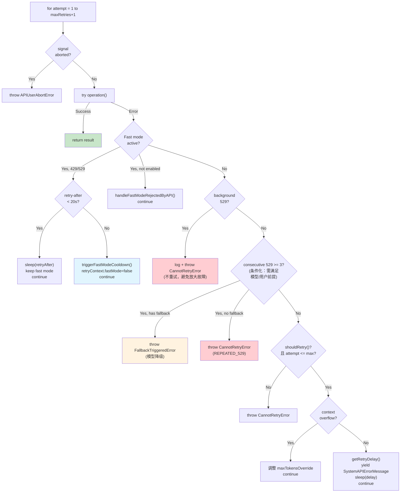
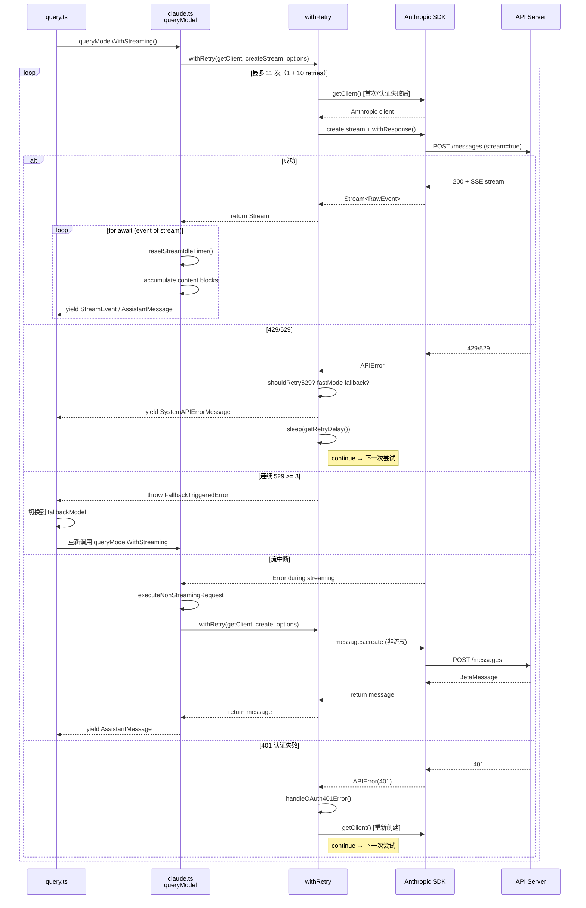

# 第 20 篇：API 调用与错误恢复 — 面向不可靠网络的鲁棒设计

> 本篇是《深入 Claude Code 源码》系列第 20 篇。我们将深入 API 调用层的错误恢复机制，看看一个生产级 AI CLI 如何在不可靠的网络环境下保持稳定运行。

## 为什么需要如此复杂的错误恢复？

当你在本地调用一个 REST API 时，最简单的做法是失败就报错。但 Claude Code 面对的是一个远比这复杂的现实：

1. **网络不可靠** — 用户可能在咖啡馆 WiFi、企业代理、VPN 隧道后面使用
2. **API 容量波动** — 529 过载和 429 限流是 LLM API 的常态，不是异常
3. **认证令牌过期** — OAuth token、AWS credential、GCP credential 都有 TTL
4. **流式连接脆弱** — SSE 流可能在中途断开、超时、或被代理截断
5. **多 Provider 差异** — 同一份代码要兼容 Anthropic 直连、AWS Bedrock、GCP Vertex、Azure Foundry 四种后端

如果每种错误都让用户手动重试，用户体验将是灾难性的 —— 想象你在一个需要 10 分钟的 agentic 编程任务中途遇到一次 529，不得不从头开始。

Claude Code 的解决方案是一套**三层防御架构**：`withRetry` 通用重试层 → 流式/非流式双模式 → 错误分类与用户友好提示。本篇将逐层拆解。

---

## 一、withRetry：AsyncGenerator 驱动的重试引擎

### 1.1 为什么用 AsyncGenerator？

`withRetry` 的函数签名非常独特 —— 它不是返回 `Promise<T>`，而是返回 `AsyncGenerator<SystemAPIErrorMessage, T>`：

```typescript
// services/api/withRetry.ts:170-178
export async function* withRetry<T>(
  getClient: () => Promise<Anthropic>,
  operation: (
    client: Anthropic,
    attempt: number,
    context: RetryContext,
  ) => Promise<T>,
  options: RetryOptions,
): AsyncGenerator<SystemAPIErrorMessage, T> {
```

为什么是 AsyncGenerator 而不是简单的 `async function`？因为重试过程中需要**向上游发送中间状态** —— 每次重试前的等待时间、当前是第几次尝试、错误类型等信息需要实时反馈给 UI 层，让用户知道"系统正在重试，请稍候"而不是"系统卡死了"。

Generator 的 `yield` 天然适合这个场景：每次重试等待期间 yield 一条 `SystemAPIErrorMessage`，UI 层消费这些消息并展示进度。正常完成时通过 `return` 返回最终结果。

### 1.2 核心常量与重试预算

```typescript
// services/api/withRetry.ts:52-55
const DEFAULT_MAX_RETRIES = 10
const FLOOR_OUTPUT_TOKENS = 3000
const MAX_529_RETRIES = 3
export const BASE_DELAY_MS = 500
```

四个关键常量定义了重试的边界：

| 常量 | 值 | 含义 |
|------|------|------|
| `DEFAULT_MAX_RETRIES` | 10 | 默认最多重试 10 次 |
| `MAX_529_RETRIES` | 3 | 连续 529 过载最多 3 次就触发模型降级 |
| `BASE_DELAY_MS` | 500ms | 指数退避的基础延迟 |
| `FLOOR_OUTPUT_TOKENS` | 3000 | context overflow 调整时的最小输出 token 数 |

`DEFAULT_MAX_RETRIES` 可以通过环境变量 `CLAUDE_CODE_MAX_RETRIES` 覆盖（`withRetry.ts:790-793`），这在 CI/CD 等场景下很有用。

### 1.3 指数退避与 Retry-After

延迟计算函数 `getRetryDelay` 实现了带抖动的指数退避策略：

```typescript
// services/api/withRetry.ts:530-548
export function getRetryDelay(
  attempt: number,
  retryAfterHeader?: string | null,
  maxDelayMs = 32000,
): number {
  // 如果服务器通过 Retry-After 头指定了等待时间，优先使用
  if (retryAfterHeader) {
    const seconds = parseInt(retryAfterHeader, 10)
    if (!isNaN(seconds)) {
      return seconds * 1000
    }
  }

  // 指数退避：500ms, 1s, 2s, 4s, 8s, 16s, 32s（封顶）
  const baseDelay = Math.min(
    BASE_DELAY_MS * Math.pow(2, attempt - 1),
    maxDelayMs,
  )
  // 加 25% 随机抖动，避免多客户端雷同重试（thundering herd）
  const jitter = Math.random() * 0.25 * baseDelay
  return baseDelay + jitter
}
```

这个设计有两个值得注意的细节：

1. **Retry-After 优先级最高** —— 服务器说等多久就等多久，这是 HTTP 协议的正确实践
2. **25% 抖动** —— 当大量客户端同时遇到 529 并重试时，抖动可以将重试请求分散到时间窗口中，避免"重试风暴"

### 1.4 主循环：一个精密的状态机

`withRetry` 的主循环是一个 `for` 循环，但内部包含多个 `continue` 分支，形成了一个隐式的状态机。让我们按优先级拆解各个处理分支：



#### 分支 1：Fast Mode 降级（withRetry.ts:267-314）

Fast Mode 是一个加速模式（使用更快的推理路径）。当遇到 429/529 时，系统需要决定：是等一会儿继续用 Fast Mode，还是切回标准速度？

```typescript
// services/api/withRetry.ts:284-304
const retryAfterMs = getRetryAfterMs(error)
if (retryAfterMs !== null && retryAfterMs < SHORT_RETRY_THRESHOLD_MS) {
  // 短等待（< 20 秒）：保持 Fast Mode，等一下再试
  // 保持同一个模型名可以复用 prompt cache
  await sleep(retryAfterMs, options.signal, { abortError })
  continue
}
// 长等待或未知：切回标准速度，进入冷却期
const cooldownMs = Math.max(
  retryAfterMs ?? DEFAULT_FAST_MODE_FALLBACK_HOLD_MS, // 30 分钟
  MIN_COOLDOWN_MS, // 10 分钟
)
triggerFastModeCooldown(Date.now() + cooldownMs, cooldownReason)
retryContext.fastMode = false
continue
```

设计精妙之处在于 **20 秒阈值**（`SHORT_RETRY_THRESHOLD_MS`）的选择：短等待时保持 Fast Mode 可以**复用 prompt cache**（同一个模型名不变），而长等待时切回标准模式可以让用户继续工作而不是干等。

#### 分支 2：后台请求立即放弃（withRetry.ts:316-324）

```typescript
// services/api/withRetry.ts:316-324
// Non-foreground sources bail immediately on 529
if (is529Error(error) && !shouldRetry529(options.querySource)) {
  logEvent('tengu_api_529_background_dropped', { ... })
  throw new CannotRetryError(error, retryContext)
}
```

这是一个**反直觉但极其重要**的设计。源码注释写得非常清楚：

> "during a capacity cascade each retry is 3-10× gateway amplification, and the user never sees those fail anyway"

后台查询（摘要生成、标题提取、安全分类器等）的重试会**放大容量危机** —— 每次重试都会在 API 网关产生 3-10 倍的放大效应。而用户根本看不到这些后台任务的失败，所以直接放弃是最优策略。

前台查询的定义在 `FOREGROUND_529_RETRY_SOURCES` 集合中（`withRetry.ts:62-82`），包括主对话线程、SDK 调用、Agent 调用、compact 操作，以及安全分类器（auto mode 的正确性依赖这些分类器完成）。

#### 分支 3：连续 529 触发模型降级（withRetry.ts:327-365）

这个分支**不是对所有模型和用户都生效的通用机制**，而是有明确的前提条件：

```typescript
// services/api/withRetry.ts:327-365
if (
  is529Error(error) &&
  // 条件化：环境变量显式启用 OR（非订阅用户 且 使用非自定义 Opus 模型）
  (process.env.FALLBACK_FOR_ALL_PRIMARY_MODELS ||
    (!isClaudeAISubscriber() && isNonCustomOpusModel(options.model)))
) {
  consecutive529Errors++
  if (consecutive529Errors >= MAX_529_RETRIES) {
    if (options.fallbackModel) {
      // 抛出 FallbackTriggeredError，由 query.ts 接收并切换模型
      throw new FallbackTriggeredError(
        options.model,
        options.fallbackModel,
      )
    }
    // 外部用户、没有 fallback model，直接告诉用户
    if (process.env.USER_TYPE === 'external' &&
        !process.env.IS_SANDBOX &&
        !isPersistentRetryEnabled()) {
      throw new CannotRetryError(
        new Error(REPEATED_529_ERROR_MESSAGE),
        retryContext,
      )
    }
  }
}
```

进入这个分支需要满足：`FALLBACK_FOR_ALL_PRIMARY_MODELS` 环境变量为真，**或者**用户不是 Claude AI 订阅用户（Max/Pro）**且**使用的是非自定义 Opus 模型。源码注释中还标注了 TODO，认为 `isNonCustomOpusModel` 检查可能是 Claude Code 早期硬编码 Opus 时的遗留产物。

当条件满足且连续 529 达到 3 次时，如果配置了 `fallbackModel`，则抛出 `FallbackTriggeredError`。这个错误会一路传播到 `query.ts`，由对话循环层执行实际的模型切换：

```typescript
// query.ts:894-897
if (innerError instanceof FallbackTriggeredError && fallbackModel) {
  currentModel = fallbackModel
  attemptWithFallback = true
  // 清除 assistant 消息，用 fallback 模型重新请求
```

这种**跨层协作的错误传播模式**值得学习：`withRetry` 不直接切换模型（它没有这个上下文），而是通过自定义 Error 类型通知上层做决策。

#### 分支 4：Context Overflow 自动调整（withRetry.ts:388-427）

当 API 返回 `input length and max_tokens exceed context limit` 错误时，`withRetry` 会自动计算可用空间并调整 `maxTokensOverride`：

```typescript
// services/api/withRetry.ts:388-416
const overflowData = parseMaxTokensContextOverflowError(error)
if (overflowData) {
  const { inputTokens, contextLimit } = overflowData
  const safetyBuffer = 1000
  const availableContext = Math.max(
    0,
    contextLimit - inputTokens - safetyBuffer,
  )
  if (availableContext < FLOOR_OUTPUT_TOKENS) {
    throw error // 可用空间太小，无法恢复
  }
  retryContext.maxTokensOverride = Math.max(
    FLOOR_OUTPUT_TOKENS,
    availableContext,
    minRequired, // thinking budget + 1
  )
  continue // 用调整后的 maxTokens 重试
}
```

`parseMaxTokensContextOverflowError` 通过正则从错误消息中提取 token 数字（`withRetry.ts:550-595`）。这种"从错误消息中提取结构化数据"的技巧在生产系统中很常见 —— API 通常会在错误消息中包含关键数字，但不提供结构化字段。

### 1.5 Persistent Retry：无人值守模式

对于内部无人值守场景，`withRetry` 可以切换到一个完全不同的策略 —— 无限重试。但这个能力受**双重门控**保护：编译期 `feature('UNATTENDED_RETRY')` 必须打开（即 ant 内部构建），**且**运行时环境变量 `CLAUDE_CODE_UNATTENDED_RETRY` 为真。这意味着它是一个受 feature gate 保护的内部能力，而非公开特性：

```typescript
// services/api/withRetry.ts:91-104
// CLAUDE_CODE_UNATTENDED_RETRY: for unattended sessions (ant-only).
function isPersistentRetryEnabled(): boolean {
  return feature('UNATTENDED_RETRY')
    ? isEnvTruthy(process.env.CLAUDE_CODE_UNATTENDED_RETRY)
    : false  // 外部构建中 feature() 编译为 false，整个分支被 DCE
}
```

当 persistent retry 启用后，429/529 的退避策略变为：

```typescript
// services/api/withRetry.ts:96-98
const PERSISTENT_MAX_BACKOFF_MS = 5 * 60 * 1000      // 最大退避 5 分钟
const PERSISTENT_RESET_CAP_MS = 6 * 60 * 60 * 1000   // 最长等待 6 小时
const HEARTBEAT_INTERVAL_MS = 30_000                   // 每 30 秒心跳

// services/api/withRetry.ts:477-506
if (persistent) {
  // 将长等待切分为 30 秒的心跳块
  let remaining = delayMs
  while (remaining > 0) {
    if (options.signal?.aborted) throw new APIUserAbortError()
    yield createSystemAPIErrorMessage(error, remaining, ...)
    const chunk = Math.min(remaining, HEARTBEAT_INTERVAL_MS)
    await sleep(chunk, options.signal, { abortError })
    remaining -= chunk
  }
  // 钳制 attempt 计数器，使 for 循环永不终止
  if (attempt >= maxRetries) attempt = maxRetries
}
```

两个关键设计：

1. **心跳分块** —— 将长等待（可能几小时）切分为 30 秒的小块，每块都通过 `yield` 向 stdout 输出状态。这是为了防止宿主环境（如 CI runner）因为没有输出而判定会话空闲并杀掉进程。

2. **attempt 钳制** —— `if (attempt >= maxRetries) attempt = maxRetries` 让 `for` 循环永远不会因为 `attempt > maxRetries + 1` 而退出。实际的退避用独立的 `persistentAttempt` 计数器计算。

---

## 二、shouldRetry：错误可重试性的精细判断

并非所有错误都值得重试。`shouldRetry()` 函数（`withRetry.ts:696-787`）实现了一个精细的判断链：

```typescript
// services/api/withRetry.ts:696-787（简化）
function shouldRetry(error: APIError): boolean {
  // 1. Mock 错误（测试用）永不重试
  if (isMockRateLimitError(error)) return false

  // 2. Persistent 模式：429/529 无条件重试
  if (isPersistentRetryEnabled() && isTransientCapacityError(error))
    return true

  // 3. CCR（远程容器）模式：401/403 视为暂态错误
  if (isEnvTruthy(process.env.CLAUDE_CODE_REMOTE) &&
      (error.status === 401 || error.status === 403))
    return true

  // 4. 消息体中的 overloaded_error（SDK 有时不传 529 状态码）
  if (error.message?.includes('"type":"overloaded_error"'))
    return true

  // 5. Context overflow 可以通过调整 max_tokens 恢复
  if (parseMaxTokensContextOverflowError(error))
    return true

  // 6. x-should-retry 响应头 —— 服务器显式指令
  const shouldRetryHeader = error.headers?.get('x-should-retry')
  if (shouldRetryHeader === 'true' &&
      (!isClaudeAISubscriber() || isEnterpriseSubscriber()))
    return true
  if (shouldRetryHeader === 'false') {
    // Ant 员工对 5xx 错误忽略 x-should-retry: false
    const is5xxError = error.status !== undefined && error.status >= 500
    if (!(process.env.USER_TYPE === 'ant' && is5xxError))
      return false
  }

  // 7. 连接错误总是可重试
  if (error instanceof APIConnectionError) return true

  // 8. 按状态码分类
  if (error.status === 408) return true  // 请求超时
  if (error.status === 409) return true  // 锁超时
  if (error.status === 429) {            // 限流
    return !isClaudeAISubscriber() || isEnterpriseSubscriber()
  }
  if (error.status === 401) {            // 认证失败
    clearApiKeyHelperCache()
    return true
  }
  if (error.status && error.status >= 500) return true  // 服务端错误

  return false
}
```

这里有几个值得关注的设计决策：

**429 对订阅用户不重试** —— Max/Pro 用户的 429 意味着配额用完了，可能要等几小时才会重置，重试没有意义。但 Enterprise 用户通常使用 PAYG（按量计费），429 更可能是短暂的速率限制，值得重试。

**`x-should-retry` 头** —— 这是一个非标准的响应头，让服务器可以显式告诉客户端是否应该重试。这比客户端猜测要精确得多。

**529 的双重检测** —— SDK 在流式模式下有时无法正确传递 529 状态码，所以源码同时检查 `error.status === 529` 和 `error.message?.includes('"type":"overloaded_error"')`（`withRetry.ts:610-621`）。这种"防御性双重检查"在生产代码中很常见。

---

## 三、认证错误恢复：多 Provider 的透明重认证

### 3.1 OAuth 401 自动刷新

当 API 返回 401 时，`withRetry` 主循环会在下次迭代时自动刷新 OAuth token：

```typescript
// services/api/withRetry.ts:233-251
if (
  client === null ||
  (lastError instanceof APIError && lastError.status === 401) ||
  isOAuthTokenRevokedError(lastError) ||
  isBedrockAuthError(lastError) ||
  isVertexAuthError(lastError) ||
  isStaleConnection
) {
  // 401/403 时强制刷新 token
  if (
    (lastError instanceof APIError && lastError.status === 401) ||
    isOAuthTokenRevokedError(lastError)
  ) {
    const failedAccessToken = getClaudeAIOAuthTokens()?.accessToken
    if (failedAccessToken) {
      await handleOAuth401Error(failedAccessToken)
    }
  }
  // 重新创建客户端（会使用刷新后的 token）
  client = await getClient()
}
```

注意 client 的创建策略：**只在首次请求、认证错误、或 stale connection 后才创建新 client**（`withRetry.ts:232-251` 的条件列表包含 `client === null`、401、OAuth revoked、Bedrock/Vertex auth error、以及 `isStaleConnection`）。正常的非认证类重试复用已有的 client 实例，避免不必要的 token 刷新和连接建立开销。

### 3.2 AWS/GCP 凭证过期处理

AWS Bedrock 和 GCP Vertex 的凭证错误并不总是 `APIError` —— 它们可能是 SDK 层面的 `CredentialsProviderError`。源码通过专门的检测函数处理：

```typescript
// services/api/withRetry.ts:631-694
function isBedrockAuthError(error: unknown): boolean {
  if (isEnvTruthy(process.env.CLAUDE_CODE_USE_BEDROCK)) {
    if (isAwsCredentialsProviderError(error) ||
        (error instanceof APIError && error.status === 403)) {
      return true
    }
  }
  return false
}

function isVertexAuthError(error: unknown): boolean {
  if (isEnvTruthy(process.env.CLAUDE_CODE_USE_VERTEX)) {
    if (isGoogleAuthLibraryCredentialError(error)) return true
    if (error instanceof APIError && error.status === 401) return true
  }
  return false
}
```

每种 Provider 的错误特征不同：AWS 在 SDK 层抛出凭证错误（`CredentialsProviderError`）或 API 层返回 403；GCP 的 `google-auth-library` 抛出普通 `Error`，需要通过消息匹配识别（`Could not load the default credentials`、`invalid_grant` 等）。

当检测到凭证错误时，对应的缓存会被清除（`clearAwsCredentialsCache()` / `clearGcpCredentialsCache()`），下次创建 client 时会重新获取凭证。

### 3.3 Stale Connection 修复

TCP keep-alive 连接有时会在代理或负载均衡器侧被静默关闭，导致 `ECONNRESET` 或 `EPIPE` 错误：

```typescript
// services/api/withRetry.ts:112-118
function isStaleConnectionError(error: unknown): boolean {
  if (!(error instanceof APIConnectionError)) return false
  const details = extractConnectionErrorDetails(error)
  return details?.code === 'ECONNRESET' || details?.code === 'EPIPE'
}

// services/api/withRetry.ts:218-230
const isStaleConnection = isStaleConnectionError(lastError)
if (isStaleConnection && getFeatureValue_CACHED_MAY_BE_STALE(
    'tengu_disable_keepalive_on_econnreset', false)) {
  disableKeepAlive()  // 禁用连接池复用，强制新建连接
}
```

`disableKeepAlive()` 直接禁用 HTTP 连接池的 keep-alive（`utils/proxy.ts:29`），确保后续请求使用新连接而不是复用可能已经断开的旧连接。

---

## 四、流式双模式：Streaming + Non-Streaming Fallback

Claude Code 的 API 调用默认使用**流式模式**（SSE），但当流式请求失败时，会自动降级到**非流式模式**。这个双模式设计在 `claude.ts` 的 `queryModel` 函数中实现。

### 4.1 流式请求的创建

```typescript
// services/api/claude.ts:1778-1846（简化）
const generator = withRetry(
  () => getAnthropicClient({
    maxRetries: 0,  // 禁用 SDK 自带重试，由 withRetry 统一管理
    model: options.model,
    source: options.querySource,
  }),
  async (anthropic, attempt, context) => {
    const params = paramsFromContext(context)
    // 使用原始流而非 BetaMessageStream
    // 因为 BetaMessageStream 对每个 input_json_delta 调用 partialParse()，是 O(n²)
    const result = await anthropic.beta.messages
      .create({ ...params, stream: true }, { signal })
      .withResponse()
    return result.data  // 返回 Stream<BetaRawMessageStreamEvent>
  },
  { model: options.model, fallbackModel: options.fallbackModel, ... },
)
```

注意 `maxRetries: 0` —— SDK 自带的重试被禁用了，所有重试逻辑由 `withRetry` 统一管理。这避免了两套重试机制相互干扰。

### 4.2 流式空闲看门狗（Stream Idle Watchdog）

流式连接的一个隐患是**静默断开** —— TCP 连接没有报错，但服务端已经不再发送数据。SDK 的 `timeout` 只覆盖初始 `fetch()`，不覆盖后续的 SSE 流。

源码通过一个**可选的**看门狗（watchdog）机制解决。需要注意的是，看门狗**默认不启用** —— 必须通过环境变量 `CLAUDE_ENABLE_STREAM_WATCHDOG` 显式开启：

```typescript
// services/api/claude.ts:1874-1928（简化）
const streamWatchdogEnabled = isEnvTruthy(
  process.env.CLAUDE_ENABLE_STREAM_WATCHDOG,
)
const STREAM_IDLE_TIMEOUT_MS = parseInt(
  process.env.CLAUDE_STREAM_IDLE_TIMEOUT_MS || '', 10
) || 90_000  // 启用后的默认超时 90 秒

function resetStreamIdleTimer(): void {
  clearStreamIdleTimers()
  if (!streamWatchdogEnabled) return  // 未启用时直接返回，不设置任何定时器
  // 半程警告
  streamIdleWarningTimer = setTimeout(() => {
    logForDebugging(`Streaming idle warning: ...`)
  }, STREAM_IDLE_WARNING_MS)
  // 超时中断
  streamIdleTimer = setTimeout(() => {
    streamIdleAborted = true
    releaseStreamResources()  // 主动释放流资源
  }, STREAM_IDLE_TIMEOUT_MS)
}

// 每收到一个 chunk 就重置定时器
for await (const part of stream) {
  resetStreamIdleTimer()
  // ... 处理 part
}
```

当看门狗启用时，每收到一个 SSE 事件就重置定时器；如果超过 90 秒没有收到任何事件，看门狗触发、释放流资源、并标记 `streamIdleAborted = true`。随后代码检测到这个标记，抛出错误触发 non-streaming fallback。

> **为什么默认不启用？** 看门狗是一个保守的安全网。在某些网络环境下（如高延迟卫星链路），模型的长时间思考可能导致 90 秒内没有任何 SSE 事件，误触发超时。默认关闭让这种误杀不会发生，但用户可以在已知网络不稳定的环境中显式启用。

### 4.3 流式 Stall 检测

除了完全断开，流还可能出现**间歇性卡顿** —— 比如网关缓冲导致的突发延迟。源码对此有独立的监控：

```typescript
// services/api/claude.ts:1936-1966
const STALL_THRESHOLD_MS = 30_000 // 30 秒
let totalStallTime = 0
let stallCount = 0

for await (const part of stream) {
  const now = Date.now()
  if (lastEventTime !== null) {
    const timeSinceLastEvent = now - lastEventTime
    if (timeSinceLastEvent > STALL_THRESHOLD_MS) {
      stallCount++
      totalStallTime += timeSinceLastEvent
      logEvent('tengu_streaming_stall', { ... })
    }
  }
  lastEventTime = now
  // ...
}
```

Stall 检测不会中断流，但会记录遥测数据。团队可以据此判断哪些网络环境/区域的流式体验差，决定是否需要在特定条件下默认使用非流式模式。

### 4.4 Non-Streaming Fallback

当流式请求失败时（不管是连接错误、超时、还是看门狗中断），系统自动降级到非流式模式：

```typescript
// services/api/claude.ts:2504-2569（简化）
} catch (streamingError) {
  // 用户主动中断不触发 fallback
  if (streamingError instanceof APIUserAbortError) {
    if (signal.aborted) throw streamingError
    throw new APIConnectionTimeoutError({ message: 'Request timed out' })
  }

  didFallBackToNonStreaming = true
  if (options.onStreamingFallback) {
    options.onStreamingFallback()  // 通知 UI 已降级
  }

  // 如果流式的 529 就是触发点，将其计入 consecutive529 预算
  const result = yield* executeNonStreamingRequest(
    { model: options.model, source: options.querySource },
    {
      model: options.model,
      fallbackModel: options.fallbackModel,
      thinkingConfig,
      signal,
      initialConsecutive529Errors: is529Error(streamingError) ? 1 : 0,
      querySource: options.querySource,
    },
    paramsFromContext,
    ...
  )
  // 构造 AssistantMessage 并 yield
}
```

`executeNonStreamingRequest` 内部又包装了一层 `withRetry`（`claude.ts:843-906`），有自己独立的重试预算。关键细节：`initialConsecutive529Errors` 参数将流式阶段的 529 计数传递到非流式阶段，确保**总 529 次数一致**，不会因为模式切换而多重试。

非流式 fallback 还有一个专门的超时配置：

```typescript
// services/api/claude.ts:807-811
function getNonstreamingFallbackTimeoutMs(): number {
  const override = parseInt(process.env.API_TIMEOUT_MS || '', 10)
  if (override) return override
  // 远程会话 120 秒（避免超过容器 idle-kill 限制）
  // 本地 300 秒
  return isEnvTruthy(process.env.CLAUDE_CODE_REMOTE) ? 120_000 : 300_000
}
```

远程容器（CCR）的超时更短（120 秒），因为这些容器通常有 ~5 分钟的空闲终止策略，留出余量确保超时错误能正常返回而不是被直接 SIGKILL。

### 4.5 404 Streaming Endpoint Fallback

某些网关/代理不支持 SSE 流式端点，返回 404。这种情况在 `withRetry` 耗尽所有重试后才会被检测到（因为 404 发生在流创建阶段，被 `withRetry` 的 `CannotRetryError` 包装）：

```typescript
// services/api/claude.ts:2612-2616
const is404StreamCreationError =
  !didFallBackToNonStreaming &&
  errorFromRetry instanceof CannotRetryError &&
  errorFromRetry.originalError instanceof APIError &&
  errorFromRetry.originalError.status === 404
```

检测到 404 后，系统同样降级到 `executeNonStreamingRequest`。这个处理是后来新增的 —— 注释提到在 v2.1.8 之前，BetaMessageStream 的 404 出现在迭代阶段，而切换到原始流后 404 出现在创建阶段，需要不同的捕获点。

---

## 五、连接错误分类与用户友好提示

### 5.1 错误因果链遍历

Anthropic SDK 将底层连接错误包装在 `cause` 属性链中。`extractConnectionErrorDetails` 通过遍历这条链来找到根因：

```typescript
// services/api/errorUtils.ts:42-83
export function extractConnectionErrorDetails(
  error: unknown,
): ConnectionErrorDetails | null {
  let current: unknown = error
  const maxDepth = 5  // 防止无限循环

  while (current && depth < maxDepth) {
    if (current instanceof Error &&
        'code' in current &&
        typeof current.code === 'string') {
      const code = current.code
      const isSSLError = SSL_ERROR_CODES.has(code)
      return { code, message: current.message, isSSLError }
    }
    // 沿 cause 链向下
    if (current instanceof Error && 'cause' in current &&
        current.cause !== current) {
      current = current.cause
      depth++
    } else {
      break
    }
  }
  return null
}
```

`maxDepth = 5` 的防护很重要 —— 某些异常情况下 `cause` 链可能形成循环引用，`current.cause !== current` 检查和深度限制双重防护。

### 5.2 SSL 错误的专门处理

企业用户经常遇到 SSL 错误 —— TLS 拦截代理（如 Zscaler）、过期的企业证书、自签名证书等。源码维护了一个 SSL 错误码集合并提供针对性提示：

```typescript
// services/api/errorUtils.ts:6-29
const SSL_ERROR_CODES = new Set([
  'UNABLE_TO_VERIFY_LEAF_SIGNATURE',
  'SELF_SIGNED_CERT_IN_CHAIN',
  'CERT_HAS_EXPIRED',
  'ERR_TLS_CERT_ALTNAME_INVALID',
  // ... 共 16 种
])

// services/api/errorUtils.ts:200-235
export function formatAPIError(error: APIError): string {
  const connectionDetails = extractConnectionErrorDetails(error)
  if (connectionDetails?.isSSLError) {
    switch (code) {
      case 'UNABLE_TO_VERIFY_LEAF_SIGNATURE':
        return 'Unable to connect to API: SSL certificate verification failed. ' +
               'Check your proxy or corporate SSL certificates'
      case 'DEPTH_ZERO_SELF_SIGNED_CERT':
        return 'Unable to connect to API: Self-signed certificate detected. ' +
               'Check your proxy or corporate SSL certificates'
      // ...
    }
  }
}
```

这些消息比底层的 OpenSSL 错误码有用得多。注释提到：

> "enterprise users behind TLS-intercepting proxies see OAuth complete in-browser but the CLI's token exchange silently fails with a raw SSL code. Surfacing the likely fix saves a support round-trip."

### 5.3 HTML 错误页面清洗

有时 API 网关（如 Cloudflare）返回的不是 JSON 而是 HTML 错误页面。直接展示 HTML 给用户是灾难性的：

```typescript
// services/api/errorUtils.ts:107-116
function sanitizeMessageHTML(message: string): string {
  if (message.includes('<!DOCTYPE html') || message.includes('<html')) {
    const titleMatch = message.match(/<title>([^<]+)<\/title>/)
    if (titleMatch && titleMatch[1]) {
      return titleMatch[1].trim()  // 只取 <title> 内容
    }
    return ''
  }
  return message
}
```

从 HTML 中提取 `<title>` 标签内容作为错误消息 —— 大多数 Cloudflare 错误页面的 title 是 `"Error 524: A timeout occurred"` 这样的格式，比完整 HTML 有用得多。

### 5.4 429 限流的精细化处理

`getAssistantMessageFromError` 对 429 错误有极其精细的处理（`errors.ts:465-558`），区分了多种子场景：

1. **统一限流头存在** —— 从 `anthropic-ratelimit-unified-*` 头中提取配额类型（5 小时/7 天/Opus 7 天）、超额状态、重置时间，生成精确的错误提示
2. **超额不可用** —— 提示用户开启 extra usage 或切换模型
3. **无配额头** —— 从错误消息体中提取具体信息，SDK 有时会 JSON stringify 整个响应体，需要用正则提取内层 `message` 字段

---

## 六、资源泄漏防护

### 6.1 流资源释放

SSE 流持有原生的 TLS/socket 缓冲区，这些内存在 V8 堆之外，GC 无法自动回收。源码通过 `releaseStreamResources` 确保在所有退出路径上释放：

```typescript
// services/api/claude.ts:1519-1526
function releaseStreamResources(): void {
  cleanupStream(stream)
  stream = undefined
  if (streamResponse) {
    streamResponse.body?.cancel().catch(() => {})  // 取消响应体读取
    streamResponse = undefined
  }
}
```

这个函数在三个地方调用：
1. `finally` 块（`claude.ts:2808-2815`）—— 正常退出和异常退出都执行
2. 看门狗超时时（`claude.ts:1926`）—— 主动中断流
3. 正常完成后（`claude.ts:2891`）—— 防御性调用，确保没有遗漏

注释引用了 GitHub issue #32920，说明这是一个真实遇到过的内存泄漏问题。

### 6.2 Client Request ID

为了在超时场景下仍能关联客户端和服务端日志，**第一方 API 请求**会携带一个客户端生成的 UUID。这个 ID 只在满足两个条件时注入：使用第一方 Anthropic API（非 Bedrock/Vertex/Foundry），且调用方没有预先设置过该 header：

```typescript
// services/api/client.ts:364-376
const injectClientRequestId =
  getAPIProvider() === 'firstParty' && isFirstPartyAnthropicBaseUrl()
return (input, init) => {
  const headers = new Headers(init?.headers)
  // 仅 1P API + 调用方未预设时注入
  if (injectClientRequestId && !headers.has(CLIENT_REQUEST_ID_HEADER)) {
    headers.set(CLIENT_REQUEST_ID_HEADER, randomUUID())
  }
  return inner(input, { ...init, headers })
}
```

此外，streaming 主路径在 `claude.ts:1810-1829` 还会显式生成 `clientRequestId` 并通过请求 header 传入，以便在本地跟踪关联。两处生成的 ID 独立 —— `buildFetch` 层是通用保底，`queryModel` 层是面向流式请求的精确追踪。

通过 `x-client-request-id` 头传递，当请求超时（没有服务端返回的 request ID）时，支持团队可以用这个客户端 ID 在服务端日志中查找对应请求。第三方 Provider（Bedrock/Vertex）不接收这个头 —— 它们不记录它，且未知 header 可能被严格代理拒绝（源码引用了 inc-4029 class 事件）。

---

## 七、完整的 API 调用生命周期

综合上述所有机制，一次完整的 API 调用经历以下生命周期：



---

## 八、可迁移的设计模式

### 模式 1：AsyncGenerator 重试层

用 AsyncGenerator 实现重试层，通过 `yield` 发送中间状态（进度、等待时间），通过 `return` 返回最终结果。这比回调函数更优雅，比事件系统更容易控制流程。

**适用场景**：任何需要在重试过程中向调用方反馈状态的异步操作 —— API 调用、数据库重连、文件上传等。

### 模式 2：前台/后台差异化重试策略

区分前台请求（用户正在等待结果）和后台请求（摘要、分析等），对后台请求在过载时立即放弃而非重试。这在容量紧张时可以显著减少对 API 的压力（每次重试 3-10 倍放大）。

**适用场景**：任何同时发起多种优先级请求的系统 —— 混合了用户交互请求和后台任务的 Web 应用、微服务系统等。

### 模式 3：流式 + 非流式双模式降级

默认使用流式模式以获得更好的用户体验（实时显示），但在流式失败时自动降级到非流式。两个模式共享相同的参数构造逻辑（`paramsFromContext`），确保降级对用户透明。

**适用场景**：任何使用 SSE/WebSocket 的应用 —— 实时聊天、数据推送、协作编辑等。某些代理/防火墙不支持长连接，双模式降级是必须的。

---

## 下一篇预告

[第 21 篇：Ink 框架深度定制 — 在终端中运行 React](./21-Ink框架深度定制.md)

我们将离开网络层，进入 Claude Code 最独特的技术亮点之一 —— 一个完整的 React 运行时在终端中运行。你会看到 fork 的 Ink 框架如何通过自定义 reconciler、Yoga 布局引擎和 ANSI 渲染优化，实现了终端中的"浏览器级" UI 体验。

---

*全部内容请关注 https://github.com/luyao618/Claude-Code-Source-Study (求一颗免费的小星星)*
