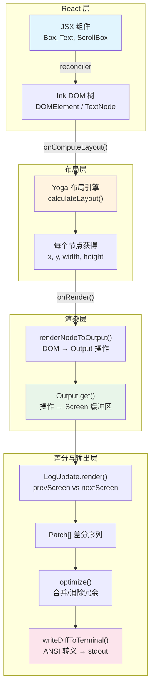

# 第 21 篇：Ink 框架深度定制 — 在终端中运行 React

> 本篇深入 Claude Code 的 forked Ink 框架（`ink/` 目录，约 90 个文件），揭示如何在终端中构建一个完整的 React 渲染引擎：从自定义 Reconciler、Yoga 布局、双缓冲渲染管线，到虚拟滚动、鼠标事件、文本选择等深度定制。

## 为什么要 Fork Ink？

Ink 是一个开源框架，让你在终端中使用 React 组件编写 UI。官方 Ink 适合简单的 CLI 工具 —— 但 Claude Code 不是简单的 CLI。它需要：

- **全屏模式**：Alt Screen 下的完整 UI，不是"追加式"输出
- **虚拟滚动**：对话历史可能有上千行，不能全部渲染
- **鼠标交互**：点击、拖拽选择文本、滚轮滚动
- **60fps 渲染**：流式输出时每 16ms 刷新一帧，不能闪烁
- **IME 支持**：CJK 输入法需要物理光标精确定位

官方 Ink 不支持这些。Claude Code 团队 fork 了 Ink 并进行了大量深度定制，最终形成了一个功能完备的终端 React 渲染引擎。

---

## 一、架构全景：从 React 到终端像素

整个渲染管线可以用以下架构图概括：



### 核心流程简述

1. **React Reconciler** 将 JSX 变更映射到 Ink DOM 树（`DOMElement`/`TextNode`）
2. **Yoga** 对 DOM 树执行 Flexbox 布局计算
3. **renderNodeToOutput** 遍历 DOM 树，生成 write/blit/clip 操作
4. **Output.get()** 将操作应用到 Screen 缓冲区（二维字符网格）
5. **LogUpdate.render()** 对比前后帧的 Screen，生成最小 Patch 序列
6. **optimizer** 合并冗余 Patch
7. 最终序列化为 ANSI 转义码写入 stdout

---

## 二、Reconciler：React 与终端 DOM 的桥梁

### 2.1 自定义 React Reconciler

`reconciler.ts` 使用 `react-reconciler` 库创建了一个自定义的 React Reconciler —— 这与 `react-dom` 使用同样的底层机制，只是目标不是浏览器 DOM，而是 Ink 的终端 DOM。

```typescript
// ink/reconciler.ts:224-239
const reconciler = createReconciler<
  ElementNames,    // 'ink-root' | 'ink-box' | 'ink-text' | ...
  Props,           // Record<string, unknown>
  DOMElement,      // Ink 的 DOM 元素
  DOMElement,      // Container 类型
  TextNode,        // 文本节点
  ...
>({
  getRootHostContext: () => ({ isInsideText: false }),
  // ...
})
```

**关键概念**：Reconciler 定义了 React 如何操作"宿主环境"。在浏览器中，宿主环境是 HTML DOM；在 Ink 中，宿主环境是一套内存中的轻量级 DOM 结构。

### 2.2 Ink DOM：7 种元素类型

Ink 定义了自己的 DOM 元素体系（`dom.ts:18-27`）：

```typescript
// ink/dom.ts:19-27
export type ElementNames =
  | 'ink-root'         // 根节点
  | 'ink-box'          // 容器（等价于 HTML div）
  | 'ink-text'         // 文本容器
  | 'ink-virtual-text' // 嵌套文本（Text 内的 Text）
  | 'ink-link'         // 超链接
  | 'ink-progress'     // 进度条
  | 'ink-raw-ansi'     // 预渲染 ANSI 内容
```

每个 `DOMElement` 携带丰富的状态字段（`dom.ts:31-91`）：

```typescript
export type DOMElement = {
  nodeName: ElementNames
  attributes: Record<string, DOMNodeAttribute>
  childNodes: DOMNode[]
  style: Styles
  yogaNode?: LayoutNode       // Yoga 布局节点
  dirty: boolean              // 是否需要重新渲染
  isHidden?: boolean          // 隐藏状态
  _eventHandlers?: Record<string, unknown>  // 事件处理器

  // 滚动状态（overflow: scroll）
  scrollTop?: number
  pendingScrollDelta?: number  // 累积未消耗的滚动增量
  scrollHeight?: number
  scrollViewportHeight?: number
  stickyScroll?: boolean       // 自动吸底

  // 焦点管理
  focusManager?: FocusManager  // 仅 ink-root 拥有
  debugOwnerChain?: string[]   // 调试用组件栈
} & InkNode
```

### 2.3 脏标记与渲染调度

当 React 更新 props 或子节点时，Reconciler 调用 `markDirty()` 向上冒泡标记整条祖先链为脏：

```typescript
// ink/dom.ts:393-413
export const markDirty = (node?: DOMNode): void => {
  let current: DOMNode | undefined = node
  let markedYoga = false

  while (current) {
    if (current.nodeName !== '#text') {
      (current as DOMElement).dirty = true
      // 仅对叶子节点（ink-text / ink-raw-ansi）标记 yoga dirty
      if (!markedYoga &&
        (current.nodeName === 'ink-text' || current.nodeName === 'ink-raw-ansi') &&
        current.yogaNode) {
        current.yogaNode.markDirty()
        markedYoga = true
      }
    }
    current = current.parentNode
  }
}
```

**设计要点**：
- DOM 级 `dirty` 冒泡是 O(depth)，非常廉价
- Yoga `markDirty()` 仅在叶子文本节点上调用 —— 因为只有文本节点有 `measureFunc`，需要重新测量
- 属性变更时做 shallow equal 检查避免无谓的 dirty（`setStyle`、`setTextStyles`、`setAttribute` 都有守卫）

### 2.4 React 19 适配

Reconciler 包含了对 React 19 的适配（`reconciler.ts:425-506`）：

```typescript
// React 19: commitUpdate 直接接收新旧 props，不再用 updatePayload
commitUpdate(node, _type, oldProps, newProps): void {
  const props = diff(oldProps, newProps)
  const style = diff(oldProps['style'], newProps['style'])
  // ... 应用差异
},

// React 19 必需方法
maySuspendCommit: () => false,
preloadInstance: () => true,
startSuspendingCommit: () => {},
suspendInstance: () => {},
waitForCommitToBeReady: () => null,
```

---

## 三、布局引擎：Yoga 的抽象与适配

### 3.1 LayoutNode 抽象层

Claude Code 没有直接使用 Yoga API，而是定义了一个 `LayoutNode` 接口作为抽象层（`layout/node.ts:93-152`）：

```typescript
// ink/layout/node.ts:93-152
export type LayoutNode = {
  // 树操作
  insertChild(child: LayoutNode, index: number): void
  removeChild(child: LayoutNode): void
  getChildCount(): number

  // 布局计算
  calculateLayout(width?: number, height?: number): void
  setMeasureFunc(fn: LayoutMeasureFunc): void
  markDirty(): void

  // 读取布局结果
  getComputedLeft(): number
  getComputedTop(): number
  getComputedWidth(): number
  getComputedHeight(): number

  // 样式设置（Flexbox 全套）
  setWidth(value: number): void
  setFlexDirection(dir: LayoutFlexDirection): void
  setDisplay(display: LayoutDisplay): void
  setOverflow(overflow: LayoutOverflow): void
  // ... 40+ 方法
}
```

`layout/yoga.ts` 中的 `YogaLayoutNode` 是这个接口的唯一实现，将抽象类型映射到真实的 Yoga 常量：

```typescript
// ink/layout/yoga.ts:54-66
export class YogaLayoutNode implements LayoutNode {
  readonly yoga: YogaNode

  insertChild(child: LayoutNode, index: number): void {
    this.yoga.insertChild((child as YogaLayoutNode).yoga, index)
  }
  // ...
}
```

**为什么要这层抽象？** Yoga 的 API 是基于 WASM 的 C++ 绑定，直接引用会导致类型系统和 native 绑定紧耦合。抽象层将布局语义与 native 绑定解耦 —— 可能的设计意图包括让布局引擎可替换和简化测试，但源码中目前只有 `YogaLayoutNode` 一个实现。

### 3.2 文本测量

Yoga 的 `measureFunc` 是布局的关键 —— 它告诉 Yoga 一个文本节点在给定宽度约束下的实际尺寸：

```typescript
// ink/dom.ts:332-374
const measureTextNode = function (
  node: DOMNode,
  width: number,
  widthMode: LayoutMeasureMode,
): { width: number; height: number } {
  const rawText = node.nodeName === '#text' ? node.nodeValue : squashTextNodes(node)
  const text = expandTabs(rawText)
  const dimensions = measureText(text, width)

  // 文本宽度小于容器 → 无需换行
  if (dimensions.width <= width) return dimensions

  // Undefined 模式 + 含换行 → 用自然宽度（避免高度膨胀）
  if (text.includes('\n') && widthMode === LayoutMeasureMode.Undefined) {
    return measureText(text, Math.max(width, dimensions.width))
  }

  // 需要换行
  const textWrap = node.style?.textWrap ?? 'wrap'
  const wrappedText = wrapText(text, width, textWrap)
  return measureText(wrappedText, width)
}
```

### 3.3 布局计算时机

布局计算发生在 React 的 commit 阶段（`reconciler.ts:247-258`），由 `resetAfterCommit` 触发：

```typescript
// ink/ink.tsx:239-258 (onComputeLayout callback)
this.rootNode.onComputeLayout = () => {
  if (this.isUnmounted) return
  if (this.rootNode.yogaNode) {
    const t0 = performance.now()
    this.rootNode.yogaNode.setWidth(this.terminalColumns)
    this.rootNode.yogaNode.calculateLayout(this.terminalColumns)
    const ms = performance.now() - t0
    recordYogaMs(ms)
  }
}
```

**时序**：React commit → `resetAfterCommit` → `onComputeLayout()`（Yoga 布局）→ `onRender()`（渲染到终端）。这保证 `useLayoutEffect` 可以读到最新布局。

---

## 四、渲染管线：从 DOM 到 Screen 缓冲区

### 4.1 双缓冲 + 帧节流

`Ink` 类（`ink.tsx`）维护两个 Frame 对象实现**双缓冲**：

```typescript
// ink/ink.tsx:99-100
private frontFrame: Frame    // 当前显示帧
private backFrame: Frame     // 后台缓冲帧
```

渲染通过 `throttle` 限制到 ~60fps（16ms 间隔）：

```typescript
// ink/ink.tsx:212-216 (scheduleRender)
const deferredRender = (): void => queueMicrotask(this.onRender)
this.scheduleRender = throttle(deferredRender, FRAME_INTERVAL_MS, {
  leading: true,   // 第一次变更立即触发
  trailing: true   // 间隔结束后再触发一次
})
```

**微任务延迟**的设计原因：`scheduleRender` 从 Reconciler 的 `resetAfterCommit` 调用，此时 React 的 layout effects 还没执行。使用 `queueMicrotask` 延迟到 layout effects 完成后再渲染，确保 `useDeclaredCursor`（IME 光标定位）等 hook 的数据在同一帧内生效。

### 4.2 Screen：二维字符网格

Screen 是终端的虚拟帧缓冲区。它使用三个共享 Pool 实现内存高效的字符/样式/超链接存储（`screen.ts`）：

```typescript
// ink/screen.ts:21-53
export class CharPool {
  private strings: string[] = [' ', '']  // 0=空格, 1=空
  private ascii: Int32Array = initCharAscii() // ASCII 快速查找

  intern(char: string): number {
    // ASCII 快速路径：直接数组查找而非 Map.get
    if (char.length === 1) {
      const code = char.charCodeAt(0)
      if (code < 128) {
        const cached = this.ascii[code]!
        if (cached !== -1) return cached
        // ...
      }
    }
    // ...
  }
}
```

**Pool 设计要点**：
- `CharPool`：字符串 → 整数 ID 映射，ASCII 字符直接用 Int32Array 索引（O(1)）
- `StylePool`：ANSI 样式序列的 interning，`transition(fromId, toId)` 缓存样式转换字符串
- `HyperlinkPool`：OSC 8 超链接 URL 的 interning。`Ink.onRender()` 每 5 分钟调用 `resetPools()` 同时重置 CharPool 和 HyperlinkPool，防止长会话内存无限增长（`ink.tsx:597-603`）

### 4.3 Output：操作收集器

`Output`（`output.ts`）负责将 DOM 树遍历结果转化为 Screen 缓冲区。它支持 7 种操作：

| 操作 | 说明 |
|------|------|
| `write` | 在 (x, y) 写入文本 |
| `blit` | 从上一帧 Screen 块拷贝未变化区域 |
| `shift` | 滚动操作：行移位（配合 DECSTBM） |
| `clip` / `unclip` | 裁剪区域栈（overflow: hidden/scroll） |
| `clear` | 清除区域（节点移除/缩小） |
| `noSelect` | 标记不可选择区域（行号、diff 标记） |

`Output.get()` 按顺序执行这些操作，最终得到一个完整的 Screen 缓冲区。其中 `writeLineToScreen`（`output.ts:633-797`）是热路径，被专门提取为独立函数以优化 JIT 编译：

```typescript
// ink/output.ts:633-651
function writeLineToScreen(
  screen, line, x, y, screenWidth, stylePool, charCache,
): number {
  // charCache 缓存：同一行的 tokenize + grapheme clustering 结果跨帧复用
  let characters = charCache.get(line)
  if (!characters) {
    characters = reorderBidi(
      styledCharsWithGraphemeClustering(
        styledCharsFromTokens(tokenize(line)),
        stylePool,
      ),
    )
    charCache.set(line, characters)
  }
  // ... 逐字符写入 Screen
}
```

**charCache** 是关键优化：流式输出时大部分行不会变化，缓存 tokenize + grapheme 分簇结果避免每帧重复计算。

### 4.4 Blit 优化：未变化子树的快速路径

`renderNodeToOutput`（`render-node-to-output.ts`）在遍历 DOM 树时，对未变化的子树执行 **blit**（块拷贝）而非重新渲染：

如果一个节点的 `dirty` 标记为 false、它的布局位置没有偏移、且上一帧的 Screen 缓冲可信（`prevScreen` 存在），就直接将上一帧对应区域的 Screen 数据块拷贝到新 Screen —— O(cells) 的 TypedArray 复制代替 O(nodes) 的 DOM 遍历 + 文本测量。

Output 内部会追踪 blit 与 write 的比例：

```typescript
// ink/output.ts:523-528
const totalCells = blitCells + writeCells
if (totalCells > 1000 && writeCells > blitCells) {
  logForDebugging(
    `High write ratio: blit=${blitCells}, write=${writeCells} ...`,
  )
}
```

**Layout Shift 检测**：一个全局标记 `layoutShifted` 追踪是否有节点的布局位置/尺寸与缓存不同。稳态帧（spinner 旋转、时钟跳动、文本流入固定高度容器）不触发 layout shift，此时窄 damage 范围使 diff 只比较变化区域，而非全屏。

---

## 五、差分引擎：最小终端更新

### 5.1 LogUpdate：Screen Diff

`LogUpdate.render()`（`log-update.ts:123-467`）是差分引擎的核心，对比前后帧的 Screen 缓冲区，生成最小更新指令（Patch 序列）：

```typescript
// ink/log-update.ts:123-131
render(prev: Frame, next: Frame, altScreen = false, decstbmSafe = true): Diff {
  if (!this.options.isTTY) {
    return this.renderFullFrame(next)  // 非 TTY：全量输出
  }
  // ...
}
```

差分使用 `diffEach()` 逐 cell 比较两个 Screen，只为变化的 cell 生成光标移动 + 字符写入指令。核心优化包括：

1. **Damage Region 限定**：只在 `screen.damage` 矩形内比较 cell
2. **SpacerTail/SpacerHead 跳过**：宽字符（CJK、emoji）的第二列自动跳过
3. **空 cell 跳过**：空 cell 不覆盖已有内容时跳过（避免尾部空格导致换行）
4. **样式转换缓存**：`StylePool.transition(fromId, toId)` 返回预计算的 ANSI 转义字符串

### 5.2 DECSTBM 硬件滚动优化

当 ScrollBox 的 `scrollTop` 变化时，log-update 使用终端的硬件滚动区域（DECSTBM）：

```typescript
// ink/log-update.ts:166-185
if (altScreen && next.scrollHint && decstbmSafe) {
  const { top, bottom, delta } = next.scrollHint
  // 用 DECSTBM + CSI S/T 硬件滚动替代全区域重写
  shiftRows(prev.screen, top, bottom, delta)
  scrollPatch = [{
    type: 'stdout',
    content: setScrollRegion(top+1, bottom+1) +
      (delta > 0 ? csiScrollUp(delta) : csiScrollDown(-delta)) +
      RESET_SCROLL_REGION + CURSOR_HOME,
  }]
}
```

**约束**：`decstbmSafe` 参数控制是否使用此优化。tmux 不支持 DEC 2026 同步输出，在 tmux 下 DECSTBM 序列的中间状态会被渲染出来（内容已滚动但边缘行未更新），造成视觉跳动。此时 fallback 到逐行重写。

### 5.3 Patch 优化器

`optimizer.ts` 对 Patch 序列做单遍优化：

```typescript
// ink/optimizer.ts:16-93
export function optimize(diff: Diff): Diff {
  // 8 条优化规则，单遍执行：
  // 1. 移除空 stdout 内容
  // 2. 合并连续 cursorMove
  // 3. 折叠连续 cursorTo（只保留最后一个）
  // 4. 移除 (0,0) 的 cursorMove
  // 5. 拼接相邻 style 转换
  // 6. 去重连续相同 URI 的 hyperlink
  // 7. 抵消 cursorHide/cursorShow 对
  // 8. 移除 count=0 的 clear
}
```

---

## 六、深度定制：超越原版 Ink 的扩展

### 6.1 虚拟滚动（ScrollBox）

`ScrollBox`（`components/ScrollBox.tsx`）是最重要的自定义组件，实现了类似浏览器 `overflow: scroll` 的终端滚动：

```typescript
// ink/components/ScrollBox.tsx:82-87
function ScrollBox({ children, ref, stickyScroll, ...style }: ...) {
  const domRef = useRef<DOMElement>(null)
  // scrollTo/scrollBy 绕过 React：直接修改 DOM 节点的 scrollTop，
  // 标记 dirty，调用 scheduleRender —— 零 reconciler 开销
  // ...
}
```

**关键设计**：

- **绕过 React State**：`scrollTo`/`scrollBy` 直接修改 DOM 节点的 `scrollTop` 属性，通过 `markDirty()` + `scheduleRenderFrom()` 触发 Ink 重渲染。不走 `setState` → reconcile → commit 的完整 React 流程，避免每次滚轮事件的 reconciler 开销。
- **微任务合并**：多次 `scrollBy` 在同一个 `discreteUpdates` 批次中累积 `pendingScrollDelta`，然后通过 `queueMicrotask` 合并为一次 `scheduleRender`。
- **分帧 Drain**：快速滚轮不会一次跳到目标位置，而是每帧只消耗部分 `pendingScrollDelta`，产生平滑滚动效果。实际的 drain 策略分为两套（`render-node-to-output.ts:106-176`）：**xterm.js 终端**（VS Code 等）使用自适应阶梯 drain —— 小量（≤5 行）一次消耗完，中等量每帧 2 行，大量（≥12）每帧 3 行，超过 30 行则 snap 多余部分；**原生终端**（iTerm2/Ghostty 等）使用 proportional drain —— 每帧消耗 `max(4, floor(abs*3/4))` 行，大量滚动按对数帧数追赶。两套策略都将单帧最大消耗限制在 `innerHeight - 1` 行以内，确保 DECSTBM 硬件滚动快速路径生效。
- **Sticky Scroll**：`stickyScroll` 属性自动吸底，新内容增长时自动跟随 —— 这正是流式 AI 输出场景的核心需求。
- **Render-time Clamp**：`scrollClampMin`/`scrollClampMax` 防止快速 `scrollTo` 超出已挂载子节点的范围（因为 React 的异步 re-render 可能尚未挂载新节点），避免出现空白屏。

### 6.2 事件系统：两条派发路径

Ink 的事件系统有**两条不同的派发路径**，服务于不同类型的事件：

**路径一：Dispatcher（键盘、焦点事件）**

`events/dispatcher.ts` 实现了 DOM Level 3 风格的 capture/bubble 两阶段派发模型，目前用于**键盘事件**和**焦点事件**。`ink.tsx:1272` 中键盘按键通过 `dispatcher.dispatchDiscrete(target, event)` 派发，焦点切换同样走此路径（`ink.tsx:234`）。

```typescript
// ink/events/dispatcher.ts:46-79
function collectListeners(target: EventTarget, event: TerminalEvent): DispatchListener[] {
  const listeners: DispatchListener[] = []
  let node: EventTarget | undefined = target
  while (node) {
    const isTarget = node === target
    const captureHandler = getHandler(node, event.type, true)
    const bubbleHandler  = getHandler(node, event.type, false)
    if (captureHandler) {
      listeners.unshift({ node, handler: captureHandler, phase: isTarget ? 'at_target' : 'capturing' })
    }
    if (bubbleHandler && (event.bubbles || isTarget)) {
      listeners.push({ node, handler: bubbleHandler, phase: isTarget ? 'at_target' : 'bubbling' })
    }
    node = node.parentNode
  }
  return listeners
}
```

Dispatcher 还负责将事件类型映射到 React Scheduler 优先级（`dispatcher.ts:122-138`），影响 React 状态更新的调度：

| 事件类型 | React 优先级 |
|---------|------------|
| keydown, keyup, click, focus, blur, paste | `DiscreteEventPriority`（同步） |
| resize, scroll, mousemove | `ContinuousEventPriority`（可合并） |
| 其他 | `DefaultEventPriority` |

**路径二：dispatchClick / dispatchHover（鼠标事件）**

鼠标点击走的是 `hit-test.ts` 中的 `dispatchClick()`，它**不经过 Dispatcher 的 capture/bubble 机制**，而是直接沿 `parentNode` 链向上冒泡，查找 `_eventHandlers.onClick` 并调用（`hit-test.ts:49-89`）。鼠标 hover 事件同样走独立的 `dispatchHover()`，基于 enter/leave 差分模型而非冒泡。

### 6.3 Hit Test 与鼠标交互

`hit-test.ts` 实现了点击坐标到 DOM 节点的映射：

```typescript
// ink/hit-test.ts:18-41
export function hitTest(node: DOMElement, col: number, row: number): DOMElement | null {
  const rect = nodeCache.get(node)
  if (!rect) return null
  if (col < rect.x || col >= rect.x + rect.width ||
      row < rect.y || row >= rect.y + rect.height) {
    return null
  }
  // 后序遍历：后绘制的节点在上层，优先命中
  for (let i = node.childNodes.length - 1; i >= 0; i--) {
    const child = node.childNodes[i]!
    if (child.nodeName === '#text') continue
    const hit = hitTest(child, col, row)
    if (hit) return hit
  }
  return node
}
```

利用 `nodeCache`（每帧 renderNodeToOutput 写入的布局缓存）做 AABB 碰撞检测，子节点逆序遍历保证后绘制的节点（视觉上在前）优先命中。

### 6.4 文本选择

`selection.ts` 实现了完整的终端文本选择系统，包括 anchor + focus 双端点模型、拖拽选择、双击选词、三击选行、以及跨 scroll 的选区保持：

```typescript
// ink/selection.ts:19-56
export type SelectionState = {
  anchor: Point | null           // 拖拽起点
  focus: Point | null            // 当前拖拽位置
  isDragging: boolean
  anchorSpan: { lo: Point; hi: Point; kind: 'word' | 'line' } | null
  scrolledOffAbove: string[]     // 滚出视口上方的已选文本
  scrolledOffBelow: string[]     // 滚出视口下方的已选文本
  virtualAnchorRow?: number      // 用于 scroll 后恢复
  virtualFocusRow?: number
}
```

选区作为样式覆盖（反色）直接写入 Screen 缓冲区，被 diff 引擎作为普通 cell 变化处理 —— 没有独立的覆盖层。

### 6.5 Terminal Querier：无超时终端能力探测

`terminal-querier.ts` 实现了一个优雅的终端能力查询系统，**完全不依赖超时**：

```typescript
// ink/terminal-querier.ts:128-212
export class TerminalQuerier {
  private queue: Pending[] = []

  send<T>(query: TerminalQuery<T>): Promise<T | undefined> {
    return new Promise(resolve => {
      this.queue.push({ kind: 'query', match: query.match, resolve })
      this.stdout.write(query.request)
    })
  }

  flush(): Promise<void> {
    return new Promise(resolve => {
      this.queue.push({ kind: 'sentinel', resolve })
      this.stdout.write(SENTINEL)  // DA1 查询，所有终端都会响应
    })
  }
}
```

**核心思想**：每批查询后发送一个 DA1（Primary Device Attributes）作为哨兵。DA1 是 VT100 以来所有终端都支持的查询，且终端按顺序响应。如果某个查询的响应在 DA1 之前到达，说明终端支持它；如果 DA1 先到达，说明终端忽略了该查询（不支持）。

这比"等 200ms 超时"优雅得多 —— 它精确且无等待。

### 6.6 焦点管理

`focus.ts` 实现了类浏览器的焦点系统（`FocusManager`）：

```typescript
// ink/focus.ts:15-132
export class FocusManager {
  activeElement: DOMElement | null = null
  private focusStack: DOMElement[] = []  // 最大 32 层

  focus(node: DOMElement): void {
    const previous = this.activeElement
    if (previous) {
      // 去重后入栈，支持 Tab 循环时不无限增长
      const idx = this.focusStack.indexOf(previous)
      if (idx !== -1) this.focusStack.splice(idx, 1)
      this.focusStack.push(previous)
      this.dispatchFocusEvent(previous, new FocusEvent('blur', node))
    }
    this.activeElement = node
    this.dispatchFocusEvent(node, new FocusEvent('focus', previous))
  }

  handleNodeRemoved(node: DOMElement, root: DOMElement): void {
    // 节点移除时自动从焦点栈中恢复上一个焦点
    // ...
  }
}
```

**亮点**：焦点栈 + 自动恢复。当持有焦点的节点被移除时，自动从栈中弹出最近一个仍在树中的节点作为新焦点 —— 这在对话界面中（工具结果出现/消失、权限对话框关闭）至关重要。

---

## 七、性能优化：在终端中追求 60fps

### 7.1 line-width-cache

流式输出时，已完成的行是不可变的。`line-width-cache.ts` 缓存每行的 `stringWidth` 计算结果，避免每帧对数百行不变文本重复测量：

```typescript
// ink/line-width-cache.ts:1-24
const cache = new Map<string, number>()
const MAX_CACHE_SIZE = 4096

export function lineWidth(line: string): number {
  const cached = cache.get(line)
  if (cached !== undefined) return cached
  const width = stringWidth(line)
  if (cache.size >= MAX_CACHE_SIZE) cache.clear()  // 全清，下一帧重建
  cache.set(line, width)
  return width
}
```

**~50x 减少** `stringWidth` 调用量（据注释说明）。

### 7.2 node-cache

`node-cache.ts` 用 WeakMap 缓存每个 DOM 节点的布局矩形：

```typescript
// ink/node-cache.ts:10-18
export type CachedLayout = {
  x: number; y: number; width: number; height: number;
  top?: number  // yoga getComputedTop()，用于 ScrollBox viewport culling
}
export const nodeCache = new WeakMap<DOMElement, CachedLayout>()
```

用途：
1. **Blit 判定**：对比缓存位置与当前位置决定是否可以 blit
2. **Hit Test**：点击坐标查找时 O(1) 获取节点矩形
3. **光标定位**：`useDeclaredCursor` 读取节点矩形计算物理光标位置

### 7.3 帧计时与调试工具

`FrameEvent` 提供细粒度的帧性能数据（`frame.ts:38-71`）：

```typescript
export type FrameEvent = {
  durationMs: number
  phases?: {
    renderer: number    // DOM → Yoga → Screen
    diff: number        // Screen → Patch[]
    optimize: number    // Patch 合并
    write: number       // Patch → stdout
    yoga: number        // Yoga calculateLayout
    yogaVisited: number // layoutNode 调用次数
    yogaMeasured: number // measureFunc 调用次数（昂贵部分）
    yogaCacheHits: number // 缓存命中次数
    yogaLive: number    // 活跃 Yoga 节点数（增长=泄漏）
  }
  flickers: Array<{ reason: FlickerReason; ... }>
}
```

环境变量 `CLAUDE_CODE_COMMIT_LOG` 启用 commit 级日志：gap > 30ms、reconcile > 20ms、creates > 50 时自动记录，方便定位帧卡顿来源。

### 7.4 Sync Output（DEC 2026）

支持 DEC 2026 同步输出协议的终端（iTerm2、WezTerm、Ghostty、VS Code 等）可以将整帧更新包裹在 BSU/ESU 块中，终端在 ESU 到达时原子性地刷新显示，完全消除部分更新导致的闪烁。

`SYNC_OUTPUT_SUPPORTED` 是在**模块加载时同步计算**的（`terminal.ts:183`），使用 `isSynchronizedOutputSupported()` 基于环境变量做启发式判断（`terminal.ts:70-118`）—— 检查 `TERM_PROGRAM`、`TERM`、`KITTY_WINDOW_ID`、`WT_SESSION`、`VTE_VERSION` 等环境变量来判定终端类型，tmux 下直接返回 false（tmux 不实现 DEC 2026，BSU/ESU 透传到外层终端但 tmux 已经破坏了原子性）。这是一个纯同步的判断，**不涉及** TerminalQuerier 的异步查询。

```typescript
// ink/terminal.ts:181-183
// Computed once at module load — terminal capabilities don't change mid-session.
export const SYNC_OUTPUT_SUPPORTED = isSynchronizedOutputSupported()
```

TerminalQuerier 的 DECRQM 查询机制用于探测其他终端能力（如 Kitty keyboard protocol），但 DEC 2026 的支持判断走的是环境变量启发式路径。

---

## 八、可迁移的设计模式

### 模式 1：Pool + 双缓冲渲染管线

将渲染分为"构建缓冲区"和"差分输出"两步。缓冲区中使用 intern pool（CharPool、StylePool）将频繁出现的字符/样式映射为整数 ID，差分阶段只需比较 ID 而非字符串。双缓冲交换确保前台显示帧不被后台计算污染。

**适用场景**：任何需要高频率增量更新的 UI 系统（终端、游戏、Canvas 渲染器）。

### 模式 2：绕过 React 的命令式快速路径

对于高频操作（滚轮滚动），直接修改 DOM 属性 + `markDirty()` + `scheduleRender()`，绕过 React 的 `setState` → reconcile → commit 流程。React 管声明式 UI 结构，命令式路径管帧率敏感的状态更新。

**适用场景**：React 应用中需要 60fps 的交互（动画、拖拽、滚动），Canvas/WebGL 集成。

### 模式 3：哨兵式能力探测

用已知必有响应的查询（DA1）作为哨兵，将"等超时"变为"等确认"。多个查询批量发送，一个哨兵统一裁决。精确、无等待、无误判。

**适用场景**：任何需要探测对端能力的协议（终端、SMTP EHLO、HTTP 特性检测）。

---

## 下一篇预告

[第 22 篇：设计系统 — 终端 UI 的组件化实践](./22-设计系统.md)

我们将深入 `components/design-system/` 目录，看看 `ThemedText`、`Dialog`、`Pane`、`ProgressBar` 等组件如何构成一个完整的终端设计系统，以及每个工具的 `renderToolUseMessage` / `renderToolResultMessage` 等 UI 协议如何实现。

---

*全部内容请关注 https://github.com/luyao618/Claude-Code-Source-Study (求一颗免费的小星星)*
