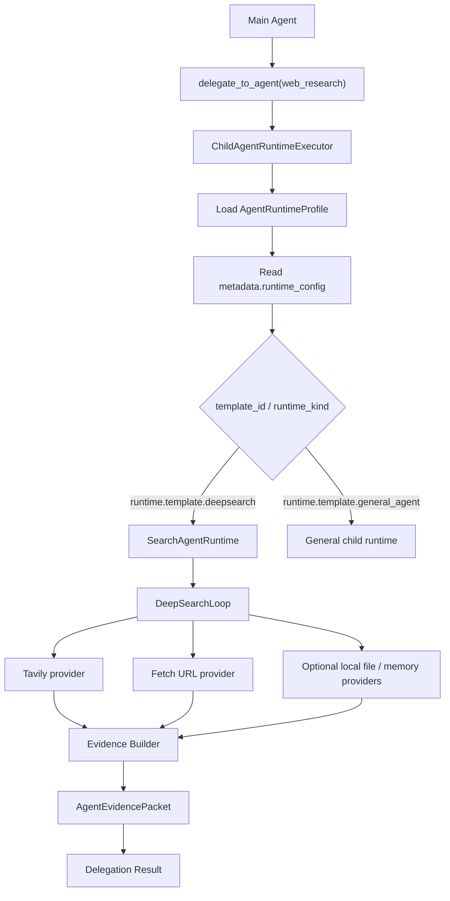

# 通用运行配置装配与 DeepSearch Runtime 设计书（2026-05-24）

## 1. 结论先行

本项目的“配置”不是 Search Agent 专属配置页，而是 Orchestration / Agent Assembly 中的通用运行配置能力。

正确链路是：

```text
前端通用运行配置页
  -> 保存到 AgentRuntimeProfile.metadata.runtime_config
  -> 主 Agent 通过 delegate_to_agent 调用子 Agent
  -> 子 Agent Runtime 读取 runtime_config
  -> 按 template_id / runtime_kind / runtime_mode 装配具体 runtime loop
  -> DeepSearch 只是 runtime_config 的一个模板实例
```

因此，DeepSearch 不应绕过前端直接写配置，也不应在前端做 Search 专属管理页。Search Agent 只消费通用配置页保存的内容。

## 2. 当前代码事实

### 2.1 前端已有 Agent 装配入口

相关文件：

```text
frontend/src/components/workspace/views/OrchestrationView.tsx
frontend/src/components/workspace/views/orchestration/OrchestrationAgentConfigWorkbenches.tsx
```

当前已经增加通用 “运行配置” tab。它的保存落点是：

```text
AgentRuntimeProfile.metadata.runtime_config
```

这符合目标方向。

### 2.2 后端当前仍未消费 runtime_config

当前 Search 子 Agent 路径仍然是单跳 Tavily：

```text
backend/runtime/execution/child_agent_runtime_executor.py

delegate_to_agent(web_research)
  -> ChildAgentRuntimeExecutor._run_web_research()
  -> _run_web_search()
  -> capability_system/units/tools/tavily_search.py
  -> build_agent_evidence_packet_from_web_payload()
```

所以必须精确说明：前端现在能保存通用运行配置，但 DeepSearch 行为尚未真正生效。后端需要补 runtime 消费层。

### 2.3 证据交付物已有基础

相关文件：

```text
backend/evidence/agent_evidence_packet.py
```

`AgentEvidencePacket` 已经适合作为 Search Agent 的标准输出。DeepSearch 不应另造结果格式，应扩展证据构建过程，把多轮查询、来源抓取、冲突、未知项、限制和预算使用写进证据包或 diagnostics。

## 3. 通用配置模型

唯一配置源：

```json
{
  "runtime_config": {
    "template_id": "runtime.template.deepsearch",
    "runtime_kind": "search_agent",
    "runtime_mode": "deepsearch",
    "max_iterations": 4,
    "max_tool_calls": 14,
    "max_sources": 12,
    "evidence_packet_required": true,
    "stop_policy": "enough_evidence_or_budget_exhausted",
    "search": {
      "runtime_mode": "deepsearch",
      "search_sources": ["web"],
      "web_provider": "tavily",
      "allow_fetch_url": true,
      "allow_local_files": false,
      "allow_memory_read": false,
      "max_iterations": 4,
      "max_queries": 6,
      "max_fetches": 8,
      "max_sources": 12,
      "search_depth": "advanced",
      "include_raw_content": false,
      "prefer_primary_sources": true,
      "freshness_required_by_default": false,
      "evidence_packet_required": true,
      "stop_policy": "enough_evidence_or_budget_exhausted"
    }
  }
}
```

禁止再引入并行配置源：

```text
metadata.search_runtime
Search Agent 专属配置页
绕过前端的手工 JSON 写入
TaskGraph 节点私有 DeepSearch 配置
```

字段优先级必须固定：

```text
运行时分派只读取 AgentRuntimeProfile.metadata.runtime_config.template_id。
AgentRuntimeProfile.metadata.runtime_template_id 是既有 catalog / 历史展示字段，不能作为 DeepSearch runtime resolver 的主判定源。
如果后续需要兼容展示，可以由保存层把 runtime_config.template_id 镜像到 runtime_template_id；但执行层仍以 runtime_config.template_id 为准。
```

通用配置 schema 必须同时在前端和后端落地：

```text
前端：runtime config helper 负责默认值、模板预设、权限推导和非法组合诊断。
后端：SearchRuntimeConfig / GenericRuntimeConfig 模型负责同一套默认值、clamp 规则和非法值拒绝。
禁止只在组件内部维护一份临时 TypeScript 类型，然后让后端靠 dict 猜字段。
```

## 4. 前端职责

通用运行配置页负责四件事：

1. 管理 `metadata.runtime_config`。
2. 提供 runtime template 预设，例如 `runtime.template.general_agent`、`runtime.template.deepsearch`。
3. 根据模板推导所需权限，并写入 `allowed_operations` / 清理冲突的 `blocked_operations`。
4. 诊断“配置已保存”和“运行时已接入”之间的差异。

DeepSearch 在前端只表现为通用配置页中的一个模板参数区：

```text
通用运行配置
  template_id
  runtime_kind
  runtime_mode
  max_iterations
  max_tool_calls
  max_sources
  evidence_packet_required
  stop_policy

模板参数：runtime_config.search
  web_provider
  search_sources
  max_queries
  max_fetches
  search_depth
  source policy
```

## 5. 权限装配

DeepSearch 模板的基础权限：

```text
op.model_response
op.web_search
```

按配置可选开启：

```text
op.fetch_url     仅当 allow_fetch_url=true 且 max_fetches>0
op.search_files
op.search_text
op.read_file
op.memory_read
```

规则：

```text
runtime_config 只描述想要的 runtime 行为。
allowed_operations / blocked_operations 才是执行放行边界。
前端模板预设可以帮助补权限，但不能替代后端 OperationGate。
```

模板切换的权限策略：

```text
切换 runtime template 只修改 runtime_config，不自动删除既有 allowed_operations。
“应用模板权限预设”只补当前模板需要的权限，并移除这些权限在 blocked_operations 中的冲突项。
后续如果要收窄权限，必须提供显式动作，例如“清理模板外权限”，不能在切模板时静默删除用户已授权能力。
```

模板约束：

```text
runtime.template.general_agent:
  runtime_kind = agent_loop
  runtime_mode in ["standard"]

runtime.template.deepsearch:
  runtime_kind = search_agent
  runtime_mode in ["deepsearch", "single_search"]
```

## 6. 后端目标架构



### 6.1 Runtime Resolver

新增一个轻量 resolver，不把 Search 特例散落在 executor 里：

```text
ChildAgentRuntimeExecutor
  -> resolve_child_runtime(profile.metadata.runtime_config)
  -> runtime.run(request, profile, agent)
```

第一阶段 resolver 可以只支持：

```text
runtime.template.deepsearch -> SearchAgentRuntime
fallback -> 现有 specialist / mcp 路径
```

### 6.2 SearchAgentRuntime

建议文件：

```text
backend/runtime/search_agent_runtime/models.py
backend/runtime/search_agent_runtime/runtime.py
backend/runtime/search_agent_runtime/providers.py
backend/runtime/search_agent_runtime/evidence_builder.py
```

职责：

```text
读取 runtime_config.search
维护 DeepSearchLoop 状态
调用 Tavily / fetch_url / 后续本地搜索能力
生成 AgentEvidencePacket
返回 Delegation Result
```

它不是新的多 Agent 编排系统，也不是 TaskGraph。

## 7. DeepSearch Loop

DeepSearch 的核心是精细状态管理，而不是“多调几次搜索”。

状态模型：

```text
ResearchState
  goal
  constraints
  freshness_requirement
  query_queue
  executed_queries
  candidate_sources
  fetched_sources
  accepted_evidence
  rejected_sources
  conflicts
  unknowns
  limits
  budget
  stop_reason
```

循环：

```text
1. 从委派请求提取研究目标和约束
2. 生成或更新查询队列
3. 调用 Tavily 搜索
4. 选择候选来源
5. 按权限和预算抓取 URL
6. 抽取事实、时间、来源质量、冲突和未知项
7. 判断证据是否足够
8. 不足则生成下一轮查询
9. 停止后生成 AgentEvidencePacket
```

停止条件：

```text
核心问题已有足够证据
达到 max_iterations
达到 max_queries
达到 max_fetches
达到 max_sources
搜索服务失败
问题必须澄清
```

## 8. Agent Prompt 边界

Search Agent prompt 应写成 agent 能理解的角色职责，不写开发说明。

推荐基线：

```text
你是一名研究型检索员。

你负责把主 Agent 委派的问题拆成可验证的研究问题，并通过授权搜索源收集证据。
你不能只依据搜索摘要下结论；关键事实必须尽量追溯到原始网页、官方来源、文档、公告、数据页或可读文件。
你必须记录来源、时间、关键片段、可信度、冲突点、未知项和能力限制。

当证据不足、来源冲突、发布时间不清楚、原文不可访问或缺少一手来源时，你需要继续检索；如果预算耗尽，则明确报告限制。
你不负责替主 Agent 写最终用户回答，只交付可追踪的证据包、研究摘要和下一步建议。
```

## 9. 实施计划

### 阶段一：前端通用运行配置收口

目标：

- 运行配置 tab 对所有 Agent 可见。
- 只读写 `metadata.runtime_config`。
- DeepSearch 只是模板，不是专页。
- 模板权限预设写入 `allowed_operations`，并移除对应 blocked 冲突。

涉及文件：

```text
frontend/src/components/workspace/views/OrchestrationView.tsx
frontend/src/components/workspace/views/orchestration/OrchestrationAgentConfigWorkbenches.tsx
```

验收：

```text
npm run build 通过
代码中不再读取 metadata.search_runtime
```

### 阶段二：后端 Runtime Resolver

目标：

- ChildAgentRuntimeExecutor 读取 `profile.metadata.runtime_config`。
- 根据 `template_id` 分派到具体 runtime。
- 未配置 DeepSearch 时保持现有授权 specialist 路径。
- 明确忽略 `metadata.runtime_template_id` 对 DeepSearch runtime 的执行判定，除非它只是由保存层镜像而来。

涉及文件：

```text
backend/runtime/execution/child_agent_runtime_executor.py
backend/runtime/search_agent_runtime/models.py
backend/runtime/search_agent_runtime/runtime.py
```

验收：

```text
runtime_config.template_id=runtime.template.deepsearch 时进入 SearchAgentRuntime
只有 metadata.runtime_template_id=builtin.specialist.web_researcher 时不进入 DeepSearch，除非 runtime_config.template_id 同时存在
未配置 runtime_config 时现有 web_research 行为不被破坏
diagnostics 记录 runtime_config 与实际 runtime
```

### 阶段三：DeepSearch 第一版

目标：

- 支持 Tavily 多查询。
- 支持 fetch_url 预算。
- 支持 evidence / unknowns / limits / budget diagnostics。
- 返回 AgentEvidencePacket。

涉及文件：

```text
backend/runtime/search_agent_runtime/providers.py
backend/runtime/search_agent_runtime/evidence_builder.py
backend/evidence/agent_evidence_packet.py
```

验收：

```text
单次委派能返回多来源证据包
预算耗尽时明确 stop_reason
权限不足时失败原因明确，不偷偷降级成假 DeepSearch
```

### 阶段四：前端基础配置收敛

目标：

- 编排前端只负责配置 `AgentRuntimeProfile.metadata.runtime_config` 与运行权限。
- 不在配置页混入临时运行测试、专用旁路或 Search Agent 独立页面。
- 基础配置必须覆盖模板选择、运行预算、证据包要求、停止策略、模板所需 operation 同步和一致性诊断。

验收：

```text
配置只落到 AgentRuntimeProfile.metadata.runtime_config
模板所需权限可以从同一配置页同步到运行档案
配置页不包含 runtime-test 接口、按钮、状态或伪测试结果
```

## 10. 当前准确状态

能做到：

```text
前端可以通过通用运行配置页保存 DeepSearch 模板配置。
前端可以把模板需要的 operations 加到运行档案权限里。
配置可以落到 AgentRuntimeProfile.metadata.runtime_config。
```

暂时还不能声称做到：

```text
Search Agent 已经按 runtime_config 执行 DeepSearch。
Tavily 多轮搜索、fetch_url、来源核验已经接入 runtime。
DeepSearch 证据包已经真实由多轮 loop 生成。
```

必须补的核心代码是：

```text
后端 runtime resolver
SearchAgentRuntime
DeepSearchLoop
runtime_config -> provider / budget / evidence 的真实消费
```

## 11. 关键原则

```text
配置系统归 Orchestration / Agent Assembly。
Search Agent 只消费配置，不拥有配置页面。
DeepSearch 是 runtime template，不是多 Agent TaskGraph。
TaskGraph 只在搜索成为正式长流程阶段时介入。
AgentEvidencePacket 是证据交付标准。
权限由 allowed_operations / blocked_operations 与后端 gate 共同决定。
不能用单跳 Tavily 冒充 DeepSearch。
```
