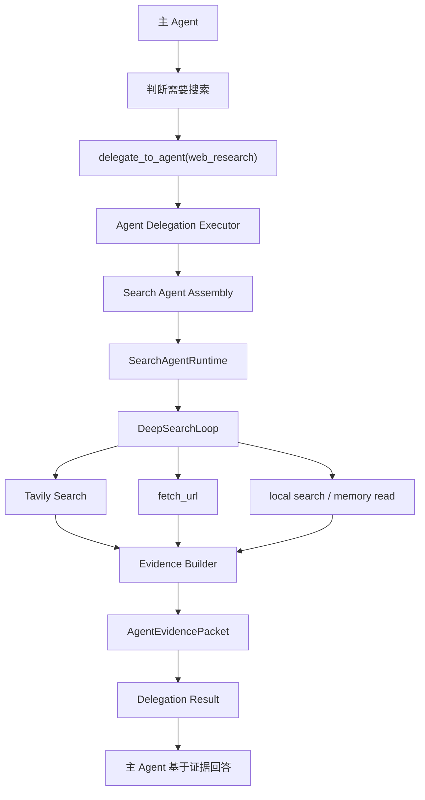

# Search Agent 装配与 DeepSearch Runtime 设计书（2026-05-24）

## 1. 修正后的问题定义

DeepSearch 不应该首先被设计成多 Agent 任务图，也不应该先绑定 TaskGraph 前端。

本项目当前最自然的路线是：

```text
主 Agent
  -> 判断需要外部/内部检索
  -> delegate_to_agent(web_research)
  -> Search 子 Agent 被装配
  -> Search 子 Agent 内部执行 DeepSearch 循环
  -> 返回 AgentEvidencePacket
  -> 主 Agent 基于证据包回答用户
```

因此，本设计书的核心对象不是任务图节点，而是一个可配置、可装配、可委派的专用 Search Agent。

TaskGraph 只在后续需要“正式研究任务流”“报告生成流程”“多阶段审核流程”时作为可选承载层，不是 DeepSearch 第一阶段的基础结构。

## 2. 当前事实源

### 2.1 现有 Search 子 Agent

系统已有内置搜索子 Agent：

```text
agent:web_researcher
projection.worker.web_evidence_researcher
web_research_agent
```

当前能力问题不在于没有 Agent，而在于它的运行方式过浅：

```text
delegate_to_agent(web_research)
  -> ChildAgentRuntimeExecutor
  -> _run_web_research
  -> _run_web_search 一次 Tavily
  -> build_agent_evidence_packet_from_web_payload
```

这更像“单跳搜索工具适配器”，还不是 mature agent 风格的 DeepSearch。

### 2.2 已有证据模型

`AgentEvidencePacket` 已经适合作为 Search 子 Agent 的标准交付物：

- facts
- evidence
- hints
- unknowns
- limits
- confidence
- freshness
- domain_payload

DeepSearch 不需要另造一套结果格式，应该扩展 evidence builder，让多轮搜索、抓取、来源核验、冲突检测都落入同一个证据包。

### 2.3 现有 Agent 装配前端

Orchestration 的 Agent 配置页已经有重构计划：

```text
frontend/src/components/workspace/views/orchestration/AGENT_ASSEMBLY_REFACTOR_PLAN.md
```

DeepSearch 第一阶段应该进入这个 Agent 装配体系，而不是 TaskGraph 编排体系。

## 3. 设计目标

### 3.1 产品目标

让用户可以在前端配置一个专用 Search Agent，使主 Agent 能稳定委派它完成深度搜索。

用户需要能配置：

- Search Agent 身份。
- Search Agent 使用哪个 projection / prompt。
- Search Agent 可用哪些搜索源。
- Tavily 配额和搜索预算。
- 是否允许 fetch URL。
- 是否允许读本地文件 / 记忆。
- 搜索循环最大轮次。
- 输出证据包格式。
- 失败和不足时如何返回限制。

### 3.2 工程目标

- 不把 DeepSearch 做成多 Agent TaskGraph。
- 不绕开 `delegate_to_agent`。
- 不让主 Agent 自己执行复杂搜索循环。
- 不让 Tavily 单次调用冒充 DeepSearch。
- 保留 `AgentEvidencePacket` 作为唯一证据交付格式。
- Search Agent 的配置进入 Agent Runtime Profile / Agent Assembly 管理。

## 4. DeepSearch 的正确层级

```text
Agent 层：
  agent:web_researcher / agent:search_researcher
  负责被主 Agent 委派。

Runtime 层：
  SearchAgentRuntime / DeepSearchLoop
  负责多轮搜索状态管理。

Tool 层：
  Tavily / fetch_url / search_text / read_file / memory_read
  负责执行单个检索或读取动作。

Evidence 层：
  AgentEvidencePacket
  负责把结果变成可追踪证据。
```

SearchRuntime 在这里不是独立大运行时，也不是 TaskGraph subruntime。它首先是 Search 子 Agent 内部的 runtime loop。

## 5. 目标调用链路



## 6. Search Agent 配置模型

建议在 `AgentRuntimeProfile.metadata` 或新增专用 search runtime config 中表达：

```json
{
  "worker_kind": "web_research",
  "delegation_kind": "web_research",
  "search_runtime": {
    "runtime_mode": "deepsearch",
    "search_sources": ["web"],
    "allow_fetch_url": true,
    "allow_local_files": false,
    "allow_memory_read": false,
    "max_iterations": 4,
    "max_queries": 6,
    "max_fetches": 8,
    "max_sources": 12,
    "freshness_required_by_default": false,
    "prefer_primary_sources": true,
    "evidence_packet_required": true,
    "stop_policy": "enough_evidence_or_budget_exhausted"
  }
}
```

第一阶段只开启：

```text
op.model_response
op.web_search
op.fetch_url
```

后续再按配置开放：

```text
op.search_text
op.search_files
op.read_file
op.memory_read
```

## 7. DeepSearch Loop 状态机

Search 子 Agent 内部需要一个明确的研究状态：

```text
ResearchState
  goal
  search_mode
  questions
  query_queue
  executed_queries
  candidate_sources
  fetched_sources
  accepted_evidence
  rejected_sources
  conflicts
  unknowns
  limits
  budget
  stop_reason
```

循环流程：

```text
1. 理解委派问题
2. 拆成可验证研究问题
3. 生成第一批查询
4. Tavily 搜索
5. 筛选来源
6. 抓取关键 URL
7. 提取证据
8. 判断缺口和冲突
9. 生成下一轮查询或停止
10. 生成 AgentEvidencePacket
```

停止条件：

- 已有足够一手/权威来源支持核心事实。
- 达到最大查询数。
- 达到最大抓取数。
- 达到最大轮次。
- 搜索源不可用。
- 问题需要用户澄清。

## 8. Search Agent Prompt

Search Agent 的 prompt 必须是角色职责提示，不是开发说明。

建议：

```text
你是一名研究型检索员。

你负责把主 Agent 委派的问题拆成可验证的研究问题，并通过授权搜索源收集证据。
你不能只依据搜索摘要下结论；关键事实必须尽量追溯到原始网页、官方来源、文档、公告、数据页或可读文件。
你必须记录来源、时间、关键片段、可信度、冲突点、未知项和能力限制。

当证据不足、来源冲突、发布时间不清楚、原文不可访问或缺少一手来源时，你需要继续检索；如果预算耗尽，则明确报告限制。
你不负责替主 Agent 写最终用户回答，只交付可追踪的证据包、研究摘要和下一步建议。
```

## 9. 前端优化范围

前端应该优先优化 Orchestration / Agent Assembly，而不是 TaskGraph。

### 9.1 Search Agent 配置页

在 Agent 配置页中，针对 `worker_kind=web_research` 或 `delegation_kind=web_research` 的 Agent 增加 Search Runtime 配置区：

```text
Search Runtime
  模式：single_search / deepsearch
  搜索源：web / local_files / memory
  Web Provider：Tavily
  查询预算：max_queries
  抓取预算：max_fetches
  循环轮次：max_iterations
  来源策略：prefer_primary_sources
  时效策略：freshness_required_by_default
  输出：AgentEvidencePacket required
```

### 9.2 Agent 能力配置

Search Agent 的能力区需要清楚显示：

- allowed_operations
- blocked_operations
- visible tools
- search policy
- Tavily provider 状态
- quota/budget 提示

### 9.3 Projection / Prompt 配置

前端需要让用户能编辑或选择 Search Agent projection：

- 网页证据研究员。
- 工作区证据检索员。
- 混合资料研究员。

第一阶段保持 `projection.worker.web_evidence_researcher`，只补配置展示和 prompt 预览。

### 9.4 调用测试区

Search Agent 配置页应该有一个轻量测试入口：

```text
测试委派问题
  输入 query
  点击 Run Search Agent
  展示：
    研究摘要
    evidence facts
    sources
    unknowns
    limits
    budget usage
```

这比在 TaskGraph 中测试更直接，也更符合“主 Agent 调用子 Agent”的真实链路。

## 10. 后端实施计划

### 阶段一：整理 Search Agent 配置

目标：

- 明确 `web_research_agent` 的 profile 配置。
- 在 profile metadata 中加入 `search_runtime` 配置。
- 保持现有单跳 Tavily 不破坏。

文件：

```text
backend/agent_system/profiles/runtime_profile_registry.py
storage/orchestration/agent_runtime_profiles.json
storage/orchestration/agents.json
backend/soul/projections/catalog.json
```

### 阶段二：替换单跳执行器为 SearchAgentRuntime

目标：

- 新增 `SearchAgentRuntime`。
- `ChildAgentRuntimeExecutor._run_web_research` 不再直接单次 Tavily，而是调用 SearchAgentRuntime。
- 第一版 DeepSearch loop 可以只支持 web + fetch_url。

文件：

```text
backend/runtime/execution/child_agent_runtime_executor.py
backend/runtime/search_agent_runtime/models.py
backend/runtime/search_agent_runtime/runtime.py
backend/runtime/search_agent_runtime/providers.py
backend/runtime/search_agent_runtime/evidence_builder.py
```

### 阶段三：EvidencePacket 增强

目标：

- 支持多轮 query 记录。
- 支持 fetched source 与 search result 区分。
- 支持 source quality / primary source / conflict。
- 保持兼容现有 `AgentEvidencePacket`。

文件：

```text
backend/evidence/agent_evidence_packet.py
backend/tests/agent_evidence_packet_regression.py
```

### 阶段四：前端 Agent 配置接入

目标：

- 在 Orchestration Agent 配置页显示 Search Runtime 配置。
- 只对 Search Agent 展示。
- 支持保存 profile metadata。

文件：

```text
frontend/src/components/workspace/views/orchestration/OrchestrationAgentConfigWorkbenches.tsx
frontend/src/components/workspace/views/orchestration/OrchestrationRegistryWorkbench.tsx
frontend/src/components/workspace/views/orchestration/AGENT_ASSEMBLY_REFACTOR_PLAN.md
frontend/src/lib/api.ts
```

### 阶段五：Search Agent 委派测试入口

目标：

- 在 Agent 配置页测试一次委派搜索。
- 后端提供 preview/run endpoint 或复用 delegation runtime。
- 返回证据包摘要。

## 11. 前端不是 TaskGraph 的原因

DeepSearch 的第一阶段不是多 Agent 编排任务，因为：

1. 主 Agent 调用搜索子 Agent 就足够形成成熟链路。
2. Search Agent 内部循环是单 Agent runtime 状态管理，不需要多节点图。
3. TaskGraph 会引入额外阶段、边、交接和发布概念，反而让核心搜索能力复杂化。
4. DeepSearch 的关键难点是 query/source/evidence/budget 状态管理，不是任务图调度。
5. 只有当搜索要成为正式研究流程的一部分时，TaskGraph 才应该介入。

正确边界：

```text
Agent Assembly
  管 Search Agent 是谁、能做什么、如何搜索。

DeepSearch Runtime
  管 Search Agent 搜索时的循环状态。

TaskGraph
  只在搜索成为大型任务流程阶段时使用。
```

## 12. 验收标准

### 后端

- 主 Agent 仍通过 `delegate_to_agent(web_research)` 调用搜索。
- Search Agent 返回 `AgentEvidencePacket`。
- DeepSearch loop 至少支持多查询、多来源、fetch URL、unknowns/limits。
- Tavily 配额由 runtime budget 管控。
- 单跳 Tavily 不再是 Search Agent 的最终形态。

### 前端

- Orchestration Agent 配置页能识别 Search Agent。
- Search Runtime 配置区只在 Search Agent 上出现。
- 用户能看到搜索源、预算、操作权限、projection、prompt。
- 用户能运行一次测试搜索并看到 evidence packet 摘要。

## 13. 后续扩展

Search Agent 成熟后，再考虑三类扩展：

1. Workspace Search Agent
   - 搜索本地文件、代码、文档。

2. Hybrid Search Agent
   - web + local files + memory。

3. TaskGraph Research Stage
   - 用于长报告、竞品研究、文档生成等正式流程。

这些都应建立在 Search Agent 装配和 DeepSearch loop 稳定之后。

