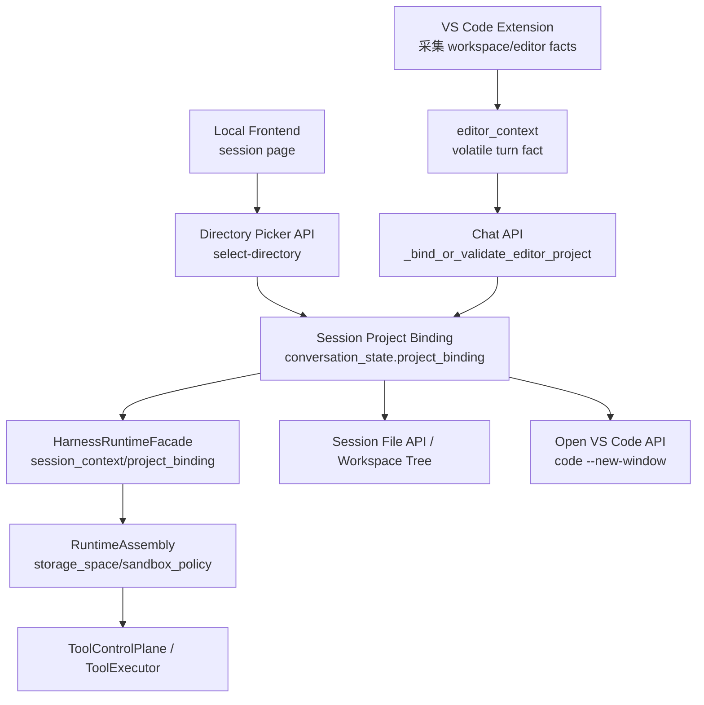

# VS Code 项目感知与 Session 绑定架构技术报告

日期：2026-06-04

状态：已实施链路的架构说明与技术细节报告。

本文记录当前项目中 VS Code 项目感知、session project binding、本地前端项目入口、VS Code 新窗口启动、runtime workspace root 传递和工具权限消费的实际实现。本文不是 VS Code 原生 Agents Window 接入方案，也不是 Copilot chronicle/session sync 方案。

## 1. 设计结论

当前采用的是“VS Code Extension API + 本地后端 REST + session project binding”的桥接架构：

```text
VS Code Extension 观察项目上下文
-> 本地后端接收 editor_context
-> SessionManager 冻结 project_binding
-> RuntimeAssembly 注入 workspace_root / sandbox_policy
-> ToolControlPlane / File API / TaskRun 消费绑定 root
-> 本地前端可按 session 打开 VS Code 新窗口
```

核心结论：

- VS Code 是观察层，不是权限层。
- 本地 session 是 conversation、权限、TaskRun、工具和项目绑定的权威。
- `conversation_state.project_binding.workspace_root` 是工具和 sandbox 的项目根来源。
- `editor_context.workspace_roots` 只能用于首次绑定或冲突校验，不能直接授权文件访问。
- 打开 VS Code 使用 `code --new-window <workspace_root>`，不再使用 `code -r`。
- 不使用 `--user-data-dir`，避免隔离用户配置后导致本地 VS Code extension 不可见。

## 2. 问题背景

Vibe coding agent 的关键能力不是“prompt 里提到项目路径”，而是整个运行系统都围绕同一个项目根建立：

- 模型能看到当前编辑器上下文。
- 工具能在正确项目内搜索、读写、运行测试。
- sandbox 权限不被后端项目 `langchain-agent` 默认 root 错绑。
- session 页面、文件树、VS Code 窗口和 TaskRun 使用同一个项目。
- 多 session 并行时不互相污染项目上下文。

旧风险点：

- editor context 只进入 prompt，无法改变工具权限根。
- 工具默认 root 容易回到后端项目目录。
- 前端能看到的项目和 agent 工具能操作的项目可能不一致。
- `code -r` 会复用窗口，不适合“一个 session 一个项目窗口”的多任务模型。

## 3. 架构权威链



权威划分：

| 层 | 允许做什么 | 禁止做什么 |
|---|---|---|
| VS Code extension | 观察 workspace、active editor、selection、diagnostics | 授权工具、直接写文件、保存对话 |
| Chat API | 根据 editor roots 首次绑定或校验冲突 | 静默切换项目 |
| SessionManager | 冻结 session project binding | 从 prompt 或 active file 推断权限 |
| RuntimeAssembly | 携带已绑定 root 到 task environment | 覆盖 binding 或回退旧 root |
| ToolControlPlane | 按 sandbox scope 授权工具 | 接受越界绝对路径 |
| Local frontend | 呈现绑定状态、触发目录选择和打开 VS Code | 直接拼本地命令执行 |

## 4. 关键数据结构

### 4.1 SessionProjectBinding

存储位置：

```text
session_payload.conversation_state.project_binding
```

结构：

```json
{
  "workspace_root": "D:\\AI应用\\target-project",
  "source": "vscode",
  "bound_at": 1780549985.5288324,
  "last_seen_at": 1780549985.5288324,
  "immutable": true,
  "authority": "sessions.project_binding"
}
```

字段语义：

| 字段 | 说明 |
|---|---|
| `workspace_root` | 绝对路径，写入前 `Path(...).expanduser().resolve()` |
| `source` | 来源，常见值为 `vscode`、`frontend.directory_picker`、`manual` |
| `bound_at` | 首次绑定时间 |
| `last_seen_at` | 同 root 再次出现或刷新时更新时间 |
| `immutable` | 当前固定为 `true`，表示一会话一项目 |
| `authority` | 固定为 `sessions.project_binding` |

实现位置：

- `backend/sessions/__init__.py`
  - `SessionManager.create_session`
  - `SessionManager.bind_project`
  - `SessionManager.get_project_binding`
  - `SessionManager.require_project_binding`
  - `_normalize_project_binding`

### 4.2 EditorContextSnapshot

VS Code extension 采集结构：

```ts
type EditorContextSnapshot = {
  source: "vscode";
  captured_at: string;
  workspace_roots: string[];
  active_file?: {
    path: string;
    language_id: string;
    dirty: boolean;
    selection?: {
      start: { line: number; character: number };
      end: { line: number; character: number };
      text?: string;
      truncated: boolean;
    };
    visible_ranges?: Array<...>;
  };
  visible_files: Array<...>;
  diagnostics: Array<...>;
  limits: {
    selected_text_chars: number;
    diagnostics_count: number;
    visible_files_count: number;
  };
};
```

实现位置：

- `extensions/vscode/src/editorContext.ts`
- `backend/api/chat.py` 的 `ChatRequest.editor_context`
- `backend/harness/entrypoint/models.py` 的 `HarnessRuntimeRequest.editor_context`

设计约束：

- `editor_context` 是 volatile turn fact。
- 不进入长期记忆。
- 不作为权限凭据。
- dirty 文件只提示“磁盘内容可能滞后”，不改变读写边界。

## 5. 后端 API 细节

### 5.1 创建 session

文件：

- `backend/api/sessions.py`
- `backend/sessions/__init__.py`

Endpoint：

```text
POST /api/sessions
```

请求模型：

```python
class CreateSessionRequest(BaseModel):
    title: str = DEFAULT_SESSION_TITLE
    scope: dict[str, Any] = Field(default_factory=dict)
    project_binding: dict[str, Any] = Field(default_factory=dict)
```

请求示例：

```json
{
  "title": "VS Code Agent Session",
  "scope": {
    "workspace_view": "chat"
  },
  "project_binding": {
    "workspace_root": "D:\\AI应用\\target-project",
    "source": "vscode"
  }
}
```

执行细节：

1. API 调 `runtime.session_manager.create_session(...)`。
2. SessionManager 标准化 `project_binding`。
3. 如果 root 存在且是目录，写入 `conversation_state.project_binding`。
4. 返回 session summary，summary 内包含 `conversation_state`。

### 5.2 显式绑定项目

Endpoint：

```text
PUT /api/sessions/{session_id}/project-binding
```

请求模型：

```python
class ProjectBindingRequest(BaseModel):
    workspace_root: str = Field(..., min_length=1, max_length=1000)
    source: str = Field(default="manual", max_length=80)
```

核心语义：

- 未绑定：写入新 binding。
- 已绑定同 root：刷新 `last_seen_at`。
- 已绑定不同 root：抛 `SessionProjectBindingConflict`，API 返回 409。

伪代码：

```python
next_binding = normalize(workspace_root, validate_root=True)
current = state["project_binding"]

if current:
    if not same_workspace_root(current.root, next_binding.root):
        raise SessionProjectBindingConflict
    refresh last_seen_at
else:
    state["project_binding"] = next_binding
```

### 5.3 前端目录选择器

Endpoint：

```text
POST /api/sessions/{session_id}/project-binding/select-directory
```

实现位置：

- `backend/api/sessions.py`
  - `select_session_project_directory`
  - `_select_project_directory_with_windows_dialog`
  - `_select_project_directory_with_tkinter`
  - `_select_project_directory_with_powershell`

Windows 选择顺序：

1. `tkinter.filedialog.askdirectory`
2. PowerShell `System.Windows.Forms.FolderBrowserDialog`

PowerShell 关键命令：

```powershell
Add-Type -AssemblyName System.Windows.Forms;
$dialog = New-Object System.Windows.Forms.FolderBrowserDialog;
$dialog.Description = '选择要绑定到当前会话的项目目录';
$dialog.ShowNewFolderButton = $false;
```

返回语义：

- 用户选择目录：绑定并返回 `project_binding`。
- 用户取消：返回 409。
- 目录无效：返回 400。
- 已绑定其他 root：返回 409。

### 5.4 打开 VS Code 新窗口

Endpoint：

```text
POST /api/sessions/{session_id}/project-binding/open-vscode
```

实现位置：

- `backend/api/sessions.py::open_session_project_in_vscode`

当前命令：

```python
command = [executable, "--new-window", workspace_root]
subprocess.Popen(
    command,
    creationflags=subprocess.CREATE_NO_WINDOW if sys.platform.startswith("win") else 0,
    stdin=subprocess.DEVNULL,
    stdout=subprocess.DEVNULL,
    stderr=subprocess.DEVNULL,
)
```

返回示例：

```json
{
  "ok": true,
  "project_binding": {
    "workspace_root": "D:\\AI应用\\target-project",
    "source": "frontend.directory_picker"
  },
  "command": [
    "D:\\Microsoft VS Code\\bin\\code.CMD",
    "--new-window",
    "D:\\AI应用\\target-project"
  ],
  "window_mode": "new_window",
  "session_id": "session-xxx"
}
```

技术选择：

- 使用 `shutil.which("code")` 定位 VS Code CLI。
- 使用 `--new-window`，禁止退回 `-r`。
- Windows 下用 `CREATE_NO_WINDOW` 避免弹出命令窗口。
- 标准输入输出错误流都接到 `DEVNULL`，避免后端进程持有无意义句柄。
- 不加 `--user-data-dir`，因为隔离 user data 会让当前安装的 extension、配置和登录状态不可见。

失败语义：

| 条件 | 返回 |
|---|---|
| session 无 binding | 409 |
| `code` CLI 缺失 | 503 |
| Popen 失败 | 500 |

## 6. Chat API 自动绑定与冲突校验

实现位置：

- `backend/api/chat.py::_bind_or_validate_editor_project`

输入：

```json
{
  "editor_context": {
    "workspace_roots": [
      "D:\\AI应用\\target-project"
    ]
  }
}
```

处理规则：

```text
if workspace_roots is empty:
    do nothing

if session already has binding:
    accept only matching root
    refresh last_seen_at
    reject different root

if session has no binding:
    if exactly one root:
        bind it
    else:
        reject and require explicit binding
```

这个规则避免了两个危险行为：

- VS Code 多工作区时后端替用户猜项目。
- 已绑定 session 因 VS Code 当前窗口切换而静默改 root。

## 7. Runtime 注入与工具权限消费

### 7.1 RuntimeFacade

实现位置：

- `backend/harness/entrypoint/runtime_facade.py`

职责：

- 读取 `runtime.session_manager.get_history(session_id)`。
- 从 `conversation_state.project_binding` 得到 bound workspace root。
- 把 `project_binding` 放入 `session_context`。
- 把 `editor_context` 放入当前 runtime request。
- 调用 runtime assembly 时传入 `workspace_root`。

### 7.2 RuntimeAssembly

实现位置：

- `backend/harness/runtime/assembly.py`

绑定 root 写入：

```json
{
  "task_environment": {
    "storage_space": {
      "workspace_root": "D:\\AI应用\\target-project"
    },
    "sandbox_policy": {
      "workspace_root": "D:\\AI应用\\target-project"
    },
    "project_binding": {
      "workspace_root": "D:\\AI应用\\target-project",
      "authority": "harness.runtime.session_project_binding"
    }
  }
}
```

效果：

- Single Turn 工具上下文可读到 bound root。
- TaskRun 继承该 root。
- ToolControlPlane 与 ToolExecutor 不再默认回到后端项目 root。

### 7.3 ToolControlPlane / ToolExecutor

相关测试覆盖：

- `test_tool_control_plane_and_executor_prefer_bound_workspace_root`
- `test_task_safety_validator_uses_bound_workspace_root_for_absolute_paths`

设计原则：

- 工具请求中的 sandbox scope 优先。
- sandbox policy 的 `workspace_root` 是工具文件系统 validator 的主要边界。
- 绝对路径必须落在 bound workspace root 内。
- 不能因为 active file 在某路径就自动扩权。

## 8. 文件树与文件 API

### 8.1 Workspace Tree

实现位置：

- `backend/api/code_environment.py::code_environment_workspace_tree`
- `backend/api/code_environment.py::_workspace_tree_root`

行为：

- 无 `session_id`：返回后端项目 root 文件树。
- 有 `session_id`：必须存在 project binding。
- 返回绑定项目 root 的文件树。

失败：

- session 无 binding：409。
- binding root 不存在：404。

### 8.2 File API

实现位置：

- `backend/api/files.py::_resolve_path`
- `backend/api/files.py::_session_project_root`

行为：

- read 时以 session binding root 解析普通项目路径。
- write 仍受 editable whitelist 约束。
- 对项目敏感文件、二进制文件和被排除路径做限制。
- 越界路径返回 traversal 或不可见路径错误。

## 9. 前端实现细节

### 9.1 API 封装

实现位置：

- `frontend/src/lib/api.ts`

相关函数：

```ts
createSession(title, scope, projectBinding)
getSessionProjectBinding(sessionId, scope)
bindSessionProject(sessionId, payload, scope)
selectSessionProjectDirectory(sessionId, scope)
openSessionProjectInVSCode(sessionId, scope)
```

`openSessionProjectInVSCode` 返回类型已包含：

```ts
{
  ok: boolean;
  project_binding: SessionProjectBinding;
  command: string[];
  window_mode?: "new_window" | string;
  session_id?: string;
}
```

### 9.2 Store 行为

实现位置：

- `frontend/src/lib/store/runtime.ts::bindCurrentSessionProject`

绑定流程：

```text
ensureSession()
-> selectSessionProjectDirectory(sessionId, scope)
-> refreshMainSessionPool()
-> clear workspaceTree cache
-> refreshWorkspaceTree()
-> loadInspectorMemoryFile()
```

这个流程保证绑定后：

- session summary 更新。
- 左侧项目名和 root 更新。
- 文件树切到绑定项目。
- inspector 从 session root 逻辑读取。

### 9.3 WorkbenchShell 项目入口

实现位置：

- `frontend/src/components/layout/WorkbenchShell.tsx`
- `frontend/src/app/globals.css`

当前 UI：

- 未绑定：显示“绑定”按钮，触发目录选择。
- 已绑定：显示项目名、项目 root、“VS Code”按钮、“刷新”按钮。
- 文件树 header 保留 VS Code 打开按钮。

“VS Code”按钮调用：

```ts
await openSessionProjectInVSCode(currentSession.id, currentSession.scope)
```

前端不拼 `code` 命令，不处理本地进程启动。

## 10. VS Code Extension 实现细节

### 10.1 editor context 采集

实现位置：

- `extensions/vscode/src/editorContext.ts`

使用 VS Code API：

```ts
vscode.workspace.workspaceFolders
vscode.window.activeTextEditor
vscode.window.visibleTextEditors
vscode.languages.getDiagnostics()
editor.document.getText(editor.selection)
editor.document.isDirty
editor.document.languageId
```

限流参数：

- selected text：8000 chars
- visible files：20
- diagnostics：50
- workspace roots：8

### 10.2 session 创建与复用

实现位置：

- `extensions/vscode/src/extension.ts`
- `extensions/vscode/src/apiClient.ts`

流程：

```text
用户执行 Langchain Agent: Send Current Context
-> 输入 message
-> collectEditorContext()
-> resolveSessionId()
   -> 配置里有 sessionId 就用配置值
   -> workspaceState 里有可用 session 就复用
   -> 否则根据 workspace roots 创建新 session
-> createChatRun({ message, session_id, editor_context })
```

多 workspace roots：

- 0 个 root：创建普通 session，不带 project binding。
- 1 个 root：创建 session 时带 `project_binding`。
- 多个 root：用 `showQuickPick` 让用户选择。

## 11. 实际调用链示例

### 11.1 从本地前端绑定并打开 VS Code

```text
用户点击“绑定”
-> frontend WorkspaceRuntime.bindCurrentSessionProject()
-> POST /sessions/{id}/project-binding/select-directory
-> Windows folder picker
-> SessionManager.bind_project()
-> refresh session list / workspace tree

用户点击“VS Code”
-> frontend openSessionProjectInVSCode()
-> POST /sessions/{id}/project-binding/open-vscode
-> require_project_binding()
-> shutil.which("code")
-> Popen(["code", "--new-window", workspace_root])
```

### 11.2 从 VS Code 发起请求

```text
用户在 VS Code 执行 Send Current Context
-> collectEditorContext()
-> createSession(... project_binding ...)
-> createChatRun(... editor_context ...)
-> Chat API _bind_or_validate_editor_project()
-> HarnessRuntimeFacade
-> RuntimeAssembly
-> ToolControlPlane
```

## 12. 失败路径

| 场景 | 处理 |
|---|---|
| session 无 project binding 打开 VS Code | `409 session has no project binding` |
| `code` CLI 不存在 | `503 VS Code CLI code was not found on PATH` |
| VS Code 发来多个 roots 且 session 未绑定 | `409 multiple editor workspace roots require explicit project binding` |
| VS Code root 与 session binding 冲突 | `409 editor workspace root does not match bound session project` |
| directory picker 取消 | `409 project directory selection cancelled` |
| binding root 不存在 | `400 project binding workspace_root must be an existing directory` |
| session 文件树无 binding | `409 session has no project binding` |
| 文件路径越界 | path traversal / not visible |

## 13. 验证与测试

后端回归：

- `backend/tests/vscode_project_binding_sandbox_regression.py`

覆盖点：

- session binding 不可变。
- chat editor context 自动绑定。
- chat editor context 冲突拒绝。
- 多 root 初始状态拒绝自动猜测。
- directory picker 成功绑定。
- directory picker 取消不绑定。
- open-vscode 使用 `--new-window` 且不含 `-r`。
- runtime assembly 携带 bound workspace root。
- tool control plane / executor 优先使用 bound root。
- task safety validator 拒绝 root 外绝对路径。

前端回归：

- `frontend/src/lib/store/runtime.test.ts`
- `frontend/src/components/chat/PublicRunActivity.test.ts`
- `frontend/src/components/chat/ChatMessage.test.ts`

编译验证：

```powershell
npx tsc --noEmit
npm run compile
```

真实 smoke：

```powershell
POST /api/sessions
POST /api/sessions/{id}/project-binding/open-vscode
```

返回确认：

```json
"command": ["D:\\Microsoft VS Code\\bin\\code.CMD", "--new-window", "D:\\AI应用\\langchain-agent"]
```

## 14. 运行与部署约束

固定本地节点：

- 前端：`http://127.0.0.1:3000`
- 后端：`http://127.0.0.1:8003`
- 前端 API base：`http://127.0.0.1:8003/api`

后端代码变更后：

- 当前 `run_uvicorn.py` 不带 reload。
- 需要重启后端才能加载 `open-vscode` 命令变更。

前端代码变更后：

- 使用固定 3000。
- 不用随机端口。
- 若 `.next` 状态异常，应清理并从固定端口重启。

## 15. 设计边界

当前明确不做：

- 不接 VS Code 原生 Agents Window。
- 不接 Copilot chronicle/session sync。
- 不在 VS Code 中建立本项目主 conversation。
- 不让 extension 直接执行写文件。
- 不让 editor context 授权工具。
- 不支持同一 session 切换项目。
- 不追踪 VS Code window 进程句柄来“复用同一窗口”，因为 VS Code CLI 没有稳定返回窗口身份。

## 16. 后续建议

建议按价值和实现难度排序：

1. Extension 显示当前绑定 session id 和后端连接状态。
2. Extension 上报 last_seen editor context 后，在本地前端显示 VS Code connected 状态。
3. open-vscode endpoint 增加可选 `launch_source` 诊断字段。
4. Diff preview 接入 VS Code diff editor，但写入仍由后端工具完成。
5. Research agent 作为 read-only TaskRun profile 输出 Markdown report。
6. 若 VS Code 开放稳定第三方 agent session API，再评估原生 Agents Window 接入。

## 17. 必须保持的工程规则

- `project_binding` 是权限根，不是 UI 装饰字段。
- `editor_context` 是观察事实，不是授权事实。
- 绑定冲突必须报错，不能静默切换。
- Frontend 不直接启动本地命令。
- `open-vscode` 不能退回 `code -r`。
- TaskRun 继承 runtime assembly root，不重新读取 VS Code 当前窗口。
- 工具执行必须验证路径在 bound workspace root 内。
- 新增能力必须同时覆盖 direct turn 和 TaskRun 两条路径。

