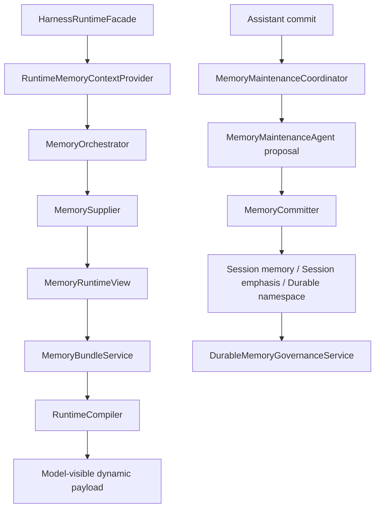
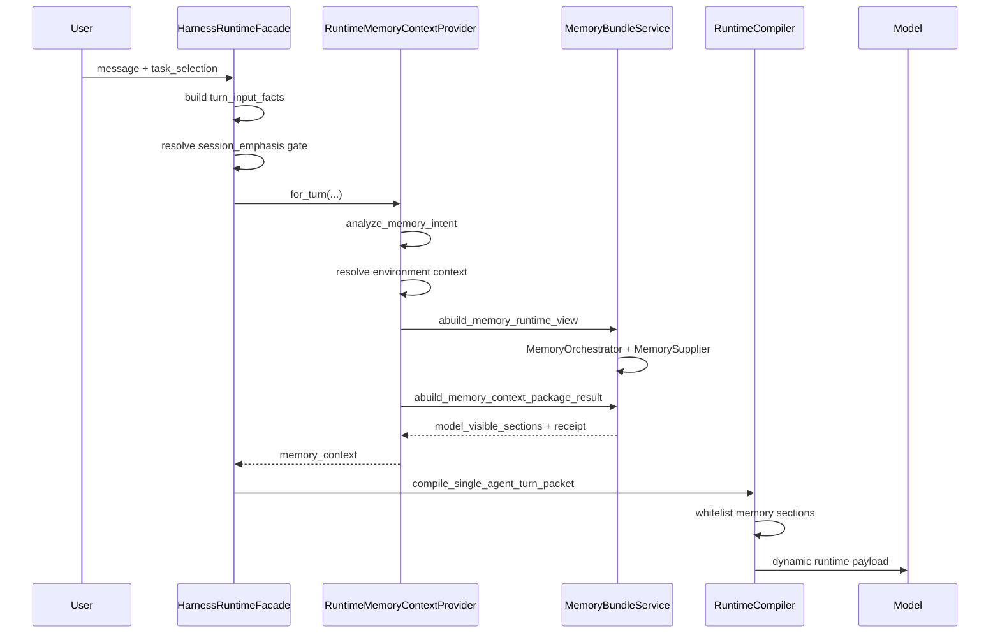
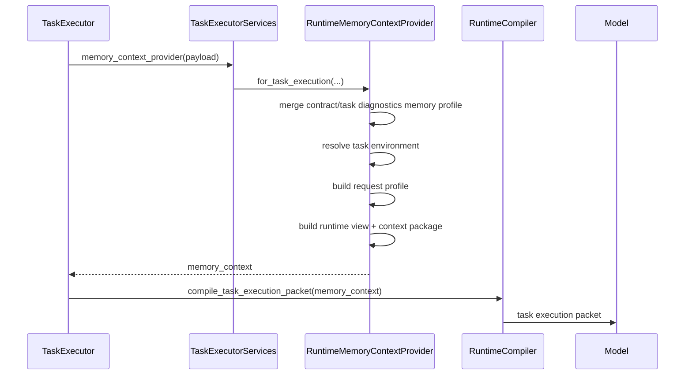
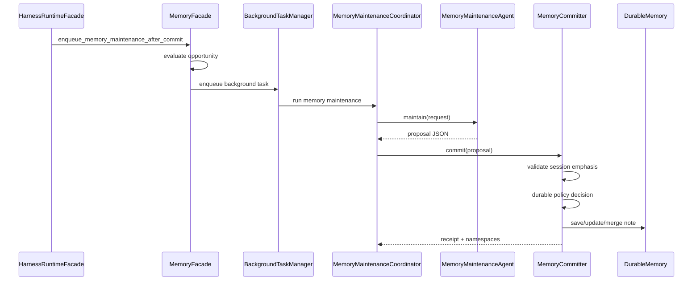

# 065-记忆系统技术报告

日期：2026-06-04

## 1. 报告结论

本项目的记忆系统不是“把历史聊天存起来再塞回 prompt”的简单记忆功能，而是一套面向 agent runtime 的分层上下文管理系统。它的核心设计是：

```text
当前运行事实
-> 环境归一
-> 显式读计划
-> 候选化召回
-> 只读 runtime view
-> 预算化 context package
-> 模型可见白名单注入
-> 独立维护 agent 提案
-> 系统 committer 校验写入
-> durable governance 低频整理
```

正确理解这个系统，需要抓住四个原则：

1. **记忆只能作为候选，不是当前事实**。`MemoryContextCandidate` 和 `StateMemoryRestoreCandidate` 都是 `candidate_only`，不能自行覆盖当前 turn。
2. **读写权威分离**。runtime 只读；`MemoryMaintenanceAgent` 只产 proposal；`MemoryCommitter` 才能写 session emphasis 或 durable memory。
3. **环境是长期记忆的默认边界**。coding、writing、general 等任务环境使用不同 durable namespace，读取默认是当前环境优先，再加 `global_common`。
4. **压缩和长期记忆不是同一件事**。压缩负责降低上下文压力和恢复工作状态；长期记忆负责跨会话、跨压缩保留稳定偏好或规则。

## 2. 设计目标

记忆系统要解决的不是单纯“模型能不能记住”，而是 agent 在长期任务、上下文压缩、环境切换和多轮执行中如何保持可靠状态。

目标能力：

- 在会话内保留用户强调过的短期要求，不被上下文压缩抹掉。
- 在环境内保留长期可复用偏好，例如 coding 环境的测试闭环要求。
- 在全局层保留跨环境共通偏好，但必须低频、受治理、可审计。
- 在 runtime 读记忆时不污染当前轮事实，不让旧摘要或旧任务环境覆盖当前输入。
- 在写记忆时不让 agent 自由发挥，所有 durable 写入经过提交层和 namespace policy。
- 在压缩时保留任务状态、证据引用、最近真实消息和可恢复 handle，而不是平均截断。

非目标：

- 不把 `task_durable_memory` 重新接入普通 runtime 主链路。
- 不让主 agent 获得长期记忆直接写权限。
- 不每轮强制注入长期记忆或 session emphasis。
- 不用聊天摘要替代项目规则、源文件事实或工具结果证据。

## 3. 总体架构

### 3.1 权威链路



各层职责：

- `HarnessRuntimeFacade`：API/runtime 入口，只负责提供当前 session、turn、task、runtime assembly 等事实。
- `RuntimeMemoryContextProvider`：把运行事实转换成 memory request profile，并调用只读 bundle service。
- `MemoryOrchestrator`：根据 profile 生成显式 `MemoryReadPlan`。
- `MemorySupplier`：按 read plan 拉取 conversation、state、working、long_term 候选。
- `MemoryRuntimeView`：只读视图，强制候选不能覆盖当前事实。
- `MemoryBundleService`：把候选交给 context policy，生成预算化模型可见片段。
- `RuntimeCompiler`：只投影白名单 `model_visible_sections`。
- `MemoryMaintenanceAgent`：只生成维护 proposal。
- `MemoryCommitter`：系统写入权威，负责校验、路由和落盘。
- `DurableMemoryGovernanceService`：人工/API/低频治理入口，管理 durable note 状态、合并、删除、治理 tick。

### 3.2 文件级结构

核心文件：

```text
backend/memory_system/facade.py
backend/memory_system/runtime_context_provider.py
backend/memory_system/runtime_supply.py
backend/memory_system/runtime_view.py
backend/memory_system/bundle_service.py
backend/memory_system/contracts.py
backend/memory_system/environment_context.py
backend/memory_system/continuity.py
backend/memory_system/session_emphasis.py
backend/memory_system/state_memory.py
backend/memory_system/conversation_memory.py
backend/memory_system/working_memory_service.py
backend/memory_system/durable.py
backend/memory_system/governance_service.py
backend/memory_system/maintenance.py
backend/harness/entrypoint/runtime_facade.py
backend/harness/runtime/compiler.py
backend/harness/loop/task_executor.py
backend/api/memory.py
frontend/src/lib/api.ts
```

支撑文件：

```text
backend/memory_system/layout.py
backend/memory_system/storage/memory_manager.py
backend/memory_system/manifest_scan.py
backend/context_system/policy.py
backend/context_system/budget/*
backend/runtime/prompt_accounting/*
backend/request_intent/memory_intent.py
```

## 4. 分层设计

### 4.1 Runtime 边界层

代表文件：

- `backend/harness/entrypoint/runtime_facade.py`
- `backend/harness/loop/task_executor.py`
- `backend/harness/runtime/compiler.py`

职责：

- 接收用户请求、当前 turn、task selection、runtime assembly。
- 在单轮对话和 task execution 两条路径上调用 memory context provider。
- 将返回的 `memory_context` 放入 `session_context` 或 task execution packet。
- 最终由 `RuntimeCompiler` 投影到模型可见 dynamic payload。

关键细节：

- 单轮对话在 runtime branch 决定后、模型调用前构造 memory context。
- task execution 通过 `TaskExecutorServices.memory_context_provider` 在每一步模型 invocation 前构造 memory context。
- 编译器只允许这些 section 进入模型：

```text
active_process_context
hot_truth_window
retrieval_evidence
warm_snapshots
exact_durable_context
relevant_durable_context
```

这样即使上游包里存在 debug section，也不会进入 prompt。

### 4.2 环境上下文归一层

代表文件：

- `backend/memory_system/environment_context.py`
- `backend/memory_system/runtime_context_provider.py`

核心数据结构：

```text
MemoryEnvironmentContext
- task_environment_id
- environment_kind
- project_id
- turn_id
- task_run_id
- source
- authority
```

解析顺序：

1. explicit memory environment context
2. `main_context.task_environment`
3. `main_context`
4. `runtime_assembly.task_environment`
5. `task_selection`
6. `active_work_context`
7. `recent_work_outcome`
8. session 当前 turn/task_run 的 `turn_environment_snapshot`
9. session active task environment
10. session scope / task binding

设计原因：

- 当前请求事实优先于历史 session 状态。
- session record 只能作为 fallback，不能覆盖当前 turn。
- 同一会话可从 coding 切到 writing，因此长期记忆不能只绑定 `session_id`。

### 4.3 会话连续性层

代表文件：

- `backend/memory_system/continuity.py`
- `backend/memory_system/conversation_memory.py`
- `backend/memory_system/state_memory.py`
- `backend/memory_system/session_emphasis.py`

会话连续性包含三类材料：

- conversation snapshot：最近对话引用、hot truth window、compact summary ref。
- state snapshot：active goal、flow state、task state、context slots、handles、file refs、operation refs、next step。
- session emphasis：用户在当前会话中强调的短期或会话级要求。

`SessionEmphasisStore` 的核心实体是 `SessionPinnedUserSteer`：

```text
- emphasis_id
- session_id
- turn_id
- task_environment_id
- scope
- content
- source_message_ref
- priority
- status
```

注入策略：

- 不每轮注入。
- 当用户消息、task selection、active work 或 recent outcome 表示需要时才注入。
- 注入时按当前 `task_environment_id` 过滤。
- active item 按 priority 和更新时间排序，默认最多 8 条。

这条通道的定位是“会话级强调”，不是长期记忆；它跨压缩保留，但不会自动升级为 durable。

### 4.4 工作记忆层

代表文件：

- `backend/memory_system/working_memory_service.py`
- `backend/memory_system/working_memory_store.py`
- `backend/memory_system/working_memory_finalizer.py`

职责：

- 保存 task_run、graph node、run attempt 作用域内的工作材料。
- 支持 handoff、read log、temporal edge、finalizer。
- 为 runtime 供给 working candidates。

边界：

- 工作记忆是任务运行材料，不是全局偏好。
- 读取必须带明确 scope：`task_run_id`、`task_id`、`graph_id`、`owner_node_id`、`node_run_id`、`run_attempt_id`。
- 不能默认进入长期记忆。

`task_durable_memory.py` 当前仍保留为独立服务，但普通 runtime 主链路不接入它。`normalize_memory_layer()` 明确拒绝 `task_durable` 和 `task_durable_memory`。

### 4.5 长期记忆层

代表文件：

- `backend/memory_system/durable.py`
- `backend/memory_system/storage/memory_manager.py`
- `backend/memory_system/layout.py`

存储结构：

```text
storage/durable_memory/
  notes/
  index/MEMORY.md
  meta/SCHEMA.md
  environments/
    <safe_environment_id>/
      notes/
      index/MEMORY.md
      meta/SCHEMA.md
```

namespace：

- `global_common`：全局共通长期记忆。
- `env:<safe_task_environment_id>`：环境级长期记忆。

读取顺序：

```text
当前环境 namespace
-> global_common
```

长期记忆不是直接全量注入。`DurableMemoryLayer.recall_memories()` 先扫描 manifest headers，再由 `DurableMemoryRecallSelector` 选择 note id。如果没有 selector invoker，recall fail closed，不主动编造可用记忆。

长期候选会被转换为 `MemoryContextCandidate`：

```text
memory_layer = "long_term"
source = "durable_memory.recall"
requires_verification_before_use = true
metadata.namespace_id = ...
metadata.verification_policy = ...
```

这意味着长期记忆只能提示模型“可能相关”，不能替代当前文件、工具结果或用户最新要求。

### 4.6 运行时只读供给层

代表文件：

- `backend/memory_system/runtime_context_provider.py`
- `backend/memory_system/runtime_supply.py`
- `backend/memory_system/runtime_view.py`
- `backend/memory_system/bundle_service.py`

`RuntimeMemoryContextProvider` 做三件事：

1. 解析当前环境。
2. 构造 memory request profile。
3. 调用 `abuild_memory_runtime_view()` 和 `abuild_memory_context_package_result()`。

单轮对话默认请求：

```text
requested_memory_layers = ["state"] 或 ["state", "long_term"]
allow_long_term_memory = profile 允许 + 当前回合需要记忆
global_common_allowed = true
session_summary = compressed_context
main_context = 当前 turn/task/environment 摘要
recent_tools = 最近 API transcript 中的工具名
```

task execution 默认请求：

```text
contract.memory_request_profile
-> contract.memory_scope
-> task_run.diagnostics.task_memory_request_profile
-> task_run.diagnostics.memory_request_profile
-> fallback ["state"]
```

如果 profile 或 agent runtime scope 允许长期候选，则加入 `long_term`。

`MemoryReadPlan` 是实际执行计划，包含：

```text
requested_layers
allow_long_term
state_read_requested
working_scope
turn_environment_snapshot
environment_scope.read_namespaces
global_common_allowed
main_context
task_summaries
session_summary
recent_tools
recently_surfaced_note_ids
```

`MemoryRuntimeView` 强制：

- `read_only=True`
- `memory_write_allowed=False`
- context candidate 不能 `can_override_current_turn`
- restore candidate 不能 `can_promote_to_current_fact`

### 4.7 维护写入层

代表文件：

- `backend/memory_system/maintenance.py`
- `backend/memory_system/facade.py`
- `backend/bootstrap/app_runtime.py`

写链路：

```text
assistant message commit
-> MemoryFacade.enqueue_memory_maintenance_after_commit()
-> BackgroundTaskManager enqueue memory_maintenance_after_commit
-> MemoryMaintenanceCoordinator.run_after_commit()
-> MemoryMaintenanceAgent.maintain()
-> MemoryCommitter.commit()
```

`MemoryMaintenanceAgent` 的输出合同：

```text
MemoryMaintenanceProposal
- session_memory
- session_emphasis_actions
- durable_memory.actions
- diagnostics
```

它只能提出 proposal，不能直接写文件。

`DurableMemoryWriteAction` 的关键字段：

```text
action
memory_type
memory_class
canonical_statement
evidence_excerpt
source_message_refs
memory_origin
evidence_source_kind
preference_scope
preference_horizon
proposed_target_layer
task_environment_id
```

`MemoryCommitter` 负责校验：

- `reference` memory write 禁止。
- assistant inferred fact、temporary task state 等来源拒绝进入 durable。
- assistant summary、runtime state 等证据来源拒绝进入 durable。
- turn/session horizon 路由到 session，不写 durable。
- 非 manual governance 的 global_common 写入进入 `needs_review`。
- action 自带环境 id 与当前 decision context 不一致时拒绝。
- 只有 tier1 显式用户偏好、用户工作指令、用户反馈、用户确认项目规则可 active 写入环境 durable。

这就是“agent 提取，系统提交”的核心安全边界。

### 4.8 治理层

代表文件：

- `backend/memory_system/governance_service.py`
- `backend/api/memory.py`
- `backend/bootstrap/app_runtime.py`

治理能力：

- scan headers
- load note
- create note
- activate / disable / archive
- delete
- merge
- mark namespace dirty
- run governance tick

治理支持 namespace：

```text
namespace_id = global_common
namespace_id = env:<task_environment_id>
task_environment_id = env.coding...
```

dirty namespace 会触发：

- durable index rebuild
- durable governance tick

governance tick 不应该高频运行；它是低频整理、去重、状态校正和索引维护入口。

### 4.9 压缩与预算层

代表文件：

- `backend/memory_system/bundle_service.py`
- `backend/context_system/compaction/*`
- `backend/context_system/budget/*`
- `backend/runtime/prompt_accounting/*`

压缩相关入口：

```text
MemoryBundleService.inspect_memory_context_compaction()
MemoryBundleService.build_memory_compaction_result()
SessionMemoryLayer
StateMemoryStoreAdapter.restore_candidates()
```

设计边界：

- 压缩恢复只能恢复候选，不能重新决定用户意图。
- durable memory 不是 compressed summary。
- compressed summary 进入 session context，但不替代当前 user message。
- 工具结果、文件事实和权限边界应保留 ref、hash、range、artifact handle，而不是只保留自然语言摘要。

成熟 coding agent 的压缩经验可以概括为：

- stable prefix 受保护，动态内容放后缀。
- 大工具输出先 ref 化，再摘要。
- 代码上下文优先使用结构化索引、文件切片和符号视图，而不是散文总结。
- 自动 compact 和手动 compact 都要存在。
- compact summary 是恢复点，不是长期事实权威。

## 5. 关键运行流程

### 5.1 单轮对话读取记忆



长期记忆只有在 agent profile 允许，并且当前回合有记忆读取意图或任务相关信号时才进入请求。

### 5.2 Task execution 读取记忆



这保证普通对话和任务执行都走同一套 memory bundle 入口。

### 5.3 写入和维护



写入频率由 opportunity gate 和后台任务控制。热路径只产生维护信号，不能让模型直接写 active durable memory。

## 6. 数据模型和不变量

### 6.1 Candidate 不变量

`MemoryContextCandidate`：

- authority 必须是 `candidate_only`。
- `can_override_current_turn` 必须为 false。
- 默认 `requires_verification_before_use=true`。

`StateMemoryRestoreCandidate`：

- authority 必须是 `candidate_only`。
- `can_promote_to_current_fact` 必须为 false。
- promotion rule 要求 orchestration 再验证。

### 6.2 Runtime view 不变量

`MemoryRuntimeView`：

- `read_only=true`
- `memory_write_allowed=false`
- 不允许携带能覆盖当前 turn 的 candidate。
- 不允许 restore candidate 自我提升。

### 6.3 Durable 写入不变量

durable 写入必须满足：

- 有明确 evidence。
- 有明确 scope 和 horizon。
- 有明确 target layer。
- 当前环境和 action 环境一致。
- 写入 namespace 由系统解析，不由 agent 自由选择路径。
- global_common 默认需要治理 review。

### 6.4 注入不变量

模型可见 `memory_context` 必须：

- 只包含白名单 section。
- 带 `read_namespaces` 诊断。
- 带 runtime view / context package receipt ref。
- 标记 `requires_verification_before_use`。
- 不包含 debug trace、原始 manifest、提交权限或写入工具。

## 7. 方法采用

### 7.1 分层记忆方法

系统采用四类运行期记忆：

```text
session emphasis      会话级短期强调
state/conversation    会话连续性和恢复材料
working memory        task/node/run 局部工作材料
durable memory        环境级或全局级长期记忆
```

这比“所有记忆都进一个库”更安全，因为每类记忆有不同生命周期、权限和注入方式。

### 7.2 候选化召回方法

读取不是直接信任记忆，而是：

```text
read plan -> candidate pool -> runtime view -> context package -> model-visible section
```

候选化的优点：

- 可以被预算系统裁剪。
- 可以带 verification policy。
- 可以记录 namespace 和来源。
- 不能覆盖当前事实。

### 7.3 Proposal / Commit 写入方法

维护 agent 负责抽取，系统提交层负责裁决。

这种设计避免两类问题：

- agent 把临时调试结论写成长期记忆。
- agent 在环境切换后写错 namespace。

### 7.4 环境优先 namespace 方法

长期记忆默认按当前 task environment 隔离：

```text
env:env.coding.vibe_workspace
env:env.writing.xxx
global_common
```

读取时：

```text
当前 env durable layer
-> global_common durable layer
```

写入时：

```text
decision_context.task_environment_id
-> durable_memory_namespace_id_for_task_environment()
-> environment DurableMemoryLayer / MemoryManager
```

### 7.5 低频治理方法

系统不把 governance 放进每轮热路径，而是：

- durable memory 保存后标记 namespace dirty。
- 后台队列触发 index rebuild 和 governance tick。
- UI/API 提供手动治理操作。
- global_common 默认更严格。

### 7.6 压缩恢复方法

压缩采用“保留权威状态 + refs + 最近真实消息”的方向：

- compact summary 用于恢复，不用于覆盖。
- state memory 提供 restore candidates。
- raw 工具输出和文件内容应尽量 ref 化。
- stable prefix 与 volatile payload 分离，支持 prompt cache。

## 8. Agent 分工

系统中不是简单“三个子 agent 自由处理记忆”。

实际分工：

- `MemoryMaintenanceAgent`：维护 agent，负责从消息和上下文中提出 session/durable proposal。
- `DurableMemoryRecallSelector`：长期记忆选择器，只在 manifest 内选择 note id，不回答用户。
- semantic compactor：通过外部注入 worker/agent 接入，不能在模块内部硬编码创建。
- 主 agent：消费只读 memory context，不能直接写 durable memory。

系统对 agent 的控制点：

- 输入合同固定。
- 输出 schema 固定。
- 写入由 `MemoryCommitter` 决定。
- recall selector 只给 note id。
- compactor 必须通过配置/编排注入。

这样既保留模型判断能力，又避免把权限和存储目标交给模型自由发挥。

## 9. API 与管理界面

代表文件：

- `backend/api/memory.py`
- `frontend/src/lib/api.ts`

API 支持：

- memory overview
- recall preview
- durable note create
- durable note detail
- activate / disable / archive
- delete
- merge
- governance tick
- namespace / task_environment_id 参数

管理语义：

- 默认 namespace 是 `global_common`。
- 如果传 `task_environment_id`，会解析为 `env:<safe_id>`。
- 如果传 `namespace_id`，governance service 会归一化为 global 或 env namespace。
- 环境 note 的显示路径应落在 `durable_memory/environments/<safe_id>/notes/`。

管理界面的目标不是让用户频繁手动编辑记忆，而是提供低频审查、激活、禁用、合并和删除能力。

## 10. 调试方法

### 10.1 长期记忆没有被读到

检查：

1. agent runtime profile 是否包含 `long_term_candidate`。
2. `RuntimeMemoryContextProvider` 是否被调用。
3. request profile 是否包含 `long_term`。
4. `allow_long_term_memory` 是否为 true。
5. `MemoryReadPlan.diagnostics.read_namespaces` 是否包含当前 env namespace。
6. durable layer 是否有 eligible active note。
7. selector invoker 是否配置。
8. context package 是否把候选裁剪掉。
9. compiler 是否投影了 `memory_context`。

### 10.2 记忆跨环境污染

检查：

1. 当前 turn 的 `task_selection.task_environment_id`。
2. `runtime_assembly.task_environment`。
3. `turn_environment_snapshot`。
4. `environment_scope.read_namespaces`。
5. durable note 的 `namespace_id`。
6. session emphasis 的 `task_environment_id`。
7. maintenance receipt 的 `decision_context.task_environment_id`。

### 10.3 错误长期写入

检查：

1. `MemoryMaintenanceProposal.durable_memory.actions`。
2. action 的 `memory_origin`。
3. action 的 `evidence_source_kind`。
4. action 的 `preference_horizon`。
5. action 的 `proposed_target_layer`。
6. `_durable_policy_decision` 返回原因。
7. receipt 中 `durable_actions.routed/rejected/namespaces`。

### 10.4 压缩后上下文混乱

检查：

1. compact summary 是否只作为 session context 进入。
2. current user message 是否仍是当前事实。
3. restore candidates 是否仍是 candidate。
4. old turn environment snapshot 是否覆盖了当前 task selection。
5. dynamic payload 是否包含重复压缩摘要。

### 10.5 task_durable 被误接入

检查：

1. `MemoryFacade` 是否暴露 `task_durable_memory`。
2. `MemoryBundleService` 是否出现 `build_task_durable_memory_context_candidates`。
3. `normalize_memory_layer("task_durable")` 是否抛错。
4. runtime options 是否隐藏 `task_durable_memory`。

## 11. 测试覆盖

重点回归测试：

```text
backend/tests/task_durable_memory_regression.py
backend/tests/dynamic_prompt_context_projection_test.py
backend/tests/harness_runtime_facade_regression.py::test_single_agent_turn_receives_environment_durable_memory_context
backend/tests/memory_system_contracts_regression.py
backend/tests/memory_maintenance_agent_regression.py
backend/tests/durable_memory_governance_tick_regression.py
backend/tests/app_runtime_background_tasks_regression.py
backend/tests/context_compaction_budget_regression.py::test_memory_facade_compactor_uses_only_injected_semantic_worker
backend/tests/agent_runtime_professional_foundation_regression.py::test_orchestration_runtime_options_hide_disconnected_task_durable_context
```

关键断言：

- runtime memory context 能进入模型可见 packet。
- debug section 不进入模型可见 payload。
- environment durable note 能被当前环境召回。
- global note 不应在 note limit 下挤掉 env note。
- governance CRUD 能指定 environment namespace。
- task_durable 不挂回 MemoryFacade / bundle service。
- compactor 只使用注入 worker，不内部硬编码 agent。

## 12. 已知边界和后续改进

### 12.1 仍需注意的边界

- `RuntimeMemoryContextProvider` 对 memory supply 失败采用非阻断策略，避免记忆异常中断主任务；如果未来要对配置错误 fail-fast，应在 provider 和 task executor 之间定义错误等级。
- recall selector 质量取决于 manifest headers 和模型选择，长期记忆内容本身仍需要治理。
- `global_common` 可读但应少写，避免成为跨环境污染源。
- context compaction 的结构化代码压缩仍可继续增强，例如 repo map、符号切片和文件 range handle。

### 12.2 推荐后续方向

1. 增加 memory usage telemetry：记录哪些 durable note 真正进入 prompt、被模型引用、被验证通过。
2. 增加 stale / conflict governance：长期记忆出现冲突时自动降权或转 needs_review。
3. 增加手动 compact 指令：允许用户在自然任务断点触发压缩并指定保留重点。
4. 增强代码上下文 condensation：用符号表、调用关系和文件切片替代散文文件摘要。
5. 给 memory_context provider 增加错误分级：普通 recall 失败不阻断，断开层/非法 layer 配置可 fail-fast。

## 13. 维护原则

后续修改记忆系统时应遵守：

- 新增记忆能力先定义层级、scope、horizon 和写入权威。
- 不把旧 task durable 链路挂回普通 runtime。
- 不让模型输出直接落盘为 active durable memory。
- 不把 session 历史或压缩摘要当作当前 turn 事实。
- 不把 debug payload 或 raw manifest 放入模型可见 context。
- 不为兼容旧链路保留第二套长期记忆权威。
- 不用 prompt 文案替代结构化权限、namespace 和 commit policy。

这套记忆系统的成熟方向不是“记得更多”，而是“只在正确范围内记住正确的东西，并且让每一次读取和写入都可追踪、可治理、可回滚”。
