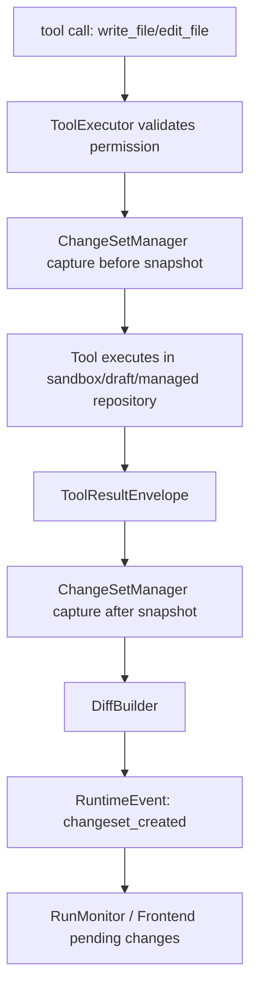

# 066-通用 ChangeSet Diff 预览与回滚运行时方案

日期：2026-06-05

状态：待实施架构方案。本文用于指导后续实现“文件修改 diff 预览、用户接受/拒绝、task milestone、失败回滚”能力。方案覆盖 vibe coding 和写作任务，不只服务代码文件。

## 1. 结论

本项目应新增一套通用 ChangeSet 运行时：

```text
工具副作用 / 写作投影 / artifact 生成
-> ChangeSet 捕获 before/after
-> DiffBuilder 生成可展示差异
-> UI 展示 pending review
-> 用户 accept/reject
-> Publish/Commit 到真实目标
-> RollbackPoint 支持回滚
```

关键设计结论：

- **ChangeSet 是副作用事务，不是权限系统**。权限负责能不能执行，ChangeSet 负责执行后的差异预览、接受、拒绝和回滚。
- **agent 可以继续在 sandbox/draft 中工作**。不能因为等待用户接受真实写入，就阻碍 agent 在隔离环境中验证、迭代和产出。
- **真实项目发布必须有明确接受动作**。sandbox 写入、草稿写入和 artifact 生成可以自动发生；发布到真实项目或官方写作资产需要 ChangeSet accept。
- **代码和写作共用同一事务模型**。代码用 unified diff；写作使用段落级、章节级和结构化字段 diff；artifact 使用元数据和版本 diff。
- **rollback 只回滚本系统可追踪资源**。文件、managed file、artifact、写作仓库可以回滚；外部服务调用、不可逆命令、网络副作用只能记录不可回滚限制。
- **主 agent 不直接决定最终提交**。主 agent 可生成候选变更和建议，用户/系统 commit gate 才是接受、发布和回滚权威。

## 2. 当前源码事实

### 2.1 已有可复用基础

当前系统已经有几类接入点：

```text
backend/runtime/tool_runtime/tool_result_envelope.py
backend/runtime/tool_runtime/native_tools.py
backend/runtime/tool_runtime/sandbox_backend.py
backend/file_management/gateway.py
backend/file_management/receipts.py
backend/artifact_system/artifact_repository_models.py
backend/task_system/writing/artifact_projection_service.py
backend/harness/runtime/run_monitor/projector.py
frontend/src/components/chat/PublicRunActivity.tsx
```

已有事实：

- `ToolResultEnvelope` 已记录 `written_paths`、`artifact_refs`、`file_state_events`、`tool_args`、`execution_receipt`。
- `NativeWriteFileTool` / `NativeEditFileTool` 已在成功后返回文件路径、sha256 和 artifact ref。
- `LocalOverlaySandboxBackend` 已支持 workspace overlay，写入落在 sandbox root，读/搜索可从真实 workspace materialize。
- `FileGateway` 已能处理 managed file 写入，并生成 `FileOperationReceipt`。
- `FileOperationReceipt` 已记录 `before_hash`、`after_hash`、`version_id`、`rollback_ref` 字段。
- `ArtifactRepository` / `ArtifactRecord` 已能记录产物、hash、状态和任务归属。
- `ArtifactProjectionService` 已把写作 artifact 映射到语义目标，但它只做 decision，不移动文件、不提交。
- Run monitor 已能聚合 `artifact_refs`，前端 `PublicRunActivity` 已能展示 task run 活动。

这些结构说明，ChangeSet 不需要重写工具系统；应接在 tool result envelope、file gateway receipt、sandbox publish 和 artifact projection 之间。

### 2.2 当前缺口

当前系统缺的是“变更事务权威”：

- 普通 `write_file` / `edit_file` 成功后只记录 after hash，没有统一 before snapshot。
- sandbox 中的变更会作为 artifact/文件证据出现，但没有统一 diff preview。
- artifact refs 是结果证据，不是用户可接受/拒绝的变更事务。
- 写作 artifact projection 能判断目标，但没有“接受此版本写入正式章节/设定”的统一 commit gate。
- run monitor 展示运行状态，不展示 pending changes、accepted changes、rollback points。
- task run 有状态和 artifact evidence，但没有“第 3 阶段前的可回滚 milestone”。

因此，问题不是缺一个 diff 组件，而是缺一条副作用生命周期链：

```text
candidate change -> preview -> accept/reject -> publish/commit -> rollback
```

## 3. 设计原则

### 3.1 不把 ChangeSet 写成权限补丁

权限系统回答：

```text
这个 agent 当前是否允许执行这个工具？
```

ChangeSet 回答：

```text
这个工具产生了什么变更？
变更是否已被用户或系统接受？
接受后发布到哪里？
失败时可以回滚到哪里？
```

这两个系统不能混淆。ChangeSet 不能因为 pending review 阻止 agent 在 sandbox 里继续工作。

### 3.2 sandbox 是 agent 工作区，真实项目是发布目标

vibe coding 推荐默认链路：

```text
真实项目 workspace: read/materialize
sandbox workspace: write/edit/test
ChangeSet: 记录 sandbox 与真实项目差异
Accept: 发布到真实项目
Reject: 丢弃 sandbox 变更或保留为草稿
Rollback: 从 rollback point 恢复
```

这能避免 agent 被权限卡死，也避免直接污染真实项目。

### 3.3 写作资产需要语义 diff

写作不适合只用 unified diff。应支持：

- 段落级 diff：新增、删除、改写、移动。
- 章节级 diff：标题、正文、摘要、出场角色、伏笔、冲突点。
- 设定字段 diff：世界观字段、角色字段、地点字段。
- 版本说明：为什么改、保留了什么、删除了什么、风险是什么。

写作中的 accept 不等于“保存文件”，而是“把候选版本投影/提交到目标资产”。

### 3.4 子 agent 只能产出候选，不拥有提交权

子 agent 可以创建 ChangeSet candidate，但不能直接决定用户可见最终提交。

主 agent 负责综合多个候选，UI/commit gate 负责接受。

## 4. 目标数据模型

### 4.1 ChangeSet

建议新增：

```text
backend/runtime/changesets/models.py
backend/runtime/changesets/store.py
backend/runtime/changesets/diff_builder.py
backend/runtime/changesets/rollback.py
```

核心结构：

```python
ChangeSet:
    changeset_id: str
    session_id: str
    task_run_id: str
    turn_id: str
    agent_run_id: str
    source_kind: str              # tool_result | sandbox_publish | writing_projection | manual
    domain: str                   # coding | writing | artifact | config | general
    status: str                   # draft | pending_review | accepted | rejected | applied | rolled_back | failed
    title: str
    summary: str
    entries: tuple[ChangeEntry, ...]
    rollback_point_id: str
    milestone_id: str
    verification_refs: tuple[str, ...]
    created_at: float
    updated_at: float
    authority: str = "runtime.changeset"
```

### 4.2 ChangeEntry

```python
ChangeEntry:
    entry_id: str
    changeset_id: str
    resource_kind: str            # file | managed_file | artifact | writing_section | config
    repository_id: str
    logical_path: str
    display_name: str
    operation: str                # create | update | delete | replace | move
    before_ref: str
    after_ref: str
    before_hash: str
    after_hash: str
    diff_ref: str
    diff_kind: str                # unified | paragraph | structured | binary_metadata
    tool_call_id: str
    envelope_id: str
    file_receipt_id: str
    artifact_ref: str
    reversible: bool
    rollback_strategy: str        # restore_before | delete_created | apply_reverse_patch | not_reversible
    limitations: tuple[str, ...]
```

### 4.3 RollbackPoint

```python
RollbackPoint:
    rollback_point_id: str
    session_id: str
    task_run_id: str
    milestone_id: str
    snapshot_refs: tuple[str, ...]
    changeset_ids: tuple[str, ...]
    reversible: bool
    created_at: float
    authority: str = "runtime.rollback_point"
```

### 4.4 Milestone

```python
TaskMilestone:
    milestone_id: str
    task_run_id: str
    title: str
    reason: str
    changeset_ids: tuple[str, ...]
    verification_status: str      # unverified | passed | failed | partial
    rollback_point_id: str
    created_at: float
```

## 5. 存储设计

建议新增目录：

```text
storage/runtime_state/changesets/
  sessions/<session_id>/<changeset_id>.json
  snapshots/<changeset_id>/<entry_id>/before
  snapshots/<changeset_id>/<entry_id>/after
  diffs/<changeset_id>/<entry_id>.diff
  milestones/<task_run_id>/<milestone_id>.json
```

设计要求：

- 大内容不直接塞进 event log，event log 只记录 `changeset_id`、`diff_ref`、`snapshot_ref`。
- snapshot 以 content hash 命名，避免重复保存。
- 对普通文本文件保存 before/after 内容。
- 对二进制或大 artifact 只保存 metadata diff 和 hash。
- 对 managed file 优先复用 `FileOperationReceipt` 的 before/after hash 和 version_id。
- `FileOperationReceipt` 不能单独承担 rollback，因为它当前主要保存 hash 和 version 标识；可回滚内容必须由 ChangeSetStore 保存 before snapshot，或引用 managed file repository 中可恢复的旧版本。

## 6. Diff 类型

### 6.1 代码与普通文本

使用 unified diff：

```text
before content
after content
-> difflib.unified_diff
```

附加统计：

```json
{
  "added_lines": 12,
  "removed_lines": 4,
  "changed_files": 2
}
```

### 6.2 写作正文

使用段落级 diff：

```text
paragraph hash -> align -> mark added/removed/changed/moved
```

UI 展示：

- 左侧旧段落
- 右侧新段落
- 改写原因/风险
- “接受本段”“拒绝本段”“保留旧段并继续生成”

### 6.3 写作结构化资产

对世界观、角色卡、大纲节点使用 JSON/字段 diff：

```json
{
  "field": "character.motivation",
  "before": "复仇",
  "after": "保护妹妹并追查真相",
  "change_kind": "replace"
}
```

### 6.4 Artifact

artifact diff 不强行展示全文：

- path
- content_hash
- size_bytes
- content_type
- artifact_type
- preview text
- linked output contract
- target projection decision

## 7. 运行流程

### 7.1 Tool 写入流程



关键点：

- before snapshot 必须在实际写入前捕获。
- 如果目标不存在，before 标记为 `missing`。
- 如果写入失败，不创建 successful entry，只记录 failed attempt。
- `ToolResultEnvelope` 继续保留现有字段，不替换为 ChangeSet。

### 7.2 Coding sandbox 发布流程

```text
agent 在 sandbox 修改和测试
-> ChangeSet pending_review
-> 用户 Accept
-> ApplyService 将 sandbox after 写入真实 workspace
-> 生成 applied ChangeSet 和 rollback point
```

拒绝时：

```text
Reject -> status=rejected
       -> sandbox 文件可保留为诊断草稿，也可按 retention policy 清理
```

### 7.3 Writing 接受流程

```text
agent 生成 draft artifact / managed draft
-> ArtifactProjectionService 判断语义目标
-> ChangeSet 展示章节/字段 diff
-> 用户 Accept
-> WritingCommitService 写入目标 repository/section
-> 生成 FileCommitReceipt / RollbackPoint
```

写作中不应把“生成了一份草稿”误报为“正式章节已更新”。只有 accepted/applied 才是正式资产更新。

### 7.4 失败回滚流程

验证失败时：

```text
verification failed
-> task milestone 标记 failed
-> runtime 提供 suggested_rollback_points
-> 用户或系统策略选择 rollback
```

默认不自动回滚，因为失败结果也可能是有价值的中间成果。只有以下情况可自动回滚：

- ChangeSet 仍在 sandbox/draft。
- 没有用户接受过。
- rollback strategy 是 `delete_created` 或 `restore_before`。
- task policy 明确允许 auto rollback。

### 7.5 直接真实 workspace 写入

如果运行模式明确允许直接写真实 workspace，例如用户授予 full access 或 task grant，ChangeSet 仍然必须记录：

```text
before snapshot
after snapshot
diff
rollback point
status=applied
```

这种模式下不再等待 accept 才写入，因为权限已经允许真实副作用；但 UI 仍要展示 diff，并提供 rollback。也就是说：

- sandbox 模式：pending_review -> accept -> applied。
- direct 模式：applied -> 可 rollback。

direct 模式不能用于绕过 project binding。没有 session project binding 的 coding ChangeSet 不允许 publish/apply 到用户项目，只能保留在 sandbox/draft 或提示用户绑定项目。

## 8. API 设计

建议新增：

```text
GET  /api/sessions/{session_id}/changesets
GET  /api/tasks/runs/{task_run_id}/changesets
GET  /api/changesets/{changeset_id}
GET  /api/changesets/{changeset_id}/diff
POST /api/changesets/{changeset_id}/accept
POST /api/changesets/{changeset_id}/reject
POST /api/changesets/{changeset_id}/rollback
GET  /api/tasks/runs/{task_run_id}/milestones
POST /api/tasks/runs/{task_run_id}/milestones
```

accept payload：

```json
{
  "entry_ids": ["entry:1", "entry:2"],
  "target": "real_workspace",
  "reason": "用户接受本次修改"
}
```

rollback payload：

```json
{
  "rollback_point_id": "rbp:...",
  "reason": "验证失败，回到测试前版本"
}
```

## 9. 前端设计

新增 UI 区域：

```text
Session Page
  ├─ Chat
  ├─ Activity
  ├─ Pending Changes
  │   ├─ ChangeSet list
  │   ├─ Diff viewer
  │   ├─ Accept / Reject
  │   └─ Rollback
  └─ Milestones
```

编码 diff：

- 文件列表
- added/removed line count
- unified diff
- accept file / accept all

写作 diff：

- 章节/段落标签页
- 段落级变更
- 字段级变更
- 接受单段 / 接受全章 / 拒绝本轮

前端初期可以先做文本 unified diff 和 artifact 列表；写作段落 diff 放第二阶段。

## 10. Prompt 与 agent 行为

需要新增 prompt 规则：

```text
当工具返回 ChangeSet pending_review 时，你不能声称真实项目已经完成修改。
你应说明变更已在 sandbox/draft 中完成，并等待用户接受或要求继续修改。
如果 ChangeSet 被拒绝，你需要基于拒绝原因重新修改，而不是重复提交相同变更。
如果 ChangeSet 已接受并应用，才可以把真实项目修改作为完成证据。
```

对写作 agent：

```text
你可以生成候选草稿，但不能把候选草稿说成正式设定或正式章节。
正式写入以 ChangeSet accepted/applied 或 WritingCommitReceipt 为准。
```

## 11. 分阶段实施计划

### Phase 1：ChangeSet 核心模型与存储

目标：

- 新增 ChangeSet、ChangeEntry、RollbackPoint、TaskMilestone 数据模型。
- 新增 ChangeSetStore。
- 支持文本 before/after snapshot 与 unified diff。

涉及文件：

```text
backend/runtime/changesets/models.py
backend/runtime/changesets/store.py
backend/runtime/changesets/diff_builder.py
backend/runtime/changesets/__init__.py
backend/tests/changeset_store_regression.py
```

完成标准：

- 能创建 ChangeSet。
- 能保存 before/after snapshot。
- 能生成 unified diff。
- 能按 session/task_run 查询。

### Phase 2：工具写入接入

目标：

- 在 `ToolExecutor` 或 `NativeWriteFileTool` / `NativeEditFileTool` 前后捕获 snapshot。
- 把 ChangeSet refs 写入 `ToolResultEnvelope.structured_payload`。
- runtime event log 增加 `changeset_created` 事件。

涉及文件：

```text
backend/runtime/tool_runtime/tool_executor.py
backend/runtime/tool_runtime/native_tools.py
backend/runtime/tool_runtime/tool_result_envelope.py
backend/runtime/shared/events.py
backend/tests/changeset_tool_runtime_regression.py
```

完成标准：

- `write_file` 创建文件能生成 create diff。
- `edit_file` 修改文件能生成 update diff。
- 失败写入不生成 accepted entry。
- sandbox 中路径不泄漏到模型可见输出。

### Phase 3：sandbox publish 与 accept/reject API

目标：

- 新增 ChangeSet accept/reject/rollback API。
- coding sandbox 的真实 workspace publish 必须走 accept。
- 支持单文件接受和全量接受。

涉及文件：

```text
backend/api/changesets.py
backend/harness/runtime/sandbox_artifacts.py
backend/runtime/changesets/apply_service.py
backend/tests/changeset_api_regression.py
backend/tests/sandbox_changeset_publish_regression.py
```

完成标准：

- pending ChangeSet 可接受并应用到真实 workspace。
- reject 不影响真实 workspace。
- accept 后生成 rollback point。

### Phase 4：前端 diff 预览

目标：

- Session 页面展示 pending changes。
- 支持 unified diff viewer。
- 支持 accept/reject/rollback 操作。

涉及文件：

```text
frontend/src/lib/api.ts
frontend/src/components/chat/ChangeSetPanel.tsx
frontend/src/components/chat/DiffViewer.tsx
frontend/src/components/chat/SessionActivityBar.tsx
frontend/src/components/chat/PublicRunActivity.tsx
frontend/src/components/chat/ChangeSetPanel.test.tsx
```

完成标准：

- task run 修改文件后 UI 能看到 diff。
- 用户可接受或拒绝。
- 接受/拒绝状态实时更新。

### Phase 5：写作语义 diff 与投影 commit

目标：

- 接入 `ArtifactProjectionService`。
- 新增写作段落 diff 和结构化字段 diff。
- accept 后写入 managed writing target。

涉及文件：

```text
backend/task_system/writing/artifact_projection_service.py
backend/task_system/writing/change_projection.py
backend/runtime/changesets/writing_diff.py
backend/file_management/gateway.py
backend/tests/writing_changeset_projection_regression.py
frontend/src/components/chat/WritingDiffViewer.tsx
```

完成标准：

- 章节草稿能形成 pending ChangeSet。
- UI 展示段落/字段 diff。
- accept 后才进入正式写作仓库。
- rollback 能恢复上一版本。

### Phase 6：Milestone 与失败回滚

目标：

- task run 每个阶段可创建 milestone。
- 验证失败时展示 suggested rollback points。
- 用户可回到某个 milestone。

涉及文件：

```text
backend/harness/loop/task_executor.py
backend/harness/runtime/run_monitor/projector.py
backend/runtime/changesets/milestones.py
backend/tests/task_milestone_rollback_regression.py
```

完成标准：

- task run 能查询 milestones。
- 每个 milestone 关联 ChangeSet。
- rollback 后文件内容、ChangeSet 状态和 monitor 状态一致。

## 12. 验证矩阵

| 场景 | 必须验证 |
|---|---|
| 新建代码文件 | pending ChangeSet、create diff、accept 后真实文件存在 |
| 修改代码文件 | before/after snapshot、unified diff、rollback 恢复旧内容 |
| reject 变更 | 真实 workspace 不变，ChangeSet 状态 rejected |
| sandbox 测试失败 | 生成 suggested rollback point，不自动破坏成果 |
| 写作章节改写 | 段落 diff 正确，未 accept 前正式章节不变 |
| 写作设定字段变更 | 字段 diff 正确，accept 后 managed file receipt 存在 |
| 大文件 | snapshot 外置，event log 不膨胀 |
| 二进制 artifact | metadata diff，不尝试文本 diff |
| 子 agent 产出候选 | 父 agent/用户接受前不算正式提交 |
| session 断开重连 | pending ChangeSet 和 milestone 可恢复 |

## 13. 风险控制

- 不允许用 ChangeSet 绕过文件权限。
- 不允许 accept 越过 project binding 的 workspace root。
- 未绑定项目的 coding ChangeSet 不允许发布到真实 workspace；只能保留为 sandbox/draft 或要求用户先绑定项目。
- 不允许 agent 把 pending_review 当作 applied。
- 不允许 rollback 删除未由本系统创建或快照的外部文件。
- 对大文件和二进制文件必须存 metadata diff。
- 对 terminal 命令只记录影响线索，不承诺可回滚。
- 对写作正式资产必须经过 writing commit gate。

## 14. 旧链路处理

实施时不要保留一套“旧 artifact 成果”和一套“新 ChangeSet 成果”长期并行。

迁移策略：

- `artifact_refs` 继续作为产物证据存在。
- 涉及副作用的 artifact/file result 同时生成 ChangeSet ref。
- 前端优先展示 ChangeSet；没有 ChangeSet 的旧运行才回退 artifact refs。
- 写作 projection 从“只给 decision”升级为“decision + ChangeSet candidate”。

删除/弱化旧逻辑：

- 不再把 `artifact_refs` 当作唯一可交付状态。
- 不再只用 tool text 判断文件是否已改。
- 不再让正式写作资产依赖 agent 文本声明。

## 15. 非目标

- 不做 Git commit 替代品。
- 不把所有 terminal 副作用都伪装成可回滚。
- 不要求每个普通聊天回答都有 ChangeSet。
- 不让 ChangeSet 接管权限系统。
- 不在第一阶段实现复杂三方 merge。

## 16. 最小可交付版本

最小版本只需要做到：

```text
write_file/edit_file
-> before/after snapshot
-> unified diff
-> pending ChangeSet
-> UI accept/reject
-> accept 发布真实 workspace
-> rollback 恢复上一版
```

写作增强可在第二轮加入，但数据模型必须从第一天就支持 `resource_kind=writing_section` 和 `diff_kind=paragraph/structured`，避免后续重构。
