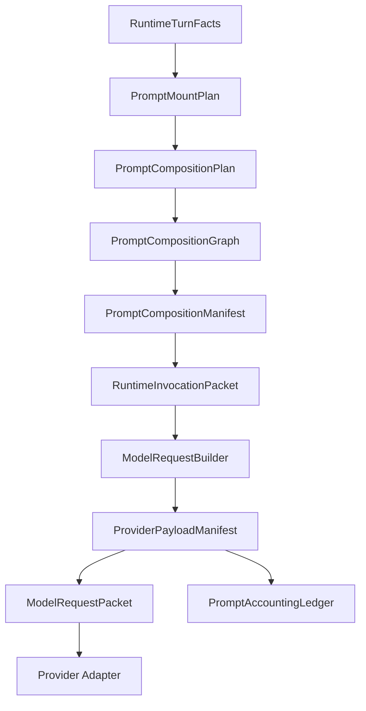

# PromptCompositionGraph 装配系统蓝图

日期：2026-06-09

## 结论

本项目需要先建立稳定的结构化 prompt 装配系统，再讨论缓存优化。缓存命中率只能作为装配稳定性的诊断指标，不能反向决定 agent 形态、工具可见性或 prompt 选择。

推荐采用 `PromptCompositionGraph` 路线：把当前散落在 `RuntimeCompiler`、`PromptAssemblyService`、`PromptMountPlan`、`ModelRequestBuilder`、`CanonicalPromptSerializer` 里的装配判断拆成一条单向权威链。所有 prompt 来源先进入 slot/section graph，再生成 prompt composition manifest；provider 层只把 manifest 映射成 provider-visible payload manifest，不再临时拼接或重新裁决。

目标不是新增一个更大的字符串 compiler，而是建立一个像 Codex/Claude Code 一样的结构化请求包体系：

```text
RuntimeTurnFacts
  -> PromptMountPlan
  -> PromptCompositionPlan
  -> PromptCompositionGraph
  -> PromptCompositionManifest
  -> RuntimeInvocationPacket
  -> ProviderPayloadManifest
  -> ModelRequestPacket
  -> PromptAccountingLedger
```

## 外部源码参考

### Codex 装配原则

本轮核对目录：`D:\AI应用\openai-codex`。

关键文件：

- `D:\AI应用\openai-codex\codex-rs\core\src\client_common.rs`
- `D:\AI应用\openai-codex\codex-rs\core\src\client.rs`
- `D:\AI应用\openai-codex\codex-rs\core\src\context\fragment.rs`

观察结论：

- Codex 的 `Prompt` 是一等模型请求包，字段分离为 `input`、`tools`、`parallel_tool_calls`、`base_instructions`、`personality`、`output_schema`、`output_schema_strict`。这说明成熟 agent 不把系统提示、工具、上下文和输出 schema 压成一个匿名字符串。
- provider request 构建集中在 `build_responses_request()`，它把结构化 `Prompt` 映射为 `instructions`、`input`、`tools`、`parallel_tool_calls`、`reasoning`、`prompt_cache_key`、`text` 等 provider 字段。adapter 层只映射，不重新选择 prompt。
- `ContextualUserFragment` 要求每个上下文注入片段声明 `role`、`markers`、`body`，并能被后续上下文过滤识别。这比裸字符串拼接可靠，因为注入来源、边界和清理规则都可审计。

应借鉴：

- prompt 输入、工具目录、base instructions、输出 schema、provider 参数必须分字段保留到最后一层。
- 动态上下文必须是 typed fragment，有 role、markers、source、lifecycle、volatility reason。
- provider adapter 只能做 canonicalization 和字段映射，不能再次决定 agent 语义。

不照搬：

- 不直接复制 Codex 的 Responses API 字段命名；本项目需要兼容 DeepSeek/OpenAI/Anthropic 形态，因此使用 provider-neutral 的 `ProviderPayloadManifest`。

### Claude Code 装配原则

本轮核对目录：

- `D:\AI应用\claude-code-nb-main`
- `D:\AI应用\Claude-Code-Source-Study-main`

关键文件：

- `D:\AI应用\claude-code-nb-main\constants\systemPromptSections.ts`
- `D:\AI应用\claude-code-nb-main\constants\prompts.ts`
- `D:\AI应用\claude-code-nb-main\utils\toolSchemaCache.ts`
- `D:\AI应用\claude-code-nb-main\tools.ts`
- `D:\AI应用\claude-code-nb-main\QueryEngine.ts`

观察结论：

- `systemPromptSection()` 是 session 内 memoized section；`DANGEROUS_uncachedSystemPromptSection()` 显式声明每轮重算，并要求 reason。这是代码级的 cache/生命周期边界。
- `SYSTEM_PROMPT_DYNAMIC_BOUNDARY` 明确分开跨组织/全局可缓存的静态段和用户/会话相关动态段。动态不等于每轮变化，很多 dynamic section 仍是 session-stable。
- `toolSchemaCache.ts` 说明工具 schema 位于 provider 请求中的 system prompt 前方，字节级变化会破坏工具块及下游缓存，所以它使用 session-scoped cache 锁定渲染后的 schema bytes。
- `assembleToolPool()` 把 built-in tools 和 MCP tools 分区排序，保持 built-in tools 为连续前缀，避免 MCP tool 插入破坏全局 cache breakpoint。
- `QueryEngine` 先准备 `defaultSystemPrompt`、`userContext`、`systemContext`、`tools`、messages，再进入 query loop。loop 消费结构化输入，不承担 prompt 来源选择。

应借鉴：

- prompt section 注册化，并把 session-stable / volatile 明确成不同 API 或 manifest 字段。
- 任何每轮变化的 system section 必须给出 reason，默认不允许静默破坏 stable prefix。
- tool schema 是 provider-visible payload 的一等稳定段；工具可见性变化是语义变化，schema 字节漂移是装配问题。
- tool pool 需要稳定排序策略，不能让动态 MCP 工具插入破坏 built-in prefix。

不照搬：

- 不把 Claude Code 的 global cache boundary 当成唯一目标。本项目的核心是自由装配 agent 形态，因此需要多级生命周期：`global_static`、`agent_shape_stable`、`environment_stable`、`lifecycle_stable`、`capability_stable`、`task_contract_stable`、`runtime_dynamic`、`conversation_volatile`。

## 本项目当前问题

关键文件：

- `D:\AI应用\langchain-agent\backend\harness\runtime\compiler.py`
- `D:\AI应用\langchain-agent\backend\prompt_library\assembly.py`
- `D:\AI应用\langchain-agent\backend\prompt_library\models.py`
- `D:\AI应用\langchain-agent\backend\prompt_library\manifest.py`
- `D:\AI应用\langchain-agent\backend\harness\runtime\environment_prompt_controller.py`
- `D:\AI应用\langchain-agent\backend\harness\runtime\prompt_segment_plan.py`
- `D:\AI应用\langchain-agent\backend\runtime\model_gateway\model_request.py`
- `D:\AI应用\langchain-agent\backend\runtime\prompt_accounting\serializer.py`
- `D:\AI应用\langchain-agent\backend\runtime\prompt_accounting\cache_planner.py`
- `D:\AI应用\langchain-agent\backend\prompting\*`

当前权责问题：

| 层 | 当前状态 | 问题 |
|---|---|---|
| `PromptMountPlan` | 能选择 environment/personality/lifecycle refs | 只停在 refs 层，没有成为最终 slot/order/cache boundary |
| `PromptAssemblyService` | 从 pack/ref/resource 生成 `PromptAssemblyResult` | `content` 仍是简单 join；precedence 明确是 diagnostic-only |
| `RuntimePromptManifest` | 记录 stable refs、volatile refs、cache_boundary 概览 | 粒度偏统计，不能描述 slot、section、message、provider payload 关系 |
| `RuntimeCompiler` | 多个 invocation 方法手写 `_message_spec(...)` | 事实上的最终装配权威散落在 compiler 分支里 |
| `PromptSegmentPlan` | 规划 message segment 的 cache role/prefix tier | 只覆盖 messages，不覆盖 tools、tool options、provider params |
| `ModelRequestBuilder` | normalize messages/tools，绑定 message segment | stable prefix hash 仍来自 message binding，不含 tool schema boundary |
| `CanonicalPromptSerializer` | 事后追加 `tool_schema` segment | 硬编码 `cache_role=never_cache`，serializer 越权裁决 |
| `PromptCachePlanner` | 从 segment map 连续 stable prefix 生成 cache key | 只看线性 message/tool 账本，不消费 provider-visible manifest |
| `backend/prompting/*` | 旧 prompt builder/cache/manifest 链 | 与新 `prompt_library` 并行，后续必须删除或隔离 |

核心失败模式：本项目已经有 prompt 资源库、环境挂载、动态上下文、segment plan 和 cache 诊断，但缺少一个中间的 `PromptCompositionGraph` 作为唯一装配主权。结果是每个层都补一点判断，最后由 `RuntimeCompiler` 手写消息顺序。

## 推荐设计

### 核心对象

避免与已有 `prompt_manifest`、`segment_plan` 重名，采用以下对象：

| 对象 | 职责 |
|---|---|
| `RuntimeTurnFacts` | 本轮可观察事实：profile、environment、permission、tools、skills、memory、history refs、invocation kind |
| `PromptCompositionPlan` | 由 facts 和 mount plan 生成 slot 列表，声明每个 slot 的 layer、target role、lifecycle、cache class |
| `PromptCompositionSlot` | prompt 装配最小权威单位，包含 `slot_id`、`layer`、`source_ref`、`target_role`、`lifecycle`、`prefix_tier`、`cache_role`、`required`、`order` |
| `PromptCompositionGraph` | 从 registry 展开 slot 为 section graph，校验 active/deprecated/scope/rule/conflict/order |
| `PromptCompositionManifest` | 最终 prompt section 图和渲染结果，记录 hash、slot、source、stable/dynamic boundary、rejected refs |
| `DynamicContextFragment` | 动态上下文 typed fragment，包含 role、markers、body、source、lifecycle、volatility reason、token budget |
| `ToolCatalogManifest` | 可见工具目录，包含 canonical schema、排序、hash、visibility reason、authorization scope |
| `ProviderPayloadManifest` | provider 实际可见 payload：tools、tool options、messages、response format、request params、cache boundary |
| `ProviderPayloadSegment` | provider payload 最小账本段，标注 transport location、hash、cache role、prefix tier |
| `PromptAssemblyTrace` | 装配审计记录，说明每个 slot/section 从何而来、为何被接受或拒绝 |

### Slot 层级

装配顺序按语义生命周期定，不按缓存硬凑：

```text
global_static
agent_shape_stable
personality_stable
environment_base_stable
environment_overlay_stable
lifecycle_stable
capability_stable
agent_stable
skill_stable
project_instruction_stable
tool_guidance_stable
task_contract_stable
runtime_dynamic
history_volatile
current_user_volatile
```

规则：

- 自由装配优先：pack、profile、environment、personality、lifecycle、tool guidance、skill、project instruction、task contract 都可以组合。
- cache 只是 slot 的生命周期/稳定性标注，不允许删除 prompt、隐藏工具或压平 agent 形态。
- lifecycle prompt 可以动态选择，但一旦本轮生命周期确定，必须进入固定 slot，不能在 compiler 里临时拼。
- 不确定是否稳定时，标为 `volatile` 或 `key_only_dynamic`，不要伪装成 stable。
- 同 agent 形态下 section 顺序、标题、换行、tool schema 排序、skill 排序必须稳定。

### Provider Payload 层

`ProviderPayloadManifest` 必须覆盖 provider 可见的完整输入：

| transport location | segment kind | 默认 cache role | 说明 |
|---|---|---|---|
| `tools` | `tool_schema_catalog` | `session_stable` | canonical tool schema，按稳定策略排序 |
| `tool_call_options` | `tool_authorization_delta` | `volatile` 或 key-only | tool choice、parallel tool calls、strict、权限差异 |
| `messages` | `message:*` | 继承 composition manifest | stable/dynamic/volatile messages |
| `response_format` | `structured_output_schema` | `session_stable` 或 `task` | 输出 schema 是 provider-visible payload |
| `request_params` | `provider_params` | key-only | provider、model、base_url、temperature、reasoning/thinking 等 |

工具 schema 不能继续由 serializer 事后追加并硬编码为 `never_cache`。serializer 只能把 `ProviderPayloadManifest` 的裁决落账。

### 稳定工具目录规则

- built-in tools 和 external/MCP tools 分区排序，built-in tools 保持连续稳定前缀。
- 分区内按 canonical tool name 排序。
- tool schema 只包含 provider 实际发送字段：name、description、schema、strict 等。
- 删除非语义运行字段：turn_id、request_id、task_run_id、审批状态、临时 cwd、时间戳。
- 工具权限变化不直接混进 stable schema；进入 `tool_authorization_delta` 或 cache-sensitive params。
- tool count、name、schema hash、binding options 任一变化都必须在 diagnostics 中可见。

## 固定执行流



权威规则：

- `RuntimeCompiler` 只选择 invocation kind，并把 facts 交给 composition planner。
- `PromptCompositionPlanner` 决定 slot/order/cache class。
- `PromptCompositionGraphBuilder` 决定 section 展开和规则校验。
- `RuntimeInvocationPacket` 只携带 manifest、dynamic fragments、available tools、output schema，不重新选择 refs。
- `ModelRequestBuilder` 是 provider payload manifest 的唯一创建者。
- `PromptCachePlanner` 只消费 provider payload cache boundary，不再从 message index 猜 prefix。
- `CanonicalPromptSerializer` 只序列化 manifest，不裁决 cache role。

## 文件级实施计划

### 阶段 0：新增结构，shadow mode 运行

新增：

- `backend/prompt_composition/models.py`
- `backend/prompt_composition/planner.py`
- `backend/prompt_composition/graph.py`
- `backend/prompt_composition/manifest.py`
- `backend/prompt_composition/tracing.py`

接入：

- `backend/harness/runtime/compiler.py`
- `backend/prompt_library/assembly.py`
- `backend/harness/runtime/environment_prompt_controller.py`

目标：

- 生成 `PromptCompositionPlan` 和 `PromptCompositionManifest`，但暂不替换现有 compiler 输出。
- 对 `single_agent_turn`、`task_execution`、`tool_observation_followup`、`semantic_compaction` 生成 shadow manifest。
- manifest 必须能解释当前 `_message_spec(...)` 每一段来自哪个 slot。

验收：

- 不改变 provider 请求内容。
- 新 manifest 与当前 segment plan 的 kind/order 能建立映射。
- 找不到映射的 compiler 手写段必须记录为 `unmapped_legacy_segment`。

### 阶段 1：RuntimeCompiler 切换为消费 composition manifest

改造：

- `backend/harness/runtime/compiler.py`
- `backend/harness/runtime/invocation_packet.py`
- `backend/harness/runtime/dynamic_context.py`
- `backend/prompt_library/assembly.py`

目标：

- `RuntimeCompiler` 不再手写最终 stable prompt 顺序，只从 `PromptCompositionManifest` 渲染 message slots。
- 动态上下文从单个 payload 拆为 `DynamicContextFragment[]`。
- lifecycle/environment/personality/agent/skill/project/task contract 都以 slot 形式进入 manifest。

删除/限制：

- 禁止新增未登记 `_message_spec(...)` stable 段。
- 旧 `_join_prompt_sections()` 只能作为 manifest renderer 的内部工具，不再拥有装配主权。

验收：

- 所有 model message 都能追溯到 slot 或 dynamic fragment。
- 修改 environment refs、lifecycle trigger、skill refs 时，manifest hash 和 source trace 正确变化。
- 单轮聊天仍可在后续转入工具调用，不能为了缓存移除工具。

### 阶段 2：ProviderPayloadManifest 接管 provider-visible payload

新增/改造：

- `backend/runtime/model_gateway/provider_payload_manifest.py`
- `backend/runtime/model_gateway/model_request.py`
- `backend/runtime/prompt_accounting/models.py`
- `backend/runtime/prompt_accounting/serializer.py`

目标：

- `ModelRequestBuilder` 在 normalize messages/tools 后生成 `ProviderPayloadManifest`。
- `ModelRequestPacket` 增加 `provider_payload_manifest`。
- `tool_schema_catalog` 成为 provider payload segment，默认 `session_stable`。
- serializer 删除 `tool_schema=never_cache` 的决策权。

验收：

- 带工具请求的账本中存在 `kind=tool_schema_catalog`。
- 连续两轮同工具集合的 `tool_catalog_hash` 稳定。
- 修改工具 schema 会改变 hash 并产生诊断，而不是被吞掉。

### 阶段 3：Cache planner 改为消费 provider payload boundary

改造：

- `backend/runtime/prompt_accounting/cache_planner.py`
- `backend/runtime/prompt_accounting/cache_baseline.py`
- `backend/runtime/prompt_accounting/stability_report.py`
- `backend/runtime/prompt_accounting/cache_break_detector.py`
- `backend/runtime/model_gateway/provider_cache_policy.py`

目标：

- cache key 使用 `provider_payload_prefix_hash`、`tool_catalog_hash`、`cache_sensitive_params_hash`。
- repeated miss 能归因到 tool schema、tool options、provider params、stable message prefix 或 provider best-effort。

验收：

- 修改 user message 不改变 tool catalog hash。
- 修改 tool schema 或 tool binding options 能明确改变对应 hash。
- DeepSeek usage 中 `prompt_cache_hit_tokens` / `prompt_cache_miss_tokens` 仍是最终真实命中依据。

### 阶段 4：清理旧链路

审查并处理：

- `backend/prompting/builder.py`
- `backend/prompting/manifest.py`
- `backend/prompting/prompt_cache.py`
- `backend/prompting/long_term_context.py`
- `backend/tests/prompt_cache_regression.py`
- `backend/tests/prompt_long_term_context_regression.py`
- `backend/tests/prompt_tool_visibility_regression.py`

目标：

- 如果旧 `backend/prompting/*` 不再服务主 runtime，删除或降级为明确 legacy artifact。
- 保留的旧测试必须改成验证新 composition/provider payload 行为，而不是保护旧内部形状。

验收：

- 主 runtime 只有一条 prompt 装配权威链。
- `rg "from prompting|import prompting"` 不再指向主 runtime 入口。

## 验证矩阵

必须覆盖：

- `single_agent_turn` 普通聊天：稳定 slots 存在，用户消息位于 volatile suffix。
- 普通聊天转工具调用：工具目录不被缓存优化隐藏。
- `task_execution`：task contract、graph node context、artifact scope 分别处于正确 lifecycle/cache tier。
- `tool_observation_followup`：observation 只进入 volatile/dynamic fragment，不插入 stable prefix。
- `semantic_compaction`：交接包是结构化 boundary/context item，不是普通隐藏 user message。
- 工具 schema：排序稳定，hash 可诊断，serializer 不再 hardcode `never_cache`。
- DeepSeek cache：内部预测 hash 与 provider usage hit/miss 分开记录。

建议命令：

```powershell
python -m pytest backend\tests\model_runtime_regression.py -q
python -m pytest backend\tests\harness_single_agent_tool_runtime_regression.py -q
python -m pytest backend\tests\deepseek_prompt_cache_diagnostics_test.py -q
python -m pytest backend\tests\prompt_cache_prefix_tier_regression.py -q
python backend\scripts\diagnose_deepseek_prompt_cache.py --limit 8 --json
```

涉及真实会话接口时，必须使用固定端口实测：

```powershell
python -m uvicorn backend.main:app --host 127.0.0.1 --port 8003
npm run dev -- --hostname 127.0.0.1 --port 3000
```

## 禁止事项

- 禁止继续把 `RuntimeCompiler` 扩写成更复杂的 if/else message builder。
- 禁止为了 cache 命中隐藏工具、删除 prompt、减少 agent 形态。
- 禁止把 run_id、turn_id、request_id、时间戳、token 压力、实时状态写进 stable prefix。
- 禁止 serializer 决定 cache role。
- 禁止保留旧 prompt 主链路作为“兼容兜底”，除非有明确迁移窗口和删除条件。

## 待确认

建议确认后按阶段 0 开始实施。阶段 0 是 shadow mode，不改变 provider 请求内容，主要用于把现有手写装配映射到 `PromptCompositionGraph`，找出不可映射的旧逻辑，再进入阶段 1 切换主链路。

## 本轮收尾状态

收尾日期：2026-06-09

本轮已经完成阶段 0 的 shadow-mode 骨架，并补强了一部分缓存诊断链路；尚未进入阶段 1/2 的主链替换。当前状态必须按“shadow manifest + diagnostics 已落地”理解，不能误认为 `ProviderPayloadManifest` 已经接管 provider-visible payload。

### 已完成

- 新增并接入 `backend/prompt_composition/*` 的 shadow manifest 体系，覆盖 plan、graph、manifest、tracing 与 cache boundary diagnostics。
- `RuntimeInvocationPacket` / runtime prompt manifest 能携带 `prompt_composition` 诊断，测试覆盖 single agent turn 与 task execution 的 shadow manifest 映射。
- 真实 `RuntimeCompiler` 入口的 shadow manifest 已收紧到无 `legacy_runtime_text` 残留；`semantic_compaction_stable_boundary` 已归类为明确的 `semantic_compaction_boundary` 生命周期边界。
- `PromptCompositionManifest` 已新增 `message_projection`，记录每条模型消息的 segment、role、message hash、slot binding 与 source kind；projection 不复制原始 prompt content，作为后续正式 renderer 的消费边界。
- `PromptAssemblyService` / runtime prompt manifest 增加 assembly request fingerprint、section fingerprint 等稳定性诊断字段。
- `PromptCachePlanner` 能把 prompt manifest 与 composition diagnostics 写入 cache record。
- `PromptCacheBreakDetector` 能区分 `prompt_assembly_request_changed`、`prompt_section_fingerprint_changed`，并把 prompt assembly/composition 细节带入 break record。
- `diagnose_deepseek_prompt_cache.py` 支持 prompt composition 字段、cache break detail、ledger tail window，并修复大 JSONL 读取导致的 OOM 风险。
- prompt accounting 旧 ledger 已归档清理，活跃 ledger 只保留最近窗口与当前 schema 相关记录。

### 未完成

- `RuntimeCompiler` 尚未切换为只从 `PromptCompositionManifest` 渲染最终 messages；当前仍保留 shadow-mode 映射。
- `ProviderPayloadManifest` 已具备首版实现，并由 `ModelRequestBuilder` 创建 provider-visible payload manifest；tool schema、messages、`tool_call_options`、`response_format`、`provider_params` 已完成首轮 segment 覆盖。后续仍需 live e2e 与更多 provider-specific 字段审计。
- serializer 中 tool schema 的 cache role 主权已迁移给 provider payload manifest；缺少 manifest 时只能记录为 `never_cache`，不能再根据 stable tool index 自行提升。
- `backend/prompting/*` 旧链路尚未完成删除或 legacy 隔离。
- `harness_single_agent_tool_runtime_regression.py` 当前单文件超过 3 分钟未收敛，需要作为工具运行时/流式输出专项排查，不能算本轮 prompt composition 计划的通过项。

### 验证记录

- `python -m pytest backend\tests\deepseek_prompt_cache_diagnostics_test.py backend\tests\prompt_cache_prefix_tier_regression.py backend\tests\prompt_composition_shadow_regression.py -q`：34 passed。
- `python -m pytest backend\tests\model_runtime_regression.py -q`：56 passed。
- `python -m pytest backend\tests\memory_maintenance_agent_regression.py -q`：15 passed。
- `python -m pytest prompt_* + deepseek/live cache/prompt accounting 相关测试`：111 passed。
- serializer 主权迁移后，`python -m pytest backend\tests\prompt_cache_prefix_tier_regression.py backend\tests\tool_catalog_manifest_regression.py -q`：20 passed。
- provider option segment 追加后，`python -m pytest backend\tests\prompt_cache_prefix_tier_regression.py -q`：15 passed；`tool_catalog_manifest_regression.py + prompt_cache_break_detector_regression.py + deepseek_prompt_cache_diagnostics_test.py + model_runtime_regression.py`：81 passed；prompt/cache 较宽套件：119 passed。
- live runtime accounting 审计后，`python -m pytest backend\tests\model_runtime_regression.py::test_model_runtime_prompt_stability_records_tool_call_options -q`：1 passed；`python -m pytest backend\tests\model_runtime_regression.py -q`：56 passed；`prompt_cache_prefix_tier_regression.py + tool_catalog_manifest_regression.py + prompt_cache_break_detector_regression.py + deepseek_prompt_cache_diagnostics_test.py`：40 passed。
- shadow manifest legacy 分类清理后，`python -m pytest backend\tests\prompt_composition_shadow_regression.py -q`：8 passed；`prompt_composition_shadow_regression.py + prompt_cache_prefix_tier_regression.py + prompt_cache_break_detector_regression.py + deepseek_prompt_cache_diagnostics_test.py`：42 passed；`model_runtime_regression.py`：56 passed。
- message projection 追加后，`python -m pytest backend\tests\prompt_composition_shadow_regression.py -q`：8 passed；`prompt_composition_shadow_regression.py + prompt_cache_prefix_tier_regression.py + prompt_cache_break_detector_regression.py + deepseek_prompt_cache_diagnostics_test.py`：42 passed；`model_runtime_regression.py`：56 passed。
- `python backend\scripts\diagnose_deepseek_prompt_cache.py --limit 8 --json`：可正常完成；`unplanned_model_call_breaks=0`，`repeated_prefix_provider_miss` 不再作为活跃问题出现。

### 当前诊断残留

DeepSeek cache 诊断仍报告 1 个 `stable_segment_content_changes`，来源是图任务 `task_execution` 的 `global_static` segment。它不是 durable memory 或 utility prompt 的旧 source 污染；后续应在图任务主线中追查同一 task scope 内为何有两组 `global_static` content hash。

### 下一阶段边界

下一轮如果继续升级，必须沿阶段 1/2 继续推进两件事：一是让 `RuntimeCompiler` 退出 shadow-mode，改为消费 `PromptCompositionManifest` 渲染最终 messages；二是继续审计 live request 中 provider-specific 字段是否都进入 `ProviderPayloadManifest` 或明确被排除。不要继续在 serializer/cache planner 里追加新的推断逻辑。

### 主权迁移追加收尾

日期：2026-06-09

- 删除 `CanonicalPromptSerializer` 内部的工具 schema cache role 推断 fallback。
- 新增 `serializer_requires_provider_payload_manifest_to_promote_tool_schema` 回归，锁定规则：没有 `ProviderPayloadManifest` 时，serializer 不允许把工具 schema 提升为 stable cache segment。
- `ProviderPayloadManifest` 已把 key-only provider-visible 输入拆成独立段：`tool_call_options`、`response_format`、`provider_params`。
- `cache_sensitive_params_hash` 由 provider params、tool call options、response format 共同生成；这些段不进入 stable prefix，但会进入本地 cache key 和 break attribution。
- `PromptCacheBreakDetector` 已细分 cache-sensitive params 变化原因：`tool_binding_options_changed`、`response_format_changed`、`provider_params_changed`。
- live `_begin_prompt_accounting` 已验证会把真实 `tool_call_options` 与 provider params 写入 provider payload diagnostics；当前 runtime 尚无 provider `response_format` 参数来源，因此 live path 中 `response_format_segment_count=0` 是预期状态，不能用假字段制造覆盖。
- 当前主权链调整为：

```text
ModelRequestBuilder
  -> ProviderPayloadManifest(tool_schema_catalog + key-only provider option segments)
  -> CanonicalPromptSerializer(serialize only)
  -> PromptCachePlanner(provider payload boundary)
```
