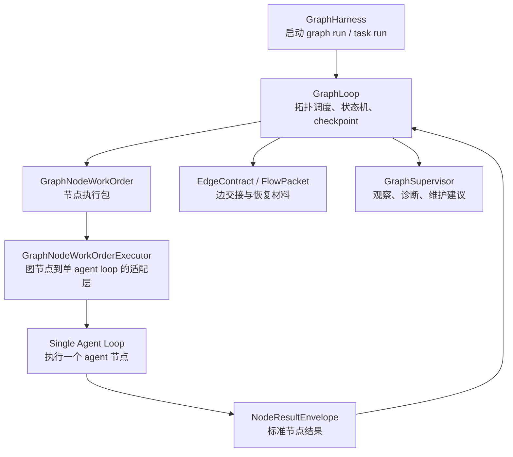

# 旧 Loop 节点执行器化升级计划书

日期：2026-06-09

状态：讨论稿

适用范围：图任务系统调用现有单 agent loop 执行节点任务的升级方案。

不适用范围：

- 不把单 agent loop 改造成图任务总控 loop。
- 不在本阶段实现 A2A 节点互聊。
- 不在本阶段实现节点节流。
- 不在本阶段重命名 `graph_session_id` 等历史字段。

---

## 1. 结论

旧 loop 可以继续使用，但只能作为图节点的执行引擎。

图任务系统的总控权必须属于 `GraphHarness / GraphLoop`。旧 loop 不负责拓扑调度、不负责边交接、不负责 graph checkpoint，也不决定下一个节点。

升级目标不是重写单 agent loop，而是把它接入图任务时的入口和出口标准化：

```text
GraphLoop
-> GraphNodeWorkOrder
-> GraphNodeWorkOrderExecutor
-> 单 agent loop
-> NodeResultEnvelope
-> GraphLoop.accept_node_result()
```

一句话定义：

> 单 agent loop 是节点 worker，GraphLoop 是图任务控制器。

---

## 2. 当前问题

现有单 agent loop 的价值在于它已经能处理：

- agent 身份和任务执行。
- 模型调用。
- 工具调用。
- 单任务上下文组织。
- artifact / memory / progress 相关写入。
- 单节点失败处理。

但它天然以 `session_id` 和当前会话为中心。如果直接用它做图任务总控，会产生结构性风险：

1. 图调度权重复。
   - 旧 loop 可能根据会话或任务历史继续推进。
   - GraphLoop 也会根据拓扑、节点状态和边状态推进。
   - 两套推进逻辑并存会导致状态不可恢复。

2. 上下文来源不纯。
   - 旧 loop 可能从 session history 中恢复或推断上下文。
   - 图任务要求节点输入来自 `GraphNodeWorkOrder.input_package`。
   - 下游节点只能看到 edge contract 投递的内容。

3. 环境和项目 scope 可能被覆盖。
   - 图任务已经把环境、项目、节点 session policy 编译进契约。
   - 旧 loop 如果自行读取 launch session scope，可能破坏图绑定。

4. 节点输出不稳定。
   - 图任务需要标准 `NodeResultEnvelope`。
   - 非结构化输出会使边契约、flow packet、checkpoint 难以稳定消费。

5. 恢复权混乱。
   - graph resume / requeue / checkpoint replay 必须由 GraphLoop 执行。
   - 旧 loop 只能做单节点内部重试或失败报告。

---

## 3. 设计原则

### 3.1 图级权威唯一

图级状态只能由以下链路改变：

```text
NodeResultEnvelope
-> GraphLoop.accept_node_result()
-> edge state update
-> flow packet persistence
-> scheduler snapshot
-> checkpoint
-> next work orders
```

禁止旧 loop 直接更新：

- graph node state
- graph edge state
- ready node list
- checkpoint
- downstream work order

### 3.2 单 agent loop 保持独立

单 agent loop 不应该理解图拓扑。

它只需要知道：

- 当前 agent 是谁。
- 当前节点任务是什么。
- 当前输入材料是什么。
- 当前环境和工具权限是什么。
- 期望产出格式是什么。

它不需要知道：

- 整张图有哪些节点。
- 下一个节点是谁。
- 当前边协议是什么。
- GraphRun 如何恢复。

### 3.3 入口必须是 WorkOrder

图节点执行的唯一输入是 `GraphNodeWorkOrder`。

WorkOrder 必须包含：

- `graph_run_id`
- `task_run_id`
- `node_id`
- `node_session_id`
- `node_session_policy`
- `input_package`
- `graph_slot`
- `permission_scope`
- `tool_scope`
- `expected_result_contract`
- `artifact_view_request`
- `memory_view_request`
- `runtime_controls`

### 3.4 出口必须是 NodeResultEnvelope

图节点执行的唯一输出是 `NodeResultEnvelope`。

必须覆盖：

- `outputs`
- `decisions`
- `artifact_refs`
- `memory_candidates`
- `progress_receipts`
- `artifact_materialization_receipts`
- `memory_commit_receipts`
- `handoff_summary`
- `diagnostics`
- `error`

旧 loop 的原始文本输出不能直接进入图任务下游，必须由 executor 收口成结构化结果。

### 3.5 Prompt 必须面向 agent 可执行

节点 prompt 不能写成开发说明。

错误示例：

```text
这是 runtime 节点。
根据任务图执行 world_review。
这个节点用于校验资产。
```

正确方向：

```text
你是一名世界观审核员。
你只负责评审当前世界观设定是否完整、一致、可支撑后续写作。
你不负责替创作者扩写设定。
你需要指出问题、给出裁决、说明是否允许进入下一阶段。
```

GraphNodeWorkOrderExecutor 负责把节点契约转换成 agent 能直接执行的任务说明。

---

## 4. 目标架构



职责划分：

| 模块 | 目标职责 | 不允许做 |
|---|---|---|
| `GraphHarness` | 创建/管理 graph run、task run | 执行节点内部 agent 逻辑 |
| `GraphLoop` | 调度、状态、边、checkpoint、resume | 调用模型直接产出节点内容 |
| `GraphContextMaterializer` | 组装节点输入包 | 自行推进图状态 |
| `GraphNodeWorkOrderExecutor` | 调用单 agent loop 并收口结果 | 决定下游节点 |
| 单 agent loop | 执行一个 agent 任务 | 理解或修改图拓扑 |
| `FlowPacket` | 边契约投递 | 从 session history 隐式补上下文 |
| `GraphSupervisor` | 观察和建议 | 未授权直接改 graph state |

---

## 5. 分阶段升级计划

### Phase 1：锁定节点执行入口和出口

目标：

让图节点执行只能通过 `GraphNodeWorkOrderExecutor` 进入旧 loop，并且只能通过 `NodeResultEnvelope` 返回。

主要工作：

- 审查 `backend/harness/graph/work_order_executor.py`。
- 明确旧 loop 的调用入口。
- 引入或固化 `NodeExecutionRequest` 内部结构。
- 所有节点执行结果统一封装为 `NodeResultEnvelope`。
- 失败路径也必须返回结构化 error。

完成标准：

- 图节点执行不依赖 launch session 历史。
- `GraphLoop.accept_node_result()` 可以消费所有成功/失败节点结果。
- executor 不直接写 graph node state / edge state。

验证：

```powershell
pytest -q backend\tests\graph_harness_api_regression.py::test_graph_harness_api_accepts_node_result_and_returns_next_work_order
pytest -q backend\tests\graph_contract_compiler_mvp_regression.py
```

### Phase 2：强化节点上下文材料化

目标：

旧 loop 收到的是完整节点任务包，而不是模糊会话上下文。

主要工作：

- 强化 `backend/harness/graph/context_materializer.py`。
- `input_package` 必须清晰携带：
  - `runtime_scope`
  - `node_contract`
  - `inbound_context`
  - `outbound_edge_policy`
  - `artifact_view_request`
  - `memory_view_request`
  - `tool_scope`
  - `expected_result_contract`
- 下游节点只能通过 inbound flow packet 得到上游材料。
- 旧 loop 不直接扫描 graph state。

完成标准：

- 节点执行材料来自 work order。
- session history 不能覆盖 work order input。
- edge contract 是节点交接核心。

验证：

```powershell
pytest -q backend\tests\graph_contract_compiler_mvp_regression.py
pytest -q backend\tests\graph_task_runtime_facade_regression.py -k "materializes_declared_final_content_artifact or records_artifact_repository_receipts"
```

### Phase 3：旧 loop 降权清理

目标：

清理或隔离旧 loop 中可能与 GraphLoop 抢权的逻辑。

重点排查：

- 自动继续下游任务。
- 根据 session history 推断当前任务阶段。
- 旧 task/subtask 自行生成下游任务。
- 隐式 memory/artifact 写回覆盖图契约。
- 没有明确输入时从聊天历史猜上下文。
- 自行决定 task environment / project scope。

保留能力：

- 模型调用。
- 工具调用。
- 单节点执行步骤。
- 单节点内部错误恢复。
- 单节点 artifact/materialization。
- 单节点 token/context 管理。

完成标准：

- 旧 loop 只能回答：当前节点是否完成，节点结果是什么。
- 旧 loop 不能回答：图下一步去哪。

验证：

```powershell
pytest -q backend\tests\harness_single_agent_tool_runtime_regression.py
pytest -q backend\tests\task_environment_session_scope_regression.py
pytest -q backend\tests\graph_node_model_selection_timeout_regression.py
```

### Phase 4：GraphLoop 成为唯一图调度源

目标：

确保所有图状态推进都由 GraphLoop 统一执行。

主要工作：

- 检查 `backend/harness/graph/loop.py` 的状态推进路径。
- 保证 ready node 只由状态机和 scheduler view 推导。
- 保证边状态只由节点结果触发。
- 保证 flow packet 只由 edge contract 决定。
- 保证 resume / requeue 只走 graph harness API。

完成标准：

- 节点执行完成后，唯一推进路径是 `GraphLoop.accept_node_result()`。
- 没有旧 loop 侧写 graph checkpoint 的路径。
- graph monitor 展示的状态与 checkpoint 一致。

验证：

```powershell
pytest -q backend\tests\graph_state_machine_regression.py
pytest -q backend\tests\graph_runtime_config_authority_regression.py
pytest -q backend\tests\engagement_graph_task_run_regression.py
```

### Phase 5：测试与删除旧权威

目标：

把旧 loop 的非法图级权威清理干净。

新增或强化测试：

1. WorkOrder executor 不直接改 graph state。
2. 旧 loop 不能生成下游 graph work order。
3. 节点环境锁不能被 launch session 覆盖。
4. 下游只能看到 edge packet 投递材料。
5. 节点失败后由 GraphLoop 标记失败/阻塞。
6. requeue 后只重跑目标节点和必要下游。

完成标准：

- 删除旧图级推进路径。
- 删除过时测试或改成保护新行为。
- 不保留无明确迁移意义的兼容分支。

验证：

```powershell
pytest -q backend\tests\graph_contract_compiler_mvp_regression.py
pytest -q backend\tests\graph_harness_api_regression.py::test_task_graph_start_api_returns_node_work_order_for_published_config backend\tests\graph_harness_api_regression.py::test_graph_harness_api_accepts_node_result_and_returns_next_work_order
pytest -q backend\tests\engagement_graph_task_run_regression.py
```

---

## 6. 文件级执行清单

### 必查文件

- `backend/harness/graph/work_order_executor.py`
  - 图节点调用旧 loop 的主要适配点。
  - 需要确认它不直接决定图下游。

- `backend/harness/graph/context_materializer.py`
  - 节点输入包权威来源。
  - 需要确保 input package 足够完整。

- `backend/harness/graph/loop.py`
  - 图级状态唯一推进者。
  - 需要保护 checkpoint / edge state / ready node 逻辑。

- `backend/harness/graph/flow_packet.py`
  - 边交接包权威。
  - 需要确保只按 edge contract 投递。

- `backend/harness/loop/single_agent_turn.py`
  - 单 agent loop 核心。
  - 原则上不重写，只检查是否存在会覆盖 work order 的上下文/环境推断。

- `backend/harness/runtime/single_agent_host.py`
  - 单 agent runtime host。
  - 需要确认 environment / session scope 不覆盖节点契约。

- `backend/harness/entrypoint/runtime_facade.py`
  - runtime facade 入口。
  - 需要确认图节点执行不会绕开 graph harness。

### 必改或可能改的测试

- `backend/tests/graph_contract_compiler_mvp_regression.py`
- `backend/tests/graph_harness_api_regression.py`
- `backend/tests/engagement_graph_task_run_regression.py`
- `backend/tests/graph_runtime_config_authority_regression.py`
- `backend/tests/graph_state_machine_regression.py`
- `backend/tests/graph_task_runtime_facade_regression.py`
- `backend/tests/harness_single_agent_tool_runtime_regression.py`
- `backend/tests/task_environment_session_scope_regression.py`

---

## 7. 切换与回滚规则

### 切换规则

只有满足以下条件，才能认为旧 loop 已完成节点执行器化：

- 图节点执行入口唯一。
- 节点输出统一为 `NodeResultEnvelope`。
- 旧 loop 不直接修改 graph state。
- GraphLoop 是唯一调度源。
- 图任务节点可以按 project/environment scope 稳定运行。
- 关键回归测试通过。

### 回滚规则

如果升级中出现节点执行失败，可以回滚到上一阶段，但不能恢复以下行为：

- 旧 loop 直接推进 graph state。
- 旧 loop 直接生成下游 graph work order。
- 节点绕过 edge contract 读取上游上下文。
- launch session 覆盖 graph binding。

允许保留的临时兼容：

- 单 agent loop 原有普通聊天/单任务入口。
- executor 内部对旧结果形态的转换，但必须标注迁移目标，并最终输出 `NodeResultEnvelope`。

---

## 8. 验收标准

基础验收：

- 图任务从 published config 启动。
- 图运行绑定项目和环境。
- 节点 work order 携带节点 session policy。
- 节点执行调用单 agent loop。
- 节点结果进入 `GraphLoop.accept_node_result()`。
- 边契约生成 flow packet。
- 下游节点收到 inbound context。
- checkpoint 可恢复。

高级验收：

- 节点失败可 requeue。
- 图 monitor 可展示真实状态。
- GraphSupervisor 可观察风险并给出维护建议。
- 旧 loop 无图级调度权。
- 文档和测试都不再鼓励旧 loop 直接承担 graph orchestration。

---

## 9. 不做事项

本计划不做：

- 不重写单 agent loop 的核心模型调用逻辑。
- 不把单 agent loop 改造成多 agent 通信系统。
- 不实现 A2A 节点互聊。
- 不实现节点节流。
- 不强制重命名 `graph_session_id`。
- 不保留无用途旧图调度路径。

---

## 10. 推荐实施顺序

推荐先做 Phase 1 和 Phase 2。

原因：

- 这两步能最大化复用旧 loop。
- 风险集中在适配层，不会污染单 agent loop。
- 可以快速验证图任务基础闭环。

Phase 3 到 Phase 5 再逐步清理旧权威，避免一次性重构范围过大。

最终目标是：

```text
单 agent loop 更纯粹
GraphLoop 更权威
边契约更稳定
节点执行更可恢复
```

