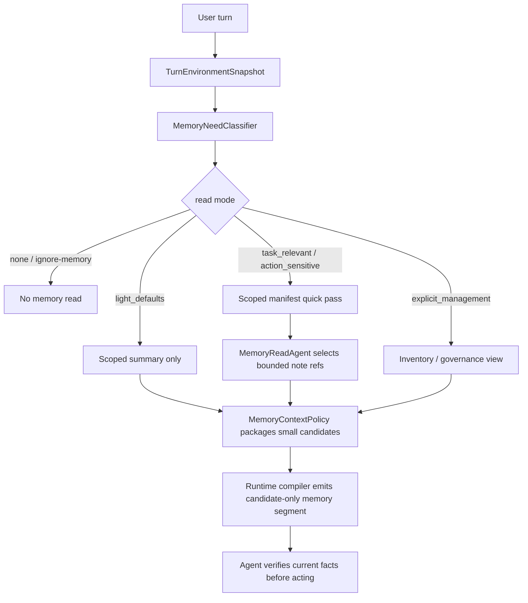
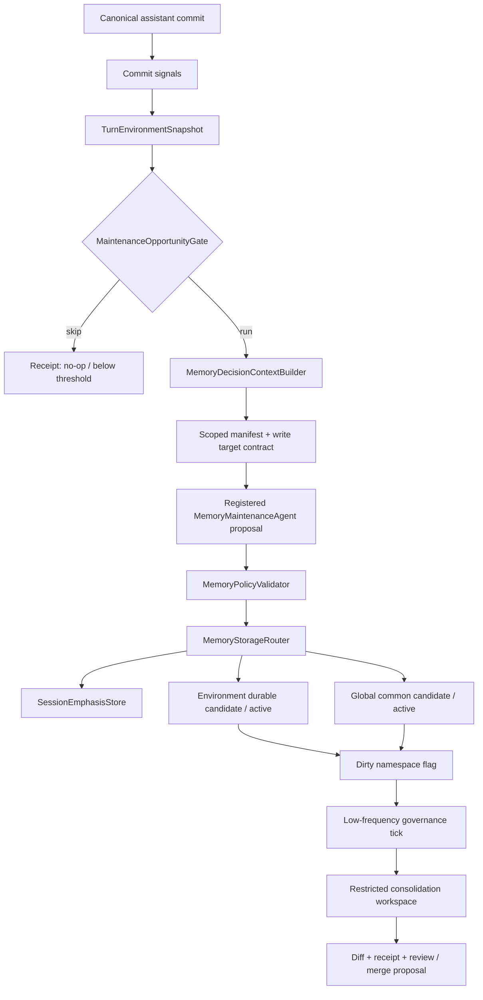
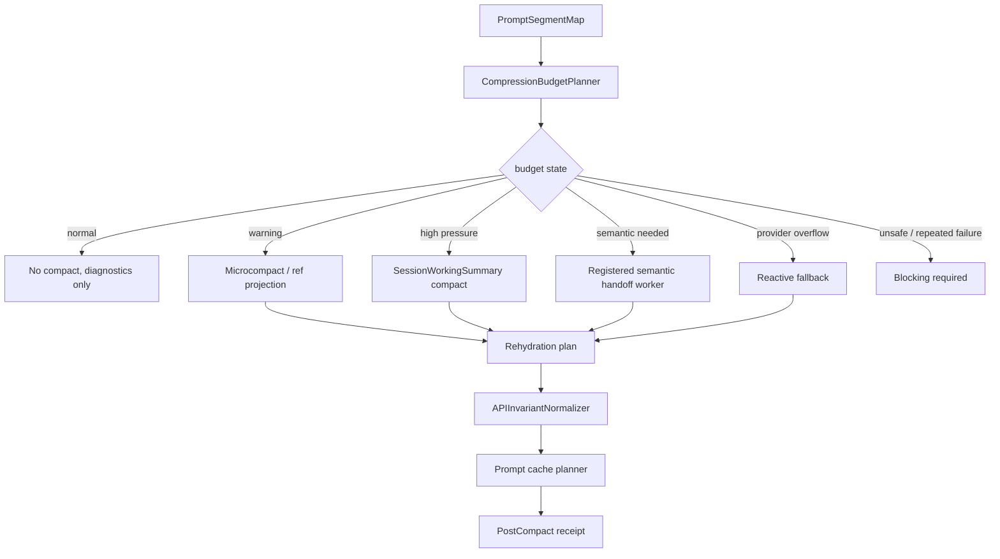

# 长期记忆治理与上下文预算压缩优化计划

日期：2026-06-03

## 1. 背景与问题定义

当前系统已经具备较成熟的记忆与动态上下文基础：`MemoryRuntimeView` 只读候选化、`DynamicContextManager` 分离 stable/dynamic/volatile、`ContextCompactor` 按压力做 micro/full compact、`PromptSegmentMap` 与 `CompressionBudgetPlanner` 已经提供分段预算事实。

但还有三个核心问题：

1. 长期记忆写入仍偏“会话维护后自动提案”，容易让模型把项目经验、过程记录、assistant 结论、临时调试事实误判为 durable memory。
2. 上下文压缩当前主要依赖规则截断、固定 section 摘要和 bulky output stub，缺少更细的价值排序、按需召回、语义压缩器接入和 prompt cache 稳定策略。
3. 偏好缺少“作用域”和“生命周期”分层：有些偏好是所有环境共通的，有些只属于 coding/writing/general 等任务环境；有些只对当前任务有效，有些才应该进入长期记忆。

正确终态不是“把更多历史塞进 prompt”，而是：

- 长期记忆成为低频、可审计、可治理的跨会话稳定约束库。
- 当前轮 prompt 成为由稳定前缀、候选记忆、活动状态、最近真实消息、工具/文件引用组成的预算化执行包。
- 压缩策略必须保护任务状态、证据引用和用户显式意图，而不是平均截断。

## 2. 当前代码源报告

### 2.1 长期记忆写入链路

相关文件：

```text
backend/memory_system/facade.py
backend/memory_system/maintenance.py
backend/memory_system/durable.py
backend/memory_system/governance_service.py
backend/api/memory.py
backend/bootstrap/app_runtime.py
```

当前链路：

1. assistant commit 后调用 `MemoryFacade.enqueue_memory_maintenance_after_commit()`，把维护任务送入后台队列。
2. `MemoryMaintenanceCoordinator.run_after_commit()` 构造 `MemoryMaintenanceRequest`。
3. `MemoryMaintenanceAgent.maintain()` 调用模型，输出 `MemoryMaintenanceProposal`。
4. `MemoryCommitter.commit()` 写 session memory，并通过 `commit_durable_plan()` 应用 durable actions。
5. durable note 写入 `MemoryManager.save_note()`，索引重建通过 `AppRuntime._on_durable_memory_saved()` 触发 `durable_memory_index_rebuild`。

现有优点：

- 没有 model invoker 时不会启发式写长期记忆。
- 模型只产 proposal，真实写入由 `MemoryCommitter` 校验。
- API 已支持 create/activate/archive/delete/merge。

现有缺口：

- durable 写入允许 `user/feedback/project/reference` 与 `work/preference`，边界太宽。
- `evidence_excerpt` 有要求，但提交层没有强制验证证据必须来自用户显式表达或项目权威源。
- 每轮 commit 都可能排队维护，虽然后台执行，但仍偏高频。
- 没有独立 durable governance tick：去重、冲突、候选激活、低置信降权都依赖人工/API 或已有轻量 govern。
- durable memory 当前是全局共享根目录，尚未以 `task_environment_id` 作为长期记忆命名空间；coding 环境写入的长期偏好理论上可能被 general/writing 环境召回。
- 偏好没有分层表达，`user/preference` 容易混合当前轮偏好、会话偏好、环境长期偏好和全局共通偏好。

### 2.2 上下文预算与压缩链路

相关文件：

```text
backend/context_system/compaction/compactor.py
backend/context_system/packaging/controller.py
backend/harness/runtime/dynamic_context/*
backend/harness/runtime/context_budget_policy.py
backend/runtime/prompt_accounting/compression_budget.py
backend/runtime/prompt_accounting/cache_planner.py
backend/runtime/context_management/history_compaction.py
backend/memory_system/storage/session_memory_view.py
```

当前链路：

1. `ModelAwareContextBudgetPolicy` 根据模型和 invocation kind 分配 stable/tool/recent/observation/volatile 预算。
2. `DynamicContextManager` 将历史、工具结果、观察、执行状态投影为 model-visible payload 和 refs。
3. `HistoryProjector` 仅保留 recent turns，压缩上下文通过 `session_context.compressed_summary` 进入。
4. `ContextCompactor` 压力分级：normal/warning/microcompact/full_compact。
5. full compact 默认用 `SessionMemoryManager.compact_view()`，除非外部传入 `semantic_summary_content`。
6. `CompressionBudgetPlanner` 依据 prompt segments 计算可压缩段、drop 段、summary target，但目前更多用于诊断，尚未成为统一裁决入口。

现有优点：

- stable prefix 与 volatile section 已经分离，有利于 prompt cache。
- replacement store 用稳定 hash，支持幂等投影。
- 历史中的 `[Compressed session context]` 不进入 recent window，避免重复污染。

现有缺口：

- `ContextCompactor`、`HistoryProjector`、`runtime/context_management/history_compaction.py` 存在多套压缩概念，权威入口不够单一。
- full compact 的 session memory view 是固定 section 截断，不是真正按任务价值压缩。
- semantic compaction request 已存在，但没有在线 agent/adapter 接入。
- 压缩没有显式区分“可重取 raw output”“必须保留 evidence ref”“必须保留 current intent”“可降级为 retrieval handle”。
- 代码库上下文还缺少类似 repo map / file condensation 的结构化压缩层；大文件目前更容易被读取窗口和工具结果 preview 管理，而不是被抽象为符号、定义、调用关系和可继续读取的文件切片。

### 2.3 系统-Agent 对接现状

当前代码已经有一些正确基础，但写侧边界还不够硬：

- 读侧已经有显式计划雏形：`MemoryReadPlan`、`MemoryScopePolicy`、`MemorySupplier` 只按 `requested_memory_layers` 与 `allow_long_term_memory` 拉取候选；`MemoryContextCandidate` 明确是 `candidate_only`，不能覆盖当前轮事实。
- 写侧虽然标注为 proposal only，但 `MemoryMaintenanceAgent` 的输出合同仍过宽：`DurableMemoryWriteAction` 只有 action/type/class/title/canonical/evidence 等字段，没有 `scope`、`horizon`、`task_environment_id`、`evidence_source_kind`、`storage_target`。
- `MemoryCommitter` 是系统提交权威，但目前主要校验类型、class、空字段、evidence 是否存在、路径是否逃逸；没有校验证据是否来自用户显式表达、偏好是否短期、是否允许写入当前环境、是否允许 global common。
- `MemoryFacade` 初始化单个 `DurableMemoryLayer(base_dir)`、单个 `memory_manager` 和单个 `DurableMemoryGovernanceService`，因此 durable memory 仍是全局实例。
- `DurableMemoryLayer` 和 `DurableMemoryGovernanceService` 都通过 `durable_memory_layout_from_backend_dir(base_dir)` 扫描全局 root；recall、manifest、governance API 默认看同一个池。
- `MemoryMaintenanceCoordinator._build_request()` 扫描 `self.memory_manager.root_dir` 下所有 durable headers，当前 memory manager 也是全局池；这会让记忆管理员在所有长期记忆上做判断。
- `TaskDurableMemoryService` 已经有 namespace、promotion state、`eligible_for_global_promotion`、context candidates 和 global promotion flow，并有回归测试覆盖；但当前决定是保留为独立存量模块，不再接入普通运行链路的默认长期记忆读写层。它可以用于显式调用或离线治理，不能作为主 runtime 的记忆权威。
- task environment 信息已经存在于 `SessionScope`、`RuntimeAssembly.task_environment`、`TaskEnvironmentSpec.memory_space`、graph published environment payload 中；环境归属应由系统解析并注入 memory request，而不是让模型从对话文本猜。
- session 支持对话中切换 active task environment：`SessionManager.set_active_task_environment()` 会写入 `conversation_state.active_task_environment`，`update_turn_environment_snapshot()` 还能给单个 turn 记录环境快照。因此长期记忆不能只绑定 `session_id` 或 session scope；必须绑定“当前 turn 的环境快照”。
- 现有长期记忆读取链路是候选化的：`MemoryOrchestrator -> MemoryReadPlan -> MemorySupplier -> DurableMemoryLayer.recall_memories() -> MemoryContextCandidate -> MemoryContextPolicy`。但普通运行链路中没有稳定证据表明每一轮都会自动把当前 task environment 注入 `memory_request_profile` 并读取 scoped durable memory；这会导致环境切换时容易混读或漏读。

因此，正确改造方向不是“增强记忆管理员自由判断能力”，而是建立系统-Agent 对接合同：系统给边界、候选、权限和存储目标；agent 只提取候选；committer 和 governance service 才有写入、降级、提升和跨环境共享权。

### 2.4 当前长期记忆读取与处理流程

当前代码中的长期记忆读取大致如下：

```text
调用方传入 memory_request_profile
-> MemoryOrchestrator.build_read_plan()
-> MemorySupplier.fetch_candidates()
-> MemoryBundleService.build_long_term_memory_context_candidates()
-> DurableMemoryLayer.recall_memories()
-> MemoryReadAgent 从 manifest 中选择 note
-> _long_term_context_candidates_from_recall_result()
-> MemoryContextPolicy 放入 relevant_durable_context
```

关键现状：

- `MemoryReadPlan` 只有 `requested_layers`、`allow_long_term`、`note_limit` 等字段，没有 `turn_environment_snapshot` 或 `effective_task_environment_id`；`task_durable` 已从主 runtime 读取层断开。
- `DurableMemoryLayer` 扫描的是当前 `memory_manager.root_dir` 的 manifest；现在这个 root 是全局 durable memory。
- `MemoryReadAgent` 只在已给定 manifest 内挑选 note；如果 manifest 已混入其他环境，它无法可靠承担隔离责任。
- `MemoryContextCandidate` 是 `candidate_only`，这点是正确的；但候选池是否正确，取决于上游 manifest 和 namespace。
- `context_system.policy.package_builder` 会把 `long_term` candidate 放入 `relevant_durable_context`，但只有调用方显式请求 `requested_memory_layers=["long_term"]` 且 `allow_long_term_memory=True` 时才会进入。
- `task_durable` 不再作为主 runtime 候选层；主 runtime 请求如果携带 `requested_memory_layers=["task_durable"]` 应被视为断开接入并拒绝。

对话中环境可切换后，正确读取边界应改为：

```text
current user turn
-> resolve TurnEnvironmentSnapshot
-> build MemoryReadPlan(environment_snapshot=...)
-> scan current environment namespace + global_common
-> no task_durable namespace candidates in main runtime
-> recall selector only sees scoped manifest
-> package candidates with namespace diagnostics
```

有效环境解析优先级：

```text
request.task_selection.task_environment_id
-> runtime_assembly.task_environment.environment_id
-> message.turn_environment_snapshot.task_environment_id
-> session.conversation_state.active_task_environment.task_environment_id
-> session.scope.task_environment_id
-> env.general.workspace
```

写入时也必须使用同一个 `TurnEnvironmentSnapshot`，避免本轮在 coding 环境读，却在 session 旧 scope 或 active environment 变化后写到 writing/general。

## 3. 外部参考与取舍

参考资料：

- LLMLingua 提出 coarse-to-fine prompt compression，包含 budget controller 和 token-level compression，可在高压场景用小模型/压缩器减少冗余 prompt token：<https://arxiv.org/abs/2310.05736>
- MemGPT 提出 virtual context management，把 LLM context 当作有限内存，把长期/外部存储当作慢层，通过层级记忆移动而不是无限扩 prompt：<https://arxiv.org/abs/2310.08560>
- Anthropic prompt caching 文档强调稳定前缀和 cache breakpoint；这支持本项目继续把静态规则、工具 schema、稳定 runtime boundary 放在前缀，动态内容放后缀：<https://docs.anthropic.com/en/docs/build-with-claude/prompt-caching>
- LangMem/LangGraph 将 memory 分为 semantic、episodic、procedural，并提供 background memory manager；这与本项目“热路径执行、后台治理”的方向一致：<https://langchain-ai.github.io/langmem/concepts/conceptual_guide/>、<https://langchain-ai.github.io/langmem/>
- Claude Code 公开文档说明上下文由会话历史、文件内容、命令输出、`CLAUDE.md`、auto memory、skills、system instructions 等组成；接近上限时支持 auto-compact 和手动 `/compact`，并可通过 `CLAUDE.md` 的 compact instructions 控制保留重点。Claude Code prompt caching 文档还建议在自然断点手动 compact，避免 mid-task 触发，并指出文件内容只有读取后才进入上下文：<https://code.claude.com/docs/en/how-claude-code-works>、<https://code.claude.com/docs/en/prompt-caching>
- OpenAI 的 Codex agent loop 工程说明强调 prompt cache 只在 prompt 前缀精确匹配时命中；早期 Codex compaction 由用户手动 `/compact` 触发，后续转向自动 compaction，把旧输入替换为更小的代表性 item list：<https://openai.com/index/unrolling-the-codex-agent-loop/>
- OpenAI Prompt Caching 文档说明可通过稳定 prompt 前缀提高复用与成本效率，这与本项目 stable prefix / volatile suffix 的装配方向一致：<https://platform.openai.com/docs/guides/prompt-caching>
- Cursor 将长聊天摘要与大文件/文件夹 condensation 分开处理；文件和目录过大时不是写成散文摘要，而是提供智能压缩后的结构视图：<https://docs.cursor.com/agent/chat/summarization>
- Aider 使用 repo map 管理代码库上下文，提取重要类、函数、签名和定义行，并在大仓库下按相关性选择进入上下文的结构片段：<https://aider.chat/docs/repomap.html>

取舍：

- 借鉴 LLMLingua 的预算控制思想，但不直接让 token compressor 改写 agent prompt、工具合同和代码证据；只能压缩低权威自然语言历史或 retrieval snippets。
- 借鉴 MemGPT 的层级内存思想：active context 是小而权威的工作集，长期记忆和原始工具输出通过 refs/召回进入。
- 借鉴 LangMem 的 background memory manager，但提交层必须比示例更严格，不能让模型直接写 active durable memory。
- 借鉴 Claude Code / Codex 的实践：压缩应尽量发生在任务自然断点，稳定规则进入项目指令或 stable prefix，旧历史可由 compact summary 接续，但工具结果、文件内容、权限和当前任务状态不能只靠摘要保真。
- 借鉴 Cursor / Aider 的实践：代码库上下文应优先做结构化 condensation / repo map，而不是把长文件全文或散文总结塞进 prompt。
- 不采用“每轮自动抽取所有有用事实”的宽松 semantic memory，因为本项目是 coding/agent runtime，错误长期记忆会污染工具权限、任务恢复和用户意图。

### 3.1 成熟 Coding Agent 压缩共性

成熟 coding agent 的压缩路径通常包含五个共同点：

1. **工具输出先清理或 ref 化，再摘要对话**。大命令输出、检索原文、文件全文应优先变成 preview、range、hash、artifact/tool result ref；旧对话才进入 semantic handoff。
2. **稳定前缀必须受保护**。system prompt、项目规则、agent 角色、工具 schema、权限边界应放在稳定前缀并尽量命中 prompt cache；压缩只动后缀或低权威段。
3. **代码上下文用结构索引，不用散文摘要替代源文件**。repo map、符号表、文件切片、调用关系比“这个文件大概做什么”的散文摘要更适合 coding agent。
4. **手动 compact 和自动 compact 都要存在**。自动压缩防止上下文爆掉；手动压缩允许在自然任务断点执行，并指定保留焦点。
5. **长期规则不靠聊天摘要保存**。项目固定规则进入 `AGENTS.md` / stable prompt / durable memory；compact summary 只做恢复点，不成为长期事实权威。

这些共性要求本计划新增两项约束：代码库上下文必须有结构化压缩阶段；压缩系统必须暴露可观测的预算/compact 诊断和手动触发能力。

### 3.2 本地 Codex / Claude 源码对照结论

按用户要求，额外检查了工作区外的本地源码与分析材料：

```text
D:\AI应用\openai-codex\
D:\AI应用\claude-code-nb-main\
D:\AI应用\Claude-Code-Source-Study-main\
```

可采纳的成熟实现点如下。

#### 3.2.1 源码证据表

这张表只记录可落地的工程不变量，不照搬 Codex / Claude 的私有目录结构、feature flag 或产品交互。

| 来源 | 观察到的机制 | 对本项目的设计约束 | 落地位置 |
| --- | --- | --- | --- |
| `D:\AI应用\openai-codex\codex-rs\core\src\compact.rs` | compact 是正式 turn，区分 manual/auto，并有 pre/post hook 与 context overflow fallback。 | 压缩必须是可审计边界事件，不能只是 helper 函数截断 history。 | Phase 4 `PreCompactHook` / `PostCompactHook` / `CompactBoundaryReceipt` |
| `D:\AI应用\openai-codex\codex-rs\core\src\compact.rs` | replacement history 保留 summary + 最近真实消息，并在不同 compact 时机重建 initial context。 | compact 后必须保留 current user intent、最近真实尾部和 canonical context 重建规则。 | Phase 4/5 `APIInvariantNormalizer`、`SessionWorkingSummaryProjector` |
| `D:\AI应用\openai-codex\codex-rs\core\src\context_manager\history.rs` | context baseline 被 rollback/trim 破坏时清空，后续重新注入 initial context。 | session emphasis / memory segment / dynamic context 的 diff 必须有 baseline reset，不允许沿用失效基线。 | Phase 2/9 `TurnEnvironmentSnapshot`、`cache_baseline.py` |
| `D:\AI应用\openai-codex\codex-rs\core\src\state\additional_context.rs` | additional context 按 key-value 管理，仅对变化项发 fragment，单项有 token 上限。 | session emphasis 与动态上下文采用差量注入和上限，不做每轮全量重排。 | 4.3 注入模型、Phase 9 prompt cache |
| `D:\AI应用\openai-codex\codex-rs\ext\memories\templates\memories\read_path.md` | 长期记忆先给 summary/navigation，细节通过 quick pass 和引用读取。 | 长期记忆读取采用 summary-led quick pass，不默认全量 durable 注入。 | 4.5 `MemoryNeedClassifier` / `MemoryReadAgent` |
| `D:\AI应用\openai-codex\codex-rs\memories\write\src\phase1.rs` | 单 rollout 提取 raw candidate，允许 no-op。 | 热路径默认只产生候选和 receipt；只有用户显式长期偏好且通过 Tier 1 校验时才可直接 active。 | Phase 1/3 `MemoryPolicyValidator`、Stage 1 |
| `D:\AI应用\openai-codex\codex-rs\memories\write\src\phase2.rs` | consolidation 使用锁、baseline/diff 与受限 workspace。 | 治理 agent 必须被编排注册并限制 namespace、网络、递归 delegation 和写权限。 | Phase 3 governance workspace |
| `D:\AI应用\claude-code-nb-main\services\compact\autoCompact.ts` | compact 阈值扣除 summary 输出预留，有 warning/error/blocking 与 circuit breaker。 | 预算压缩必须预留输出空间，并在连续失败后阻断自动重试。 | Phase 4 `CompactCircuitBreaker` |
| `D:\AI应用\claude-code-nb-main\services\compact\microCompact.ts` | cache cold 可替换旧 tool result；cache warm 使用 cache editing，不改本地 messages。 | microcompact 必须区分 cache 状态；provider 不支持 cache editing 时跳过该路径。 | Phase 9 `microcompact.py` |
| `D:\AI应用\claude-code-nb-main\services\SessionMemory\sessionMemory.ts` | Session Memory 是 post-sampling hook，满足 token/tool 阈值才运行。 | session working summary 低频更新，不能每轮抽取所有事实。 | Phase 1 `SessionMemoryManager` 阈值 |
| `D:\AI应用\claude-code-nb-main\services\SessionMemory\prompts.ts` | Session Memory 使用固定 section、软/硬 token 上限，并禁止把记笔记指令写入笔记。 | 会话工作摘要必须结构化、有预算，并且不能污染为用户偏好。 | 4.3、Phase 5 |
| `D:\AI应用\claude-code-nb-main\services\compact\sessionMemoryCompact.ts` | compact 复用后台 Session Memory，保留未总结尾部，并修正 tool/thinking 不变量。 | session memory compact 必须保留真实尾部和 API 协议完整性。 | Phase 5 `session_memory_compact_regression.py` |
| `D:\AI应用\claude-code-nb-main\memdir\findRelevantMemories.ts` | relevant memory 每个用户 turn 可异步 prefetch，但主循环只零等待消费已完成结果。 | 可以“每 turn 发起廉价候选预取”，但不能等同于每 turn 注入或每 turn 写长期记忆。 | 4.5 read modes、Phase 2 |
| `D:\AI应用\claude-code-nb-main\memdir\memoryTypes.ts` | 长期记忆类型闭合，并明确 What NOT to save；用户要求忽略记忆时按空记忆处理。 | 长期记忆类型必须闭合，ignore-memory 是 hard-off。 | 4.1、4.5、Phase 2 |

#### 3.2.2 可采纳工程点

Codex 源码中的关键做法：

- `codex-rs/core/src/compact.rs`：compact 是正式 turn，有 `PreCompact` / `PostCompact` hook、analytics status、manual/auto trigger、context-window-exceeded fallback。压缩失败时先移除最老 history item，并通过 history normalize 保持 call/output 成对，而不是盲目缩短摘要。
- `codex-rs/core/src/compact.rs`：compact replacement history 不是“只剩摘要”，而是保留有限最近用户消息 + summary；pre-turn/manual compact 会清空 `reference_context_item`，让下一轮重新注入 canonical initial context；mid-turn compact 会把 initial context 插到最后真实用户消息前，保持模型期望的边界。
- `codex-rs/core/src/context_manager/history.rs` 与 `context_manager/updates.rs`：context 有 `reference_context_item` baseline，只对环境、权限、协作模式、实时状态等变化发 diff；rollback/trim 如果破坏了 initial-context bundle，会清空 baseline，避免用旧上下文继续 diff。
- `codex-rs/core/src/state/additional_context.rs` 与 `context/fragments.rs`：additional context 是 key-value store，只对变化项产出 fragment，并且单项有 token 上限。这证明外部动态上下文应走“差量 + 标记 + 上限”，不能每轮全量重注入。
- `codex-rs/ext/memories/templates/memories/read_path.md`：长期记忆读取只把 `memory_summary.md` 作为导航摘要常驻 developer instructions，细节通过 `MEMORY.md`、`skills/`、`rollout_summaries/` 做 quick memory pass；记忆使用必须可引用，且未验证的记忆不能当成当前事实。
- `codex-rs/memories/README.md`、`memories/write/src/phase1.rs`、`phase2.rs`：长期记忆写入是两阶段后台流水线。Phase 1 对单个 rollout 做结构化提取，允许 no-op；Phase 2 用全局锁、git baseline、workspace diff 和受限 consolidation agent 合并。consolidation agent 是 ephemeral、禁用 memory 读写、禁用 collab/apps/plugins、无网络、只允许 memory root 写入。
- `codex-rs/ext/memories/templates/memories/read_path.md`：主 agent 只有用户明确要求时才能写 ad-hoc memory note，不能直接改长期记忆文件；最终合并由受控写入流水线完成。
- `codex-rs/app-server/README.md`：外部管理面暴露 `thread/compact/start`、`thread/memoryMode/set`、`memory/reset`、`itemsView=summary/full/notLoaded` 等能力，说明成熟 agent 会把 compact、memory eligibility、history detail level 都做成可控 API，而不是隐藏在热路径里。

Claude Code 源码中的关键做法：

- `services/compact/autoCompact.ts`：有效输入窗口 = 模型窗口 - compact summary 输出预留，auto compact 阈值还要减 buffer；有 warning/error/blocking 分层，并有连续失败 circuit breaker，避免 irrecoverable overflow 时反复浪费调用。
- `services/compact/microCompact.ts`：先做低成本 microcompact。cache 冷时可直接替换旧 tool_result 为占位；cache 热时用 cache editing，不改本地 messages，保护 prompt cache。只对主线程启用，避免 fork/subagent 污染主线程 cache state。
- `services/SessionMemory/sessionMemory.ts`：Session Memory 不是每轮提取，而是 main REPL post-sampling hook，初始化 token 阈值、更新 token 增量阈值和 tool call 阈值都满足才运行；用 forked agent 更新文件，但权限只允许 Edit 目标 session memory 文件。
- `services/SessionMemory/prompts.ts`：Session Memory 是固定模板结构，section header 和说明不可改；每 section 有软上限，总文件有硬上限；写入 prompt 明确禁止把 note-taking 指令写入笔记。
- `services/compact/sessionMemoryCompact.ts`：compact 时优先尝试复用后台维护的 Session Memory，等 in-progress extraction 最多 15 秒；保留未总结尾部消息，并按 min tokens、min text-block messages、max cap 扩展；还要回退修正 tool_use/tool_result pair 与 thinking block，防止 API invariant 被切断。
- `utils/attachments.ts` 与 `memdir/findRelevantMemories.ts`：Relevant Memory 是每个用户 turn 启动一次异步 prefetch，主循环只在已完成时零等待消费；最多选 5 条，有 session byte cap，按已 surfaced path 和 readFileState 去重。扫描历史 attachment 而不是全局状态意味着 compact 后旧 attachment 消失，记忆可以合理重新召回。
- `memdir/memoryTypes.ts`：长期记忆有闭合分类与 “What NOT to save”。代码结构、git 历史、调试方案、CLAUDE.md 已有规则和临时任务状态都不应保存；用户说忽略记忆时必须像 MEMORY.md 为空一样处理，不能“提到但覆盖”。
- `bootstrap/state.ts`、`constants/systemPromptSections.ts`、`context.ts`：成熟实现把 prompt 分为 global cache、session-memoized、per-turn volatile；session 内稳定段不会每轮重算，只有少量危险动态段每轮刷新。

对本计划的补充结论：

1. 会话级记忆必须分两条链路：`SessionEmphasisStore` 保存用户显式 steer，作为 preserve segment；`SessionWorkingSummary` 或现有 `SessionMemoryManager` 负责工作进度/错误/文件/结果摘要，主要服务 compact，不应被提升为长期偏好。
2. 长期记忆写入应更接近 Codex 两阶段流水线：热路径默认只产候选和 receipt；只有用户显式长期偏好且通过系统 Tier 1 校验时才可直接写当前环境 active。低频治理/合并 agent 在受限工作区内运行。不能让主 agent 直接编辑 durable active memory。
3. 记忆读取应采用 summary-led quick pass：默认只注入极小的导航摘要或少量 selected candidates；细节通过 scoped manifest、工具读取、memory citation 和 rehydration 召回。
4. 压缩必须是梯度响应：microcompact / ref 化 / session memory compact / semantic handoff / reactive fallback，而不是只在 token 紧张时调用一个 full summary。
5. 压缩必须保护 API 协议不变量：tool_use 与 tool_result 成对、thinking block 不被切断、当前用户请求和 active task state 不被摘要替代。
6. Prompt cache 是一等约束：稳定段 session 内缓存，dynamic context 用 diff 和 baseline；高频变化只放 volatile suffix；cache-aware microcompact 能不改本地消息时就不改。

## 4. 推荐设计方向

### 4.1 长期记忆目标模型

长期记忆定义为“跨会话稳定约束与显式知识”，不是会话摘要。

允许类型：

```text
explicit_user_preference -> user/preference
explicit_user_work_instruction -> user/work
explicit_user_feedback -> feedback/work
user_confirmed_project_rule -> project/work
```

禁止类型：

```text
assistant_inferred_fact
temporary_task_state
tool_failure_or_runtime_log
debugging_process_note
ordinary_code_observation
project_rule_without_user_or_authoritative_source
reference_memory_auto_write
```

写入等级：

- `active`：用户显式要求长期记住；或治理/人工确认某个权威项目源（例如 AGENTS.md、项目规则文档）应作为 durable project rule 注入。
- `candidate`：模型识别为可能长期有用，但证据不足、来源不是强显式，或只是机会性扫描到的项目文档规则。默认不可注入。
- `needs_review`：冲突、重复、低置信、来源过旧。
- `archived/deprecated`：不再注入。

### 4.2 系统-Agent 对接合同

长期记忆管理应采用“系统护栏 + agent 提案 + 风险分级提交”的合同，不采用“agent 自由管理长期记忆”，也不把每一次长期记忆写入都变成人工审批。

固定职责：

```text
Runtime / Session Scope Resolver
-> MemoryDecisionContextBuilder
-> MemoryMaintenanceAgent Candidate Proposal
-> MemoryPolicyValidator
-> MemoryStorageRouter
-> Durable/Task/Session Store
-> Governance Receipt
```

#### 4.2.1 子 Agent 注册约束

如果记忆治理、语义压缩或治理检查需要调用子 Agent，必须先在编排系统中完成注册，再由 runtime assembly 解析和装配。

允许的权威入口仅限：

- `backend/agent_system/registry/agent_registry.py`
- `backend/agent_system/profiles/runtime_profile_registry.py`
- `backend/agent_system/groups/registry.py`

memory、compression、runtime 模块只能引用已注册的 `agent_id` / `agent_profile_id` / `group_id` / `runtime_template_id`，不能在内部硬编码创建一个隐藏 agent，也不能用本地 new 出来的对象绕过编排和权限边界。

如果注册缺失、禁用或配置不一致，热路径必须 fail closed 或退回确定性路径，不能静默生成一个临时代理兜底。

系统负责：

- 从 session scope、runtime assembly、task environment、project handle 中确定 `task_environment_id`、`environment_kind`、`project_id`、允许读取/写入的 memory namespace。
- 构造 `MemoryDecisionContext`，明确本次默认 `read_namespaces`、候选 `write_targets`、`global_promotion_policy`、`durable_lane_enabled`、`evidence_policy`。这些字段是路由和安全上下文，不应被设计成高频审批开关。
- 提供 scoped manifest，只给当前环境 namespace 与 global common headers，不把其他环境记忆交给 agent 判断。
- 如果需要调用 memory manager、semantic compaction agent 或其他子 agent，必须先在编排系统中配置并注册 agent/profile/group，再通过 runtime assembly 调用；内存、压缩或 runtime 模块不得内部硬编码一个隐形子 agent。
- 校验 agent proposal：证据来源、作用域、生命周期、类型、冲突、重复、是否 eligible_for_injection、是否允许 global promotion。
- 按风险分级决定最终动作：低风险自动写入；中风险降级为 candidate；高风险进入治理复核；明显噪声或越界才拒绝。
- 生成轻量 commit/governance receipt，记录 accepted、downgraded、review_required、rejected、routed target 和原因。

agent 只负责：

- 从系统提供的消息切片和 scoped manifest 中提出候选。
- 输出结构化 proposal，可以建议 target layer 和记忆层级，但不直接指定物理路径、不直接跨环境读取或合并。
- 对每条候选提供 `canonical_statement`、`preference_scope`、`preference_horizon`、`evidence_excerpt`、`source_message_refs`、`reason`。
- 当证据不足、作用域不明、时效不明时返回 candidate 或 skipped_reason。

不交给 agent 的系统权力：

- 不让 agent 自己选择 durable root。
- 不让 agent 扫描所有环境记忆。
- 不让 agent 把 environment 偏好提升为 global common。
- 不让 agent 把 session/task 偏好写成 durable active。
- 不让 agent 直接删除、归档或合并 active note；只能提出 governance proposal。
- 不让模块内部绕过编排注册创建子 agent；agent 身份、权限、prompt refs、工具边界和 memory scope 必须由编排系统声明。

风险分级提交策略：

```text
Tier 0 transient
- 当前轮/当前任务/当前 session 偏好。
- 自动进入 runtime/session state，不进入 durable。

Tier 1 safe environment memory
- 用户显式表达、作用域清楚、属于当前环境、无明显冲突的长期偏好。
- 自动写入当前环境 active durable memory，带 receipt。

Tier 2 useful but uncertain
- 有价值但作用域、稳定性、来源强度不足；或来自项目文档但未被用户显式确认。
- 写入 candidate/needs_review，不注入 runtime。

Tier 3 cross-scope or destructive governance
- global common 提升、跨环境导入、merge/archive/delete、冲突覆盖。
- 需要治理/API/人工确认或明确用户当前指令。

Tier 4 noise/invalid
- assistant 自评、工具失败、运行日志、短期状态、无证据文本、越界 namespace。
- 直接拒绝或写入 rejected receipt。
```

推荐新增/调整的系统对象：

```text
MemoryDecisionContext
- session_id
- turn_id
- task_environment_id
- environment_kind
- turn_environment_snapshot
- project_id
- active_scope
- read_namespaces
- write_targets
- evidence_policy
- durable_write_policy
- global_promotion_policy

MemoryPolicyValidationResult
- accepted_actions
- downgraded_actions
- review_required_actions
- rejected_actions
- route_decisions
- receipt_metadata

MemoryStorageRoute
- target_layer: turn | session | environment_durable | global_common
- namespace_id
- eligible_for_injection
- promotion_state
```

### 4.3 三层记忆架构与偏好分层模型

偏好不应只有“记住/不记住”两态。目标架构应明确分成三层：会话级记录本会话内用户强调事项，环境级沉淀当前任务环境的方法，全球级只保存跨环境稳定偏好。系统先提供当前环境和默认读写边界，记忆管理 agent 在该边界内根据证据给出分层提案，再由提交层按风险分级接受、路由、降级或拒绝。

三层职责：

```text
Session Emphasis Memory
- 记录用户在本会话中显式强调的要求、纠正、约束和优先级。
- 只在当前 session 内生效，不自动跨会话。
- 存在独立 pinned channel，不进入普通 history，不由上下文压缩摘要改写。
- prompt 注入时使用 compression_role=preserve；如果超过预算，只能按生命周期/优先级选择，不做语义改写。

Environment Method Memory
- 从会话级强调事项中提炼当前 task_environment_id 下稳定有效的方法、流程或工作准则。
- 例如 coding 环境的验证方式、重构边界、测试要求。
- 写入当前环境 durable namespace，默认只在同环境读取。
- 来自 session emphasis 的候选必须经过 MemoryPolicyValidator，不能由 agent 直接落盘为 active。

Global Preference Memory
- 只保存用户明确声明跨环境适用，或经治理提升后的稳定偏好。
- 例如所有环境都适用的输出风格、审批习惯或协作偏好。
- 默认候选极少，不能从单次 session 要求自动提升。
```

三层流转：

```text
user explicit emphasis in current turn
-> SessionEmphasisCaptureGate / MemoryMaintenanceAgent proposes session_emphasis
-> MemoryPolicyValidator accepts into SessionEmphasisStore
-> runtime compiler may inject relevant active session emphasis as preserve segment
-> low-frequency governance proposes environment method candidates
-> governance/API/user confirmation promotes to environment durable active
-> only explicit cross-environment evidence promotes to global preference
```

这里的“长期记忆 agent 处理”不是让 agent 自由写三层记忆，而是让它输出结构化提案：`session_emphasis_actions`、`environment_method_candidates`、`global_preference_candidates`。最终写入、提升、降级、拒绝和 prompt 注入仍由系统提交层控制。

需要特别区分两种会话级能力：

```text
SessionEmphasisStore
- 保存用户在本会话中显式强调的 steer、纠正、约束、优先级。
- 目标是让后续任务执行不忘用户刚刚强调的边界。
- 不参与语义摘要改写；只允许 preserve、supersede、resolve、archive。

SessionWorkingSummary / SessionMemoryManager
- 保存当前会话的工作进度、错误修复、文件和结果摘要。
- 目标是支持 compact 后恢复工作，而不是形成长期偏好。
- 可以被 session memory compact 复用，但不能直接提升为 environment/global memory。
```

这意味着 session emphasis 不是把现有 session memory 做得更长，而是给“用户显式强调事项”建立独立、高权威、低容量的 pinned channel。现有 `SessionMemoryManager.compact_view()` 可继续承担工作摘要职责，但后续应按 Claude Code 的 Session Memory 模式补上结构模板、更新阈值、section 预算和 compact 协同。

session emphasis 的注入必须是“拉取式”而不是“主动推送式”：

- 普通对话回合默认不注入 session emphasis。
- 只有当当前 turn 的 `memory_read_mode` 进入 `task_relevant`、`action_sensitive` 或 `explicit_management`，或者当前任务是续接、计划、修复、风险操作时，才允许拉取 active session emphasis。
- 对 `task_execution` 而言，未消费的高优先级 session emphasis 可以在本轮作为 preserve segment 注入；一旦被消费或标记 superseded，就不再注入。
- 对普通 chat turn 而言，当前用户话语本身就是最新权威，不需要再把 session emphasis 主动塞回 prompt。
- 注入时只带 active / high priority 项，超预算时按 priority 和生命周期裁剪，不做语义改写。

注入形态也应参考 Codex additional context 的差量模型：

- `SessionEmphasisStore` 维护 stable `emphasis_id` 和 content hash。
- runtime compiler 只注入 active 且本轮相关的 emphasis。
- 如果 emphasis 集合相对上一轮没有变化，优先复用已有 segment/baseline，不做无意义重排。
- 如果 compact/rollback 删除了承载 baseline 的上下文片段，必须清空 baseline 并在下一次需要时全量重注入 active emphasis，不能用旧 baseline 继续 diff。
- emphasis 与 memory segment baseline 必须以 `session_id + turn_environment_snapshot + memory_read_mode` 为 key；同一 session 内切换环境时必须失效旧环境的 memory baseline，不能把上一环境 selected note 或 emphasis segment 复用到新环境。

推荐采用二维分层：

```text
scope: global_common | environment | project_in_environment | session_task | turn_only
horizon: turn | session | durable_candidate | durable_active | archived
```

偏好层级：

1. **Turn-only Preference**：只对当前用户请求有效，例如“这次简短回答”。只进当前 prompt，不写 session/durable。
2. **Session/Task Preference**：只对当前线程或任务有效，例如“这轮先不要改代码，只写计划”。写入 session/task state，可随任务结束过期。
3. **Environment Preference**：属于当前任务环境的长期偏好，例如 coding 环境里的代码质量标准、重构倾向、测试要求。写入当前 `task_environment_id` 对应 durable memory。
4. **Project-in-Environment Rule**：属于某个 workspace/project 且只在当前环境生效的长期规则，例如 coding 环境下的项目 AGENTS 约束。仍写入环境命名空间，只额外带 workspace/project handle。
5. **Global Common Preference**：跨环境共通偏好，例如用户明确说“所有环境以后都这样”。只有用户显式声明全局适用，或治理/人工明确提升时，才进入全局共通长期记忆。

读取优先级：

```text
current turn explicit instruction
-> session/task short-term preference
-> current environment durable preference
-> current environment project/workspace rule
-> global common durable preference
```

冲突处理：

- 当前用户显式指令覆盖所有历史偏好。
- 环境偏好只覆盖当前环境，不污染其他环境。
- global common 偏好是默认值；当环境偏好与 global common 冲突时，当前环境偏好优先。
- 冲突、来源不清、作用域不清的偏好只能进入 `candidate/needs_review`，不能 active 注入。

记忆管理 agent 的职责：

- 根据系统提供的当前任务环境、用户原文和 scoped manifest 提出偏好层级建议。
- 对每条提案输出 `scope`、`horizon`、`task_environment_id`、`evidence_source_kind`、`evidence_excerpt`、`eligible_for_injection`。
- 不直接决定最终写入；最终由 `MemoryCommitter` 验证作用域、证据和生命周期。

### 4.4 环境级长期记忆命名空间

这里不是复杂路由。环境只决定 durable memory 的默认读写边界。

目标规则：

- 当前环境为 coding 时，只读取 coding 环境长期记忆 + global common 偏好 + 当前 session/task 记忆。
- 当前环境为 writing 时，只读取 writing 环境长期记忆 + global common 偏好 + 当前 session/task 记忆。
- general 环境保持现有通用长期记忆行为，但应明确标记为 `global_common` 或 `env.general.workspace`。
- coding/writing/development 等环境写入长期记忆时，默认写入当前 `task_environment_id` 的 durable namespace。
- 不允许默认跨环境召回；跨环境复用必须通过治理/API 手动提升为 global common，或显式导入到目标环境。
- 环境可在同一对话中切换；每次读写都以当前 turn 的 `TurnEnvironmentSnapshot` 为准，不以 session 创建时 scope 为唯一准绳。
- 如果本轮环境解析失败，默认只允许 session/task 短期记忆和 `global_common`，不读取任何 environment durable namespace。

建议存储形态：

```text
storage/durable_memory/global_common/
storage/durable_memory/environments/{safe_task_environment_id}/
```

`memory_space` 可以继续作为环境上下文投影配置，但 durable storage scope 必须显式绑定 `task_environment_id`，不能只靠 prompt 里的 memory ref 名称间接推断。

### 4.5 长期记忆如何发挥作用

长期记忆不是独立任务执行器，也不应为了“有记忆”而每轮读取。它只在能提升当前工作质量时进入上下文。

有效作用点：

1. **环境默认偏好**：少量高置信、当前环境内的长期偏好可作为轻量工作约束进入 prompt，例如 coding 环境下的验证习惯、代码质量标准。
2. **任务开始/重新规划**：当用户目标涉及项目、长期工作方式或跨轮连续性时，按当前 turn environment 检索相关长期记忆，帮助制定计划。
3. **高风险动作前**：在文件修改、架构重构、发布、删除、跨环境导入、global promotion 前，读取相关项目规则和用户偏好，降低误操作。
4. **最终输出前**：读取用户显式反馈类偏好，影响回答风格、交付格式和验收口径。
5. **用户显式记忆管理**：用户要求“查记忆、管理记忆、记住/忘记/合并”时，进入 memory management mode。

不应读取长期记忆的情况：

- 当前问题可直接回答且不依赖历史偏好。
- 当前 turn 明确要求忽略记忆或临时覆盖历史偏好。
- 只需要读取当前文件/工具结果即可完成。
- 长期记忆候选与当前用户显式指令冲突。

Agent 工作时读取流程：

```text
TurnEnvironmentSnapshot
-> MemoryNeedClassifier
-> MemoryReadPlan
-> Scoped Candidate Pool
-> MemoryReadAgent selects from scoped manifest
-> MemoryContextPolicy packages candidates
-> Runtime compiler emits memory segment
-> Agent treats memory as candidate-only guidance
```

读取链路允许像 Claude Code relevant memory 那样在用户 turn 开始后做异步 scoped prefetch，但它只是一种候选准备机制：主执行链路只零等待消费已经完成、预算内且 read mode 允许的候选；prefetch 结果不能自动注入 prompt，也不能触发长期记忆写入。

读取应采用 summary-led quick pass，而不是全量 durable 注入：

```text
memory_summary / scoped namespace summary
-> scoped MEMORY manifest headers
-> MemoryReadAgent selects note ids
-> selected note snippets or memory refs
-> optional rehydrate by explicit memory tool/API
```

具体要求：

- `light_defaults` 最多注入当前环境与 global common 的小型导航摘要或少量高置信偏好，不读取 rollout/detail 全文。
- `task_relevant/action_sensitive` 才允许读取 scoped manifest 并选择具体 note。
- 具体 note 如果包含文件、函数、命令或外部事实，进入 prompt 时必须标记为 memory-derived candidate；执行前仍要读取当前代码或重新查询权威源。
- 记忆引用应带 `memory_note_id`、`namespace_id`、`source_evidence_ref` 和可选 citation/receipt，方便统计哪些记忆真的被使用。
- 如果用户明确要求忽略记忆，本轮 `MemoryNeedClassifier` 必须强制 `none`，并且不得在回答中提到、比较或暗示记忆内容。

读取模式：

```text
none
- 不读长期记忆。

light_defaults
- 只读 global_common + 当前环境少量高置信偏好。
- token cap 很小，适合普通对话。

task_relevant
- 用当前用户目标、task contract、environment id 检索相关长期记忆。
- 适合任务开始、重新规划、继续长期项目。

action_sensitive
- 在修改文件、执行高风险工具、跨环境操作前读取规则/偏好。
- 只召回和当前动作相关的 note。

explicit_management
- 用户明确要求查看、整理、删除、合并、提升记忆。
- 可展示 inventory 和治理候选。
```

关键约束：

- 长期记忆进入 prompt 后仍是 `candidate_only`，不能覆盖当前用户指令。
- 如果长期记忆涉及项目文件、代码状态、外部事实，agent 必须重新读取/验证当前源文件或工具结果。
- 没有相关候选时不注入空泛 memory section。
- 每次注入都应带 `memory_read_mode`、`read_namespaces`、`selected_note_ids`、`token_cost` 诊断，便于判断长期记忆是否真的提升工作，而不是制造噪声。

当前代码缺口：

- `MemoryBundleService` 和 `MemoryContextPolicy` 已能构造 `relevant_durable_context`。
- 但普通 agent 工作链路中尚未看到稳定的 runtime compiler 接入点，把当前 turn 的 `MemoryRuntimeView/ContextPackage` 注入 prompt。
- 因此 Phase 2 必须补齐 `MemoryRequestProfileBuilder -> MemoryBundleService -> runtime compiler prompt segment` 的主链路，否则长期记忆只是可调用服务，不是真正工作时生效。

### 4.6 低频治理钩子

新增 `durable_memory_governance_tick` 后台任务。

触发条件：

- 服务启动后延迟一次，例如 3-5 分钟。
- durable memory 有新增/修改后只标记 dirty，不立即治理。
- dirty 且距离上次治理超过 12 或 24 小时才运行。
- API/UI 可手动触发。

治理任务职责：

- 重建 durable index。
- 扫描重复、冲突、空 body、低置信和过时记录。
- 将明显重复生成 merge proposal。
- 将没有强证据的 active 降为 `needs_review` proposal，不直接静默删除。
- 输出 governance report 和 receipt。

治理任务禁止：

- 不凭空创建新长期记忆。
- 不直接删除 active note。
- 不把 assistant 过程总结升级成长期记忆。
- 不在任务执行热路径阻塞用户响应。

### 4.7 预算压缩目标模型

上下文应分成六层：

1. **Stable Prefix**：系统规则、agent role、环境边界、工具 schema、权限边界。只允许 preserve，优先 cache。
2. **Pinned Runtime State**：当前用户请求、任务合同、file/artifact state、未解决错误、显式用户 steer。只允许保留或结构化投影，不能语义压缩丢事实。
3. **Recent Truth Window**：最近真实 user/assistant/tool protocol 消息。小窗口保真。
4. **Retrievable Evidence**：大工具输出、文件窗口、检索结果、历史日志。默认 refs + preview，需要时召回。
5. **Code Structure Map**：代码库、目录和大文件用 repo map、符号表、定义签名、调用关系和可重读切片表示，不用散文摘要替代源代码。
6. **Semantic Handoff**：旧会话/旧任务的恢复摘要。可由压缩 agent 生成，但必须有 schema 和禁止事项。

更高效的压缩方法不是单点算法，而是组合：

- segment-aware budget decision 作为唯一压缩裁决。
- retrieval-first：能用 ref 重取的内容不进 prompt。
- evidence-preserving projection：保留路径、行号、artifact ref、tool result ref。
- code-aware condensation：大文件和目录进入结构索引，模型按需读取具体窗口。
- semantic compaction agent：只处理旧自然语言历史和恢复摘要。
- optional LLMLingua-style compressor：只作为低权威文本压缩插件，不压缩合同、权限、代码证据、JSON action protocol。
- cache-aware ordering：高稳定内容前置，volatile 后置。

压缩响应应采用成熟 agent 的梯度，而不是单一 full compact：

```text
normal
-> budget warning diagnostics
-> microcompact: 清理旧 tool result / bulky output preview
-> ref化: 大输出转 result_ref + preview + rehydrate instruction
-> session memory compact: 复用后台 SessionWorkingSummary，并保留未总结真实尾部
-> semantic handoff compact: 注册式压缩 worker 只总结旧 natural history
-> reactive fallback: provider 返回 context overflow 时触发一次保守恢复
-> blocking: 禁止继续扩大上下文，提示手动 compact 或开新任务
```

关键不变量：

- current user intent、active task state、permission/tool contract、session emphasis 永不被语义摘要替代。
- tool_use/tool_result、custom tool call/output、thinking block 或同一消息流式分片不能被切断。
- compact 后必须重建 canonical initial context 或清空 baseline，不能沿用已被裁剪上下文的 diff 基线。
- 每次 compact 都生成 boundary/receipt，记录 trigger、reason、before/after token、dropped refs、preserved refs、fallback reason。
- 连续 compact 失败要有 circuit breaker，防止每轮重复调用失败的压缩器。
- 手动 compact 与自动 compact 共用同一预算裁决，但手动 compact 可额外携带“保留焦点”。

Prompt cache 约束：

- stable prefix、工具 schema、权限、agent role、环境边界默认不变；只有显式配置/环境变化才通过 diff item 更新。
- session-memoized 段在 `/clear`、manual compact 或环境边界重建时才失效。
- per-turn volatile 段放在后缀，不能挤占 stable prefix 缓存命中。
- 如果未来接入 provider cache editing 或类似机制，cache 热时优先在 API 层删除旧 tool result，而不是改写本地 history 文本。

## 5. 固定执行流

### 5.1 长期记忆维护流

```text
Canonical Assistant Commit
-> Commit Signals: explicit memory command / user correction / task boundary / compact pressure / idle threshold
-> Current TaskEnvironment Resolution
-> TurnEnvironmentSnapshot Freeze
-> SessionEmphasisCaptureGate
-> SessionWorkingSummaryUpdateGate
-> MemoryDecisionContextBuilder
-> MaintenanceOpportunityGate
   -> skip: receipt/no-op diagnostics
   -> run: Scoped Manifest + Write Target Contract
      -> MemoryMaintenanceAgent Proposal
      -> MemoryPolicyValidator
      -> MemoryStorageRouter
      -> MemoryCommitter Commit
      -> Session/Task/Environment/Global Write
      -> candidate/active Durable Note
      -> Dirty Flag
      -> Low-frequency Governance Tick
      -> Governance Report / Merge / Archive / Review Proposal
```

### 5.2 上下文压缩流

```text
PromptSegmentMap
-> CompressionBudgetPlanner
-> SegmentPriorityClassifier
-> PreCompact Hook / Policy Check
-> Microcompact / Ref Projection
-> Projection/Rehydration Plan
-> Code/File Condensation Plan
-> SessionWorkingSummary Compact Candidate
-> Deterministic Projection
-> Optional registered semantic compaction worker
-> Optional Text Compressor for low-authority snippets
-> API Invariant Normalizer
-> PromptCachePlanner
-> PostCompact Hook / Receipt
-> RuntimeInvocationPacket
```

### 5.3 三条关键链路图

长期记忆读取链路：



长期记忆写入与治理链路：



上下文压缩梯度链路：



## 6. 分阶段实施计划

### Phase 1：长期记忆写入边界收敛

修改文件：

```text
backend/memory_system/session_emphasis.py
backend/memory_system/maintenance.py
backend/memory_system/governance_service.py
backend/memory_system/storage/session_memory_view.py
backend/memory_system/storage/models.py
backend/memory_system/runtime_supply.py
backend/harness/runtime/dynamic_context/history_projector.py
backend/harness/runtime/compiler.py
backend/tests/memory_system_contracts_regression.py
backend/tests/session_emphasis_memory_regression.py
backend/tests/durable_memory_explicit_stability_regression.py
backend/tests/durable_memory_preference_layers_regression.py
```

改造：

- 新增 `SessionEmphasisStore` / `SessionPinnedUserSteer`，专门保存本会话内用户显式强调的要求、纠正、约束和优先级。
- `SessionEmphasisStore` 独立于普通 dialogue history 和 `compressed_summary`；上下文压缩不能改写它，只能在 prompt 预算不足时按 `priority + lifecycle` 选择 active item。
- session emphasis 字段至少包含：`emphasis_id`、`session_id`、`turn_id`、`task_environment_id`、`scope`、`content`、`source_message_ref`、`priority`、`status`、`superseded_by`、`created_at`。
- 新增 `SessionEmphasisCaptureGate`，只在用户显式强调、纠正、覆盖偏好、提出记忆管理要求、任务边界变化或 compact 前保护需要时触发；未触发时只写 no-op diagnostics，不调用 memory agent。
- 明确 `SessionEmphasisStore` 与 `SessionMemoryManager.compact_view()` 的职责边界：前者保存用户显式 steer，后者保存工作恢复摘要；两者都属于 session 层，但只有前者可作为高权威 preserve steer，后者只服务 compact/recovery。
- 为 `SessionMemoryManager` 增加结构化 section 预算与更新阈值设计：初始 token 阈值、更新 token 增量阈值、工具调用阈值、section token 软上限、总 token 硬上限。阈值未满足时不运行 session 工作摘要更新，避免每轮提取。
- 新增 `MaintenanceOpportunityGate`，综合 explicit memory command、user correction、task boundary、compact pressure、idle threshold、token/tool thresholds 决定是否调用注册式 memory agent；commit 本身不等于 memory agent invocation。
- runtime compiler 只在 `memory_read_mode` 与任务阶段允许时，将相关 active session emphasis 注入独立 prompt segment，`compression_role=preserve`，并且当前用户显式指令仍然拥有最高优先级。
- 新增 `MemoryDecisionContext` 与 `MemoryDecisionContextBuilder`，从 session scope、main_context、runtime assembly、task environment 中提取当前环境、project、允许读写 namespace。
- `MemoryMaintenanceRequest` 增加 `decision_context`，并将 `manifest_headers` 改为系统预过滤后的 scoped manifest。
- 修改 `MemoryMaintenanceAgent.system_prompt()`，明确 agent 只输出三类候选提案：`session_emphasis_actions`、`environment_method_candidates`、`global_preference_candidates`；不能决定物理存储、active 注入、跨环境提升或删除。
- `DurableMemoryWriteAction` 增加 `memory_origin`、`evidence_source_kind`、`preference_scope`、`preference_horizon`、`proposed_target_layer` 字段。
- 新增 `MemoryPolicyValidator`，在 `MemoryCommitter` 前执行风险分级校验：
  - `user/preference` 必须来自 user message 的显式偏好。
  - `user/work` 必须来自 user message 的长期工作指令。
  - `feedback/work` 必须来自 user message 对系统行为的明确反馈。
  - `project/work` 必须来自 user message 明确确认，或来自治理/人工确认过的权威项目文档源。
  - `reference` 自动写入禁用。
  - `preference_horizon=turn/session` 自动路由到 session/runtime state，不进入 durable。
  - `preference_scope=global_common` 若无用户明确跨环境表达或治理提升来源，降级为当前环境 candidate 或 review_required。
  - `task_environment_id` 不匹配当前 `MemoryDecisionContext` 时拒绝，除非是显式跨环境导入 API。
- 非强显式但仍可能有用的写入只允许 `candidate/review_required` 且 `eligible_for_injection=false`。
- 当前轮、当前任务、当前 session 偏好不能写入 durable memory；只能写入 runtime/session 层。
- `MemoryCommitter` 消费 `MemoryPolicyValidationResult`，提交 accepted/downgraded actions，并在 receipt 中记录 review_required/rejected route reason。

验收：

- 普通任务总结不会进入 active durable memory。
- 用户明确“请记住”可进入 active。
- 用户在本会话中强调的要求进入 session emphasis，并在后续相关 `task_relevant/action_sensitive/explicit_management` turn 中可作为 preserve segment 出现；普通 chat turn 不强制注入。
- session emphasis 不因 history compaction、compact summary 或 recent_history_message_limit 丢失。
- 模型返回不合规 durable action 时被自动路由、降级 candidate/review_required 或拒绝。
- 用户说“这次/当前任务/本轮”时，只形成短期偏好，不进入长期记忆。
- 记忆 agent 即使输出 global/durable active，缺少系统授权时也会被提交层降级为环境 candidate/review_required 或拒绝。
- 无显式信号且未达到 token/tool/idle 阈值时，commit 后不调用 memory agent，只产生 no-op diagnostics。

### Phase 2：环境级长期记忆隔离与偏好分层

修改文件：

```text
backend/memory_system/layout.py
backend/memory_system/durable.py
backend/memory_system/facade.py
backend/memory_system/runtime_supply.py
backend/memory_system/bundle_service.py
backend/memory_system/maintenance.py
backend/memory_system/governance_service.py
backend/api/memory.py
backend/harness/runtime/assembly.py
backend/harness/runtime/compiler.py
backend/harness/loop/single_agent_turn.py
backend/harness/entrypoint/runtime_facade.py
backend/task_system/environments/models.py
backend/sessions/__init__.py
backend/tests/durable_memory_environment_scope_regression.py
backend/tests/durable_memory_preference_layers_regression.py
backend/tests/durable_memory_environment_switch_regression.py
backend/tests/durable_memory_runtime_read_mode_regression.py
```

改造：

- 新增 `EnvironmentDurableMemoryScope`：
  - `scope_kind`: `global_common | environment`
  - `task_environment_id`
  - `workspace_id/project_handle`
  - `storage_root`
- 新增 `TurnEnvironmentSnapshot`：
  - `turn_id`
  - `task_environment_id`
  - `environment_kind`
  - `project_id`
  - `memory_namespace_id`
  - `resolved_from`
  - `snapshot_at`
- 新增 `MemoryStorageRouter`：
  - `turn_only/session_task` -> session/runtime state。
  - `environment` -> 当前环境 namespace。
  - `project_in_environment` -> 当前环境 namespace + project handle。
  - `global_common` -> global common candidate 或 active，取决于 policy validator。
- `DurableMemoryLayout` 支持环境命名空间：
  - `storage/durable_memory/global_common/`
  - `storage/durable_memory/environments/{safe_task_environment_id}/`
- `MemoryFacade` 不再只持有一个全局 durable manager；应通过当前 `task_environment_id` 解析 scoped durable manager。
- `MemoryFacade` 不再把 `TaskDurableMemoryService` 接入主运行链路；task durable 仅保留为独立存量模块，不参与默认 memory request、bundle 或 prompt packaging。
- 任何主 runtime 请求如果显式携带 `task_durable` layer，必须被视为断开接入并拒绝，而不是自动降级到其他层。
- global common 仍走 durable memory governance markdown store。
- `MemorySupplier.build_long_term_memory_context_candidates()` 接收当前环境 scope，只召回：
  - global common active 偏好。
  - 当前 environment active 偏好。
  - 当前 environment project/workspace rule。
  - 当前 session/task short-term preference。
- `MemoryOrchestrator.build_read_plan()` 从 `memory_request_profile` 读取 `turn_environment_snapshot`，并在 diagnostics 输出 `effective_task_environment_id`、`read_namespaces`、`environment_resolution_source`。
- runtime assembly 完成后必须把当前环境快照写入本轮消息，或在 memory read/write 调用中显式传递；同一轮读写必须使用同一个 snapshot。
- memory prompt segment 的 baseline/cache key 必须包含 `turn_environment_snapshot` 与 `memory_read_mode`；同一 session 切换环境时清空上一环境的 selected note baseline，重新按当前环境读取。
- 新增 `MemoryNeedClassifier` 或 `MemoryRequestProfileBuilder`，根据当前 turn intent、task contract、action kind、environment snapshot 选择读取模式：`none/light_defaults/task_relevant/action_sensitive/explicit_management`。
- `MemoryNeedClassifier` 必须支持用户显式忽略记忆的 hard-off 模式；hard-off 时不得读取、注入、引用或对比长期记忆。
- 长期记忆读取采用 summary-led quick pass：先读取当前 namespace 的轻量 summary/manifest，再由 `MemoryReadAgent` 从 scoped headers 中选择少量 note；默认不注入全量 durable note。
- `MemoryReadAgent` 的输入只包含当前环境 namespace 与 global common 的 manifest headers；selector 的候选预算应有 `max_notes`、`max_tokens` 和 `max_session_memory_bytes` 上限。
- 将 `MemoryBundleService.build_memory_context_package_result()` 接入普通 agent 工作链路，让 runtime compiler 能把 `relevant_durable_context` 作为独立 prompt segment 注入。
- prompt segment 必须显示 memory read diagnostics：`memory_read_mode`、`effective_task_environment_id`、`read_namespaces`、`selected_note_ids`、`token_cost`。
- `MemoryMaintenanceCoordinator._build_request()` 只扫描当前环境 namespace 与 global common headers，不扫描其他环境 durable note。
- `MemoryCommitter` 根据 `preference_scope` 与 `preference_horizon` 决定写入 session、当前环境 durable、global common candidate 或拒绝。
- `MemoryReadPlan` 增加 `environment_scope` 与 `global_common_allowed` 诊断字段，确保读侧候选可追踪到 namespace。
- `backend/api/memory.py` 的 durable memory 管理接口增加 namespace 查询/筛选能力；默认只展示当前环境，治理视图可显式选择环境。
- 旧全局 durable memory 不自动迁移到所有环境；默认视为 general/global 存量，后续通过治理/API 显式提升、导入或拆分。

验收：

- coding 环境写入的长期偏好不会被 writing/general 环境召回。
- writing 环境写入的长期偏好不会被 coding 环境召回。
- 同一 session 从 coding 切换到 writing 后，writing turn 不召回 coding environment durable memory；切回 coding 后可再次召回 coding memory。
- 同一 turn 的读取与维护写入使用同一个 `TurnEnvironmentSnapshot`，不会因 active environment 后续变化而写错 namespace。
- 环境切换后 memory segment baseline 被重建，不复用上一环境 selected note ids 或 cache diff。
- 普通 agent 工作时，在 `task_relevant/action_sensitive/explicit_management` 模式下能真实收到 scoped long-term memory prompt segment。
- `none/light_defaults` 不会把大量长期记忆塞进 prompt；无相关候选时不出现空泛 memory section。
- global common 偏好可被所有环境读取，但只能通过显式全局证据或治理提升产生。
- session/task 偏好只在当前任务上下文出现，任务结束后不会进入 durable namespace。
- 作用域不清的偏好只能进入 candidate/needs_review，不能 active 注入。
- general 环境的现有长期记忆行为保持可用，但必须有明确 `global_common` 或 `env.general.workspace` 标记。

### Phase 3：低频治理钩子与报告

修改文件：

```text
backend/memory_system/maintenance.py
backend/memory_system/governance_service.py
backend/memory_system/storage/consolidation.py
backend/bootstrap/app_runtime.py
backend/api/memory.py
backend/tests/memory_maintenance_agent_regression.py
backend/tests/durable_memory_governance_tick_regression.py
backend/tests/durable_memory_environment_scope_regression.py
```

改造：

- 新增 `DurableMemoryGovernanceScheduler` 或在 `MemoryFacade` 中封装调度入口。
- `AppRuntime.initialize()` 注册 `durable_memory_governance_tick` handler。
- `_on_durable_memory_saved()` 只标记 dirty 并继续重建索引，不立即治理。
- 治理 tick 检查 `last_governed_at`、dirty flag、最小间隔。
- 治理报告写入 `runtime_state/memory_governance/`。
- 治理/合并采用两阶段流水线：
  - Stage 1：从已结束且 idle 足够久的 session/rollout 中提取 raw candidate，允许 no-op，并记录 source refs、usage、updated_at。
  - Stage 2：在单一 namespace/global lock 下合并候选，使用 workspace diff 判断是否需要运行治理 agent。
- Stage 2 治理 agent 必须运行在受限 memory workspace：禁用长期记忆读写、禁用递归协作/子 agent、禁用网络，只允许写当前 memory namespace root，并通过编排注册的 worker profile 启动。
- memory workspace 应有 baseline/diff 机制，治理 agent 先读 diff 再决定增删改；无 workspace changes 时直接成功退出。
- 主 agent 若用户明确要求“记住/删除/修改记忆”，默认只写 ad-hoc proposal/note 或调用显式 API，不直接编辑 durable active note 文件。
- API 增加：
  - `POST /memory/durable/governance/run`
  - `GET /memory/durable/governance/latest`
  - `GET /memory/durable/candidates`
- 治理 tick 按 namespace 运行：默认治理当前环境，可由后台调度轮询 dirty namespace；不得把某个环境的偏好静默合并到 global common。

验收：

- 多次保存 durable note 不会高频重复治理。
- 手动 API 可触发治理。
- 治理只输出报告/proposal，不静默删除 active note。
- 跨环境提升必须产生 explicit promotion proposal 或人工确认记录。
- 治理 agent 的配置可从编排注册表解析到，且运行时确认无网络、无递归 delegation、无跨 namespace 写权限。
- 无高信号候选时 Stage 1/Stage 2 均允许 no-op，不为了生成记忆而写 filler。

### Phase 4：压缩裁决权威统一

修改文件：

```text
backend/runtime/prompt_accounting/compression_budget.py
backend/context_system/compaction/compactor.py
backend/context_system/packaging/controller.py
backend/runtime/context_management/history_compaction.py
backend/harness/runtime/compiler.py
backend/harness/runtime/prompt_segment_plan.py
backend/context_system/compaction/hooks.py
backend/context_system/compaction/invariants.py
backend/tests/context_compaction_budget_regression.py
backend/tests/dynamic_prompt_context_projection_test.py
```

改造：

- 将 `CompressionBudgetPlanner` 升级为压缩唯一裁决入口。
- 给 prompt segment 增加 `authority_class`：
  - `contract`
  - `permission`
  - `current_user_intent`
  - `runtime_state`
  - `evidence_ref`
  - `natural_history`
  - `bulk_output`
- 新增 `PreCompactHook` / `PostCompactHook` 系统事件，输入必须包含 `session_id`、`turn_id`、`task_environment_id`、`trigger`、`reason`、`token_before`、`planned_strategy`。hook 可以阻止 compact，但必须返回结构化 reason 和 receipt。
- `CompressionBudgetDecision` 增加梯度策略枚举：`none`、`microcompact`、`ref_projection`、`session_memory_compact`、`semantic_handoff`、`reactive_fallback`、`blocking_required`。
- 引入 `CompactCircuitBreaker`，按 session/agent/query_source 记录连续失败次数；达到阈值后停止自动 compact，只允许手动 compact 或开新任务。
- 引入 `CompactBoundaryReceipt`，记录 compact 前后 token、preserved segment、dropped refs、rehydration refs、summary source、fallback reason。
- `ContextCompactor.apply_strategy()` 不再自己凭 message_count 独立决定 full compact，而是消费 budget decision。
- `runtime/context_management/history_compaction.py` 若仍保留，只作为 replacement 工具，不拥有压缩策略权威。
- 新增 `APIInvariantNormalizer`，compact/replacement 后必须校验 tool call/output 配对、custom tool call/output 配对、当前 user message 存在、active task state 存在、session emphasis preserve segment 未被语义摘要替代。

验收：

- 同一输入下 compression decision 可复现。
- stable prefix 不被压缩。
- current user intent 永不被摘要替代。
- pre compact hook 可阻止 compact 并返回可审计 reason。
- compact 后 tool call/output 不出现孤儿项。
- 连续 compact 失败不会每轮重复调用同一失败路径。

### Phase 5：Evidence-first 压缩与 Rehydration Plan

修改文件：

```text
backend/harness/runtime/dynamic_context/tool_result_projector.py
backend/harness/runtime/dynamic_context/observation_projector.py
backend/harness/runtime/dynamic_context/task_state_projector.py
backend/harness/runtime/dynamic_context/replacement_store.py
backend/harness/runtime/dynamic_context/session_working_summary.py
backend/runtime/shared/artifact_refs.py
backend/tests/tool_result_projection_regression.py
backend/tests/dynamic_context_replacement_store_regression.py
backend/tests/session_memory_compact_regression.py
```

改造：

- 大型工具输出默认转为 `preview + result_ref + rehydrate_instruction`。
- 文件读取保留 path、line range、content hash、next suggested read。
- 检索结果保留 source id、score、short evidence，不塞全文。
- replacement store 记录 `rehydration_capability`，让后续模型知道如何重取。
- 新增 `SessionWorkingSummaryProjector`，从现有 `SessionMemoryManager` 输出结构化工作摘要：current state、task spec、files/functions、workflow、errors/corrections、key results、worklog。
- `session_memory_compact` 优先复用 `SessionWorkingSummaryProjector`，并保留自 last summarized boundary 之后的真实消息尾部。
- 保留真实尾部时必须满足最小 token、最少文本消息数和最大 token 上限；若保留尾部会切断 tool pair，则向前扩展到完整 pair。
- 如果 summarized boundary 找不到、session working summary 为空、或 compact 后仍超过阈值，自动回退到 deterministic compact 或 semantic handoff，不使用不可信边界。
- session emphasis 不进入 `SessionWorkingSummaryProjector` 的语义改写；只作为 preserve steer 单独注入。

验收：

- 大输出不会反复进入 prompt。
- agent 能依据 refs 继续读取，而不是要求用户重传。
- replacement hash 稳定。
- session memory compact 后仍保留未总结的新近真实消息。
- session working summary 为空或边界不可信时不会强行 compact。
- compact 后模型能看到 rehydration refs，而不是只能依赖散文摘要。

### Phase 6：代码库上下文结构压缩

修改文件：

```text
backend/capability_system/capabilities/codebase_search/file_slicer.py
backend/capability_system/capabilities/codebase_search/ranker.py
backend/capability_system/capabilities/codebase_search/query_planner.py
backend/capability_system/capabilities/codebase_search/report.py
backend/harness/runtime/dynamic_context/task_state_projector.py
backend/harness/runtime/dynamic_context/manager.py
backend/tests/codebase_search_capability_regression.py
backend/tests/dynamic_prompt_context_projection_test.py
```

改造：

- 建立 repo map / file condensation projection，输出类、函数、签名、关键定义行、导入关系和可继续读取的文件窗口。
- 大文件默认只进入结构视图和读取计划，不把全文或散文摘要放入 prompt。
- 对 coding task 的上下文预算增加 `code_structure` bucket；当用户明确要求修改文件时，优先保留目标文件的精确切片和 file_state。
- code structure map 只作为定位与召回候选，不替代真实文件读取和测试验证。

验收：

- 大仓库上下文不会因文件过大挤掉当前任务状态。
- agent 能从 repo map 定位应读文件，而不是依赖散文摘要修改代码。
- 结构视图包含可追踪文件路径和行号。

### Phase 7：注册式语义压缩 Agent 接入

修改文件：

```text
backend/agent_system/registry/agent_registry.py
backend/agent_system/profiles/runtime_profile_registry.py
backend/agent_system/groups/registry.py
backend/context_system/compaction/compactor.py
backend/context_system/compaction/semantic_agent.py
backend/runtime/model_gateway/model_runtime.py
backend/tests/context_compaction_budget_regression.py
backend/tests/context_semantic_compaction_agent_regression.py
```

改造：

- 先在编排系统中注册语义压缩所需的 agent/profile/group，再由 runtime assembly 调用已注册 worker。
- `SemanticCompactionAgent` 只作为已注册能力的调用目标，不允许在 memory/compression 模块内部临时 new 出一个隐藏 agent。
- 消费 `SemanticCompactionRequest`。
- 输出严格 schema：
  - active_goal
  - explicit_user_constraints
  - verified_facts
  - artifact_refs
  - file_refs
  - unresolved_issues
  - next_recovery_step
- 压缩 agent prompt 必须是角色职责，不写开发说明。
- 若压缩 agent 失败，fail closed 到 deterministic session memory，且记录 fallback reason。

验收：

- 压缩摘要不引入新事实。
- 不暴露 runtime ids、hidden control、工具原文。
- 最近真实消息仍保留。

### Phase 8：可选 LLMLingua-style 低权威文本压缩插件

修改文件：

```text
backend/context_system/compaction/text_compressor.py
backend/context_system/compaction/compactor.py
backend/config.py
backend/api/tokens.py
backend/tests/context_text_compressor_regression.py
```

改造：

- 新增可插拔 `TextCompressor` 接口。
- 默认关闭。
- 只允许处理：
  - old natural history
  - retrieval snippets
  - non-authoritative warm context
- 禁止处理：
  - system prompt
  - tool schema
  - permission policy
  - task contract
  - code/file evidence
  - JSON action protocol
- 输出要带 `compression_ratio`、source hash、compressor id。

验收：

- 默认配置不依赖额外模型。
- 开启后不能改变 contract/action/tool JSON。
- 压缩失败不影响主链路。

### Phase 9：Prompt Cache 与手动 compact 控制收尾

修改文件：

```text
backend/runtime/prompt_accounting/cache_planner.py
backend/harness/runtime/compiler.py
backend/prompt_library/*
backend/api/tokens.py
frontend/src/components/chat/*
backend/runtime/prompt_accounting/cache_baseline.py
backend/context_system/compaction/microcompact.py
backend/tests/deepseek_prompt_cache_diagnostics_test.py
backend/tests/dynamic_prompt_context_projection_test.py
backend/tests/context_microcompact_cache_regression.py
```

改造：

- 固定 prompt 顺序：global static -> environment/agent stable -> task stable -> dynamic runtime -> volatile request。
- prompt manifest 记录每个 segment 的 cache tier 和 compression role。
- 压缩只发生在 volatile 和 natural_history，不影响 provider_global/session/task prefix。
- 建立 prompt cache baseline：session-stable 段用 stable hash 追踪，动态段用 diff/update item 表示；compact 或 rollback 破坏 baseline 时必须显式 reset baseline。
- microcompact 区分 cache cold 与 cache warm：
  - cache cold 或长时间 idle 后，可以直接把旧 bulky tool result 替换成占位符。
  - cache warm 时优先保持本地 history 不变，只通过 provider 支持的 cache-edit/context-management 能力删除旧 tool result；若 provider 不支持，则跳过 cache-aware 删除，交给 ref projection/full compact。
- microcompact 只允许在主线程或当前 runtime-owned context 上运行；subagent/fork context 不能注册到主线程 microcompact state。
- 暴露上下文预算诊断、手动 compact preview/run 入口，以及“保留焦点”参数，便于在自然任务断点压缩。

验收：

- 多轮相同任务 stable prefix hash 不变。
- 压缩发生时 cache impact 报告准确。
- 手动 compact 不会替换当前用户请求或丢失 active task state。
- cache warm microcompact 不改写本地 history 文本。
- compact/rollback 后 baseline reset 可观测，下一轮能全量重注入必要 stable/context state。

## 7. 文件级执行清单

```text
backend/memory_system/session_emphasis.py
- 新增 SessionEmphasisStore / SessionPinnedUserSteer。
- 新增 SessionEmphasisCaptureGate，避免每轮调用 memory agent 抽取会话强调事项。
- 只保存本会话用户显式强调事项，支持 active/superseded/resolved/archived 生命周期。
- 不参与普通 history compact；只通过 compiler 的 preserve segment 注入。

backend/harness/runtime/dynamic_context/session_working_summary.py
- 从现有 SessionMemoryManager / session context 中投影结构化工作摘要。
- 只服务 compact/recovery，不作为长期偏好来源。
- 支持 section token 预算、总预算和 summarized boundary metadata。

backend/memory_system/maintenance.py
- 收敛 MemoryMaintenanceAgent prompt，并确保其身份与权限来自已注册的 orchestration profile，不在模块内部硬编码新 agent。
- 新增 MaintenanceOpportunityGate，commit 只提供维护信号，不直接等于 agent 调用。
- 输出 session_emphasis_actions、environment_method_candidates、global_preference_candidates 三类提案。
- 增加 durable action origin/schema、preference_scope、preference_horizon。
- 增加 MemoryDecisionContext、MemoryPolicyValidator、MemoryStorageRouter。
- 增加 MemoryCommitter durable policy validation。
- 增加 governance tick coordinator 或调用入口。

backend/agent_system/registry/agent_registry.py
- 维护记忆、压缩、治理 worker 的基础 agent 注册。

backend/agent_system/profiles/runtime_profile_registry.py
- 维护 memory_system_agent、context_compactor_agent 等 worker profile。
- 如果新增记忆治理或语义压缩 worker，必须在这里注册 profile，而不是在 memory/compression 模块内部硬编码。

backend/agent_system/groups/registry.py
- 维护需要分组管理的 worker group。
- 如果一个 worker 需要按编排分组调度，必须先在这里声明。

backend/memory_system/layout.py
- 增加 durable memory namespace layout。
- 保留 global_common root，并新增 environments/{task_environment_id} root。

backend/memory_system/durable.py
- 支持 scoped durable manager。
- 读写时强制使用当前环境 scope 或 global_common scope。

backend/memory_system/facade.py
- 从当前 TaskEnvironment 解析 EnvironmentDurableMemoryScope。
- 避免所有环境共用一个 durable memory manager。
- 向 maintenance/read 入口传递系统解析出的 MemoryDecisionContext。

backend/memory_system/runtime_supply.py
- 长期记忆召回只读取当前环境 namespace 与 global_common。
- 不默认扫描其他环境 durable memory。
- MemoryReadPlan 记录 environment_scope/global_common_allowed 诊断。
- MemoryReadPlan 记录 turn_environment_snapshot/effective_task_environment_id。
- 增加 memory_read_mode/read_namespaces/selected_note_ids/token_cost 诊断。

backend/harness/runtime/compiler.py
- 接收 MemoryContextPackage，并将 relevant_durable_context 编译为独立 prompt segment。
- 接收 active session emphasis，并将其编译为 compression_role=preserve 的独立 prompt segment。
- 保证 memory segment 在 current user intent 之后不覆盖当前指令，只作为候选上下文。

backend/harness/runtime/dynamic_context/history_projector.py
- 将当前空置的 pinned_facts 接入 SessionEmphasisStore 投影，或显式保留为空但由 compiler 单独注入 session emphasis。
- 确认 session emphasis 不受 recent_history_message_limit 和 compressed_summary 影响。

backend/harness/loop/single_agent_turn.py
- 在 turn 开始时根据当前目标/action 生成 memory_request_profile。
- 将 MemoryRuntimeView/ContextPackage 传给 runtime compiler。

backend/agent_system/profiles/runtime_profile_registry.py
backend/agent_system/groups/registry.py
- 如果新增 memory manager / semantic compaction / governance 子 agent，必须在这里注册 agent profile 与 group 关系。
- 子 agent 的 prompt refs、allowed operations、allowed memory scopes、allowed context sections 由编排配置声明，不允许在 memory/compression 模块硬编码 agent。

backend/sessions/__init__.py
- 保留 active_task_environment，同时为每轮消息写入 turn_environment_snapshot。
- 环境切换不覆盖历史 turn 的环境快照。

backend/memory_system/task_durable_memory.py
- 保留为独立存量模块，可供显式调用或离线治理使用。
- 不接入 MemoryFacade / MemoryBundleService / runtime_supply 主链路。

backend/memory_system/governance_service.py
- 增加 candidate/needs_review 管理方法。
- 增加 governance report load/save。
- 支持按 namespace 治理、提升和导入。
- API 手动治理复用这里。

backend/memory_system/storage/consolidation.py
- 从只报告 duplicate 扩展为 governance proposal。
- 不直接删除 active note。

backend/bootstrap/app_runtime.py
- 注册 durable_memory_governance_tick。
- durable save 后标记 dirty。

backend/api/memory.py
- 增加治理运行、报告、候选查看接口。
- 增加 durable namespace 查询/筛选。
- 所有 durable 管理操作必须显式 namespace，默认取请求/session 当前环境。

backend/runtime/prompt_accounting/compression_budget.py
- 扩展 segment authority class 与更细裁决。

backend/context_system/compaction/compactor.py
- 从压力阈值改为消费 CompressionBudgetDecision。
- 接入已注册的语义压缩 worker。
- 调用 PreCompact/PostCompact hook，生成 CompactBoundaryReceipt。
- 接入 session_memory_compact、semantic_handoff、reactive_fallback 梯度路径。

backend/context_system/compaction/hooks.py
- 定义 PreCompactHook / PostCompactHook 的输入输出 schema。
- 支持 hook 阻止 compact 并返回结构化 reason。

backend/context_system/compaction/invariants.py
- 校验 compact replacement 后的 tool call/output 配对、当前用户消息、active task state、session emphasis preserve segment。

backend/context_system/compaction/microcompact.py
- 实现 cache cold/cache warm 分支。
- cache warm 时不改写本地 history；只使用 provider 支持的 cache-edit/context-management 能力。
- 限制只在 runtime-owned 主链路上下文运行，不污染 subagent/fork 状态。

backend/harness/runtime/dynamic_context/*
- tool/observation/task state 产出 rehydration plan。

backend/capability_system/capabilities/codebase_search/*
- 产出 repo map / file condensation 结构视图。
- 与 dynamic context 的 code_structure bucket 对接。

backend/runtime/prompt_accounting/cache_planner.py
- 增强 cache impact diagnostics。

backend/runtime/prompt_accounting/cache_baseline.py
- 记录 session-stable segment baseline。
- memory segment baseline key 包含 turn_environment_snapshot 与 memory_read_mode。
- compact/rollback/context reset 后显式清空 baseline，让下一轮重建 canonical context。

backend/api/tokens.py
- 增加 compact preview/run 预算诊断入口。
```

## 8. 验证矩阵

### 长期记忆

```powershell
python -m pytest backend/tests/memory_system_contracts_regression.py -q
python -m pytest backend/tests/memory_maintenance_agent_regression.py -q
python -m pytest backend/tests/session_emphasis_memory_regression.py -q
python -m pytest backend/tests/session_memory_compact_regression.py -q
python -m pytest backend/tests/durable_memory_explicit_stability_regression.py -q
python -m pytest backend/tests/durable_memory_preference_layers_regression.py -q
python -m pytest backend/tests/durable_memory_environment_scope_regression.py -q
python -m pytest backend/tests/durable_memory_environment_switch_regression.py -q
python -m pytest backend/tests/durable_memory_runtime_read_mode_regression.py -q
python -m pytest backend/tests/durable_memory_governance_tick_regression.py -q
```

覆盖：

- 显式偏好写入。
- 用户在本会话中强调的要求进入 session emphasis。
- session emphasis 作为 preserve segment 注入，不受 history compaction、compact summary 和 recent window 裁剪影响。
- session emphasis 不自动提升为环境方法或 global preference；提升必须经过 validator/governance。
- session working summary 只服务 compact/recovery，不作为长期偏好直接写入来源。
- session memory compact 保留未总结真实尾部，且不会切断 tool pair。
- 无显式维护信号且未达到阈值时，不调用 memory agent。
- 用户长期工作指令写入。
- assistant 推断拒绝。
- project/work 必须有权威来源。
- candidate 不注入。
- current turn/session/task 偏好不会进入 durable memory。
- coding/writing/general 环境长期记忆互不串读。
- 同一 session 内切换环境后，长期记忆读写按当前 turn snapshot 隔离。
- agent 工作时只有在合适 read mode 下读取长期记忆，且 prompt segment 带诊断。
- `none/light_defaults` 不造成长期记忆噪声；`task_relevant/action_sensitive` 能读到相关环境记忆。
- 用户明确忽略记忆时，本轮不读取、不注入、不引用记忆。
- global common 偏好只由显式全局证据或治理提升产生。
- governance tick 低频去重。
- `memory_system_agent` 与 `context_compactor_agent` 必须能从编排注册表解析到，不能依赖模块内隐藏默认对象。

### 上下文压缩

```powershell
python -m pytest backend/tests/context_compaction_budget_regression.py -q
python -m pytest backend/tests/dynamic_prompt_context_projection_test.py -q
python -m pytest backend/tests/dynamic_context_replacement_store_regression.py -q
python -m pytest backend/tests/tool_result_projection_regression.py -q
python -m pytest backend/tests/deepseek_prompt_cache_diagnostics_test.py -q
python -m pytest backend/tests/codebase_search_capability_regression.py -q
python -m pytest backend/tests/context_microcompact_cache_regression.py -q
```

覆盖：

- stable prefix 不压缩。
- current user message 不丢失。
- 大工具输出 ref 化。
- tool call/output、custom call/output、thinking/message fragment 不被 compact 切断。
- pre compact hook 可阻止压缩，post compact receipt 可审计。
- session memory compact 优先复用结构化工作摘要，失败时 fallback。
- 代码库结构压缩不替代真实文件读取。
- semantic compaction 失败 fallback。
- 连续 compact 失败触发 circuit breaker。
- prompt cache hash 稳定。
- cache warm microcompact 不改写本地 history 文本。
- compact/rollback 后 context baseline reset，下一轮能全量重注入必要 stable/context state。
- 语义压缩 worker 只允许通过已注册 profile 触发，不存在内置隐形 agent 兜底。

## 9. 风险与控制

风险 1：长期记忆过严导致有用项目规则不保存。

控制：允许 `project/work`，但必须来自用户确认，或来自治理/人工确认过的 AGENTS.md 等权威源；机会性发现的项目规则默认 candidate + review。

风险 2：语义压缩引入幻觉。

控制：压缩 agent 只处理旧历史，输出 schema，必须保留 evidence refs；失败回退 deterministic compact view。

风险 3：LLMLingua-style 压缩破坏精确协议。

控制：默认关闭，只压缩低权威自然语言，不碰 system/tool/action/contract/code evidence。

风险 4：治理 hook 后台任务影响启动或响应。

控制：启动延迟、dirty flag、最小间隔、后台队列、可手动触发，不阻塞 chat/task execution。

风险 5：新旧压缩入口并存。

控制：Phase 4 明确 `CompressionBudgetPlanner` 为唯一裁决权威，旧 `history_compaction.py` 只作为 replacement 执行工具。

风险 6：代码结构压缩让模型误以为已经读过源码。

控制：repo map / file condensation 只标记为定位候选；涉及修改、审查和验证时必须读取目标文件窗口，并保留 file_state evidence。

风险 7：偏好分层过细导致路由复杂化。

控制：只允许两类默认 durable 读取边界：当前环境 namespace 与 global_common；记忆管理 agent 只判断偏好层级并产出提案，不拥有跨环境路由权。

风险 8：global common 被滥用导致所有环境污染。

控制：global common 只能来自用户明确声明跨环境适用，或由治理/API 显式提升；环境内长期偏好不得自动升级为 global common。

风险 9：系统护栏过重导致能力下降和记忆写入阻塞。

控制：采用风险分级提交。Tier 1 环境内显式长期偏好自动 active 写入；Tier 2 降级 candidate；Tier 3 才治理复核；只有 Tier 4 噪声和越界写入才直接拒绝。

风险 10：同一对话中环境切换导致长期记忆读写错位。

控制：每轮冻结 `TurnEnvironmentSnapshot`。长期记忆读取、maintenance request、commit route、governance receipt 都必须引用同一个 turn snapshot；active_task_environment 的后续变化不能改写历史 turn 的读写 namespace。

风险 11：为了记忆而记忆，导致 prompt 噪声和成本增加。

控制：长期记忆读取必须经过 `MemoryNeedClassifier`。默认 `none/light_defaults`，只在任务相关、动作敏感或用户显式管理时扩大读取；每次注入记录 token cost 和 selected_note_ids，便于审计是否真正有用。

风险 12：会话级强调通道过度 pinned，导致上下文越来越重。

控制：session emphasis 只接收用户显式强调事项；每条必须有 source_message_ref、priority 和生命周期。prompt 注入按 active/high priority 选择，已 superseded/resolved 的 item 不再注入；超预算时记录 omitted_emphasis_ids 和原因，而不是让语义压缩器改写用户强调事项。

风险 13：session working summary 与 session emphasis 混淆，导致工作摘要被当成长期偏好。

控制：SessionEmphasisStore 与 SessionWorkingSummary 分离。工作摘要只进入 compact/recovery；长期提升只能从用户显式证据、validated session emphasis 或治理确认的环境方法候选进入。

风险 14：microcompact 为了省 token 打碎 prompt cache 或污染 subagent 状态。

控制：cache warm 时不改写本地 history，优先 provider cache-edit/context-management；不支持时跳过该路径。microcompact state 按 runtime-owned 主链路隔离，不让 fork/subagent 注册到主线程 state。

风险 15：compact replacement 切断工具协议，导致模型/API 看到孤儿 tool_result。

控制：compact 后统一经过 `APIInvariantNormalizer`，必要时向前扩展保留窗口到完整 tool pair / thinking fragment；无法修复时回退 deterministic compact 或 blocking，不发送破坏协议的 prompt。

风险 16：两阶段 memory consolidation agent 权限过大，成为隐藏的第二执行器。

控制：consolidation agent 必须由编排注册，运行时配置为 ephemeral、禁用 memory 读写、禁用递归协作/子 agent、禁用网络、只允许当前 memory namespace 写入；所有输出进入 workspace diff + receipt，不直接影响当前 turn。

## 10. 不允许的实现方式

- 不允许用关键词规则绕过模型维护来写长期记忆。
- 不允许把长期记忆管理简单交给 memory agent 自由发挥；agent 输出候选 proposal，系统按风险分级自动接受、降级、复核或拒绝。
- 不允许让 memory agent 自己选择 durable root、namespace、global promotion 或删除/合并 active note。
- 不允许让压缩摘要替代当前用户消息。
- 不允许用代码库散文摘要替代真实源码读取。
- 不允许把工具失败、运行日志、assistant 自评写成长期记忆。
- 不允许把当前轮、当前任务、当前 session 的短期偏好写成长期记忆。
- 不允许把 session emphasis 自动提升为环境方法或 global preference；必须经过 validator/governance 或用户明确确认。
- 不允许把 session working summary / compact summary 直接当作长期记忆证据源。
- 不允许 coding/writing/general 之间默认跨环境召回 durable memory。
- 不允许把所有偏好都提升为 global common。
- 不允许在 memory/compression/runtime 模块内部硬编码子 agent；需要子 agent 时必须走编排系统注册、权限配置和 runtime assembly。
- 不允许 compact 后留下孤儿 tool_result、缺失 current user intent 或丢失 active task state。
- 不允许 cache warm microcompact 通过改写本地 history 来制造 token 下降。
- 不允许后台 consolidation agent 拥有网络、递归 delegation 或跨 namespace 写权限。
- 不允许为了测试通过降低断言或 mock 掉核心提取/提交逻辑。
- 不允许新增一套与 `MemoryFacade` / `DynamicContextManager` 平行的旧式链路。

## 11. 建议实施顺序

先做 Phase 1，收敛长期记忆写入边界和偏好生命周期判断。

再做 Phase 2，把 durable memory 按环境命名空间隔离，确保 coding/writing/general 不互相污染。

然后做 Phase 3，补上低频治理钩子、报告和跨环境提升流程。

再做 Phase 4 和 Phase 5，统一预算裁决并把大输出 ref 化。

然后做 Phase 6，把 coding agent 最关键的代码库结构压缩补齐。

最后做 Phase 7-9，引入语义压缩、可选文本压缩器、手动 compact 控制和 prompt cache 收尾。

这个顺序能先降低长期记忆污染风险，再逐步提高压缩效率；不会先引入复杂压缩器来掩盖状态权威问题。

## 12. 计划一致性审查

本次补充后，计划中的主要冲突已经收敛：

- **长期记忆频率冲突**：原文同时提到每轮 commit 维护和低频长期治理。修正后明确：commit 只产生维护信号；session emphasis capture 与 session working summary 更新都要经过 gate/阈值；durable memory 写入需要候选门禁；governance tick 低频运行。
- **project/work 来源冲突**：原文一处要求用户显式纳入，一处允许权威项目文档。修正后明确：权威项目文档不能机会性自动 active，必须经用户确认或治理/人工确认。
- **偏好粒度冲突**：原先“只提取显式偏好”仍不足以区分作用范围和有效期。修正后偏好必须同时带 `scope` 与 `horizon`，短期偏好进入 turn/session/task 层，长期偏好才进入 durable candidate/active。
- **会话强调事项缺失**：原先 session memory 只有 `Key User Requests` 摘要，仍可能被 compaction view 截断。修正后新增 session emphasis pinned channel，用于保存本会话内用户显式强调事项，不受普通 history compaction 影响。
- **环境长期记忆隔离遗漏**：原先 durable memory 是全局池。修正后 durable memory 默认只读取当前 `task_environment_id` namespace 与 `global_common`，coding 环境写入 coding namespace，writing 环境写入 writing namespace。
- **对话中环境切换遗漏**：session scope 不是唯一环境事实。修正后每轮冻结 `TurnEnvironmentSnapshot`，长期记忆读写都以本轮 snapshot 为准，避免同一 session 切换环境后混读或写错 namespace。
- **长期记忆使用方式遗漏**：长期记忆不应每轮默认大量注入。修正后新增 `MemoryNeedClassifier` 与 read modes，agent 工作时只在合适阶段读取，并通过 runtime compiler 注入独立 memory segment。
- **复杂路由风险**：环境控制不做复杂策略路由。修正后环境只决定 durable namespace；记忆管理 agent 在当前环境边界内做偏好分层提案，跨环境共享只能走治理提升或显式导入。
- **Agent 权限过大与系统过度管控的平衡**：当前代码虽然有 proposal only 注释，但提交层校验不足；上版计划又容易变成过重门禁。修正后新增 `MemoryDecisionContextBuilder`、`MemoryPolicyValidator`、`MemoryStorageRouter`，但采用风险分级提交：低风险自动写入，中风险降级，高风险复核，噪声/越界拒绝。
- **重复存储系统风险**：现有 `TaskDurableMemoryService` 已有 namespace 和 global promotion state，但当前决定是不再接入主链路，只保留为独立存量模块；后续禁止再把它挂回 `MemoryFacade` 或 runtime bundle 形成第二套长期记忆权威。
- **压缩权威冲突**：`ModelAwareContextBudgetPolicy` 负责模型感知预算分配，`CompressionBudgetPlanner` 负责压缩裁决，二者不再并列争权。
- **语义压缩与记忆维护混淆**：语义压缩 worker 必须走编排注册，和 `MemoryMaintenanceAgent` 的 durable memory 职责分开，但不能在模块内私建隐藏 agent。
- **遗漏补齐**：新增成熟 coding agent 的 code/file condensation 约束，补上 Cursor/Aider 类 repo map 思路；新增手动 compact preview/run 和保留焦点能力，补上 Claude Code/Codex 类自然断点压缩实践。
- **会话记忆概念冲突**：此前 session emphasis、session memory、compact summary 容易混用。修正后明确：session emphasis 是用户显式 steer；session working summary 是 compact/recovery 摘要；compact summary 是一次压缩产物，三者不能互相替代。
- **长期记忆写入权威冲突**：此前“低频治理 agent”可能被理解为 agent 直接管理 durable memory。修正后参考 Codex 两阶段设计：热路径默认只产候选/receipt；只有用户显式长期偏好且通过 Tier 1 校验时才可写当前环境 active。治理 agent 在受限 memory workspace 内处理 diff，最终仍由系统提交和 namespace policy 控制。
- **记忆读取注入冲突**：此前 `light_defaults` 和 `task_relevant` 的边界不够硬。修正后读取采用 summary-led quick pass，并支持 ignore-memory hard-off；默认不把全量 note 常驻 prompt。
- **压缩效率与 cache 稳定冲突**：此前 micro/full compact 没明确 prompt cache 保护。修正后要求 cache baseline、cache-aware microcompact、compact/rollback baseline reset，避免省 token 时打碎稳定前缀。
- **compact 后协议不变量遗漏**：此前计划强调 current user intent，但未明确 tool pair/thinking fragment。修正后新增 `APIInvariantNormalizer` 与测试，compact 不能留下孤儿 tool_result 或切断流式消息片段。
- **外部源码参考落地**：新增本地 Codex/Claude 源码对照，不再只依赖公开文档；采纳的是工程不变量，不照搬其产品目录和私有 feature flag。

剩余实施时必须继续确认的点：

- 是否将 AGENTS.md 自动扫描为 `candidate`，还是只允许人工/API 触发纳入 durable project rule。
- 手动 compact UI 是先只做 API，还是同步接入前端按钮。
- code structure map 是复用现有 `codebase_search` 能力，还是抽出独立 `repo_map` service；建议第一阶段复用现有能力，避免新增平行链路。
- 当前模型 provider 是否支持 cache editing / context management 类能力；不支持时 cache warm microcompact 只能跳过，不能伪造本地删除。
- session working summary 的落盘位置是复用现有 session memory view，还是新增独立 `session_working_summary` 文件；建议第一阶段复用现有 `SessionMemoryManager`，只增加结构化 projector 和边界 metadata。
