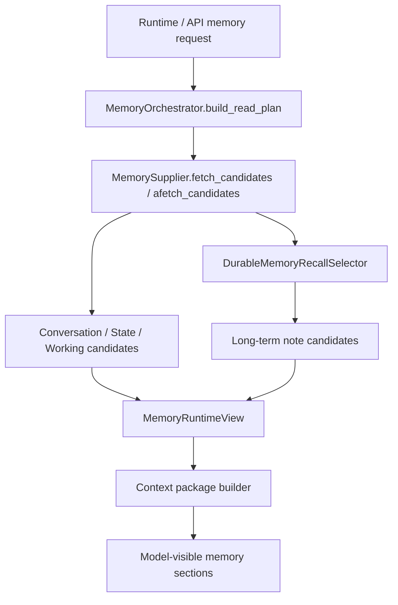
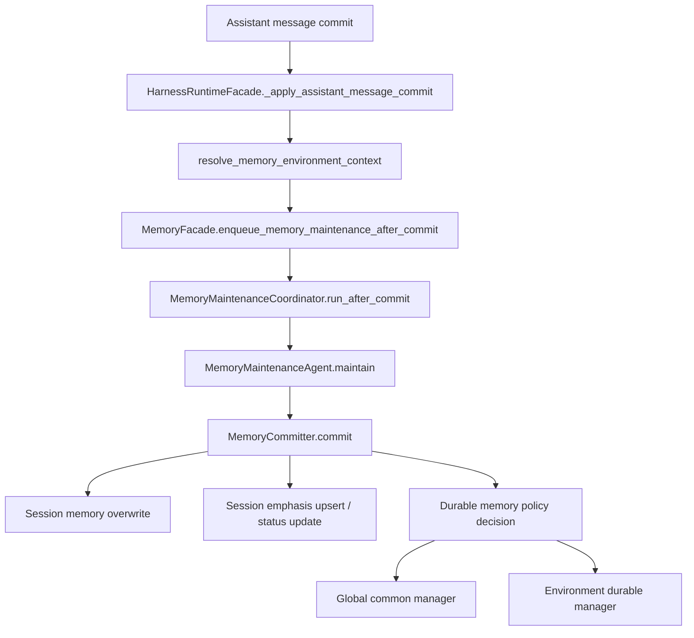
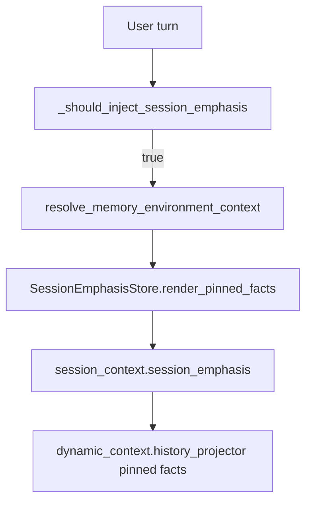

# 060-记忆系统架构链路审查与设计说明

日期：2026-06-04

## 1. 本次审查结论

本项目记忆系统当前应被理解为一个“受控候选供给 + 独立维护写入”的系统，而不是一个让 agent 自由读写的黑盒。

核心原则：

- Runtime 只能读取只读候选，不能直接获得写入长期记忆的权力。
- 记忆维护 agent 只能提出 session emphasis 和 durable memory proposal，最终写入必须经过 `MemoryCommitter` 校验与路由。
- 当前 turn 的任务环境是记忆读写的关键上下文，不能由 session 历史、压缩摘要或旧 task durable memory 隐式覆盖。
- `task_durable_memory` 当前仍是独立服务，runtime read plan 明确拒绝 `task_durable` / `task_durable_memory` 层。
- 会话级强调不是每轮强制注入，而是在当前请求、任务选择或近期工作信号表明需要时才作为 pinned facts 注入。

本次链路审查未发现 `MemoryReadAgent` / `read_agent` 旧命名仍在记忆系统主链路中残留；任务 durable memory 的主链路断开由回归测试保护。

## 2. 架构分层

当前记忆系统可以分为六层。

### 2.1 会话连续性层

代表模块：

- `backend/memory_system/continuity.py`
- `backend/memory_system/session_emphasis.py`
- `backend/memory_system/conversation_memory.py`
- `backend/memory_system/state_memory.py`

职责：

- 维护当前 session 的摘要、状态视图、调试视图和压缩恢复材料。
- 记录会话级用户强调事项，形成 `session_emphasis.json`。
- 提供 conversation/state 的只读候选。

边界：

- 会话连续性层可以恢复上下文，但不能把恢复候选提升为当前 turn 的事实。
- `MemoryRuntimeView` 会强制检查候选不能 `can_override_current_turn`，restore candidate 不能 `can_promote_to_current_fact`。

### 2.2 工作记忆层

代表模块：

- `backend/memory_system/working_memory_service.py`
- `backend/memory_system/working_memory_store.py`
- `backend/memory_system/working_memory_finalizer.py`

职责：

- 保存 task_run / node_run 作用域内的短期工作材料。
- 支持节点间 handoff、read log、temporal edge 和最终 archive/promotion 判定。

边界：

- 工作记忆是 task/runtime 的内部材料，不是全局偏好。
- runtime 读取工作记忆时必须带 `task_run_id`、`task_id`、`graph_id`、`owner_node_id`、`node_run_id`、`run_attempt_id` 等 scope。

### 2.3 长期记忆层

代表模块：

- `backend/memory_system/durable.py`
- `backend/memory_system/storage/memory_manager.py`
- `backend/memory_system/governance_service.py`

职责：

- 保存 durable note。
- 通过 `DurableMemoryRecallSelector` 按 manifest 选择当前 query 需要的 note。
- 维护全局 common namespace 和环境 namespace。

命名与边界：

- recall selector 是记忆系统内部的选择器，不是 orchestration subagent。
- 它不能回答用户，只能返回 note id selection。
- 没有 selector 配置时，长期记忆召回 fail closed：返回 no selector，不主动编造记忆。

### 2.4 环境上下文归一层

代表模块：

- `backend/memory_system/environment_context.py`
- `backend/harness/entrypoint/runtime_facade.py`

职责：

- 将当前 turn 的 task environment 归一成 `MemoryEnvironmentContext`。
- 统一长期记忆读写、session emphasis 注入和 maintenance manifest 的环境来源。

解析优先级：

1. 显式 `memory_environment_context`
2. `main_context.task_environment`
3. `main_context`
4. `runtime_assembly.task_environment`
5. `task_selection`
6. `active_work_context`
7. `recent_work_outcome`
8. session 当前 turn / task_run 对应的 `turn_environment_snapshot`
9. session active task environment
10. session scope / task binding

设计理由：

- explicit context 是系统边界给出的当前事实，优先级最高。
- runtime assembly 和 task_selection 是当前执行事实。
- session record 只能作为 fallback，用于恢复而不是覆盖当前 turn。

### 2.5 运行时只读供给层

代表模块：

- `backend/memory_system/runtime_supply.py`
- `backend/memory_system/bundle_service.py`
- `backend/memory_system/runtime_view.py`

职责：

- `MemoryOrchestrator` 构造 explicit read plan。
- `MemorySupplier` 根据 read plan 拉取 conversation/state/working/long_term 候选。
- `MemoryBundleService` 将候选交给 context policy 组装模型可见片段。
- `MemoryRuntimeView` 是 runtime 消费的只读视图。

关键规则：

- `requested_memory_layers` 必须显式声明。
- `task_durable` 和 `task_durable_memory` 由 `normalize_memory_layer` 明确拒绝。
- long-term read 需要 `allow_long_term_memory=True`，不是只要请求 long_term 就自动有权读取。
- 环境读默认是 `global_common + 当前环境 namespace`，可以通过 `global_common_allowed=False` 关闭全局 common。

### 2.6 维护写入层

代表模块：

- `backend/memory_system/maintenance.py`
- `backend/memory_system/facade.py`
- `backend/harness/entrypoint/runtime_facade.py`

职责：

- assistant message commit 后触发 memory maintenance。
- `MemoryMaintenanceAgent` 读取 message slice、session memory、manifest headers 和 decision context，提出 proposal。
- `MemoryCommitter` 负责 session memory、session emphasis、durable memory 的最终写入。

写入权威：

- agent 只能 propose。
- `MemoryCommitter` 决定是否写入、写入哪个 namespace、是否 active、是否 needs_review。
- durable write 必须通过 `_durable_policy_decision`。

重要策略：

- `reference` memory writes 当前关闭。
- `REJECTED_DURABLE_ORIGINS` 和 `REJECTED_EVIDENCE_SOURCE_KINDS` 会直接拒绝污染来源。
- turn/session horizon 的内容被 route 到 session，不进入 durable。
- global_common 非 manual governance 的内容进入 needs_review，不能直接 active 注入。
- 环境 durable active 只允许 tier1 explicit user preference：用户消息证据、environment/project_in_environment scope、memory_type=user、memory_class=preference、origin=explicit_user_preference。
- action 中携带的 `task_environment_id` 如果和当前 decision context 不一致，会被拒绝为 `task_environment_id_mismatch`。

## 3. 主链路

### 3.1 读链路

读链路调试方法：

- 先检查 `memory_request_profile.requested_memory_layers`。
- 再检查 `MemoryRuntimeView.diagnostics.read_plan`。
- 如果 long-term 没出现，检查 `allow_long_term_memory`、`task_environment_id`、`global_common_allowed` 和 selector 配置。
- 如果候选跨环境泄漏，检查 `environment_scope.read_namespaces` 和 durable layer resolver。

### 3.2 写链路

写链路调试方法：

- 看 receipt 的 `status`、`durable_write_count`、`durable_skip_reason`。
- 看 `diagnostics.durable_actions`，其中 `namespaces` 表示实际写入 namespace。
- 如果写入 global 而不是 env，检查 `decision_context.task_environment_id`。
- 如果 proposal 有 action 但未写入，检查 `routed` / `rejected` 原因。
- 如果 manifest 没看到 env note，检查 `_manifest_headers_for_decision_context` 是否得到当前环境 id。

### 3.3 会话强调注入链路

注入原则：

- 不每轮注入。
- 只有用户消息、任务选择、active work 或 recent outcome 表示需要时注入。
- 当前环境只看到无环境标签、global_common 或同环境 pinned facts。
- 环境标签不同的 session emphasis 不应混入当前环境。

## 4. 三层记忆策略

### 4.1 Session 级

用途：

- 记录当前会话内用户强调的要求、纠正和短期 steer。
- 跨上下文压缩保留，但不自动升级为长期偏好。

落点：

- `session_memory/<session>/session_emphasis.json`

写入方式：

- maintenance agent 提出 `session_emphasis_actions`。
- `MemoryCommitter.commit_session_emphasis_actions` 校验并写入。

注入方式：

- 由 harness 的 `_session_emphasis_for_turn` gate 决定是否注入。

### 4.2 Environment 级

用途：

- 记录某一任务环境内稳定、可复用的用户偏好或方法。
- 例如 coding 环境中的测试闭环偏好、writing 环境中的叙事策略偏好。

落点：

- `env:<task_environment_id>` durable namespace。

读写规则：

- 读：默认 `global_common + 当前 env`。
- 写：必须有当前 `task_environment_id`，并通过 `MemoryCommitter` policy。
- action 的环境 id 不能和当前 decision context 冲突。

### 4.3 Global common 级

用途：

- 记录所有环境共通且经过治理确认的稳定偏好。

规则：

- 默认可读，但应少写。
- 非 manual governance 的 global_common proposal 应进入 needs_review。
- 不能把某一环境的偏好轻易提升为 global_common。

## 5. 上下文压缩与记忆的关系

当前记忆系统不是上下文压缩本身，但为压缩提供可恢复材料。

相关模块：

- `MemoryBundleService.inspect_memory_context_compaction`
- `MemoryBundleService.build_memory_compaction_result`
- `StateMemoryStoreAdapter.restore_candidates`
- `MemoryRuntimeView.restore_candidates`

设计边界：

- 压缩可以恢复 state/conversation 候选。
- 压缩恢复不能覆盖当前 turn 的事实。
- restore candidate 不允许 `can_promote_to_current_fact`。
- durable memory 是长期候选，不是压缩摘要的替代品。

调试压缩问题时应区分：

- 当前 turn 输入事实是否正确。
- 压缩恢复材料是否过期。
- runtime view 是否把旧 restore candidate 暴露成当前事实。
- context package 是否把候选排序或预算裁剪错了。

## 6. 当前已知风险

### 6.1 工作区中存在非记忆系统大 diff

当前工作区还包含 permissions、runtime tool、frontend、MCP、orchestration、docs 等改动。这些不属于记忆系统链路审查的必要范围。后续清理时应单独审查，不应和记忆系统修复混在一个提交里。

### 6.2 异步长期记忆链路需要保持单一入口

API 已经应通过 `abuild_memory_runtime_view` 和 `abuild_memory_context_package_result` 走异步链路，避免事件循环内同步 recall 返回空结果。

禁止：

- 在 async API 中调用同步 `build_memory_runtime_view` 来读取 long-term。
- 为了绕过事件循环问题直接禁用 long-term。

### 6.3 环境 fallback 不能反客为主

`resolve_memory_environment_context` 的 session record snapshot 只是 fallback。后续如果新增调用方，必须优先传入当前 runtime assembly 或 explicit memory environment context。

风险场景：

- 用户在同一会话中从 coding 切到 writing。
- 压缩后恢复了旧环境 snapshot。
- maintenance 写入时没有 explicit context，导致环境级偏好落到 global common。

### 6.4 Session emphasis 注入要保持低频

session emphasis 是“会话强调通道”，不是每轮系统提示扩写。继续保持 gate 注入，避免把短期 steer 固化成常驻 prompt。

## 7. Debug Checklist

### 7.1 长期记忆没有召回

检查顺序：

1. `requested_memory_layers` 是否包含 `long_term`。
2. `allow_long_term_memory` 是否为 true。
3. selector 是否配置了 message invoker。
4. manifest 是否有 eligible note。
5. 当前 `task_environment_id` 是否正确。
6. 是否在 async API 中误用了同步 recall。

### 7.2 长期记忆写错环境

检查顺序：

1. maintenance receipt 的 `decision_context.task_environment_id`。
2. `memory_environment_context` 是否传入 facade / coordinator。
3. `durable_actions.namespaces` 是否为 `env:<id>`。
4. action 自带 `task_environment_id` 是否和当前 context mismatch。
5. `_manifest_headers_for_decision_context` 是否扫描 global + env。

### 7.3 会话强调污染环境

检查顺序：

1. `session_emphasis.json` 中 item 的 `task_environment_id`。
2. `_session_emphasis_for_turn` 解析到的当前环境。
3. `SessionEmphasisStore.render_pinned_facts(..., task_environment_id=...)` 是否传入环境 id。
4. scope 是否是 `global_common`。

### 7.4 task durable memory 被误接入

检查顺序：

1. `MemoryFacade` 不应暴露 `task_durable_memory`。
2. `MemoryBundleService` 不应有 `build_task_durable_memory_context_candidates`。
3. read plan 中请求 `task_durable` / `task_durable_memory` 应抛错。
4. 回归测试 `task_durable_memory_regression.py` 必须保持。

## 8. 后续维护原则

- 新记忆能力必须先明确层级：session、environment、global_common、working，不能直接丢给 agent 自由判断。
- agent 只能产生 proposal，提交层必须拥有最终写入权威。
- 读取链路只提供 candidate，不允许 candidate 覆盖当前 turn。
- 环境级记忆优先落到环境 namespace，不允许因缺 context 自动提升 global。
- 压缩恢复只恢复状态，不重新决定用户意图。
- 非记忆系统改动不要和记忆链路修复混提交。

