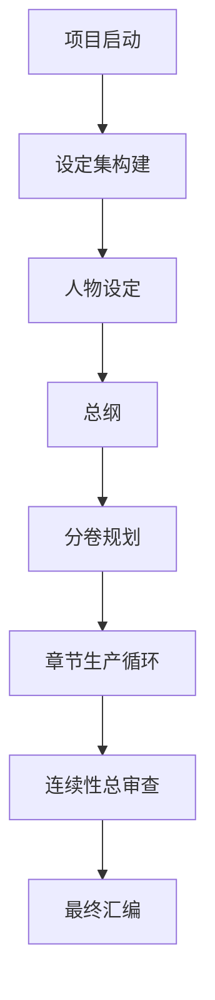
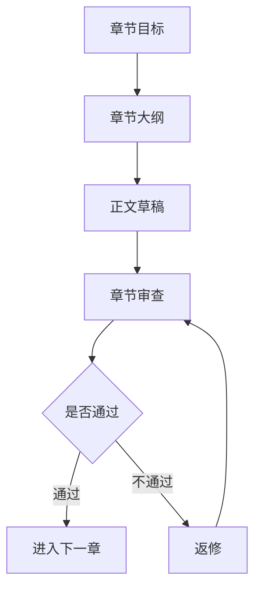

# 任务系统 LangGraph 协调任务与长篇小说图形化重构计划书

日期：2026-05-06

## 一、文档定位

本文是任务系统下一轮重构的执行计划书，目标是把“协调任务”从当前的字段式、半运行态同步模型，重构为可视化图结构 + LangGraph 后端执行模型，并基于新架构重新设计“长篇小说写作域”的协调任务。

本文不直接修改代码。它锁定后续实现边界、对象模型、前后端施工顺序、验收标准和长篇小说实战方案。

本轮范围：

- 后端：只重构协调任务的多 Agent 执行层，引入 LangGraph。
- 前端：把协调任务改为图形化管理，减少字段暴露。
- 任务设计：以“写作域”为最高管理层，重新设计长篇小说协调任务。
- 实测：新架构完成后，重跑长篇小说实战，不允许只产报告不产成果。

本轮不做：

- 不重写单 Agent / 通用 Agent runtime。
- 不把编排系统改成任务语义管理系统。
- 不把 Agent 组变成任务域或协调任务的替代品。
- 不继续保留无用旧兼容路径作为主要路径。

## 二、源码现状报告

### 2.1 当前任务系统对象

源码中的任务系统核心对象位于：

- `backend/tasks/flow_models.py`
- `backend/tasks/flow_registry.py`
- `backend/api/tasks.py`
- `frontend/src/components/workspace/views/TaskSystemView.tsx`
- `frontend/src/lib/api.ts`

当前已有对象：

- `TaskDomainRecord`：任务域。
- `SpecificTaskRecord`：特定任务。
- `TaskAgentAdoptionPlan`：目前对外已等价为任务执行策略兼容对象。
- `TaskProjectionBinding`：投影绑定。
- `TaskFlowContractBinding`：流程契约绑定。
- `TaskMemoryRequestProfile`：记忆请求。
- `CoordinationTaskDefinition`：协调任务。
- `TopologyTemplate`：拓扑模板。
- `TaskCommunicationProtocol`：通信协议。

当前 `CoordinationTaskDefinition` 已经包含：

- `task_family`
- `domain_id`
- `agent_group_id`
- `subtask_refs`
- `graph_nodes`
- `graph_edges`
- `communication_modes`

这说明当前模型已经开始从“协调链字段配置”转向“协调任务图结构”，但执行层还没有真正以图引擎运行。

### 2.2 当前编排系统对象

编排系统相关文件：

- `backend/orchestration/agent_models.py`
- `backend/orchestration/agent_registry.py`
- `backend/orchestration/agent_runtime_models.py`
- `backend/orchestration/agent_runtime_registry.py`
- `backend/orchestration/agent_group_models.py`
- `backend/orchestration/agent_group_registry.py`
- `backend/api/orchestration.py`

当前编排系统已经有三类 Agent：

- `main_agent`
- `system_management_agent`
- `worker_sub_agent`

当前也已经有 `AgentGroup`：

- `group_id`
- `group_kind`
- `coordinator_agent_id`
- `member_agent_ids`
- `default_topology_template_ids`
- `default_communication_protocol_ids`
- `allowed_coordination_task_ids`

这里需要纠偏：

Agent 组属于编排系统，负责管理“哪些 Agent 作为一组可被协调任务采用”。它不是任务语义对象，不定义写作任务的阶段、拓扑含义、通信协议含义。

### 2.3 当前 runtime 协调执行现状

当前协调任务运行主要在：

- `backend/orchestration/runtime_loop/task_run_loop.py`
- `backend/orchestration/runtime_loop/coordination_flow.py`
- `backend/orchestration/runtime_loop/models.py`
- `backend/orchestration/runtime_loop/state_index.py`
- `backend/orchestration/runtime_loop/trace_reader.py`

当前 trace 证据对象：

- `TaskRun`
- `AgentRun`
- `CoordinationRun`
- `CoordinationNodeRun`
- `AgentHandoffEnvelope`
- `CoordinationMergeResult`

当前问题：

1. `TaskRunLoop` 同时承担单 Agent loop、协调任务对象创建、节点运行对象同步、handoff 同步、merge 结果创建，职责过重。
2. 协调任务的拓扑没有由真正的图执行引擎推进，而是根据 `TopologyTemplate / coordination_flow` 手工同步 runtime objects。
3. `graph_nodes / graph_edges` 已进入任务模型，但 runtime 仍主要依赖旧 `topology_template_id` 和通信协议字段。
4. 前端虽然出现图结构展示，但不是以“图编辑即执行图”为核心，仍保留较多字段式配置。
5. 长篇小说任务已经有 agent group 和多个 coordination task，但缺少统一的“写作域内长篇项目图”作为主协调任务入口。

## 三、外部参考依据

LangGraph 官方 Graph API 使用 `StateGraph` 建模节点和边，使用 `START / END` 指定入口和终点。这与本项目“协调任务 = 多 Agent 节点 + handoff 边 + merge 终点”的结构一致。参考：[LangGraph Graph API overview](https://docs.langchain.com/oss/python/langgraph/graph-api)。

LangGraph persistence 文档强调 checkpoint 可用于恢复、调试、human-in-the-loop、故障容错。这与本项目 runtime 已有 `RuntimeCheckpointStore / RuntimeStateIndex / trace_reader` 的方向一致。参考：[LangGraph Persistence](https://docs.langchain.com/oss/python/langgraph/persistence)。

LangGraph interrupts 支持长任务中的外部审批、暂停和恢复。长篇小说百万字任务需要阶段验收、返修、继续执行，因此后续可在章节验收、卷验收、最终汇编阶段接入 interrupt。参考：[LangGraph Interrupts](https://docs.langchain.com/oss/python/langgraph/human-in-the-loop)。

前端图形化编辑可采用 React Flow / `@xyflow/react`。官方文档说明它内置节点、边、拖拽、缩放、选择和增删元素能力，适合当前“协调任务图编辑”场景。参考：[React Flow Quick Start](https://reactflow.dev/learn/getting-started/installation-and-requirements)。

## 四、必须锁死的架构边界

### 4.1 runtime 改造范围

本轮 runtime 只改协调任务，不改通用 Agent。

具体含义：

- `single_agent_chain` 继续走现有单 Agent runtime。
- 普通任务、健康单 Agent 检查、开发单任务修复不强行接 LangGraph。
- 只有当 `TaskExecutionAssembly.execution_chain_type == coordination_chain` 或存在明确 `coordination_task_record` 时，才进入 LangGraph 协调 runner。
- LangGraph runner 输出仍必须落回现有正式 trace 对象，不能绕过 `TaskRun / AgentRun / CoordinationRun / CoordinationNodeRun / Handoff / MergeResult`。

原因：

单 Agent runtime 的问题是“单个 Agent 怎样运行”；协调任务的问题是“多个 Agent 节点如何按任务图通信、循环和合并”。这两个问题不应该一起重写，否则边界会再次混乱。

### 4.2 任务系统边界

任务系统负责：

- 任务域
- 特定任务
- 任务装配要求
- 协调任务图
- 协调任务内的子任务引用
- 协调任务通信模式
- 任务验收标准

任务系统不负责：

- Agent 名册 CRUD
- Agent runtime profile 配置
- 单 Agent body / prompt / memory / tool runtime 装配
- 临场创建常态 Agent

### 4.3 编排系统边界

编排系统负责：

- Agent 名册
- Agent 分类
- Agent 运行 profile
- Agent 权限、操作、上下文、记忆、输出边界
- Agent 组
- 单 Agent runtime 装配

编排系统不负责：

- 定义任务域
- 定义特定任务
- 定义协调任务的任务阶段语义
- 定义写作长篇任务的章节、卷、审校流程

### 4.4 Agent 组边界

Agent 组是编排系统对象。

它回答：

`这一组 Agent 可以作为某类协调任务的执行团队吗？`

它不回答：

`这篇长篇小说要怎么写？`

所以：

- `AgentGroup` 可以被协调任务引用。
- `AgentGroup` 可以声明成员、协调者、可用任务范围。
- `CoordinationTaskDefinition` 仍必须保存任务图、节点角色、边、通信模式、验收规则。
- 写作域内的协调任务可以引用 `group.writing.longform_novel_core`，但不能把写作流程定义塞回 Agent 组。

## 五、目标架构

### 5.1 总体结构

```text
任务域 Domain
  ├─ 入口识别
  ├─ 特定任务 SpecificTask
  ├─ 单任务装配 Assembly
  └─ 协调任务 CoordinationTask
       ├─ 协调图 Graph
       │   ├─ 节点 Node：阶段、角色、子任务引用、所需 Agent 能力
       │   └─ 边 Edge：通信模式、handoff、返修、并行/汇合
       ├─ 通信协议 Protocol
       ├─ 验收/返修规则 Acceptance
       └─ Agent 组引用 AgentGroupRef

编排系统 Orchestration
  ├─ Agent 名册
  ├─ Agent 组
  ├─ Agent runtime profile
  └─ 单 Agent runtime 装配

runtime
  ├─ single_agent_chain：现有 TaskRunLoop
  └─ coordination_chain：LangGraph CoordinationRunner
       └─ 输出现有 formal trace objects
```

### 5.2 后端目标分层

新增或重构为以下后端层：

1. `CoordinationGraphSpec`

   任务系统侧规范对象。由 `CoordinationTaskDefinition` 派生，保存图节点、图边、节点类型、子任务引用、通信模式、验收规则。

2. `CoordinationGraphCompiler`

   负责任务系统对象到 runtime 可执行图的编译。它只做结构校验和编译，不执行模型。

3. `LangGraphCoordinationRunner`

   负责编译并运行 `StateGraph`。它只处理协调任务图，不处理单 Agent runtime。

4. `CoordinationTraceAdapter`

   把 LangGraph 执行结果写回现有 trace formal objects：

   - `CoordinationRun`
   - `CoordinationNodeRun`
   - `AgentHandoffEnvelope`
   - `CoordinationMergeResult`

5. `CoordinationCheckpointAdapter`

   对接 LangGraph checkpoint 与现有 runtime checkpoint。第一阶段可以只保留现有 runtime checkpoint；长任务阶段必须加入可恢复 graph state。

### 5.3 前端目标分层

任务系统前端不再做大平面。

目标层级：

```text
任务系统
  ├─ 任务域列表
  │   └─ 域详情：写作域 / 开发域 / 健康管理域
  ├─ 域内特定任务
  │   └─ 单任务装配
  └─ 域内协调任务
      ├─ 协调任务列表
      ├─ 图编辑器
      ├─ 节点检查器
      ├─ 边/通信检查器
      └─ 预览与校验
```

图编辑器要求：

- 节点拖拽、缩放、选择。
- 新增节点从“本任务域特定任务清单”选择，不允许跨域乱选。
- 节点可设置中文名、节点类型、承接角色、需要能力、绑定子任务。
- 边通过拖拽连接，不让用户手写 `from/to`。
- 通信协议用中文模式选择，不暴露后端字段名。
- 只有高级调试区才可查看原始 JSON。

## 六、后端重构计划

### 阶段 A：冻结旧协调执行边界

目标：

把当前协调任务的旧执行路径标记为待迁移路径，避免继续向 `TaskRunLoop` 里加字段补丁。

涉及文件：

- `backend/orchestration/runtime_loop/task_run_loop.py`
- `backend/orchestration/runtime_loop/coordination_flow.py`
- `backend/orchestration/runtime_loop/models.py`
- `backend/tests/orchestration_cutover_regression.py`
- `backend/tests/query_runtime_runtime_loop_regression.py`

动作：

- 标出当前 `_sync_coordination_runtime_objects` 的职责边界。
- 明确它只作为迁移前旧路径。
- 新增测试断言：单 Agent 路径不得出现 LangGraph runner 证据。
- 新增测试断言：协调任务必须进入 coordination runner dispatch。

完成条件：

- 不改业务行为。
- 现有协调 trace 测试仍通过。
- 文档和测试明确“只迁移协调任务”。

禁止：

- 不在本阶段改前端。
- 不把所有 runtime 改成 LangGraph。
- 不新增更多旧字段兼容。

### 阶段 B：建立协调图规范对象

目标：

让后端有一个明确的协调图规范，不再让前端图、拓扑模板、通信协议各说各话。

建议新增文件：

- `backend/tasks/coordination_graph_models.py`
- `backend/tasks/coordination_graph_compiler.py`

核心对象：

```python
CoordinationGraphSpec
CoordinationGraphNode
CoordinationGraphEdge
CoordinationNodeRoleRequirement
CoordinationCommunicationMode
CoordinationAcceptanceRule
```

节点类型建议：

- `planning`：规划节点
- `worldbuilding`：设定节点
- `outline`：大纲节点
- `drafting`：正文写作节点
- `review`：审查节点
- `revision`：返修节点
- `merge`：合并节点
- `acceptance`：验收节点

边模式建议：

- `handoff`：顺序交接
- `review_feedback`：审查反馈
- `revision_loop`：返修循环
- `parallel_fanout`：并行分发
- `join_merge`：汇合合并
- `approval_gate`：验收门

编译规则：

- `CoordinationTaskDefinition.graph_nodes` 是优先来源。
- 旧 `TopologyTemplate.nodes` 只作为迁移补全来源。
- `graph_edges` 是优先来源。
- 旧 `TopologyTemplate.edges` 只作为迁移补全来源。
- `communication_modes` 作为边模式候选。
- `subtask_refs` 必须来自当前 `domain_id` 内的特定任务。
- 节点可以引用特定任务，但不是所有特定任务都必须属于协调任务。

完成条件：

- API 输出能给前端一个规范化 `coordination_graph_spec`。
- 任一跨域子任务引用会报错。
- 缺少起点、终点、孤立节点、非法循环都能给出明确诊断。

### 阶段 C：引入 LangGraph 协调 runner

目标：

用 LangGraph 作为协调任务多 Agent 图执行引擎。

建议新增文件：

- `backend/orchestration/runtime_loop/langgraph_coordination_runner.py`
- `backend/orchestration/runtime_loop/coordination_trace_adapter.py`
- `backend/orchestration/runtime_loop/coordination_checkpoint_adapter.py`

runner 输入：

- `task_run_id`
- `CoordinationGraphSpec`
- `coordination_task_record`
- `agent_group`
- `agent_runtime_profiles`
- `task_execution_assembly`
- `runtime_context`

runner 输出：

- graph execution state
- node execution results
- handoff events
- merge result
- acceptance status
- failure diagnostics

dispatch 规则：

```text
if execution_chain_type == single_agent_chain:
    existing single agent runtime
elif execution_chain_type == coordination_chain:
    LangGraphCoordinationRunner
else:
    fail closed
```

LangGraph 映射：

- `CoordinationGraphNode` -> `StateGraph.add_node`
- `CoordinationGraphEdge` -> `StateGraph.add_edge`
- 起点 -> `START`
- 终点 -> `END`
- 返修循环 -> conditional edge
- 并行节点 -> fanout / join
- 验收门 -> conditional edge 或 interrupt

trace 适配：

LangGraph 不替代现有 trace，它产生的执行事实必须写入：

- `coordination_run_created`
- `coordination_node_run_created`
- `handoff_envelope_created`
- `coordination_stage_updated`
- `coordination_merge_result_created`
- `coordination_flow_finalized`

新增 trace 诊断字段：

```json
{
  "coordination_engine": "langgraph",
  "graph_spec_ref": "...",
  "langgraph_thread_id": "...",
  "langgraph_checkpoint_ref": "...",
  "graph_node_count": 0,
  "graph_edge_count": 0
}
```

完成条件：

- 协调任务 trace 中必须能看到 `coordination_engine=langgraph`。
- `coordination_runs[0].node_runs` 不为空。
- `coordination_runs[0].handoff_envelopes` 不为空。
- `latest_merge_result` 不为空。
- 单 Agent 任务 trace 不出现 LangGraph 协调证据。

### 阶段 D：长任务 checkpoint 与恢复

目标：

让长篇小说任务可以长时间运行、暂停、恢复、验收、返修，而不是靠一次调用硬跑完。

动作：

- `CoordinationCheckpointAdapter` 对齐现有 `RuntimeCheckpointStore`。
- 每个章节、每个审查、每个返修循环都生成可恢复 checkpoint。
- 对长任务支持 `runtime_limits` 中的 `max_runtime_seconds = null` 或 `time_limit_policy = unlimited`。
- 将时限归入任务管理，而不是写死在 runtime。

完成条件：

- graph state 可恢复。
- 中断后可以从最近 checkpoint 继续。
- 失败节点不导致全任务证据丢失。
- 长篇小说任务可以分批推进。

## 七、前端图形化重构计划

### 7.1 技术选择

建议使用 `@xyflow/react`。

原因：

- 当前前端是 React / Next。
- 协调任务需要节点、边、拖拽、缩放、选择、删除、连接。
- React Flow 官方支持这些基本图编辑能力。
- 自己手写 SVG 编辑器会很快变成维护负担。

新增依赖：

```json
"@xyflow/react": "latest-compatible"
```

实际版本在实施时锁定，不使用宽泛 `latest`。

### 7.2 页面结构

重构 `TaskSystemView.tsx` 为多个组件，避免继续堆在单文件。

建议新增：

- `frontend/src/components/workspace/task-system/TaskDomainShell.tsx`
- `frontend/src/components/workspace/task-system/DomainTaskList.tsx`
- `frontend/src/components/workspace/task-system/SpecificTaskEditor.tsx`
- `frontend/src/components/workspace/task-system/TaskAssemblyEditor.tsx`
- `frontend/src/components/workspace/task-system/CoordinationTaskList.tsx`
- `frontend/src/components/workspace/task-system/CoordinationGraphEditor.tsx`
- `frontend/src/components/workspace/task-system/CoordinationNodeInspector.tsx`
- `frontend/src/components/workspace/task-system/CoordinationEdgeInspector.tsx`
- `frontend/src/components/workspace/task-system/CoordinationGraphValidationPanel.tsx`

### 7.3 任务域层 UI

任务域卡片只显示：

- 中文名称
- 特定任务数量
- 协调任务数量
- 是否启用

不显示：

- `domain_id`
- `task_family`
- metadata
- 兼容字段
- 后端原始字段

任务域详情右上角提供：

- 改名
- 启用/停用
- 删除

新增任务域：

- 创建后直接进入命名状态。
- 删除任务域时必须提示：会删除域内特定任务、协调任务和域内装配引用。

### 7.4 特定任务层 UI

特定任务在任务域内部展示。

左侧是任务目录，右侧是当前任务编辑。

特定任务卡片只显示：

- 任务中文名
- 类型标签
- 是否已配置 workflow
- 是否已配置验收

不显示：

- id
- raw metadata
- 后端字段名

### 7.5 协调任务图 UI

协调任务必须在当前任务域内部管理。

写作域中只显示写作域的协调任务。

图编辑器结构：

```text
左侧：协调任务列表
中间：图画布
右侧：当前选中节点/边检查器
底部：校验结果和保存状态
```

节点新增方式：

- 从本域特定任务选择。
- 或创建“纯协调节点”，例如验收门、合并门。

节点显示：

- 中文节点名
- 节点类型
- 绑定任务中文名
- 承接角色

节点不显示：

- raw id
- metadata
- JSON

边新增方式：

- 从节点拖拽连接。
- 在右侧选择通信模式。

通信模式中文选项：

- 顺序交接
- 审查反馈
- 返修循环
- 并行分发
- 汇合合并
- 验收门

保存时：

- 前端将中文选择映射为后端枚举。
- 后端返回规范化图。
- 前端重新渲染规范化结果。

### 7.6 原始字段管理原则

默认页面不显示 raw JSON。

仅保留“高级调试”折叠区：

- 查看后端规范化 payload。
- 复制诊断信息。
- 不作为主要编辑入口。

## 八、长篇小说写作域新架构设计

### 8.1 写作域作为最高层

写作相关任务全部属于：

```text
domain.writing
```

写作域内对象：

- 长篇小说项目创建
- 世界观与设定集
- 人物设定
- 总纲
- 分卷大纲
- 章节大纲
- 章节正文
- 章节审查
- 章节返修
- 连续性审查
- 最终汇编

### 8.2 特定任务清单

建议写作域保留以下特定任务：

1. `task.writing.longform_project`

   长篇项目启动。定义题材、篇幅、目标读者、叙事风格、总目标。

2. `task.writing.story_worldbuilding`

   世界观与基础设定。不要叫“小说圣经”，前端中文名统一为“设定集”。

3. `task.writing.character_design`

   人物设定。

4. `task.writing.master_outline`

   总纲。

5. `task.writing.volume_outline`

   分卷大纲。

6. `task.writing.chapter_outline`

   章节大纲。

7. `task.writing.chapter_draft`

   章节正文。

8. `task.writing.chapter_review`

   章节审查。

9. `task.writing.chapter_revision`

   章节返修。

10. `task.writing.continuity_audit`

   连续性审查。

11. `task.writing.final_compilation`

   最终汇编。

### 8.3 Agent 组

编排系统中保留：

```text
group.writing.longform_novel_core
```

建议成员角色：

- 总协调 Agent：负责阶段推进、验收门和最终合并。
- 设定 Agent：负责世界观、规则、地点、势力。
- 人物 Agent：负责人物动机、成长线、关系。
- 大纲 Agent：负责总纲、分卷、章节结构。
- 正文 Agent：负责章节正文。
- 审校 Agent：负责风格、逻辑、文本质量。
- 连续性 Agent：负责跨章节一致性。

注意：

这些角色属于 Agent 组和 runtime 角色匹配，不等于任务系统直接绑定具体 Agent。任务系统提出“需要这些角色和能力”，编排系统提供符合条件的常态 Agent。

### 8.4 长篇小说主协调任务

新增主协调任务：

```text
coord.writing.longform_novel_project
```

它是写作域内的父级协调任务。

它包含多个阶段子图：



### 8.5 章节生产循环

章节生产不是一个简单节点，而是循环子图：



每章必须产物：

- 章节大纲
- 正文
- 审查意见
- 返修记录
- 通过状态

未通过时：

- 禁止进入下一章。
- 必须生成返修任务。
- 返修后回到审查节点。

### 8.6 百万字任务拆分方式

百万字长篇不能作为一次性“生成一百万字”执行。

推荐拆分：

- 全书目标：约 100 万字。
- 分卷：5 卷。
- 每卷：约 20 万字。
- 每卷章节：40 章。
- 每章：约 5000 字。
- 总章节：约 200 章。

执行粒度：

- 主协调任务管理全书。
- 分卷协调任务管理单卷。
- 章节生产循环管理单章。

验收粒度：

- 章级验收：正文质量、设定一致、人物动机、伏笔推进。
- 卷级验收：节奏、结构、冲突升级、伏笔回收。
- 全书验收：主题闭环、人物弧光、世界观一致性。

### 8.7 长篇小说通信协议

前端中文模式：

- 任务交接
- 设定引用
- 审查反馈
- 返修请求
- 返修提交
- 验收通过
- 汇总合并

后端枚举映射：

```json
{
  "任务交接": "handoff",
  "设定引用": "context_reference",
  "审查反馈": "review_feedback",
  "返修请求": "revision_request",
  "返修提交": "revision_submission",
  "验收通过": "acceptance_signal",
  "汇总合并": "merge_signal"
}
```

### 8.8 长篇小说成果目录

实战产物必须落地，不允许只有报告。

建议目录：

```text
docs/系统规划/任务系统实测记录/artifacts/YYYYMMDD/E5-longform-novel-langgraph/
  project_spec.md
  setting_pack.md
  character_book.md
  master_outline.md
  volumes/
    volume_01_outline.md
  chapters/
    volume_01/
      chapter_001.md
      chapter_001_review.md
      chapter_001_revision.md
  runtime/
    task_run_id.txt
    trace.json
    events.json
    graph_state.json
  acceptance/
    chapter_001_acceptance.md
    volume_01_acceptance.md
```

## 九、实施阶段总表

### P0：计划冻结

产物：

- 本计划书。
- 09 实施清单同步调整。

验收：

- 用户确认边界：只改协调任务 runtime，不改通用 Agent runtime。

### P1：后端协调图规范

产物：

- `CoordinationGraphSpec`
- 图校验器
- 图编译器
- API 返回规范化图

验收：

- 跨域引用失败。
- 孤立节点失败。
- 无起点或无终点失败。
- 合法写作域协调图通过。

### P2：LangGraph runner 接入

产物：

- LangGraph 协调 runner。
- trace adapter。
- dispatch 改造。

验收：

- 协调任务 trace 显示 `coordination_engine=langgraph`。
- 单 Agent 任务不走 LangGraph。
- 旧协调测试迁移到新 trace 断言。

### P3：checkpoint 与长任务恢复

产物：

- graph state checkpoint。
- 继续执行接口。
- 无限时限任务策略。

验收：

- 中断后可恢复。
- 章节任务失败可定位到节点。
- 返修后可从失败节点继续。

### P4：前端图形化管理

产物：

- 域内协调任务图编辑器。
- 节点检查器。
- 边/通信检查器。
- 图校验面板。
- 高级调试折叠区。

验收：

- 不手写 from/to 也能创建边。
- 不暴露后端 id 作为主显示。
- 节点只能引用当前域任务。
- 保存后后端规范化图能回显。

### P5：长篇小说协调任务重建

产物：

- 写作域主协调任务。
- 长篇小说 Agent 组引用。
- 章节生产循环图。
- 通信协议中文映射。
- 验收规则。

验收：

- 前端能看到完整图。
- 后端能编译图。
- runtime 能执行至少一个完整章节循环。

### P6：长篇小说实战

产物：

- 真实设定集。
- 真实人物设定。
- 真实总纲。
- 至少一卷大纲。
- 至少一个章节完整闭环：大纲、正文、审查、返修、验收。

验收：

- trace 有 LangGraph 证据。
- 产物文件存在且内容达标。
- 失败时必须修复并复测。
- 不允许只写实验报告。

## 十、文件级清单

### 后端任务系统

- `backend/tasks/flow_models.py`
  - 保留 `CoordinationTaskDefinition`
  - 增加或关联规范化图字段
  - 完成条件：协调任务可完整表达图结构

- `backend/tasks/flow_registry.py`
  - 约束协调任务属于任务域
  - 删除无用旧兼容路径
  - 完成条件：写作域只加载写作域协调任务

- `backend/api/tasks.py`
  - 增加图规范预览/校验接口
  - 完成条件：前端保存前可校验图

- `backend/tasks/coordination_graph_models.py`
  - 新增
  - 完成条件：定义规范图对象

- `backend/tasks/coordination_graph_compiler.py`
  - 新增
  - 完成条件：从任务对象编译执行图

### 后端 runtime

- `backend/orchestration/runtime_loop/task_run_loop.py`
  - 只保留 dispatch 与 trace 总控
  - 移除协调图执行细节
  - 完成条件：协调执行转交 runner

- `backend/orchestration/runtime_loop/langgraph_coordination_runner.py`
  - 新增
  - 完成条件：能运行协调图

- `backend/orchestration/runtime_loop/coordination_trace_adapter.py`
  - 新增
  - 完成条件：LangGraph 结果写回正式 trace

- `backend/orchestration/runtime_loop/coordination_checkpoint_adapter.py`
  - 新增
  - 完成条件：长任务可恢复

### 编排系统

- `backend/orchestration/agent_group_models.py`
  - 保留 Agent 组
  - 不塞任务图语义
  - 完成条件：Agent 组只表达团队和可用范围

- `backend/api/orchestration.py`
  - Agent 组管理接口补齐校验
  - 完成条件：前端可管理写作 Agent 组

### 前端

- `frontend/src/components/workspace/views/TaskSystemView.tsx`
  - 拆分
  - 完成条件：不再承担全部任务系统 UI

- `frontend/src/components/workspace/task-system/CoordinationGraphEditor.tsx`
  - 新增
  - 完成条件：图形化编辑协调任务

- `frontend/src/lib/api.ts`
  - 增加图规范接口类型
  - 完成条件：前端不靠 raw JSON 拼图

- `frontend/src/app/globals.css`
  - 增加图编辑器样式
  - 完成条件：视觉统一、不拥挤

### 测试

- `backend/tests/task_system_api_regression.py`
  - 增加任务域内协调图校验

- `backend/tests/orchestration_cutover_regression.py`
  - 改为断言 LangGraph 协调 runner

- `backend/tests/task_system_real_acceptance_regression.py`
  - 增加长篇小说章节闭环

- `frontend` 构建测试
  - `npm run build`

## 十一、验收矩阵

### 后端验收

- 单 Agent 任务仍走原 runtime。
- 协调任务走 LangGraph runner。
- trace 包含 `coordination_engine=langgraph`。
- graph 节点数、边数、handoff 数与协调任务图一致。
- merge result 必须存在。
- 失败节点必须可定位。
- 长任务 checkpoint 可恢复。

### 前端验收

- 任务域为最高层。
- 协调任务只显示在所属任务域内。
- 图形化创建节点和边。
- 中文名为主，不暴露 raw id。
- 通信协议用中文模式选择。
- 保存、加载、校验失败有明确反馈。
- 高级 JSON 只在折叠调试区。

### 长篇小说实战验收

- 必须通过 Agent 组 + 协调任务图执行。
- 必须产生真实文件。
- 必须有内循环和纠错审查。
- 未通过章节不得进入下一章。
- 失败后必须修复图、协议、任务配置或 runtime，再复测，直到验收完成。

## 十二、禁止的捷径

- 禁止只改前端显示，不改后端执行。
- 禁止只写实验报告，不交付真实产物。
- 禁止把所有任务都临时塞进一个协调任务。
- 禁止把 Agent 组当成任务语义。
- 禁止把协调任务做成字段表单。
- 禁止让用户手写大量后端枚举。
- 禁止为了兼容保留无用旧路径作为主路径。
- 禁止把单 Agent runtime 和协调任务 runtime 一起重写。

## 十三、最终预期结果

完成后，系统应达到以下状态：

- 任务域是任务系统最高管理层。
- 特定任务和协调任务都严格属于任务域。
- 协调任务由图结构定义，不再靠字段堆叠。
- 后端协调任务由 LangGraph 执行。
- runtime trace 仍保持本项目正式证据合同。
- 前端可用中文图形化方式管理协调任务。
- 长篇小说任务可以按阶段、章节、返修、验收长期推进。
- 失败可以定位、修复、复测，而不是用报告掩盖。
