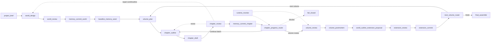

# 写作任务动态推进与叙事脉络设计补充计划书

日期：2026-05-18  
状态：设计计划书，尚未执行配置  
适用范围：写作任务域、TaskGraph 动态推进、章节续写、世界观/大纲修订、叙事脉络组织、运行时上下文隔离

## 0. 结论

这次要补的不是“再加几个写作节点”，而是把小说创作变成一个**持续推进、可续接、可修订、可回收伏笔**的运行系统。

核心判断如下：

1. 续写不是重连聊天记录，而是从**已提交的运行事实**重建当前节点输入。
2. 节点交接不是转述上一轮聊天，而是交付一份结构化的**continuity packet**。
3. 世界观和大纲不能只靠人肉记忆维护，必须有**版本化、可失效、可传播**的修订链。
4. 伏笔和脉络不能停留在提示词里，必须沉到独立的**thread_ledger**，成为可审计的叙事状态。
5. 只有 `accepted` / `committed` 的结果才能推进后续节点，候选稿和审稿意见都必须隔离。

这份补充计划是对 `165-写作任务重配置设计计划书` 的动态层扩展。

---

## 1. 这次真正要解决的问题

用户想要的是一个能“实时推进小说创作进度”的系统，不只是一次性把章节写出来。这里实际卡住的是五件事：

1. 节点之间怎么接续前文，而不是每次都重新解释世界。
2. 节点之间怎么交接，尤其是写手如何接住上一章、上一批、上一卷留下的状态。
3. 世界观、人物关系、章节大纲如何及时修订，并且把修订传播给后续节点。
4. 伏笔、线索、脉络如何结构化管理，避免“写了但没人知道该回收”。
5. 怎么防止上下文污染，让旧候选、旧返修、旧聊天、未来内容互相串线。

正确目标不是“让模型记得更多”，而是：

- 让系统只认定稿事实；
- 让每次写作只消耗必要上下文；
- 让修订以结构化 delta 传播；
- 让伏笔以 ledger 方式进入生命周期管理。

---

## 2. 现有系统已经能复用的部分

当前代码里已经有几条很关键的运行缝，完全可以直接承接动态流程，而不是重做一套：

- `backend/orchestration/runtime_loop/context_packet_resolver.py`
  - 已经把 `memory_snapshot`、`artifact_context_packet`、`revision_packet`、`handoff_packets` 分开了。
- `backend/orchestration/runtime_loop/timeline_result_record.py`
  - 已经能记录 accepted / rejected、memory write candidate / commit、timeline coordinate。
- `backend/orchestration/runtime_loop/node_execution_request.py`
  - 已经有显式输入包、运行包、artifact 包、revision 包、handoff refs 的容器位。
- `backend/orchestration/runtime_loop/task_graph_scheduler.py`
  - 已经能区分 ready / blocked / running / completed，并考虑 accepted result records。
- `backend/orchestration/runtime_loop/task_graph_monitoring.py`
  - 已经能识别 stale runtime、blocker、manual gate、temporal violation。
- `frontend/src/components/workspace/views/task-system/taskGraphMemoryMatrix.ts`
  - 已经把 memory read / write_candidate / commit 做成矩阵视图。

所以这次的方向不是打散重写，而是把这些缝补成一个统一的动态推进层。

---

## 3. 目标运行模型



这个模型里有三条并行线：

1. 主推进线：章节、卷、最终整编。
2. 修订线：世界观修订、章节返修、可改动库更新。
3. 监测线：异步观察运行健康、卡住、重复提交、伏笔超期。

“实时推进”指的是：任一批次一旦完成确认，就能立即进入下一批或修订分支，不必等全书完结。

---

## 4. 标准节点信息包

所有节点都应只认结构化包，不认自由聊天历史。

### 4.1 标准输入包骨架

```text
standard_input_package
  - coordination_run_id
  - task_run_id
  - stage_id
  - node_id
  - scope_key
  - loop_frame_id
  - iteration_index
  - execution_permit_id
  - input_contract_id
  - output_contract_id
  - allowed_actions
```

### 4.2 必须拆开的核心包

| 包 | 必含内容 | 作用 | 不允许 |
|---|---|---|---|
| `identity_and_scope_packet` | 当前节点身份、图内位置、批次范围、允许动作 | 让节点知道“我是谁、我在写哪一段” | 不许包含未来批次全文 |
| `continuity_packet` | 上一条已接受结果、章末状态、人物状态变化、未闭合线程、有效修订 | 让节点接住上一个节点的尾巴 | 不许混入未审核候选 |
| `revision_packet` | 原稿引用、审核意见、必改项、保留项、重试次数 | 让返修基于原稿而不是重写一遍 | 不许只给一句“重写” |
| `constraint_packet` | 冻结事实、禁改范围、字数预算、节奏预算、禁止事项 | 让节点知道边界 | 不许写成开发说明 |
| `thread_packet` | 伏笔线、悬念线、关系线、待回收线、到期窗口 | 让节点知道要埋什么、接什么、收什么 | 不许只给模糊提示 |
| `artifact_context_packet` | 精确 artifact refs、受限展开文本、来源节点 | 让节点引用材料而不是吞全量文本 | 不许自动扩到无上限 |
| `memory_snapshot` | 允许读取的仓库、版本选择器、记录引用 | 让节点只看到授权记忆 | 不许把整个记忆库塞进上下文 |

### 4.3 连续性包建议结构

```text
continuity_packet
  - packet_id
  - from_result_record_id
  - scope_key
  - accepted_only: true
  - previous_end_state
  - character_state_delta
  - world_state_delta
  - outline_state_delta
  - open_thread_refs
  - closed_thread_refs
  - unresolved_issue_refs
  - carry_forward_instructions
  - forbidden_changes
  - artifact_refs
```

它不是摘要替代品，而是“下一节点可直接执行的接缝说明”。

---

## 5. 节点职责与交接

下面这张表定义每个节点该拿什么、产什么、不能做什么。

| 节点 | 必须读取 | 必须产出 | 不能做 |
|---|---|---|---|
| `project_brief` | 用户目标、项目约束、当前运行状态 | 项目启动包、首轮边界、初始目标 | 不能写正文 |
| `world_design` / `world_review` | 项目启动包、基准库、世界修订候选 | 世界观候选 / 审核裁决 / 通过版本 | 不能把候选当定稿 |
| `baseline_memory_seed` | 已通过世界主干、冻结清单 | 基准记忆骨架 | 不能写入未冻结猜测 |
| `volume_plan` | 基准库、thread_ledger、上一卷复盘 | 卷目标、章节窗口、风险和回收目标 | 不能改写 canon |
| `chapter_outline` | 卷计划、上一章 accepted 结果、线程切片、修订包 | 当前批次逐章细纲、章末钩子、连续性警戒点 | 不能只写一句梗概 |
| `chapter_draft` | 细纲、continuity_packet、thread_packet、世界/大纲 delta | 章节候选、承接说明、线程候选、记忆候选 | 不能越界写未来章节 |
| `chapter_review` | 章节候选、continuity_packet、issue_ledger、thread_ledger | verdict、问题清单、revision_request 或 pass | 不能替作者改写正文 |
| `memory_commit_chapter` | 通过审稿的章节、accepted thread changes | 章节归档、记忆提交、thread 更新、outline/world delta 引用 | 不能提交 rejected 内容 |
| `chapter_progress_router` | 当前批次 commit 结果、线程状态、卷进度 | continue / repair / volume_review 决策 | 不能擅自改内容 |
| `volume_review` | 卷内章节提交、thread_ledger、未决修订 | 卷级裁决、补修要求 | 不能跳过未解决线索 |
| `volume_postmortem` | 整卷结果、回收情况、遗留线程 | 下一卷策略、节奏调整、长期线程迁移 | 不能改冻结事实 |
| `world_outline_extension_proposal` | 复盘、已验证变化、未解决脉络 | 可改动库增量提案 | 不能直接改 canon |
| `extension_review` | 增量提案、证据、冻结边界 | pass / revise / reject | 不能把边界问题当风格问题 |
| `next_volume_router` | 当前卷状态、mutable world、thread_ledger | 下一卷入口或结项决策 | 不能吞掉未回收线程 |
| `runtime_monitor` | scheduler state、accepted results、thread 状态 | 监测决策、阻塞提醒、恢复建议 | 不能参与正文生产 |

---

## 6. 上下文污染防线

上下文污染要从结构上挡，而不是靠提示词祈祷。

1. **四层隔离**
   - canon 层：冻结世界观、冻结人物、冻结关系。
   - mutable 层：可改动大纲、可扩展世界、下一卷策略。
   - run 层：本次任务的 scope、iteration、permit、monitor。
   - draft 层：当前节点候选，只在本节点和审稿链可见。

2. **接受态优先**
   - 下游只读取 `accepted` / `committed` 结果。
   - candidate 和 review 只能影响本地返修，不能直接传给后续节点。

3. **禁止全量历史灌入**
   - 写手不读完整上一章全文作为上下文源。
   - 只读 `continuity_packet + thread_packet + artifact refs`。

4. **版本门禁**
   - 每个包都必须带 `result_record_id` / `outline_version_id` / `thread_version_id` 之类的版本锚点。
   - 旧版本不能被误当作当前真相。

5. **未来禁入**
   - 当前批次不得看到下一批正文、下一卷正文或未释放线程结论。
   - 伏笔可以有目标窗口，但不能有泄题式内容。

6. **摘要不等于事实**
   - 摘要、承接说明、公开摘要只能复述已确认发生的内容。
   - 不能把计划、预告、返修理由写成既成事实。

---

## 7. 续写与修订传播

### 7.1 章节怎么续上之前的内容

写手续章时必须读取的不是“上一轮聊天”，而是：

- 最近一个 `accepted` 的章节结果；
- 该章节的章节末状态；
- 当前批次的 `thread_packet`；
- 当前有效的 `world/outline` 版本；
- 若存在返修，则读取 `revision_packet`。

续写时必须回答四件事：

1. 上一章停在哪个动作、情绪或悬念上。
2. 这一章必须接住哪些人物状态和关系状态。
3. 哪些伏笔要继续埋，哪些要开始回收。
4. 哪些内容绝对不能重置或偷换。

### 7.2 世界观怎么及时修订

世界观修订不能直接改正文节点，而要走 delta 流：

1. 审核节点指出冲突或缺口。
2. 产出 `revision_request`，明确原稿、必改项、保留项。
3. 修订节点只处理被授权的 world delta。
4. 通过 `extension_review` 后，才进入可改动库或下一轮引用。

冻结世界和可改动世界必须分层，不能混写。

### 7.3 大纲怎么及时修订

大纲修订要带影响范围，不是只改一条句子：

- 明确受影响的章节号范围。
- 明确哪些线程被提前、延后、并线、拆分或取消。
- 明确哪些旧细纲要失效。
- 明确新细纲的版本号和生效点。

如果大纲改动会影响后续批次，后续批次必须重新生成 `continuity_packet`，不能继续沿用旧包。

---

## 8. 伏笔和脉络：`thread_ledger`

伏笔不是提示词里的“请埋梗”，而是一种可审计的叙事承诺。

### 8.1 线程和问题账本要分开

- `issue_ledger` 记录的是问题、阻塞、修订要求。
- `thread_ledger` 记录的是叙事线索、悬念、关系推进、世界规则承诺。

这两个账本绝不能混成一个：

- 问题账本回答“哪里坏了”。
- 线程账本回答“哪里要回收、怎么回收、什么时候回收”。

### 8.2 `thread_ledger` 建议结构

```text
thread_entry
  - thread_id
  - thread_type            # setup / mystery / promise / relationship / world_rule / payoff
  - origin_result_ref
  - origin_scope_key
  - current_status         # proposed / active / due / paid / deferred / cancelled / invalidated
  - setup_summary
  - payoff_window
  - closure_criteria
  - visibility
  - related_entity_refs
  - evidence_refs
  - last_update_ref
  - carry_forward_hint
```

### 8.3 线程生命周期

1. `proposed`：作者写出线索候选。
2. `active`：审核通过，进入有效线程。
3. `due`：接近回收窗口，路由器应优先安排。
4. `paid`：正文中有明确回收证据。
5. `deferred`：延后到下一卷或后文。
6. `cancelled`：被明确放弃。
7. `invalidated`：因世界观重写或设定冲突失效。

### 8.4 伏笔管理规则

1. 每个新伏笔都必须有 payoff window，或者明确标记为长期开放线程。
2. 每个章节批次必须区分三类线程：继承线程、新增线程、回收线程。
3. 新线程不能无限增殖，必须受批次预算控制。
4. 任何线程不能“消失”，只能变成 paid / deferred / cancelled / invalidated。
5. 回收必须有正文证据，不能只在摘要里说“已回收”。

### 8.5 前端呈现建议

线程账本不应混在普通正文里。前端应该把它作为独立层展示，和 topology、memory、timeline 分开。

---

## 9. 实时推进的节奏定义

这里的“实时”不是指不停重跑大模型，而是指系统在每个关键提交点都能立刻推进下一步。

### 9.1 主节奏

1. 生成本批次细纲。
2. 写正文候选。
3. 审稿。
4. 提交 accepted 内容。
5. 更新 `thread_ledger`、`outline`、`world delta`。
6. 路由器决定继续下一批、进入卷审或进入修订分支。

### 9.2 侧节奏

- `runtime_monitor` 异步监测 stale runtime、重复提交、线程超期、结构失配。
- 如果发现阻塞，直接发出监测决策，不等主链跑到崩掉。
- 如果发现线程快到期，路由器优先把它排进下一批目标。

### 9.3 这个系统的关键感受

用户感受到的不是“写完一大坨再整理”，而是：

- 这一批写完后，下一批能马上接上；
- 世界观缺口能及时回补；
- 大纲修正能立即影响后续章；
- 伏笔能一直被追踪，直到回收或明确延期。

---

## 10. 落地顺序

### 阶段 0：冻结基线

目标：

- 冻结当前写作图、投影、契约、运行记录的摘要。
- 明确哪些是主线，哪些是旧兼容残留。

### 阶段 1：补连续性包

目标：

- 在运行层补出 `continuity_packet`、`thread_packet`、`canon_delta_packet` 的标准语义。

### 阶段 2：补线程账本

目标：

- 增加 `thread_ledger` 资源定义。
- 让线程写入走候选 / 提交闭环。

### 阶段 3：重写写作节点契约

目标：

- 让 `chapter_outline`、`chapter_draft`、`chapter_review`、`chapter_progress_router` 等节点都明确读取和产出新包。

### 阶段 4：打通修订传播

目标：

- world / outline / chapter 三类修订都能按 delta 传递。
- 失效范围可见，重算范围可见。

### 阶段 5：前端分层展示

目标：

- 把 `thread_ledger`、`continuity`、`memory`、`timeline` 分层展示。
- 不把不同层级混成一页。

### 阶段 6：清理旧语义

目标：

- 清理旧 `review_feedback` 风格返修语义。
- 清理不带版本锚点的旧说明文案。
- 清理会污染上下文的长文本默认灌入路径。

---

## 11. 文件级执行清单

后续真正实施时，优先改这些文件：

| 文件 | 责任 |
|---|---|
| `backend/orchestration/runtime_loop/context_packet_resolver.py` | 增加 continuity / thread / delta 包的解析与下发 |
| `backend/orchestration/runtime_loop/node_execution_request.py` | 让节点执行请求显式携带连续性与线程信息 |
| `backend/orchestration/runtime_loop/timeline_result_record.py` | 记录 thread open / close / delta refs，强化接受态锚点 |
| `backend/orchestration/runtime_loop/task_graph_scheduler.py` | 让排程识别线程到期、修订传播和 scope 失效 |
| `backend/orchestration/runtime_loop/task_graph_monitoring.py` | 监测线程超期、重复提交、上下文失配 |
| `backend/tasks/task_graph_models.py` | 如需，让 `thread_ledger` 成为一等资源语义 |
| `backend/soul/projections/catalog.json` | 把写作节点 Prompt 改成角色任务语言，并接入新包 |
| `frontend/src/components/workspace/views/task-system/taskGraphMemoryMatrix.ts` | 扩展资源矩阵对线程账本或相关资源的可视化 |
| `frontend/src/components/workspace/views/task-system/TaskSystemWorkbenchUi.tsx` | 为写作域增加分层入口，不混层展示 |

---

## 12. 验证矩阵

| 场景 | 期望结果 |
|---|---|
| 断线后恢复运行 | 能从最近一次 accepted / committed 结果重建当前节点输入 |
| 写手接续上一章 | 只看 continuity packet 和 thread slice，也能延续剧情，不污染未来章节 |
| 世界观修订 | 只影响授权范围内的 mutable / delta 层，不直接污染冻结 canon |
| 大纲返修 | 变更能带着失效范围和新版本号传播到后续节点 |
| 伏笔回收 | thread ledger 能明确显示 paid / deferred / cancelled 状态 |
| 上下文污染测试 | 被拒绝候选不会流入下游上下文 |
| 运行监测 | 能识别 stale runtime、线程超期、重复提交、时序外推进 |

---

## 13. 禁止事项

1. 禁止把聊天历史当成主事实源。
2. 禁止把候选稿、返修稿、审稿意见混成一个上下文包。
3. 禁止让伏笔只存在于自然语言里，不进入 thread ledger。
4. 禁止让世界观修订直接覆盖冻结 canon。
5. 禁止让大纲修改不带失效范围。
6. 禁止把“继续写”理解为重发整篇长文。
7. 禁止用兼容理由保留误导性旧语义。
8. 禁止让每个角色都再生一个专属 Agent 壳。

这份补充计划的目标很简单：让小说不是一次性生成，而是能持续生长、持续修订、持续回收的系统。

## 14. 中文名注册与图上可见名称

写作节点的中文名不能只靠前端临时拼接，必须有正式注册层。

### 14.1 中文名注册对象

建议建立统一命名注册表，至少覆盖以下对象：

- `node_id`
- `projection_id`
- `agent_id`
- `role_type`
- `phase_id`
- `thread_id`
- `ledger_id`

### 14.2 注册字段

```text
name_registry_entry
  - registry_id
  - subject_type
  - subject_ref
  - display_name_zh
  - display_name_short
  - display_name_aliases
  - graph_label
  - tooltip_label
  - source_priority
  - status
  - owner_scope
```

### 14.3 取名优先级

前端和图渲染必须按同一套优先级取中文名：

1. 节点显式注册的 `display_name_zh`
2. `projection` 定义里的中文标题
3. 节点的 `title`
4. Agent 注册名
5. `role_type` 的中文映射
6. `node_id` 兜底

### 14.4 图上显示规则

- 图上的主标题显示中文名。
- 节点 ID 作为次级信息或 tooltip，不抢主标题。
- 拓扑图、认知页、时序页、职责页、监测页必须共享同一个名称解析器。
- 如果节点没有中文名注册，发布前应报预检问题，而不是默认放行。

### 14.5 注册位置建议

中文名注册应优先落在任务图和投影层，而不是散落在单个 React 组件里。推荐位置：

- `storage/tasks/task_graph_name_registry.json`
- 或 `task_graph.metadata.name_registry`
- 或统一的前端名称解析服务

最终目标是让“中文名”成为可追踪、可审计、可迁移的正式元数据。

## 15. 标准化主循环与旧流程退场

写作系统只能有一条主循环。旧流程可以兼容导入，但不能继续作为新设计来源。

### 15.1 标准主循环

```text
project_brief
  -> world_design
  -> world_review
  -> world_commit
  -> baseline_memory_seed
  -> volume_plan
  -> chapter_outline
  -> chapter_draft
  -> chapter_review
  -> chapter_commit
  -> thread_update
  -> chapter_progress_router
     -> chapter_outline
     -> volume_review
  -> volume_review
  -> volume_postmortem
  -> world_outline_extension_proposal
  -> extension_review
  -> extension_commit
  -> next_volume_router
     -> volume_plan / chapter_outline
     -> final_assemble
  -> final_review
  -> memory_finalize
```

### 15.2 标准化原则

1. 每个阶段只做一类事。
2. 每个阶段都有固定输入、固定输出、固定退出条件。
3. 章节循环必须依赖 accepted / committed 结果，不依赖聊天历史。
4. 伏笔回收必须经过 `thread_update`，不能只在正文里“顺手提一下”。
5. 世界观和大纲修订必须走显式修订链，不能在正文节点里偷偷改设定。

### 15.3 旧流程退场规则

- 旧 `handoff/review_feedback` 语义只允许作为历史兼容别名，不允许作为新主线语义。
- 旧角色壳、旧临时返修、旧非标准循环不得继续进入新图模板。
- 任何缺少输入契约、输出契约、线程账本接入、commit 路径的流程，都视为不合格流程。
- 未来新增写作图必须从这条主循环派生，不能重新发明一套“差不多能写”的流程。

### 15.4 完整作品的闭环定义

一部作品不是“写到某一章”就算结束，而是满足以下条件才算闭环：

- 主线章节批次已经完成。
- 卷级推进已经完成。
- 必要伏笔已经回收，或明确进入 deferred / cancelled。
- 世界观可改动项已经结项。
- 最终整编已完成。
- `memory_finalize` 已确认不再有未提交的主线写作事实。

这就是标准化的意义：不是把流程写得像流程，而是让作品真的能被持续推进到完结。
