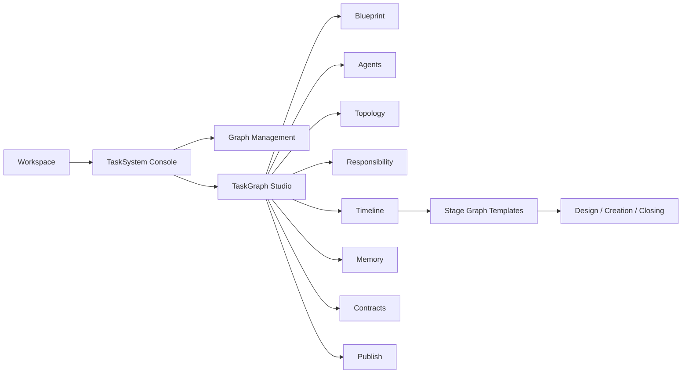
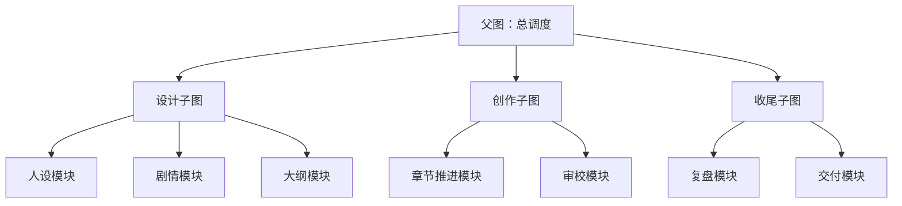
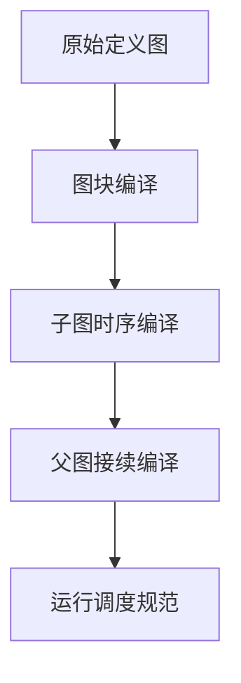

# 编辑器系统优化设计书

日期：2026-05-19  
状态：计划执行中，前端 Studio 第一轮拆层已落地
适用范围：任务系统编辑器、TaskGraph Studio、图模板、节点/边契约、中文名注册、时序分层、后续写作任务接入

## 0. 结论

这次优化的重点不是“再加几个编辑页”，而是把当前编辑器收敛成一个真正的**分层工作台**：

1. 上层负责看清结构。
2. 中层负责编辑图、节点、边和协议。
3. 下层负责预检、发布、运行与监测。
4. 中文名、图层、协议、时序和记忆都必须有统一来源。

写作任务只是这套编辑器的第一批高价值业务模板，不应反过来绑死编辑器本身。

---

## 1. 这次真正要解决的问题

当前编辑器已经有能力承载复杂任务图，但结构上还存在几类风险：

1. 页面层级容易混在一起，管理、编辑、运行、监测的边界不够硬。
2. 图的身份、拓扑、职责、时序、记忆、契约被放在同一工作面上，理解成本高。
3. 节点和边的协议虽然已经存在，但前端展示和编辑入口还不够统一。
4. 中文名主要靠前端局部文本，缺少稳定注册层。
5. 图模板、阶段图、拼接图、运行图之间的关系还需要更明确的结构约束。

正确方向不是补丁式加字段，而是先把编辑器定义成一个标准化工作台，再让写作任务作为第一条正式业务链路进入。

---

## 2. 技术来源与现状判断

现有代码已经提供了很强的基础，不需要推翻重做。

### 2.1 后端已具备的基础

- `backend/tasks/task_graph_models.py`
  - 已有 `TaskGraphDefinition`、`TaskGraphNodeDefinition`、`TaskGraphEdgeDefinition`
  - 已有 `phase_id`、`sequence_index`、`timeline_group_id`、`main_chain`、`blocks_phase_exit`
  - 已有 `context_visibility_policy`、`memory_read_policy`、`memory_writeback_policy`、`dynamic_memory_read_policy`
- `backend/tasks/task_graph_standard_models.py`
  - 已有标准视图层：`nodes`、`edges`、`resources`、`timeline`、`runtime_isolation`、`memory_matrix`
  - 已有 `layered_graph` 和 `temporal_edges` 的标准化出口
- `backend/orchestration/runtime_loop/node_execution_request.py`
  - 已有显式执行请求容器：`standard_input_package`、`memory_snapshot`、`artifact_context_packet`、`revision_packet`、`handoff_packet_refs`
- `backend/orchestration/runtime_loop/context_packet_resolver.py`
  - 已经把 memory / artifact / revision / handoff 拆成独立包，不是混包

### 2.2 前端已具备的基础

- `frontend/src/components/workspace/views/task-system/TaskGraphStudioShell.tsx`
  - 已经是典型的分层工作台外壳
- `frontend/src/components/workspace/views/task-system/TaskGraphLayerNav.tsx`
  - 已经是卡片式图层切换
- `frontend/src/components/workspace/views/task-system/TaskGraphWorkbench.tsx`
  - 已经按 blueprint / topology / responsibility / timeline / memory / contracts / publish 拆页
- `frontend/src/components/workspace/views/task-system/TaskSystemShell.tsx`
  - 已经把管理层和编辑层分开

### 2.3 现状判断

结论很明确：

**这不是缺框架，而是缺一套更硬的编辑器结构约束。**

所以优化策略应该是：

1. 保留现有核心对象模型。
2. 强化页面分层和对象分层。
3. 补齐中文名注册与协议声明。
4. 把图模板和时序拼接变成正式能力。

---

## 3. 推荐设计方向

推荐把编辑器定义为一个三平面工作台：

### 3.1 结构平面

负责图的身份、模板、拓扑和阶段拼接。

### 3.2 语义平面

负责节点职责、Agent、投影、输入输出契约、边交接协议。

### 3.3 运行平面

负责时序、记忆、预检、发布、运行绑定和监测。

这三个平面不能挤在一页里，必须通过独立页面或明确卡片切换来表达。



---

## 4. 页面与层级设计

### 4.1 顶层工作区

顶层只保留两件事：

- 管理区
- 编辑区

管理区看对象，编辑区改对象。不要把两者揉成一锅。

### 4.2 编辑区结构

编辑区建议固定为以下层级：

1. `蓝图层`
   - 图身份、图域、入口出口、运行模式、模板选择
2. `节点装配层`
   - 执行器、Agent、Projection、运行档案、节点权限
3. `拓扑层`
   - 节点、边、图拼接、图拆分
4. `职责层`
   - 节点角色、输入输出契约、节点禁区、节点标准投影
5. `时序层`
   - phase、sequence、main_chain、blocks_phase_exit、循环和阶段边界
6. `记忆层`
   - 基准库、动态库、线程账本、问题账本、产物索引、风险标记
7. `契约层`
   - 输入契约、输出契约、边协议、失败策略、审核门
8. `发布层`
   - 预检、保存、发布、运行绑定、监测

### 4.4 风险管理是通用逻辑

`thread_ledger` 和 `issue_ledger` 应该被视为编辑器的通用风险管理层，而不是写作任务专属物。

1. `thread_ledger` 负责追踪需要持续回收、持续推进、延期或失效的线。
2. `issue_ledger` 负责追踪需要修复、阻断、复核或回退的问题。
3. 这两者都服务于编辑器本身，任务域只是把它们映射成不同语义。

通用逻辑的意思是：

- 写作域里，它们表现为伏笔、悬念、关系线、设定冲突。
- 开发域里，它们表现为缺陷、依赖阻塞、返修项、风险点。
- 健康域里，它们表现为问题链路、验证阻断、修复任务、回归失败。

也就是说，编辑器需要的是统一的风险治理模型，不是每个任务域都再造一套账本。

### 4.3 卡片切换原则

不同层级的切换必须用明确的卡片按钮完成，且每张卡只代表一个层级。

禁止把以下内容混成同一页：

- 图列表和节点详情
- 拓扑和运行监控
- 职责编辑和记忆仓库
- 时序编排和契约库

---

## 5. 节点信息契约

节点不是一个孤立表单，它有明确的分层信息需求。

### 5.0 节点与边的基础语义

这个系统里可以先把对象理解成两类：

1. **节点是执行端**。
   - 节点对应一个时序点上的实际任务执行。
   - 节点负责消费输入包，执行任务，产出结果。
   - 节点关心的是“我在这个时序点要做什么”。

2. **边是对接端**。
   - 边负责把上游结果对接到下游节点。
   - 边承载交接、等待、确认、载荷、记忆流转和失败传播。
   - 边关心的是“上一个执行点怎么稳当地接到下一个执行点”。

3. **边也有时序语义**。
   - 它不是执行点时序，而是关系时序。
   - 它决定下游什么时候能看见上游结果、是否必须等待确认、是否允许跳过、是否允许并行、是否会把失败传下去。
   - 它还决定阶段边界是否可越过、回退是否允许、结果何时可用于下一轮。

这个定义很重要，因为它会直接影响前端编辑器的页面分工：

- 节点页重点看执行职责、输入输出、运行许可。
- 边页重点看对接协议、等待策略、确认策略、传播策略。
- 节点页和边页要分开编辑，互相可以看摘要，但不要互相代填核心协议。

### 5.1 边的时序语义

边的时序语义建议至少拆成五类：

1. **触发时序**
   - 上游结果什么时候允许触发下游。
   - 是立刻触发、等待所有上游、等待任一上游，还是等待人工释放。

2. **可见时序**
   - 上游结果什么时候对下游可见。
   - 是当前轮可见、下一时钟可见，还是必须提交后才可见。

3. **确认时序**
   - 下游是否必须显式确认。
   - 需要确认时，确认窗口和超时策略是什么。

4. **传播时序**
   - 失败、修订、摘要、引用分别在什么时候、以什么形式传播。
   - 这决定边是“立即传递”还是“先缓冲后提交”。

5. **阶段时序**
   - 这条边是否允许跨阶段。
   - 是否阻断阶段退出。
   - 是否参与阶段拼接、阶段回退、阶段结束。

### 5.2 边需要看到的信息

#### 全局信息

- graph_id
- graph_title
- 当前层级
- 当前阶段

#### 边信息

- edge_id
- source_node_id
- target_node_id
- edge_type
- payload_contract_id
- wait_policy
- join_policy
- ack_policy
- failure_propagation_policy
- result_delivery_policy

#### 时序信息

- 触发时序
- 可见时序
- 确认时序
- 传播时序
- 阶段时序

#### 对接信息

- standard_input_package 中需要的字段
- handoff_packet_refs
- artifact_context_packet 的引用范围
- revision_packet 的适用范围

### 5.3 节点需要看到的信息

#### 全局信息

- graph_id
- graph_title
- graph_domain
- 当前层级
- 当前阶段
- 当前运行态

#### 节点信息

- node_id
- 中文名
- role_type
- agent_id / agent_group_id
- projection_id
- input_contract_id
- output_contract_id
- execution_mode

#### 运行信息

- standard_input_package
- memory_snapshot
- artifact_context_packet
- revision_packet
- handoff_packet_refs

### 5.4 节点输出边界

每个节点必须显式声明：

1. 它读什么。
2. 它写什么。
3. 它不能改什么。
4. 它的输出能不能进入下游。

这部分不是文案装饰，而是编辑器的核心契约。

---

## 6. 中文名注册体系

中文名必须成为正式元数据，而不是前端临时 label。

### 6.1 注册对象

- `node_id`
- `projection_id`
- `agent_id`
- `role_type`
- `phase_id`
- `thread_id`
- `repository_id`

### 6.2 显示优先级

1. 显式注册的 `display_name_zh`
2. 投影中的中文标题
3. 节点标题
4. Agent 名称
5. 角色映射名
6. `node_id` 兜底

### 6.3 展示规则

- 图上主标题必须显示中文名。
- `node_id` 只能做次级信息或 tooltip。
- 没有注册中文名的对象，预检应提示，而不是默默放行。

### 6.4 建议落点

优先采用独立注册层，而不是散落在组件里：

- `storage/tasks/task_name_registry.json`
- 或 graph metadata 中的 `name_registry`

建议最终保持“注册层优先，组件只读”的结构。

---

## 7. 时序分层与图模板拼接

这是这次优化里最关键的一条。

### 7.1 设计原则

不同阶段分成不同图，不是为了切碎，而是为了让时序更稳。

推荐结构：

1. 设计阶段图
2. 正式创作阶段图
3. 收尾阶段图

顶层再把三张图拼成一张分层总图。

### 7.2 为什么要这样做

如果只保留一张大图：

- 层级会失真
- 时序会变乱
- 图会大到难以扫描

如果只保留三张独立图：

- 全局推进感会弱
- 阶段边界不够明确

所以正确做法是：

**子图独立，顶层拼接。**

### 7.3 时间字段的作用

现有字段已经足够支撑这一层：

- `phase_id`：阶段归属
- `sequence_index`：阶段内顺序
- `timeline_group_id`：时间分组
- `main_chain`：是否主链
- `blocks_phase_exit`：是否阻断阶段退出

优化重点不是再造一套时序模型，而是把这些字段的语义在编辑器里明确可见。

### 7.4 图模板复用

图模板应该复用结构，不复用阶段协议。

也就是说：

- 模板可以复用布局、节点类型、边类型、命名规则
- 但不同阶段的协议不能强行共用

这很适合后续写作任务：设计图、创作图、收尾图各自成型，又能拼接成一条主循环。

### 7.5 图块组合与断开

每一张阶段图都应该被视为一个可独立维护的图块，而不是必须平铺进总图的硬节点集合。

图块组合时至少要显式声明：

1. `block_id`
2. `block_type`
3. `entry_node_id`
4. `exit_node_id`
5. `handoff_contract_id`
6. `visibility_policy`
7. `version_ref`

图块断开时也要有明确规则：

1. 断开后图块仍可单独预检和单独保存。
2. 断开不等于删除，旧引用要保留版本锚点。
3. 如果图块出口已提交，下游重接必须重新生成接续包。
4. 顶层总图只管理拼接关系，不替代子图内部语义。

### 7.6 父图、子图与模块图

为了让图结构既漂亮又高效，建议把图分成三种职责：

1. **父图**
   - 负责全局阶段顺序、调度入口、总览展示和联动编排。
   - 不负责展开每个阶段内部的全部细节。

2. **子图**
   - 负责某一阶段内部的完整语义。
   - 例如设计图、创作图、收尾图，或者更细的模块图。

3. **模块图**
   - 负责可复用的局部能力块。
   - 例如人设模块、剧情模块、伏笔模块、修订模块。

这个拆分的关键点是：

- 父图管理“什么时候切换”。
- 子图管理“这一段内部怎么跑”。
- 模块图管理“这一类能力怎么复用”。

这就能形成真正的层次化拓扑，而不是一张大图里塞满所有节点。



### 7.7 多阶段联合运行

所谓“联动运行”，不是把三张图硬并成一张，而是运行时按阶段接力。

推荐运行方式是：

1. 父图先激活当前阶段。
2. 当前阶段内的子图独立执行。
3. 子图输出接续包。
4. 父图校验接续包后，把它交给下一阶段。
5. 下一阶段再按自己的子图内部规则继续。

这样做的好处是：

- 阶段之间不会互相污染。
- 每个阶段都能单独预检、单独保存、单独回放。
- 顶层仍然保留完整推进感。

运行时建议显式支持三种模式：

1. **独立模式**
   - 子图单独看、单独改、单独存。

2. **接力模式**
   - 当前子图完成后，把结果交给下一子图。

3. **组合模式**
   - 父图只负责组合多个子图的运行顺序和接续规则。

这三种模式是同一套图结构的不同运行视角，不是三套不同系统。

---

## 8. 协议与防污染

编辑器优化不能只做“能看见”，还要做“不会串”。

### 8.0 风险治理模型

编辑器里的风险管理建议统一分成三类：

1. **叙事风险**
   - 对应 `thread_ledger`
   - 关注伏笔、脉络、承诺、回收窗口、延期和失效

2. **执行风险**
   - 对应 `issue_ledger`
   - 关注阻塞、缺陷、返修、校验失败、资源不足

3. **边界风险**
   - 关注污染、越权、未来泄漏、错误提交、错误覆盖

这三类风险是编辑器的通用治理层，不是写作域的私货。

### 8.1 必须显式区分的包

- `continuity_packet`
- `revision_packet`
- `constraint_packet`
- `thread_packet`
- `artifact_context_packet`
- `memory_snapshot`

### 8.2 只允许向下游传播的内容

下游只认：

- `accepted`
- `committed`

候选稿、审稿意见、返修稿都只能在本轮内使用，不能直接冒充事实。

### 8.3 编辑器应该提示的污染风险

- 未来批次内容泄漏到当前上下文
- 候选稿混入正式记忆
- 审核意见被误当成事实
- 基准库被动态增量悄悄覆盖

### 8.4 运行层的边界

现有 `NodeExecutionRequest` 已经把关键包拆开，说明后端并不缺容器，缺的是前端和配置层对这些容器的严格使用。

### 8.5 基准库与动态记忆库

这里要把两个库分清楚。

1. **基准库**
   - 作用是保存已经确认的稳定事实。
   - 它是运行和回收的底座。
   - 一般默认只读，避免被当前轮的临时判断污染。
   - 不是绝对不能改，而是只能在明确的修订流程中改。

2. **动态记忆库**
   - 作用是承接当前轮正在形成的增量信息。
   - 它允许追加、修订、回收、失效和合并。
   - 它是推进过程中的工作记忆，不是最终定稿。

两者的关系是：

- 基准库提供稳定参照。
- 动态记忆库提供实时推进。
- 动态库里被确认的内容，才有资格回写基准库。

所以读取它们时也要声明作用：

- 读基准库，是为了获得稳定上下文。
- 读动态库，是为了接续当前进程。
- 不能把动态库内容默认当成最终事实。

### 8.6 续接机制

“接续之前的进程”不能只理解成断开重连，还包括节点之间的交接。

建议至少分成四种接续对象：

1. **章节接续**
   - 写手续上之前章节的结果、语气、承诺和未完成事项。

2. **设定接续**
   - 世界观、人设、大纲、伏笔的持续修订。

3. **阶段接续**
   - 设计阶段的输出如何进入创作阶段。
   - 创作阶段的输出如何进入收尾阶段。

4. **运行接续**
   - 上一轮的 accepted / committed 结果如何进入下一轮。

为防止上下文污染，接续时只能传：

- 已确认事实
- 已批准修订
- 必要摘要
- 可追溯引用

不能直接传：

- 候选稿
- 审核意见原文
- 临时推演
- 尚未确认的未来草案

### 8.7 伏笔与脉络的组织方式

伏笔不应只作为散点存在，建议进入统一的脉络结构。

推荐做法是把伏笔并入大纲的细分层：

1. 主线脉络
2. 支线脉络
3. 伏笔脉络
4. 回收脉络

这样大纲就不是“章节目录”，而是“推进骨架”。

大纲需要足够细，原因不是形式主义，而是它要同时承担：

- 当前章节的推进说明
- 后续章节的承接说明
- 伏笔的埋设位置
- 伏笔的回收条件

如果这些都被大纲吸收，很多单独的“设计库”就可以不再长期占位，只在设计完成后保留摘要和锚点。

---

## 9. 对写作任务的意义

编辑器系统先优化好，写作任务才不会再靠临时拼提示词。

未来写作任务在这套编辑器里应当体现为：

1. 一个可复用的阶段图模板体系。
2. 一套固定的节点协议。
3. 一套中文名注册和图层显示体系。
4. 一套能持续推进的时序拼接体系。

也就是说，编辑器先成为“通用架构”，写作只是第一批正式落地的业务图。

---

## 10. 实施顺序

### 阶段 0：冻结现状

- 冻结当前 TaskGraph Studio 的层级和对象边界
- 冻结中文名来源
- 冻结标准视图作为读模型

### 阶段 1：收紧页面结构

- 明确管理层与编辑层分离
- 明确编辑层内部的层级切换
- 禁止层级混页

### 阶段 2：补注册与命名

- 建立中文名注册层
- 统一图上显示名规则
- 统一 tooltip / 次级信息规则

### 阶段 3：收紧协议

- 强化节点、边、时序、记忆、发布的契约说明
- 明确输入包与输出包的边界

### 阶段 4：落图模板与拼接

- 支持阶段图模板
- 支持顶层拼接图
- 支持阶段图拆分

### 阶段 5：接入写作任务

- 把写作任务作为第一批正式模板接入
- 再按写作任务反推协议细节

### 阶段 6：清理旧残留

- 删除无用旧入口
- 删除重复语义
- 删除不再承担职责的兼容路径

---

## 11. 文件级执行清单

后续如果进入实施，优先看这些文件：

- `frontend/src/components/workspace/WorkspacePanel.tsx`
- `frontend/src/components/workspace/views/TaskSystemView.tsx`
- `frontend/src/components/workspace/views/task-system/TaskSystemShell.tsx`
- `frontend/src/components/workspace/views/task-system/TaskGraphStudioShell.tsx`
- `frontend/src/components/workspace/views/task-system/TaskGraphLayerNav.tsx`
- `frontend/src/components/workspace/views/task-system/TaskGraphWorkbench.tsx`
- `frontend/src/components/workspace/views/task-system/TaskGraphBlueprintPage.tsx`
- `frontend/src/components/workspace/views/task-system/TaskGraphNodeStandardPage.tsx`
- `frontend/src/components/workspace/views/task-system/TaskGraphEdgeStandardPage.tsx`
- `frontend/src/components/workspace/views/task-system/TaskGraphTopologyPage.tsx`
- `frontend/src/components/workspace/views/task-system/TaskGraphResponsibilityPage.tsx`
- `frontend/src/components/workspace/views/task-system/TaskGraphTimelinePage.tsx`
- `frontend/src/components/workspace/views/task-system/TaskGraphMemoryArtifactPage.tsx`
- `frontend/src/components/workspace/views/task-system/TaskGraphContractQualityPage.tsx`
- `frontend/src/components/workspace/views/task-system/TaskGraphPublishRunPage.tsx`
- `frontend/src/components/workspace/views/task-system/TaskSystemPages.tsx`
- `frontend/src/components/workspace/views/task-system/taskGraphStandardView.ts`
- `backend/tasks/task_graph_models.py`
- `backend/tasks/task_graph_standard_models.py`
- `backend/orchestration/runtime_loop/node_execution_request.py`
- `backend/orchestration/runtime_loop/context_packet_resolver.py`

---

## 12. 验证标准

### 结构验证

- 不同层级不混页
- 卡片切换清晰
- 选中状态明显

### 协议验证

- 节点输入输出能明确说明
- 边协议能明确说明
- 节点页和边页职责不混
- 记忆和修订不会串包

### 命名验证

- 图上中文名统一
- 不同页面同名一致
- 缺名能预检暴露

### 时序验证

- 阶段图可以独立看
- 顶层总图可以拼接看
- 拆开后仍保留边界信息
- 图块断开后仍可独立预检与保存

### 运行验证

- 编辑器读的是标准视图
- 发布前有预检
- 运行结果不会反向污染草稿

---

## 13. 最终判断

这套编辑器优化的核心，不是让页面更多，而是让结构更稳。

只要把下面三件事钉住，后续写作任务就会顺得多：

1. 层级分开。
2. 协议明确。
3. 中文名和时序有统一来源。

这份设计书后续可以直接作为编辑器改造和写作任务接入的共同底稿。

---

## 14. 代码应该怎么写

这部分不是补字段，而是补“运行边界”。当前系统已经有蓝图、拓扑、时序、记忆、风险、契约、发布这些页面，也已经有 `timeline_blocks`、`subgraph` 执行器、标准输入包和运行监测钩子。下一步应该把它们收束成统一的父子图运行协议。

### 14.1 先把对象分成四层

1. **定义层**
   - `TaskGraphDefinition`
   - 继续作为图的 canonical definition。
   - 负责图身份、节点、边、metadata、runtime policy。

2. **编译层**
   - `TaskGraphRuntimeSpec`
   - 把定义层编译成可运行规范。
   - 这里必须把 `timeline_blocks` 从“附属元数据”升级成一级运行对象。

3. **运行层**
   - `TaskGraphRuntimeNode`
   - `TaskGraphRuntimeEdge`
   - `TaskGraphRuntimeBlock`（建议新增）
   - `TaskGraphBlockRunState`（建议新增）
   - 这里负责父图、子图、模块图的实际执行和状态切换。

4. **交接层**
   - `NodeExecutionRequest`
   - `StandardNodeInputPackage`
   - `StandardNodeResultPackage`
   - `TaskGraphContinuationPacket`（建议新增）
   - `TaskGraphBlockHandoffPacket`（建议新增）
   - 这里负责把当前轮确认过的事实交给下一个节点或下一个子图。

### 14.2 运行模型要写成“父图调度，子图执行，模块图复用”

推荐的代码原则是：

1. 父图只管阶段顺序和 block 调度。
2. 子图只管自己的局部拓扑和节点顺序。
3. 模块图只管可复用的局部能力块。
4. 所有图都用同一套输入/输出/记忆/交接协议。

也就是说，父图不是另一套系统，子图也不是另一套系统，它们只是同一运行模型中的不同 scope。

### 14.3 现有代码该怎么接

当前最适合动的点是这些：

- `backend/tasks/coordination_graph_models.py`
  - 给 runtime spec 增加 block 级对象和 block 索引。

- `backend/tasks/coordination_graph_compiler.py`
  - 把 `timeline_blocks` 变成编译输出的一等内容。
  - 生成 block -> phase -> node 的映射。

- `backend/orchestration/runtime_loop/task_graph_scheduler.py`
  - 在 phase 之外增加 block 激活与 block 完成判断。
  - 不再只看节点 ready / blocked，而要看当前 block 的运行窗口。

- `backend/orchestration/runtime_loop/langgraph_coordination_runtime.py`
  - 负责父图与子图的联动。
  - 子图完成后产出 handoff packet，再交给下一阶段或下一子图。

- `backend/orchestration/runtime_loop/node_execution_request.py`
  - 增加 block / parent run / child run 的上下文字段。
  - 明确当前节点属于哪一个图块、哪一层时序、哪一轮接续。

- `backend/orchestration/runtime_loop/context_packet_resolver.py`
  - 只解析 accepted / committed 的 continuity packet。
  - 禁止把 candidate、review、future draft 直接变成输入事实。

- `backend/orchestration/runtime_loop/task_graph_monitoring.py`
  - 监测对象从“单运行”升级成“父子运行树”。

### 14.4 运行时必须遵守的契约

1. 任何子图都必须带版本锚点。
2. 任何 block 断开后都要能独立预检。
3. 任何下游节点只能读已确认包。
4. 任何回写都必须先过审再进入基准库。
5. 任何未来内容都不能提前进入当前轮上下文。

### 14.5 最值得优先实现的三条链路

1. **阶段图块链路**
   - 设计图 -> 创作图 -> 收尾图
   - 这是最容易落地的父子图拼接。

2. **章节续接链路**
   - 当前章节 accepted -> continuity packet -> 下一章起笔
   - 这是写作任务的核心价值链。

3. **世界/大纲修订链路**
   - review -> revision packet -> delta commit -> 下一批次接续
   - 这是防止设定漂移的关键链路。

---

## 15. 前端应该怎么设计

前端不要做成一张超大图塞满所有职责，而要做成一个分层工作台。这个项目现有的 `TaskGraphStudioShell`、`TaskGraphLayerNav`、`TaskGraphWorkbench` 已经是对的方向，下一步是把“图层切换”和“图块切换”再分开。

### 15.1 总体布局

建议保留四个稳定区域：

1. 顶部总栏
   - 图标题
   - 发布状态
   - 保存 / 预检 / 发布 / 运行动作

2. 左侧图层导航
   - blueprint
   - agents
   - topology
   - responsibility
   - timeline
   - memory
   - risk
   - contracts
   - publish

3. 中央主工作区
   - 根据图层显示对应页面
   - 每层只显示该层该管的对象

4. 右侧或底部运行监测区
   - 预检问题
   - 运行状态
   - 父子图联动结果
   - 交接提醒

### 15.2 图层和图块不要混在一页

必须再分一层：

1. **图层**
   - 结构上的工作区切换。
   - 比如 blueprint、timeline、risk、publish。

2. **图块**
   - 同一层里的子图切换。
   - 比如设计图、创作图、收尾图，或者更细的模块图。

这样用户先知道自己在编辑哪个层，再知道自己在看哪张子图。

### 15.3 页面设计建议

- `TaskGraphBlueprintPage`
  - 只做图级身份、边界、协作模式、中文名注册。

- `TaskGraphTopologyPage`
  - 只做节点、边、父图/子图切换和画布结构。

- `TaskGraphTimelinePage`
  - 只做 phase、block、stage 交接、版本锚点和断开策略。

- `TaskGraphRiskGovernancePage`
  - 只做 thread ledger / issue ledger / 边界污染。

- `TaskGraphPublishRunPage`
  - 只做预检、发布、运行创建、断点重连、父子运行监测。

### 15.4 拓扑页应该怎么长

拓扑页不要把所有信息摊成一个平面。更合理的是三段式：

1. 左边：节点/资源/模块快速入口。
2. 中间：当前图的拓扑画布。
3. 右边：选中节点或边的详细契约。

如果是父子图场景，中间画布还要加一个切换：

- 父图总览
- 当前子图
- 模块图

这样图会更大，但认知负担更小。

### 15.5 视觉原则

前端风格应该是“密度高、秩序强、动作明确”的工作台，而不是展示页。

1. 不要做英雄图或营销页。
2. 不要把不同层级塞进一页。
3. 不要让卡片套卡片。
4. 不要让中文名和 `node_id` 同权。
5. 不要让运行监控和编辑区混在一起。
6. 用明确的卡片按钮做层级切换。
7. 关键状态只用一套来源，避免各页显示不一致。

### 15.6 运行监测的前端重点

运行页要能看见：

- 当前父图在哪个 block
- 当前子图在哪个 node
- 当前接续包是从哪里来的
- 当前结果是 accepted 还是 committed
- 失败是局部失败还是会阻断下一阶段

这部分最适合和 `TaskGraphRunInteractionDock` 联动，作为运行侧的浮动监测窗，而不是嵌进编辑页里。

### 15.7 最后定一下界面性格

这个前端应该是：

- 结构化
- 克制
- 工具感强
- 可扫描
- 中文标题优先

它要让用户一眼看懂“现在在哪一层、在改哪张图、下一步会流向哪里”。

---

## 16. 分层时序编译规则

如果要让三张拓扑图拼接后“自然地”发挥时序作用，编译器就不能只做节点平铺，而要按层编译、按块编译、按接续编译。

### 16.1 编译目标

编译器要输出的不是一张更大的图，而是一份**分层时序运行规范**。

它至少要回答四个问题：

1. 这张图里有哪些子图块。
2. 每个图块内部怎么排时序。
3. 图块之间按什么顺序接力。
4. 哪些结果允许进入下一图块。

### 16.2 三层编译顺序



编译顺序建议固定为：

1. **图块层**
   - 先识别 `timeline_blocks`。
   - 确认每个 block 的 `phase_id`、`entry_node_id`、`exit_node_id`、`handoff_contract_id`、`version_ref`。

2. **子图层**
   - 再编译 block 内部的 `phase_id + sequence_index + timeline_group_id`。
   - 子图内部只负责本图的局部 clock，不替父图决定阶段切换。

3. **父图层**
   - 最后编译 block 与 block 之间的接力顺序。
   - 父图只认已确认结果，不认候选稿和草稿态。

### 16.3 编译产物

编译器至少要产出这些结果：

- `compiled_block_order`
- `compiled_phase_order`
- `compiled_node_windows`
- `compiled_handoff_contracts`
- `compiled_visibility_policy`
- `compiled_version_anchors`

这些产物应进入运行规范，而不是继续留在前端草稿里。

### 16.4 编译时必须遵守的规则

1. 不能把三张图扁平化为一张无层级大图。
2. 不能让子图直接跨过父图修改下一个图块。
3. 不能让未确认结果进入下一图块输入。
4. 不能在编译时丢失版本锚点。
5. 不能用一套时间字段同时承担本图时序和跨图接力。

### 16.5 自然时序成立的条件

所谓“自然”，不是自动猜，而是满足以下条件后编译器才能稳地组织起来：

- 图块边界清楚。
- 图块顺序清楚。
- 每个图块的入口与出口清楚。
- 每个图块的可见性和提交条件清楚。
- 每次接力都带版本锚点和接续包。

只要这五项成立，三个拓扑图拼接后就能形成稳定的分层时序，而不是一团平铺节点。

---

## 17. 状态机与归属矩阵

要让架构可持续，必须把“谁拥有什么状态”写死。

### 17.1 状态归属原则

1. **定义态**归图配置层所有。
2. **运行态**归调度器和运行器所有。
3. **接续态**归交接包和结果包所有。
4. **记忆态**归基准库和动态库所有。
5. **风险态**归线程账本和问题台账所有。

### 17.2 归属矩阵

| 对象 | 主要归属 | 可写层 | 只读层 | 说明 |
|---|---|---|---|---|
| `TaskGraphDefinition` | 编辑器定义层 | 蓝图 / 拓扑 / 时序 / 契约 | 运行层 | 图的原始定义 |
| `timeline_blocks` | 图块编译层 | 时序层 | 运行层 | 不能只当元数据 |
| `TaskGraphRuntimeSpec` | 编译层 | 编译器 | 运行调度 | 运行依据 |
| `TaskGraphRuntimeBlock` | 运行层 | 调度器 | 编辑器草稿 | 图块运行状态 |
| `NodeExecutionRequest` | 交接层 | 运行器 | 节点执行体 | 当前节点的受控输入 |
| `continuity_packet` | 接续层 | 交接器 | 下一节点 | 只传已确认事实 |
| `baseline_memory` | 基准库 | 提交链路 | 生产链路 | 稳定事实底座 |
| `dynamic_memory` | 动态库 | 当前轮执行 | 下一轮事实 | 可修订工作记忆 |
| `thread_ledger` | 风险治理 | 风险页 / 运行监测 | 正文节点 | 叙事脉络账本 |
| `issue_ledger` | 风险治理 | 风险页 / 运行监测 | 正文节点 | 问题闭环账本 |

### 17.3 状态转换建议

推荐固定这些状态门：

- `draft`
- `reviewed`
- `accepted`
- `committed`
- `active`
- `completed`
- `archived`

其中：

- `accepted` 表示本轮可继续。
- `committed` 表示可写入稳定库。
- `active` 表示运行窗口已打开。
- `completed` 表示该层职责完成。

### 17.4 这里最容易出错的地方

1. 把 candidate 当 committed。
2. 把 review 当事实。
3. 把运行态写回定义态。
4. 把父图状态误写进子图本地状态。
5. 把旧版本锚点丢掉。

这些都是必须在实现前明确禁止的。

---

## 18. 图编辑器是否独立前端

答案是：**要独立，但先逻辑独立，再工程独立**。

### 18.1 结论

图编辑器应该脱离普通任务页，形成一个独立的前端工作台入口。

但“独立”不等于立刻拆成另一个仓库。更合理的是：

1. 先在同一仓库内做**独立路由 / 独立壳子 / 独立状态域**。
2. 再按需要决定是否物理拆成单独前端应用。

### 18.2 为什么要独立

图编辑器和普通任务页面不是同一种产品形态。

它有这些明显差异：

- 多层级页面，不适合混在主工作台里。
- 强画布、强契约、强预检、强运行监测。
- 状态域大，交互密，性能压力高。
- 需要自己的图层导航、图块导航、运行监测和权限边界。

如果继续和普通页面混在一起，后面会不断出现：

- 页面职责发散
- 状态互相污染
- 路由语义混乱
- 运行监测被挤掉
- 画布和表单互相抢空间

### 18.3 推荐的工程形态

建议采用这种分层：

1. **共享底座**
   - 登录态
   - API 客户端
   - UI 基础组件
   - 设计系统

2. **图编辑器壳子**
   - 独立路由
   - 独立布局
   - 独立图层导航
   - 独立运行 dock

3. **图编辑器域状态**
   - draft
   - runtime spec
   - preflight
   - block state
   - continuation state

4. **共享后端**
   - 不需要为前端独立再造后端
   - 只要接口清晰即可

### 18.4 什么时候才需要真正拆成两个前端应用

只有满足这些条件时，才值得真正物理拆分：

- 图编辑器团队和主站团队长期分离。
- 图编辑器发布节奏与主站明显不同。
- 图编辑器需要单独性能预算或独立部署。
- 图编辑器的依赖和路由已经稳定到不会频繁改骨架。

在那之前，保持同仓库、同后端、独立壳子，是更稳的路线。

### 18.5 这对当前项目意味着什么

对于现在这个项目，最合理的推进顺序是：

1. 先把图编辑器从普通任务页的混合结构里剥出来。
2. 再把图层、图块、运行监测做成独立工作台。
3. 最后再考虑是否拆到独立 frontend app。

这会让架构先稳住，再谈分家，而不是一上来就把工程拆散。

---

## 19. 放在任务系统里，但要有更大空间

这并不矛盾。

### 19.1 结论

图编辑器可以继续作为**任务系统**里的一个顶层入口，但进入后必须切换到**独立工作台模式**，而不是嵌在普通任务页里。

也就是说：

- **导航上**，它属于任务系统。
- **空间上**，它拥有自己的完整工作台。
- **交互上**，它不和普通任务配置共享一块窄面板。

### 19.2 推荐结构

1. 顶层还是任务系统总导航。
2. 任务系统里单列“图编辑器 / TaskGraph Studio”入口。
3. 进入后显示独立工作台壳子：
   - 顶部工具栏
   - 左侧图层导航
   - 中央主画布
   - 右侧契约/运行/预检面板
4. 普通任务管理页保留轻量信息，不承担图编辑器的高密度编辑任务。

### 19.3 这样做为什么更合理

因为图编辑器有三种天然的大空间需求：

- 拓扑画布需要横向展开。
- 图层切换需要固定导航。
- 运行监测和契约检查需要并排显示。

如果把它塞回普通任务页，就会出现：

- 画布不够宽
- 侧栏互相抢空间
- 运行监测被挤掉
- 图块切换不清楚

### 19.4 所以真正的折中方案是

**不拆出任务系统，但拆出任务系统内部的独立工作台。**

这是最稳的路线：

1. 既保留“这是任务系统的一部分”的产品认知。
2. 又让图编辑器获得足够大的操作空间。
3. 后面如果真要物理拆前端，也只需要把这个工作台再迁出去。

---

## 20. 父子图、阶段图块与联合运行的前端实施计划

这一段是本轮开始执行的计划。目标不是把三张图强行合成一张巨型拓扑，而是在编辑器里正式承认三类对象：

1. **父图**
   - 负责阶段顺序、图块拼接、运行窗口和跨图交接。
   - 父图只消费子图已经确认的出口产物。
   - 父图不直接编辑子图内部节点职责。

2. **子图**
   - 负责本阶段内部执行拓扑。
   - 子图可以独立保存、预检、发布。
   - 子图内部时序只在自己的局部 clock 中成立。

3. **图块边界**
   - 负责父图与子图之间的入口、出口、交接契约、可见性和版本锚点。
   - 图块边界不是普通节点，也不是普通边，而是“图与图之间的时序对接端”。

### 20.1 页面分层

TaskGraph Studio 需要新增一个独立层级：

```text
图模块化 / Graph Modules
```

这个层级位于“拓扑编排”和“拓扑时序”之间：


这样分工更清楚：

- `拓扑编排`：编辑当前图内部节点和边。
- `图模块化`：编辑父子图、阶段图块、跨图交接、断开策略。
- `拓扑时序`：编辑节点执行许可、边时序语义、循环、审核回退。

### 20.2 图模块化页的首版分面

首版不做过大的后端改造，先用已有 `metadata.timeline_blocks` 作为稳定草稿容器，但前端语义要升级：

1. **父子图**
   - 显示当前父图 ID。
   - 显示每个子图引用 `linked_graph_id`。
   - 显示子图类型、所属阶段、版本锚点。

2. **阶段拼接**
   - 显示阶段顺序和图块顺序。
   - 每个图块必须声明入口、出口、交接契约。
   - 同一阶段允许多个图块，但必须能解释 join / wait 关系。

3. **联合运行**
   - 显示父图编译时需要的运行摘要。
   - 明确哪些结果可以进入下一图块。
   - 明确可见性：`committed_only`、`summary_and_refs`、`manual_release`、`isolated_until_commit`。

4. **断开与复用**
   - 显示断开策略：保留版本锚点、复制为独立图、要求重新交接包。
   - 保证子图被替换或断开后，父图仍能追踪旧版本。

### 20.3 数据契约

首版继续使用：

```text
metadata.timeline_blocks[]
```

每个 block 的最小契约为：

```json
{
  "block_id": "block.design",
  "block_type": "design_graph",
  "title": "设计阶段图",
  "phase_id": "phase.design",
  "linked_graph_id": "graph.design.initialization",
  "entry_node_id": "world.plan",
  "exit_node_id": "outline.commit",
  "handoff_contract_id": "contract.design.handoff",
  "visibility_policy": "committed_only",
  "version_ref": "v1",
  "detach_policy": "preserve_version_anchor"
}
```

这一契约允许后端继续从标准视图里输出 `timeline_blocks`，同时让前端先具备父子图编辑能力。

### 20.4 预检规则

图模块化层至少要预检：

1. 图块是否绑定阶段。
2. 图块是否声明入口和出口。
3. 图块是否声明交接契约。
4. 图块是否声明版本锚点。
5. 图块引用的子图 ID 是否为空。
6. 多图块时是否具备联合运行的可见性策略。

其中第 5 项首版可以是 warning，因为草稿阶段允许先设计父图，再补子图引用。

### 20.5 为什么不把它继续藏在时序页

时序页回答的是：

```text
节点什么时候能运行，边什么时候完成交接。
```

图模块化页回答的是：

```text
哪些图被拼在一起，父图如何接续子图，子图如何断开和复用。
```

这两个问题相关，但不是同一层。继续混在时序页里，会让“节点时序”和“图块时序”互相污染。

### 20.6 本轮实施范围

本轮只做前端结构和预检层：

1. Studio 增加 `图模块化` 卡片层级。
2. 新增 `TaskGraphModuleCompositionPage`。
3. 将阶段图块编辑能力迁入新页面。
4. 时序页保留节点执行许可、边时序、循环、审核回退。
5. 预检聚焦到图块拼接和联合运行契约。

后端编译层暂不大改，但后续应该把 `timeline_blocks` 从 metadata 草稿升级为运行规范的一等编译产物。
