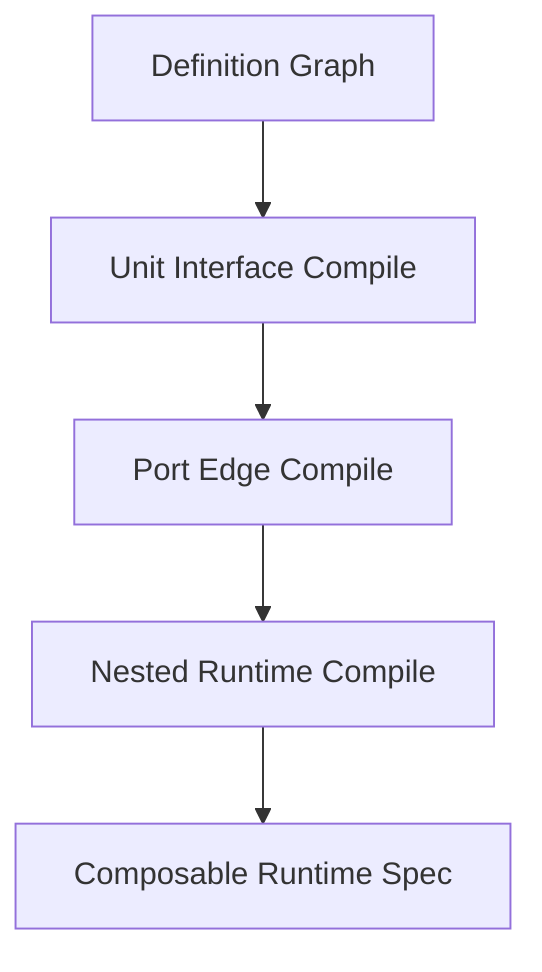

# 图即节点可组合任务图架构优化设计书

日期：2026-05-19
状态：阶段一已实施；阶段二入口已接入发布预检；运行器主路径未切换
适用范围：任务系统、TaskGraph Studio、图模块化、节点/边契约、运行编译器、嵌套运行、后续写作任务图模板

## 0. 结论

你的判断是正确的：后续架构不应该把“大图、小图、节点”硬分成三种不能互换的对象，而应该把它们统一成一种**可组合执行单元**。

也就是说：

```text
图是执行单元。
节点也是执行单元。
一个节点可以展开成一张图。
一张图也可以在上层图里表现为一个节点。
```

真正决定它们能否连接的，不是它们叫“图”还是“节点”，而是它们是否暴露了兼容的接口。

因此目标架构应从：

```text
Graph -> Nodes -> Edges
```

升级为：

```text
Graph -> Units -> Ports -> Edges
```

其中：

- `Unit` 可以是普通节点、子图、外部工具、人工门控、记忆仓库、运行监控器。
- `Port` 是单元的输入/输出接口。
- `Edge` 只连接端口，不直接偷看单元内部实现。
- `Graph` 既是容器，也是一个可被上层引用的 Unit。

这会让任务图系统拥有真正的模块化、递归组合和阶段拼接能力。

---

## 1. 当前系统依据

这份计划基于当前代码结构，不是假设一个干净的新系统。

### 1.0 原框架复核结论

本轮优化前已经重新核对原框架主链路，结论是：可组合图必须接入现有标准对象视图和发布预检链，不能另做一套旁路图编辑器。

当前原框架的真实链路是：

```text
TaskGraphDefinition
  -> compile_task_graph_definition_runtime_spec
  -> layered_graph_normalizer / runtime_spec.diagnostics.layered_graph
  -> TaskGraphStandardView
  -> TaskGraphWorkbench / TaskGraphLayerNav
  -> TaskGraphPublishRunPage
  -> taskGraphPreflight
  -> runtime spec / task run
```

因此本轮实现遵守三个接入原则：

1. `TaskGraphDefinition` 仍是真相源，阶段一不另建新的保存源。
2. `ComposableGraphView` 从 `TaskGraphStandardView` 使用的同一份后端链路派生，不在前端自行猜测图语义。
3. 发布预检必须消费 `standardView.issues` 中的可组合图诊断，使 Unit、Interface、PortEdge 的问题能阻断发布或定位修复。

这意味着当前实现不是旁路展示页：它已经进入标准视图、TaskGraph Studio 模块页和发布预检诊断链；但运行器真正按 GraphUnit 启动 nested task run 仍属于后续阶段。

### 1.1 已有后端基础

当前后端已经有三类核心对象：

- `backend/tasks/task_graph_models.py`
  - `TaskGraphDefinition`
  - `TaskGraphNodeDefinition`
  - `TaskGraphEdgeDefinition`
- `backend/tasks/task_graph_standard_models.py`
  - `TaskGraphStandardView`
  - `TaskGraphStandardNodeSpec`
  - `TaskGraphStandardEdgeSpec`
  - `TaskGraphStandardTimelineSpec`
- `backend/tasks/layered_graph_normalizer.py`
  - 已经支持 `timeline_blocks`
  - `timeline_blocks` 已经有 `linked_graph_id`

这说明系统已经具备“图块引用另一张图”的雏形，但现在它还只是时序图块，不是真正的一等可组合单元。

### 1.2 当前限制

现在的边仍然主要是：

```text
source_node_id -> target_node_id
```

这会带来几个限制：

1. 边只能自然连接节点，不能自然连接图的接口。
2. 子图只能通过 `metadata.timeline_blocks` 被阶段引用，不是运行层的一等节点。
3. 父图容易绕过接口去理解子图内部节点。
4. 节点升级为子图时，上游和下游边可能要重写。
5. 图拆分、图复用、图版本兼容很难标准化。

所以问题不只是“需要父子图”，而是缺少一个统一抽象：

```text
可组合单元接口
```

---

## 2. 目标原则

### 2.0 递归图与递归时序

核心抽象需要再收紧一层：

```text
基本节点是最小执行图。
节点组成图。
图又可以作为父图中的节点。
时序也按同一套层级递归。
```

也就是说，系统不应该只支持“图包含节点”，而应该支持：

```text
Unit = Graph | Node
Node = collapsed Graph | atomic task
Graph = Unit collection + local timeline
TimelinePoint = Unit activation
```

在这个模型里：

1. **基本节点**是执行端，负责完成一个最小任务。
2. **图**是节点和边组成的结构，也是一种可以被父图调度的执行端。
3. **图节点 GraphUnit**在父图里表现为一个节点，但点击它应进入子图自己的工作台，而不是把子图内部节点混排进父图。
4. **父图时序**只知道“这个 GraphUnit 在当前时序点被激活、等待、完成或失败”。
5. **子图时序**只在子图内部展开，负责子图内部节点的阶段、循环、并发和审核回退。
6. **跨层交接**只通过接口端口、版本锚点、handoff contract 和 committed output refs 完成。

因此多图组合时，编译器的心智应该是：

```text
父图：
  A 节点 -> B 图节点 -> C 节点

B 图节点内部：
  B1 节点 -> B2 审核 -> B3 提交
```

父图不会直接调度 `B1/B2/B3`，它只调度 `B`；`B` 的内部时序由 `B` 对应的子图运行管理。这样才能同时获得高模块化和上下文隔离。

### 2.1 图和节点统一为 Unit

推荐新增概念：

```text
ComposableUnit
```

它不是为了替换所有旧模型，而是作为编译层和编辑器层的新抽象。

```text
ComposableUnit =
  TaskGraphUnit
  | TaskNodeUnit
  | ToolUnit
  | HumanGateUnit
  | MemoryUnit
  | RuntimeMonitorUnit
```

其中：

- `TaskGraphUnit` 指一整张图。
- `TaskNodeUnit` 指一个普通执行节点。
- `MemoryUnit` 指记忆仓库、线程账本、问题台账。
- `ToolUnit` 指外部工具或能力调用。
- `HumanGateUnit` 指人工确认节点。

### 2.2 接口优先，而不是类型优先

一个单元能否被连接，取决于：

- 它有哪些输入端口。
- 它有哪些输出端口。
- 输入端口接受什么契约。
- 输出端口产出什么契约。
- 它的运行状态如何对外暴露。
- 它的记忆和产物是否允许跨边流动。

因此所有 Unit 都需要声明：

```text
UnitInterface
- input_ports
- output_ports
- accepted_payload_contracts
- emitted_payload_contracts
- memory_visibility_policy
- artifact_visibility_policy
- runtime_state_policy
- version
```

### 2.3 边连接端口，不连接内部实现

未来边的真实语义应从：

```text
source_node_id -> target_node_id
```

升级为：

```text
source_unit_id.output_port_id -> target_unit_id.input_port_id
```

旧字段可以保留迁移期兼容，但标准视图和编译器应优先使用端口模型。

### 2.4 图节点必须有内部隔离

当一张图在上层被当成节点运行时，父图只看到：

- 输入端口。
- 输出端口。
- 运行状态。
- 版本锚点。
- 交接契约。
- 提交后的产物引用。

父图不能直接读取子图内部临时上下文、候选记忆、草稿产物和内部节点状态。

---

## 3. 目标对象模型

### 3.1 ComposableUnit

建议首版数据结构：

```json
{
  "unit_id": "unit.creation_graph",
  "unit_type": "graph",
  "title": "正式创作图",
  "ref": {
    "graph_id": "graph.novel.creation",
    "version_ref": "v1"
  },
  "interface_id": "interface.creation_graph.v1",
  "runtime_policy": {
    "execution_mode": "nested_graph_run",
    "task_run_scope_policy": "isolated_per_nested_run"
  },
  "metadata": {}
}
```

普通节点也可以映射成 Unit：

```json
{
  "unit_id": "unit.writer",
  "unit_type": "node",
  "title": "写手",
  "ref": {
    "node_id": "writer"
  },
  "interface_id": "interface.writer.v1"
}
```

### 3.2 UnitInterface

```json
{
  "interface_id": "interface.creation_graph.v1",
  "display_name_zh": "正式创作图接口",
  "input_ports": [
    {
      "port_id": "input.design_commit",
      "title": "设计阶段提交包",
      "payload_contract_id": "contract.design.commit",
      "required": true
    }
  ],
  "output_ports": [
    {
      "port_id": "output.volume_commit",
      "title": "正文阶段提交包",
      "payload_contract_id": "contract.creation.commit",
      "status_required": "committed"
    }
  ]
}
```

### 3.3 UnitEdge

```json
{
  "edge_id": "edge.design_to_creation",
  "source_unit_id": "unit.design_graph",
  "source_port_id": "output.design_commit",
  "target_unit_id": "unit.creation_graph",
  "target_port_id": "input.design_commit",
  "payload_contract_id": "contract.design.commit",
  "temporal_semantics": {
    "trigger_timing": "after_source_success",
    "visibility_timing": "after_commit",
    "acknowledgement_timing": "explicit_ack",
    "propagation_timing": "buffer_until_commit",
    "phase_timing": "cross_phase_handoff"
  }
}
```

这会让边成为真正的接口连接，而不是节点 ID 连线。

---

## 4. 图与节点的互换规则

### 4.1 图作为节点

一张图可以在上层图里显示为一个“图节点”。

上层图看到的是：

- 图节点标题。
- 输入端口。
- 输出端口。
- 版本。
- 运行状态。
- 预检结果。

上层图不看到：

- 子图内部节点的临时上下文。
- 子图内部候选记忆。
- 子图内部草稿产物。
- 子图内部未提交问题。

### 4.2 节点展开为图

一个普通节点可以升级为子图。

例如：

```text
写手节点
```

可以展开为：

```text
章节写作子图
- 读取前文
- 读取大纲
- 起草章节
- 自检
- 修订
- 提交章节
```

只要新子图暴露的接口兼容旧节点接口，上层图不需要重连边。

### 4.3 接口兼容优先

允许内部结构变化：

```text
节点 -> 子图
子图 -> 更复杂子图
子图 -> 外部工具节点
```

但不允许静默改变接口。

如果接口变化，必须触发：

- 预检失败。
- 边连接失效提示。
- 版本兼容检查。
- 必要时要求重新交接包。

---

## 5. 编译规则

### 5.1 编译目标

编译器不应该输出一张被压平的大图，而应该输出：

```text
ComposableRuntimeSpec
```

它需要回答：

1. 当前图包含哪些 Unit。
2. 哪些 Unit 是普通节点。
3. 哪些 Unit 是嵌套图。
4. 边连接哪些端口。
5. 每个端口的契约是否兼容。
6. 图节点运行时如何创建 nested task run。
7. 子图结束后哪些输出允许回到父图。

### 5.2 三层编译



### 5.3 编译顺序

1. **Unit 编译**
   - 把节点、图块、资源仓库、人工门控都归一为 Unit。
   - 普通节点从 `TaskGraphNodeDefinition` 派生 Unit。
   - 图块从 `timeline_blocks.linked_graph_id` 派生 GraphUnit。

2. **Interface 编译**
   - 为每个 Unit 找到或生成 interface。
   - 普通节点可由 `input_contract_id`、`output_contract_id` 派生端口。
   - 图节点必须读取子图的 graph contract 或显式 interface。

3. **Edge 编译**
   - 旧边先映射到默认端口。
   - 新边直接连接 `source_unit_id.source_port_id` 和 `target_unit_id.target_port_id`。
   - 编译器检查契约兼容。

4. **Nested Runtime 编译**
   - 遇到 GraphUnit 时，不展开为父图节点。
   - 生成 nested runtime block。
   - 绑定父图输入包、子图 task_run_id、子图输出提交规则。

5. **Visibility 编译**
   - 只有 `committed` 或满足输出端口状态要求的结果，才能越过图边界。
   - candidate、draft、review note 不能默认外泄。

---

## 6. 运行规则

### 6.1 普通节点运行

普通节点运行仍然使用当前节点执行链路：

```text
NodeExecutionRequest
memory_snapshot
artifact_context_packet
revision_packet
handoff_packet_refs
```

但输入来源应由端口边决定，而不是由节点 ID 边隐式决定。

### 6.2 图节点运行

当父图运行到 GraphUnit：

```text
父图节点窗口打开
-> 创建 nested task run
-> 子图读取父图传入的接口输入包
-> 子图内部独立调度
-> 子图提交 output_port 结果
-> 父图接收 committed refs
```

父图等待的是子图的接口输出，不是子图内部某个节点完成。

### 6.3 中断与接续

接续分两层：

1. **父图接续**
   - 当前运行到哪个 Unit。
   - 哪些输入端口已满足。
   - 哪些图节点正在 nested run。

2. **子图接续**
   - 子图内部当前运行到哪个节点。
   - 子图内部的候选记忆和产物状态。
   - 子图内部的问题台账。

父图只能引用子图 run handle，不能吞并子图内部 ledger。

---

## 7. 前端编辑器优化

### 7.1 新层级建议

现有 `图模块化` 层可以继续保留，但语义应升级为：

```text
可组合单元
```

建议页面分面：

1. **单元视图**
   - 显示所有 Unit。
   - 标出普通节点、图节点、资源节点、人工门控。

2. **接口视图**
   - 显示每个 Unit 的输入端口和输出端口。
   - 标注契约、必填、状态要求、可见性。

3. **连接视图**
   - 显示端口到端口的边。
   - 不再只显示节点到节点。

4. **嵌套运行视图**
   - 显示哪些 Unit 会创建 nested task run。
   - 显示父图等待策略和子图输出提交策略。

5. **兼容性视图**
   - 检查接口版本。
   - 检查端口契约。
   - 检查旧边迁移状态。

### 7.2 画布表达

图上推荐支持三种显示：

1. **收起**
   - 子图作为一个图节点显示。

2. **半展开**
   - 显示子图接口端口，但不显示内部节点。

3. **展开**
   - 进入子图编辑，而不是在父图画布里直接混排。

这符合“不同层级不能混在一页”的项目原则。

### 7.3 中文名注册

中文名要扩展到：

- `unit`
- `port`
- `interface`
- `graph`
- `node`
- `edge`

图上优先显示中文名，但内部保存仍要用稳定 ID。

---

## 8. 后端数据迁移计划

### 8.1 第一阶段：影子模型

不破坏现有 `TaskGraphDefinition`。

新增派生模型：

```text
ComposableGraphView
```

它从现有图定义派生：

- nodes -> node units
- timeline_blocks.linked_graph_id -> graph units
- edges -> default port edges
- contracts -> inferred interfaces

这一阶段只读，不写回。

### 8.2 第二阶段：标准视图扩展

扩展 `TaskGraphStandardView`：

```text
standard_view.units
standard_view.interfaces
standard_view.port_edges
standard_view.nested_runtime
```

保留旧字段：

```text
nodes
edges
timeline.timeline_blocks
```

旧字段服务兼容，新字段服务新编辑器和运行编译。

### 8.3 第三阶段：编辑器写入

前端开始写入：

```text
metadata.composable_units
metadata.unit_interfaces
metadata.port_edges
```

旧 `nodes / edges / timeline_blocks` 仍然存在，但由 mapper 同步生成，避免前后端分叉。

### 8.4 第四阶段：运行切换

运行编译器改为优先读取：

```text
ComposableRuntimeSpec
```

如果新模型缺失，则回退到旧节点边模型。

### 8.5 第五阶段：旧模型收敛

当所有模板和运行路径都支持 Unit/Port 后：

- 旧 `timeline_blocks` 不再承担图模块主数据。
- 旧 `source_node_id / target_node_id` 成为默认端口边的兼容字段。
- 图模块化页改名为可组合单元页。

---

## 9. 文件级实施清单

### 9.1 后端

建议新增：

- `backend/tasks/composable_graph_models.py`
  - 定义 `ComposableUnit`
  - 定义 `UnitInterface`
  - 定义 `UnitPort`
  - 定义 `UnitPortEdge`

- `backend/tasks/composable_graph_builder.py`
  - 从 `TaskGraphDefinition` 派生 `ComposableGraphView`
  - 处理旧 node/edge/timeline_blocks 映射

- `backend/tasks/composable_runtime_compiler.py`
  - 输出 `ComposableRuntimeSpec`
  - 处理 GraphUnit 的 nested run 计划

建议扩展：

- `backend/tasks/task_graph_standard_models.py`
  - 增加 units/interfaces/port_edges/nested_runtime

- `backend/tasks/layered_graph_normalizer.py`
  - 不再只产出 timeline_blocks
  - 同时产出 graph units

- `backend/tasks/coordination_graph_compiler.py`
  - 增加新编译路径
  - 迁移期保留旧 runtime spec

### 9.2 前端

建议新增：

- `frontend/src/components/workspace/views/task-system/taskGraphComposableModel.ts`
  - 前端 Unit/Port 解析与派生工具

- `frontend/src/components/workspace/views/task-system/TaskGraphComposableUnitPage.tsx`
  - 替代或升级当前图模块化页

建议扩展：

- `TaskGraphModuleCompositionPage.tsx`
  - 从阶段图块页升级为 Unit/Interface/Port 组合页

- `TaskGraphTopologyPage.tsx`
  - 画布支持图节点收起显示

- `TaskGraphContractQualityPage.tsx`
  - 校验接口契约与端口契约

- `taskGraphPreflight.ts`
  - 增加接口兼容预检
  - 增加端口边预检
  - 增加 nested runtime 预检

### 9.3 API 类型

建议扩展：

- `frontend/src/lib/api.ts`
  - `ComposableUnitSpec`
  - `UnitInterfaceSpec`
  - `UnitPortSpec`
  - `UnitPortEdgeSpec`
  - `ComposableRuntimeSpec`

---

## 10. 预检规则

必须新增这些预检：

1. Unit 必须有稳定 `unit_id`。
2. GraphUnit 必须有 `linked_graph_id`。
3. GraphUnit 必须有 `version_ref`。
4. Unit 必须绑定 interface，或可从旧节点契约派生 interface。
5. input port 必须声明接受契约。
6. output port 必须声明产出契约。
7. UnitEdge 必须连接存在的端口。
8. source output contract 必须兼容 target input contract。
9. GraphUnit 的 nested run 必须声明隔离策略。
10. 子图 candidate 输出不能直接进入父图。
11. 父图不能直接连接子图内部节点。
12. 节点展开成图时，旧接口必须保持兼容或触发迁移提示。

---

## 11. 写作任务中的落地方式

这套架构会特别适合长篇小说任务。

上层大图可以是：

```text
长篇小说项目图
- 初始化设计图
- 正式创作图
- 收尾整理图
```

其中每个都是 GraphUnit。

正式创作图内部可以继续包含：

```text
章节循环图
- 读取大纲接口
- 读取前文章节接口
- 写作接口
- 自检接口
- 审核接口
- 提交接口
```

章节写作节点也可以再展开：

```text
章节写作子图
- 场景规划
- 段落草稿
- 伏笔检查
- 连贯性检查
- 修订提交
```

这样，小说创作流程就不是一张巨大图，而是由许多稳定接口连接的图单元组成。

---

## 12. 风险与禁止事项

### 12.1 最大风险

最大风险不是模型复杂，而是把层级混在一起。

如果父图页面直接显示并编辑子图内部节点，就会重新回到混乱状态。

### 12.2 禁止事项

1. 禁止把多张图编译成一张扁平大图后丢失层级。
2. 禁止父图直接连子图内部节点。
3. 禁止没有端口契约的跨图边。
4. 禁止 candidate 结果默认越过图边界。
5. 禁止节点展开成图后静默改变输入输出契约。
6. 禁止把开发说明写成 Agent prompt。
7. 禁止用图块字段继续承载所有模块化语义。

---

## 13. 验证矩阵

### 13.1 模型验证

- 普通节点可被派生为 Unit。
- `timeline_blocks.linked_graph_id` 可被派生为 GraphUnit。
- 旧边可被映射为默认端口边。
- 显式端口边可通过契约校验。

### 13.2 编辑器验证

- 图节点能收起显示。
- 图节点能显示输入/输出端口。
- 端口边能被创建、编辑、删除。
- 点击图节点应进入子图工作台，而不是在父图页面混排。

### 13.3 运行验证

- 父图运行到 GraphUnit 时创建 nested task run。
- 子图内部失败不会污染父图上下文。
- 子图 committed output 可以回到父图。
- 子图 candidate output 不能越界。
- 断开子图后，父图仍保留旧版本锚点。

### 13.4 迁移验证

- 旧 TaskGraph 仍能打开。
- 旧 nodes/edges 仍能发布。
- 新 Unit/Port 视图能从旧图派生。
- 保存后不会丢失旧字段。

---

## 14. 推荐实施顺序

### 阶段一：只读派生

目标：不改运行，只建立 `ComposableGraphView`。

完成标准：

- 后端能从任意 TaskGraph 派生 Unit/Interface/PortEdge。
- 前端能展示只读可组合单元视图。
- 不影响现有发布和运行。

实施记录：

- 新增 `backend/tasks/composable_graph_models.py`，定义 `ComposableUnit`、`UnitInterface`、`UnitPort`、`UnitPortEdge`、`NestedRuntimePlan`、`ComposableGraphView`。
- 新增 `backend/tasks/composable_graph_builder.py`，从现有 `TaskGraphDefinition` 派生只读可组合视图。
- `nodes` 会派生为普通节点、资源、人工门控、工具、运行监控等 Unit。
- `metadata.timeline_blocks[].linked_graph_id` 会派生为 GraphUnit 和 nested runtime plan。
- 旧 `source_node_id -> target_node_id` 边会派生为默认 `output.default -> input.default` 端口边。
- `TaskGraphStandardView` 已增加 `units / interfaces / port_edges / nested_runtime`，旧 `nodes / edges / timeline` 保持不变。
- 前端 `TaskGraphModuleCompositionPage` 已升级为只读“可组合任务图”视图，分面为：可组合单元、接口端口、端口连接、嵌套运行、图块来源。
- `TaskGraphPublishRunPage` 已把 `standardView` 传入发布预检，`taskGraphPreflight` 会合并后端 `backend.composable_graph` 诊断。
- 发布预检点击可组合图问题时，会定位到 `modules / connections`、`modules / interfaces`、`modules / nested_runtime` 或 `modules / units`，模块页会自动切换到对应分面。
- 当前仍不写回 `metadata.composable_units`，也不切换运行器主路径；这是影子模型阶段。

### 阶段二：编辑器显式编辑

目标：前端允许配置 Unit 接口和端口边。

完成标准：

- 图模块化页升级为可组合单元页。
- 支持图节点、普通节点、资源节点统一展示。
- 支持端口契约预检。

阶段二入口已完成：

- 可组合图诊断已经进入发布预检，不再只停留在展示页。
- 模块页分面已经接受发布诊断焦点，形成“诊断 -> 导航层 -> 分面 -> 目标对象”的闭环。
- 下一步才进入显式编辑写入口：`metadata.composable_units / unit_interfaces / port_edges` 是否作为正式保存结构，需要先锁定迁移和回滚规则。

阶段二写入口实施记录：

- 后端 `build_composable_graph_view` 已支持读取 `metadata.composable_graph` 覆盖层。
- 覆盖层会与派生 Unit/Interface/PortEdge/NestedRuntimePlan 合并，同 ID 覆盖，新 ID 追加。
- 后端 diagnostics 会标记 `metadata_overlay_shadow_model`，并输出 overlay 对象数量。
- 后端预检会报告覆盖层缺 ID、接口缺端口、端口边连接不存在单元/端口等问题。
- 前端 `TaskGraphModuleCompositionPage` 的“端口连接”分面已支持新增、编辑、删除显式端口边。
- 显式端口边写入 `metadata.composable_graph.port_edges`，不会改写旧 `edges`，也不会进入子图内部。
- 当前编辑入口只覆盖 PortEdge；Unit 和 Interface 的可视化编辑仍在后续小阶段推进。

阶段二正式写入口采用覆盖层，而不是另起第二真相源：

```json
{
  "metadata": {
    "composable_graph": {
      "version": "v1",
      "units": [],
      "interfaces": [],
      "port_edges": [],
      "nested_runtime": []
    }
  }
}
```

执行规则：

1. `TaskGraphDefinition.nodes / edges / metadata.timeline_blocks` 仍是真相源。
2. 后端先从真相源派生 Unit、Interface、PortEdge、NestedRuntimePlan。
3. `metadata.composable_graph` 只作为显式覆盖层：
   - 同 ID 的 `unit` 覆盖派生 unit。
   - 同 `interface_id` 的 `interface` 覆盖派生 interface。
   - 同 `edge_id` 的 `port_edge` 覆盖派生 port edge。
   - 新 ID 的对象追加为显式对象。
4. 覆盖层只能编辑父图可见接口和端口边，不允许写入子图内部节点。
5. 运行主路径切换前，覆盖层只进入标准视图和预检，不直接改变 runtime loop。

迁移与回滚规则：

1. 删除 `metadata.composable_graph` 后，系统回到纯派生视图。
2. 旧 `nodes/edges/timeline_blocks` 不因覆盖层写入而删除。
3. 显式端口边必须连接存在的 Unit 端口，否则发布预检报错。
4. 显式接口必须声明 `unit_id` 和至少一个可连接端口；否则只作为草稿保存，但不能通过预检。
5. 后续 cutover 到 runtime 编译器时，只允许消费标准视图的合并结果，不允许 runtime 自己重新解释前端草稿。

### 阶段三：运行编译影子输出

目标：运行编译器输出 `ComposableRuntimeSpec`，但暂不切主路径。

完成标准：

- 每次发布都能看到旧 runtime spec 和新 composable runtime spec。
- 差异可诊断。
- 图节点 nested run 计划可见。

### 阶段四：GraphUnit 嵌套运行

目标：让图节点真正启动子图运行。

完成标准：

- 父图运行时可以启动子图 task run。
- 父图等待子图 output port。
- 子图提交结果后父图继续。

### 阶段五：旧字段收敛

目标：旧 nodes/edges/timeline_blocks 成为兼容层。

完成标准：

- 新模板优先生成 Unit/Port/PortEdge。
- 旧图自动迁移。
- 预检能阻断不兼容接口。

---

## 15. 最终形态

最终系统应该让用户可以自然地做这件事：

```text
我在父图里放一个“正式创作图”节点。
它有输入接口：大纲提交包、人设提交包、世界观提交包。
它有输出接口：章节提交包、伏笔状态提交包、动态记忆提交包。
我用边把设计图的输出接口连到创作图的输入接口。
我不用关心创作图里面到底有几个节点。
如果创作图以后变复杂，只要接口兼容，父图不需要重画。
```

这就是“图是节点，节点也是图”的真正价值：

```text
结构自由，但连接标准。
内部复杂，但外部稳定。
图能拆开，也能拼回去。
运行可嵌套，但上下文不污染。
```
