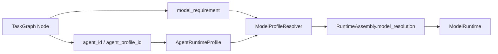

# Agent 模型运行档案与任务图模型需求分层重构计划

状态：已实施，已完成后端聚焦回归与前端类型验证。

实施记录：

- 后端已新增 Agent 模型运行档案、模型需求解析器、provider catalog、per-call ModelSpec 覆盖和子 Agent fallback 模型解析。
- 任务图节点只允许保存 `contract_bindings.runtime.model_requirement`，并对 raw API Key / secret fail-closed。
- 系统配置页已补充主流 provider 预设、`credential_ref` 与环境变量可视化；Agent 编排页新增“模型运行”层；任务图节点编辑台新增“模型需求”分区。
- 已验证：`python -m pytest backend\tests\orchestration_model_profile_regression.py backend\tests\model_runtime_regression.py backend\tests\model_response_runtime_regression.py backend\tests\task_graph_registry_test.py backend\tests\config_runtime_regression.py -q`，结果 `53 passed`。
- 已验证：`npx tsc --noEmit`，结果通过。

补充修订：

- `Base URL` 不归属于 `AgentRuntimeProfile.model_profile`。它是系统配置/provider catalog 的接入端点，只能由系统配置页维护。
- Agent 模型运行档案只保存 provider、model、credential_ref、输出上限、超时、推理行为、能力标签等执行偏好；旧 payload 中的 `model_profile.base_url` 会被解析层丢弃。
- `ResolvedModelSpec.base_url` 仍然存在，但只作为运行时解析结果，由系统当前 provider 或 provider 默认端点提供。

关联计划：

- `178-通用任务图单位批次契约与动态范围架构计划-20260520.md`
- `179-任务图编辑器契约化运行闭环优化计划-20260520.md`
- `180-Follow-up续接从StateMemory迁移到意图感知ContinuationLayer重构方案-20260520.md`

本计划解决一个新的结构性缺口：系统已经开始支持任务图、GraphUnit、契约绑定、发布执行包和对象追溯，但模型/API 调用配置仍停留在全局配置层。用户希望不同节点可以使用不同模型或 API 配置，但从架构语义看，节点不应该直接持有 API。真正需要被配置的是执行主体，也就是 Agent 的模型运行档案；任务图节点只声明执行主体、运行场景和模型需求。

---

## 0. 核心结论

不要把 LLM Provider、Base URL、API Key、max output tokens 直接塞进任务图节点。

任务图节点是流程对象，它声明“这里需要谁执行、以什么契约执行、需要怎样的模型能力”。模型调用配置属于 Agent 编排系统，因为只有 Agent 执行模型调用，只有 AgentRuntimeProfile 才能同时表达身份、权限、工具、记忆、上下文、委派和模型运行边界。

但 Provider endpoint 是系统级接入配置。Agent 可以选择或覆盖 provider/model 与运行参数，不能直接写 `base_url`，否则会把供应商基础设施入口散落到编排档案里，造成 provider、credential、endpoint 三者来源不一致。

目标结构应分四层：

```text
System Config
  系统默认模型、全局凭据底座、provider 默认值、fallback 底座

AgentRuntimeProfile
  Agent 作为执行主体时的模型运行档案、权限、记忆、上下文、协作边界

TaskGraph Node / GraphUnit
  执行主体引用、运行场景、contract_bindings.runtime.model_requirement

ModelRuntime Invocation
  每次调用根据 AgentRuntimeProfile + 节点需求解析出最终 ModelSpec
```

这条线可以让用户自然配置：

- 主 Agent 用一个模型；
- 子 Agent 用另一个模型；
- 写作节点要求长输出；
- 审核节点要求 thinking/reasoning；
- 检索 Agent 使用低成本模型；
- 任务图只表达需求，不保存密钥；
- 发布执行包能显示每个节点最终解析到哪个模型运行档案，但不泄露 API Key。

---

## 1. 当前代码事实

### 1.1 模型运行目前是全局配置

当前 `backend/execution/model_runtime.py` 的 `ModelRuntime` 从 `AppSettingsService.static` 读取全局模型配置：

- `_candidate_specs()` 读取 `settings.llm_provider`、`settings.llm_model`、`settings.llm_api_key`、`settings.llm_base_url`。
- `max_output_tokens` 读取 `settings.llm_max_output_tokens`。
- `model_call_timeout_seconds` 根据全局 `max_output_tokens` 选择普通 timeout 或长输出 timeout。
- `_build_chat_model_for_spec()` 给 DeepSeek/OpenAI 构造模型时使用全局 timeout、thinking mode、reasoning effort、max tokens。
- `invoke_messages()`、`invoke_messages_with_tools()`、`astream_messages()` 没有接收 per-agent 或 per-call profile override。

这说明现有系统只能做到“全系统一起换模型配置”，不能做到“不同 Agent / 不同节点按运行档案调用不同模型”。

### 1.2 系统配置页已经有全局模型与运行限制

当前 `backend/bootstrap/settings.py` 和前端 `SystemConfigView.tsx` 已经支持系统级配置：

- 模型 Provider：provider、model、base_url、api_key、fallback provider/model/base_url/api_key。
- 运行限制：llm_timeout_seconds、llm_long_output_timeout_seconds、llm_max_retries、llm_max_output_tokens、llm_thinking_mode、llm_reasoning_effort。

这部分应该保留，但定位要调整为“默认底座与凭据池”，不能再被理解成所有 Agent 的唯一模型配置来源。

### 1.3 AgentRuntimeProfile 缺少模型运行档案

当前 `backend/orchestration/agent_runtime_models.py` 中 `AgentRuntimeProfile` 具备：

- `allowed_runtime_lanes`
- `allowed_operations`
- `blocked_operations`
- `allowed_memory_scopes`
- `allowed_context_sections`
- `use_shared_contract`
- `can_delegate_to_agents`
- `allowed_delegate_agent_ids`
- `approval_policy`
- `trace_policy`
- `lifecycle_policy`
- `metadata`

但缺少一等字段 `model_profile`。这导致 Agent 的执行身份能管工具、记忆、上下文和协作，却不能管实际模型调用。

### 1.4 Agent 编排前端还是旧层级

当前 `frontend/src/components/workspace/views/OrchestrationView.tsx` 的层级是：

```text
identity
groups
runtime_permissions
context_memory
collaboration
overview
diagnostics
```

`runtime_permissions` 主要配置运行场景、允许操作、阻断操作、审批、追踪、生命周期。它不是模型运行配置层。

`OrchestrationAgentConfigWorkbenches.tsx` 目前没有独立的“模型运行”工作台，也没有用于编辑 provider/model/max output/timeout/thinking/fallback 的 Agent 级页面。

### 1.5 子 Agent 调用链没有使用目标 Agent 的模型配置

当前 `backend/orchestration/runtime_loop/agent_delegation_executor.py` 会构造 child runtime context，并把 `runtime_profile` 放进去。但 fallback 模型调用仍走：

```text
model_response_executor.model_runtime.invoke_messages(messages)
```

这意味着即使子 Agent 有运行档案，模型调用仍使用共享的全局 ModelRuntime 配置。后续必须让子 Agent fallback 调用显式传入解析后的 Agent model profile。

### 1.6 任务图节点已经有 Agent 引用和 contract_bindings

当前 `backend/tasks/task_graph_models.py` 中节点已经有：

- `agent_id`
- `agent_selection_policy`
- `agent_group_id`
- `runtime_lane`
- `contract_bindings`

前端保存映射 `taskGraphSaveMapper.ts` 已经把节点运行配置写入 `contract_bindings.runtime`，例如 `runtime_lane`、`execution_mode`、`wait_policy` 等。

这说明任务图节点不需要新增一套私有模型配置字段；更合理的是在 `contract_bindings.runtime` 中表达 `model_requirement`，由运行编译器解析到 AgentRuntimeProfile 的 `model_profile`。

---

## 2. 问题重新定义

表面问题：用户想给每个节点配置不同 LLM/API。

真实问题：当前系统缺少“模型调用身份”的分层事实源，导致模型配置只能全局化，任务图节点和 Agent 执行身份之间没有模型需求解析协议。

当前破损点包括：

1. 权限和模型调用分离  
   AgentRuntimeProfile 管权限，但不管模型配置，导致“谁可以执行”和“用什么模型执行”不是同一份运行档案。

2. 任务图容易被迫保存执行密钥  
   如果直接给节点加 API Key，会破坏任务图的通用性、可移植性和安全边界。

3. 子 Agent 调用无法真正个性化  
   子 Agent 虽然有 runtime_profile context，但实际 invoke 仍走全局配置。

4. 前端配置层级不自然  
   系统配置页管全局模型，编排页管权限，但没有“模型运行档案”层。用户会不知道到底该在系统配置、Agent、节点哪个地方配置模型。

5. 发布执行包缺少模型解析可见性  
   即便运行时后续支持 per-agent model，如果发布页不显示每个节点的最终模型解析来源，用户仍会觉得“配置了但不知道跑没跑准”。

正确终态：

- 系统默认模型可配置，作为 fallback。
- 每个 AgentRuntimeProfile 可配置 `model_profile`。
- 任务图节点可声明 `model_requirement`，但不能保存密钥。
- RuntimeSpec / RuntimeAssembly 能显示节点解析到的 Agent model profile。
- ModelRuntime 每次调用可接收 resolved model spec。
- 子 Agent 调用使用目标 Agent 的 model profile。
- 前端编排页新增“模型运行”层，和运行权限、上下文记忆、协作并列。

---

## 3. 分层设计原则

### 3.1 所有权原则

| 配置对象 | 权威归属 | 可以配置什么 | 不可以配置什么 |
| --- | --- | --- | --- |
| System Config | 系统运行底座 | 默认 provider/model/base_url、全局凭据、fallback、默认 token/timeout | 某个任务节点的业务需求 |
| AgentRuntimeProfile | Agent 编排系统 | Agent 的模型运行档案、权限、工具、记忆、上下文、委派 | 任务图拓扑和节点交接 |
| TaskGraph Graph | 任务图系统 | 图级默认模型需求、运行策略、契约绑定 | API Key、provider 密钥 |
| TaskGraph Node | 任务图系统 | agent_id、agent_profile_id 引用、runtime_lane、model_requirement | raw API Key、secret、base_url 直连凭据 |
| ModelRuntime | 执行层 | 解析后的 provider/model/base_url/key/max tokens/timeout/thinking | 自行从任务名推断写作专用逻辑 |

### 3.2 节点只声明需求

节点不是 API 客户端。节点可以声明：

```json
{
  "contract_bindings": {
    "runtime": {
      "model_requirement": {
        "profile_ref": "long_output_writer",
        "capability_tags": ["long_output", "creative_generation"],
        "min_output_tokens": 32768,
        "preferred_output_tokens": 65536,
        "thinking_mode": "disabled",
        "reasoning_required": false,
        "streaming_required": false,
        "fallback_allowed": true
      }
    }
  }
}
```

节点不可以保存：

```json
{
  "api_key": "xxx",
  "base_url": "https://...",
  "provider_secret": "xxx"
}
```

### 3.3 AgentRuntimeProfile 才保存模型运行档案

目标 `AgentRuntimeProfile.model_profile`：

```json
{
  "model_profile": {
    "profile_id": "long_output_writer",
    "display_name": "长输出写作模型",
    "provider": "deepseek",
    "model": "deepseek-v4-pro",
    "credential_ref": "provider:deepseek:primary",
    "max_output_tokens": 65536,
    "timeout_seconds": 60,
    "long_output_timeout_seconds": 360,
    "temperature": 0.7,
    "thinking_mode": "disabled",
    "reasoning_effort": "high",
    "stream_policy": {
      "enabled": false,
      "fallback_to_non_stream": true
    },
    "fallback_profile_ref": "system_default",
    "capability_tags": ["long_output", "creative_generation"],
    "metadata": {}
  }
}
```

密钥处理必须用 `credential_ref`。第一阶段可以让 `credential_ref` 解析到系统配置中已有 provider key；后续再扩展为真正的 credential registry。

### 3.4 运行解析必须可追溯

每次模型调用都应该能生成非敏感解析摘要：

```json
{
  "authority": "orchestration.model_profile_resolver",
  "agent_id": "agent:writer",
  "agent_profile_id": "writer_runtime",
  "node_id": "draft_chapter",
  "runtime_lane": "long_generation",
  "resolved_model_profile": {
    "profile_id": "long_output_writer",
    "provider": "deepseek",
    "model": "deepseek-v4-pro",
    "base_url_configured": true,
    "credential_configured": true,
    "max_output_tokens": 65536,
    "timeout_seconds": 360,
    "thinking_mode": "disabled",
    "reasoning_effort": "high",
    "fallback_profile_ref": "system_default"
  },
  "source_chain": [
    "node.contract_bindings.runtime.model_requirement.profile_ref",
    "agent_runtime_profile.model_profile",
    "system_config.provider_credentials"
  ],
  "warnings": []
}
```

发布页、RuntimeSpec diagnostics、RuntimeAssembly 都只显示这类摘要，不显示 secret。

---

## 4. 目标数据契约

### 4.1 AgentModelProfile

新增模型：

```python
@dataclass(frozen=True, slots=True)
class AgentModelProfile:
    profile_id: str = ""
    display_name: str = ""
    provider: str = ""
    model: str = ""
    credential_ref: str = ""
    max_output_tokens: int | None = None
    timeout_seconds: float | None = None
    long_output_timeout_seconds: float | None = None
    temperature: float | None = None
    thinking_mode: str = ""
    reasoning_effort: str = ""
    stream_policy: dict[str, Any] = field(default_factory=dict)
    fallback_profile_ref: str = ""
    capability_tags: tuple[str, ...] = ()
    metadata: dict[str, Any] = field(default_factory=dict)
```

嵌入 `AgentRuntimeProfile`：

```python
@dataclass(frozen=True, slots=True)
class AgentRuntimeProfile:
    ...
    model_profile: AgentModelProfile = field(default_factory=AgentModelProfile)
```

保存格式：

```json
{
  "agent_profile_id": "writer_runtime",
  "agent_id": "agent:writer",
  "allowed_runtime_lanes": ["long_generation"],
  "allowed_operations": ["op.model_response"],
  "model_profile": {
    "profile_id": "long_output_writer",
    "provider": "deepseek",
    "model": "deepseek-v4-pro",
    "credential_ref": "provider:deepseek:primary",
    "max_output_tokens": 65536
  }
}
```

### 4.2 ModelRequirement

任务图节点/图级运行需求：

```json
{
  "model_requirement": {
    "profile_ref": "",
    "provider_family": "",
    "model_family": "",
    "capability_tags": [],
    "min_context_tokens": null,
    "min_output_tokens": null,
    "preferred_output_tokens": null,
    "thinking_mode": "",
    "reasoning_required": null,
    "streaming_required": null,
    "temperature_profile": "",
    "fallback_allowed": true
  }
}
```

字段含义：

| 字段 | 含义 |
| --- | --- |
| `profile_ref` | 优先匹配 AgentRuntimeProfile.model_profile.profile_id 或预设模型档案 |
| `provider_family` | 例如 openai-compatible、deepseek、local 等，不是密钥 |
| `model_family` | 例如 long-output、reasoning、cheap-fast |
| `capability_tags` | long_output、tool_calling、reasoning、creative_generation 等 |
| `min_output_tokens` | 最低输出上限要求 |
| `preferred_output_tokens` | 希望使用的输出上限 |
| `thinking_mode` | disabled/enabled/any |
| `reasoning_required` | 是否必须使用推理模型 |
| `streaming_required` | 是否要求流式 |
| `fallback_allowed` | 当前节点是否允许降级到 fallback |

### 4.3 ResolvedModelSpec

ModelRuntime 最终消费：

```python
@dataclass(frozen=True, slots=True)
class ResolvedModelSpec:
    provider: str
    model: str
    api_key: str | None
    base_url: str
    max_output_tokens: int
    timeout_seconds: float
    long_output_timeout_seconds: float
    temperature: float
    thinking_mode: str
    reasoning_effort: str
    max_retries: int
    stream_policy: dict[str, Any]
    source_chain: tuple[str, ...]
    diagnostics: dict[str, Any]
```

`ResolvedModelSpec` 可以包含 api_key，但它是运行时内部对象，不能直接进入 API 响应、trace payload 或前端展示。

### 4.4 CredentialRef

第一阶段不做复杂密钥库，只定义可扩展协议：

```text
provider:deepseek:primary
provider:deepseek:fallback
provider:openai:primary
system:llm:primary
system:llm:fallback
env:DEEPSEEK_API_KEY
```

解析顺序：

1. `provider:{provider}:primary` -> 当前系统配置该 provider 的主 key 或 provider env。
2. `provider:{provider}:fallback` -> 当前系统配置该 provider 的 fallback key。
3. `system:llm:primary` -> 系统主模型 key。
4. `system:llm:fallback` -> 系统 fallback key。
5. `env:*` -> 仅允许白名单环境变量，且只在后端解析。

前端只显示 `credential_ref` 和 `credential_configured`，不显示原始 key。

---

## 5. 模型解析流程

### 5.1 解析入口

新增 `ModelProfileResolver`，建议放在：

```text
backend/orchestration/model_profile_models.py
backend/orchestration/model_profile_resolver.py
```

输入：

```python
resolve_model_spec(
    agent_id: str,
    agent_runtime_profile: AgentRuntimeProfile | None,
    model_requirement: dict[str, Any] | None,
    runtime_lane: str = "",
    graph_runtime_defaults: dict[str, Any] | None = None,
) -> ResolvedModelSpec
```

输出：

- 运行内部：`ResolvedModelSpec`
- 前端/trace：`ResolvedModelSpecView`，不含 api_key

### 5.2 解析优先级

解析顺序必须固定：

1. 节点显式绑定的 `agent_profile_id` 或 `agent_id` 对应的 AgentRuntimeProfile。
2. 节点 `contract_bindings.runtime.model_requirement.profile_ref` 指定的模型档案。
3. AgentRuntimeProfile.model_profile。
4. Agent group 默认 model profile。
5. 图级 `contract_bindings.runtime.model_requirement`。
6. 系统主模型默认。
7. 系统 fallback 模型。

如果某一层只提供部分字段，例如只提供 `max_output_tokens`，则从上层继承 provider/model/key/base_url。继承链必须进入 diagnostics。

### 5.3 冲突处理

冲突不应静默吞掉。

| 冲突 | 处理 |
| --- | --- |
| 节点要求 `thinking_mode=disabled`，Agent profile 强制 enabled | diagnostics 警告；如果节点声明 `reasoning_required=false` 且不允许 override，则阻断 |
| 节点要求 `min_output_tokens=65536`，Agent profile 最大 32768 | 编译预检 warning；运行前 fail closed 或请求用户确认 |
| 节点要求 provider_family=deepseek，但 Agent profile provider=openai | warning 或 blocked，取决于 `strict_model_requirement` |
| profile_ref 不存在 | fallback 到 Agent profile，并记录 `model_profile_ref_missing` |
| credential_ref 解析不到 key | 运行阻断，不能回退到无 key 调用 |
| fallback_allowed=false 但主 profile 不可用 | 运行阻断 |

### 5.4 RuntimeSpec 中的模型解析摘要

`TaskGraphRuntimeNodeSpec` 或 diagnostics 中应增加：

```json
{
  "model_resolution": {
    "agent_profile_id": "writer_runtime",
    "model_profile_id": "long_output_writer",
    "provider": "deepseek",
    "model": "deepseek-v4-pro",
    "credential_configured": true,
    "max_output_tokens": 65536,
    "thinking_mode": "disabled",
    "source_chain": [
      "node.contract_bindings.runtime.model_requirement",
      "agent_runtime_profile.model_profile"
    ],
    "warnings": []
  }
}
```

这不是给节点保存模型配置，而是发布执行包显示“节点最终会用哪个运行档案”。

---

## 6. 后端实施计划

### 阶段 A：模型档案数据模型落地

目标：让 AgentRuntimeProfile 可以保存和读取 `model_profile`。

改动文件：

- `backend/orchestration/agent_runtime_models.py`
- `backend/orchestration/agent_runtime_registry.py`
- `backend/api/orchestration.py`
- `frontend/src/lib/api.ts`
- `storage/orchestration/agent_runtime_profiles.json`

实施内容：

1. 新增 `AgentModelProfile` dataclass。
2. `AgentRuntimeProfile` 增加 `model_profile`。
3. `_profile_from_dict()` 读取并规范化 `model_profile`。
4. `to_dict()` 输出 `model_profile`。
5. `upsert_profile()` 支持 `model_profile` 参数。
6. `AgentRuntimeProfileRequest` 增加 `model_profile: dict[str, Any]`。
7. API catalog 返回 `model_profile`，但不能带 raw api_key。
8. 默认 builtin profiles 的 `model_profile` 留空，表示继承系统默认。

完成标准：

- 老 profiles 没有 `model_profile` 时仍能加载。
- 保存后 JSON 中有 `model_profile`。
- API upsert 不丢失 model_profile。
- 不在 storage 中写 raw API Key。

### 阶段 B：ModelProfileResolver 与凭据引用解析

目标：把 Agent model profile + 系统默认配置解析成可调用 ModelSpec。

新增文件：

- `backend/orchestration/model_profile_models.py`
- `backend/orchestration/model_profile_resolver.py`

改动文件：

- `backend/bootstrap/settings.py`
- `backend/execution/model_runtime.py`
- `backend/tests/model_runtime_regression.py`
- `backend/tests/orchestration_agent_runtime_profile_regression.py`

实施内容：

1. 定义 `AgentModelProfile`、`ModelRequirement`、`ResolvedModelSpec`、`ResolvedModelSpecView`。
2. 实现 `credential_ref` 解析，第一阶段复用已有系统 provider key / fallback key。
3. 实现模型字段继承：profile 字段为空则从系统默认补齐。
4. 实现 requirement 校验和 diagnostics。
5. 不把 secret 放入 diagnostics。

完成标准：

- 有 profile 时按 profile provider/model/max tokens 调用。
- profile 只配置 max tokens 时能继承系统 provider/model/key。
- credential 缺失时 fail closed。
- diagnostics 能说明来源链。

### 阶段 C：ModelRuntime 支持 per-call override

目标：让每次模型调用可传入 resolved model spec，而不是永远使用全局设置。

改动文件：

- `backend/execution/model_runtime.py`
- `backend/execution/model_response.py`
- `backend/tests/model_runtime_regression.py`
- `backend/tests/model_response_runtime_regression.py`

实施内容：

1. `invoke_messages(messages, model_spec: ResolvedModelSpec | None = None)`。
2. `invoke_messages_with_tools(messages, tools, model_spec: ResolvedModelSpec | None = None)`。
3. `astream_messages(messages, model_spec: ResolvedModelSpec | None = None)`。
4. `_candidate_specs()` 支持从 resolved model spec 生成主 candidate，并按 `fallback_profile_ref` 或系统 fallback 生成备用 candidate。
5. `_build_chat_model_for_spec()` 改为使用 spec 上的 max tokens、timeout、thinking、reasoning、temperature。
6. 保留无参数调用，作为系统默认路径。

完成标准：

- 现有主链不传 override 时行为不变。
- 传入 override 时 provider/model/max tokens/timeout 生效。
- DeepSeek thinking mode 仍严格按 spec 发送。
- streaming fallback 不丢失 model spec。

### 阶段 D：子 Agent 调用接入模型档案

目标：子 Agent 真正使用目标 Agent 的模型运行档案。

改动文件：

- `backend/orchestration/runtime_loop/agent_delegation_executor.py`
- `backend/orchestration/runtime_loop/child_agent_runtime_executor.py`
- `backend/tests/agent_delegation_permission_regression.py`
- 新增 `backend/tests/agent_delegation_model_profile_regression.py`

实施内容：

1. `build_child_runtime_context()` 增加 `model_resolution` 摘要。
2. `execute_child_agent()` 在 fallback LLM 调用前调用 `ModelProfileResolver`。
3. 将 resolved spec 传给 `model_runtime.invoke_messages(messages, model_spec=...)`。
4. event log 记录非敏感 `model_resolution`。
5. 当目标 Agent 无 model_profile 时继承系统默认。

完成标准：

- 子 Agent 配置不同 model_profile 时，实际 invoke 使用目标 profile。
- trace 可看到 provider/model/max tokens，但看不到 api_key。
- 子 Agent profile credential 缺失时委派失败并有明确 blocked reason。

### 阶段 E：任务图节点模型需求进入 contract_bindings.runtime

目标：任务图节点表达模型需求，但不保存 API 配置。

改动文件：

- `backend/tasks/task_graph_models.py`
- `backend/tasks/coordination_graph_compiler.py`
- `backend/orchestration/runtime_loop/contract_compiler.py`
- `backend/orchestration/runtime_loop/runtime_assembly_builder.py`
- `backend/tests/task_graph_registry_test.py`
- `backend/tests/contract_compiler_coordination_test.py`
- `backend/tests/task_graph_scheduler_regression.py`

实施内容：

1. `normalize_node_contract_bindings()` 保留并规范化 `runtime.model_requirement`。
2. 图级 `contract_bindings.runtime.model_requirement` 作为默认。
3. RuntimeSpec 编译节点时解析 `agent_id` -> AgentRuntimeProfile -> model_profile。
4. RuntimeAssembly 增加 `model_resolution` 非敏感摘要。
5. 发布执行包 `object_trace_index` 对节点关联 model resolution。

完成标准：

- 节点能声明 min/preferred output tokens。
- 节点能声明 reasoning/thinking 需求。
- 编译结果能显示该节点最终模型解析来源。
- 节点 payload 中出现 raw `api_key` 时 validator 报错。

### 阶段 F：系统配置定位调整

目标：系统配置页不再被误解为唯一模型配置入口，而是“默认模型与凭据底座”。

改动文件：

- `backend/bootstrap/settings.py`
- `frontend/src/components/workspace/views/SystemConfigView.tsx`
- `frontend/src/lib/api.ts`
- `backend/tests/config_runtime_regression.py`

实施内容：

1. 系统配置页文案调整为“系统默认模型 / 凭据底座 / fallback”。
2. 增加 credential ref 预览，例如 `provider:deepseek:primary configured`。
3. 保留已有 provider/model/base_url/api_key 配置能力。
4. 运行限制保留为系统默认值；Agent model_profile 可覆盖。

完成标准：

- 用户能看出这里是全局默认，不是每个 Agent 的唯一模型。
- 不破坏现有 `max_output_tokens=65536` 配置。
- config runtime regression 通过。

---

## 7. 前端实施计划

### 7.1 编排页新增“模型运行”层

`OrchestrationLayer` 增加：

```ts
type OrchestrationLayer =
  | "identity"
  | "groups"
  | "runtime_permissions"
  | "model_runtime"
  | "context_memory"
  | "collaboration"
  | "overview"
  | "diagnostics";
```

页签显示：

```text
身份
运行权限
模型运行
上下文记忆
协作
总览
诊断
```

不同层级不能混在一页。模型运行独立工作台，不塞进运行权限。

### 7.2 新增 OrchestrationModelRuntimeWorkbench

建议新增或扩展：

```text
frontend/src/components/workspace/views/orchestration/OrchestrationAgentConfigWorkbenches.tsx
```

新增组件：

```tsx
export function OrchestrationModelRuntimeWorkbench(...)
```

分区：

1. 模型档案身份
   - profile_id
   - display_name
   - capability_tags

2. Provider 与模型
   - provider
   - model
   - credential_ref
   - credential_configured 只读提示
   - Base URL 来源只读提示，来自系统配置/provider catalog

3. 输出与超时
   - max_output_tokens
   - timeout_seconds
   - long_output_timeout_seconds
   - max_retries

4. 生成行为
   - temperature
   - thinking_mode
   - reasoning_effort
   - stream_policy.enabled

5. fallback
   - fallback_profile_ref
   - fallback_allowed

6. 解析预览
   - 当前 Agent 最终 provider/model
   - 是否继承系统默认
   - 可能的冲突或缺失凭据

### 7.3 RuntimeDraft 扩展

改动：

- `frontend/src/lib/api.ts`
- `frontend/src/components/workspace/views/OrchestrationView.tsx`

新增类型：

```ts
export type OrchestrationAgentModelProfile = {
  profile_id?: string;
  display_name?: string;
  provider?: string;
  model?: string;
  credential_ref?: string;
  max_output_tokens?: number | null;
  timeout_seconds?: number | null;
  long_output_timeout_seconds?: number | null;
  temperature?: number | null;
  thinking_mode?: string;
  reasoning_effort?: string;
  stream_policy?: Record<string, unknown>;
  fallback_profile_ref?: string;
  capability_tags?: string[];
  metadata?: Record<string, unknown>;
};
```

`OrchestrationAgentRuntimeProfile` 增加：

```ts
model_profile?: OrchestrationAgentModelProfile;
```

`EMPTY_RUNTIME_DRAFT` 增加空 `model_profile`。

`runtimeDraftFrom()` 保留已有 profile 的 model_profile。

`runtimePayloadFromDraft()` 保存 model_profile。

### 7.4 总览页纳入模型运行

`OrchestrationAssemblyOverviewWorkbench` 增加卡片：

```text
模型运行：deepseek / deepseek-v4-pro / 65536 tokens
```

点击跳到 `model_runtime` 层。

总览不直接编辑模型字段，只做导航和状态摘要。

### 7.5 诊断页增加模型运行诊断

`OrchestrationDiagnosticsWorkbench` 增加：

- model_profile_missing
- credential_ref_missing
- provider_unknown
- max_output_less_than_requirement
- fallback_profile_missing
- raw_secret_in_profile_blocked

诊断来源要和后端 resolver 对齐，不能前端自己猜。

### 7.6 任务图节点编辑器只显示模型需求

改动：

- `TaskGraphNodeUnitInspector.tsx`
- `TaskGraphContractBindingField.tsx`
- `taskGraphSaveMapper.ts`
- `taskGraphContractBindings.ts`

节点编辑台新增一个“模型需求”分区，但字段必须是需求式：

- profile_ref
- capability_tags
- min_output_tokens
- preferred_output_tokens
- thinking_mode
- reasoning_required
- streaming_required
- fallback_allowed

并在旁边显示：

```text
实际模型由所选 AgentRuntimeProfile 解析。
节点不会保存 API Key。
```

这里不是提示词，是 UI 辅助说明；写给 Agent 的 prompt 不能这样写。

### 7.7 发布页显示模型解析落点

`TaskGraphPublishRunPage.tsx`：

- RuntimeSpec 节点列表显示 model profile id。
- Object trace index 增加 model_resolution。
- ContractManifest / RuntimeSpec / Assembly 三者的执行包摘要显示模型解析警告数。

完成标准：

- 用户选中节点能看到模型需求。
- 发布前能看到节点最终解析到的 Agent 模型档案。
- 没有任何节点表单可以输入 API Key。

---

## 8. 运行时调用链目标

### 8.1 主 Agent 当前轮响应

目标流程：


主 Agent 默认使用 `main_interactive_agent.model_profile`。如果为空，继承 System Config。

### 8.2 子 Agent 委派

目标流程：


关键点：

- 父 Agent 的模型不自动传给子 Agent。
- 子 Agent 使用自己的 AgentRuntimeProfile。
- 父子交接仍按 delegate_context_policy，不因模型配置改变上下文污染边界。

### 8.3 任务图节点执行

目标流程：



关键点：

- 节点需求参与解析，但不拥有 provider secret。
- 运行前预检能发现模型需求无法满足。
- RuntimeSpec 能复盘解析结果。

---

## 9. 与 contract_bindings 的关系

`contract_bindings` 已经是任务图对象的契约权威模型。本计划不新增节点私有字段，而是复用：

```json
{
  "contract_bindings": {
    "runtime": {
      "runtime_lane": "long_generation",
      "model_requirement": {
        "profile_ref": "long_output_writer",
        "preferred_output_tokens": 65536
      }
    }
  }
}
```

注意：

- `model_profile` 属于 AgentRuntimeProfile。
- `model_requirement` 属于 TaskGraph object 的 `contract_bindings.runtime`。
- `ResolvedModelSpec` 属于运行时内部。
- `model_resolution` 属于发布执行包和 trace 的非敏感摘要。

这能保持 178/179 的契约化方向，不引入写作专用私门，也不把模型配置散落回旧字段。

---

## 10. 迁移与切换规则

### 10.1 迁移期规则

1. 老 AgentRuntimeProfile 无 `model_profile` 时，视为继承系统默认。
2. 现有 System Config 不删除，继续作为默认和 credential 底座。
3. 新建 AgentRuntimeProfile 可以保存 model_profile。
4. 新建任务图节点只保存 model_requirement，不保存 raw model settings。
5. 若旧数据里存在 `metadata.model_profile` 或类似字段，迁移到正式 `model_profile` 后删除旧 metadata 字段。

### 10.2 切换规则

第一阶段允许：

- Agent profile 无 model_profile -> 系统默认。
- 节点无 model_requirement -> Agent profile 默认。

不允许：

- 节点写 `api_key`。
- 节点写 provider secret。
- 运行时根据 `task_id` 包含 writing/chapter 自动选择模型。
- 为写作任务单独加模型调用路径。

### 10.3 回滚规则

如果 per-call ModelRuntime 出现异常：

- AgentRuntimeProfile.model_profile 可以保留在 storage，不影响老路径。
- ModelRuntime 无 override 时继续走系统默认。
- 前端保存 model_profile 不影响旧 profile 权限字段。

但不做长期双轨。验证通过后，模型配置解析必须以 resolver 为准。

---

## 11. 测试计划

### 11.1 后端模型档案测试

新增或扩展：

- `backend/tests/orchestration_agent_runtime_profile_regression.py`
- `backend/tests/model_runtime_regression.py`
- `backend/tests/model_response_runtime_regression.py`

覆盖：

1. AgentRuntimeProfile 可 roundtrip `model_profile`。
2. API upsert 保存 model_profile。
3. `credential_ref` 不会返回 raw key。
4. ModelRuntime per-call override 生效。
5. DeepSeek max_output_tokens / thinking_mode / reasoning_effort 按 override 生效。
6. 无 override 时保持系统默认行为。

### 11.2 子 Agent 测试

新增：

- `backend/tests/agent_delegation_model_profile_regression.py`

覆盖：

1. 目标子 Agent model_profile 被解析。
2. 子 Agent fallback LLM 调用传入 resolved spec。
3. 子 Agent trace 只展示非敏感摘要。
4. credential 缺失时 fail closed。

### 11.3 任务图测试

扩展：

- `backend/tests/task_graph_registry_test.py`
- `backend/tests/contract_compiler_coordination_test.py`
- `backend/tests/task_graph_scheduler_regression.py`
- `backend/tests/task_system_api_regression.py`

覆盖：

1. 节点 `contract_bindings.runtime.model_requirement` 保存和编译。
2. RuntimeSpec 输出 model_resolution。
3. 发布执行包 object_trace_index 关联 model_resolution。
4. raw `api_key` 出现在节点 payload 时被 validator 拒绝。
5. 图级默认 model_requirement 可被节点继承或覆盖。

### 11.4 前端测试

扩展：

- `frontend/src/components/workspace/views/orchestration/*.test.tsx` 或现有测试位置
- `frontend/src/components/workspace/views/task-system/taskGraphSaveMapper.test.ts`
- `frontend/src/components/workspace/views/task-system/taskGraphContractBindings.test.ts`

覆盖：

1. runtime draft 保留 model_profile。
2. payload 保存 model_profile。
3. 模型运行 tab 出现并可切换。
4. 节点保存 model_requirement 到 `contract_bindings.runtime`。
5. 节点表单没有 api_key 字段。

### 11.5 浏览器验证

使用本地 Edge 浏览器检查：

1. 系统配置页：模型 Provider 页面仍能配置全局默认。
2. Agent Runtime Studio：新增“模型运行”层可编辑并保存。
3. 子 Agent 使用同一配置页面模式，不出现另一套 ad hoc 页面。
4. 任务图节点：只配置模型需求。
5. 发布页：能看到模型解析摘要。

---

## 12. 文件级执行清单

### 后端

| 文件 | 动作 |
| --- | --- |
| `backend/orchestration/agent_runtime_models.py` | 新增 AgentModelProfile；AgentRuntimeProfile 增加 model_profile |
| `backend/orchestration/agent_runtime_registry.py` | 读写、迁移、默认 profile、catalog 输出 model_profile |
| `backend/api/orchestration.py` | API request 支持 model_profile |
| `backend/orchestration/model_profile_models.py` | 新增解析相关 dataclass |
| `backend/orchestration/model_profile_resolver.py` | 新增 resolver、credential_ref 解析、diagnostics |
| `backend/execution/model_runtime.py` | invoke/stream/tool invoke 支持 per-call model spec |
| `backend/execution/model_response.py` | RuntimeDirective 流程支持 model spec 参数 |
| `backend/orchestration/runtime_loop/agent_delegation_executor.py` | 子 Agent fallback 调用解析并传入 model spec |
| `backend/tasks/task_graph_models.py` | 规范化 runtime.model_requirement，禁止 raw secret |
| `backend/tasks/coordination_graph_compiler.py` | RuntimeSpec 节点加入 model resolution |
| `backend/orchestration/runtime_loop/runtime_assembly_builder.py` | RuntimeAssembly 输出 model_resolution 摘要 |
| `backend/bootstrap/settings.py` | 系统配置作为默认/凭据底座，输出 credential ref 预览 |

### 前端

| 文件 | 动作 |
| --- | --- |
| `frontend/src/lib/api.ts` | 增加 OrchestrationAgentModelProfile 类型 |
| `frontend/src/components/workspace/views/OrchestrationView.tsx` | 增加 model_runtime layer、draft/payload 支持 |
| `frontend/src/components/workspace/views/orchestration/OrchestrationAgentConfigWorkbenches.tsx` | 新增 OrchestrationModelRuntimeWorkbench，总览/诊断纳入模型 |
| `frontend/src/components/workspace/views/SystemConfigView.tsx` | 文案调整为系统默认/凭据底座 |
| `frontend/src/components/workspace/views/task-system/TaskGraphNodeUnitInspector.tsx` | 新增模型需求分区 |
| `frontend/src/components/workspace/views/task-system/taskGraphSaveMapper.ts` | 保存 runtime.model_requirement |
| `frontend/src/components/workspace/views/task-system/taskGraphContractBindings.ts` | 增加 runtime.model_requirement helper |
| `frontend/src/components/workspace/views/task-system/TaskGraphPublishRunPage.tsx` | 展示 model_resolution |
| `frontend/src/components/workspace/views/task-system/TaskAssemblyPreflightPanel.tsx` | 节点 assembly 预检显示模型解析 |

### 存储

| 文件 | 动作 |
| --- | --- |
| `storage/orchestration/agent_runtime_profiles.json` | 通过 registry 自动迁移 model_profile 空对象 |
| `storage/tasks/task_graphs.json` | 不批量改；用户编辑保存后写入 model_requirement |

---

## 13. 前端信息架构

### 13.1 系统配置页

定位：运行底座。

页面文案应表达：

```text
系统默认模型与凭据底座。
Agent 可以在编排系统中覆盖模型运行档案；未覆盖时继承这里的默认值。
```

页面仍保留：

- 主模型 Provider
- 主模型名称
- Base URL
- API Key
- fallback
- max output tokens 默认值
- long output timeout 默认值

### 13.2 Agent Runtime Studio

定位：Agent 执行身份。

层级：

```text
身份
运行权限
模型运行
上下文记忆
协作
总览
诊断
```

“模型运行”页面编辑 AgentRuntimeProfile.model_profile。

### 13.3 任务图编辑器

定位：流程/节点需求。

节点编辑台：

```text
身份
输入输出契约
执行契约
模型需求
记忆/产物
验收
时序
诊断
```

模型需求不是模型配置。它只告诉编译器这个节点需要什么能力。

### 13.4 发布页

定位：执行包验证。

增加：

```text
模型解析摘要
  节点 -> AgentRuntimeProfile -> ModelProfile -> System Credential
```

用户在发布前必须能回答：

- 这个节点由哪个 Agent 执行？
- 这个 Agent 用哪个模型档案？
- 节点需求是否被满足？
- 如果不满足，是阻断还是 fallback？

---

## 14. 禁止事项

1. 禁止给写作任务单独开模型调用私门。
2. 禁止根据 `task_id`、`graph_id`、`chapter`、`writing` 等字符串写特殊分支。
3. 禁止任务图节点保存 raw API Key。
4. 禁止前端节点编辑器出现 API Key 输入框。
5. 禁止后端为了测试直接伪造模型解析结果。
6. 禁止用 prompt 要求 Agent 自己猜 max output tokens，必须通过契约/模型需求/运行档案解析。
7. 禁止让系统配置页和 Agent 模型运行页互相覆盖而没有来源链。
8. 禁止 trace 或发布执行包泄露 secret。
9. 禁止保留无用旧字段长期双轨；迁移完成后应清理 legacy shadow。

---

## 15. 验收矩阵

| 验收项 | 成功标准 |
| --- | --- |
| Agent 可配置模型 | AgentRuntimeProfile 保存并返回 model_profile |
| 系统默认仍可用 | 无 model_profile 时继承 System Config |
| 子 Agent 独立模型 | 子 Agent fallback LLM 调用使用目标 Agent model_profile |
| 节点表达需求 | TaskGraph Node 保存 model_requirement 而不是 API 配置 |
| 运行解析可见 | RuntimeSpec / Assembly / Publish page 显示 model_resolution |
| 密钥安全 | API 响应、trace、前端不显示 raw API Key |
| 长输出支持 | max_output_tokens 可由 Agent profile 覆盖到 65536 |
| 思考模式可控 | thinking_mode/reasoning_effort 可按 Agent profile 或节点需求解析 |
| 前端层级清晰 | 系统配置、Agent 模型运行、节点模型需求分别在不同页面/分区 |
| 无写作私门 | 所有能力通过通用配置、契约、skill/tool 和 model requirement 表达 |

---

## 16. 推荐执行顺序

1. 先实现 AgentRuntimeProfile.model_profile 数据闭环。
2. 再实现 ModelProfileResolver 和 per-call ModelRuntime override。
3. 然后接入子 Agent 调用链。
4. 再把任务图节点 model_requirement 编译到 RuntimeSpec / Assembly。
5. 最后改前端三处页面：系统配置、Agent 模型运行、任务图节点模型需求。

这条顺序不能反过来。前端先加模型字段但后端不解析，会重新制造“能配但跑不准”；任务图节点先保存 provider/api，也会破坏通用编辑器原则。

---

## 17. 计划结论

模型配置不是任务图节点的私有属性，而是 Agent 执行身份的一部分。

本次重构应该把模型运行纳入 AgentRuntimeProfile，任务图节点只通过 `contract_bindings.runtime.model_requirement` 声明需求。运行时由 ModelProfileResolver 把节点需求、Agent model_profile 和系统默认配置解析为最终 ModelSpec，并把非敏感摘要写入 RuntimeSpec、RuntimeAssembly、发布执行包和 trace。

这样既能满足“不同节点可以用不同模型配置”的真实需求，也不会牺牲通用任务图编辑器的架构原则：节点不藏 API，任务图不写私门，写作任务也只是一类通过通用契约表达长输出和章节批次需求的任务。
