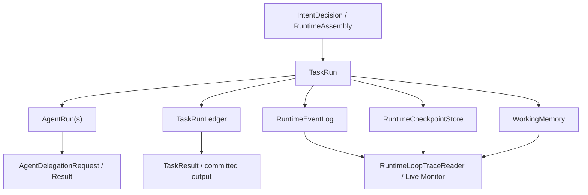
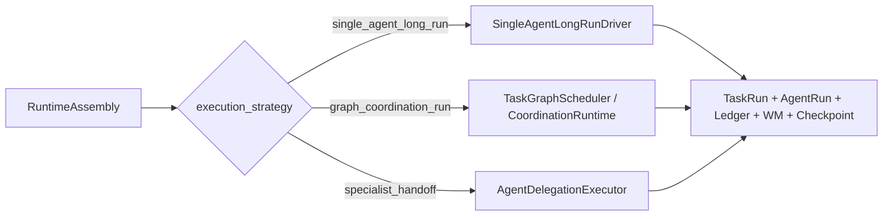

# 182-主Agent无图长任务与任务图统一运行底座方案

日期：2026-05-20

状态：正式方案

适用范围：OrchestrationSystem、Intent Layer、TaskRunLoop、RuntimeLane、SingleAgentRuntimeAssembly、TaskGraph Coordination、TaskRunLedger、WorkingMemory、Agent Delegation、RuntimeCheckpoint、Runtime Monitor、六十轮真实用户长跑

---

## 1. 问题定义

我们要解决的不是“给主 Agent 再加几个提示词”，而是一个运行模式缺口：

主 Agent 应该能独立承担真实的长任务，例如追踪问题、阅读代码、形成计划、修改、验证、复盘和收口。这个能力不应该依赖用户先创建任务图，也不应该把所有复杂任务都升级成 TaskGraph。TaskGraph 是多 Agent、多节点、多阶段、显式 handoff 和可视化协调的运行模式；它不是主 Agent 执行长任务的唯一方式。

当前系统已经有任务图运行底座，也有 `single_agent_long_run` 相关意图标签，但“无图长任务”还没有成熟的运行驱动。结果是：长任务可能在意图层被识别出来，却在执行层落回 conversation、capability、workspace patch 或专业委派短链路；主 Agent 缺少稳定的 plan/act/observe/verify/checkpoint/commit 循环。

正确终态：

| 目标 | 说明 |
|---|---|
| 同一套运行底座 | `TaskRun`、`AgentRun`、ledger、event log、checkpoint、working memory、delegation、monitor 共用 |
| 两种调度方式 | 无图长任务由主 Agent 长循环调度；图任务由 TaskGraph scheduler 调度 |
| 不造第二套系统 | 不新增独立 `LongRunLedger`、不新增旁路存储、不绕过 TaskRunLoop trace spine |
| 主 Agent 有自主执行力 | 没有任务图时仍能规划、工具观察、委派子 Agent、阶段提交、自检和恢复 |
| TaskGraph 不被削弱 | 需要多角色、并行、固定流程、可视化协调时仍走现有图任务 |

---

## 2. 技术源码报告

### 2.1 已经可复用的统一底座

本地代码显示，系统已经具备长任务所需的大部分底座对象，不需要重新搭一套。

| 能力 | 现有位置 | 可复用方式 |
|---|---|---|
| 根运行对象 | `backend/orchestration/runtime_loop/models.py` 的 `TaskRun` | 无图长任务和图任务都以 `TaskRun` 作为 root run |
| Agent 执行实例 | `backend/orchestration/runtime_loop/models.py` 的 `AgentRun`、`AgentRunResult` | 主 Agent、图节点 Agent、委派子 Agent 都可用同一对象表达 |
| 图协调对象 | `backend/orchestration/runtime_loop/models.py` 的 `CoordinationRun`、`CoordinationNodeRun`、handoff/merge models | 只在 TaskGraph / graph unit 场景创建，不应强加给无图长任务 |
| 任务进度账本 | `backend/tasks/run_models.py` 的 `TaskRunLedger`、`TaskStepRun`、`TaskResult` | 作为长任务进度、阶段提交和最终结果的统一账本 |
| 事件日志 | `backend/orchestration/runtime_loop/event_log.py` | 所有运行模式统一写 append-only trace |
| checkpoint | `backend/orchestration/runtime_loop/checkpoint.py` 的 `RuntimeCheckpointStore` | 无图长任务每个关键步骤后写 checkpoint |
| 图 checkpoint | `backend/orchestration/runtime_loop/langgraph_checkpoint_adapter.py` | 仅 TaskGraph coordination 使用 |
| WorkingMemory | `backend/memory_system/working_memory_models.py`、`working_memory_service.py` | 作为任务局部草稿、观察、决策、自检和 handoff note |
| 委派协议 | `backend/orchestration/delegation_protocol.py` | 主 Agent 调子 Agent 时复用标准通信契约 |
| 委派执行器 | `backend/orchestration/runtime_loop/agent_delegation_executor.py` | 负责请求验证、子 AgentRun、超时、质量门、结果归一化 |
| monitor | `backend/orchestration/runtime_loop/trace_reader.py` | 已能读 task_run-only monitor，也能读 coordination monitor |

这些对象说明：缺口不是“存储不够”或“对象不够”，而是缺少一个专门消费这些底座对象的 `single_agent_long` driver。

### 2.2 当前缺口

#### 缺口一：`single_agent_long_run` 是意图标签，不是稳定执行驱动

`backend/intent/action_planner.py` 已经将 `single_agent_long_run` 映射到 `runtime_mode=single_agent_long`。`backend/intent/signal_collector.py` 也会为长任务信号生成 `single_agent_long_run` 候选。

但 `backend/tasks/execution_shape_resolver.py` 当前主要按 RAG、PDF、dataset、memory、capability、workspace、conversation 等能力路由选择 recipe，没有专门将 `execution_strategy=single_agent_long_run` 落到长任务 recipe 或 driver。长任务容易退回短链路。

#### 缺口二：`TaskRunLoop` 承担了统一 trace，但缺少模式分发边界

`backend/orchestration/runtime_loop/task_run_loop.py` 的 `run_single_agent_stream()` 已经会：

1. 创建 `TaskRun` / `AgentRun`。
2. 写 `task_contract_built`。
3. 初始化 `TaskRunLedger`。
4. 调模型、工具、委派。
5. 写 checkpoint。
6. 生成最终 `TaskResult`。

但它现在更像“单轮 ReAct + 工具执行 + 终态收口”的大函数。无图长任务需要的是一个清晰的 driver：它负责多步计划、步骤推进、观察沉淀、阶段自检、失败修正和恢复，而 `TaskRunLoop` 只负责统一入口、trace spine 和终态提交。

#### 缺口三：TaskRunLedger 目前偏静态 recipe

`TaskRunLedger` 由 `ExecutionRecipe.step_blueprints` 初始化，适合静态步骤。但真实长任务常常动态发现新步骤，例如：

1. 先读测试结果。
2. 发现卡在 turn 18。
3. 再追日志。
4. 再定位到后台任务。
5. 再修复异步边界。
6. 再重跑验证。

这类步骤不适合预先全部固定成 TaskGraph，也不应该新建 `LongRunLedger`。应扩展现有 `TaskRunLedger` 支持“控制步骤 + 动态计划项”。

#### 缺口四：RuntimeLane 缺少主 Agent 长任务 lane

`backend/orchestration/runtime_lane_registry.py` 当前有 `full_interactive`、`task_dispatch`、`final_integration`、`game_delivery`、各类 delegate lane、`coordination_task` 等，但没有注册 `single_agent_long`。`storage/orchestration/agent_runtime_profiles.json` 中主 Agent 也没有允许该 lane。

这导致即使意图层说了 `runtime_lane=single_agent_long`，运行权限和装配层也没有稳定目标。

#### 缺口五：监控视图缺少 graphless long run 摘要

`RuntimeLoopTraceReader.get_task_run_live_monitor()` 已能处理没有 `CoordinationRun` 的 `TaskRun`。这很好，说明无图长任务可以共用 monitor 入口。

但当前 monitor 对 graphless long run 缺少一组长任务字段：当前目标、当前计划项、已完成步骤、最近观察、委派次数、阻塞原因、验证状态、最后 checkpoint。

---

## 3. 外部成熟方法参考

本方案只借鉴成熟系统的不变量，不照搬新引擎。

| 参考 | 可借鉴点 | 不照搬点 |
|---|---|---|
| LangGraph Persistence | 官方文档说明 graph state 会按 thread 保存 checkpoint，每个 super-step 形成可恢复状态，并支持 state history、replay、pending writes recovery。参考：[LangGraph Persistence](https://docs.langchain.com/oss/python/langgraph/persistence) | 不把无图长任务强行建成 LangGraph graph，也不要求主 Agent 动态建图 |
| Temporal Workflow | 官方文档强调 Workflow/Activity 分离、事件历史、replay deterministic；外部 API、LLM、数据库等非确定性操作应放到 Activity。参考：[Temporal Workflow Definition](https://docs.temporal.io/workflow-definition) | 不引入完整 Temporal 引擎，不要求 Python workflow deterministic replay |
| OpenAI Agents SDK | handoff 以工具形式交给模型，适合专业 Agent 分工；tracing 支持一个 workflow 下多个 run/span。参考：[OpenAI Agents SDK Handoffs](https://openai.github.io/openai-agents-python/handoffs/)、[Tracing](https://openai.github.io/openai-agents-python/tracing/) | 不把我们的 delegation 改成另一套 SDK，只吸收“handoff 是显式工具契约”和“trace 统一观测” |

提炼出的工程原则：

1. 长任务必须有 durable step boundary。
2. 非确定性外部动作必须有 execution record / idempotency guard。
3. 子 Agent 委派必须是显式契约，不是自然语言随口外包。
4. trace / monitor 是运行对象的一部分，不是事后日志拼接。
5. 恢复只能恢复候选和运行状态，不能替当前 turn 重新做意图裁决。

---

## 4. 目标设计：同一运行底座，不同调度方式

### 4.1 统一运行底座

统一底座不是新层，不叫工厂，也不是另一个系统。它就是现有编排系统中已经存在、需要被稳定复用的一组运行对象。



统一对象职责：

| 对象 | 在无图长任务中的职责 | 在 TaskGraph 中的职责 |
|---|---|---|
| `TaskRun` | 主 Agent 长任务 root | 图协调 root |
| `AgentRun` | 主 Agent run，必要时产生委派 child run | coordinator / node / child Agent run |
| `TaskRunLedger` | 控制步骤、动态计划项、阶段状态 | 图运行 root 账本或节点任务账本 |
| `WorkingMemory` | 任务局部计划、观察、决策、自检、草稿 | 节点局部记忆、handoff、上游/下游工作状态 |
| `RuntimeEventLog` | 长任务进度、工具观察、委派、验证、提交 | 图调度、节点执行、handoff、merge |
| `RuntimeCheckpointStore` | 每个关键步骤后写主 run checkpoint | root task checkpoint |
| `LangGraphCheckpointStoreAdapter` | 不使用 | coordination run checkpoint |
| `AgentDelegationExecutor` | 主 Agent 对 bounded 子任务委派 | 节点或 coordinator 对专业 Agent 委派 |
| `TaskResult` | 最终用户可见提交 | 图 merge 后结果提交 |

### 4.2 两种调度方式



#### 无图长任务调度

主 Agent 自己决定下一步。系统提供边界、工具、checkpoint、账本、工作记忆和委派协议。

固定循环：

```text
understand goal
  -> draft / revise task-local plan
  -> execute next plan item
  -> observe tool or child result
  -> update ledger + working memory
  -> verify local result
  -> decide continue / repair / commit / block
  -> checkpoint
```

#### TaskGraph 调度

图调度器根据 topology、node status、edge/handoff、join policy 决定下一节点。Agent 只执行节点职责，不能自己改变图结构。

固定循环：

```text
compile graph
  -> schedule ready node
  -> execute node AgentRun
  -> write node output / handoff
  -> update coordination state
  -> merge / gate / continue
  -> checkpoint graph thread
```

### 4.3 模式边界

| 模式 | 适合 | 不适合 |
|---|---|---|
| `single_react_loop` | 当前 turn 内一两次工具观察即可完成 | 需要长时间追踪、阶段验证、恢复 |
| `single_agent_long_run` | 一个主 Agent 可负责，但需要多步、动态计划、工具循环、可恢复 | 需要固定多角色流程、并行节点、可视化图协调 |
| `single_agent_background_run` | 单 Agent 长任务可后台执行，不应阻塞当前交互 | 用户要求即时交互收口的任务 |
| `specialist_handoff` | 一个 bounded 专业子任务，例如 RAG/PDF/table/web | 把主任务整体外包给子 Agent |
| `specialist_subagent_long_run` | 某个专业 Agent 需要长时间处理自己的领域任务 | 多角色协同或需要图级编排 |
| `graph_coordination_run` | 多 Agent、多节点、显式 handoff、并行、阶段 gate、任务图编辑器可视化 | 普通复杂任务、主 Agent 自主工作 |

关键判断：

```text
是否需要任务图，不看“任务长不长”，而看是否需要显式多角色拓扑、节点/边、并行、handoff、阶段 gate 和可视化调度。
```

---

## 5. SingleAgentLongRun 运行规格

### 5.1 RuntimeLane

新增 `single_agent_long` runtime lane。

建议配置：

```json
{
  "lane_id": "single_agent_long",
  "title": "主Agent长任务",
  "category": "主 Agent 场景",
  "description": "主 Agent 在无任务图时承接多步计划、工具执行、委派、自检、checkpoint 和最终收口。",
  "default_operations": [
    "op.model_response",
    "op.read_file",
    "op.search_text",
    "op.search_files",
    "op.git_status",
    "op.git_diff",
    "op.shell",
    "op.write_file",
    "op.edit_file",
    "op.delegate_to_agent",
    "op.memory_read"
  ],
  "default_memory_scopes": [
    "conversation_readonly",
    "state_readonly",
    "task_working_memory"
  ],
  "default_context_sections": [
    "conversation",
    "task",
    "projection",
    "tool",
    "runtime_contracts",
    "runtime_trace",
    "working_memory"
  ],
  "default_approval_policy": "task_bounded_write",
  "delegation_kinds": [
    "rag",
    "pdf_reading",
    "table_analysis",
    "web_research",
    "readonly_exploration"
  ]
}
```

主 Agent profile 需要允许该 lane，并将 `max_delegate_calls_per_turn` 从“当前 turn”语义升级为“每个 long-run step 或全局预算”语义。否则长任务第一步委派后，后续步骤会被旧 turn budget 卡住。

### 5.2 ExecutionRecipe

新增 `runtime.recipe.single_agent_long_run`，它不是静态任务图，只提供控制步骤。

控制步骤：

| step_id | 作用 |
|---|---|
| `understand_goal` | 固化用户目标、边界、验收标准 |
| `draft_plan` | 生成 task-local plan，不创建 TaskGraph |
| `execute_plan_items` | 循环执行动态计划项 |
| `verify_result` | 检查结果是否满足验收 |
| `finalize_delivery` | 提交最终用户可见结果 |

动态计划项不新增 `LongRunLedger`。实现上应扩展 `TaskRunLedger` helper，允许追加 `TaskStepRun`：

```text
append_dynamic_task_run_step(ledger, plan_item)
complete_task_run_step(...)
fail_task_run_step(...)
terminalize_task_run_ledger(...)
```

动态项可写入现有字段：

| 字段 | 用法 |
|---|---|
| `step_kind` | `plan_item` / `tool_action` / `delegation` / `verification` / `repair` |
| `executor_type` | `main_agent` / `tool` / `delegated_agent` |
| `observation_refs` | 工具观察、子 Agent 结果、文件 diff、测试输出 |
| `output_refs` | 产物、阶段摘要、验证报告 |
| `diagnostics.plan_item_id` | 动态计划项 ID |
| `diagnostics.parent_control_step_id` | 关联 `execute_plan_items` 等控制步骤 |

### 5.3 WorkingMemory 使用规范

无图长任务不创建 `CoordinationRun`，但仍可使用 `WorkingMemory`。

建议写入方式：

| 字段 | 值 |
|---|---|
| `scope` | `task_scope` |
| `graph_id` | 空字符串 |
| `owner_node_id` | `graphless.main` |
| `owner_node_role` | `main_agent_long_runner` |
| `node_run_id` | 主 `agent_run_id` |
| `writer_agent_id` | `agent:0` 或实际主 Agent |
| `visibility` | `private_to_agent` 为默认；需要委派时用 `handoff_only` |
| `memory_semantics` | `instruction`、`decision`、`temporal_event`、`working_fact`、`evaluation`、`handoff_note` |
| `authority` | `runloop_adopted` 只给被 driver 接受的关键状态 |

WorkingMemory 中应沉淀：

1. 当前任务目标和验收标准。
2. 当前动态计划。
3. 每个工具观察的摘要和 ref。
4. 每个子 Agent 回传的 evidence packet。
5. 自检结论和未解决限制。
6. 最终提交前的 closeout note。

WorkingMemory 不应承担：

1. 当前 turn 意图裁决。
2. 长期记忆检索替代。
3. StateMemory 式 active binding。
4. 覆盖用户最新指令。

### 5.4 委派通信协议

主 Agent 长任务可以调用子 Agent，但必须通过现有 `AgentDelegationRequest / AgentDelegationResult` 契约。

主 Agent 委派时必须传：

| 字段 | 说明 |
|---|---|
| `delegated_goal` | 子 Agent 只负责的 bounded 目标 |
| `parent_task_goal` | 主任务目标摘要 |
| `plan_item_id` | 对应动态计划项 |
| `scope` | 数据源、文件、知识库、页面、表格范围 |
| `forbidden_scope` | 明确不能扩大的范围 |
| `expected_output_contract` | summary、answer_candidate、evidence_refs、limitations |
| `return_format` | 结构化结果，而非最终用户回答 |
| `stop_condition` | 完成、证据不足、权限不足、超时 |

子 Agent 回传必须包含：

| 字段 | 说明 |
|---|---|
| `summary` | 子任务完成情况 |
| `answer_candidate` | 可供主 Agent 使用的答案候选 |
| `evidence_refs` | 工具、文件、页码、检索结果、artifact refs |
| `consumed_handles` | 使用了哪些输入对象 |
| `produced_handles` | 产生了哪些输出对象 |
| `confidence` | 置信度 |
| `limitations` | 不足、缺失、失败原因 |

主 Agent 收口规则：

1. 子 Agent 结果是 evidence packet，不是最终回答。
2. 主 Agent 必须核对 scope、limitations 和 evidence refs。
3. 主 Agent 负责整合多个工具/子 Agent 观察。
4. 主 Agent 最终回答不能暴露内部 protocol id、raw child prompt、运行实现细节。

### 5.5 Checkpoint 和恢复

无图长任务 checkpoint 边界：

| 边界 | 必须写入 |
|---|---|
| 任务开始 | TaskRun、AgentRun、初始 ledger、goal contract |
| 计划生成后 | plan working memory、ledger 控制步骤 |
| 每个动态计划项完成后 | step result、observation refs、execution record、checkpoint |
| 每次委派回传后 | delegation result、parent observation、ledger update、checkpoint |
| 每次写文件/执行 shell 后 | operation execution record、result refs、checkpoint |
| 自检后 | evaluation working memory、verification status |
| 最终提交后 | TaskResult、terminal ledger、terminal checkpoint |

恢复策略：

1. 从最新 `RuntimeCheckpoint` 恢复 loop state。
2. 从 `TaskRunLedger` 找到最近未完成或失败 plan item。
3. 从 `OperationExecutionRecord` 判断外部动作是否已经完成，避免重复写文件、重复执行昂贵命令。
4. 从 WorkingMemory 恢复计划、观察、自检候选。
5. 由当前 turn 的 IntentDecision 决定是否继续该 run；恢复状态不能替用户做当前意图裁决。

### 5.6 输出提交

长任务最终输出必须走 `TaskResult` / committed output 边界。

最终提交至少包含：

| 字段 | 说明 |
|---|---|
| `final_answer` | 面向用户的收口回答 |
| `completed_steps` | 高层步骤摘要 |
| `evidence_refs` | 关键工具/子 Agent/文件/测试 refs |
| `artifact_refs` | 被修改或生成的产物 |
| `verification` | 运行了哪些测试或为何未运行 |
| `limitations` | 仍存在的风险或未完成项 |

禁止：

1. 直接把 raw tool result 当最终回答。
2. 直接把子 Agent 回传当最终回答。
3. 未经 self-check 就 terminalize。
4. 工具失败时假装成功。

---

## 6. 与 TaskGraph 的合并空间

### 6.1 应合并的部分

| 模块 | 合并方式 |
|---|---|
| runtime object | 共用 `TaskRun`、`AgentRun`、`TaskResult` |
| trace | 共用 `RuntimeEventLog` event schema，新增少量 long-run event type |
| checkpoint | 共用 `RuntimeCheckpointStore`；graph 额外使用 coordination checkpoint |
| working memory | 共用 `WorkingMemoryService`，通过 scope/owner 区分 |
| delegation | 共用 `AgentDelegationExecutor` 和 `delegation_protocol` |
| operation guard | 共用 tool directive、operation gate、execution record、idempotency |
| monitor | 共用 `RuntimeLoopTraceReader` 入口 |
| output commit | 共用 TaskResult 和 finalization policy |
| model profile | 共用 AgentRuntimeProfile / model profile resolver |

### 6.2 不应合并的部分

| 不合并项 | 原因 |
|---|---|
| Graph topology | 无图长任务没有节点/边，不应伪造图 |
| `CoordinationRun` | 只有图协调需要；无图长任务创建它会污染语义 |
| LangGraph checkpoint thread | 无图长任务用 TaskRun checkpoint 即可 |
| Node/Edge handoff | 无图长任务只有主 Agent 到子 Agent 的 bounded delegation |
| Graph scheduler | 无图长任务下一步由主 Agent driver 决定 |
| TaskGraph editor | 主 Agent 长任务不能依赖用户可视化编辑图 |

### 6.3 统一后的运行选择

```text
用户请求
  -> IntentFrame / IntentDecision
  -> RuntimeAssembly
  -> TaskRunLoop
  -> 根据 execution_strategy 选择 runtime driver
```

选择规则：

| 条件 | 选择 |
|---|---|
| 简短问答，无工具 | `direct_answer` / `single_react_loop` |
| 一次或少量工具观察即可完成 | `single_react_loop` |
| 需要多步追踪、修复、验证，但主 Agent 可负责 | `single_agent_long_run` |
| 单 Agent 可做但耗时长且不应阻塞用户 | `single_agent_background_run` |
| 需要 RAG/PDF/table/web 等 bounded 专业任务 | `specialist_handoff` |
| 专业子 Agent 需要长时间跑自己的任务 | `specialist_subagent_long_run` |
| 明确需要多角色、多节点、并行、固定流程、handoff、图编辑器 | `graph_coordination_run` |

---

## 7. 实施计划

### 阶段一：运行模式与装配契约打通

目标：让 `single_agent_long_run` 从意图标签变成可执行 runtime assembly。

修改：

| 文件 | 动作 |
|---|---|
| `backend/orchestration/runtime_lane_registry.py` | 新增 `single_agent_long` lane |
| `backend/orchestration/agent_runtime_registry.py` | 主 Agent 默认 profile 允许 `single_agent_long` |
| `storage/orchestration/agent_runtime_profiles.json` | 迁移主 Agent runtime lane 配置 |
| `backend/intent/action_planner.py` | 保证 `single_agent_long_run -> runtime_mode=single_agent_long` |
| `backend/tasks/execution_shape_resolver.py` | 当 intent execution_strategy 为 `single_agent_long_run` 时选择 `runtime.recipe.single_agent_long_run` |
| `backend/tasks/execution_recipe_builder.py` | 新增 long-run recipe 控制步骤 |
| `backend/orchestration/runtime_loop/runtime_assembly_models.py` | `RuntimeLoopPolicy` 增加 long-run 相关 policy 字段或 metadata |
| `backend/orchestration/runtime_loop/runtime_assembly_builder.py` | single agent assembly 支持 `loop_mode=single_agent_long` |

完成标准：

1. 长任务请求能解析出 `execution_strategy=single_agent_long_run`。
2. selected recipe 为 `runtime.recipe.single_agent_long_run`。
3. runtime lane 为 `single_agent_long`。
4. 主 Agent profile 权限校验通过。

### 阶段二：新增无图长任务 driver

目标：把长任务循环从 `TaskRunLoop` 大函数中抽出，避免继续膨胀。

新增：

| 文件 | 动作 |
|---|---|
| `backend/orchestration/runtime_loop/single_agent_long_run_driver.py` | 新增长任务 driver |
| `backend/orchestration/runtime_loop/single_agent_long_run_models.py` | 如确有必要，仅放运行期轻量 dataclass，不建独立存储 |

driver 输入：

```text
TaskRunLoop state
TaskSpec
ExecutionRecipe
SingleAgentRuntimeAssembly
AgentRuntimeProfile
RuntimeContextManager
model_response_executor
tool_runtime_executor
delegation_executor
```

driver 输出：

```text
stream events
ledger updates
working memory refs
checkpoint events
TaskResult / terminal state
```

完成标准：

1. `TaskRunLoop` 只负责分发和统一事件，不内联所有长任务逻辑。
2. driver 能执行 plan/act/observe/verify/commit 循环。
3. 每个关键边界写 event + checkpoint。

### 阶段三：扩展 TaskRunLedger 动态计划项

目标：不用 `LongRunLedger`，而是在现有 ledger 上支持动态步骤。

修改：

| 文件 | 动作 |
|---|---|
| `backend/tasks/run_models.py` | 新增 `append_task_run_step` / `upsert_task_run_step_diagnostics` helper |
| `backend/orchestration/runtime_loop/task_run_loop.py` | 复用已有 ledger event 写入函数 |
| `backend/tests/task_run_ledger_regression.py` | 增加动态计划项测试 |

完成标准：

1. long-run control steps 和 dynamic plan steps 同在 `TaskRunLedger`。
2. monitor 能读出当前动态计划项。
3. 失败/重试/跳过不需要新存储。

### 阶段四：WorkingMemory 长任务规范化

目标：让长任务状态可恢复、可审计，但不污染当前 turn 裁决。

修改：

| 文件 | 动作 |
|---|---|
| `backend/memory_system/working_memory_service.py` | 增加 graphless main task helper，可选 |
| `backend/orchestration/runtime_loop/single_agent_long_run_driver.py` | 写入 plan、observation、decision、evaluation、handoff note |
| `backend/orchestration/runtime_loop/checkpoint.py` | checkpoint refs 纳入 long-run working memory refs |

完成标准：

1. 每个长任务 checkpoint 可恢复关键 WorkingMemory refs。
2. WorkingMemory 只作为 task-local 运行状态，不参与当前 turn 意图绑定。

### 阶段五：委派协议升级为长任务可用

目标：主 Agent 调子 Agent 时指令精确、scope 明确、回传结构稳定。

修改：

| 文件 | 动作 |
|---|---|
| `backend/orchestration/delegation_protocol.py` | 增加 long-run delegation fields：plan_item_id、forbidden_scope、expected_evidence |
| `backend/orchestration/runtime_loop/delegation_models.py` | 如字段不足，扩展 request diagnostics / payload contract |
| `backend/orchestration/runtime_loop/agent_delegation_executor.py` | 将 child result 回写 long-run ledger / WM refs |
| `backend/orchestration/runtime_loop/child_agent_runtime_executor.py` | 确保子 Agent 收到任务流程、边界、回传格式 |

完成标准：

1. RAG/PDF/table/web 委派都能带明确 scope。
2. 子 Agent 只回 evidence packet，不替主 Agent 最终收口。
3. 委派失败、超时、证据不足都进入主 Agent repair/closeout 决策。

### 阶段六：Checkpoint、恢复与 replay guard

目标：长任务卡住或中断后能从最近安全点恢复，外部动作不重复执行。

修改：

| 文件 | 动作 |
|---|---|
| `backend/orchestration/runtime_loop/task_run_loop.py` | dispatch 恢复 long-run driver |
| `backend/orchestration/runtime_loop/checkpoint.py` | 保证 long-run refs 进入 checkpoint |
| `backend/orchestration/runtime_loop/task_run_loop.py` 的 execution record 相关路径 | 复用 operation idempotency guard |
| `backend/tests/single_agent_long_run_resume_test.py` | 增加恢复测试 |

完成标准：

1. 已完成工具动作不会在恢复后重复执行。
2. 已完成子 Agent 委派不会重复触发，除非明确 retry。
3. 恢复后 ledger、working memory、checkpoint 状态一致。

### 阶段七：Monitor 与前端展示

目标：用户能看懂长任务进展，不必打开 TaskGraph monitor。

修改：

| 文件 | 动作 |
|---|---|
| `backend/orchestration/runtime_loop/trace_reader.py` | task-run monitor 增加 `single_agent_long_run` summary |
| `backend/orchestration/runtime_loop/task_graph_run_monitor.py` | 保持 graph monitor 独立，不混入长任务拓扑 |
| `frontend/src/components/workspace/views/task-system/TaskRunLoopWorkbenchPanel.tsx` 或现有 monitor 面板 | 增加 graphless long-run 进度卡片 |

展示字段：

1. 当前目标。
2. 当前计划项。
3. 已完成/失败/待处理步骤。
4. 最近工具观察。
5. 子 Agent 委派结果。
6. 最后 checkpoint。
7. 验证状态。
8. 阻塞原因。

### 阶段八：测试与长跑验证

目标：证明主 Agent 能执行真实长任务，且 TaskGraph 不回归。

测试：

| 测试 | 覆盖 |
|---|---|
| intent strategy test | 长任务识别为 `single_agent_long_run` |
| execution shape test | long-run recipe 不退回 conversation |
| runtime lane test | 主 Agent 允许 `single_agent_long` |
| ledger dynamic test | 动态计划项追加、完成、失败、恢复 |
| delegation protocol test | 子 Agent scope 和 output contract 完整 |
| checkpoint resume test | 中断恢复不重复执行外部动作 |
| monitor test | graphless long-run monitor 有摘要 |
| graph regression test | TaskGraph coordination 仍走 `CoordinationRun` 和 graph scheduler |
| sixty-turn scenario | 真实对话长跑验证不截断、不卡死、不误用任务图 |

---

## 8. 固定执行流

### 8.1 无图长任务

```text
IntentDecision(single_agent_long_run)
  -> RuntimeAssembly(single_agent_long)
  -> TaskRunLoop.start()
  -> build TaskRunLedger(control steps)
  -> SingleAgentLongRunDriver.start()
  -> write WorkingMemory(goal + acceptance)
  -> model drafts plan
  -> append dynamic plan steps
  -> execute next step through tool/delegation/model
  -> record observation
  -> update ledger
  -> write checkpoint
  -> verify
  -> commit TaskResult
  -> terminal checkpoint
```

### 8.2 图任务

```text
IntentDecision(graph_coordination_run)
  -> RuntimeAssembly(graph_coordination)
  -> TaskRunLoop.start_task_graph_run()
  -> compile graph contract
  -> create CoordinationRun
  -> LangGraphCoordinationRuntime schedules node
  -> node AgentRun executes
  -> handoff / merge / gate
  -> coordination checkpoint
  -> final TaskResult
```

### 8.3 specialist handoff

```text
IntentDecision(specialist_handoff)
  -> Main Agent selected recipe delegate_preferred
  -> delegate_to_agent tool
  -> AgentDelegationExecutor validates
  -> child AgentRun executes bounded task
  -> AgentDelegationResult normalized
  -> parent observation
  -> main Agent synthesizes final answer
```

---

## 9. 迁移与切换规则

### 9.1 兼容窗口

短期允许 `single_agent_long_run` 和旧短链路同时存在，但不能静默降级。

规则：

1. 如果意图层明确选择 `single_agent_long_run`，但 driver 未启用，应返回 blocked diagnostic，而不是悄悄走 conversation。
2. 如果长任务只需要一次工具观察，driver 可在第一轮自检后快速 commit，但仍保留 ledger/checkpoint。
3. 如果运行中发现需要多角色固定拓扑，应提示升级为 TaskGraph 或创建 graph run，而不是在 long-run 内伪造节点。

### 9.2 Cutover

建议分三步开启：

| 阶段 | 范围 |
|---|---|
| shadow | 只记录本应进入 `single_agent_long_run` 的候选和诊断，不改变执行 |
| explicit | 用户明确说“追踪/修复/重跑/长任务/继续执行计划”时启用 |
| default | 所有符合长任务信号且不需要 TaskGraph 的请求默认启用 |

### 9.3 Rollback

允许 emergency rollback，但不能假装长任务已完成。

Rollback 后：

1. 已创建的 `TaskRun`、ledger、checkpoint 保留。
2. 未完成 long-run 标记为 `blocked` 或 `aborted`。
3. 后续 turn 可继续该 run 或重新创建 TaskGraph。
4. 不自动把未完成 run 转成普通 conversation。

---

## 10. 风险控制与反模式

### 10.1 风险

| 风险 | 控制 |
|---|---|
| `TaskRunLoop` 继续膨胀 | 长任务逻辑放到 driver 文件，TaskRunLoop 只分发 |
| 主 Agent 无限循环 | loop policy 设置 max_turns、max_steps、budget、stall detector |
| 委派过度 | delegation budget 按 long-run step / task-run 计数 |
| 恢复重复写文件 | operation execution record + idempotency key |
| WorkingMemory 变成新 StateMemory | 明确 task-local，禁止参与当前 turn 绑定裁决 |
| TaskGraph 被绕过 | 多角色固定流程仍必须使用 graph_coordination |
| 图任务被污染 | graphless long-run 不创建 CoordinationRun |

### 10.2 禁止反模式

1. 禁止为了“长任务”伪造 TaskGraph。
2. 禁止新增独立 `LongRunLedger`。
3. 禁止让 state memory / durable memory active binding 决定当前 turn 执行对象。
4. 禁止绕过 RuntimeAssembly 直接按工具名分流。
5. 禁止子 Agent prompt 写成开发说明或节点标签。
6. 禁止子 Agent 直接生成最终用户回答后主 Agent 原样转发。
7. 禁止工具失败后用自然语言补偿成“看起来完成”。
8. 禁止把 graph checkpoint 和 task checkpoint 混成一个语义。

---

## 11. 文件级执行清单

### 后端

| 文件 | 动作 |
|---|---|
| `backend/orchestration/runtime_lane_registry.py` | 新增 `single_agent_long` lane |
| `backend/orchestration/agent_runtime_registry.py` | 默认主 Agent profile 加入 `single_agent_long` |
| `storage/orchestration/agent_runtime_profiles.json` | 迁移主 Agent allowed_runtime_lanes |
| `backend/intent/signal_collector.py` | 长任务信号候选稳定输出 `single_agent_long_run` |
| `backend/intent/action_planner.py` | runtime hint 输出 `single_agent_long` |
| `backend/tasks/execution_shape_resolver.py` | 根据 execution_strategy 选择 long-run recipe |
| `backend/tasks/execution_recipe_builder.py` | 新增 `runtime.recipe.single_agent_long_run` |
| `backend/tasks/run_models.py` | 增加动态 step helper |
| `backend/tasks/assembly_support.py` | TaskSpec 写入 long-run acceptance / delegation contract |
| `backend/orchestration/runtime_loop/runtime_assembly_models.py` | loop policy 支持 long-run metadata |
| `backend/orchestration/runtime_loop/runtime_assembly_builder.py` | 输出 long-run assembly |
| `backend/orchestration/runtime_loop/task_run_loop.py` | 只做 long-run driver 分发、事件桥接、终态提交 |
| `backend/orchestration/runtime_loop/single_agent_long_run_driver.py` | 新增主 Agent 长任务 driver |
| `backend/orchestration/delegation_protocol.py` | 扩展 long-run 委派字段和子 Agent 回传要求 |
| `backend/orchestration/runtime_loop/agent_delegation_executor.py` | 委派结果回写 ledger / WM / checkpoint refs |
| `backend/orchestration/runtime_loop/checkpoint.py` | 确认 long-run refs 进入 checkpoint |
| `backend/orchestration/runtime_loop/trace_reader.py` | 增加 graphless long-run monitor summary |

### 前端

| 文件 | 动作 |
|---|---|
| `frontend/src/lib/api.ts` | 增加 long-run monitor 类型 |
| `frontend/src/components/workspace/views/task-system/TaskRunLoopWorkbenchPanel.tsx` | 展示无图长任务进度 |
| `frontend/src/components/workspace/views/task-system/TaskGraphTopologyPage.tsx` | 保持图任务页面只显示 graph coordination，不混入 graphless long-run |

### 测试

| 文件 | 动作 |
|---|---|
| `backend/tests/intent_continuation_layer_regression.py` | 增加长任务意图选择用例 |
| `backend/tests/execution_shape_resolver_regression.py` | 增加 `single_agent_long_run` recipe 用例 |
| `backend/tests/task_run_ledger_regression.py` | 增加动态 step |
| `backend/tests/single_agent_long_run_driver_test.py` | 新增长任务 driver 单测 |
| `backend/tests/agent_delegation_protocol_regression.py` | 增加 long-run 委派协议 |
| `backend/tests/runtime_checkpoint_resume_regression.py` | 增加恢复与 replay guard |
| `backend/tests/task_graph_registry_test.py` | 确保 TaskGraph 不受影响 |
| `scripts/run_sixty_turn_real_user_marathon.*` 或现有 harness | 增加长任务案例断言 |

---

## 12. 验收矩阵

| 场景 | 期望 |
|---|---|
| “追踪一下为什么卡住并修复” | 进入 `single_agent_long_run`，不创建 `CoordinationRun` |
| “重跑六十轮并分析失败案例” | 主 Agent 可多步执行、委派检索/分析、最终收口 |
| “读取 PDF 后总结某页” | 走 PDF specialist handoff 或短 ReAct，不误判为 TaskGraph |
| “按部门汇总这前五名，不扩展全表” | 委派时携带 forbidden scope，子 Agent 不扩大范围 |
| “执行这个多 Agent 审核流程” | 进入 TaskGraph coordination，创建 `CoordinationRun` |
| 长任务中断后继续 | 从 checkpoint + ledger + WM 恢复 |
| 长任务已写文件后恢复 | 不重复执行同一写操作 |
| 子 Agent 超时 | 主 Agent 收到 limitations，决定 retry/block/partial closeout |
| monitor 查看无图长任务 | 展示计划、步骤、观察、验证、checkpoint |
| 六十轮真实对话 | 不因后台记忆或持久化维护阻塞主任务，不把长任务降级成半截回答 |

---

## 13. 最终决策

采用“同一运行底座，不同调度方式”的方案。

不新增独立长任务系统，不让 TaskGraph 承担所有长任务，也不把主 Agent 长任务做成 prompt-only 能力。主 Agent 长任务应成为现有 OrchestrationSystem 的一种正式 runtime driver：

```text
TaskRun + AgentRun + TaskRunLedger + WorkingMemory + EventLog + Checkpoint + Delegation + Monitor
  -> SingleAgentLongRunDriver
```

TaskGraph coordination 保持：

```text
TaskRun + AgentRun + CoordinationRun + Graph Scheduler + Node/Edge/Handoff + LangGraphCheckpoint + Monitor
```

这样既保留任务图的强协调能力，也补齐主 Agent 在无任务图场景下独立处理真实长任务的能力。系统不会变成两套，也不会把所有复杂问题都塞进任务图。主 Agent 像成熟 agent 一样能自己计划、行动、观察、委派、验证和收口；任务图则继续负责明确、多角色、可视化、可调度的长流程。
