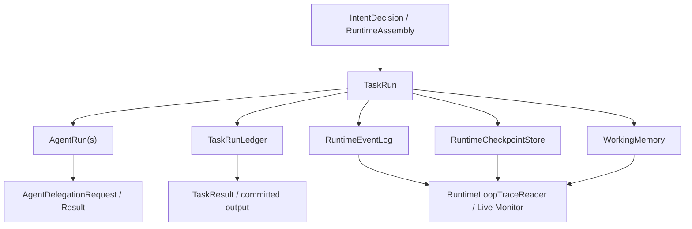

# 182-主Agent自主任务与任务图统一运行底座方案

日期：2026-05-20

状态：正式方案

命名修订：本文正式术语采用 `autonomous_task_run` / `autonomous_task` / `AutonomousTaskRunDriver` / `autonomy_mode`。早期草案中的旧长任务命名不再作为正式接口或文档术语使用，因为主 Agent 自主任务未来可以受控调用工具和子 Agent，不应被命名限定为永远单 Agent。

当前实施进度：已完成 `autonomous_task` lane、`runtime.recipe.autonomous_task_run`、`AutonomousTaskRunDriver` simple 模式、standard 模式的动态 `TaskRunLedger` 计划项骨架，以及 `TaskRunLoop` 分发接入。standard 当前已经具备可观测计划、`step_added`、ledger 更新、checkpoint 边界，并已接入一轮受控观察闭环：模型可在 standard 模式下调用已授权工具或通过 `delegate_to_agent` 委派一个受限子 Agent，运行时复用现有 OperationGate / ToolRuntimeExecutor / AgentDelegationExecutor / observation event 链路执行并回传，再由模型基于真实 ToolMessage 收口。最新实现已把工具/委派观察绑定到动态计划项，把 `autonomous_task_verification_checked` 回写到 `autonomous.final_check` ledger step，并让 `managed` 作为同一 driver 的重策略档保留到 recipe、event、monitor 和 verification 证据中，不再静默降级为 simple/standard。复杂多轮工具循环、委派恢复复用、后台进度和 repair loop 仍按后续阶段继续推进。

适用范围：OrchestrationSystem、Intent Layer、TaskRunLoop、RuntimeLane、SingleAgentRuntimeAssembly、TaskGraph Coordination、TaskRunLedger、WorkingMemory、Agent Delegation、RuntimeCheckpoint、Runtime Monitor、六十轮真实用户长跑

---

## 1. 问题定义

我们要解决的不是“给主 Agent 再加几个提示词”，而是一个运行模式缺口：

主 Agent 应该能独立承担真实的长任务，例如追踪问题、阅读代码、形成计划、修改、验证、复盘和收口。这个能力不应该依赖用户先创建任务图，也不应该把所有复杂任务都升级成 TaskGraph。TaskGraph 是多 Agent、多节点、多阶段、显式 handoff 和可视化协调的运行模式；它不是主 Agent 执行长任务的唯一方式。

当前系统已经有任务图运行底座，也有 `autonomous_task_run` 相关意图标签，但“主 Agent 自主任务”还没有成熟的运行驱动。结果是：长任务可能在意图层被识别出来，却在执行层落回 conversation、capability、workspace patch 或专业委派短链路；主 Agent 缺少稳定的 plan/act/observe/verify/checkpoint/commit 循环。

正确终态：

| 目标 | 说明 |
|---|---|
| 同一套运行底座 | `TaskRun`、`AgentRun`、ledger、event log、checkpoint、working memory、delegation、monitor 共用 |
| 两种调度方式 | 主 Agent 自主任务由主 Agent 长循环调度；图任务由 TaskGraph scheduler 调度 |
| 不造第二套系统 | 不新增独立 `LongRunLedger`、不新增旁路存储、不绕过 TaskRunLoop trace spine |
| 主 Agent 有自主执行力 | 没有任务图时仍能规划、工具观察、委派子 Agent、阶段提交、自检和恢复 |
| TaskGraph 不被削弱 | 需要多角色、并行、固定流程、可视化协调时仍走现有图任务 |

---

## 2. 技术源码报告

### 2.1 已经可复用的统一底座

本地代码显示，系统已经具备长任务所需的大部分底座对象，不需要重新搭一套。

| 能力 | 现有位置 | 可复用方式 |
|---|---|---|
| 根运行对象 | `backend/orchestration/runtime_loop/models.py` 的 `TaskRun` | 主 Agent 自主任务和图任务都以 `TaskRun` 作为 root run |
| Agent 执行实例 | `backend/orchestration/runtime_loop/models.py` 的 `AgentRun`、`AgentRunResult` | 主 Agent、图节点 Agent、委派子 Agent 都可用同一对象表达 |
| 图协调对象 | `backend/orchestration/runtime_loop/models.py` 的 `CoordinationRun`、`CoordinationNodeRun`、handoff/merge models | 只在 TaskGraph / graph unit 场景创建，不应强加给主 Agent 自主任务 |
| 任务进度账本 | `backend/tasks/run_models.py` 的 `TaskRunLedger`、`TaskStepRun`、`TaskResult` | 作为长任务进度、阶段提交和最终结果的统一账本 |
| 事件日志 | `backend/orchestration/runtime_loop/event_log.py` | 所有运行模式统一写 append-only trace |
| checkpoint | `backend/orchestration/runtime_loop/checkpoint.py` 的 `RuntimeCheckpointStore` | 主 Agent 自主任务每个关键步骤后写 checkpoint |
| 图 checkpoint | `backend/orchestration/runtime_loop/langgraph_checkpoint_adapter.py` | 仅 TaskGraph coordination 使用 |
| WorkingMemory | `backend/memory_system/working_memory_models.py`、`working_memory_service.py` | 作为任务局部草稿、观察、决策、自检和 handoff note |
| 委派协议 | `backend/orchestration/delegation_protocol.py` | 主 Agent 调子 Agent 时复用标准通信契约 |
| 委派执行器 | `backend/orchestration/runtime_loop/agent_delegation_executor.py` | 负责请求验证、子 AgentRun、超时、质量门、结果归一化 |
| monitor | `backend/orchestration/runtime_loop/trace_reader.py` | 已能读 task_run-only monitor，也能读 coordination monitor |

这些对象说明：缺口不是“存储不够”或“对象不够”，而是缺少一个专门消费这些底座对象的 `autonomous_task` driver。

### 2.2 当前缺口

#### 缺口一：`autonomous_task_run` 是意图标签，不是稳定执行驱动

`backend/intent/action_planner.py` 已经将 `autonomous_task_run` 映射到 `runtime_mode=autonomous_task`。`backend/intent/signal_collector.py` 也会为长任务信号生成 `autonomous_task_run` 候选。

但 `backend/tasks/execution_shape_resolver.py` 当前主要按 RAG、PDF、dataset、memory、capability、workspace、conversation 等能力路由选择 recipe，没有专门将 `execution_strategy=autonomous_task_run` 落到长任务 recipe 或 driver。长任务容易退回短链路。

#### 缺口二：`TaskRunLoop` 承担了统一 trace，但缺少模式分发边界

`backend/orchestration/runtime_loop/task_run_loop.py` 的 `run_single_agent_stream()` 已经会：

1. 创建 `TaskRun` / `AgentRun`。
2. 写 `task_contract_built`。
3. 初始化 `TaskRunLedger`。
4. 调模型、工具、委派。
5. 写 checkpoint。
6. 生成最终 `TaskResult`。

但它现在更像“单轮 ReAct + 工具执行 + 终态收口”的大函数。主 Agent 自主任务需要的是一个清晰的 driver：它负责多步计划、步骤推进、观察沉淀、阶段自检、失败修正和恢复，而 `TaskRunLoop` 只负责统一入口、trace spine 和终态提交。

#### 缺口三：TaskRunLedger 目前偏静态 recipe

`TaskRunLedger` 由 `ExecutionRecipe.step_blueprints` 初始化，适合静态步骤。但真实长任务常常动态发现新步骤，例如：

1. 先读测试结果。
2. 发现卡在 turn 18。
3. 再追日志。
4. 再定位到后台任务。
5. 再修复异步边界。
6. 再重跑验证。

这类步骤不适合预先全部固定成 TaskGraph，也不应该新建 `LongRunLedger`。应扩展现有 `TaskRunLedger` 支持“控制步骤 + 动态计划项”。

#### 缺口四：RuntimeLane 缺少主 Agent 长任务 lane

`backend/orchestration/runtime_lane_registry.py` 当前有 `full_interactive`、`task_dispatch`、`final_integration`、`game_delivery`、各类 delegate lane、`coordination_task` 等，但没有注册 `autonomous_task`。`storage/orchestration/agent_runtime_profiles.json` 中主 Agent 也没有允许该 lane。

这导致即使意图层说了 `runtime_lane=autonomous_task`，运行权限和装配层也没有稳定目标。

#### 缺口五：监控视图缺少 autonomous task run 摘要

`RuntimeLoopTraceReader.get_task_run_live_monitor()` 已能处理没有 `CoordinationRun` 的 `TaskRun`。这很好，说明主 Agent 自主任务可以共用 monitor 入口。

但当前 monitor 对 autonomous task run 缺少一组长任务字段：当前目标、当前计划项、已完成步骤、最近观察、委派次数、阻塞原因、验证状态、最后 checkpoint。

---

## 3. 外部成熟方法参考

本方案只借鉴成熟系统的不变量，不照搬新引擎。

| 参考 | 可借鉴点 | 不照搬点 |
|---|---|---|
| LangGraph Persistence | 官方文档说明 graph state 会按 thread 保存 checkpoint，每个 super-step 形成可恢复状态，并支持 state history、replay、pending writes recovery。参考：[LangGraph Persistence](https://docs.langchain.com/oss/python/langgraph/persistence) | 不把主 Agent 自主任务强行建成 LangGraph graph，也不要求主 Agent 动态建图 |
| Temporal Workflow | 官方文档强调 Workflow/Activity 分离、事件历史、replay deterministic；外部 API、LLM、数据库等非确定性操作应放到 Activity。参考：[Temporal Workflow Definition](https://docs.temporal.io/workflow-definition) | 不引入完整 Temporal 引擎，不要求 Python workflow deterministic replay |
| OpenAI Agents SDK | handoff 以工具形式交给模型，适合专业 Agent 分工；tracing 支持一个 workflow 下多个 run/span。参考：[OpenAI Agents SDK Handoffs](https://openai.github.io/openai-agents-python/handoffs/)、[Tracing](https://openai.github.io/openai-agents-python/tracing/) | 不把我们的 delegation 改成另一套 SDK，只吸收“handoff 是显式工具契约”和“trace 统一观测” |

提炼出的工程原则：

1. 长任务必须有 durable step boundary。
2. 非确定性外部动作必须有 execution record / idempotency guard。
3. 子 Agent 委派必须是显式契约，不是自然语言随口外包。
4. trace / monitor 是运行对象的一部分，不是事后日志拼接。
5. 恢复只能恢复候选和运行状态，不能替当前 turn 重新做意图裁决。

---

## 4. 目标设计：同一运行底座，不同调度方式

### 4.1 统一运行底座

统一底座不是新层，不叫工厂，也不是另一个系统。它就是现有编排系统中已经存在、需要被稳定复用的一组运行对象。



统一对象职责：

| 对象 | 在主 Agent 自主任务中的职责 | 在 TaskGraph 中的职责 |
|---|---|---|
| `TaskRun` | 主 Agent 长任务 root | 图协调 root |
| `AgentRun` | 主 Agent run，必要时产生委派 child run | coordinator / node / child Agent run |
| `TaskRunLedger` | 控制步骤、动态计划项、阶段状态 | 图运行 root 账本或节点任务账本 |
| `WorkingMemory` | 任务局部计划、观察、决策、自检、草稿 | 节点局部记忆、handoff、上游/下游工作状态 |
| `RuntimeEventLog` | 长任务进度、工具观察、委派、验证、提交 | 图调度、节点执行、handoff、merge |
| `RuntimeCheckpointStore` | 每个关键步骤后写主 run checkpoint | root task checkpoint |
| `LangGraphCheckpointStoreAdapter` | 不使用 | coordination run checkpoint |
| `AgentDelegationExecutor` | 主 Agent 对 bounded 子任务委派 | 节点或 coordinator 对专业 Agent 委派 |
| `TaskResult` | 最终用户可见提交 | 图 merge 后结果提交 |

### 4.2 两种调度方式


#### 主 Agent 自主任务调度

主 Agent 自己决定下一步。系统提供边界、工具、checkpoint、账本、工作记忆和委派协议。

固定循环：

```text
understand goal
  -> draft / revise task-local plan
  -> execute next plan item
  -> observe tool or child result
  -> update ledger + working memory
  -> verify local result
  -> decide continue / repair / commit / block
  -> checkpoint
```

#### TaskGraph 调度

图调度器根据 topology、node status、edge/handoff、join policy 决定下一节点。Agent 只执行节点职责，不能自己改变图结构。

固定循环：

```text
compile graph
  -> schedule ready node
  -> execute node AgentRun
  -> write node output / handoff
  -> update coordination state
  -> merge / gate / continue
  -> checkpoint graph thread
```

### 4.3 模式边界

| 模式 | 适合 | 不适合 |
|---|---|---|
| `single_react_loop` | 当前 turn 内一两次工具观察即可完成 | 需要长时间追踪、阶段验证、恢复 |
| `autonomous_task_run` | 一个主 Agent 可负责，但需要多步、动态计划、工具循环、可恢复 | 需要固定多角色流程、并行节点、可视化图协调 |
| `single_agent_background_run` | 主 Agent 自主任务可后台执行，不应阻塞当前交互 | 用户要求即时交互收口的任务 |
| `specialist_handoff` | 一个 bounded 专业子任务，例如 RAG/PDF/table/web | 把主任务整体外包给子 Agent |
| `specialist_subagent_long_run` | 某个专业 Agent 需要长时间处理自己的领域任务 | 多角色协同或需要图级编排 |
| `graph_coordination_run` | 多 Agent、多节点、显式 handoff、并行、阶段 gate、任务图编辑器可视化 | 普通复杂任务、主 Agent 自主工作 |

关键判断：

```text
是否需要任务图，不看“任务长不长”，而看是否需要显式多角色拓扑、节点/边、并行、handoff、阶段 gate 和可视化调度。
```

---

## 5. AutonomousTaskRun 运行规格

### 5.1 RuntimeLane

新增 `autonomous_task` runtime lane。

建议配置：

```json
{
  "lane_id": "autonomous_task",
  "title": "主Agent长任务",
  "category": "主 Agent 场景",
  "description": "主 Agent 在无任务图时承接多步计划、工具执行、委派、自检、checkpoint 和最终收口。",
  "default_operations": [
    "op.model_response",
    "op.read_file",
    "op.search_text",
    "op.search_files",
    "op.git_status",
    "op.git_diff",
    "op.shell",
    "op.write_file",
    "op.edit_file",
    "op.delegate_to_agent",
    "op.memory_read"
  ],
  "default_memory_scopes": [
    "conversation_readonly",
    "state_readonly",
    "task_working_memory"
  ],
  "default_context_sections": [
    "conversation",
    "task",
    "projection",
    "tool",
    "runtime_contracts",
    "runtime_trace",
    "working_memory"
  ],
  "default_approval_policy": "task_bounded_write",
  "delegation_kinds": [
    "rag",
    "pdf_reading",
    "table_analysis",
    "web_research",
    "readonly_exploration"
  ]
}
```

主 Agent profile 需要允许该 lane，并将 `max_delegate_calls_per_turn` 从“当前 turn”语义升级为“每个 long-run step 或全局预算”语义。否则长任务第一步委派后，后续步骤会被旧 turn budget 卡住。

### 5.2 ExecutionRecipe

新增 `runtime.recipe.autonomous_task_run`，它不是静态任务图，只提供控制步骤。

控制步骤：

| step_id | 作用 |
|---|---|
| `understand_goal` | 固化用户目标、边界、验收标准 |
| `draft_plan` | 生成 task-local plan，不创建 TaskGraph |
| `execute_plan_items` | 循环执行动态计划项 |
| `verify_result` | 检查结果是否满足验收 |
| `finalize_delivery` | 提交最终用户可见结果 |

动态计划项不新增 `LongRunLedger`。实现上应扩展 `TaskRunLedger` helper，允许追加 `TaskStepRun`：

```text
append_dynamic_task_run_step(ledger, plan_item)
complete_task_run_step(...)
fail_task_run_step(...)
terminalize_task_run_ledger(...)
```

动态项可写入现有字段：

| 字段 | 用法 |
|---|---|
| `step_kind` | `plan_item` / `tool_action` / `delegation` / `verification` / `repair` |
| `executor_type` | `main_agent` / `tool` / `delegated_agent` |
| `observation_refs` | 工具观察、子 Agent 结果、文件 diff、测试输出 |
| `output_refs` | 产物、阶段摘要、验证报告 |
| `diagnostics.plan_item_id` | 动态计划项 ID |
| `diagnostics.parent_control_step_id` | 关联 `execute_plan_items` 等控制步骤 |

### 5.3 WorkingMemory 使用规范

主 Agent 自主任务不创建 `CoordinationRun`，但仍可使用 `WorkingMemory`。

建议写入方式：

| 字段 | 值 |
|---|---|
| `scope` | `task_scope` |
| `graph_id` | 空字符串 |
| `owner_node_id` | `graphless.main` |
| `owner_node_role` | `main_agent_long_runner` |
| `node_run_id` | 主 `agent_run_id` |
| `writer_agent_id` | `agent:0` 或实际主 Agent |
| `visibility` | `private_to_agent` 为默认；需要委派时用 `handoff_only` |
| `memory_semantics` | `instruction`、`decision`、`temporal_event`、`working_fact`、`evaluation`、`handoff_note` |
| `authority` | `runloop_adopted` 只给被 driver 接受的关键状态 |

WorkingMemory 中应沉淀：

1. 当前任务目标和验收标准。
2. 当前动态计划。
3. 每个工具观察的摘要和 ref。
4. 每个子 Agent 回传的 evidence packet。
5. 自检结论和未解决限制。
6. 最终提交前的 closeout note。

WorkingMemory 不应承担：

1. 当前 turn 意图裁决。
2. 长期记忆检索替代。
3. StateMemory 式 active binding。
4. 覆盖用户最新指令。

### 5.4 委派通信协议

主 Agent 长任务可以调用子 Agent，但必须通过现有 `AgentDelegationRequest / AgentDelegationResult` 契约。

主 Agent 委派时必须传：

| 字段 | 说明 |
|---|---|
| `delegated_goal` | 子 Agent 只负责的 bounded 目标 |
| `parent_task_goal` | 主任务目标摘要 |
| `plan_item_id` | 对应动态计划项 |
| `scope` | 数据源、文件、知识库、页面、表格范围 |
| `forbidden_scope` | 明确不能扩大的范围 |
| `expected_output_contract` | summary、answer_candidate、evidence_refs、limitations |
| `return_format` | 结构化结果，而非最终用户回答 |
| `stop_condition` | 完成、证据不足、权限不足、超时 |

子 Agent 回传必须包含：

| 字段 | 说明 |
|---|---|
| `summary` | 子任务完成情况 |
| `answer_candidate` | 可供主 Agent 使用的答案候选 |
| `evidence_refs` | 工具、文件、页码、检索结果、artifact refs |
| `consumed_handles` | 使用了哪些输入对象 |
| `produced_handles` | 产生了哪些输出对象 |
| `confidence` | 置信度 |
| `limitations` | 不足、缺失、失败原因 |

主 Agent 收口规则：

1. 子 Agent 结果是 evidence packet，不是最终回答。
2. 主 Agent 必须核对 scope、limitations 和 evidence refs。
3. 主 Agent 负责整合多个工具/子 Agent 观察。
4. 主 Agent 最终回答不能暴露内部 protocol id、raw child prompt、运行实现细节。

### 5.5 Checkpoint 和恢复

主 Agent 自主任务 checkpoint 边界：

| 边界 | 必须写入 |
|---|---|
| 任务开始 | TaskRun、AgentRun、初始 ledger、goal contract |
| 计划生成后 | plan working memory、ledger 控制步骤 |
| 每个动态计划项完成后 | step result、observation refs、execution record、checkpoint |
| 每次委派回传后 | delegation result、parent observation、ledger update、checkpoint |
| 每次写文件/执行 shell 后 | operation execution record、result refs、checkpoint |
| 自检后 | evaluation working memory、verification status |
| 最终提交后 | TaskResult、terminal ledger、terminal checkpoint |

恢复策略：

1. 从最新 `RuntimeCheckpoint` 恢复 loop state。
2. 从 `TaskRunLedger` 找到最近未完成或失败 plan item。
3. 从 `OperationExecutionRecord` 判断外部动作是否已经完成，避免重复写文件、重复执行昂贵命令。
4. 从 WorkingMemory 恢复计划、观察、自检候选。
5. 由当前 turn 的 IntentDecision 决定是否继续该 run；恢复状态不能替用户做当前意图裁决。

### 5.6 输出提交

长任务最终输出必须走 `TaskResult` / committed output 边界。

最终提交至少包含：

| 字段 | 说明 |
|---|---|
| `final_answer` | 面向用户的收口回答 |
| `completed_steps` | 高层步骤摘要 |
| `evidence_refs` | 关键工具/子 Agent/文件/测试 refs |
| `artifact_refs` | 被修改或生成的产物 |
| `verification` | 运行了哪些测试或为何未运行 |
| `limitations` | 仍存在的风险或未完成项 |

禁止：

1. 直接把 raw tool result 当最终回答。
2. 直接把子 Agent 回传当最终回答。
3. 未经 self-check 就 terminalize。
4. 工具失败时假装成功。

---

## 6. 与 TaskGraph 的合并空间

### 6.1 应合并的部分

| 模块 | 合并方式 |
|---|---|
| runtime object | 共用 `TaskRun`、`AgentRun`、`TaskResult` |
| trace | 共用 `RuntimeEventLog` event schema，新增少量 long-run event type |
| checkpoint | 共用 `RuntimeCheckpointStore`；graph 额外使用 coordination checkpoint |
| working memory | 共用 `WorkingMemoryService`，通过 scope/owner 区分 |
| delegation | 共用 `AgentDelegationExecutor` 和 `delegation_protocol` |
| operation guard | 共用 tool directive、operation gate、execution record、idempotency |
| monitor | 共用 `RuntimeLoopTraceReader` 入口 |
| output commit | 共用 TaskResult 和 finalization policy |
| model profile | 共用 AgentRuntimeProfile / model profile resolver |

### 6.2 不应合并的部分

| 不合并项 | 原因 |
|---|---|
| Graph topology | 主 Agent 自主任务没有节点/边，不应伪造图 |
| `CoordinationRun` | 只有图协调需要；主 Agent 自主任务创建它会污染语义 |
| LangGraph checkpoint thread | 主 Agent 自主任务用 TaskRun checkpoint 即可 |
| Node/Edge handoff | 主 Agent 自主任务只有主 Agent 到子 Agent 的 bounded delegation |
| Graph scheduler | 主 Agent 自主任务下一步由主 Agent driver 决定 |
| TaskGraph editor | 主 Agent 长任务不能依赖用户可视化编辑图 |

### 6.3 统一后的运行选择

```text
用户请求
  -> IntentFrame / IntentDecision
  -> RuntimeAssembly
  -> TaskRunLoop
  -> 根据 execution_strategy 选择 runtime driver
```

选择规则：

| 条件 | 选择 |
|---|---|
| 简短问答，无工具 | `direct_answer` / `single_react_loop` |
| 一次或少量工具观察即可完成 | `single_react_loop` |
| 需要多步追踪、修复、验证，但主 Agent 可负责 | `autonomous_task_run` |
| 主 Agent 可主责但耗时长且不应阻塞用户 | `single_agent_background_run` |
| 需要 RAG/PDF/table/web 等 bounded 专业任务 | `specialist_handoff` |
| 专业子 Agent 需要长时间跑自己的任务 | `specialist_subagent_long_run` |
| 明确需要多角色、多节点、并行、固定流程、handoff、图编辑器 | `graph_coordination_run` |

---

## 7. 实施计划

### 阶段一：运行模式与装配契约打通

目标：让 `autonomous_task_run` 从意图标签变成可执行 runtime assembly。

修改：

| 文件 | 动作 |
|---|---|
| `backend/orchestration/runtime_lane_registry.py` | 新增 `autonomous_task` lane |
| `backend/orchestration/agent_runtime_registry.py` | 主 Agent 默认 profile 允许 `autonomous_task` |
| `storage/orchestration/agent_runtime_profiles.json` | 迁移主 Agent runtime lane 配置 |
| `backend/intent/action_planner.py` | 保证 `autonomous_task_run -> runtime_mode=autonomous_task` |
| `backend/tasks/execution_shape_resolver.py` | 当 intent execution_strategy 为 `autonomous_task_run` 时选择 `runtime.recipe.autonomous_task_run` |
| `backend/tasks/execution_recipe_builder.py` | 新增 autonomous-task recipe 控制步骤 |
| `backend/orchestration/runtime_loop/runtime_assembly_models.py` | `RuntimeLoopPolicy` 增加 autonomous-task 相关 policy 字段或 metadata |
| `backend/orchestration/runtime_loop/runtime_assembly_builder.py` | 主 Agent runtime assembly 支持 `loop_mode=autonomous_task` |

完成标准：

1. 长任务请求能解析出 `execution_strategy=autonomous_task_run`。
2. selected recipe 为 `runtime.recipe.autonomous_task_run`。
3. runtime lane 为 `autonomous_task`。
4. 主 Agent profile 权限校验通过。

### 阶段二：新增主 Agent 自主任务 driver

目标：把长任务循环从 `TaskRunLoop` 大函数中抽出，避免继续膨胀。

新增：

| 文件 | 动作 |
|---|---|
| `backend/orchestration/runtime_loop/autonomous_task_run_driver.py` | 新增长任务 driver |
| `backend/orchestration/runtime_loop/autonomous_task_run_models.py` | 如确有必要，仅放运行期轻量 dataclass，不建独立存储 |

driver 输入：

```text
TaskRunLoop state
TaskSpec
ExecutionRecipe
SingleAgentRuntimeAssembly
AgentRuntimeProfile
RuntimeContextManager
model_response_executor
tool_runtime_executor
delegation_executor
```

driver 输出：

```text
stream events
ledger updates
working memory refs
checkpoint events
TaskResult / terminal state
```

完成标准：

1. `TaskRunLoop` 只负责分发和统一事件，不内联所有长任务逻辑。
2. driver 能执行 plan/act/observe/verify/commit 循环。
3. 每个关键边界写 event + checkpoint。

### 阶段三：扩展 TaskRunLedger 动态计划项

目标：不用 `LongRunLedger`，而是在现有 ledger 上支持动态步骤。

修改：

| 文件 | 动作 |
|---|---|
| `backend/tasks/run_models.py` | 新增 `append_task_run_step` / `upsert_task_run_step_diagnostics` helper |
| `backend/orchestration/runtime_loop/task_run_loop.py` | 复用已有 ledger event 写入函数 |
| `backend/tests/task_run_ledger_regression.py` | 增加动态计划项测试 |

完成标准：

1. long-run control steps 和 dynamic plan steps 同在 `TaskRunLedger`。
2. monitor 能读出当前动态计划项。
3. 失败/重试/跳过不需要新存储。

### 阶段四：WorkingMemory 长任务规范化

目标：让长任务状态可恢复、可审计，但不污染当前 turn 裁决。

修改：

| 文件 | 动作 |
|---|---|
| `backend/memory_system/working_memory_service.py` | 增加 graphless main task helper，可选 |
| `backend/orchestration/runtime_loop/autonomous_task_run_driver.py` | 写入 plan、observation、decision、evaluation、handoff note |
| `backend/orchestration/runtime_loop/checkpoint.py` | checkpoint refs 纳入 long-run working memory refs |

完成标准：

1. 每个长任务 checkpoint 可恢复关键 WorkingMemory refs。
2. WorkingMemory 只作为 task-local 运行状态，不参与当前 turn 意图绑定。

### 阶段五：委派协议升级为长任务可用

目标：主 Agent 调子 Agent 时指令精确、scope 明确、回传结构稳定。

修改：

| 文件 | 动作 |
|---|---|
| `backend/orchestration/delegation_protocol.py` | 增加 long-run delegation fields：plan_item_id、forbidden_scope、expected_evidence |
| `backend/orchestration/runtime_loop/delegation_models.py` | 如字段不足，扩展 request diagnostics / payload contract |
| `backend/orchestration/runtime_loop/agent_delegation_executor.py` | 将 child result 回写 long-run ledger / WM refs |
| `backend/orchestration/runtime_loop/child_agent_runtime_executor.py` | 确保子 Agent 收到任务流程、边界、回传格式 |

完成标准：

1. RAG/PDF/table/web 委派都能带明确 scope。
2. 子 Agent 只回 evidence packet，不替主 Agent 最终收口。
3. 委派失败、超时、证据不足都进入主 Agent repair/closeout 决策。

### 阶段六：Checkpoint、恢复与 replay guard

目标：长任务卡住或中断后能从最近安全点恢复，外部动作不重复执行。

修改：

| 文件 | 动作 |
|---|---|
| `backend/orchestration/runtime_loop/task_run_loop.py` | dispatch 恢复 long-run driver |
| `backend/orchestration/runtime_loop/checkpoint.py` | 保证 long-run refs 进入 checkpoint |
| `backend/orchestration/runtime_loop/task_run_loop.py` 的 execution record 相关路径 | 复用 operation idempotency guard |
| `backend/tests/autonomous_task_run_resume_test.py` | 增加恢复测试 |

完成标准：

1. 已完成工具动作不会在恢复后重复执行。
2. 已完成子 Agent 委派不会重复触发，除非明确 retry。
3. 恢复后 ledger、working memory、checkpoint 状态一致。

### 阶段七：Monitor 与前端展示

目标：用户能看懂长任务进展，不必打开 TaskGraph monitor。

修改：

| 文件 | 动作 |
|---|---|
| `backend/orchestration/runtime_loop/trace_reader.py` | task-run monitor 增加 `autonomous_task_run` summary |
| `backend/orchestration/runtime_loop/task_graph_run_monitor.py` | 保持 graph monitor 独立，不混入长任务拓扑 |
| `frontend/src/components/workspace/views/task-system/TaskRunLoopWorkbenchPanel.tsx` 或现有 monitor 面板 | 增加 autonomous task run 进度卡片 |

展示字段：

1. 当前目标。
2. 当前计划项。
3. 已完成/失败/待处理步骤。
4. 最近工具观察。
5. 子 Agent 委派结果。
6. 最后 checkpoint。
7. 验证状态。
8. 阻塞原因。

### 阶段八：测试与长跑验证

目标：证明主 Agent 能执行真实长任务，且 TaskGraph 不回归。

测试：

| 测试 | 覆盖 |
|---|---|
| intent strategy test | 长任务识别为 `autonomous_task_run` |
| execution shape test | autonomous-task recipe 不退回 conversation |
| runtime lane test | 主 Agent 允许 `autonomous_task` |
| ledger dynamic test | 动态计划项追加、完成、失败、恢复 |
| delegation protocol test | 子 Agent scope 和 output contract 完整 |
| checkpoint resume test | 中断恢复不重复执行外部动作 |
| monitor test | autonomous task run monitor 有摘要 |
| graph regression test | TaskGraph coordination 仍走 `CoordinationRun` 和 graph scheduler |
| sixty-turn scenario | 真实对话长跑验证不截断、不卡死、不误用任务图 |

---

## 8. 固定执行流

### 8.1 主 Agent 自主任务

```text
IntentDecision(autonomous_task_run)
  -> RuntimeAssembly(autonomous_task)
  -> TaskRunLoop.start()
  -> build TaskRunLedger(control steps)
  -> AutonomousTaskRunDriver.start()
  -> write WorkingMemory(goal + acceptance)
  -> model drafts plan
  -> append dynamic plan steps
  -> execute next step through tool/delegation/model
  -> record observation
  -> update ledger
  -> write checkpoint
  -> verify
  -> commit TaskResult
  -> terminal checkpoint
```

### 8.2 图任务

```text
IntentDecision(graph_coordination_run)
  -> RuntimeAssembly(graph_coordination)
  -> TaskRunLoop.start_task_graph_run()
  -> compile graph contract
  -> create CoordinationRun
  -> LangGraphCoordinationRuntime schedules node
  -> node AgentRun executes
  -> handoff / merge / gate
  -> coordination checkpoint
  -> final TaskResult
```

### 8.3 specialist handoff

```text
IntentDecision(specialist_handoff)
  -> Main Agent selected recipe delegate_preferred
  -> delegate_to_agent tool
  -> AgentDelegationExecutor validates
  -> child AgentRun executes bounded task
  -> AgentDelegationResult normalized
  -> parent observation
  -> main Agent synthesizes final answer
```

---

## 9. 迁移与切换规则

### 9.1 兼容窗口

短期允许 `autonomous_task_run` 和旧短链路同时存在，但不能静默降级。

规则：

1. 如果意图层明确选择 `autonomous_task_run`，但 driver 未启用，应返回 blocked diagnostic，而不是悄悄走 conversation。
2. 如果长任务只需要一次工具观察，driver 可在第一轮自检后快速 commit，但仍保留 ledger/checkpoint。
3. 如果运行中发现需要多角色固定拓扑，应提示升级为 TaskGraph 或创建 graph run，而不是在 long-run 内伪造节点。

### 9.2 Cutover

建议分三步开启：

| 阶段 | 范围 |
|---|---|
| shadow | 只记录本应进入 `autonomous_task_run` 的候选和诊断，不改变执行 |
| explicit | 用户明确说“追踪/修复/重跑/长任务/继续执行计划”时启用 |
| default | 所有符合长任务信号且不需要 TaskGraph 的请求默认启用 |

### 9.3 Rollback

允许 emergency rollback，但不能假装长任务已完成。

Rollback 后：

1. 已创建的 `TaskRun`、ledger、checkpoint 保留。
2. 未完成 long-run 标记为 `blocked` 或 `aborted`。
3. 后续 turn 可继续该 run 或重新创建 TaskGraph。
4. 不自动把未完成 run 转成普通 conversation。

---

## 10. 风险控制与反模式

### 10.1 风险

| 风险 | 控制 |
|---|---|
| `TaskRunLoop` 继续膨胀 | 长任务逻辑放到 driver 文件，TaskRunLoop 只分发 |
| 主 Agent 无限循环 | loop policy 设置 max_turns、max_steps、budget、stall detector |
| 委派过度 | delegation budget 按 long-run step / task-run 计数 |
| 恢复重复写文件 | operation execution record + idempotency key |
| WorkingMemory 变成新 StateMemory | 明确 task-local，禁止参与当前 turn 绑定裁决 |
| TaskGraph 被绕过 | 多角色固定流程仍必须使用 graph_coordination |
| 图任务被污染 | autonomous task run 不创建 CoordinationRun |

### 10.2 禁止反模式

1. 禁止为了“长任务”伪造 TaskGraph。
2. 禁止新增独立 `LongRunLedger`。
3. 禁止让 state memory / durable memory active binding 决定当前 turn 执行对象。
4. 禁止绕过 RuntimeAssembly 直接按工具名分流。
5. 禁止子 Agent prompt 写成开发说明或节点标签。
6. 禁止子 Agent 直接生成最终用户回答后主 Agent 原样转发。
7. 禁止工具失败后用自然语言补偿成“看起来完成”。
8. 禁止把 graph checkpoint 和 task checkpoint 混成一个语义。

---

## 11. 文件级执行清单

### 后端

| 文件 | 动作 |
|---|---|
| `backend/orchestration/runtime_lane_registry.py` | 新增 `autonomous_task` lane |
| `backend/orchestration/agent_runtime_registry.py` | 默认主 Agent profile 加入 `autonomous_task` |
| `storage/orchestration/agent_runtime_profiles.json` | 迁移主 Agent allowed_runtime_lanes |
| `backend/intent/signal_collector.py` | 长任务信号候选稳定输出 `autonomous_task_run` |
| `backend/intent/action_planner.py` | runtime hint 输出 `autonomous_task` |
| `backend/tasks/execution_shape_resolver.py` | 根据 execution_strategy 选择 autonomous-task recipe |
| `backend/tasks/execution_recipe_builder.py` | 新增 `runtime.recipe.autonomous_task_run` |
| `backend/tasks/run_models.py` | 增加动态 step helper |
| `backend/tasks/assembly_support.py` | TaskSpec 写入 long-run acceptance / delegation contract |
| `backend/orchestration/runtime_loop/runtime_assembly_models.py` | loop policy 支持 long-run metadata |
| `backend/orchestration/runtime_loop/runtime_assembly_builder.py` | 输出 long-run assembly |
| `backend/orchestration/runtime_loop/task_run_loop.py` | 只做 long-run driver 分发、事件桥接、终态提交 |
| `backend/orchestration/runtime_loop/autonomous_task_run_driver.py` | 新增主 Agent 长任务 driver |
| `backend/orchestration/delegation_protocol.py` | 扩展 long-run 委派字段和子 Agent 回传要求 |
| `backend/orchestration/runtime_loop/agent_delegation_executor.py` | 委派结果回写 ledger / WM / checkpoint refs |
| `backend/orchestration/runtime_loop/checkpoint.py` | 确认 long-run refs 进入 checkpoint |
| `backend/orchestration/runtime_loop/trace_reader.py` | 增加 autonomous task run monitor summary |

### 前端

| 文件 | 动作 |
|---|---|
| `frontend/src/lib/api.ts` | 增加 long-run monitor 类型 |
| `frontend/src/components/workspace/views/task-system/TaskRunLoopWorkbenchPanel.tsx` | 展示主 Agent 自主任务进度 |
| `frontend/src/components/workspace/views/task-system/TaskGraphTopologyPage.tsx` | 保持图任务页面只显示 graph coordination，不混入 autonomous task run |

### 测试

| 文件 | 动作 |
|---|---|
| `backend/tests/intent_continuation_layer_regression.py` | 增加长任务意图选择用例 |
| `backend/tests/execution_shape_resolver_regression.py` | 增加 `autonomous_task_run` recipe 用例 |
| `backend/tests/task_run_ledger_regression.py` | 增加动态 step |
| `backend/tests/autonomous_task_run_driver_test.py` | 新增长任务 driver 单测 |
| `backend/tests/agent_delegation_protocol_regression.py` | 增加 long-run 委派协议 |
| `backend/tests/runtime_checkpoint_resume_regression.py` | 增加恢复与 replay guard |
| `backend/tests/task_graph_registry_test.py` | 确保 TaskGraph 不受影响 |
| `scripts/run_sixty_turn_real_user_marathon.*` 或现有 harness | 增加长任务案例断言 |

---

## 12. 验收矩阵

| 场景 | 期望 |
|---|---|
| “追踪一下为什么卡住并修复” | 进入 `autonomous_task_run`，不创建 `CoordinationRun` |
| “重跑六十轮并分析失败案例” | 主 Agent 可多步执行、委派检索/分析、最终收口 |
| “读取 PDF 后总结某页” | 走 PDF specialist handoff 或短 ReAct，不误判为 TaskGraph |
| “按部门汇总这前五名，不扩展全表” | 委派时携带 forbidden scope，子 Agent 不扩大范围 |
| “执行这个多 Agent 审核流程” | 进入 TaskGraph coordination，创建 `CoordinationRun` |
| 长任务中断后继续 | 从 checkpoint + ledger + WM 恢复 |
| 长任务已写文件后恢复 | 不重复执行同一写操作 |
| 子 Agent 超时 | 主 Agent 收到 limitations，决定 retry/block/partial closeout |
| monitor 查看主 Agent 自主任务 | 展示计划、步骤、观察、验证、checkpoint |
| 六十轮真实对话 | 不因后台记忆或持久化维护阻塞主任务，不把长任务降级成半截回答 |

---

## 13. 最终决策

采用“同一运行底座，不同调度方式”的方案。

不新增独立长任务系统，不让 TaskGraph 承担所有长任务，也不把主 Agent 长任务做成 prompt-only 能力。主 Agent 长任务应成为现有 OrchestrationSystem 的一种正式 runtime driver：

```text
TaskRun + AgentRun + TaskRunLedger + WorkingMemory + EventLog + Checkpoint + Delegation + Monitor
  -> AutonomousTaskRunDriver
```

TaskGraph coordination 保持：

```text
TaskRun + AgentRun + CoordinationRun + Graph Scheduler + Node/Edge/Handoff + LangGraphCheckpoint + Monitor
```

这样既保留任务图的强协调能力，也补齐主 Agent 在无任务图场景下独立处理真实长任务的能力。系统不会变成两套，也不会把所有复杂问题都塞进任务图。主 Agent 像成熟 agent 一样能自己计划、行动、观察、委派、验证和收口；任务图则继续负责明确、多角色、可视化、可调度的长流程。

---

## 14. 二次审视与可行性评估

本节是对前述方案的二次审视。结论先行：方案方向成立，但它能否达到目标，取决于是否把 `autonomous_task_run` 做成真正的运行驱动，而不是只新增 runtime lane、recipe 或 prompt。只做标签和提示词，主 Agent 仍会退回短链路；只有把计划、行动、观察、验证、恢复和提交都纳入同一运行底座，才能真正形成成熟长任务能力。

### 14.1 目标效果复核

| 目标效果 | 现有方案能否支持 | 必要条件 |
|---|---|---|
| 主 Agent 不依赖任务图也能做长任务 | 已具备 simple 模式和 standard 计划账本骨架 | 继续补齐工具执行、委派、自检、恢复和 monitor |
| 与 TaskGraph 共用系统底座 | 可以，底座对象已经存在 | 禁止新增独立 ledger/store；复用 `TaskRun`、`AgentRun`、`TaskRunLedger`、checkpoint、event log |
| 不破坏 TaskGraph | 可以 | 主 Agent 自主任务不能创建 `CoordinationRun`，不能伪造 graph topology |
| 能恢复中断任务 | 可以，但要补恢复入口 | checkpoint 只保存状态不够，还要有 ledger 当前项、operation execution record、delegation reuse guard |
| 能调用子 Agent | 可以，已有 delegation executor | 委派必须纳入 plan item、scope、return contract、budget 和回写机制 |
| 能避免 RAG/PDF/table 路由跑偏 | 可以，但要明确优先级 | `autonomous_task_run` 不能吞掉短专业任务；专业能力应作为长任务步骤或 specialist handoff |
| 能避免半截回答 | 可以 | 最终输出必须经过 verify + `TaskResult` commit gate，不允许 raw tool/child output 直接收口 |

核心判断：

```text
这个设计可以达到目标，但前提是把它做成“可恢复的运行状态机”，而不是“长任务 prompt 模板”。
```

### 14.2 当前代码中的关键摩擦点

#### 摩擦点一：意图层已有长任务候选，但执行层没有硬落点

当前 `backend/intent/action_planner.py` 已经把 `autonomous_task_run` 映射为 `runtime_mode=autonomous_task`。`backend/intent/signal_collector.py` 也会在 `long_task` 信号下输出 `["autonomous_task_run", "single_react_loop"]`。

问题在后续：`backend/tasks/execution_shape_resolver.py` 现在优先按 search、PDF、dataset、RAG、memory、tool、workspace、conversation 等路线选择 recipe，缺少对 `intent_execution_strategy=autonomous_task_run` 的明确分支。因此长任务意图可能仍落回短 recipe。

修复要求：

1. `graph_coordination_run` 优先进入图协调。
2. `retrieval_augmented_answer`、`specialist_handoff` 优先保留专业短链路。
3. `autonomous_task_run` 必须进入 `runtime.recipe.autonomous_task_run`。
4. 如果长任务内部需要 RAG/PDF/table/web，由 long-run driver 通过 delegation plan item 调用专业 Agent，而不是让 shape resolver 把整个任务改成专业短链路。

#### 摩擦点二：RuntimeAssembly 默认 `max_turns=1`

`backend/orchestration/runtime_loop/runtime_assembly_builder.py` 当前主 Agent 短链路 assembly 的 `RuntimeLoopPolicy(loop_mode="single_agent", max_turns=1)` 适合短回答，不适合长任务。

修复要求：

| 策略 | 短链路 | 主 Agent 自主任务 |
|---|---|---|
| `loop_mode` | `single_agent` | `autonomous_task` |
| `max_turns` | 1 | 8-24，按 profile / task policy |
| `max_model_calls` | 低 | 16-40，按任务风险控制 |
| `max_runtime_seconds` | 300 秒左右 | 可配置，前台长任务可 10-30 分钟，后台可更长 |
| `checkpoint_policy` | terminal 或关键工具后 | 每个计划项后 |
| `verification_required` | 可选 | 默认必需 |

这不是简单放宽 timeout。它必须配合 stall detector、step budget、repair budget 和 checkpoint，否则会把“长任务能力”变成“无限循环风险”。

#### 摩擦点三：委派预算仍是 turn 语义

主 Agent profile 当前存在 `max_delegate_calls_per_turn=1`。这对单轮对话合理，但对长任务不合理。长任务可能需要一次 RAG、一次文件审计、一次数据分析或 web research。

修复要求：

| 预算项 | 建议语义 |
|---|---|
| `max_delegate_calls_per_step` | 单个 plan item 最多委派次数，默认 1 |
| `max_delegate_calls_per_task_run` | 整个 long run 总委派次数，默认 3-6 |
| `delegate_retry_budget` | 委派失败后重试次数，默认 1 |
| `nested_delegation` | 默认继续禁止，避免子 Agent 再分包失控 |

如果不改预算语义，长任务 driver 即使存在，也会在第一轮委派后被权限层卡住。

#### 摩擦点四：TaskRunLedger 缺少动态追加步骤

现有 `TaskRunLedger` 支持 start、complete、fail、skip、terminalize，但初始步骤来自静态 recipe。长任务需要在执行中追加动态 plan item。

修复要求：

```text
append_task_run_step(ledger, step_run)
append_plan_item_step(ledger, plan_item_payload)
update_task_run_step_diagnostics(ledger, step_id, diagnostics)
link_step_observation(ledger, step_id, observation_refs, output_refs)
```

这些 helper 仍返回新的 immutable ledger，不改变现有 dataclass 风格。

#### 摩擦点五：恢复不能只靠 checkpoint

`RuntimeCheckpointStore` 能保存 loop state、execution refs、working memory refs、agent runs、coordination runs。这是底座优势，但长任务恢复还需要确定：

1. 当前 plan item 是哪个。
2. 当前 plan item 的外部动作是否已执行。
3. 当前 plan item 是否可重试。
4. 已完成的 delegation 是否可复用。
5. 恢复后是否仍符合用户当前 turn 的意图。

因此恢复入口必须同时读：

| 来源 | 用途 |
|---|---|
| latest checkpoint | 恢复 loop state |
| TaskRunLedger | 找 current / failed / pending plan item |
| OperationExecutionRecord | 判断工具动作是否可 replay |
| AgentDelegationRequest/Result | 判断委派是否已完成或需 retry |
| WorkingMemory | 恢复计划、观察、自检 |
| IntentDecision | 判断当前 turn 是 continue / abort / new task |

---

## 15. 细化后的目标状态机

### 15.1 Driver 状态

`AutonomousTaskRunDriver` 应是一个明确状态机。

| 状态 | 进入条件 | 产出 | 下一状态 |
|---|---|---|---|
| `initialized` | TaskRunLoop 已创建 `TaskRun`、`AgentRun`、初始 ledger | `long_run_started` event | `goal_locked` |
| `goal_locked` | 读取 TaskSpec、用户目标、约束、验收标准 | goal working memory item | `plan_drafted` |
| `plan_drafted` | 主 Agent 生成或恢复计划 | dynamic plan steps、plan WM item | `step_selected` |
| `step_selected` | 存在 pending plan item | current step event | `action_dispatched` |
| `action_dispatched` | plan item 选择 model/tool/delegation | action request / delegation request / model call | `observation_received` |
| `observation_received` | 得到工具、模型或子 Agent 结果 | observation refs、WM observation | `step_evaluated` |
| `step_evaluated` | 主 Agent 判断步骤是否满足局部验收 | step completed / failed / repair needed | `step_selected` 或 `verification_ready` |
| `verification_ready` | 所有必要步骤完成 | verification step、test/check refs | `finalizing` 或 `repairing` |
| `repairing` | 自检失败但可修复 | repair plan item | `step_selected` |
| `finalizing` | 自检通过或限制可接受 | TaskResult draft | `committed` |
| `committed` | output commit 成功 | terminal ledger、terminal checkpoint | terminal |
| `blocked` | 缺输入、权限、预算、不可恢复失败 | blocked reason、partial refs | terminal or wait user |

### 15.2 每个状态的固定输入输出

| 状态 | 必读输入 | 必写输出 | 不允许做 |
|---|---|---|---|
| `goal_locked` | TaskSpec、IntentDecision、RuntimeAssembly | goal contract、acceptance contract | 不调用工具、不委派 |
| `plan_drafted` | goal contract、已有 WM、ledger | plan WM、dynamic step runs | 不写文件、不调用 shell |
| `step_selected` | ledger pending steps、budget | current step event | 不绕过 ledger 直接执行 |
| `action_dispatched` | action contract、operation policy | action/delegation event、execution record | 不执行未授权操作 |
| `observation_received` | tool/child/model result | context observation、WM observation | 不把 raw result 当最终回答 |
| `step_evaluated` | observation、acceptance check | completed/failed step event | 不跳过失败原因 |
| `verification_ready` | completed steps、artifact refs | verification result | 不在未验证时完成写入类任务 |
| `finalizing` | verified result、limitations | TaskResult | 不暴露内部协议和 raw prompt |

### 15.3 Driver 最小接口

建议接口：

```python
class AutonomousTaskRunDriver:
    async def run_stream(
        self,
        *,
        state: RuntimeLoopState,
        task_spec: TaskSpec,
        selected_recipe: ExecutionRecipe,
        runtime_assembly: dict[str, Any],
        agent_runtime_profile: AgentRuntimeProfile,
        runtime_context_manager: RuntimeContextManager,
        model_response_executor: Any,
        tool_runtime_executor: Any | None,
        delegation_executor: AgentDelegationExecutor,
        checkpoint_writer: Callable[..., Any],
        ledger_event_writer: Callable[..., Any],
    ) -> AsyncIterator[dict[str, Any]]:
        ...
```

设计要点：

1. Driver 不直接绕过 TaskRunLoop 创建根运行对象。
2. Driver 可以调用 TaskRunLoop 提供的 event/checkpoint helper，避免重复写 trace 逻辑。
3. Driver 返回 stream events，由 TaskRunLoop 原样转发。
4. Driver 只管理主 Agent 自主任务，不处理 CoordinationRun。
5. Driver 不直接 commit assistant message，最终仍交由现有提交边界。

### 15.4 计划项数据结构

不新增独立持久化模型。计划项作为 WorkingMemory payload + TaskStepRun diagnostics 双写。

建议 payload：

```json
{
  "plan_item_id": "planitem:inspect-timeout-logs",
  "title": "追踪测试卡住原因",
  "goal": "找出六十轮测试卡在 turn 18 的直接证据和结构原因。",
  "action_kind": "tool",
  "executor_type": "main_agent",
  "required_operations": ["op.search_text", "op.read_file"],
  "expected_observation": "相关日志、时间戳、阻塞调用栈或后台任务记录。",
  "acceptance_check": "必须能说明卡住发生在哪个模块、哪个等待点、是否可复现。",
  "dependencies": [],
  "status": "pending",
  "repair_budget": 1,
  "delegation": {
    "allowed": true,
    "preferred_kind": "readonly_exploration",
    "scope": "output/test_runs and backend/runtime_state only"
  }
}
```

映射到 `TaskStepRun`：

| `TaskStepRun` 字段 | 来源 |
|---|---|
| `step_id` | `plan_item_id` |
| `title` | `title` |
| `step_kind` | `plan_item` / `verification` / `repair` |
| `executor_type` | `main_agent` / `tool` / `delegated_agent` |
| `required_operations` | `required_operations` |
| `diagnostics.plan_item` | 完整 plan item payload |

---

## 16. 更细实施蓝图

### 阶段 0：保护线和基线证据

目标：开始改代码前先锁住现有行为，避免大改时误伤图任务和专业链路。

步骤：

1. 记录当前 `autonomous_task_run` 在 intent 层出现但 execution shape 不消费的证据。
2. 增加或整理测试用例，覆盖 RAG、PDF、dataset、workspace patch、TaskGraph coordination 当前分流。
3. 给 `TaskGraph` 路径加回归断言：图任务必须创建 `CoordinationRun`。
4. 给普通 RAG 问答加断言：`retrieval_augmented_answer` 不被 long-run 吞掉。
5. 给明确长任务加断言：当前应产生 `autonomous_task_run` 候选。

完成标准：

1. 还没启用 driver 时，测试能说明当前缺口。
2. 后续阶段如果破坏 RAG/PDF/TaskGraph，会立刻失败。

### 阶段 1：注册 lane 和 recipe，但先 shadow

目标：让系统能“看见”长任务目标运行模式，但不立刻改变主链路行为。

步骤：

1. 在 `runtime_lane_registry.py` 注册 `autonomous_task`。
2. 在 `agent_runtime_registry.py` 默认主 Agent profile 加入 `autonomous_task`。
3. 迁移 `storage/orchestration/agent_runtime_profiles.json`。
4. 在 `execution_recipe_builder.py` 新增 `runtime.recipe.autonomous_task_run` 控制步骤。
5. 在 `execution_shape_resolver.py` 加 shadow 诊断：当 intent strategy 是 `autonomous_task_run` 时，记录 `would_select_long_run_recipe=true`。
6. 暂不改变最终 recipe，除非测试或配置显式启用。

完成标准：

1. lane catalog 可见 `autonomous_task`。
2. 主 Agent runtime profile 权限校验通过。
3. shadow diagnostic 能指出哪些请求本应进入 long-run。
4. RAG/PDF/TaskGraph 现有路径不变。

### 阶段 2：切换 execution shape，仍不执行长循环

目标：让明确长任务选择 autonomous-task recipe，但先返回可诊断 blocked，不静默降级。

步骤：

1. 增加配置开关：`autonomous_task_run_enabled=false/true`。
2. 当 intent strategy 为 `autonomous_task_run` 且开关关闭时，返回 blocked diagnostic 或 fallback diagnostic，不能悄悄 conversation。
3. 当开关开启时，`execution_shape_resolver` 选择 `runtime.recipe.autonomous_task_run`。
4. `runtime_assembly_builder` 对该 recipe 输出 `loop_mode=autonomous_task`、autonomy limits、checkpoint policy。
5. `TaskRunLoop` 识别 `loop_mode=autonomous_task`，若 driver 未注册，返回明确 `blocked_by_missing_driver`。

完成标准：

1. 不会出现“意图是 long-run，执行却 conversation”的静默分裂。
2. 长任务 request 的 task contract、selected recipe、runtime lane 全部一致。

### 阶段 3：动态 ledger 能力

目标：先把长任务进度表达能力做稳，再接模型长循环。

步骤：

1. 在 `run_models.py` 增加 `append_task_run_step`。
2. 增加 `append_plan_item_step`，从 plan item payload 生成 `TaskStepRun`。
3. 增加 `update_task_run_step_diagnostics`。
4. 增加测试：追加计划项、开始、完成、失败、跳过、terminalize。
5. 确认 `_state_with_task_run_ledger()` 和 `_record_task_run_ledger_updated()` 可复用。

完成标准：

1. 同一个 ledger 同时包含控制步骤和动态计划项。
2. 当前 step id 能正确移动。
3. terminalize 不会错误跳过未验证的写入/委派步骤。

### 阶段 4：Driver 骨架和确定性状态推进

目标：先实现状态机，不急着接复杂模型规划。

步骤：

1. 新建 `autonomous_task_run_driver.py`。
2. 实现 `initialized -> goal_locked -> plan_drafted -> blocked/committed` 的最小路径。
3. 使用固定输入 contract 生成 goal WM item。
4. 先允许从测试注入 plan items，验证 ledger/event/checkpoint。
5. 所有状态转移都写 `long_run_state_changed` event。
6. 每个状态边界写 checkpoint。

完成标准：

1. Driver 可以在没有工具调用时完成一个最小长任务 run。
2. event log 能完整解释状态变化。
3. checkpoint 中能看到 ledger、WM refs、agent run refs。

说明：这里的测试注入 plan items 只用于验证 driver 状态机，不用于伪造业务结果。真实功能验收必须在后续阶段用实际工具和模型跑通。

### 阶段 5：接入模型规划

目标：让主 Agent 自己生成计划，但系统负责规范化和裁剪。

步骤：

1. 构造 agent-facing 规划提示，不写开发节点说明。
2. 要求模型输出结构化 plan draft。
3. 规范化 plan item：补齐 ID、action_kind、required_operations、acceptance_check。
4. 对计划做 policy filter：禁止越权操作、禁止无限步骤、禁止绕过用户目标。
5. 将通过审核的 plan item 写入 ledger 和 WM。
6. 如果计划缺关键输入，进入 `blocked` 并向用户要具体信息。

规划提示应类似：

```text
你是当前任务的主执行 Agent。
你需要把用户目标拆成可验证的执行步骤。
每一步必须说明要观察什么、使用什么能力、怎样判断完成。
如果任务需要专业子 Agent，你只能委派边界清晰的子任务，最终收口仍由你负责。
不要创建任务图；只有在确实需要多角色固定流程时，说明需要升级为任务图。
```

完成标准：

1. 主 Agent 能为“追踪问题并修复”生成可执行计划。
2. 计划项不会把整个任务外包给子 Agent。
3. 计划项不会把短 RAG/PDF 问答误扩展成长任务。

### 阶段 6：接入工具执行

目标：长任务计划项能真实调用现有工具，并被 replay guard 保护。

步骤：

1. 对每个 tool plan item 生成 `RuntimeActionRequest`。
2. 复用现有 operation gate 和 tool directive。
3. 复用 `RuntimeExecutionStore.find_by_fingerprint()` 判断是否已有结果。
4. read-only 工具允许 `replay_read` 或 `reuse_completed_result`。
5. write/shell/edit 类操作默认 `deny_auto_replay` 或 `manual_recovery_required`，除非有明确 idempotency token。
6. 工具结果写入 context observation、WM observation、step observation refs。
7. 工具失败进入 `step_evaluated`，由主 Agent 决定 repair、retry、block 或 partial closeout。

完成标准：

1. 长任务能真实读取文件、搜索文本、执行允许的验证命令。
2. 恢复后不会重复执行写入类副作用。
3. 工具失败不会被包装成成功回答。

### 阶段 7：接入子 Agent 委派

目标：主 Agent 像成熟 agent 一样调用子 Agent，但通信边界稳定。

步骤：

1. 扩展 `delegation_protocol.py`，加入 `plan_item_id`、`parent_task_goal`、`scope`、`forbidden_scope`、`expected_evidence`。
2. Driver 为 delegation plan item 构造 `AgentDelegationRequest`。
3. 委派 request fingerprint 纳入幂等判断，已完成结果可复用。
4. `AgentDelegationExecutor` 回传后，driver 写入 WM handoff note、ledger observation refs、checkpoint。
5. 主 Agent 必须再做 parent closeout，不允许原样转发 child answer。

完成标准：

1. RAG/PDF/table/web 子 Agent 能在长任务中作为 bounded worker。
2. 子 Agent 超时、证据不足、scope 错误会回到主 Agent repair/limitations。
3. `max_delegate_calls_per_step` 和 `max_delegate_calls_per_task_run` 生效。

### 阶段 8：自检和提交门

目标：解决“回答到一半截断”和“raw output 泄漏”的根问题。

步骤：

1. 每个 long-run 必须有 `verification_ready` 状态。
2. 写入类任务必须有 artifact refs 或 diff refs。
3. 测试类任务必须有 test command/result refs；未运行测试必须写 limitation。
4. 主 Agent 根据 acceptance contract 生成 verification WM item。
5. verification 失败则生成 repair plan item，受 repair budget 限制。
6. verification 通过后才构造 `TaskResult`。
7. 最终 assistant answer 只消费 `TaskResult`、artifact refs、verification summary，不消费 raw tool result。

完成标准：

1. 不能未经自检直接完成。
2. 最终回答能说明做了什么、证据是什么、验证如何、限制是什么。
3. 失败时能明确 blocked/partial，而不是半截完成。

### 阶段 9：恢复、继续和用户控制

目标：用户说“继续”“停一下”“重跑”“从这里修”时，系统行为稳定。

步骤：

1. Runtime trace reader 能列出 active long-run。
2. Continuation layer 对当前 turn 只输出候选，不直接决定恢复。
3. IntentDecision 判断用户是 continue、abort、new_task、repair_scope。
4. Driver 从 latest checkpoint + ledger + WM 恢复。
5. 如果当前 plan item 已有 completed execution record，复用结果。
6. 如果当前 plan item side effect unknown，进入 `manual_recovery_required`。
7. 用户要求重跑时，创建新的 plan item attempt，不覆盖旧证据。

完成标准：

1. “继续”能接着未完成 plan item。
2. “重跑”不会破坏旧 run 证据。
3. “不要继续这个，另做一个”不会被旧 long-run 绑定拖回去。

### 阶段 10：Monitor 和长跑验收

目标：让用户和开发者都能看懂长任务卡在哪里。

步骤：

1. `trace_reader.py` 增加 `long_run_summary`。
2. summary 字段包括 goal、state、current_plan_item、completed_count、failed_count、delegation_count、latest_checkpoint、verification_status、blocker。
3. 前端 task run monitor 展示主 Agent 自主任务卡片。
4. 六十轮情景测试新增断言：长任务不能静默 conversation，不能误建 CoordinationRun，不能卡在后台维护。
5. 真实跑一轮长任务：追踪一个测试问题、形成计划、读日志、定位、修复、验证、收口。

完成标准：

1. monitor 能解释“为什么还在跑”。
2. 六十轮长跑中长任务有清晰 task run trace。
3. TaskGraph monitor 不混入主 Agent 自主任务拓扑。

---

## 17. 路由优先级细则

为了避免执行层继续跑偏，需要把路由优先级写死。

### 17.1 IntentStrategy 到 ExecutionShape 的优先级

| 优先级 | 条件 | 结果 |
|---|---|---|
| 1 | 明确 TaskGraph / registered graph runtime | `graph_coordination_run` / `runtime.recipe.task_graph_node` |
| 2 | `execution_strategy=graph_coordination_run` | TaskGraph coordination |
| 3 | `execution_strategy=retrieval_augmented_answer` | `runtime.recipe.knowledge_retrieval` |
| 4 | `execution_strategy=specialist_handoff` 且 target domain 为 PDF/dataset/knowledge/web | 对应专业 recipe |
| 5 | `execution_strategy=autonomous_task_run` | `runtime.recipe.autonomous_task_run` |
| 6 | 明确 PDF/dataset/RAG 输入但无长任务意图 | 对应专业 recipe |
| 7 | workspace write/edit | `runtime.recipe.workspace_patch` |
| 8 | 其他工具能力 | `runtime.recipe.capability` |
| 9 | fallback | conversation |

关键点：`autonomous_task_run` 的优先级低于明确 RAG / specialist handoff，但高于普通 workspace/capability fallback。这样可以避免“第一个回答应走 RAG，却被长任务吞掉”的问题。

### 17.2 长任务内部能力选择

长任务 driver 内部再做 plan item 能力选择：

| plan item 需求 | 执行方式 |
|---|---|
| 读本地文件 / 搜索代码 | 主 Agent tool |
| 写文件 / 改代码 | 主 Agent tool + operation gate |
| 本地知识库证据 | 委派 `agent:rag_analyst` 或调用 RAG capability |
| PDF 深读 | 委派 `agent:pdf_reader` |
| 表格聚合 | 委派 `agent:table_analyst` |
| 当前网页信息 | 委派 `agent:web_researcher` 或 web tool |
| 多角色固定流程 | 阻塞并建议升级 TaskGraph |

---

## 18. 验证这套设计是否真的增强 Agent 判断力

这套方案不是单纯给 Agent 增加工具，也不是把任务拆成图。它增强判断力的方式有四层：

| 层 | 增强点 |
|---|---|
| Intent 层 | 区分“短专业问答”“主 Agent 长任务”“任务图协调”，避免长任务和 TaskGraph 混淆 |
| RuntimeAssembly 层 | 把谁来做、怎么跑、能用什么、怎么恢复、怎么验收结构化交给运行时 |
| Driver 层 | 主 Agent 每一步都必须有目标、观察、验收和下一步决策，不再靠一段长上下文硬撑 |
| Commit 层 | 最终回答只能来自 verified TaskResult，减少半截回答和 raw output 泄漏 |

因此它确实是对 Agent 判断力的工程增强。它不是替 Agent 判断，而是让 Agent 的判断有结构、有证据、有恢复点、有验收门。

如果只实现 prompt：

```text
请你认真规划、逐步执行、最后验证。
```

效果不会稳定。因为模型可能计划，但系统不知道当前计划项、无法恢复、无法防重复执行、无法监控卡点。

如果实现本方案：

```text
主 Agent 计划 -> 系统登记计划项 -> 工具/委派产生证据 -> 系统写入 ledger/checkpoint -> 主 Agent 基于证据判断下一步 -> 系统验收并提交
```

这才是工程上稳定的长任务能力。

---

## 19. 关键风险的最终裁决

| 风险问题 | 裁决 |
|---|---|
| 会不会影响图任务？ | 不应影响。只要主 Agent 自主任务不创建 `CoordinationRun`，TaskGraph 仍由 graph strategy 触发 |
| 会不会做成两套系统？ | 不应。禁止新增 `LongRunLedger` 和独立 store，所有状态写入现有底座 |
| 会不会吞掉 RAG/PDF？ | 有风险，必须按第 17 节优先级修复 |
| 会不会让 TaskRunLoop 更臃肿？ | 有风险，driver 必须独立文件，TaskRunLoop 只做分发 |
| 会不会无限循环？ | 有风险，必须实现 step/model/delegation/time/repair/stall budget |
| 会不会恢复后重复写文件？ | 有风险，必须复用 OperationExecutionRecord 和 idempotency |
| 能不能证明有效？ | 可以，通过 driver 状态机测试、恢复测试、委派测试、真实六十轮长跑验证 |

最终判断：

```text
这个方案值得做，但必须按“运行状态机优先、动态 ledger 先行、driver 后接模型、最后长跑验收”的顺序推进。
如果跳过状态机和 ledger，直接写 prompt 或改路由，大概率只是把问题换个地方暴露。
```

---

## 20. 长任务 Driver 的可配置模式

`AutonomousTaskRunDriver` 应该支持配置成简单模式，但这不是另建一个 `SimpleLongRunDriver`，也不是关掉 runtime。正确做法是：

```text
同一个 AutonomousTaskRunDriver
  -> 根据 autonomy_mode / loop_policy / delegation_policy / checkpoint_policy / verification_policy
  -> 启用不同重量的运行策略
```

状态机本身是 runtime 内置能力，不能让配置随意改状态名称或跳转规则。可配置的是运行强度、预算、委派、checkpoint、验证和后台策略。

### 20.1 三档模式

| 模式 | 适用场景 | 核心行为 |
|---|---|---|
| `simple` | 轻度多步任务，例如读几个文件、总结失败原因、做小范围核对 | 少步骤、少 checkpoint、默认不委派、快速收口 |
| `standard` | 普通长任务，例如追踪问题、小范围修复、重跑验证、分析长跑结果 | 已接入动态 ledger 和 checkpoint 骨架；后续补工具执行、少量委派和强自检 |
| `managed` | 高风险或长流程任务，例如大改、后台长跑、多轮恢复、复杂验证 | 更强 checkpoint、后台进度、严格验收、恢复和人工介入策略更完整 |

这三档不是三套系统，而是同一状态机的策略档位。

### 20.2 simple mode

`simple` 模式用于“不值得启动重型长任务管理，但又比单轮回答复杂”的任务。

配置示例：

```json
{
  "runtime_lane": "autonomous_task",
  "autonomy_mode": "simple",
  "loop_policy": {
    "max_steps": 4,
    "max_model_calls": 6,
    "max_runtime_seconds": 300,
    "stall_detector": true
  },
  "delegation_policy": {
    "enabled": false
  },
  "checkpoint_policy": {
    "after_each_plan_item": false,
    "after_delegation": true,
    "before_commit": true,
    "terminal": true
  },
  "verification_policy": {
    "required": false,
    "require_summary_check": true,
    "require_artifact_refs_for_write": true
  }
}
```

简化状态流：

```text
goal_locked
  -> plan_drafted
  -> action_dispatched / observation_received
  -> finalizing
  -> committed
```

行为规则：

1. 可以生成短计划，但最多 3-4 个计划项。
2. 默认不委派子 Agent，除非用户明确要求或配置允许。
3. read-only 工具观察可以批量归纳，不要求每步都 checkpoint。
4. 写入类动作仍必须走 operation gate，并至少在 commit 前 checkpoint。
5. 即使 `verification_policy.required=false`，也必须做 summary check，避免半截回答。

适用例子：

| 用户请求 | simple mode 行为 |
|---|---|
| “看一下这轮测试为什么慢，简单分析一下” | 读少量日志，给出原因和证据 |
| “帮我检查这个文件有没有明显问题” | 读文件，列风险，不进入完整修复循环 |
| “总结一下刚才几个失败案例” | 汇总现有结果，不启动子 Agent |

不适用：

1. 需要改代码并验证的任务。
2. 需要多次委派的任务。
3. 需要后台运行或恢复的任务。
4. 用户明确要求“追踪并修复”“执行计划到完成”。

### 20.3 standard mode

`standard` 是默认长任务目标模式。当前实现已完成动态计划项、ledger 事件、checkpoint 骨架、一轮受控工具观察和一轮受控子 Agent 委派；复杂多轮工具循环、委派恢复复用和 monitor 强化仍是后续阶段。

配置示例：

```json
{
  "runtime_lane": "autonomous_task",
  "autonomy_mode": "standard",
  "loop_policy": {
    "max_steps": 12,
    "max_model_calls": 24,
    "max_runtime_seconds": 1800,
    "stall_detector": true,
    "repair_budget": 2
  },
  "delegation_policy": {
    "enabled": true,
    "max_delegate_calls_per_step": 1,
    "max_delegate_calls_per_task_run": 4,
    "allowed_agent_ids": [
      "agent:rag_analyst",
      "agent:pdf_reader",
      "agent:table_analyst",
      "agent:web_researcher"
    ]
  },
  "checkpoint_policy": {
    "after_each_plan_item": true,
    "after_delegation": true,
    "before_commit": true,
    "terminal": true
  },
  "verification_policy": {
    "required": true,
    "require_artifact_refs_for_write": true,
    "require_test_or_limitation": true
  }
}
```

完整状态流：

```text
initialized
  -> goal_locked
  -> plan_drafted
  -> step_selected
  -> action_dispatched
  -> observation_received
  -> step_evaluated
  -> verification_ready
  -> finalizing
  -> committed
```

适用例子：

| 用户请求 | standard mode 行为 |
|---|---|
| “追踪一下为什么卡住” | 读 trace、定位阻塞、形成证据、给修复建议 |
| “修复这个问题并重跑测试” | 计划、改代码、验证、收口 |
| “分析这次六十轮测试失败案例” | 多步读取 artifact，必要时委派专业分析，最终汇总 |

当前 standard 受控观察闭环的边界：

| 项 | 当前实现 |
|---|---|
| 工具开放方式 | 仅使用 recipe `tool_execution_policy` 声明的已授权工具 |
| 首版轮次 | 一轮工具或委派观察，观察结果回到模型后必须收口 |
| 默认工具 | `read_file`、`search_text`、`search_files`、`git_status`、`git_diff`、`delegate_to_agent` |
| 委派边界 | `delegate_to_agent` 最多 1 次，子 Agent 回传作为 evidence packet，主 Agent 必须综合 limitations 后收口 |
| 自动委派 | autonomous standard 关闭模型执行器的“普通回答自动转委派”兜底，只接受模型显式工具调用 |
| 执行链路 | 复用现有 `OperationGate`、`ToolRuntimeExecutor`、`AgentDelegationExecutor`、`OperationExecutionRecord`、`executor_observation_received` |

### 20.4 managed mode

`managed` 用于更重的长流程或后台任务。

配置示例：

```json
{
  "runtime_lane": "autonomous_task",
  "autonomy_mode": "managed",
  "loop_policy": {
    "max_steps": 40,
    "max_model_calls": 80,
    "max_runtime_seconds": null,
    "stall_detector": true,
    "repair_budget": 5
  },
  "background_policy": {
    "enabled": true,
    "progress_event_interval_seconds": 30,
    "notify_on_blocked": true,
    "notify_on_completed": true
  },
  "delegation_policy": {
    "enabled": true,
    "max_delegate_calls_per_step": 2,
    "max_delegate_calls_per_task_run": 10,
    "nested_delegation": false
  },
  "checkpoint_policy": {
    "after_each_plan_item": true,
    "after_each_tool_action": true,
    "after_delegation": true,
    "before_commit": true,
    "terminal": true
  },
  "verification_policy": {
    "required": true,
    "strict": true,
    "require_test_or_limitation": true
  },
  "recovery_policy": {
    "allow_resume": true,
    "manual_recovery_on_unknown_side_effect": true,
    "reuse_completed_read_results": true
  }
}
```

适用例子：

1. 大范围代码重构。
2. 长时间后台测试和分析。
3. 多轮恢复的复杂排障。
4. 需要明确进度通知和人工介入的任务。

### 20.5 模式选择规则

| 信号 | 建议模式 |
|---|---|
| 用户说“简单看一下”“初步分析”“快速检查” | `simple` |
| 用户说“追踪”“修复”“重跑验证”“执行计划” | `standard` |
| 用户说“后台跑”“长时间执行”“完整实施到结束”“大范围重构” | `managed` |
| 有写入或 shell 操作 | 至少 `standard` |
| 需要恢复或多次委派 | 至少 `standard` |
| 需要持续进度通知 | `managed` |

如果信号冲突，按更安全的模式选择：

```text
managed > standard > simple > single_react_loop
```

### 20.6 不允许配置的部分

为了保证恢复和验收稳定，以下内容不应对用户或任务配置开放：

| 不开放项 | 原因 |
|---|---|
| 状态名称 | 这是 runtime 内部协议 |
| 状态跳转图 | 随意修改会破坏恢复和 checkpoint |
| 基本 checkpoint 安全点 | 写入、委派、commit 前 checkpoint 是可靠性底线 |
| 副作用 replay 默认规则 | 涉及文件写入、shell、外部调用幂等 |
| 子 Agent 回传必需字段 | 主 Agent 收口必须依赖稳定 evidence packet |

### 20.7 实施顺序调整

为降低风险，实际实施建议按模式逐步启用：

1. 先实现 `simple`：验证 lane、recipe、driver 状态机、最终提交边界。
2. 再实现 `standard`：已接入动态 ledger 与 checkpoint 骨架，继续接入工具执行、委派和强自检。
3. 最后实现 `managed`：后台运行、进度通知、复杂恢复和人工介入。

这样可以避免第一版就把长任务系统做得过重，也避免主 Agent 遇到轻度多步任务时启动完整长跑。

---

## 21. 2026-05-20 继续实施：Trace/Monitor 可观测收口

本轮继续推进第 10 阶段，但不新增独立监测系统。无图长任务的观测能力必须进入既有 `RuntimeLoopTraceReader` / live monitor / checkpoint / event log 链路，和任务图共享同一个 trace spine。

实施目标：

1. `get_task_run_live_monitor()` 在无 `CoordinationRun` 的 `autonomous_task_run` 中输出 `autonomous_task_summary`。
2. summary 只从既有证据提炼：`autonomous_task_*` event、`task_run_ledger_updated`、checkpoint loop state、tool/delegation observation event。
3. summary 字段覆盖 goal、mode、state、current_plan_item、计划项进度、工具观察、委派观察、verification、blocker、latest_checkpoint。
4. 任务图 monitor 不被改写；有 `CoordinationRun` 时仍以 coordination view 为主，但 root live monitor 仍可看到是否存在 autonomous summary。
5. 不创建新的 long-run store、不创建新的 monitor agent、不把无图任务伪装成 TaskGraph。

完成标准：

1. 六十轮和单次长任务排障时，可以直接解释无图长任务“当前在做什么、做完了什么、验证是否通过、为什么 blocked/failed”。
2. 对 task graph 的恢复、拓扑、节点运行视图没有行为变化。
3. 回归测试覆盖：无图 autonomous task run 能生成 summary，且 `has_coordination=false`。

---

## 22. 2026-05-20 继续实施：标准模式计划项执行闭环

上一轮已经让 monitor 能看见无图长任务，但 standard 模式仍有一个结构性缺口：动态计划项写入了 `TaskRunLedger`，工具/委派观察却可能仍挂在控制步骤上。这样 trace 看起来有计划，但恢复、诊断和 verification 无法准确回答“哪一个计划项产生了哪些证据”。

本轮推进第 6/7/8 阶段的最小闭环，不扩大成完整多轮循环：

1. standard 模式在工具/委派执行前选择一个真实动态计划项作为 active action step。
2. `tool_call_requested`、`tool_result_received`、`executor_observation_received` 的 `task_step_ref` 必须指向该动态计划项。
3. 工具/委派观察返回后，该动态计划项写入 `observation_refs` / `output_refs` 并完成。
4. observation 之后再进入 `verification_ready` / `finalizing`，避免“工具做了但 ledger 不知道”。
5. 当前仍保持一轮受控工具/委派观察，复杂多轮 repair loop 留给后续阶段。

完成标准：

1. standard 工具闭环测试能在 `TaskRunLedger` 中找到带 observation refs 的动态计划项。
2. monitor 的 `current_plan_item` 和 progress 能反映真实动作步骤，而不只是控制步骤。
3. 委派仍走 `delegate_to_agent` 标准通信协议，不创建 `CoordinationRun`。

---

## 23. 2026-05-20 继续实施：Verification 与 final_check 的 Ledger 绑定

上一轮已经把工具/委派观察绑定到动态计划项，但 standard 模式仍有一个恢复语义缺口：`autonomous_task_verification_checked` 只是事件，`autonomous.final_check` 主要依赖终端 `terminal_finalize` 兜底补完。这样健康系统、trace 和恢复系统能看到“发生过验证”，却不能稳定回答“最终自检这个计划项基于哪些证据完成”。

本轮继续推进第 8/10 阶段，不新建验证系统，只把已有 verification 事件写回同一个 `TaskRunLedger`：

1. `verification_ready` 后生成 `autonomous_task_verification_checked`，refs 必须包含 `task_step_ref=autonomous.final_check`。
2. driver 进入并完成 `autonomous.final_check`，把 verification event、最终回答摘要、工具/委派观察 refs 写入 `observation_refs` / `output_refs`。
3. 写入 `task_run_ledger_updated` 和 checkpoint，使恢复点能直接落在“验证已完成、等待 finalizing/commit”。
4. terminal finalize 仍保留为兜底，但正常 standard 路径不再依赖它完成 `autonomous.final_check` 的核心语义。
5. simple 模式暂时保持轻量模型自检；后续如接入完整 ledger-backed verification，可复用同一 helper。

完成标准：

1. standard 工具闭环和委派闭环都能在 `TaskRunLedger` 中看到 `autonomous.final_check` 已完成。
2. `autonomous.final_check` 至少包含 verification event ref，并能关联最终回答或观察证据。
3. `autonomous_task_verification_checked` 的 refs 指向 `autonomous.final_check`，便于 trace reader、健康 Agent、harness 统一取证。
4. 现有任务图、健康系统、runtime loop 回归测试不受影响。

---

## 24. 2026-05-20 继续实施：managed 模式不再静默降级

文档第 20 节定义了 `simple` / `standard` / `managed` 三档，但当前代码路径仍可能把 `managed` 折回 `standard` 或 `simple`。这会造成一个隐性问题：用户表达“后台跑、长时间执行、完整实施到结束”时，系统看似识别了更强模式，实际 recipe、policy、trace 中却没有 managed 证据，后续健康系统和恢复系统无法区分“普通标准任务”和“需要更严格恢复/进度/验收的长任务”。

本轮不实现新的后台 runner，也不把无图任务伪装成 TaskGraph。目标只是让 `managed` 作为同一 `AutonomousTaskRunDriver` 的策略档被真实保留和可观测：

1. `execution_shape_resolver` 必须保留 `autonomy_mode=managed`，不能映射成 `standard`。
2. `execution_recipe_builder` 必须允许 `managed`，并输出更强的 runtime limits、checkpoint policy、delegation budget、verification policy、recovery/background policy。
3. `TaskRunLoop` 仍复用 standard driver path，但 mode 字段和 policy 字段必须显示 `managed`，便于 monitor、harness、health diagnosis 判断。
4. driver 当前仍只执行一轮受控观察闭环；managed 的多轮 repair、后台进度、恢复复用留到后续阶段，但不能再静默降级。
5. 不新增 store、不新增 runner、不创建 `CoordinationRun`。

完成标准：

1. 显式 `task_selection.autonomy_mode=managed` 的请求选择 `runtime.recipe.autonomous_task_run`，recipe metadata 保留 `autonomy_mode=managed`。
2. runtime event、monitor summary、verification event 均显示 `mode=managed`。
3. managed 路径仍不创建 `CoordinationRun`，仍走同一 `TaskRunLedger` / checkpoint / event log。
4. 现有 standard/simple 行为不被破坏。

---

## 25. 2026-05-20 继续实施：Agent Sandbox 副作用隔离

这里的 sandbox 不是把主 Agent 降级成只读，也不是第一版就实现 OS/container 级虚拟化。目标是给 Agent 一个可以自由试错的隔离工作区：它可以写文件、编辑文件、跑命令、做实验，但副作用默认只能发生在 run 专属 sandbox root 中，不能直接改真实项目、系统文件或重要配置。真实项目仍可作为只读输入供检索、阅读和对比。

不能直接复用 Codex 客户端自己的 sandbox。Codex sandbox 是宿主对当前 coding agent 进程施加的外层执行边界，不是本项目后端 runtime 可以调用或配置的 API。我们可以复用其工程思想：默认隔离副作用、显式授权越界、保留证据和可回放边界；但必须在本项目的编排系统内落成 `sandbox_policy`，由 recipe / RuntimeLoop / OperationGate / ToolRuntimeExecutor 共同执行。

目标形态：

```text
真实工作区：read-only input
  -> read_file / search_text / git_status / git_diff

Sandbox 工作区：side-effect output
  -> write_file / edit_file / terminal / python_repl
  -> output/sandbox_runs/<task_run_id>/workspace
```

第一版边界：

1. `autonomous_task_run` 默认启用 `sandbox_policy.enabled=true`。
2. `write_file`、`edit_file`、`terminal` 在 sandbox 模式下使用 `sandbox_root` 作为运行根目录；`python_repl` 保留在 policy 结构中，但是否暴露给主 Agent 仍由 agent profile 决定，第一版不偷偷突破 `op.python_repl` 的系统级 block。
3. sandbox 路径记录到 runtime event、resource policy diagnostics、tool execution result，便于用户决定是否采纳产物。
4. 真实项目路径只允许读类工具访问；副作用工具不应把 cwd 或写入目标指向真实项目。
5. shell/python 第一版是工具层隔离，不等价于容器隔离；仍需阻断绝对路径、`..` 跳出、明显系统目录和危险命令。
6. 将 sandbox 产物迁移回真实项目必须经过后续显式 apply/commit gate，不能由 sandbox 工具自动落地。

运行时协议：

1. recipe metadata 输出 `sandbox_policy`，声明 mode、side_effect_root、workspace_dir_name、side_effect_tools、real_workspace_access。
2. `TaskRunLoop` 在拿到 `task_run_id` 后生成 `output/sandbox_runs/<safe_task_run_id>/workspace`，写入 `runtime_sandbox_prepared` 事件，并把 resolved policy 注入 resource policy diagnostics、runtime capability state 和工具执行链路。
3. `OperationGate` 仍负责授权；sandbox 只改变副作用执行根目录，不允许绕过 gate。
4. sandbox 内副作用工具可采用 `sandboxed_side_effects` 批准策略自动放行，前提是 policy enabled 且 operation 属于 sandbox side-effect set。
5. `ToolRuntimeExecutor` 对副作用工具临时用 `sandbox_root` 构造 tool instance，避免共享真实工作区实例。

不做的事情：

1. 不新建一套长任务系统。
2. 不把无图任务伪装成 TaskGraph。
3. 不让 sandbox 绕过 OperationGate。
4. 不承诺第一版可防御恶意 shell 的所有逃逸；如需强隔离，后续接 container/job sandbox。

完成标准：

1. Agent 请求 `write_file` 写 `backend/foo.py` 时，真实 `backend/foo.py` 不被创建或覆盖，文件落在 sandbox workspace。
2. Agent 请求 `edit_file` 只能编辑 sandbox workspace 内的副本或文件，不能直接改真实项目。
3. Agent 请求 `terminal` / `python_repl` 时 cwd 是 sandbox workspace。
4. runtime trace 能看到 sandbox mode、sandbox root 和副作用工具的实际落点。
5. standard/managed 无图长任务默认启用 sandbox；simple 可保持只读/轻量，但显式写入时也必须走 sandbox。
