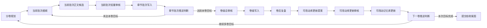

# 模块化写作一卷大循环与前端配置实施计划

## 1. 问题判断

当前模块化写作图的风险不在于“每批写几章”的数字，而在于循环控制权放错了层级。`graph.writing.modular_novel.chapter_cycle` 主要把 `unit_batch / split_policy` 挂在 `chapter_draft` 单节点上，这只能表达“正文节点可以拆批”，不能保证每一批都完整经过 `chapter_outline -> chapter_draft -> chapter_review -> memory_commit_chapter -> chapter_progress_router`。

用户要求的结构应当是：

- 一卷是创作阶段的大循环单位。
- 卷内按十章一批推进。
- 每批必须经过细纲、正文、审核、提交、路由。
- 卷完成后进入卷审、卷提交、卷后复盘、可改动库提案、审核、提交，再由续卷路由决定下一卷或交给收尾图。
- 章节数、批次大小、目标卷数、章节字数应是通用图级运行契约，不是写作任务后端私门。

## 2. 目标结构

模块化总图保持三段：

1. `design_init`：项目启动、世界观、人设、剧情、设计同步、大纲、基准库初始化。
2. `chapter_cycle`：一卷创作闭环，内部含卷规划、章节批次循环、卷审、卷提交、可改动库更新和续卷判断。
3. `finalize`：最终整编、终审、归档。

`chapter_cycle` 的内部时序改为：

## 3. 契约与运行参数

图级 `metadata.runtime_loop_policy.initial_inputs` 是运行参数的主入口：

- `target_volumes`：本次目标卷数，默认 1。
- `chapters_per_volume`：一卷章节数，默认 50。
- `chapters_per_round` / `chapter_batch_size`：每批章节数，默认 10。
- `chapter_target_words`：单章目标字数，默认 2000。
- `volume_target_words`：一卷目标字数，默认 `chapters_per_volume * chapter_target_words`。
- `target_words`：本次目标字数，默认 `target_volumes * volume_target_words`。

图级 `contract_bindings.unit_batch` 只说明单位批次契约：单位是章节、批次大小和总量来自图级运行参数。节点级 `unit_batch` 可保留为编译预览和批次生命周期视图，但不能成为唯一流程控制器。

## 4. 记忆读取顺序

写作节点读取顺序必须由边和记忆策略约束：

1. 基准库：世界观主干、大纲主干、人物事实、关系事实、剧情与伏笔主干。只读，不被章节节点改写。
2. 可改动库：卷后允许更新的策略、权重、补充大纲。只读给创作节点，只能通过 `extension_commit` 写入。
3. 产物索引：当前卷计划、已提交章节摘要、已冻结章纲、历史审核记录。
4. 问题台账：章节问题、卷级问题、未关闭阻塞。

模块化子图生成时不能只复制业务节点之间的边，必须把相关 `memory_repository / issue_ledger / artifact_index` 资源节点和它们到业务节点的 `memory_read / write_candidate / commit` 边一起保留。

## 5. 前端配置入口

在任务图对象编辑台增加图级“循环与批次”区，位置在“任务图配置”和契约绑定之间。它只编辑图本身的运行参数：

- 目标卷数。
- 每卷章节数。
- 每批章节数。
- 单章目标字数。
- 本卷目标字数。
- 本次目标字数。
- 章节批次入口、批次路由节点、卷级路由节点。

节点级“批次契约”面板继续保留，但定位为单节点 split/merge 编译预览，不作为完整章节循环的入口。

## 6. 实施步骤

1. 更新 `scripts/configure_writing_modular_novel_graph.py`：
   - 默认批次改为 10 章。
   - 引入 `target_volumes=1`、`chapters_per_volume=50`、`target_chapters=50`。
   - 章节图补齐 `chapter_progress_router`、卷审、卷提交、卷后可改动库更新和 `next_volume_router`。
   - 给章节图写入图级 `runtime_loop_policy` 和 `contract_bindings.unit_batch`。
   - 保留相关记忆仓库节点和记忆边。
2. 更新前端对象编辑台：
   - 增加图级循环与批次配置区。
   - 保存到 `metadata.runtime_loop_policy.initial_inputs`。
   - 同步更新 `contract_bindings.unit_batch` 的可视契约摘要。
3. 更新回归测试：
   - 断言章节图不再只有正文节点 split。
   - 断言章节图包含完整一卷闭环节点和 `chapter_progress_router`。
   - 断言默认每批 10 章、一卷 50 章、目标卷数 1。
   - 断言记忆资源节点和关键记忆边被保留。
   - 断言执行包能编译并暴露运行循环策略。

## 7. 验证标准

完成后必须满足：

- 编译出的模块化写作图可看到一卷内完整循环，而不是 `chapter_draft` 单点批次。
- 第一批运行边界为 1-10，下一批可推导为 11-20。
- 卷内批次完成后进入卷审，再进入卷级提交和可改动库更新。
- `target_volumes=1` 时，`next_volume_router` 完成后父图可以进入 `finalize`。
- 前端能够配置这些参数，并保存进图定义。
- 所有实现仍走通用 TaskGraph、contract_bindings、runtime_loop_policy、记忆边，不新增写作专用后端私门。
