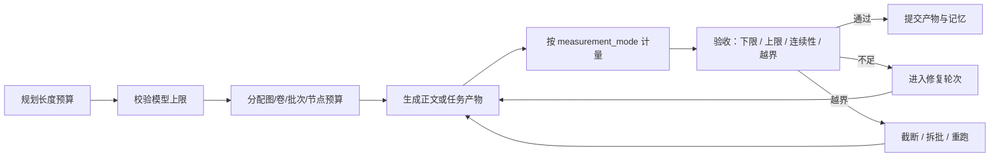

# 通用长度预算契约与章节约束编排计划

状态：已实施首版，已验证

关联计划：

- `181-Agent模型运行档案与任务图模型需求分层重构计划-20260520.md`
- `179-任务图编辑器契约化运行闭环优化计划-20260520.md`
- `198-模块化写作一卷大循环与前端配置实施计划-20260520.md`

本计划只做一件事：把“长度约束”从零散参数升级为一等契约。  
它不新增写作专用后端私门，也不把模型上限、任务目标、质量门和前端输入继续混成一团。

---

## 1. 问题定义

当前系统里，长度控制分散在四个地方：

1. 系统模型配置里的 `llm_max_output_tokens`。
2. Agent 模型运行档案里的 `max_output_tokens`、`timeout_seconds` 等。
3. 任务图运行输入里的 `target_words`、`chapter_target_words`、`volume_target_words`、`chapters_per_round`。
4. 质量门里的章节/批次计量逻辑。

这会产生三个问题：

- 模型能输出多长，不等于任务该产出多长。
- 中文场景下“字数”不能直接等同于 token。
- 图级、卷级、批次级、节点级的长度要求没有统一的源头和诊断链。

真正要修的不是“再加一个数值输入框”，而是把长度预算做成可编译、可继承、可校验、可回读的通用契约。

---

## 2. 现状证据

### 2.1 系统层已经有模型上限

`backend/config.py` 与 `backend/bootstrap/settings.py` 已经有：

- `llm_max_output_tokens`
- `llm_long_output_timeout_seconds`
- `context_budget_preset`
- provider catalog

这说明系统层负责“模型硬上限”和“上下文窗口底座”，但不负责业务目标长度。

### 2.2 模型解析层已经有分层

`backend/orchestration/model_profile_models.py` 与 `backend/orchestration/model_profile_resolver.py` 已经支持：

- `AgentModelProfile.max_output_tokens`
- `ModelRequirement.min_output_tokens`
- `ModelRequirement.preferred_output_tokens`
- provider / model / base_url / credential_ref 的解析链

这说明“模型上限”应继续留在模型运行档案与解析层，不应被任务图节点直接掌握。

### 2.3 质量门已经有文本计量基础

`backend/orchestration/runtime_loop/task_run_loop.py` 里已有：

- `_count_text_units()`
- `_quality_gate_metric_text()`
- `_sectioned_text_batch_quality_gate()`

其中 `_count_text_units()` 采用的是：

- CJK 字符计数
- Latin 单词计数

这比单纯 token 更适合中文章节产出，也正好能作为任务级“长度单位”基础。

### 2.4 前端已经有图级循环输入

`frontend/src/components/workspace/views/task-system/taskGraphRuntimeLoopConfig.ts`
和
`frontend/src/components/workspace/views/task-system/TaskGraphRootInspector.tsx`
已经能编辑：

- `target_volumes`
- `chapters_per_volume`
- `chapters_per_round`
- `chapter_target_words`
- `volume_target_words`
- `target_words`

但这些还只是初始输入，不是统一契约。

### 2.5 契约绑定已经可编译

`frontend/src/components/workspace/views/task-system/TaskGraphContractBindingInspector.tsx`
和
`backend/orchestration/runtime_loop/contract_compiler.py`
已经有 `contract_bindings.runtime` 的编译入口。

这意味着长度预算最适合落在：

- 图级 `contract_bindings.runtime.length_budget`
- 节点级 `contract_bindings.runtime.length_budget`

而不是散落在很多旧字段里。

---

## 3. 外部参考结论

成熟 API 的共同点不是“让模型自己控制长度”，而是把长度分成输入预算、输出上限、实际用量三层。

- OpenAI Responses API 的 `max_output_tokens` 是响应输出上限，返回值里也会给出 `usage.output_tokens`。[OpenAI Responses](https://platform.openai.com/docs/api-reference/responses/retrieve)
- Anthropic Messages API 用 `max_tokens` 作为输出上限，且输出 token 速率限制会按 `max_tokens` 预估，再按实际输出修正。[Anthropic Messages](https://docs.anthropic.com/en/api/messages-examples) / [Anthropic Rate Limits](https://docs.anthropic.com/en/api/rate-limits)
- Gemini API 明确提供 `countTokens`，并把输入 token、输出 token、`usage_metadata` 分开暴露。[Gemini Tokens](https://ai.google.dev/gemini-api/docs/tokens) / [Gemini countTokens](https://ai.google.dev/api/tokens)
- DeepSeek 的官方文档同样把 `max_tokens` 作为输出上限，并公开 token usage；不同模型的上限不同，不能拿单一模型值当平台真理。[DeepSeek Chat Completion](https://api-docs.deepseek.com/api/create-chat-completion) / [DeepSeek Pricing](https://api-docs.deepseek.com/quick_start/pricing/)

结论：

- 模型上限是模型层能力。
- 长度目标是任务层契约。
- 实际产出必须被测量和验收。

---

## 4. 设计方向

### 4.1 引入一等长度预算契约

建议新增一个通用契约概念：`length_budget`。

它不是写作专用字段，而是所有长任务都能用的运行契约。

建议字段：

- `budget_scope`：`graph` / `volume` / `batch` / `node`
- `measurement_mode`：`tokens` / `text_units` / `hybrid`
- `target_units`
- `min_units`
- `max_units`
- `batch_unit_count`
- `unit_kind`
- `unit_label_zh`
- `repair_policy`
- `acceptance_policy`
- `source_chain`
- `diagnostics`

### 4.2 默认计量方式

默认不直接用“词数”。

推荐默认计量方式是 `text_units`：

- CJK 字符按单位计数
- Latin 单词按单位计数

原因很简单：

- 中文章节里“词”本身不稳定。
- 现有质量门已经在做这件事。
- 这样对中文、英文、混排内容都能工作。

`tokens` 仍然保留，但它只负责模型侧预算，不负责业务长度目标。

### 4.3 预算层级

长度预算应该分四层：

1. 图级：整张任务图的总目标。
2. 卷级：一卷的目标长度。
3. 批次级：每批的目标长度。
4. 节点级：单个执行节点的最小/期望/上限。

层级关系：

- 图级是上界和总目标。
- 卷级继承图级。
- 批次级继承卷级。
- 节点级只能在图级和上层边界内收窄，不能无约束放大。

### 4.4 预算与模型上限分离

必须明确两条线：

- `max_output_tokens`：模型调用的硬上限。
- `length_budget`：任务产出的业务契约。

两者相关，但不是一回事。

例如：

- 模型可以一次生成 65536 tokens。
- 任务却只允许本批产出 10 章，每章 1200 到 2000 `text_units`。

这时任务应按业务预算验收，而不是只看模型有没有“吐够 token”。

---

## 5. 目标模型

### 5.1 契约示意

```json
{
  "contract_bindings": {
    "runtime": {
      "length_budget": {
        "budget_scope": "batch",
        "measurement_mode": "text_units",
        "unit_kind": "chapter",
        "unit_label_zh": "章节",
        "batch_unit_count": 10,
        "target_units": 18000,
        "min_units": 12000,
        "max_units": 24000,
        "repair_policy": {
          "mode": "expand_or_split",
          "max_repair_rounds": 2
        },
        "acceptance_policy": {
          "require_continuity": true,
          "require_formal_headings": true
        }
      }
    }
  }
}
```

### 5.2 编译原则

编译器需要把长度预算编成三份结果：

1. `compiled_length_budget`：可执行预算。
2. `length_budget_diagnostics`：来源、继承链、冲突、降级原因。
3. `length_budget_preview`：前端可读摘要。

### 5.3 诊断原则

诊断里必须明确：

- 预算来自哪里。
- 哪一层覆盖了哪一层。
- 目标是否超过模型上限。
- 批次目标是否超过图级预算。
- 当前产出是否低于下限。
- 这次失败是“内容不足”还是“范围越界”。

---

## 6. 运行流程



### 6.1 预算先行

在执行前先做预算预检：

- 当前节点请求的 `preferred_output_tokens` 是否超过可用模型上限。
- 当前批次的 `target_units` 是否超过图级目标。
- 当前任务是否需要 `text_units` 还是 `tokens`。

### 6.2 生成受约束

生成时只负责按预算输出，不让模型自己猜长度策略。

### 6.3 生成后验收

验收时按预算契约测量：

- 是否达到最低长度。
- 是否超过最大长度。
- 是否保持章序、批序、卷序。
- 是否出现范围污染。

### 6.4 修复策略

修复不是单点补丁，而是契约驱动：

- 长度不足：扩写、补写、补段落。
- 范围越界：拆批、重排、重跑。
- 模型上限不足：降批、降单章目标、换模型档位。

---

## 7. 前端布局

长度预算应该出现在任务图工作台里，而不是另起一套写作页面。

### 7.1 图级编辑入口

建议在 `TaskGraphRootInspector` 的“循环与批次”区域旁边增加“长度与配额”区，和现有循环配置并列。

字段建议：

- 计量方式
- 图级目标
- 卷级目标
- 批次目标
- 单节点最小/期望/上限
- 模型上限预览
- 修复轮次
- 验收模式

### 7.2 契约编辑入口

在 `TaskGraphContractBindingInspector` 的 `runtime` 分区里新增：

- `length_budget.measurement_mode`
- `length_budget.target_units`
- `length_budget.min_units`
- `length_budget.max_units`
- `length_budget.unit_kind`
- `length_budget.batch_unit_count`
- `length_budget.repair_policy`

### 7.3 发布页展示

`TaskGraphPublishRunPage` 需要显示：

- 预算摘要
- 模型上限
- 实际产出
- 预算偏差
- 是否进入修复轮次

这样用户能一眼看出：

- 目标是什么
- 跑到了哪里
- 为什么通过或失败

---

## 8. 后端落点

建议新增或调整的职责如下：

### 8.1 契约模型

新增长度预算模型与编译结果模型。

### 8.2 运行装配

`runtime_assembly_builder.py` 需要把长度预算写进运行装配与诊断。

### 8.3 质量门

`task_run_loop.py` 需要把现有批次计量逻辑升级为统一的长度预算验收器。

### 8.4 模型解析

`model_profile_resolver.py` 继续负责模型上限，但要在诊断中暴露：

- resolved max_output_tokens
- 预算冲突
- provider / model 差异

### 8.5 记忆与产物

提交时要把：

- 预算结果
- 实际计量
- 是否通过
- 失败原因

一并写入运行记录和审计线索。

---

## 9. 文件级实施清单

### 9.1 后端

- `backend/orchestration/runtime_loop/length_budget_models.py`：新增预算模型。
- `backend/orchestration/runtime_loop/length_budget_compiler.py`：新增预算编译器与诊断。
- `backend/orchestration/runtime_loop/task_run_loop.py`：接入统一长度验收。
- `backend/orchestration/runtime_loop/runtime_assembly_builder.py`：暴露预算摘要。
- `backend/orchestration/model_profile_resolver.py`：输出模型上限与预算冲突诊断。
- `backend/orchestration/model_profile_models.py`：补充预算相关需求字段，如需要。

### 9.2 前端

- `frontend/src/components/workspace/views/task-system/taskGraphRuntimeLoopConfig.ts`：增加长度预算输入映射。
- `frontend/src/components/workspace/views/task-system/TaskGraphRootInspector.tsx`：增加图级长度预算编辑区。
- `frontend/src/components/workspace/views/task-system/TaskGraphContractBindingInspector.tsx`：增加 runtime.length_budget 编辑区。
- `frontend/src/components/workspace/views/task-system/TaskGraphPublishRunPage.tsx`：增加预算摘要与验收状态展示。

### 9.3 测试

- `backend/tests/chapter_draft_quality_gate_regression.py`：扩展长度门回归。
- `backend/tests/orchestration_model_profile_regression.py`：覆盖模型上限与预算冲突。
- `frontend/src/components/workspace/views/task-system/taskGraphRuntimeLoopConfig.test.ts`：覆盖前端输入映射。
- 新增长度预算契约回归测试。

---

## 10. 验证标准

实施完成后，必须满足：

1. 图级、卷级、批次级、节点级长度要求都能在同一契约里表达。
2. 模型上限和业务长度目标被明确分离。
3. 中文文本按 `text_units` 计量，不依赖词语切分假设。
4. 质量门能识别不足、越界、断裂、污染四类问题。
5. 前端能配置、预览、继承、覆盖、回看。
6. 运行诊断能明确说明预算来源和失败原因。
7. 不新增写作专用后端私门，所有能力仍走通用任务图、契约和运行装配。

---

## 11. 风险控制

必须避免的做法：

- 把 `target_words` 当唯一真相。
- 把 `max_output_tokens` 当任务长度目标。
- 让模型自己猜该写多长。
- 直接把 API Key 放进任务图。
- 为写作任务单独分叉一套不可复用的运行逻辑。

如果后续发现某个节点需要额外能力，应通过：

- 节点契约
- Agent 模型运行档案
- 工具 / skill
- 质量门

来表达，而不是走旁路。

---

## 12. 首版实施结果

已完成：

- 新增通用长度预算编译器：`backend/orchestration/runtime_loop/length_budget_compiler.py`。
- 新增通用文本计量模块：`backend/text_metric.py`。
- 新增通用文本计量工具：`text_metric` / `op.text_metric`，用于节点通过工具能力计量文本长度。
- 图级与节点级 `contract_bindings.runtime.length_budget` 已进入运行编译、标准视图、执行包和阶段契约。
- 运行验收只在 `configured=true` 时触发长度预算，避免空预算误触发质量门。
- 节点阶段契约会从 `contract_bindings.runtime.length_budget` 读取预算，不再只依赖旧字段。
- 前端任务图工作台支持图级、节点级、图节点/时序块级长度预算配置，并增加显式启用开关。
- `tokens` / `hybrid` 计量模式保留入口，但当前会明确诊断为 `text_units` fallback，不假装已经接入真实 token meter。

同步修复：

- 只读工具在后端目录作为运行根时，会优先回退到工作区根读取显式路径，修复 `list_dir` 与 `read_structured_file` 的路径一致性。

已验证：

- `python -m pytest backend/tests/length_budget_contract_regression.py backend/tests/chapter_draft_quality_gate_regression.py backend/tests/tool_authorization_regression.py backend/tests/task_graph_registry_test.py::test_task_graph_node_model_requirement_is_contract_binding_only backend/tests/task_graph_standard_models_test.py -q`
- `python backend/tests/tool_registry_regression.py`
- `python backend/tests/base_toolset_regression.py`
- `npm test -- --run src/components/workspace/views/task-system/taskGraphRuntimeLoopConfig.test.ts`
- `npx tsc --noEmit`
- `python -m py_compile` 覆盖本次修改的后端运行、工具与契约文件。

仍需后续深化：

- 接入真实 provider token meter 后，把 `tokens` / `hybrid` 从 fallback 升级为真实 token 计量。
- 把模型上限与业务长度预算的冲突诊断进一步接入 `model_profile_resolver` 的发布前预检。
- 把长度预算的运行结果汇总进更完整的任务图健康报告与监控面板。
