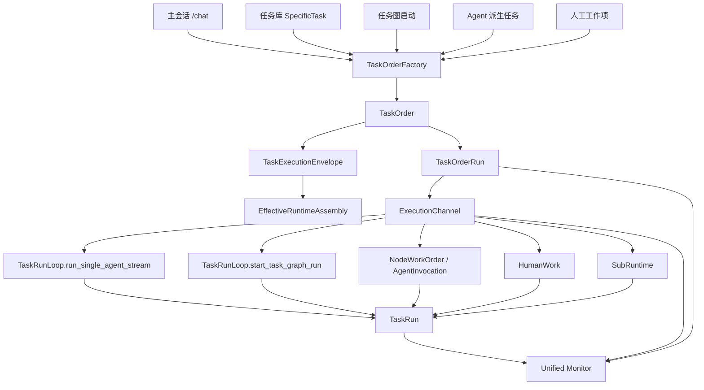

# 任务系统权威统一重构设计书

日期：2026-05-24

状态：设计书 / 待实施

## 1. 结论

本次重构的核心不是继续修 `task_selection`、Agent 模式按钮或任务图页面的局部问题，而是建立一个标准化的任务系统权威层。

目标结论：

- 任务是第一对象。
- Agent 不是任务真相源，Agent 是执行任务时被装配出的执行形态。
- 特定任务设置可以覆盖本次调用的有效角色、目标、流程、输入输出契约、工具边界、上下文包、产物策略和验收规则。
- 特定任务设置不能无记录地改写 Agent 持久配置，也不能绕过全局安全上限。
- 主会话中的纯对话属于 `ConversationTurn`，不强行任务化；但所有被接受为任务的工作契约都必须通过标准发起口进入任务系统，不允许存在野生任务入口。
- 运行层必须支持同一种执行协议下的多执行通道实例，不能把并行任务挤到同一个执行端口实例里。

推荐目标结构：

```text
ConversationTurn
  普通交互轮次。它可以解释、澄清、讨论，也可以拥有可观察的普通 AgentRun 轨迹；但不能偷偷创建后台任务、子 Agent、任务图或持久副作用。

TaskDefinition
  可复用任务定义，描述某类任务是什么。

TaskOrder
  本次用户或系统真正接受的工作契约，是任务系统的发起权威。

TaskOrderRun
  一张订单的一次运行实例，是运行监管入口。

ExecutionChannel
  一次运行的隔离执行通道，支持并行。

TaskExecutionEnvelope
  任务对本次 Agent 调用生效的运行协议。

EffectiveRuntimeAssembly
  Agent baseline + TaskExecutionEnvelope + 权限上限合成后的实际运行装配。
```

现有 `TaskRunLoop`、`TaskRun`、`AgentRun`、`CoordinationRun`、`CoordinationNodeRun`、监控和 artifact 体系可以保留为运行时骨架；需要补的是更上游的 `TaskOrderAuthority`，并把所有任务型工作入口收口到它。

## 2. 当前问题定义

### 2.1 现象

当前系统已经有三类任务相关入口：

1. 主会话入口：前端通过 `/chat` 发送消息，并携带 `task_selection`。
2. 任务库入口：普通任务通过 `setTaskSelection({ selected_task_id, domain_id, label, mode: "single_task" })` 带入主会话。
3. 任务图入口：`/orchestration/runtime-loop/task-graphs/{graph_id}/start` 直接创建任务图运行。

这些入口都能在某种程度上进入运行系统，但它们的上游语义不统一：

- 普通任务像 skill/tag，只是给主会话加了一个 `selected_task_id`。
- 任务图更像订单式，会生成 `task_run_id` 和 `coordination_run_id`。
- 主 Agent 普通请求会被包装成 `taskinst:turn:...`，但没有独立的任务订单对象。
- Agent 装配、任务选择、运行模式和任务契约在部分路径中互相覆盖，容易出现责任不清。

### 2.2 真正缺失的系统属性

缺的不是“有没有 `task_run_id`”。现有主会话和任务图都可以进入 `TaskRunLoop`。缺的是：

- 发起权威：谁有权把一次用户意图变成任务。
- 类型权威：这次任务到底是普通对话、临时任务、特定任务、任务图运行、任务图节点任务，还是 Agent 内部派生任务。
- 契约权威：目标、边界、产物、验收由谁定义。
- 执行权威：谁执行，使用什么 Agent，有哪些临时覆盖。
- 通道权威：并行任务分别在哪个隔离通道里运行。
- 监控权威：所有运行是否能统一观察、暂停、继续、审批和追踪。

### 2.3 正确终态

正确终态不是把所有交互都塞进任务系统，也不是把所有任务图节点都共享一个执行端口，而是：

```text
ConversationTurn -> 纯对话 / 澄清 / 解释
Accepted Work Contract -> TaskOrderAuthority -> TaskOrder -> TaskOrderRun -> ExecutionChannel -> TaskRunLoop / GraphRuntime / HumanGate / SubRuntime
```

主会话只是一个可见交互面，不是全局执行单例。

## 3. 现有代码依据

### 3.1 前端主会话入口

文件：`frontend/src/lib/store/runtime.ts`

`sendMessage` 在发送聊天消息时调用 `streamChat`，并把 `task_selection` 作为 payload 的一部分：

```text
streamChat({
  message,
  session_id,
  task_selection: buildMainAgentTaskSelection(state.taskSelection, state.mainAgentAssemblyMode),
  ...
})
```

这说明主会话已经具备把任务信息投递到后端的能力，但 `task_selection` 仍然是临时状态投影，不是任务系统权威对象。

### 3.2 普通任务带入主会话

文件：`frontend/src/components/workspace/views/TaskSystemView.tsx`

当前 `sendTaskToChat` 只是设置：

```text
selected_task_id
domain_id
label
mode: "single_task"
```

这条路径没有创建任务订单，没有产生 `order_id`，也没有明确输入输出契约、产物策略、验收规则和运行实例。因此它看起来更像 skill/tag 选择，而不是订单式任务发起。

### 3.3 Chat API 透传任务选择

文件：`backend/api/chat.py`

`ChatRequest` 接收：

```text
task_selection: dict[str, Any]
```

然后构造 `QueryRequest`，继续把 `task_selection` 交给 `QueryRuntime`。这说明 `/chat` 现在是任务选择投递口，但不是任务订单创建口。

### 3.4 主会话运行已经会生成 TaskRun

文件：`backend/query/runtime.py`

`QueryRuntime` 会为每轮消息生成：

```text
task_id = f"taskinst:{turn_id}:{_task_instance_suffix(task_selection)}"
```

然后调用：

```text
task_run_loop.run_single_agent_stream(...)
```

所以主 Agent 发起的任务不是完全游离在监管外。问题是它缺少 `TaskOrder` 这一层，导致任务类型、发起来源、契约和执行配置都被压缩在 `task_selection` 里。

### 3.5 任务图运行入口更接近订单式

文件：`backend/api/orchestration.py`

`/orchestration/runtime-loop/task-graphs/{graph_id}/start` 会：

- 读取 `TaskGraphDefinition`
- 编译 `TaskGraphRuntimeSpec`
- 调用 `TaskRunLoop.start_task_graph_run`
- 返回 `task_run_id`
- 返回 `coordination_run_id`

这条路径已经接近标准运行对象模型，但它绕过了统一任务订单入口。

### 3.6 运行时对象骨架已经存在

文件：`backend/runtime/shared/models.py`

已有关键运行对象：

- `TaskRun`
- `AgentRun`
- `AgentRunResult`
- `CoordinationRun`
- `CoordinationNodeRun`
- `RuntimeLoopState`

这些对象适合作为运行层权威继续保留。它们解决的是“运行中的事实”，不解决“任务发起和契约的上游事实”。

### 3.7 Agent 装配边界已有雏形

文件：`backend/runtime/agent_assembly/models.py`

已有：

- `WorkOrder`
- `DirectWorkOrder`
- `NodeWorkOrder`
- `AgentInvocation`
- `ExecutionResult`
- `NodeResultEnvelope`
- `SubRuntimeInvocationContract`

这说明项目已经在向“任务 -> work order -> agent assembly -> execution permit”的方向演进。重构不应废掉这条线，而应把它纳入标准 `TaskExecutionEnvelope`。

### 3.8 现有监控能力可以复用

文件：

- `backend/api/orchestration_runtime_loop.py`
- `backend/runtime/memory/trace_reader.py`
- `frontend/src/lib/store/runtime.ts`

现有监控已经支持：

- 全局运行监控
- 单个 `task_run_id` live monitor
- TaskGraph run monitor
- monitor decision
- approval resolve
- stop / resume

因此重构重点不是重新造监控，而是保证所有任务运行都先进入标准 `TaskOrderRun -> TaskRun` 链路，使监控可以覆盖全部任务。

## 4. 成熟架构参考原则

根据项目已有 `docs/设计原则/12-Agent-系统.md`、`docs/设计原则/14-任务系统.md`，以及 Codex / Claude Code / OpenAI Agents SDK / LangGraph 这类成熟架构的共同做法，任务管理不是“模型调用工具”的同义词，而是“被接受的工作契约进入可监管生命周期”。

参考来源：

- Codex Cloud：用户在云端环境中启动一次 task，系统为其准备隔离环境、执行、返回差异和结果。核心不是聊天轮次，而是一次可追踪的工作请求。
- Claude Code：`Task` 系统管理后台 Shell、本地/远程 Agent、workflow、dream 等异步工作；普通前台对话不是 task，后台化、子 Agent、长期运行和可停止对象才进入 task 生命周期。
- Claude Code subagents：Agent 定义负责角色、工具、权限和上下文隔离；子 Agent 运行是执行形态，不等于任务定义本身。
- OpenAI Agents SDK：Agent 是 instructions/tools/handoffs/guardrails 的配置体；`Runner.run` 产生一次 run result；handoff、guardrail、人类审批是运行流程中的结构对象。
- LangGraph：thread/checkpoint 用于持久化和恢复运行状态；interrupt 用于人类介入；图节点和状态流转是运行事实，不是聊天文本。

由此提炼出的关键原则：

1. 任务系统负责异步工作生命周期，而不是由 Agent 自己散落管理。
2. 子 Agent、后台 Shell、长期任务、任务图节点、人工工作项需要统一生命周期状态。
3. Agent 上下文默认隔离，必要资源显式共享。
4. 任务完成通知必须先保证状态转换，再做结果丰富化。
5. 权限边界和工具边界必须由结构执行，不靠 prompt 暗示。
6. 主 Agent 可以发起任务，但发起后必须纳入任务系统监管。
7. 普通前台 run 可以使用工具，但只要没有形成可监管工作契约，就不应伪装成任务订单。

成熟架构对照：

```text
Codex Cloud
  任务边界：用户提交给云环境的一次工作请求。
  可借鉴：任务需要隔离环境、结果投影、可审计执行记录。
  不直接照搬：本项目还有主会话、任务库、任务图节点和人工工作，不能只有“云任务”一种粒度。

Claude Code Task System
  任务边界：后台 Shell、本地/远程 Agent、workflow、dream、可停止的异步工作。
  可借鉴：任务是生命周期对象，状态先转换，通知后丰富化；子 Agent/后台进程必须注册到根任务系统。
  不直接照搬：Claude Code 的 Task 更偏运行态，本项目还需要上游 TaskOrder 表达业务契约。

Claude Code Subagents
  任务边界：子 Agent 是执行者，不是任务本身。
  可借鉴：Agent definition 管角色/工具/权限/隔离；任务调用只生成 effective runtime，不写回 Agent profile。
  不直接照搬：不能把 subagent_type 或 Agent mode 当任务类型。

OpenAI Agents SDK
  任务边界：Agent 配置、run、handoff、guardrail、人类介入是不同结构。
  可借鉴：任务契约、执行 run、交接、审批、校验要分层。
  不直接照搬：SDK 的 run 不天然等于业务任务订单，本项目需要额外订单层。

LangGraph
  任务边界：图运行、节点、thread/checkpoint/interrupt 共同表达可恢复流程。
  可借鉴：恢复、人工中断和节点状态是运行事实，必须结构化。
  不直接照搬：图节点不是唯一任务来源，普通任务库和主会话临时任务也要进入同一权威。
```

这些原则落到本项目，就是：

```text
TaskOrder 是发起事实。
TaskRun 是运行事实。
ExecutionChannel 是并行隔离事实。
AgentAssembly 是执行形态事实。
Monitor 是观察事实。
```

每一层只能投影上一层，不能反向篡改上一层真相。

### 4.0 本项目对“任务”的正式定义

本项目中的任务不是“用户说了一句话”，也不是“Agent 调用了工具”。任务应定义为：

```text
Task =
  一个已被用户、系统调度器或上级 Agent 接受的工作契约；
  它有明确目标、对象、输入边界、完成条件；
  它需要被生命周期系统监管；
  它可以被启动、暂停、恢复、取消、重试、审批、观察和审计。
```

必要条件：

- 有发起者：用户、任务库、任务图调度器、Agent、系统计划器或人工 gate。
- 有任务对象：文件、页面、数据、业务实体、图节点、外部系统对象或人工工作项。
- 有目标或交付物：要产生回答、改动、报告、产物、决策、节点结果或人工提交。
- 有边界：输入、上下文、工具权限、责任范围、验收条件至少能被部分结构化。
- 有生命周期价值：需要监控、暂停、恢复、取消、重试、审批、并行隔离、产物追踪或审计中的至少一项。

充分触发条件：

- 任务库中的任务被明确运行或确认执行。
- 任务图 root 被启动。
- 任务图节点被调度执行。
- Agent 派生后台 worker、subruntime、长期运行或并行工作单元。
- 用户明确委托系统完成并交付结果，且包含项目状态改变、外部副作用、产物写入、验证闭环或可恢复运行。
- 人工工作项被创建，或者人工接管某个 run/channel。

明确不是任务的情况：

- 普通问答、解释、澄清、方案讨论。
- 只是在 UI 中选择任务域、任务标签、Agent mode、历史运行或预览任务图。
- 前台回答中的只读检索、代码阅读、状态查询，且不产生持久副作用、不进入后台、不生成需要验收的交付物。
- 模型基于上下文猜测“用户可能要做任务”，但无法抽取目标、对象、交付/验收和执行动作。

这个定义的工程含义：

- `ConversationTurn` 可以有观察性 `AgentRun`，用于记录前台回答如何产生。
- `TaskOrder` 只表达已接受的工作契约。
- `TaskOrderRun` 才表达一次可监管运行。
- `TaskExecutionEnvelope` 才表达本次任务如何覆盖 Agent 的有效角色和执行协议。

### 4.1 成熟 Agent 范式的强不变量

参考 Claude Code / Codex 这类成熟 agent 的运行范式，任务系统不应把所有聊天轮次都任务化，也不应把所有工具调用都订单化；它必须覆盖所有被接受为任务的工作契约。核心边界如下：

```text
ConversationTurn != TaskOrder
TaskOrder != TaskRun
TaskRun != AgentRun
AgentRun != AgentProfile
CoordinationRun != CoordinationNodeRun
Approval != HumanWork != Takeover
ExecutionProtocol != ExecutionChannel instance
```

解释：

- `ConversationTurn` 是普通对话轮次。它可以回答、解释、澄清和讨论，也可以在前台 run 中使用只读工具形成回答证据；如果它形成明确交付物、持久副作用、后台生命周期、子 Agent/任务图派生、审批/人工工作或可恢复运行，就必须升级为 `TaskOrder`。
- `TaskOrder` 是工作订单，表达“要做什么”。它不是一次运行记录。
- `TaskRun` 是运行实例，表达“这次怎么跑、跑到哪里、结果如何”。一个 `TaskOrder` 可以有多个 `TaskRun`，例如重试、恢复、改 executor 后再跑。
- `AgentRun` 是某个 Agent 在某次运行中的执行实例。它不是任务本身，也不是 Agent 持久身份。
- `AgentProfile` 是持久配置。任务可以覆盖本次 effective role，但不能写回 profile。
- `CoordinationRun` 是任务图编排父对象。并行节点是子工作单元，必须具备独立的 node run / order run / channel 归属。
- `Approval` 是批准或拒绝继续，`HumanWork` 是人作为执行者完成工作，`Takeover` 是人接管某个 run/channel 并改变后续 executor assignment。三者不能混成一个“人工替换 Agent”。
- `ExecutionProtocol` 是统一执行协议，`ExecutionChannel` 是协议的一次隔离通道实例。并行任务共享协议，不共享 channel 实例。

由此得到实施判断标准：

```text
只解释 / 闲聊 / 轻量问答
-> ConversationTurn

形成被接受的工作契约：明确目标 + 任务对象 + 交付/验收或副作用 + 需要生命周期监管
-> TaskOrder
```

任何实现如果让 `ConversationTurn` 私下创建后台任务、子 Agent、任务图、持久写入或人工 gate，就是野生任务入口。

### 4.2 聊天与任务的边界，以及可靠任务信号

任务和聊天必须用可审计信号区分，不能只靠模型自由判断。推荐把信号分为三类：

```text
Hard Signal
  结构化强信号。它来自明确 UI/API/运行时动作，可以直接创建或推进 TaskOrder。

Contract Signal
  契约信号。它来自用户自然语言或上游调度，必须能抽取出发起者、目标、对象、交付/验收、执行边界。

Weak Signal
  弱信号。它只能辅助判断，不能单独创建 TaskOrder。
```

Hard Signal 包括：

- 用户点击任务库中的“运行 / 发送到主会话执行 / 确认执行”。
- 用户启动任务图。
- 调度器派发任务图节点。
- Agent 发起 worker spawn / subruntime task。
- 人工 gate 创建 human work 或 approval。
- API 明确调用 `POST /tasks/orders`。
- 已存在 `order_id/run_id/execution_channel_id` 的 stop / resume / approval / retry 操作。

Hard Signal 必须是明确执行动作。单纯打开任务页、选中任务定义、切换 Agent 模式、预览任务图、查看历史运行、把任务放入输入框，都不算 hard signal。

Contract Signal 包括：

- 发起者明确：用户、任务库、任务图调度器、Agent、系统计划器或人工 gate。
- 任务对象明确：文件、页面、数据、业务实体、任务图节点、外部系统对象或人工工作项。
- 目标明确：修改、实现、创建、删除、迁移、运行、测试、检查并修复、生成文件或产物。
- 交付或验收明确：报告、代码改动、artifact、节点结果、人工提交、验证结果或允许进入下一阶段的裁决。
- 生命周期价值明确：后台、持续监控、可恢复、并行隔离、审批、人工工作、重试、取消或审计。
- 执行委托明确：用户要求“开始执行 / 帮我做 / 修掉 / 跑完并给结果”。

Weak Signal 包括：

- 仅选中了某个任务标签、任务域、Agent 模式或历史 `task_selection`。
- 用户只是问“怎么看”“能不能”“应该怎么设计”“我们讨论一下”。
- 用户提到某个任务名、Agent 名、页面名，但没有明确要求执行。
- 模型从上下文推测用户“可能想做任务”，但不能给出目标、输入、输出和执行动作。

升级规则：

```text
Hard Signal
-> 可以创建或推进 TaskOrder，但仍必须绑定任务对象和执行边界。

Contract Signal + 可抽取的发起者/目标/对象/交付或验收/生命周期价值
-> 可以从 ConversationTurn 升级为 TaskOrder。

Weak Signal only
-> 只能保持 ConversationTurn，最多生成 TaskOrderDraft，不允许执行。

Ambiguous Signal
-> 先澄清，不创建 TaskOrderRun。
```

判定流程应固定为：

```text
ConversationTurn
-> collect structural signals
-> collect contract signals
-> evaluate lifecycle needs
-> classify as chat_turn / task_order_draft / executable_task
-> if executable_task: TaskOrderFactory.create(...)
-> if task_order_draft: ask clarification or wait explicit user action
-> if chat_turn: normal conversation only
```

任务信号必须真实可靠，落地时需要保存 `TaskIntentDecision`：

```text
decision_id
turn_id
decision = chat_turn | task_order_draft | executable_task
confidence
hard_signals[]
contract_signals[]
weak_signals[]
evidence_spans[]
missing_fields[]
lifecycle_needs[]
created_order_id
reason
authority = "task_system.intent_decision"
```

关键约束：

- `task_selection`、Agent mode、当前页面、上一次任务状态都只是上下文投影，不能单独作为任务真相。
- 模型分类结果必须带 evidence spans 和 missing fields；没有证据的分类不能创建 `TaskOrderRun`。
- `confidence` 不能单独作为升级依据。没有 hard signal 时，必须同时具备发起者、目标、对象、交付/验收、生命周期价值中的可验证字段。
- 一旦创建 `TaskOrder`，后续执行只看 `TaskOrder` / `TaskOrderRun` / `ExecutionChannel`，不再回头读取聊天 UI 的临时状态当真相源。
- 如果任务信号不足但用户意图可能是任务，应停在 `TaskOrderDraft`，由 UI 提示用户补齐输入、选择任务定义或确认执行。
- 普通前台回答所需的只读检索可以属于 `ConversationTurn` 的 `AgentRun` 轨迹；文件修改、持久写入、后台运行、任务图启动、worker spawn、人工 gate 发生前，必须已经存在可审计的 `TaskOrderRun`。

## 5. 目标对象模型

### 5.0 ConversationTurn

`ConversationTurn` 是主会话的普通交互轮次，不代表任务订单。

建议字段：

```text
turn_id
session_id
user_message_ref
assistant_message_ref
interaction_kind
created_at
status
task_order_ref
metadata
authority = "conversation.turn"
```

规则：

- 纯解释、澄清、讨论可以只保留 `ConversationTurn`。
- 如果本轮升级成任务型工作契约，`task_order_ref` 必须指向对应 `TaskOrder`。
- `ConversationTurn` 可以拥有前台回答的 `AgentRun` 观察轨迹，但不能独立拥有后台运行、子 Agent 派生、任务图、持久产物写入和审批状态；这些必须归入 `TaskOrderRun`。

任务信号不足时，不应直接创建订单，而应停在 `TaskOrderDraft`：

```text
draft_id
turn_id
candidate_order_kind
candidate_task_id
candidate_domain_id
known_inputs
missing_inputs
weak_signals
contract_signals
lifecycle_needs
required_confirmation
expires_at
status
metadata
authority = "task_system.task_order_draft"
```

`TaskOrderDraft` 不是执行对象：

- 不能绑定 `ExecutionChannel`。
- 不能触发持久副作用、后台执行、子 Agent 派生或任务图执行。
- 不能进入后台运行。
- 不能创建 `AgentRun`。
- 只能被用户确认、补齐输入、取消或升级为 `TaskOrder`。

### 5.1 TaskDefinition

`TaskDefinition` 是可复用任务定义，不代表某一次运行。

建议字段：

```text
task_id
domain_id
title
description
task_kind
input_contract_id
output_contract_id
default_workflow_id
default_flow_contract_id
default_executor_policy
artifact_policy
acceptance_policy
role_contract
responsibility_boundary
enabled
metadata
```

现有 `SpecificTaskRecord` 可以演进为 `TaskDefinition` 或作为其子类型：

```text
SpecificTaskDefinition extends TaskDefinition
```

### 5.2 TaskOrder

`TaskOrder` 是本次任务的订单，是任务系统发起权威。

建议字段：

```text
order_id
order_kind
source
source_ref
session_id
created_by
created_at
task_id
domain_id
title
objective
user_request
input_payload
contract_refs
acceptance_refs
artifact_policy
executor_policy
priority
status
metadata
authority = "task_system.task_order"
```

`order_kind` 建议固定为：

```text
ad_hoc_task
specific_task
graph_run
graph_node_task
agent_spawn_task
human_work
subruntime_task
```

其中：

- `ad_hoc_task`：主会话中由用户临时发起的明确目标任务。
- `specific_task`：来自任务库的标准任务。
- `graph_run`：整张任务图运行。
- `graph_node_task`：任务图节点的具体任务。
- `agent_spawn_task`：Agent 在执行中派生的子任务。
- `human_work`：人工处理项。
- `subruntime_task`：图模块或子运行时任务。

`chat_turn` 不属于 `TaskOrder.order_kind`。纯对话由 `ConversationTurn` 表示；只有当某个会话轮次升级为任务型工作契约时，才创建 `TaskOrder`，并通过 `source="conversation_turn"` 与 `source_ref="conversation.turn:<turn_id>"` 关联回原始会话轮次。

订单来源必须可审计。推荐 `source_ref` 格式：

```text
conversation.turn:<turn_id>
task_definition:<task_id>
task_graph:<graph_id>
coordination_node:<coordination_run_id>:<node_id>
agent_run:<agent_run_id>
human_gate:<gate_id>
```

订单创建必须支持幂等。推荐规则：

```text
idempotency_key =
  source
  + source_ref
  + task_id
  + normalized_input_hash
  + parent_run_id
```

幂等和重试规则：

- 同一个任务库任务在同一来源下重复点击执行，默认复用同一个 `TaskOrder`，但创建新的 `TaskOrderRun`；如果用户明确选择“新建任务订单”，才创建新 `TaskOrder`。
- 主会话临时任务由 `ConversationTurn` 升级而来时，一个被接受的工作契约对应一个 `TaskOrder`；同一 turn 的恢复或重试不能生成第二个订单。
- 整张任务图每次启动都创建新的 `graph_run` 订单，因为一次图运行就是一次新的协调事实。
- 任务图节点重试不改写原节点运行结果，而是创建新的 `TaskOrderRun`，并记录 `supersedes_run_id` 或 `retry_of_run_id`。
- Agent 派生任务必须带 `parent_run_id` 和 `parent_agent_run_id`，否则不能进入执行。

### 5.3 TaskOrderRun

`TaskOrderRun` 是订单的一次运行实例。

建议字段：

```text
run_id
order_id
task_run_id
execution_channel_id
session_id
status
started_at
completed_at
root_coordination_run_id
parent_run_id
parent_node_run_id
executor_assignment_ref
runtime_lane
monitor_ref
latest_event_offset
terminal_reason
metadata
authority = "task_system.task_order_run"
```

建议补充字段：

```text
attempt_no
retry_of_run_id
supersedes_run_id
resume_attempt
created_from_checkpoint_id
```

注意：现有 `TaskRun` 不必被替换。`TaskOrderRun` 应绑定现有 `TaskRun`：

```text
TaskOrderRun.task_run_id -> orchestration.task_run.task_run_id
```

对象关系必须固定：

```text
TaskOrder 1 -> N TaskOrderRun
TaskOrderRun 1 -> 1 primary TaskRun
TaskOrderRun 1 -> N AgentRun
TaskOrderRun 1 -> 1 primary ExecutionChannel
TaskOrderRun 0/1 -> 1 CoordinationRun
CoordinationRun 1 -> N CoordinationNodeRun
CoordinationNodeRun 1 -> 1 graph_node_task TaskOrderRun
```

重试与恢复规则：

- 重试创建新的 `TaskOrderRun`，不覆盖旧 run 的事件、产物和终态。
- 从 checkpoint 原地恢复可以保留同一个 `TaskOrderRun`，但必须记录 `resume_attempt` 事件，并绑定 `created_from_checkpoint_id`。
- 修改 executor assignment 后再执行，必须创建新的 `TaskOrderRun`，因为实际执行者已经改变。
- cancellation / failed / completed 是终态；终态 run 不能重新进入 running，只能通过新 run 表达再次执行。
- 一个 `TaskOrderRun` 可以产生多个 `AgentRun`，例如主 Agent 调用、worker spawn、reviewer run；但它只能有一个 primary `TaskRun` 作为监控主索引。

### 5.4 ExecutionChannel

`ExecutionChannel` 是隔离执行通道，不是协议本身。

建议字段：

```text
execution_channel_id
run_id
channel_kind
session_id
parent_channel_id
isolation_scope
context_scope
memory_scope
artifact_scope
stream_binding
cancellation_token_ref
checkpoint_scope
status
metadata
authority = "task_system.execution_channel"
```

关键原则：

```text
同一种执行协议，多通道实例。
一个 TaskOrderRun 至少一个 ExecutionChannel。
并行图节点必须分别拥有 ExecutionChannel。
```

状态机建议固定为：

```text
created
-> running
-> waiting_approval
-> paused
-> completed / failed / cancelled
```

状态映射：

```text
ExecutionChannel.status -> TaskOrderRun.status
TaskOrderRun.status -> TaskRun.status
TaskOrderRun.status -> CoordinationRun.status / CoordinationNodeRun.status
```

通道必须拥有这些运行资源的归属权：

- cancellation token
- stream binding
- artifact scope
- memory scope
- checkpoint scope
- event cursor
- approval gate binding

通道隔离规则：

- 并行节点可以共享同一个 `ExecutionProtocol`、同一个 root `CoordinationRun` 和同一个图级契约，但不能共享同一个 `ExecutionChannel` 实例。
- stop / resume / approval 必须指向具体 `run_id` 或 `execution_channel_id`，不能只指向 `task_id` 或 `agent_id`。
- 通道结束不等于订单结束；订单是否结束由它的所有 required run / node / approval 状态共同决定。
- channel 内部可以绑定多个底层 stream，但外部监控只消费 channel projection，不直接依赖某个 SSE 连接是否存活。

### 5.5 TaskExecutionEnvelope

`TaskExecutionEnvelope` 是特定任务对本次运行的有效协议。

它不改写 Agent 持久配置，只覆盖本次调用的有效任务协议。

建议字段：

```text
envelope_id
order_id
run_id
task_id
role_contract
responsibility_boundary
objective
input_contract
output_contract
workflow
flow_contract
context_package
tool_policy
permission_policy
artifact_policy
acceptance_policy
memory_policy
stream_policy
executor_policy
metadata
authority = "task_system.task_execution_envelope"
```

### 5.6 EffectiveRuntimeAssembly

`EffectiveRuntimeAssembly` 是运行时最终装配结果。

合成来源：

```text
System Safety Ceiling
> TaskExecutionEnvelope
> Task Invocation Role
> Agent Baseline
> User Turn Supplement
```

建议字段：

```text
assembly_id
run_id
execution_channel_id
base_agent_id
base_agent_profile_id
effective_role_prompt
effective_responsibility_boundary
effective_tools
effective_permissions
effective_context
effective_workflow
effective_validation
effective_artifact_policy
source_refs
metadata
authority = "runtime.effective_runtime_assembly"
```

这层应和现有 `runtime.agent_assembly` 对齐，不应另起一套无关结构。

## 6. Agent 与特定任务的覆盖关系

### 6.1 正确表述

特定任务不是替换 Agent，而是覆盖 Agent 本次调用的任务协议。

应区分：

```text
Agent Baseline Role
  持久身份。这个 Agent 默认是谁、默认工具纪律、默认记忆边界、默认交互风格。

Task Invocation Role
  本次任务角色。这个任务要求它临时扮演什么专业角色、负责什么、不负责什么、如何裁决。
```

特定任务可以覆盖 `Task Invocation Role`，不能写回 `Agent Baseline Role`。

### 6.2 可以由特定任务覆盖的部分

以下应由任务优先：

- 本次任务目标
- 本次有效角色
- 职责边界
- 输入契约
- 输出契约
- 工作流
- 流程契约
- 工具可见性
- 权限收紧策略
- 上下文包
- 产物策略
- 验收规则
- evidence 要求
- 是否允许 worker spawn
- 是否需要人工 gate
- stream / monitor 策略

示例：

```text
你是一名世界观审核员。
你只负责评审当前世界观设定是否完整、一致、可支撑后续写作。
你不负责替创作者扩写设定。
你需要指出问题、给出裁决、说明是否允许进入下一阶段。
```

这是 `Task Invocation Role`，不是开发说明，也不是 Agent 持久配置。

### 6.3 不应由特定任务直接改写的部分

以下不能被任务定义无记录地改写：

- Agent registry 中的持久 `agent_id`
- Agent registry 中的持久 `agent_profile_id`
- Agent baseline prompt
- 全局安全上限
- 全局权限 deny
- 运行通道 ID
- checkpoint / event log / monitor 的所有权

如果任务确实指定执行者，必须记录为：

```text
executor_policy
executor_assignment
agent_invocation
```

而不是悄悄替换主 Agent 身份。

### 6.4 覆盖优先级

推荐优先级：

```text
Global Safety Ceiling
> Task Contract / TaskExecutionEnvelope
> Node Runtime Assembly
> Explicit Executor Assignment
> Agent Baseline
> User Natural Language Supplement
```

含义：

- 用户补充不能突破任务契约。
- Agent baseline 不能压过特定任务角色。
- 节点 runtime assembly 不能突破图/任务契约。
- executor assignment 可以决定谁执行，但不能重定义任务是什么。
- 全局 safety ceiling 永远最高。

### 6.5 人工介入三分法

人工介入不能笼统写成“人工替换 Agent”。成熟 agent 运行中至少要区分三种对象：

```text
Approval
  人只批准、拒绝或要求补充信息。它改变的是运行是否继续，不改变 executor assignment。

HumanWork
  人作为执行者完成某个任务或节点。它本身就是一种 executor，需要有 TaskOrder / TaskOrderRun / ExecutionChannel。

Takeover
  人接管某个正在运行或待恢复的 run/channel，并改变后续 executor assignment。它必须记录接管原因、接管范围和接管后的执行者。
```

三者边界：

- `Approval` 不能产出任务结果，只能产出决策事件，例如 approve / reject / request_changes。
- `HumanWork` 可以产出任务结果，必须进入产物、验收和监控体系。
- `Takeover` 不等于任务完成；它只是改变后续执行归属。接管后继续执行时应创建新的 `TaskOrderRun`，或在 checkpoint resume 场景中记录明确的 takeover event。
- 人工修改 Agent 本次提示词、工具、上下文时，应被表达为本次 `TaskExecutionEnvelope` 或 `EffectiveRuntimeAssembly` 的变更记录，不应写回 `AgentProfile`。
- 如果人工只补充输入材料，应记录为 `input_payload` / `context_package` 的追加版本，不应伪装成 Agent 自主产出。

推荐事件：

```text
approval_requested
approval_resolved
human_work_order_created
human_work_submitted
human_work_accepted
takeover_requested
takeover_applied
executor_assignment_changed
```

## 7. 发起口统一设计

### 7.1 不允许的野生入口

以下路径都不应直接启动执行：

- 前端直接设置 `taskSelection` 后让 `/chat` 自行理解。
- 前端只因用户选中 Agent mode、任务域、任务标签或历史任务上下文就启动执行。
- 任务图 start API 直接创建运行而不创建订单。
- Agent 内部 worker spawn 直接创建 `AgentRun` 而不登记派生任务。
- 人工 gate 直接改 coordination state 而不记录 human work order。
- 测试系统、健康系统、专业运行页绕过统一任务订单。

### 7.2 标准发起口

建议新增任务发起 API：

```text
POST /tasks/orders
POST /tasks/orders/{order_id}/runs
POST /tasks/runs/{run_id}/execute
GET  /tasks/orders/{order_id}
GET  /tasks/runs/{run_id}
GET  /tasks/runs/{run_id}/monitor
POST /tasks/runs/{run_id}/stop
POST /tasks/runs/{run_id}/resume
POST /tasks/runs/{run_id}/approval
```

实现上可先由后端内部 service 提供，API 后补。但结构上必须以此为权威。

### 7.2.1 入口清单与 cutover 删除规则

所有入口必须在 cutover 后归一到下表：

```text
/chat
  只负责 ConversationTurn 和 TaskIntentDecision。
  纯聊天保持 ConversationTurn。
  被接受的任务型工作必须创建 TaskOrder。

任务库运行 / 发送到主会话
  必须创建 specific_task TaskOrder。
  不允许只写 selected_task_id。

任务图启动
  必须创建 graph_run TaskOrder。
  原 orchestration start API 只能作为 facade。

任务图节点调度
  必须创建 graph_node_task TaskOrderRun 和独立 ExecutionChannel。
  不允许 scheduler 直接调用 AgentRun。

Agent worker spawn / subruntime
  必须创建 agent_spawn_task 或 subruntime_task TaskOrder。
  不允许 Agent 层自行登记孤立 AgentRun。

人工审批 / 人工工作 / 接管
  必须进入 Approval / HumanWork / Takeover 三分法。
  不允许直接改 coordination state 后补说明。

健康检查 / 测试页 / 专业运行页
  只能作为 facade 或迁移到标准 orders/runs API。
  不允许维护独立执行真相。
```

cutover 后必须删除：

- 只靠 `task_selection` 触发执行的分支。
- 只靠 Agent mode 决定任务类型的分支。
- 不生成 `TaskIntentDecision` 的 `/chat` 任务升级分支。
- 不生成 `TaskOrderRun` 的 graph node 执行分支。
- 不绑定 `ExecutionChannel` 的后台任务和 worker spawn 分支。
- shadow 期间只用于兼容旧入口的测试文件。

### 7.3 主会话入口规则

`/chat` 可以保留为用户交互入口，但后端处理顺序应改为：

```text
ChatRequest
-> TaskIntentClassifier / ModelTurnDecision
-> TaskIntentDecision
-> TaskOrderFactory
-> if chat_turn: 走普通回答链路
-> if task_order_draft: 返回澄清 / 确认请求，不执行
-> if ad_hoc_task: 创建 TaskOrder + TaskOrderRun
-> if specific_task selection: 创建 specific_task TaskOrder + TaskOrderRun
-> execute run
-> 将 run projection 返回主会话 UI
```

关键点：

- `/chat` 不再直接消费 `task_selection` 作为真相源。
- `task_selection` 只能作为 `TaskOrderDraft` 的输入之一。
- 一旦判断为任务，必须有 `order_id` 和 `run_id`。
- 如果只有弱信号或缺少发起者、目标、对象、交付/验收、生命周期价值中的关键字段，必须停在 `TaskOrderDraft`。
- 文件修改、持久写入、后台执行、任务图启动和 worker spawn 发生前，必须已经保存 `TaskIntentDecision` 与 `TaskOrderRun`。

### 7.4 任务库入口规则

当前“发送到主会话”应改为：

```text
SpecificTaskRecord
-> Create TaskOrder(order_kind="specific_task", task_id=selected_task_id)
-> Compile TaskExecutionEnvelope
-> Open chat surface with order/run projection
```

前端可继续显示“已将任务带入主会话”，但内部不应只设置 `selected_task_id`。

### 7.5 任务图入口规则

当前：

```text
POST /orchestration/runtime-loop/task-graphs/{graph_id}/start
```

目标：

```text
Create TaskOrder(order_kind="graph_run", graph_id)
-> Create TaskOrderRun
-> TaskRunLoop.start_task_graph_run(...)
```

原 API 可以短期保留，但必须内部代理到 `TaskOrderAuthority`，不能成为独立真相源。

### 7.6 图节点入口规则

每个实际执行的图节点应成为：

```text
TaskOrder(order_kind="graph_node_task")
TaskOrderRun
ExecutionChannel
NodeWorkOrder
AgentInvocation / HumanWork / SubRuntimeInvocation
```

图节点可以共享 root `CoordinationRun`，但不能共享同一个执行通道实例。

### 7.7 Agent 派生任务入口规则

主 Agent 或子 Agent 派生任务时：

```text
AgentSpawnRequest
-> TaskOrder(order_kind="agent_spawn_task", parent_run_id, parent_agent_run_id)
-> TaskOrderRun
-> ExecutionChannel
-> AgentRun
```

这样 worker agent 的工作也能被任务系统监管，而不是只在 Agent 层出现。

## 8. 固定执行流

### 8.1 普通对话

```text
UserMessage
-> TaskIntentClassifier
-> chat_turn
-> 不创建 TaskOrderRun 或创建轻量 ChatTurnRecord
-> MainAgent answers
```

普通对话不应被过度任务化。

判定条件：

- 没有被接受的任务型工作契约
- 没有明确交付物
- 没有需要追踪的长期运行
- 没有持久写入、外部系统副作用、子 Agent 派生、任务图启动或人工 gate

说明：

- 普通对话可以为了回答问题进行前台只读检索或观察性工具调用。
- 这类前台 run 应可观察，但不应伪装成 `TaskOrder`。
- 一旦用户要求“执行完成并交付结果”，或系统需要后台/恢复/审批/产物生命周期，就必须升级为任务。

### 8.2 主会话临时任务

```text
UserMessage
-> TaskIntentClassifier
-> TaskOrder(order_kind="ad_hoc_task")
-> TaskExecutionEnvelope from ModelTurnDecision
-> TaskOrderRun
-> ExecutionChannel
-> TaskRunLoop.run_single_agent_stream
-> Monitor / Artifact / Final
```

临时任务必须有 `order_id`，即使没有预定义 `task_id`。

### 8.3 任务库特定任务

```text
TaskDefinition(task_id)
-> TaskOrder(order_kind="specific_task", task_id)
-> Compile TaskExecutionEnvelope from TaskDefinition
-> EffectiveRuntimeAssembly
-> TaskOrderRun
-> ExecutionChannel
-> TaskRunLoop
```

本次有效角色由任务的 `role_contract` 生成，Agent 持久配置不变。

### 8.4 任务图运行

```text
TaskGraphDefinition(graph_id)
-> TaskOrder(order_kind="graph_run")
-> TaskOrderRun(root)
-> ExecutionChannel(root)
-> TaskRunLoop.start_task_graph_run
-> CoordinationRun
-> Scheduler
```

### 8.5 任务图节点执行

```text
CoordinationRun Scheduler
-> NodeExecutionRequest
-> TaskOrder(order_kind="graph_node_task")
-> TaskOrderRun(node)
-> ExecutionChannel(node)
-> NodeWorkOrder
-> EffectiveRuntimeAssembly
-> execute agent/human/subruntime
-> NodeResultEnvelope
-> resume CoordinationRun
```

并行节点：

```text
node_A -> channel_A -> task_run_A
node_B -> channel_B -> task_run_B
```

协议相同，通道不同。

## 9. 监控与可观察性

### 9.1 统一监控索引

应建立 `TaskOrderRunRegistry` 或扩展现有 `RuntimeStateIndex`，使以下查询稳定：

```text
list task orders
list task order runs
get run by order_id
get run by task_run_id
get child runs by parent_run_id
get graph node runs by coordination_run_id
get execution channel by run_id
```

索引必须覆盖聊天升级链路：

```text
get turn by order_id
get intent decision by turn_id
get draft by turn_id
get order by conversation_turn_id
get active run by session_id
```

前端刷新后必须能根据 `order_id/run_id/execution_channel_id` 恢复当前选中对象，而不是依赖内存中的 `taskSelection` 或 Agent mode。

### 9.2 事件规范

所有任务运行至少要有：

```text
task_intent_decision_created
task_order_draft_created
task_order_draft_confirmed
task_order_created
task_order_run_created
execution_channel_created
task_execution_envelope_compiled
effective_runtime_assembly_compiled
task_run_started
task_run_progress
task_run_waiting_approval
task_run_completed
task_run_failed
task_run_aborted
```

图节点还要有：

```text
graph_node_order_created
graph_node_channel_started
graph_node_result_ready
graph_node_result_committed
```

恢复与接管还要有：

```text
checkpoint_created
resume_attempt_started
resume_attempt_completed
takeover_requested
takeover_applied
executor_assignment_changed
```

### 9.3 前端观察面

前端不要把任务管理、Agent 管理、运行监控混成一页。建议层级：

```text
任务系统
  任务域
  任务定义
  任务订单
  任务图
  运行管理
  资源权威
  编排资源
```

其中“任务订单”应成为新主对象页，显示：

- order_id
- order_kind
- source
- task_id
- objective
- run status
- executor
- channel
- artifact
- monitor
- originating turn / intent decision
- task signal evidence

聊天页面只显示任务投影：

- 当前 turn 是否为纯聊天、草稿任务或已执行任务。
- 若为任务，显示 `order_id/run_id/channel_id`。
- 若为草稿，显示缺失字段和确认入口。
- 不允许聊天页面用本地 Agent mode 或 taskSelection 伪造运行状态。

### 9.4 存储与恢复规则

订单、运行和通道不能只存在内存中。最小持久化要求：

- `ConversationTurn`、`TaskIntentDecision`、`TaskOrderDraft`、`TaskOrder`、`TaskOrderRun`、`ExecutionChannel` 必须可恢复。
- 后端重启后，运行监控可以从 registry / event log 恢复 order/run/channel 关系。
- 前端刷新后，当前任务面板根据 `run_id` 恢复，而不是根据最后一次 `task_selection` 猜测。
- stop / resume / approval / retry 必须保持原 `order_id` 关系。
- shadow 阶段发现没有 `TaskOrder` 的旧 `TaskRun`，只能显示为 legacy projection，并在 cleanup 阶段清理或迁移；不能把 legacy 结构继续当新真相源。
- 若事件日志和 registry 不一致，以 registry 的 order/run/channel 归属为主，事件日志作为可审计时间线；修复工具必须显式记录 reconcile event。

## 10. 文件级实施计划

### 10.1 新增后端模块

建议新增：

```text
backend/task_system/orders/models.py
backend/task_system/orders/intent_decision.py
backend/task_system/orders/order_draft.py
backend/task_system/orders/order_factory.py
backend/task_system/orders/order_registry.py
backend/task_system/orders/run_registry.py
backend/task_system/orders/execution_channel.py
backend/task_system/orders/envelope_compiler.py
backend/task_system/orders/effective_assembly.py
backend/task_system/orders/api_models.py
```

职责：

- `models.py`：定义 `ConversationTurn`、`TaskIntentDecision`、`TaskOrderDraft`、`TaskOrder`、`TaskOrderRun`、`ExecutionChannel`、`TaskExecutionEnvelope`。
- `intent_decision.py`：把 hard / strong / weak signals 归一为可审计决策。
- `order_draft.py`：管理任务草稿、缺失字段、用户确认和升级。
- `order_factory.py`：只接收已确认的 executable task / hard signal，把 chat/task_library/task_graph/agent_spawn 输入转为订单。
- `order_registry.py`：持久化和查询订单。
- `run_registry.py`：绑定 `TaskOrderRun` 与现有 `TaskRun`。
- `execution_channel.py`：分配和管理通道。
- `envelope_compiler.py`：从 TaskDefinition/TaskGraphNode/AdHocDecision 编译 envelope。
- `effective_assembly.py`：合成 Agent baseline 与任务覆盖。
- `api_models.py`：API 请求/响应模型。

### 10.2 改造后端模块

```text
backend/api/chat.py
```

- 不再把 `task_selection` 直接当执行事实。
- 调用 `TaskOrderFactory`。
- 对任务型请求返回 `order_id/run_id/task_run_id` 投影。

```text
backend/query/runtime.py
```

- 接收 `TaskOrderRun` / `TaskExecutionEnvelope` 引用。
- 生成 `task_id` 时优先使用 `TaskOrderRun` 绑定，而不是只从 `selected_task_id` 后缀生成。

```text
backend/runtime/unit_runtime/loop.py
```

- `run_single_agent_stream` 接收 `task_order_run_ref`、`execution_channel_ref`、`task_execution_envelope_ref`。
- `start_task_graph_run` 由 `TaskOrderAuthority` 调用或内部创建兼容订单。
- 事件日志写入 order/run/channel refs。

```text
backend/runtime/agent_assembly/*
```

- 把 `TaskExecutionEnvelope` 纳入 `WorkOrder` / `AgentInvocation` 的 source refs。
- 保证任务覆盖的是本次 effective role，不写回 Agent profile。

```text
backend/runtime/memory/state_index.py
```

- 增加订单和通道索引，或接入新的 registry 查询。

```text
backend/api/orchestration.py
```

- 任务图 start API 改为内部通过 `TaskOrderFactory.create_graph_run_order`。
- 继续返回现有 `task_run_id/coordination_run_id`，同时新增 `order_id/run_id/execution_channel_id`。

```text
backend/orchestration/coordination_scheduler.py
```

- 调度节点时创建 `graph_node_task` 订单/运行/通道。
- 并行节点不得共享同一 channel。

### 10.3 改造前端模块

```text
frontend/src/lib/store/types.ts
```

- `TaskSelectionState` 降级为 projection。
- 新增 `TaskOrderProjection`、`TaskOrderRunProjection`、`ExecutionChannelProjection`。

```text
frontend/src/lib/store/runtime.ts
```

- `sendMessage` 不再只发送 `task_selection`，而是支持 `task_order_intent` 或接受后端返回的 order/run projection。
- 全局 monitor 选中项支持 order/run/channel 层级。

```text
frontend/src/components/workspace/views/TaskSystemView.tsx
```

- `sendTaskToChat` 改为创建 `specific_task` order。
- 新增任务订单页入口。

```text
frontend/src/components/workspace/views/task-system/*
```

- 新增 `TaskOrderLibraryPage.tsx`。
- Runtime 页面按 `TaskOrderRun` 展示，而不是只按 graph/task_run 展示。

```text
frontend/src/lib/api.ts
```

- 增加 `/tasks/orders`、`/tasks/runs`、`/tasks/runs/{run_id}/monitor` 客户端类型。

## 11. 迁移与切换策略

### 11.1 Shadow 阶段

先不改变现有执行行为，只在现有入口旁路创建订单记录：

```text
/chat -> 创建 TaskIntentDecision -> 任务型请求创建 shadow TaskOrder -> 继续现有 run_single_agent_stream
task graph start -> 创建 shadow graph_run TaskOrder -> 继续现有 start_task_graph_run
```

完成标准：

- 不影响现有 UI。
- 每个任务型运行都能查到 order/run/channel。
- 监控中能看到 order projection。
- 纯聊天只生成 `ConversationTurn` 和 `TaskIntentDecision(decision=chat_turn)`，不生成 shadow TaskOrder。
- 弱信号只生成 `TaskOrderDraft`，不启动执行。
- legacy `TaskRun` 如果没有 order 归属，必须在监控中标记为 `legacy_projection`。

### 11.2 Cutover 阶段

把发起权威切到 `TaskOrderAuthority`：

```text
入口只能创建 TaskOrder。
执行只能消费 TaskOrderRun。
task_selection 只能从 TaskOrder 投影生成。
```

完成标准：

- 普通特定任务不再只设置 `selected_task_id`。
- 任务图 start API 内部必须先建 order。
- Agent spawn 必须登记派生 order。
- `/chat` 的任务升级必须保存 `TaskIntentDecision`，并且包含 hard/contract/weak signal evidence。
- 所有执行 API 必须拒绝没有 `run_id` 或 `execution_channel_id` 的执行请求。
- 前端刷新后能恢复当前 order/run/channel 选择。
- stop / resume / approval / retry 全部通过标准 runs API。

### 11.3 Cleanup 阶段

清理旧逻辑：

- 删除只作为执行事实使用的 `task_selection` 分支。
- 删除重复的任务图启动绕行代码。
- 删除不再使用的兼容字段和测试。
- 前端不再把 Agent mode 当任务真相源。
- 删除 shadow 阶段 legacy projection 的临时写入逻辑。
- 删除无 order 归属的 graph node 直接执行路径。
- 删除无 channel 归属的 worker spawn 路径。

按照项目规则，不保留无用旧壳。

## 12. 验证矩阵

### 12.1 单元测试

新增测试：

```text
backend/tests/task_order_models_test.py
backend/tests/task_order_factory_regression.py
backend/tests/task_order_run_registry_regression.py
backend/tests/task_execution_envelope_regression.py
backend/tests/effective_runtime_assembly_regression.py
backend/tests/task_order_entrypoints_regression.py
backend/tests/task_intent_decision_regression.py
backend/tests/task_order_draft_regression.py
```

覆盖：

- ad_hoc_task 创建 order/run/channel。
- specific_task 创建 order，并编译任务 role_contract。
- graph_run 创建 order，并绑定 root TaskRun/CoordinationRun。
- graph_node_task 并行节点创建不同 channel。
- task_selection 只能作为 projection，不能覆盖 order truth。
- 特定任务覆盖 effective role，但不改写 Agent profile。
- 纯聊天只创建 `ConversationTurn`，不创建 `TaskOrder`。
- 弱信号只创建 `TaskOrderDraft`，不创建 `TaskOrderRun`。
- 契约信号必须保存 evidence spans、missing fields 和 lifecycle needs。
- 持久写入、后台执行、子 Agent 派生、任务图启动和人工 gate 前必须存在 `TaskOrderRun` 和 `ExecutionChannel`。
- 前台只读检索可以只绑定 `ConversationTurn` 的观察性 `AgentRun`，不得创建任务订单。

### 12.2 API 回归

覆盖：

- `/chat` 普通对话不误建任务订单。
- `/chat` 明确任务创建 ad_hoc_task order。
- `/chat` 携带 selected_task_id 创建 specific_task order。
- task graph start 返回 `order_id/run_id/task_run_id/coordination_run_id`。
- monitor 可按 `run_id` 和 `task_run_id` 查询。
- `/chat` 只有任务标签或 Agent mode 时返回 draft/clarification，不执行。
- `/chat` 明确说“我们讨论一下方案”时保持 `chat_turn`。
- `/chat` 明确要求“写入文档 / 修改文件 / 运行测试”时升级为 `TaskOrder`。
- `/tasks/runs/{run_id}/resume` 保持原 order 归属。
- 没有 `execution_channel_id` 的 stop / approval 请求被拒绝或被解析到唯一 active channel。

### 12.3 并行验证

构造任务图：

```text
root -> node_A
root -> node_B
node_A + node_B -> join
```

断言：

- node_A / node_B 有不同 `TaskOrderRun`。
- node_A / node_B 有不同 `ExecutionChannel`。
- 两者共享 root `CoordinationRun`。
- 两者事件互不覆盖。
- join 等待两个 node result。

### 12.4 Agent 覆盖验证

场景：

```text
主 Agent baseline = main_interactive_agent
特定任务 role_contract = 世界观审核员
```

断言：

- Agent registry 未改变。
- TaskExecutionEnvelope 含世界观审核员角色。
- EffectiveRuntimeAssembly 使用世界观审核员有效角色。
- 运行结束后主 Agent baseline 仍是原配置。
- 监控记录 role source 来自 task contract。

### 12.5 权限验证

断言：

- 任务契约可以收紧工具权限。
- 任务契约不能突破全局 deny。
- 用户自然语言不能覆盖任务验收规则。
- Agent baseline 不能覆盖任务输出契约。

### 12.6 恢复与刷新验证

断言：

- 后端重启后可以通过 `order_id` 找到最新 `TaskOrderRun`。
- 后端重启后可以通过 `run_id` 找到 `ExecutionChannel`、`TaskRun` 和事件游标。
- 前端刷新后任务订单页、运行管理页、聊天投影显示同一个 `order_id/run_id/channel_id`。
- SSE 断开重连不会创建新的 `TaskOrder`。
- retry 创建新的 `TaskOrderRun`，旧 run 保持终态。
- checkpoint resume 记录 `resume_attempt`，不伪装成新的用户任务。

### 12.7 入口封锁验证

断言：

- 任务库按钮不能只写前端 `taskSelection`。
- 任务图 start API 不能绕过 `TaskOrderFactory`。
- 图节点调度不能绕过 `graph_node_task` order/run/channel。
- Agent spawn 不能创建孤立 `AgentRun`。
- 专业运行页、健康页、测试页不能维护独立执行真相。
- Cleanup 后不存在仅为兼容旧入口保留的执行分支和旧测试。

## 13. 禁止实现模式

实施时禁止：

1. 在 `task_selection` 上继续堆字段，把它伪装成订单。
2. 用 Agent mode 当任务类型真相源。
3. 任务库按钮只设置前端状态，不创建订单。
4. 任务图节点共享同一个执行通道实例。
5. 把任务角色写回 Agent 持久配置。
6. 靠 prompt 说明代替权限、契约和验收结构。
7. 为兼容保留已经无用的旧执行入口。
8. 只补 UI，不修入口权威。
9. 只补后端对象，不让前端显示 order/run/channel。
10. 只把任务图做订单化，而普通任务仍保持 skill/tag 式。

## 14. 推荐实施顺序

注意：本文是架构设计书，不是可直接开工的实施计划。由于该重构会触及入口、运行时、任务图、前端状态和监控层，正式改代码前必须另写实施计划书，列明阶段输入输出、文件级改动、切换规则和清理范围；实施时按计划一次性跑完对应阶段，不允许在旧壳上叠新壳。

### Phase 1：对象模型与 Registry

交付：

- `ConversationTurn`
- `TaskIntentDecision`
- `TaskOrderDraft`
- `TaskOrder`
- `TaskOrderRun`
- `ExecutionChannel`
- registry
- 基础测试

### Phase 2：Envelope 与 Effective Assembly

交付：

- `TaskExecutionEnvelope`
- specific task envelope compiler
- ad hoc envelope compiler
- effective runtime assembly compiler

### Phase 3：主会话入口收口

交付：

- `/chat` 内部创建 order/run/channel。
- `/chat` 内部保存 `TaskIntentDecision`。
- 弱信号进入 `TaskOrderDraft`，不执行。
- 普通对话与任务订单区分。
- `task_selection` 降级为 projection。

### Phase 4：任务库入口收口

交付：

- “发送到主会话”创建 `specific_task` order。
- 前端显示 order/run projection。

### Phase 5：任务图入口收口

交付：

- graph_run order。
- graph_node_task order。
- 并行 channel。

### Phase 6：监控统一

交付：

- order/run/channel 监控索引。
- 前端任务订单页。
- 全局 monitor 统一显示。

### Phase 7：清理旧逻辑

交付：

- 删除无用兼容字段。
- 删除旧测试。
- 禁止野生入口。

## 15. 最小可交付闭环

第一版不要试图一次重写所有运行时。最小闭环是：

```text
specific_task 从任务库进入主会话
-> 创建 TaskOrder
-> 创建 TaskOrderRun
-> 创建 ExecutionChannel
-> 编译 TaskExecutionEnvelope
-> 生成 EffectiveRuntimeAssembly
-> 调用现有 run_single_agent_stream
-> 现有 TaskRun 绑定 order/run/channel
-> 前端可监控
```

这个闭环完成后，普通任务就不再是 skill/tag 式，而是订单式。随后再把 ad hoc 主会话任务、任务图 root、任务图 node 接入同一机制。

## 16. 最终架构图



## 17. 关键不变量

实施中必须长期保持：

1. `TaskOrder` 是发起事实源。
2. `TaskRun` 是运行事实源。
3. `ExecutionChannel` 是并行隔离事实源。
4. `TaskExecutionEnvelope` 是本次任务协议事实源。
5. `EffectiveRuntimeAssembly` 是本次 Agent 调用事实源。
6. `task_selection` 只能是投影。
7. Agent baseline 不被任务持久改写。
8. 特定任务可以覆盖本次有效角色。
9. 一个并行节点至少一个独立 channel。
10. 所有任务型执行必须可监控、可暂停、可恢复、可审计。
