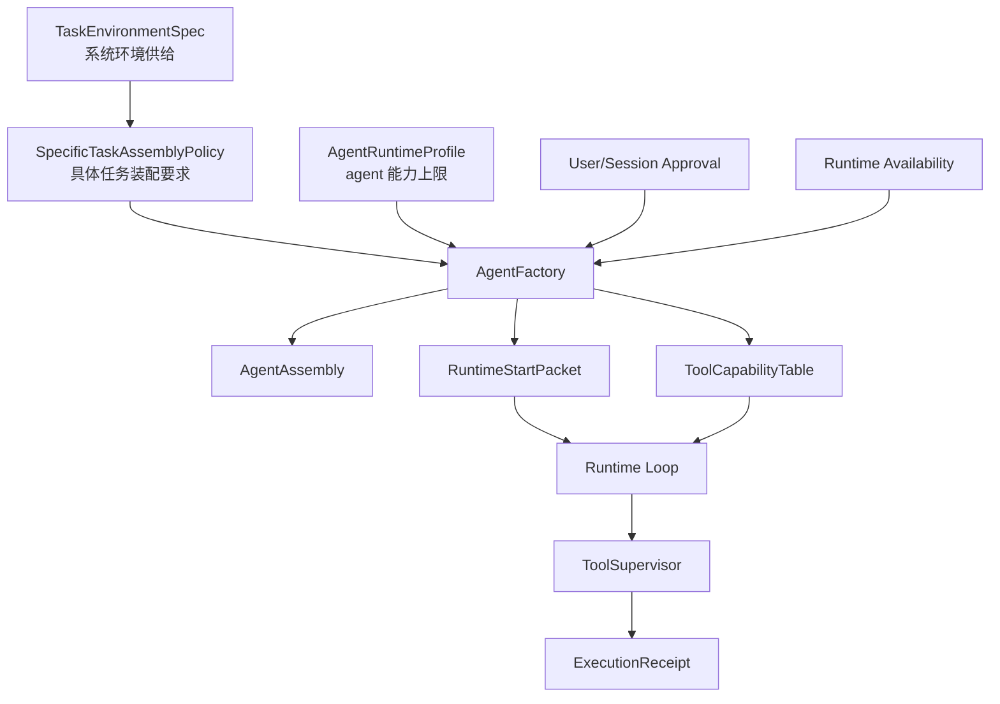

# 任务环境系统设计书

日期：2026-05-26

状态：设计书 / 待汇总评审

## 1. 结论

本项目不应继续用“任务域”作为核心抽象。`任务域`容易退化成分类标签，而我们真正需要的是系统侧可提供、可配置、可约束、可审计的 `任务环境`。

推荐命名：

```text
TaskEnvironment
```

任务环境不是 agent 模式，不是 runtime lane，也不是具体任务。它是系统为一类工作提供的环境包：

```text
任务环境 = prompt 空间 + skill 空间 + 工具市场 + 资源空间 + 环境级 memory + 执行边界 + 风险基线 + 产物策略 + 审计策略
```

具体任务才是环境里的订单。具体任务负责声明：

```text
使用什么流程
装配什么 agent
启用哪些 skills
引用哪些 prompt pack
需要哪些工具能力
输出什么契约
如何验收
是否单 agent 或任务图
```

核心不变量：

```text
TaskEnvironment 提供环境和上限。
SpecificTask 提出具体装配要求。
AgentFactory 在环境边界内装配 agent。
Runtime 只消费装配结果并监督执行。
Agent 不选择任务环境，也不看见任务环境的控制字段。
```

## 2. 当前代码事实

### 2.1 现有 TaskDomainRecord 太薄

当前 `TaskDomainRecord` 位于 `backend/task_system/registry/flow_models.py`，只有：

```text
domain_id
title
description
enabled
sort_order
metadata
```

这说明当前“任务域”更像标签，而不是系统环境。

`backend/task_system/domains/domain_binding.py` 已经写出正确方向：

```text
agent_can_select_domain = False
domain_binding_source_must_be_system = True
domain_binding_does_not_decide_goal = True
```

但它产出的只是：

```text
default_practices
validation_practices
risk_controls
diagnostics
```

缺少任务环境必须具备的系统级配置：

```text
prompt_space
skill_space
tool_space
resource_space
memory_space
execution_policy
risk_policy
artifact_policy
observability_policy
```

### 2.2 具体任务已有装配雏形

当前更接近具体任务装配要求的对象包括：

```text
SpecificTaskRecord
TaskAssignment
TaskAgentAdoptionPlan
TaskFlowDefinition
TaskProjectionBinding
TaskFlowContractBinding
```

尤其是 `TaskAgentAdoptionPlan` 已经有：

```text
default_agent_id
allow_worker_agent_spawn
worker_agent_blueprint_id
```

这证明 agent 装配要求应该属于具体任务，而不是任务环境。

### 2.3 Runtime Lane 不是任务环境

`backend/orchestration/runtime_lane_registry.py` 中的 runtime lane 目前承担了大量“环境感”的职责，例如：

```text
default_operations
default_memory_scopes
default_context_sections
default_approval_policy
runtime_template_hints
```

但 runtime lane 本质上是执行场景，不是环境。它可以被任务环境允许或推荐，但不能替代任务环境。

### 2.4 Sandbox 已有环境能力，但没有挂到环境模型

`backend/runtime/unit_runtime/sandbox_policy.py` 和 `backend/runtime/tool_runtime/sandbox_backend.py` 已有：

```text
workspace_overlay
workspace_root
sandbox_root
artifact_root
read_scopes
write_scopes
material_mounts
real_workspace_access
side_effect_operations
```

这些是典型任务环境能力，应该成为 `TaskEnvironment.resource_space` 和 `TaskEnvironment.execution_policy` 的一部分。

## 3. 核心定义

### 3.1 TaskEnvironment

```text
TaskEnvironment =
  系统为某类任务提供的运行环境、资源市场和制度边界。
```

它回答：

```text
这个任务发生在哪个工作环境里？
系统给这个环境提供哪些资源？
系统允许这个环境使用哪些工具市场和 skill 市场？
哪些风险必须审批？
哪些资源可以直接读写？
产物落到哪里？
使用哪些环境级 memory？
```

它不回答：

```text
这次具体使用哪个 agent？
这次具体使用哪个 skill？
这次具体走哪个 flow？
这次具体产出哪个文档？
这次 agent 应该怎么计划？
```

这些属于具体任务和 agent 运行。

### 3.2 SpecificTask

```text
SpecificTask =
  任务环境中的具体订单模板或具体订单入口。
```

它回答：

```text
这个任务要做什么？
用哪个流程？
装配哪个 agent 或 worker blueprint？
启用哪些 skills？
需要哪些 prompt pack？
需要哪些工具能力？
输出契约是什么？
验收规则是什么？
是否需要任务图？
```

### 3.3 Agent

```text
Agent =
  被工厂装配出来执行订单的执行体。
```

agent 只负责完成任务，不选择任务环境，不修改环境边界，不决定自己是否拥有环境级资源。

### 3.4 Runtime

```text
Runtime =
  消费装配结果，执行模型循环、工具调用、记录、审批、恢复和最终提交。
```

runtime 不重新决定任务环境，不把环境控制字段暴露给 agent。

## 4. 目标对象模型

### 4.1 TaskEnvironmentRecord

```text
TaskEnvironmentRecord
  environment_id
  title
  description
  enabled
  owner
  environment_kind
  default_visibility
  metadata
  authority = "task_system.task_environment"
```

`environment_kind` 可以是：

```text
writing
vibe_coding
web_research
data_analysis
document_processing
general_workspace
custom
```

注意：kind 只是分类，不是权威。真正权威是 `TaskEnvironmentSpec`。

### 4.2 TaskEnvironmentSpec

```text
TaskEnvironmentSpec
  spec_id
  environment_id
  prompt_space
  skill_space
  tool_space
  resource_space
  memory_space
  execution_policy
  risk_policy
  artifact_policy
  observability_policy
  runtime_policy
  lifecycle_policy
  authority = "task_system.task_environment_spec"
```

### 4.3 prompt_space

```text
prompt_space
  allowed_prompt_libraries[]
  allowed_prompt_packs[]
  default_prompt_pack_refs[]
  flow_prompt_pack_refs[]
  reviewer_prompt_pack_refs[]
  prompt_selection_policy
  prompt_version_policy
```

解释：

- 写作环境可以提供世界观、人物、章节、审核、润色 prompt 库。
- vibe coding 环境可以提供代码审查、重构、前端、测试、运行诊断 prompt 库。
- prompt 库是环境供给，具体任务决定使用哪个 prompt pack。

### 4.4 skill_space

```text
skill_space
  allowed_skill_refs[]
  denied_skill_refs[]
  skill_pack_refs[]
  skill_loading_policy
  skill_version_policy
  skill_context_policy
```

解释：

- 环境给出 skill 市场范围。
- 具体任务从市场中选择 skill。
- agent 不临时扩大 skill 市场。

### 4.5 tool_space

```text
tool_space
  allowed_operation_market[]
  denied_operation_refs[]
  allowed_tool_market[]
  denied_tool_refs[]
  allowed_mcp_routes[]
  browser_policy
  shell_policy
  network_policy
  tool_discovery_policy
```

解释：

- `tool_space` 是环境可提供的工具市场。
- 它不是最终 agent 可见工具表。
- 最终可见工具由具体任务、agent profile、权限系统和 runtime 可用性继续收束。

### 4.6 resource_space

```text
resource_space
  workspace_policy
  material_mount_policy
  project_file_policy
  external_service_policy
  browser_environment_policy
  mcp_environment_policy
  artifact_root_policy
```

典型例子：

```text
写作环境：
  不需要项目 workspace
  不需要 shell
  需要作品设定库和章节产物目录

vibe coding 环境：
  需要项目 workspace
  需要 git / file / test / browser
  可能需要 workspace overlay sandbox
  需要 AGENTS.md 和项目规范作为环境资料
```

### 4.7 memory_space

memory 必须拆开：

```text
Agent Memory
  agent 的长期偏好、执行习惯、私有工作记忆。

Environment Memory
  环境提供的共享资料、项目知识库、世界观库、公司资料库、代码库索引。

Task Run Memory
  当前运行 checkpoint、工具结果摘要、中间计划、产物引用。
```

`TaskEnvironment.memory_space` 只定义环境级 memory：

```text
memory_space
  environment_memory_refs[]
  project_knowledge_refs[]
  shared_context_refs[]
  retrieval_index_refs[]
  read_policy
  write_policy
  projection_policy
```

环境级 memory 可以被装配进任务上下文，但不应变成 agent 私有记忆。

### 4.8 execution_policy

```text
execution_policy
  sandbox_required
  sandbox_mode
  real_workspace_access
  write_scope_policy
  shell_execution_policy
  browser_execution_policy
  network_execution_policy
  side_effect_policy
  max_runtime_policy
```

典型策略：

```text
writing:
  sandbox_required = false
  shell = denied
  browser = optional
  workspace_write = artifact_only

vibe_coding:
  sandbox_required = true 或 task_decided
  shell = approval_required
  browser = allowed_with_risk
  workspace_write = task_bounded
```

### 4.9 risk_policy

```text
risk_policy
  default_permission_mode
  approval_required_risk_levels[]
  auto_denied_risk_levels[]
  reviewer_required_operations[]
  denial_tracking_policy
  audit_receipt_policy
```

任务环境只定义风险基线；具体任务可以收紧，不能越权放宽。

### 4.10 artifact_policy

```text
artifact_policy
  artifact_root
  naming_policy
  version_policy
  overwrite_policy
  publish_policy
  cleanup_policy
```

### 4.11 runtime_policy

```text
runtime_policy
  allowed_runtime_lanes[]
  preferred_runtime_lanes[]
  forbidden_runtime_lanes[]
  graph_allowed
  delegation_allowed
  human_gate_allowed
```

runtime lane 在这里变成环境允许的执行场景，而不是环境本身。

## 5. 装配链路

目标链路：

```text
User selects TaskEnvironment
-> User selects / triggers SpecificTask
-> TaskOrder created
-> TaskEnvironmentSpec resolved
-> SpecificTaskAssemblyPolicy resolved
-> AgentFactory composes AgentAssembly
-> ToolCapabilityTable compiled
-> RuntimeStartPacket built
-> Runtime executes and supervises
```

关键点：

```text
TaskEnvironmentSpec 不进入 agent 执行链。
SpecificTaskAssemblyPolicy 不写回 AgentProfile。
ToolCapabilityTable 是装配结果，不是 agent 自己声明。
RuntimeStartPacket 是 runtime 的唯一启动输入。
```

## 6. SpecificTaskAssemblyPolicy

建议新增具体任务装配策略：

```text
SpecificTaskAssemblyPolicy
  policy_id
  task_id
  environment_id
  flow_ref
  agent_selection
  skill_requirements
  prompt_requirements
  tool_capability_requirements
  memory_requirements
  resource_requirements
  output_contract_ref
  acceptance_policy
  runtime_shape
  authority = "task_system.specific_task_assembly_policy"
```

`agent_selection`：

```text
default_agent_id
worker_blueprint_id
agent_profile_ref
allow_worker_spawn
participant_agent_refs[]
```

`skill_requirements`：

```text
required_skill_refs[]
optional_skill_refs[]
denied_skill_refs[]
```

`tool_capability_requirements`：

```text
required_operations[]
optional_operations[]
denied_operations[]
required_tool_tags[]
```

`runtime_shape`：

```text
single_agent
task_graph
human_gate
subruntime
```

## 7. 权威边界

| 层 | 可以决定 | 不可以决定 |
| --- | --- | --- |
| TaskEnvironment | 环境供给、资源市场、风险基线、系统边界 | 具体 agent 行为计划、具体任务目标 |
| SpecificTask | agent 装配要求、flow、skills、工具能力需求、输出契约 | 突破环境边界、修改 agent 持久配置 |
| AgentFactory | 合成有效 agent 装配包 | 选择任务环境、放宽权限 |
| Runtime | 执行、监督、记录、恢复 | 重写任务目标、临时创造权限 |
| Agent | 计划和执行任务 | 选择环境、选择权限边界、修改系统策略 |

## 8. 示例环境

### 8.1 写作任务环境

```text
environment_id = env.writing

prompt_space:
  worldbuilding_review
  character_design
  chapter_draft
  continuity_review
  commercial_popular_fiction_review

skill_space:
  outline_planning
  chapter_writing
  consistency_review
  style_rewrite

tool_space:
  op.model_response
  op.read_file
  op.write_file
  op.edit_file
  op.text_metric
  op.memory_read

resource_space:
  manuscript_artifact_root
  setting_database

execution_policy:
  sandbox_required = false
  shell = denied
  browser = denied_by_default
  workspace_write = artifact_only

memory_space:
  world_bible
  character_cards
  chapter_summaries
```

### 8.2 Vibe Coding 任务环境

```text
environment_id = env.vibe_coding

prompt_space:
  codebase_recon
  bug_fix
  refactor
  frontend_design
  test_verification
  code_review

skill_space:
  codebase_search
  frontend_design
  code_review
  playwright

tool_space:
  op.read_file
  op.search_files
  op.search_text
  op.git_status
  op.git_diff
  op.write_file
  op.edit_file
  op.shell
  op.browser_control

resource_space:
  project_workspace
  git_worktree
  browser_session
  test_runner

execution_policy:
  sandbox_required = task_decided
  workspace_write = task_bounded
  shell = approval_required
  browser = approval_required_for_external_write

memory_space:
  project_architecture_notes
  AGENTS.md
  prior_runtime_findings
```

### 8.3 Web Research 任务环境

```text
environment_id = env.web_research

prompt_space:
  query_planning
  source_verification
  evidence_synthesis

tool_space:
  op.web_search
  op.fetch_url
  op.browser_control

execution_policy:
  network = allowed
  external_write = denied
  browser_form_submit = approval_required

memory_space:
  source_quality_rules
  citation_policy
```

## 9. 迁移方案

### Phase 1：并行新增环境模型

新增：

```text
backend/task_system/environments/models.py
backend/task_system/environments/registry.py
backend/task_system/environments/spec_resolver.py
backend/task_system/environments/default_environments.py
```

不立刻删除 `domain_binding.py`，但停止扩展 `TaskDomainRecord`。

### Phase 2：SpecificTask 接入环境

改造：

```text
SpecificTaskRecord.domain_id -> environment_id
TaskAssignment.domain_id -> environment_id
TaskAgentAdoptionPlan.metadata.environment_id
```

新增 `SpecificTaskAssemblyPolicy`。

### Phase 3：AgentAssembly 接收环境供给

`AgentFactory` 不直接读旧 domain，而是读：

```text
TaskEnvironmentSpec
SpecificTaskAssemblyPolicy
AgentRuntimeProfile
```

并输出：

```text
AgentAssembly
ToolCapabilityTable
RuntimeStartPacket
```

### Phase 4：模型可见性清理

保证以下字段不进入 agent prompt：

```text
environment_id 的控制含义
TaskEnvironmentSpec
permission/risk control plane
tool market denied rules
```

agent 只能看见装配后的任务、角色、上下文、可用工具说明。

### Phase 5：清理旧 TaskDomain

完成后删除：

```text
TaskDomainRecord
bind_task_domain
domain_binding
domain_id 控制字段
```

只保留必要的数据迁移脚本，不保留旧执行逻辑。

## 10. 验证矩阵

必须验证：

```text
写作环境不提供 shell/browser_control。
vibe coding 环境提供项目 workspace、git、文件读写、可审批 shell。
具体任务可以在环境工具市场内选择工具能力。
具体任务不能突破环境 denied operations。
agent profile 不能越过任务环境上限。
环境级 memory 不写入 agent 私有 memory。
agent prompt 不出现 TaskEnvironmentSpec 控制字段。
runtime 只能消费 RuntimeStartPacket，不重新选择环境。
```

## 11. 禁止模式

实施时禁止：

1. 把 `TaskEnvironment` 做成新的分类标签。
2. 把 agent 配置直接塞进环境。
3. 把具体任务的 skill/agent 装配要求写到环境里。
4. 让 agent 选择或切换任务环境。
5. 用 runtime lane 替代任务环境。
6. 用 prompt 描述代替环境资源和权限结构。
7. 长期保留 `domain_id` 和 `environment_id` 双轨执行。
8. 让环境级 memory 污染 agent 私有 memory。

## 12. 最终结构



