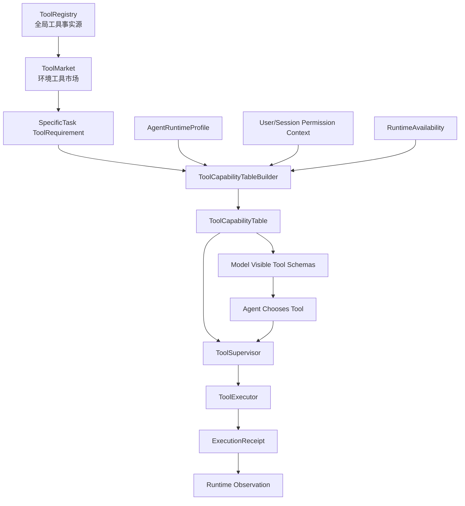

# 工具系统重构设计书

日期：2026-05-26

状态：设计书 / 待汇总评审

## 1. 结论

工具系统的目标不是让系统预先规定 agent 下一步必须调用哪个工具，而是为 agent 提供一个结构化、可审计、可监督的工具市场和工具能力表。

成熟 agent 的工具链应满足：

```text
工具先注册成 ToolManifest。
环境提供工具市场。
具体任务声明能力需求。
agent 工厂生成 ToolCapabilityTable。
模型只看见本轮允许看见的工具 schema。
agent 自主选择工具。
系统在每次 tool call 时按参数和风险监督。
工具执行产生 ExecutionReceipt。
```

核心不变量：

```text
ToolRegistry 是工具事实源。
ToolCapabilityTable 是本次 agent 可见和可调度工具事实源。
ToolSupervisor 是 per-call 风险监督入口。
ToolExecutor 只执行已经监督通过的调用。
Runtime 不把系统验证义务变成强制工具顺序。
```

## 2. 当前代码事实

### 2.1 ToolDefinition 已有 manifest 雏形

`backend/capability_system/tool_definitions.py` 的 `ToolDefinition` 已包含：

```text
name
display_name
operation_id
module
factory
contract
resolution_contract
output_contract
projection_contract
capability_tags
supported_modalities
safety_tags
route_hints
safe_for_auto_route
runtime_visibility
prompt_exposure_policy
resource_exposure_policy
is_read_only
is_destructive
is_concurrency_safe
```

这说明项目已有工具 manifest 的基础。

### 2.2 OperationDescriptor 已有风险语义

`backend/capability_system/operation_registry.py` 的 `OperationDescriptor` 已包含：

```text
operation_id
operation_type
risk_tags
read_only
destructive
open_world
requires_user_interaction
requires_approval_by_default
safety_validator_ref
max_result_size_chars
interrupt_behavior
```

这说明工具风险不应该继续散落在 prompt 或 runtime 分支里。

### 2.3 ToolRuntimeExecutor 的执行脊柱是正确方向

`backend/runtime/tool_runtime/tool_executor.py` 已有成熟形状：

```text
validate_input
check_permissions
call
build execution receipt
record result envelope
```

这是正确的执行层。

问题是它现在缺少统一的工具监督层。当前风险判断分散在：

```text
OperationRegistry
ResourcePolicy
OperationGate
ToolRuntimeExecutor
NativeTool.check_permissions
SandboxBackend
CurrentTurnCapabilityPlan
```

### 2.4 CurrentTurnCapabilityPlan 不是最终工具权威

`backend/runtime/capabilities/current_turn_capability_plan.py` 会合并：

```text
operation_requirement
execution_permit
resource_policy
search_policy
tool definitions
```

它适合做本轮工具可见性投影，但不应承担全部工具授权事实源。最终工具能力应该由 agent 装配阶段生成，并由权限系统在 per-call 阶段监督。

## 3. 目标分层

### 3.1 ToolRegistry

工具全局事实源。

```text
ToolRegistry
  tools[]
  operations[]
  tool_to_operation_index
  tool_schema_index
  risk_descriptor_index
```

只负责说明：

```text
系统有哪些工具？
工具叫什么？
工具 schema 是什么？
工具映射哪个 operation？
工具的风险属性是什么？
工具如何构造 runtime adapter？
```

不负责决定本次 agent 能不能用。

### 3.2 ToolMarket

由任务环境提供的工具市场。

```text
ToolMarket
  environment_id
  allowed_operation_market[]
  denied_operation_refs[]
  allowed_tool_market[]
  denied_tool_refs[]
  allowed_mcp_routes[]
  tool_discovery_policy
```

工具市场表示“环境可供应”，不是“agent 最终可用”。

### 3.3 ToolRequirement

由具体任务提出的工具能力需求。

```text
ToolRequirement
  required_operations[]
  optional_operations[]
  denied_operations[]
  required_tool_tags[]
  preferred_tools[]
  max_tool_risk_level
  reason
```

具体任务可以收紧环境工具市场，也可以从市场中选择需要的能力，但不能突破环境上限。

### 3.4 ToolCapabilityTable

本次 agent 装配后的工具事实源。

```text
ToolCapabilityTable
  table_id
  environment_id
  task_id
  agent_id
  allowed_operations[]
  model_visible_tools[]
  dispatchable_tools[]
  hidden_runtime_tools[]
  denied_operations[]
  denied_tools[]
  risk_controls[]
  tool_schema_refs[]
  mcp_routes[]
  diagnostics
  authority = "runtime.tool_capability_table"
```

它回答：

```text
模型本轮能看见哪些工具？
runtime 可以调度哪些工具？
哪些工具只能系统内部使用？
哪些 operation 被拒绝？
每个工具调用需要什么风险监督？
```

### 3.5 ToolSupervisor

工具调用按次监督入口。

```text
ToolSupervisor
  supervise(tool_call, capability_table, permission_context, runtime_context)
  -> ToolCallDecision
```

它负责在每次调用时判断：

```text
工具是否在 dispatchable_tools 中？
operation 是否允许？
参数是否满足 schema？
路径/URL/命令是否越界？
风险等级是否需要审批？
审批 token 是否匹配当前参数指纹？
是否需要 sandbox？
是否命中 deny rule？
是否要生成 recoverable rejection？
```

### 3.6 ToolExecutor

只执行已经通过监督的调用。

```text
ToolExecutor
  validate normalized input
  execute adapter/native tool
  collect envelope
  persist receipt
```

ToolExecutor 不应该重新发明权限策略，只保留工具自身不可替代的本地安全检查。

## 4. 工具调用固定链路

目标执行链：

```text
Model emits tool_call
-> ToolProtocolGuard
-> ToolSupervisor
-> ApprovalGateway if needed
-> ToolExecutor
-> ToolResultEnvelope
-> ExecutionReceipt
-> RuntimeObservation
-> Model continues
```

关键点：

- agent 自己选择工具。
- 系统不要求“下一步必须用某工具”。
- 系统可以拒绝、要求修正参数、要求审批、要求 sandbox。
- 工具结果必须以 observation 和 receipt 形式回到模型上下文。

## 5. ToolManifest 目标结构

建议将 `ToolDefinition` 和 `OperationDescriptor` 逐步合流为更清晰的 manifest 结构：

```text
ToolManifest
  tool_name
  display_name
  operation_id
  provider
  input_schema_ref
  output_schema_ref
  prompt_exposure_policy
  runtime_visibility
  resource_exposure_policy
  capability_tags[]
  modality_tags[]
  risk_profile
  execution_contract
  result_contract
  concurrency_policy
  lifecycle_policy
```

### 5.1 risk_profile

```text
risk_profile
  risk_level
  risk_tags[]
  read_only
  destructive
  open_world
  external_write_possible
  requires_approval_by_default
  safety_validator_refs[]
  audit_required
```

建议风险等级：

```text
R0 model_only
R1 bounded_read
R2 open_read
R3 workspace_write
R4 command_execution
R5 irreversible_external
R6 delegation_or_subagent
```

### 5.2 execution_contract

```text
execution_contract
  required_inputs[]
  optional_inputs[]
  owner_scope
  missing_binding_behavior
  context_policy
  sandbox_compatible
  max_result_size_chars
  interrupt_behavior
```

### 5.3 result_contract

```text
result_contract
  display_mode
  persistence_policy
  projection_policy
  observation_kind
  receipt_required
```

## 6. ToolCapabilityTable 合成公式

```text
ToolCapabilityTable =
  ToolRegistry
  ∩ TaskEnvironment.tool_space
  ∩ SpecificTask.tool_requirements
  ∩ AgentRuntimeProfile.allowed_operations
  ∩ UserSessionPermissionContext
  ∩ RuntimeAvailability
```

合成规则：

1. `TaskEnvironment` 给出工具市场和硬上限。
2. `SpecificTask` 从市场内声明需要哪些能力。
3. `AgentRuntimeProfile` 给出 agent 能力上限。
4. 用户/会话审批状态只影响是否可执行，不扩展能力。
5. runtime availability 过滤当前不可用工具。
6. model_visible_tools 和 dispatchable_tools 分开。

## 7. model_visible_tools 与 dispatchable_tools

必须拆分：

```text
model_visible_tools
  模型看见 schema，可主动调用。

dispatchable_tools
  runtime 可执行，可能包含 agent_internal 或系统内部工具。

hidden_runtime_tools
  runtime 为系统恢复、记录、产物处理使用，模型不可见。
```

例如：

```text
agent_todo:
  可以 model_visible

terminal:
  某些环境可 dispatchable，但 prompt_exposure_policy 可能受任务限制

approval_resolver:
  hidden_runtime_tools
```

## 8. 工具发现策略

对于大量 MCP 或 skill 工具，不应全部注入 prompt。

建议：

```text
ToolDiscoveryPolicy
  always_load_tools[]
  deferred_tools[]
  searchable_tools[]
  max_visible_schema_count
  discovery_tool_ref
```

模型初始只看见：

```text
核心工具
ToolSearch / capability_search
deferred 工具名称摘要
```

当 agent 需要更多工具时，由工具发现机制返回 schema refs。工具发现仍受 `ToolCapabilityTable` 和权限系统约束。

## 9. 工具目录建议

目标目录：

```text
backend/capability_system/tools/
  registry.py
  manifest_models.py
  manifest_builder.py
  schema_registry.py
  risk_profiles.py
  providers/
    builtin/
    mcp/
    skill/

backend/runtime/tooling/
  capability_table.py
  capability_table_builder.py
  supervisor.py
  decision_models.py
  executor.py
  receipts.py
```

现有文件迁移关系：

```text
capability_system/tool_definitions.py
  -> tools/manifest_builder.py

capability_system/operation_registry.py
  -> tools/risk_profiles.py + operation registry

runtime/capabilities/current_turn_capability_plan.py
  -> runtime/tooling/capability_table_builder.py

runtime/tool_runtime/tool_executor.py
  -> runtime/tooling/executor.py
```

## 10. 与任务环境的关系

任务环境不直接给 agent 可用工具表，而是提供工具市场：

```text
TaskEnvironment.tool_space
  allowed_operation_market
  denied_operation_refs
  allowed_mcp_routes
  browser_policy
  shell_policy
  network_policy
```

具体任务再选择：

```text
SpecificTask.tool_requirements
  required_operations
  optional_operations
  denied_operations
  preferred_tools
```

最终由 AgentFactory 生成：

```text
ToolCapabilityTable
```

## 11. 与权限系统的关系

工具系统不直接做最终授权。它提供：

```text
tool manifest
risk profile
schema
capability table
```

权限系统负责：

```text
policy decision
approval
deny/ask/allow
per-call supervision
approval fingerprint
denial tracking
```

工具自身只保留无法抽离的局部安全检查：

```text
路径解析
命令安全解析
输入 schema 验证
工具 provider 自身约束
```

## 12. 迁移方案

### Phase 1：稳定 ToolManifest

保留现有 `ToolDefinition`，新增转换层：

```text
ToolDefinition -> ToolManifest
OperationDescriptor -> RiskProfile
```

不改变执行行为。

### Phase 2：生成 ToolCapabilityTable

在 agent assembly 阶段生成 `ToolCapabilityTable`，替代散落的 visible/dispatchable 计算。

### Phase 3：引入 ToolSupervisor

在 `tool_loop.py` 调用 ToolExecutor 前插入 ToolSupervisor。

初期 ToolSupervisor 可以复用现有：

```text
OperationGate
ToolInvocationValidator
build_task_safety_validators
NativeTool.check_permissions
```

但入口必须统一。

### Phase 4：清理重复工具权限判断

将重复的合并逻辑从：

```text
CurrentTurnCapabilityPlan
ExecutionPermit
AgentAssembly assembler
Professional action_gate
```

迁到 capability table builder 和 permission supervisor。

### Phase 5：删除旧工具强制顺序

专业 runtime 中不再把系统义务变成强制工具链。系统只验证义务是否满足，不替 agent 编排具体工具调用顺序。

## 13. 验证矩阵

必须验证：

```text
模型只能看见 model_visible_tools。
runtime 只能执行 dispatchable_tools。
denied operation 即使模型伪造 tool_call 也被拒绝。
required input 缺失返回 recoverable rejection。
写文件路径越界被拒绝。
shell 高风险命令需要审批或拒绝。
browser 外部写入需要审批。
工具结果产生 ExecutionReceipt。
ToolCapabilityTable 不含任务环境控制字段。
ToolSupervisor 的拒绝会回到模型作为 observation。
```

## 14. 禁止模式

实施时禁止：

1. 用 prompt 告诉 agent “不要用某工具”来代替工具能力表。
2. 在 runtime action gate 中强制 agent 按固定工具顺序行动。
3. 让具体工具自己决定全局权限。
4. 让任务环境直接变成最终工具表。
5. 混淆 model_visible_tools 和 dispatchable_tools。
6. 用 `safe_for_auto_route` 当最终安全判断。
7. 为兼容旧路径保留多个工具合成真相源。

## 15. 最终结构



