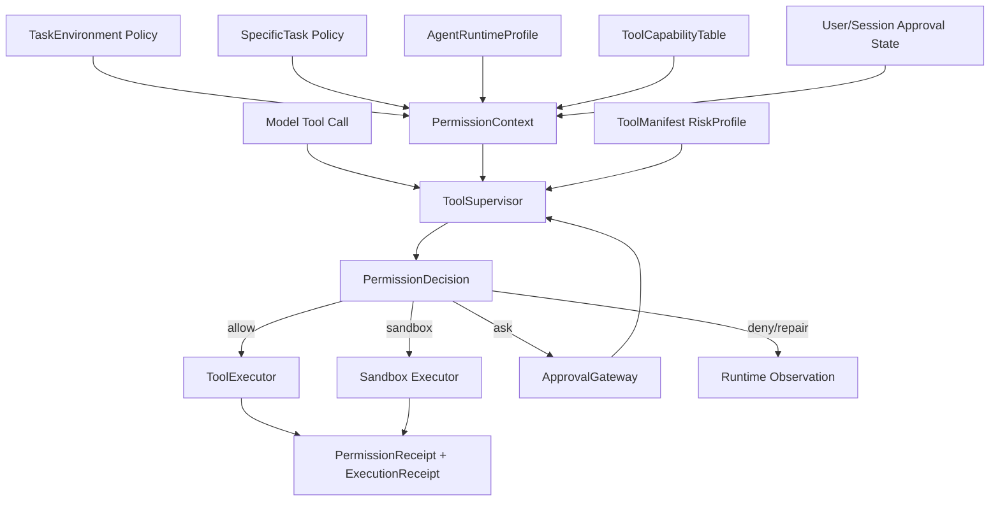

# 权限系统重构设计书

日期：2026-05-26

状态：设计书 / 待汇总评审

## 1. 结论

权限系统不是工具列表过滤器，也不是 prompt 约束。它是系统对 agent 行为落地前的最终授权、审批、监督和审计管线。

成熟 agent 权限系统应该做到：

```text
agent 可以自主计划和选择工具。
系统不提前替 agent 决定每一步工具。
每次 tool call 都必须带参数进入权限管线。
权限管线根据环境、具体任务、agent 能力、用户会话、工具风险和参数风险做决策。
高风险操作需要审批、sandbox 或拒绝。
所有允许和拒绝都必须留下 receipt。
```

核心不变量：

```text
PermissionPolicy 是策略。
PermissionContext 是本次运行事实。
ToolSupervisor 是按次授权入口。
ApprovalGateway 只处理需要人或外部系统确认的操作。
ToolExecutor 不能绕过 PermissionDecision。
```

## 2. 当前代码事实

### 2.1 OperationGate 已具备 fail-closed 管线

`backend/permissions/operation_gate.py` 已有：

```text
descriptor_exists
runtime_directive_exists
adopted_resource_policy_exists
deny_rule
requires_approval_rule
allow_rule
dangerous_allow_rule_stripper
operation_specific_safety_validator
```

这是正确方向。

### 2.2 ResourcePolicy 已表达 allow / deny / requires_approval

`backend/permissions/resource_policy.py` 和 `resource_policy_builder.py` 已有：

```text
allowed_operations
denied_operations
requires_approval_operations
not_executable_operations
allowed_tools
denied_tools
approval_policy
runtime_view_only
adopted
runtime_executable
```

但现在 ResourcePolicy 和 ExecutionPermit、CurrentTurnCapabilityPlan、ToolExecutor 的边界不够清楚。

### 2.3 RuntimePolicyBuilder 已经考虑 agent profile

`backend/permissions/runtime_policy_builder.py` 已经把：

```text
task_operation
agent_runtime_profile
sandbox_policy
approval_context
operation_registry
```

合并成运行策略。这是未来 PermissionContext 的雏形。

### 2.4 ToolRuntimeExecutor 仍有局部权限判断

`backend/runtime/tool_runtime/tool_executor.py` 在运行前会执行：

```text
_evaluate_dispatch_guard
validate_input
check_permissions
call
```

这里应该保留工具局部检查，但全局权限决策应上移到统一 ToolSupervisor。

## 3. 权限系统目标分层

### 3.1 PermissionPolicy

策略定义，不含本次运行状态。

```text
PermissionPolicy
  policy_id
  environment_policy
  task_policy
  agent_policy
  session_policy
  risk_policy
  approval_policy
  sandbox_policy
  authority
```

### 3.2 PermissionContext

本次运行事实。

```text
PermissionContext
  task_environment_ref
  task_order_ref
  task_run_ref
  agent_run_ref
  tool_capability_table_ref
  permission_mode
  approval_state
  sandbox_state
  user_session_ref
  runtime_availability
  denial_tracking_state
```

### 3.3 PermissionDecision

每次授权结果。

```text
PermissionDecision
  decision_id
  operation_id
  tool_name
  behavior = allow | deny | ask | sandbox | repair
  reason
  risk_level
  risk_tags[]
  approval_required
  approval_fingerprint
  sandbox_required
  normalized_args
  diagnostics
  receipt_policy
```

### 3.4 ApprovalGateway

只处理 `ask` 和外部审批。

```text
ApprovalGateway
  request_approval(decision)
  resolve_approval(token)
  validate_approval_fingerprint(tool_call_args)
```

审批 token 必须绑定：

```text
operation_id
tool_name
normalized_args_hash
sandbox_policy_hash
task_run_id
directive_ref
```

不能只按工具名批准。

### 3.5 PermissionReceipt

所有 allow/deny/ask 都要可审计。

```text
PermissionReceipt
  receipt_id
  decision_id
  task_run_id
  agent_run_id
  tool_call_id
  operation_id
  tool_name
  behavior
  risk_fingerprint
  approval_token_ref
  policy_refs[]
  created_at
```

## 4. 有效权限公式

最终权限不是单层配置，而是交集：

```text
EffectivePermission =
  TaskEnvironment.risk_policy/tool_space/execution_policy
  ∩ SpecificTask.tool_requirements/resource_requirements
  ∩ AgentRuntimeProfile.allowed_operations
  ∩ UserSessionPermissionPolicy
  ∩ RuntimeAvailability
  ∩ ToolManifest.risk_profile
  ∩ ToolCallParameterRisk
```

任何层 deny 都应优先于 allow。

审批只能把 `ask` 变成 `allow`，不能把 `deny` 变成 `allow`。

## 5. 风险等级

建议统一风险等级：

```text
R0 model_only
  纯模型输出，无外部读取和副作用。

R1 bounded_read
  任务边界内只读，例如读明确 workspace 文件。

R2 open_read
  开放世界读取，例如 web_search、fetch_url、外部 MCP read。

R3 workspace_write
  工作区写入、编辑、产物生成。

R4 command_execution
  shell、python、测试命令、本地服务启动。

R5 irreversible_external
  外部系统写入、发布、提交、删除、支付、账号操作。

R6 delegation_or_subagent
  委派子 agent、启动长期任务、任务图并行执行。
```

风险等级不是工具固定属性，还要结合参数：

```text
read_file("README.md") -> R1
read_file("/outside/workspace") -> deny
browser_control("navigate") -> R2
browser_control("submit form") -> R5 candidate
terminal("git status") -> R1/R4 low
terminal("rm -rf") -> deny
write_file("artifact/output.md") -> R3
write_file(".env") -> ask/deny
```

## 6. Permission Mode

建议保留但重新定义语义：

```text
default
  非只读或高风险操作 ask。

read_only
  只允许 R0/R1，R2 可由环境决定，写入和命令拒绝。

task_bounded_write
  允许任务边界内 R3，R4/R5/R6 ask。

dont_ask
  所有 ask 自动 deny。

headless
  所有需要 UI 审批的 ask 自动 deny，除非有 approval hook。

approved_session
  只对已批准 fingerprint 的调用放行。

dangerous_bypass
  仅开发/受控环境可用，仍不可跳过 hard deny 和安全 validator。
```

高信任模式也不能跳过：

```text
hard deny
path traversal
outside workspace write
destructive external action without explicit capability
approval fingerprint mismatch
tool not in dispatchable_tools
```

## 7. 权限管线

固定顺序：

```text
1. Tool call protocol validation
2. Capability table membership check
3. Tool schema validation
4. Operation and risk descriptor resolution
5. Environment hard boundary check
6. Specific task boundary check
7. Agent profile ceiling check
8. Parameter risk analysis
9. Sandbox decision
10. Approval requirement decision
11. Approval token validation
12. Final allow / deny / ask / repair
13. PermissionReceipt record
```

任何一步失败都要明确返回：

```text
policy_rejection_observation
recoverable_tool_invocation_observation
approval_waiting
```

不能静默 fallback。

## 8. ToolSupervisor 与 OperationGate 的关系

`OperationGate` 可以保留为底层 gate，但目标入口应是：

```text
ToolSupervisor.supervise(...)
```

ToolSupervisor 负责整合：

```text
ToolCapabilityTable
PermissionContext
OperationGate
ToolInvocationValidator
SafetyValidators
ApprovalGateway
SandboxPolicy
```

OperationGate 不直接被 runtime 各处散调用。

## 9. Sandbox 决策

Sandbox 不是权限替代品，而是风险缓释手段。

```text
PermissionDecision.behavior = sandbox
```

表示：

```text
允许执行，但必须在指定 sandbox 上下文中执行。
```

适用：

```text
写文件到 overlay
运行测试命令
执行可能产生副作用的构建命令
浏览器操作隔离 session
```

Sandbox 不能允许：

```text
环境明确 denied operation
外部不可逆写入
越权读取敏感路径
审批 fingerprint 不匹配
```

## 10. 环境级权限与 agent 权限

任务环境提供硬边界：

```text
env.writing:
  shell denied
  browser denied_by_default
  workspace_write artifact_only

env.vibe_coding:
  shell ask/sandbox
  browser ask for external write
  workspace_write task_bounded
```

agent profile 提供能力上限：

```text
code_executor:
  read/search/edit/shell/browser

reviewer:
  read/search/git_diff only
```

具体任务提出需求：

```text
frontend_bug_fix:
  read/search/edit/browser/test
```

最终权限取交集。agent profile 不能扩大环境，具体任务也不能扩大环境。

## 11. Memory 权限

memory 权限也必须进入权限系统。

分层：

```text
environment_memory_read
environment_memory_write_candidate
agent_memory_read
agent_memory_write_candidate
task_run_memory_read
task_run_memory_write
```

默认规则：

```text
agent 可以读取装配给它的上下文 memory。
agent 不直接写环境级 memory。
环境级 memory 写入必须走 candidate + review。
task_run memory 可由 runtime 记录 checkpoint 和工具摘要。
```

## 12. Delegation 权限

委派是高风险能力，风险等级 R6。

要求：

```text
delegate_to_agent 必须在 ToolCapabilityTable 中。
目标 agent 必须在 delegated_agent_ids 中。
委派任务必须产生 child task/order/run 或 child agent run。
委派上下文必须 summary/ref only，除非环境允许共享 raw context。
父 agent 不能通过委派绕过工具权限。
```

## 13. 迁移方案

### Phase 1：定义统一 PermissionDecision

新增：

```text
backend/permissions/decision_models.py
backend/permissions/context_models.py
backend/permissions/receipt_models.py
```

保留现有 `OperationGateResult`，但转换成统一 `PermissionDecision`。

### Phase 2：引入 ToolSupervisor

新增：

```text
backend/runtime/tooling/supervisor.py
```

把 `tool_loop.py` 中的 gate/preflight 调用收口到 ToolSupervisor。

### Phase 3：ApprovalGateway 统一化

整合：

```text
runtime/execution_permit/approval_gateway.py
permissions/operation_gate.py approval token
tool_loop.py approval_waiting
```

审批按 fingerprint 生效。

### Phase 4：PermissionReceipt 入库

每次权限决策都写入 runtime event / execution record。

### Phase 5：清理重复权限分支

删除或迁移：

```text
professional_runtime/action_gate 中的工具强制顺序
散落的 allowed_operations 合并逻辑
runtime 中绕过 OperationGate 的工具执行路径
```

## 14. 验证矩阵

必须验证：

```text
denied operation 不能通过审批放行。
ask 在 dont_ask/headless 下自动 deny。
approval token 参数不匹配时拒绝。
shell 高风险命令被 deny 或 ask。
写 workspace 外路径被 deny。
sandbox 只缓释风险，不扩大权限。
delegate_to_agent 不能绕过父 agent 权限。
environment memory 不被 agent 直接写入。
PermissionReceipt 完整记录 allow/deny/ask。
```

## 15. 禁止模式

实施时禁止：

1. 用工具名称白名单替代参数级风险判断。
2. 审批只绑定工具名，不绑定参数 fingerprint。
3. 把 sandbox 当成万能 allow。
4. 让 agent 决定自己的权限模式。
5. 让具体任务越过任务环境硬边界。
6. 用 prompt 替代权限结构。
7. 保留多个并行权限事实源。
8. 静默 fallback 到 allow。

## 16. 最终结构



