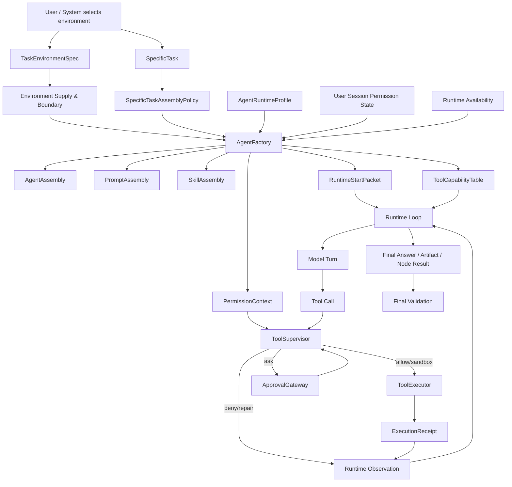

# 任务环境、工具系统、权限系统统一设计总纲

日期：2026-05-26

状态：总纲 / 待实施计划书

关联设计书：

- `215-任务环境系统设计书-20260526.md`
- `216-工具系统重构设计书-20260526.md`
- `217-权限系统重构设计书-20260526.md`

## 1. 总结论

本次重构应围绕一个主链完成：

```text
TaskEnvironment
-> SpecificTask
-> AgentFactory
-> ToolCapabilityTable
-> RuntimeStartPacket
-> Runtime Loop
-> ToolSupervisor
-> ExecutionReceipt
```

其中：

```text
TaskEnvironment 是环境供给和系统边界。
SpecificTask 是具体订单和装配要求。
AgentFactory 是装配权威。
ToolCapabilityTable 是本次工具能力事实源。
PermissionSystem 是 per-call 授权和审批权威。
Runtime 只执行和记录，不重新发明任务目标和权限。
Agent 只完成任务，不选择环境，不决定权限边界。
```

任务环境里的资源供给必须包含一等的 `FileManagementEnvironment`。产物政策、正式作品、草稿区、记忆库、记忆索引和记忆投影都属于平台文件管理环境下的资源视图和生命周期策略，不能拆成互不相干的散模块。写作环境尤其需要平台托管的作品文件管理系统：agent 可以打开正式作品、读取 canon、写候选草稿、提交章节版本，但不能直接覆盖正式作品普通文件。

这条链的目标是把目前散落在 task domain、runtime lane、agent profile、operation requirement、execution permit、resource policy、action gate 和 tool executor 里的控制权收束成清晰的系统工程。

## 2. 三个系统的边界

### 2.1 任务环境系统

负责：

```text
prompt_space
skill_space
tool_space
file_management_space
resource_space
memory_space
execution_policy
risk_policy
artifact_policy
observability_policy
runtime_policy
```

不负责：

```text
具体 agent 计划
具体工具调用顺序
具体任务目标
agent 持久配置修改
```

### 2.2 工具系统

负责：

```text
ToolRegistry
ToolManifest
OperationDescriptor
ToolCapabilityTable
Tool schema
Tool result envelope
ExecutionReceipt
```

不负责：

```text
用户审批
任务环境选择
最终权限放行
强制 agent 按固定工具顺序执行
```

### 2.3 权限系统

负责：

```text
PermissionContext
PermissionPolicy
PermissionDecision
ApprovalGateway
ToolSupervisor
PermissionReceipt
DenialTracking
Sandbox decision
```

不负责：

```text
工具注册
prompt 组装
具体任务 flow 选择
agent 语义计划生成
```

## 3. 正确的有效装配公式

```text
EffectiveRuntimeAssembly =
  TaskEnvironment supply and hard boundary
  ∩ SpecificTask assembly requirement
  ∩ AgentRuntimeProfile capability ceiling
  ∩ User/Session permission state
  ∩ Runtime actual availability
```

进一步拆开：

```text
PromptAssembly =
  Environment.prompt_space
  ∩ SpecificTask.prompt_requirements
  ∩ Agent role/profile

SkillAssembly =
  Environment.skill_space
  ∩ SpecificTask.skill_requirements
  ∩ Agent capability

ToolCapabilityTable =
  ToolRegistry
  ∩ Environment.tool_space
  ∩ SpecificTask.tool_requirements
  ∩ AgentRuntimeProfile.allowed_operations
  ∩ RuntimeAvailability

PermissionContext =
  Environment.risk_policy/execution_policy
  ∩ Environment.file_management_space
  ∩ SpecificTask.resource_requirements
  ∩ Agent capability ceiling
  ∩ UserSessionApproval
  ∩ ToolCapabilityTable
```

其中：

```text
Environment.file_management_space =
  managed_file_environment
  + artifact_repository_policy
  + memory_repository_policy
  + official_work_policy
  + versioning/commit/rollback policy
```

产物政策和环境级 memory 不应作为绕过文件管理环境的独立权威。它们是平台文件管理环境暴露给 runtime、工具系统和最终验收的不同投影。

## 4. 固定执行流

### 4.1 用户选择任务环境

用户或系统入口选择任务环境：

```text
env.writing
env.vibe_coding
env.web_research
env.data_analysis
```

选择任务环境是系统级动作，不是 agent 行为。

### 4.2 用户选择或触发具体任务

具体任务声明：

```text
flow_ref
agent_selection
skill_requirements
prompt_requirements
tool_requirements
memory_requirements
output_contract
acceptance_policy
runtime_shape
```

### 4.3 系统创建订单

```text
TaskOrder
TaskOrderRun
ExecutionChannel
```

### 4.4 AgentFactory 装配

输入：

```text
TaskEnvironmentSpec
SpecificTaskAssemblyPolicy
AgentRuntimeProfile
TaskOrderRun
UserSessionPermissionState
RuntimeAvailability
```

输出：

```text
AgentAssembly
PromptAssembly
SkillAssembly
ToolCapabilityTable
PermissionContext
RuntimeStartPacket
```

### 4.5 Runtime 执行

```text
RuntimeStartPacket
-> model loop
-> model emits tool call
-> ToolSupervisor
-> ToolExecutor
-> Observation
-> model continues
-> final answer / artifact / node result
```

### 4.6 Final Validation

系统可以验证：

```text
输出契约是否满足
产物是否存在
证据是否真实
验收规则是否通过
是否允许进入下一阶段
```

系统不能把这些验证义务变成强制 agent 工具调用顺序。

## 5. Agent 可见内容

agent 应该看见：

```text
角色职责
任务目标
输入材料
上下文摘要
可用工具 schema
输出契约
验收标准
必要边界说明
```

agent 不应该看见：

```text
TaskEnvironmentSpec 控制面
权限策略内部字段
denied tool market
审批 token
系统 fallback 分支
任务环境选择逻辑
```

## 6. Prompt 原则

给 agent 的 prompt 必须是角色任务说明，不是开发说明。

错误：

```text
这是 runtime 节点。
根据任务图执行 world_review。
这个节点用于校验资产。
```

正确：

```text
你是一名世界观审核员。
你只负责评审当前世界观设定是否完整、一致、可支撑后续写作。
你不负责替创作者扩写设定。
你需要指出问题、给出裁决、说明是否允许进入下一阶段。
```

任务环境可以提供 prompt pack，但具体任务必须选择角色化、职责化、边界清楚的 prompt。

## 7. 与现有代码的映射

### 7.1 任务环境

当前：

```text
backend/task_system/domains/domain_binding.py
backend/task_system/registry/flow_models.py TaskDomainRecord
```

目标：

```text
backend/task_system/environments/models.py
backend/task_system/environments/registry.py
backend/task_system/environments/spec_resolver.py
```

### 7.2 具体任务装配

当前：

```text
SpecificTaskRecord
TaskAssignment
TaskAgentAdoptionPlan
TaskFlowDefinition
TaskProjectionBinding
```

目标：

```text
SpecificTaskAssemblyPolicy
TaskExecutionEnvelope
```

### 7.3 Agent 装配

当前：

```text
backend/runtime/agent_assembly/assembler.py
backend/agent_system/assembly/runtime_bundle_builder.py
backend/agent_system/registry/worker_agent_factory.py
```

目标：

```text
AgentFactory
AgentAssemblyBuilder
RuntimeStartPacketBuilder
```

### 7.4 工具系统

当前：

```text
backend/capability_system/tool_definitions.py
backend/capability_system/operation_registry.py
backend/runtime/capabilities/current_turn_capability_plan.py
backend/runtime/tool_runtime/tool_executor.py
```

目标：

```text
ToolManifest
ToolCapabilityTable
ToolSupervisor
ToolExecutor
```

### 7.5 权限系统

当前：

```text
backend/permissions/operation_gate.py
backend/permissions/resource_policy_builder.py
backend/permissions/runtime_policy_builder.py
backend/runtime/execution_permit/*
```

目标：

```text
PermissionContext
PermissionDecision
ApprovalGateway
PermissionReceipt
```

## 8. 迁移总路线

### Phase 1：设计对象落地

新增对象，不改变执行：

```text
TaskEnvironmentSpec
SpecificTaskAssemblyPolicy
ToolManifest projection
ToolCapabilityTable
PermissionDecision
PermissionContext
```

完成标准：

```text
可以从现有 domain/task/profile/tool/permission 数据生成新对象。
不改变现有运行行为。
测试覆盖对象合成。
```

### Phase 2：装配链收口

让 agent assembly 消费：

```text
TaskEnvironmentSpec
SpecificTaskAssemblyPolicy
AgentRuntimeProfile
```

并输出：

```text
RuntimeStartPacket
ToolCapabilityTable
PermissionContext
```

完成标准：

```text
visible_tools/dispatchable_tools 不再多处重复计算。
agent prompt 不包含环境控制字段。
具体任务能选择 skills/prompt/tool requirements。
```

### Phase 3：工具监督统一

引入：

```text
ToolSupervisor
PermissionDecision
PermissionReceipt
```

完成标准：

```text
所有 tool call 必须经过 ToolSupervisor。
ToolExecutor 不能直接被 runtime 绕过调用。
审批按 fingerprint 生效。
```

### Phase 4：任务环境接入具体任务

将旧 `domain_id` 迁移为 `environment_id`。

完成标准：

```text
任务环境提供供给和边界。
具体任务提供装配要求。
任务环境不配置具体 agent。
```

### Phase 5：Runtime 行为清理

清理：

```text
professional_runtime/action_gate 的工具顺序强制
散落的 execution permit 合并逻辑
旧 domain binding 执行影响
task_selection 作为执行真相的分支
```

完成标准：

```text
runtime 不再重写 agent 行为计划。
runtime 只执行 RuntimeStartPacket。
系统义务由 final validation 校验。
```

## 9. 验证总矩阵

### 9.1 写作环境

断言：

```text
不提供 shell。
不默认提供 sandbox。
提供写作 prompt pack。
提供平台托管作品文件管理系统。
提供正式作品打开能力。
提供草稿区、审核区、正式区、版本、提交、回滚和审计策略。
提供作品级 environment memory，但 memory 的存储、索引和投影属于文件管理环境。
产物政策属于文件管理环境下的 artifact repository 生命周期策略。
具体章节任务可以装配章节写作 agent 和 continuity review skill。
agent prompt 不出现环境控制字段。
agent 不能直接覆盖正式作品普通文件，只能通过平台提交链路。
```

### 9.2 Vibe Coding 环境

断言：

```text
提供项目 workspace。
提供 read/search/git/edit/browser/test 能力。
shell 需要审批或 sandbox。
AGENTS.md 作为环境资源进入上下文。
具体 bug fix 任务可以选择 code executor agent。
review 任务只能得到只读工具。
```

### 9.3 工具调用

断言：

```text
模型伪造未授权工具会被拒绝。
参数越界会被拒绝或要求 repair。
审批 token 参数不匹配会被拒绝。
工具结果有 ExecutionReceipt。
```

### 9.4 权限交集

断言：

```text
环境 deny > 具体任务 allow。
具体任务 deny > agent profile allow。
用户审批不能放行 hard deny。
agent profile 不能扩大环境工具市场。
```

### 9.5 任务图

断言：

```text
任务图 root 使用任务环境。
每个节点使用具体任务装配策略。
并行节点有独立 ExecutionChannel。
节点 agent 不知道任务环境控制面。
```

## 10. 禁止实现模式

实施中禁止：

1. 把 `TaskEnvironment` 做成新的 `TaskDomainRecord` 标签。
2. 把具体 agent/skills 固定写死在环境里。
3. 把 runtime lane 当环境。
4. 让 agent 选择环境或修改环境。
5. 用 prompt 代替工具能力表和权限决策。
6. 让工具执行绕过 ToolSupervisor。
7. 审批只绑定工具名，不绑定参数。
8. 长期保留 domain/environment 双轨执行。
9. 在旧 runtime 壳上继续堆新壳。
10. 保留旧测试保护旧内部结构。
11. 把写作产物政策、记忆管理和正式作品文件管理拆成三套互相绕开的权威。

## 11. 最终架构图



## 12. 下一步

这四份设计书完成后，正式实施前必须另写实施计划书，至少包含：

```text
阶段输入输出
文件级改动清单
迁移和切换规则
旧代码删除条件
测试矩阵
回滚策略
```

未经计划书确认，不应直接进入大规模代码改造。
