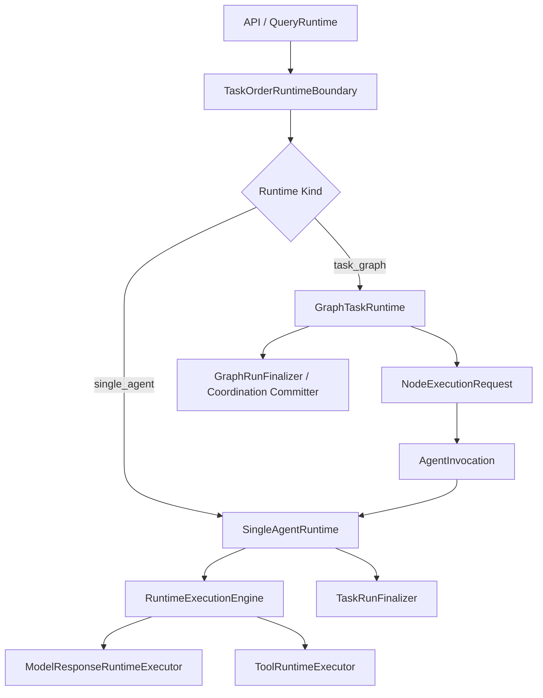

# 双 Runtime 链路收敛重构计划书

日期：2026-05-26

## 1. 背景与目标

当前后端 runtime 已经出现三条实际控制链：

1. 单 agent 链：`QueryRuntime -> TaskRunLoop.run_single_agent_stream -> RuntimeExecutionEngine`
2. professional 长任务链：`TaskRunLoop -> ProfessionalTaskRunDriver -> RuntimeExecutionEngine raw/translate`
3. 图任务/协调链：`TaskRunLoop.start_task_graph_run / LangGraphCoordinationRuntime -> TaskRunLoop._continue_coordination_delivery_stream -> run_single_agent_stream`

这三条链并不是天然都错。真正的问题是：`professional` 被实现成了第三条 runtime loop，而不是单 agent runtime 的长任务控制策略；图任务 runtime 又被挂在 `TaskRunLoop` 内部，导致 `TaskRunLoop` 既像单 agent runtime，又像 graph runtime facade，还像 coordination adapter。

本次重构目标是将后端 runtime 收敛为两条正式链：

```text
SingleAgentRuntime
GraphTaskRuntime
```

其中：

- `SingleAgentRuntime` 是唯一的单 agent 执行链，负责普通对话、标准任务、professional 长任务、图节点 agent 执行。
- `GraphTaskRuntime` 是唯一的图任务运行链，负责图调度、节点状态推进、批处理、monitor、resume、rewind、人类 gate、子图模块。
- `professional` 不再作为独立 runtime 链存在，只作为 `SingleAgentRuntime` 内部的长任务控制策略。
- `RuntimeExecutionEngine` 保留为底层 model/tool 事件执行器，但不拥有任务选择、长任务策略、图调度或 finalization 主权。

## 2. 当前代码事实

### 2.1 请求入口

文件：`backend/query/runtime.py`

当前 `QueryRuntime` 已经在注释中声明自己是 thin adapter，但实际仍然承担：

- 加载 session history。
- 创建/绑定 task order。
- 处理 direct system route。
- 构造 `AgentRuntimeChainAssembler`。
- 调用 `TaskRunLoop.run_single_agent_stream`。
- 根据 runtime event 更新 task order run。

`QueryRuntime` 可以继续作为 API 请求边界，但它不应该知道 `TaskRunLoop` 内部有 graph/professional/coordination 分支。

### 2.2 单 agent loop 当前位置

文件：`backend/runtime/unit_runtime/loop.py`

核心类：`TaskRunLoop`

当前 `TaskRunLoop.run_single_agent_stream` 拥有：

- `RequestFacts / BoundaryPolicy / ContextCandidates / ModelTurnDecision / ActionPermit / RuntimeStartPacket`
- 调用 `AgentRuntimeChainAssembler.build_runtime`
- 构造 `AgentInvocation` 和 `ExecutionPermit`
- 准备 sandbox policy、file management policy、tool capability table
- 创建 `TaskRun / AgentRun / CoordinationRun`
- 判断是否 professional recipe
- 调用 `RuntimeExecutionEngine.stream_model_turn`
- 应用 model/tool event
- follow-up turn loop
- working memory finalization
- task run finalizer
- coordination continuation

这说明 `TaskRunLoop` 已经不是“单 agent loop”，而是大 runtime 总线。它可以作为迁移源，但不应该作为最终结构保留。

### 2.3 professional 长任务当前位置

文件：`backend/runtime/professional_runtime/driver.py`

核心类：`ProfessionalTaskRunDriver`

当前 professional driver 自己拥有：

- model plan binding
- plan coverage gate
- action gate
- evidence packet
- closeout repair
- budget closeout
- protocol leak repair
- 直接调用 `RuntimeExecutionEngine.stream_raw_model_events`
- 再手动调用 `RuntimeExecutionEngine.translate_event`

这使 professional 成为平行 loop。它应被改造成 `SingleAgentRuntime` 的 `RunStrategy`，只声明长任务约束和下一步控制，不拥有独立 model/tool 主循环。

### 2.4 图任务/coordination 当前位置

主要文件：

- `backend/runtime/coordination_runtime/runtime.py`
- `backend/runtime/graph_runtime/scheduler.py`
- `backend/runtime/graph_runtime/batch_runtime.py`
- `backend/runtime/graph_runtime/run_monitor.py`
- `backend/api/orchestration.py`

当前真实图运行核心在 `coordination_runtime.runtime.LangGraphCoordinationRuntime`，而 `graph_runtime` 目录更像 scheduler/batch/monitor 组件库。API 直接访问：

```python
runtime.query_runtime.task_run_loop.langgraph_coordination_runtime
```

这说明 graph runtime 没有稳定 facade，控制面穿透了 `QueryRuntime -> TaskRunLoop` 的内部对象。

## 3. 设计原则

### 3.1 只保留两条 runtime 链

最终正式链路只有：

```text
SingleAgentRuntime
GraphTaskRuntime
```

禁止继续出现：

```text
ProfessionalRuntime as third runtime chain
CoordinationRuntime hidden inside TaskRunLoop
GraphRuntime as monitor-only namespace while real runtime lives elsewhere
```

### 3.2 agent 行为与系统行为分离

agent 行为：

- 理解任务。
- 生成计划。
- 决定下一步语义动作。
- 调用已授权工具。
- 观察工具结果。
- 产出最终回答或任务产物。

系统行为：

- 用户选择任务环境。
- 任务订单决定执行入口。
- 系统装配 agent。
- 系统准备 prompt/context/file/sandbox/tool capability。
- 系统根据工具风险做授权、审批、审计、阻断。
- 系统维护 task run、graph run、checkpoint、artifact、memory finalization。

关键边界：

- agent 可以生成计划，但不能选择任务环境。
- agent 可以请求工具，但不能扩大工具权限。
- professional 可以要求 agent 先计划、再验证、再 closeout，但不能变成第三套 runtime。
- graph runtime 可以调度多个 agent，但不能代替单 agent runtime 执行 model/tool loop。

### 3.3 装配链与执行链分离

`AgentRuntimeChainAssembler` 目前名字容易误导。它不是 runtime loop，而是 agent 装配/上下文装配链。

目标语义：

```text
TaskOrder / TaskEnvironment / SpecificTask
-> AgentInvocationAssembler
-> AgentInvocation
-> SingleAgentRuntime
```

`SingleAgentRuntime` 只消费已经确定的 `AgentInvocation`、`ExecutionPermit`、`RuntimeStartPacket`，不再重新决定 agent、任务环境或图模式。

### 3.4 图任务只调度，不执行 agent 内环

`GraphTaskRuntime` 负责：

- 编译或接收 `TaskGraphRuntimeSpec`
- 初始化 `CoordinationRun`
- 计算 ready/running/blocked/completed
- 生成 `NodeExecutionRequest`
- 生成或引用 `AgentInvocation`
- 调用 `SingleAgentRuntime.run(invocation)`
- 接收 `NodeResultReadyEvent`
- 推进图状态

`GraphTaskRuntime` 不负责：

- model stream
- tool event translation
- professional plan/action/evidence policy
- 单 agent final answer 生成

### 3.5 long task/professional 是策略，不是 runtime

professional 长任务应表达为：

```text
SingleAgentRuntime
  -> RunStrategy
      -> StandardStrategy
      -> ProfessionalStrategy
```

`ProfessionalStrategy` 可以拥有：

- 计划门。
- 证据要求。
- 行动顺序约束。
- closeout 验证。
- repair 指令。
- 长任务轮次控制。

但不能拥有：

- 独立 model stream loop。
- 独立 tool translation loop。
- 独立 finalizer。
- 独立 task run 状态机。

## 4. 目标架构

### 4.1 总体结构



### 4.2 SingleAgentRuntime 固定执行流

```text
SingleAgentRunRequest
-> request facts already sealed or constructed at boundary
-> AgentInvocation
-> ExecutionPermit
-> RuntimeStartPacket
-> prepare system environment
   - prompt context
   - memory view
   - file management policy
   - sandbox policy
   - tool capability table
-> select RunStrategy
   - standard
   - professional
-> model/tool turn loop
-> strategy closeout
-> task result commit
-> memory/artifact finalization
-> done/error event
```

SingleAgentRuntime 是唯一允许调用：

- `RuntimeExecutionEngine.stream_model_turn`
- `RuntimeExecutionEngine.translate_event`
- `ToolRuntimeExecutor`
- `ModelResponseRuntimeExecutor`

的高层 runtime。

### 4.3 GraphTaskRuntime 固定执行流

```text
GraphRunStartRequest
-> TaskGraphRuntimeSpec
-> GraphRun / CoordinationRun initialization
-> scheduler selects ready node
-> build NodeExecutionRequest
-> build AgentInvocation
-> SingleAgentRuntime.run(node invocation)
-> receive NodeResultReadyEvent
-> commit node result
-> update graph state
-> repeat or wait
-> graph final result / merge / terminal state
```

GraphTaskRuntime 可以调用 SingleAgentRuntime，但 SingleAgentRuntime 不可以知道自己处在完整图任务里。它最多接收 node invocation 中的 graph/node refs，用于 trace、artifact、memory scope。

### 4.4 RunStrategy 协议

新增内部策略协议，建议位置：

```text
backend/runtime/single_agent_runtime/strategies/base.py
```

建议接口：

```python
class RunStrategy(Protocol):
    strategy_id: str

    def initialize(self, context: SingleAgentRunContext) -> StrategyState: ...

    def before_turn(self, state: StrategyState, observations: RuntimeObservations) -> TurnControl: ...

    def after_runtime_event(
        self,
        state: StrategyState,
        event: RuntimeEvent,
        observations: RuntimeObservations,
    ) -> StrategyDecision: ...

    def should_continue(self, state: StrategyState, observations: RuntimeObservations) -> ContinueDecision: ...

    def closeout(self, state: StrategyState, observations: RuntimeObservations) -> CloseoutDecision: ...
```

`StandardStrategy`：

- 保持当前普通单 agent 行为。
- 工具结果后 follow-up。
- 没有强制计划门。

`ProfessionalStrategy`：

- 要求 agent 产出任务计划。
- 系统检查计划覆盖度。
- 系统根据目标合同/证据状态决定下一轮必须读、写、验证或 closeout。
- 通过 `TurnControl` 影响下一轮可见工具、tool choice、model stream policy、追加系统提示。
- 不直接调用 model/tool executor。

## 5. 目标目录规划

本计划不使用文件名 `V2`。如果需要临时迁移目录，可以用语义目录名，不用版本号污染长期结构。

目标目录：

```text
backend/runtime/
  single_agent_runtime/
    __init__.py
    runtime.py
    request.py
    context.py
    lifecycle.py
    turn_loop.py
    event_application.py
    finalization.py
    strategies/
      __init__.py
      base.py
      standard.py
      professional.py
      professional_plan_policy.py
      professional_evidence_policy.py
      professional_closeout_policy.py

  graph_task_runtime/
    __init__.py
    runtime.py
    request.py
    scheduler_adapter.py
    node_dispatch.py
    node_result.py
    continuation.py
    graph_finalization.py
    monitor.py
    batch.py

  execution_engine/
    engine.py
    tool_loop.py
    event_translation.py

  agent_assembly/
    ...

  tool_runtime/
    ...

  model_gateway/
    ...

  shared/
    ...
```

迁移完成后：

- `backend/runtime/unit_runtime/loop.py` 不再作为正式入口保留。
- `backend/runtime/professional_runtime/driver.py` 不再保留独立 driver。
- `backend/runtime/coordination_runtime/runtime.py` 不再作为外部直接入口。
- `backend/runtime/graph_runtime/*` 要么迁入 `graph_task_runtime`，要么明确成为 `graph_task_runtime` 内部组件，不再自称另一条 runtime。

## 6. 分阶段实施计划

### Phase 0：基线冻结与风险保护

目标：确认当前主链行为，避免重构中误删真实能力。

动作：

1. 记录当前三条链的入口和测试覆盖。
2. 跑通单 agent、professional、tool authorization、graph task、batch、file/sandbox 相关测试。
3. 标记本轮不动范围：
   - health system 不纳入重构。
   - image generation 单独模型链不纳入本轮。
   - 新任务系统不重写，只调整 runtime 对接边界。

涉及文件：

- `backend/query/runtime.py`
- `backend/runtime/unit_runtime/loop.py`
- `backend/runtime/professional_runtime/driver.py`
- `backend/runtime/coordination_runtime/runtime.py`
- `backend/runtime/graph_runtime/*`
- `backend/api/orchestration.py`

完成标准：

- 明确哪些测试保护单 agent。
- 明确哪些测试保护 professional 长任务。
- 明确哪些测试保护 graph task。
- 不产生代码改动，或只产生审查文档。

### Phase 1：建立 SingleAgentRuntime 外壳

目标：先建立正式单 agent 入口，让后续迁移有目标落点。

新增文件：

- `backend/runtime/single_agent_runtime/__init__.py`
- `backend/runtime/single_agent_runtime/request.py`
- `backend/runtime/single_agent_runtime/runtime.py`
- `backend/runtime/single_agent_runtime/context.py`
- `backend/runtime/single_agent_runtime/lifecycle.py`
- `backend/runtime/single_agent_runtime/turn_loop.py`
- `backend/runtime/single_agent_runtime/finalization.py`

动作：

1. 定义 `SingleAgentRunRequest`，包含：
   - `session_id`
   - `task_id`
   - `user_message`
   - `history`
   - `source`
   - `agent_invocation`
   - `task_selection`
   - `model_response_executor`
   - `tool_runtime_executor`
   - `runtime_context_manager`
   - `assistant_message_committer`
   - `search_policy`
   - `model_selection`
2. 定义 `SingleAgentRunContext`，包含运行中不可随意重算的系统事实：
   - `request_facts`
   - `boundary_policy`
   - `context_candidates`
   - `model_turn_decision`
   - `action_permit`
   - `runtime_start_packet`
   - `agent_invocation`
   - `execution_permit`
   - `task_operation`
   - `resource_policy`
   - `tool_capability_table`
   - `sandbox_policy`
   - `file_management_policy`
3. `SingleAgentRuntime.run_stream` 初期可以搬运 `TaskRunLoop.run_single_agent_stream` 的普通路径，但必须拆成私有组件，不再继续在 `TaskRunLoop` 内增长。
4. 旧 `TaskRunLoop.run_single_agent_stream` 可以短期转发到 `SingleAgentRuntime`，但这个转发只允许作为同一重构计划内的迁移桥，必须在 Phase 7 删除。

禁止：

- 在新 `SingleAgentRuntime` 里重新增加 graph start。
- 在新 `SingleAgentRuntime` 里直接判断 task graph runtime spec 并创建 coordination runtime。
- 在新 `SingleAgentRuntime` 里把 professional 作为外部 runtime 调用。

完成标准：

- 普通单 agent 请求可以通过 `SingleAgentRuntime.run_stream` 完成。
- `QueryRuntime` 仍可临时调用旧方法，但旧方法内部不再拥有新增逻辑。
- 单 agent 相关测试通过。

### Phase 2：把 professional 收敛成 SingleAgentRuntime 策略

目标：切断 professional 第三 runtime 链。

新增/迁移文件：

- `backend/runtime/single_agent_runtime/strategies/base.py`
- `backend/runtime/single_agent_runtime/strategies/standard.py`
- `backend/runtime/single_agent_runtime/strategies/professional.py`
- `backend/runtime/single_agent_runtime/strategies/professional_plan_policy.py`
- `backend/runtime/single_agent_runtime/strategies/professional_evidence_policy.py`
- `backend/runtime/single_agent_runtime/strategies/professional_closeout_policy.py`

迁移来源：

- `backend/runtime/professional_runtime/action_gate.py`
- `backend/runtime/professional_runtime/agent_plan.py`
- `backend/runtime/professional_runtime/plan_coverage.py`
- `backend/runtime/professional_runtime/evidence_closeout.py`
- `backend/runtime/professional_runtime/closeout_repair.py`
- `backend/runtime/professional_runtime/completion_judgment.py`
- `backend/runtime/professional_runtime/goal_contract.py`
- `backend/runtime/professional_runtime/deliverable_progress.py`

动作：

1. 保留 professional 的计划、证据、验证、closeout 算法，但改变调用方向：

   当前：

   ```text
   ProfessionalTaskRunDriver -> stream_raw_model_events -> translate_event
   ```

   目标：

   ```text
   SingleAgentRuntime.turn_loop -> Strategy.before_turn / after_runtime_event / closeout
   ```

2. `ProfessionalStrategy` 只返回控制信号：
   - 本轮必须做计划。
   - 本轮必须读材料。
   - 本轮必须写产物。
   - 本轮必须验证。
   - 本轮可以 closeout。
   - 本轮工具选择限制。
   - 本轮追加给 agent 的可理解提示。

3. `SingleAgentRuntime` 统一负责：
   - 调 model。
   - 翻译 tool call。
   - 写 event log。
   - 写 checkpoint。
   - 处理 approval waiting。
   - finalizer。

4. 删除或迁移 `ProfessionalTaskRunDriver.run_stream` 中的独立循环。

禁止：

- `ProfessionalStrategy` 调用 `RuntimeExecutionEngine.stream_raw_model_events`。
- `ProfessionalStrategy` 直接写 task terminal state。
- `ProfessionalStrategy` 直接调用 task run finalizer。
- 为 professional 保留单独 runtime 入口。

完成标准：

- professional 模式仍能要求 agent 先生成计划。
- professional 长任务仍能强制证据和验证。
- professional 工具权限仍来自统一 `tool_capability_table` 和 `ExecutionPermit`。
- `rg "ProfessionalTaskRunDriver(" backend` 无正式运行调用。
- professional 回归测试通过。

### Phase 3：拆出 SingleAgentRuntime 的生命周期与事件应用

目标：从 `TaskRunLoop` 中切出真实单 agent 运行骨架，降低单文件复杂度。

迁移内容：

1. lifecycle：
   - 创建 `TaskRun`
   - 创建 `AgentRun`
   - 写 `task_run_started`
   - 写初始 checkpoint

2. event application：
   - model answer event
   - tool call requested event
   - tool observation event
   - executor error event
   - approval waiting
   - repeated tool halt

3. finalization：
   - assistant message commit
   - task result commit
   - working memory finalization
   - artifact finalization
   - terminal event

涉及文件：

- 从 `backend/runtime/unit_runtime/loop.py` 迁移到：
  - `backend/runtime/single_agent_runtime/lifecycle.py`
  - `backend/runtime/single_agent_runtime/event_application.py`
  - `backend/runtime/single_agent_runtime/finalization.py`

保留共享组件：

- `backend/runtime/execution_engine/*`
- `backend/runtime/tool_runtime/*`
- `backend/runtime/model_gateway/*`
- `backend/runtime/shared/*`
- `backend/runtime/memory/*`

完成标准：

- `TaskRunLoop` 不再包含普通单 agent model/tool 主循环。
- `SingleAgentRuntime` 拥有唯一单 agent finalization。
- 普通链和 professional 链共用同一 finalization。

### Phase 4：建立 GraphTaskRuntime 外壳

目标：把图任务从 `TaskRunLoop` 内部独立出来，成为第二条正式 runtime 链。

新增文件：

- `backend/runtime/graph_task_runtime/__init__.py`
- `backend/runtime/graph_task_runtime/request.py`
- `backend/runtime/graph_task_runtime/runtime.py`
- `backend/runtime/graph_task_runtime/scheduler_adapter.py`
- `backend/runtime/graph_task_runtime/node_dispatch.py`
- `backend/runtime/graph_task_runtime/node_result.py`
- `backend/runtime/graph_task_runtime/continuation.py`
- `backend/runtime/graph_task_runtime/graph_finalization.py`
- `backend/runtime/graph_task_runtime/monitor.py`
- `backend/runtime/graph_task_runtime/batch.py`

迁移来源：

- `TaskRunLoop.start_task_graph_run`
- `TaskRunLoop._continue_coordination_delivery_stream`
- `LangGraphCoordinationRuntime.initialize`
- `LangGraphCoordinationRuntime.resume_from_task_result`
- `LangGraphCoordinationRuntime.resume_human_gate`
- `LangGraphCoordinationRuntime.dispatch_ready_batch_requests`
- `LangGraphCoordinationRuntime.rewind_from_stage`
- `graph_runtime.scheduler`
- `graph_runtime.batch_runtime`
- `graph_runtime.run_monitor`

动作：

1. 新增 `GraphTaskRuntime`，构造时接收：
   - `state_index`
   - `event_log`
   - `checkpoint_store`
   - `coordination_checkpoint_store`
   - `task_flow_registry`
   - `artifact_repository`
   - `single_agent_runtime`

2. `GraphTaskRuntime.start_run` 接收：
   - `session_id`
   - `graph`
   - `runtime_spec`
   - `initial_inputs`
   - `diagnostics`

3. `GraphTaskRuntime` 初始化 graph run 后生成第一个 `NodeExecutionRequest`。

4. `GraphTaskRuntime.dispatch_node` 将 `NodeExecutionRequest` 转成 `AgentInvocation`，然后调用：

   ```python
   single_agent_runtime.run_stream(SingleAgentRunRequest(...))
   ```

5. `GraphTaskRuntime` 接收节点完成事件后生成 `NodeResultReadyEvent`，推进 graph state。

6. 将 API 的 graph 操作全部改到 `runtime.graph_task_runtime` facade，不再访问 `query_runtime.task_run_loop.langgraph_coordination_runtime`。

禁止：

- `GraphTaskRuntime` 直接调用 `RuntimeExecutionEngine`。
- `GraphTaskRuntime` 直接调用 `ToolRuntimeExecutor`。
- `GraphTaskRuntime` 自己生成 final answer。
- `GraphTaskRuntime` 通过 `TaskRunLoop._continue_coordination_delivery_stream` 递归执行节点。

完成标准：

- task graph start/resume/rewind/dispatch batch 都通过 `GraphTaskRuntime`。
- `backend/api/orchestration.py` 不再穿透 `query_runtime.task_run_loop.langgraph_coordination_runtime`。
- graph 节点 agent 执行与普通单 agent 共用 `SingleAgentRuntime`。

### Phase 5：入口收口与 RuntimeRouter

目标：让上层只面对明确的 runtime boundary。

新增/调整：

- `backend/query/runtime.py`
- `backend/runtime/runtime_router.py` 或 `backend/runtime/boundary.py`

目标入口：

```text
QueryRuntime.astream
-> TaskOrderRuntimeBoundary
-> RuntimeRouter
   -> SingleAgentRuntime
   -> GraphTaskRuntime
```

动作：

1. `QueryRuntime` 只负责：
   - session history
   - task order creation/binding
   - direct system route
   - 调 runtime router
   - 将结果流转给 API

2. `RuntimeRouter` 根据系统已确定的订单和任务环境选择：
   - `single_agent`
   - `task_graph`

3. `RuntimeRouter` 不允许调用模型来决定 runtime kind。

4. 用户任务环境选择、具体任务配置、agent 装配要求都在任务系统/任务环境层完成，runtime 只消费结果。

完成标准：

- `QueryRuntime` 不再 new 或直接访问 graph coordination runtime。
- runtime kind 选择来自系统订单/任务环境，不来自 agent 自己判断。
- 单会话任务和图任务入口都稳定。

### Phase 6：旧结构删除与导入清理

目标：最终代码只留下两条正式 runtime 链，不保留无用旧壳。

删除/改造规则：

1. 删除 `TaskRunLoop` 作为 runtime 总入口。
   - 如果仍需要状态读写/trace reader，抽到 shared service。
   - 不允许保留 `TaskRunLoop` 兼容旧 runtime 行为。

2. 删除 `ProfessionalTaskRunDriver` 独立 driver。
   - professional 算法迁移到 strategy/policy 后，旧 driver 文件删除。

3. 删除或合并 `coordination_runtime` 外部入口。
   - 只保留被 `GraphTaskRuntime` 内部使用的组件。
   - 如果目录保留，必须改名/重组为 graph task 内部组件，不作为第三 runtime。

4. 清理测试。
   - 删除只保护旧内部结构的测试。
   - 保留或改写保护真实行为的测试。

5. 清理导出。
   - `backend/runtime/__init__.py` 不再导出 `TaskRunLoop` 作为正式入口。
   - 不再导出 `ProfessionalTaskRunDriver` 作为运行入口。

完成标准：

- `rg "TaskRunLoop" backend` 只允许出现在迁移说明、历史文档或已改名后的状态读工具中；不允许作为 runtime 入口。
- `rg "ProfessionalTaskRunDriver" backend` 无正式运行调用。
- `rg "langgraph_coordination_runtime" backend/api backend/query` 无直接访问。
- runtime 目录中只有 `single_agent_runtime` 和 `graph_task_runtime` 是高层 runtime。

### Phase 7：测试矩阵与最终验收

目标：确认两条链真实可用，不是靠旧结构兜底。

建议测试：

```powershell
python -m compileall -q backend/runtime backend/query backend/api backend/agent_system backend/task_system

pytest -q backend/tests/context_recall_runtime_regression.py
pytest -q backend/tests/model_response_runtime_regression.py
pytest -q backend/tests/tool_authorization_regression.py
pytest -q backend/tests/runtime_tool_capability_policy_regression.py
pytest -q backend/tests/file_management_policy_regression.py
pytest -q backend/tests/sandbox_policy_regression.py
pytest -q backend/tests/professional_mode_runtime_regression.py
pytest -q backend/tests/professional_task_run_regression.py
pytest -q backend/tests/main_agent_natural_delegation_regression.py backend/tests/agent_delegation_permission_regression.py
pytest -q backend/tests/task_graph_batch_runtime_regression.py
pytest -q backend/tests/task_system_api_regression.py
pytest -q backend/tests/task_graph_run_monitor_test.py
```

如果 `professional_task_run_regression.py` 过重，可以先跑关键 professional tests，再跑全量 professional 套件作为最终验收。

最终验收标准：

- 普通单 agent 可完成一问一答和工具调用。
- professional 长任务走同一 SingleAgentRuntime，但仍有计划、证据、验证、closeout 能力。
- 图任务节点执行走 SingleAgentRuntime。
- 图任务调度、batch、resume、rewind、monitor 走 GraphTaskRuntime。
- 没有第三条 professional runtime 链。
- API 不再穿透 runtime 内部字段。
- 所有旧 runtime 入口被删除或改为明确内部组件。

## 7. 文件级执行清单

### 7.1 新增

- `backend/runtime/single_agent_runtime/__init__.py`
- `backend/runtime/single_agent_runtime/request.py`
- `backend/runtime/single_agent_runtime/context.py`
- `backend/runtime/single_agent_runtime/runtime.py`
- `backend/runtime/single_agent_runtime/lifecycle.py`
- `backend/runtime/single_agent_runtime/turn_loop.py`
- `backend/runtime/single_agent_runtime/event_application.py`
- `backend/runtime/single_agent_runtime/finalization.py`
- `backend/runtime/single_agent_runtime/strategies/__init__.py`
- `backend/runtime/single_agent_runtime/strategies/base.py`
- `backend/runtime/single_agent_runtime/strategies/standard.py`
- `backend/runtime/single_agent_runtime/strategies/professional.py`
- `backend/runtime/graph_task_runtime/__init__.py`
- `backend/runtime/graph_task_runtime/request.py`
- `backend/runtime/graph_task_runtime/runtime.py`
- `backend/runtime/graph_task_runtime/node_dispatch.py`
- `backend/runtime/graph_task_runtime/node_result.py`
- `backend/runtime/graph_task_runtime/continuation.py`
- `backend/runtime/graph_task_runtime/graph_finalization.py`
- `backend/runtime/graph_task_runtime/monitor.py`
- `backend/runtime/runtime_router.py`

### 7.2 重写/迁移

- `backend/query/runtime.py`
  - 从直接调用 `TaskRunLoop` 改为调用 runtime router。

- `backend/runtime/unit_runtime/loop.py`
  - 迁移单 agent 生命周期、turn loop、finalizer 后删除或降级为临时迁移文件。

- `backend/runtime/professional_runtime/driver.py`
  - 拆成 professional strategy/policy 后删除。

- `backend/runtime/coordination_runtime/runtime.py`
  - 拆为 graph task runtime 内部 coordination engine。

- `backend/runtime/graph_runtime/scheduler.py`
  - 合入 `graph_task_runtime/scheduler_adapter.py` 或作为内部组件引用。

- `backend/runtime/graph_runtime/batch_runtime.py`
  - 合入 `graph_task_runtime/batch.py` 或作为内部组件引用。

- `backend/runtime/graph_runtime/run_monitor.py`
  - 合入 `graph_task_runtime/monitor.py`。

- `backend/api/orchestration.py`
  - 只调用 `GraphTaskRuntime` facade。

- `backend/runtime/__init__.py`
  - 导出新的 `SingleAgentRuntime` 和 `GraphTaskRuntime`。
  - 删除旧 runtime 入口导出。

### 7.3 测试改写

需要改写导入或断言的测试：

- `backend/tests/query_runtime_runtime_loop_regression.py`
- `backend/tests/runtime_recovery_idempotency_regression.py`
- `backend/tests/runtime_tool_result_step_transition_regression.py`
- `backend/tests/tool_authorization_regression.py`
- `backend/tests/professional_mode_runtime_regression.py`
- `backend/tests/professional_task_run_regression.py`
- `backend/tests/task_graph_batch_runtime_regression.py`
- `backend/tests/task_system_api_regression.py`

原则：

- 测试保护行为，不保护旧文件名。
- 删除只保护 `TaskRunLoop` 内部形状的测试。
- 保留保护 runtime event、tool auth、professional evidence、graph scheduling 的测试。

## 8. 数据与事件合同

### 8.1 SingleAgentRunRequest

必须是单 agent runtime 的唯一入口结构，禁止散参数继续膨胀。

核心字段：

- `session_id`
- `task_id`
- `user_message`
- `history`
- `source`
- `agent_invocation`
- `runtime_start_packet`
- `task_order_ref`
- `task_environment_ref`
- `model_response_executor`
- `tool_runtime_executor`
- `runtime_context_manager`
- `assistant_message_committer`

### 8.2 SingleAgentRunResult

核心字段：

- `task_run_id`
- `agent_run_id`
- `status`
- `terminal_reason`
- `final_content`
- `task_result_ref`
- `artifact_refs`
- `memory_refs`
- `events`
- `node_result_ready_event` 可选，仅当由 GraphTaskRuntime 调用时返回。

### 8.3 GraphRunRequest

核心字段：

- `session_id`
- `graph_id`
- `task_id`
- `runtime_spec`
- `initial_inputs`
- `task_environment_ref`
- `diagnostics`

### 8.4 NodeExecutionRequest

继续作为 graph 到 single agent 的边界，但必须满足：

- 含 `coordination_run_id`
- 含 `stage_id`
- 含 `node_id`
- 含 `task_ref`
- 含 `executor_type`
- 含 `standard_input_package`
- 含 `runtime_control`
- 可以构造 `AgentInvocation`

GraphTaskRuntime 只能通过这个结构向 SingleAgentRuntime 交付节点任务。

## 9. 迁移与切换规则

### 9.1 临时重叠窗口

允许短期存在旧文件与新文件同时存在，但必须满足：

- 旧文件只转发，不拥有新增逻辑。
- 每个临时转发点必须在同一计划的后续阶段删除。
- 不允许以“兼容”为理由长期保留旧 runtime 链。

### 9.2 切换顺序

推荐切换顺序：

```text
普通 single agent
-> professional strategy
-> graph node execution
-> graph start/resume/rewind API
-> old runtime deletion
```

原因：

- professional 必须依附单 agent runtime。
- graph task 节点也必须依附单 agent runtime。
- 所以先稳定 SingleAgentRuntime，再切 GraphTaskRuntime。

### 9.3 回滚规则

本项目不应长期保留双实现兜底，但实施过程中每个 phase 需要可定位失败点：

- Phase 1 失败：回到 `TaskRunLoop.run_single_agent_stream`，不切入口。
- Phase 2 失败：professional strategy 未切入口，旧 professional driver 不删除。
- Phase 4 失败：graph API 不切到 GraphTaskRuntime。
- Phase 6 开始后不允许回滚到旧链，必须修复新链。

这不是保留旧逻辑，而是阶段内切换保护。每阶段完成后必须删除该阶段对应旧入口。

## 10. 禁止事项

1. 禁止把 professional 继续作为 `ProfessionalRuntime` 或独立 runtime driver。
2. 禁止在 `GraphTaskRuntime` 内直接调用 model/tool executor。
3. 禁止让 agent 选择任务环境。
4. 禁止 API 穿透访问 `query_runtime.task_run_loop.langgraph_coordination_runtime`。
5. 禁止为兼容旧测试保留旧 runtime 行为。
6. 禁止在 prompt 中写开发说明式文本。给 agent 的 prompt 必须是角色、职责、边界、裁决标准。
7. 禁止把图任务和单 agent 的 finalizer 分散成多套终态逻辑。
8. 禁止用空结果、假事件、跳过验证来让测试通过。

## 11. 成熟架构对照

成熟 agent 架构中，子任务/长任务通常不是第三套 runtime，而是：

- 主 runtime 管生命周期。
- strategy/policy 管任务控制。
- tool gateway 管权限和风险。
- graph scheduler 管多 agent 编排。
- node execution 仍回到同一个 agent executor。

本项目应采用同类原则：

```text
System decides environment/order.
Agent decides semantic action.
Runtime executes and records.
Permission system authorizes tools.
Graph runtime schedules agents.
SingleAgentRuntime executes agents.
```

## 12. 最终目标状态

重构完成后，后端 runtime 的概念应能用一句话解释：

> 平台只有两条 runtime 链：单 agent runtime 负责一个 agent 如何运行，图任务 runtime 负责多个 agent 如何协作；professional 长任务不是第三条链，而是单 agent runtime 的长任务控制策略。

最终主链：

```text
QueryRuntime
-> RuntimeRouter
-> SingleAgentRuntime
-> RuntimeExecutionEngine
-> Model/Tool Gateway
```

最终图链：

```text
Orchestration API / TaskOrder
-> RuntimeRouter
-> GraphTaskRuntime
-> NodeExecutionRequest
-> SingleAgentRuntime
-> NodeResultReadyEvent
-> GraphTaskRuntime resume
```

只要代码结构仍然无法清楚表达这两条链，就说明重构没有完成。
