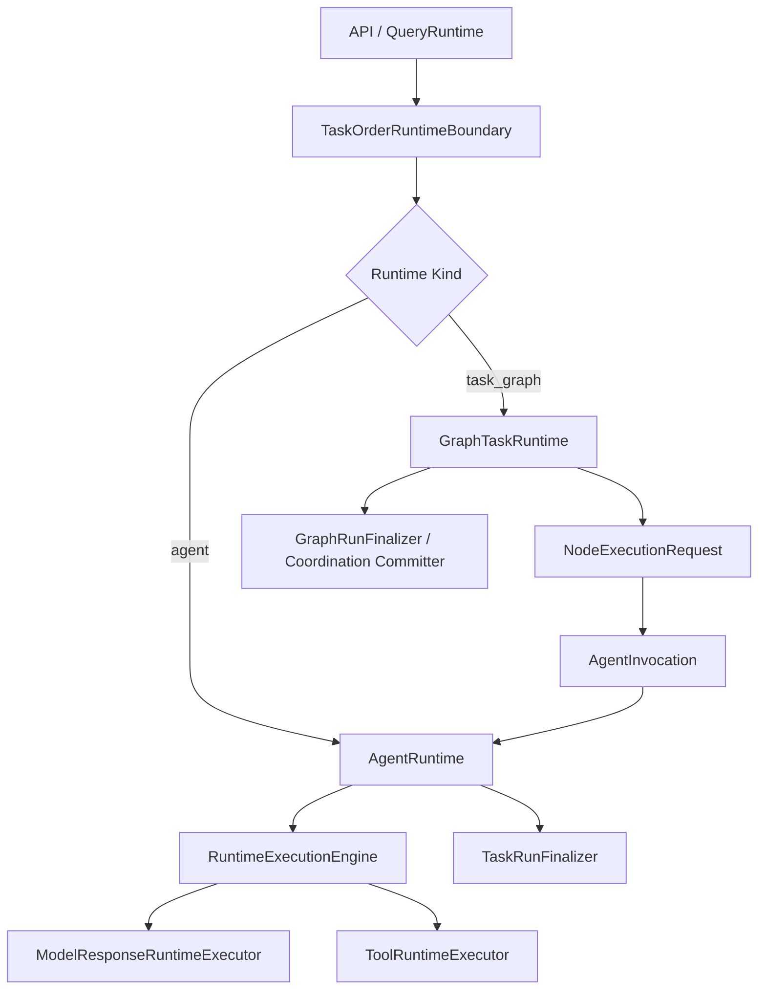

# 双 Runtime 链路收敛重构计划书

日期：2026-05-26

修订日期：2026-05-27

## 0A. 2026-05-27 当前执行窗口：图任务冻结，先完成单 AgentRuntime

本次用户明确调整优先级：图任务链先不纳入当前清理实施，不迁移 `coordination_runtime`，不清理 `graph_runtime`，不改写图任务 API 主链。当前窗口只处理图任务以外的 runtime 重构，目标是把“一个 agent invocation 如何运行”这条链真正做干净。

当前执行范围：

```text
QueryRuntime / API adapter
-> AgentRuntime
   -> request facts / boundary / context candidates
   -> model-owned turn decision
   -> action permit
   -> runtime start packet
   -> agent invocation assembly
   -> execution permit
   -> environment policy
      - tool capability table
      - file management policy
      - sandbox policy
   -> mode/config/phase policy
   -> model/tool turn loop
   -> follow-up loop
   -> closeout / artifact / memory finalization
```

当前不处理范围：

- 不重构 `GraphTaskRuntime` 的调度、resume、rewind、batch、monitor。
- 不迁移 `LangGraphCoordinationRuntime` 内部大逻辑。
- 不删除图任务测试。
- 不清理图任务入口的旧 facade，除非它直接阻塞单 agent runtime。
- 不碰 image generation 独立模型链。
- 不碰 health system。

### 0A.1 成熟 Agent 模型差距倒推

成熟 agent runtime 的主链应当是单向授权链：

```text
RequestFacts
-> BoundaryPolicy
-> ContextCandidates
-> ModelTurnDecision
-> ActionPermit
-> RuntimeStartPacket
-> AgentInvocation / ExecutionPermit
-> RuntimeEnvironment
-> ExecutionLoop
-> Finalization
```

当前代码已经完成的部分：

- `backend/agent_runtime/understanding/request_facts.py` 已经将用户输入归一为事实，并声明不选择 intent。
- `backend/agent_runtime/understanding/model_turn_decision_runtime.py` 已经把本轮语义决策交给模型；失败策略是 fail-closed，而不是旧分类器硬猜。
- `backend/runtime/agent_runtime/config/*` 与 `policies/__init__.py` 已把 `professional / standard / role` 表达为配置组合。
- `backend/runtime/agent_runtime/phases/*` 已把 professional 计划/验证能力迁出独立 runner。
- 工具权限、沙盒、文件管理已经有环境层模块雏形。

当前主要差距：

| 理想层 | 当前事实 | 差距 | 当前窗口动作 |
|---|---|---|---|
| RequestFacts / BoundaryPolicy / ModelTurnDecision | 已在 `backend/agent_runtime/understanding/*` 建立 | 仍与后续 assembly/loop 连接松散 | 保留并把输出封进 `RuntimeStartPacket` 与 assembly |
| AgentInvocation / ExecutionPermit | 在 `invocation_loop.py` 中临时展开 | 组装逻辑散在 1000+ 行主函数里 | 抽成 `AgentRuntimeAssembly` |
| RuntimeEnvironment | sandbox/file/tool policy 已有模块 | 环境策略和 turn loop 混在一起 | 抽到 assembly/environment 准备阶段 |
| ExecutionLoop | `run_agent_model_turn` 可复用 | 首轮和 follow-up 参数重复，loop 权力不清 | 抽 `turn_loop.py` |
| Finalization | `finalize_agent_run` 已存在 | `TaskRunFinalizer` 仍强依赖旧宿主和图任务 | 先收单 agent finalization 对接，图任务部分冻结 |
| Runtime owner | `AgentRuntime` 名义存在 | 仍包着 `TaskRunLoop` | 建立 `AgentRuntimeServices`，降级旧宿主 |
| Delegation | `delegate_to_agent` 作为工具请求存在 | 需要确认不绕开权限和 agent 工厂 | 独立审查 delegation 边界 |

当前窗口的核心判断标准：

- 任何“理解用户要做什么”的决定，应来自模型拥有的 `ModelTurnDecision` 或用户/任务系统显式选择，不能来自旧 deterministic classifier。
- 任何“是否允许做”的决定，应来自 `BoundaryPolicy / ActionPermit / ExecutionPermit / OperationGate / ToolSupervisor`，不能由 tool executor 自己放行。
- 任何“运行哪个 agent、给什么工具、开不开 sandbox、能管理哪些文件”的决定，应来自系统装配和任务环境，不来自 agent 自己。
- 任何“professional 更强”的行为，只能表现为更严格的 planning/evidence/verification/closeout policy，不能表现为另一条 loop。
- 任何“子 agent”的执行，都必须是主 agent 请求、系统授权、agent factory 装配、AgentRuntime 执行，而不是 executor 私自创建一条隐藏 runtime。

2026-05-27 补充验收口径：代码量和文件数量只作为结构病灶的诊断信号，不作为最终目标。当前窗口真正的验收目标是 agent 运行循环必须闭合：

```text
ModelTurnDecision
-> first model turn
-> tool_call_requested
-> system authorization / tool execution
-> tool observation as ToolMessage
-> follow-up model turn
-> final answer metadata / run_outcome
-> task_result.completion
```

如果工具观察后的第二轮模型回答没有成为最终 `done.content`，或者第二轮完成态没有进入 `done.completion` 与 `done.task_result.completion`，即使代码行数下降也视为重构失败。

本窗口结束标准不是“双 runtime 全部完成”，而是：

- `AgentRuntime` 不再只是 `TaskRunLoop` 薄包装。
- `TaskRunLoop` 对单 agent 链只保留 durable service host 能力，不再拥有 agent 主循环主权。
- `invocation_loop.py` 不再是 1200 行以上的大总线。
- `professional / standard / role` 全部是 `AgentRuntimeConfig` 装配结果，不存在独立 runner 或隐性分支链。
- 工具权限、文件管理、沙盒策略都在系统环境层准备，并在工具调用时由统一监督/许可执行。
- 工具调用后的 follow-up 模型轮次必须能更新最终回答、answer metadata 和结构化 completion，不允许保留首轮旧状态。
- 子 agent delegation 仍可作为 agent 工具请求存在，但授权、装配、执行必须走系统 agent factory / execution permit / AgentRuntime 边界。

## 0. 2026-05-27 复审结论与当前统计

本轮复审后的结论已经变化：旧 professional 独立控制链已经从正式 runtime 中切除，`professional_mode` 不再选择另一条 runner，而是 `AgentRuntimeConfig` 的一组 phase/policy 配置。当前剩余问题不再是“第三条 professional runtime 还活着”，而是 `AgentRuntime` 主循环仍偏厚，部分系统装配、上下文整理、环境准备、模型/工具 turn、follow-up、收口仍聚集在一个大函数中。

当前正式目标链保持为：

```text
QueryRuntime / RuntimeRouter
-> AgentRuntime
   -> config/policy
   -> phase pipeline
   -> unified model/tool turn loop
   -> finalization

GraphTaskRuntime
-> NodeExecutionRequest
-> AgentRuntime
```

`professional_mode` 的当前定位：

```text
professional_mode != professional runner
professional_mode == AgentRuntimeConfig + AgentRuntime phase pipeline
```

### 0.1 当前代码量统计

统计口径：当前工作树源码文件，统计 `.py` 行数，排除 `__pycache__` 和 `.pyc`。

| 范围 | 文件数 | 行数 | 结论 |
|---|---:|---:|---|
| `backend/runtime/agent_runtime/` | 32 | 8294 | 主循环已瘦身为串接器；preflight 已拆成 environment / admission / context 三段系统准备 |
| `backend/runtime/agent_runtime/phases/` | 3 | 1337 | planning / verification phase 仍是配置化 professional 能力，不是独立 runtime |
| `backend/runtime/graph_task_runtime/` | 4 | 562 | 图任务链冻结；本轮只保留现状，不迁移调度权 |
| `backend/runtime/unit_runtime/` | 4 | 4305 | 已降级为 durable service host / 图任务旧宿主，但仍是后续服务拆分对象 |
| `backend/runtime/shared/` | 20 | 4325 | 共享服务体量可接受，但不得承接 agent 行为决策 |
| `backend/runtime/execution/` | 10 | 2724 | delegation 补齐 child operation gate；prompt/review/result policy 已从 executor 拆出 |
| `backend/query/` | 4 | 901 | API/runtime adapter 仍需继续收口到明确 boundary |

当前最大文件：

| 文件 | 行数 | 判断 |
|---|---:|---|
| `backend/runtime/unit_runtime/loop.py` | 2271 | 图任务冻结下暂保留为 durable service host；不得重新成为单 agent runtime |
| `backend/runtime/agent_runtime/runtime_preflight.py` | 699 | 预模型系统准备串接器；environment/admission/context 已拆出，当前低于 800 红线 |
| `backend/runtime/execution/agent_delegation_executor.py` | 660 | delegation 编排器；授权、复核 prompt、结果质量策略已外置 |
| `backend/runtime/agent_runtime/invocation_loop.py` | 515 | 已从大总线降为串接器，当前可接受 |
| `backend/runtime/agent_runtime/turn_loop.py` | 486 | model/tool turn loop 聚合，职责集中 |
| `backend/runtime/agent_runtime/runtime_assembly.py` | 235 | 系统装配职责集中，不执行 model/tool/finalization |
| `backend/runtime/execution/delegation_result_policy.py` | 288 | delegation 结果质量、父观察、handle 归一 |
| `backend/runtime/execution/delegation_policy.py` | 221 | delegation required operations 与 child operation gate policy |
| `backend/runtime/agent_runtime/context_preflight.py` | 184 | stage projection、context snapshot、不变量检查 |
| `backend/runtime/execution/delegation_review.py` | 152 | 子 agent 复核 prompt、模型复核解析、复核类型判断 |

### 0.2 本轮已切除或合并的负赘结构

已删除或迁移：

- 删除旧 professional runner/control helper：`state_machine.py`、`run_session.py`、`runtime_policy.py`、`action_gate.py`、`closeout_repair.py`、`deliverable_progress.py`、`evidence_closeout.py`、`progress_policy.py`、`stage_summary.py`、`timeout_recovery.py`。
- 删除旧 professional runner 保护测试：`agent_runtime_professional_control_regression.py`、`professional_state_machine_regression.py`、`agent_runtime_professional_feedback_regression.py`。
- 删除 `backend/runtime/agent_runtime/professional/` 源码目录；保留能力迁入 `backend/runtime/agent_runtime/phases/`。
- `agent_todo` 从 professional 私有能力迁到 `backend/runtime/agent_runtime/agent_todo.py`，作为 agent 可选工具能力，而不是 professional 控制器要求。
- `policies` 下 6 个十几行的小文件合并为 `backend/runtime/agent_runtime/policies/__init__.py`。
- `config/mode_policy.py` 与 `config/presets.py` 合并进 config/policy 的集中职责。
- `invocation_loop.py` 底部 payload 解析、边界诊断、运行装配 helper 迁入 `context.py`，主 loop 从 2018 行降到 1487 行。
- `invocation_loop.py` 继续拆出 `runtime_assembly.py`、`runtime_preflight.py`、`turn_loop.py`，主 loop 从 1487 行降到 515 行，只保留串接权。
- `AgentRuntimeServices` 已显式化服务表，`AgentRuntime` 不再接收 `task_run_loop` 构造参数；旧 `TaskRunLoop` 只作为服务来源。
- `delegate_to_agent` 仍作为 agent 工具请求，但子 agent 专业能力执行前新增 `child_agent_operation_gate_checked`，并检查完整 required operations。
- 委派类型到 operation/MCP route 的映射从 `child_agent_runtime_executor.py` 抽为 `execution/delegation_policy.py`，避免授权层和执行层各自维护一套判断。
- `runtime_preflight.py` 的 stage projection、context policy、context snapshot、不变量检查迁入 `backend/runtime/agent_runtime/context_preflight.py`，preflight 降为系统准备串接器。
- `agent_delegation_executor.py` 的复核 prompt、model-only review 解析迁入 `backend/runtime/execution/delegation_review.py`。
- `agent_delegation_executor.py` 的质量门、父观察、context writeback hints、handle 归一迁入 `backend/runtime/execution/delegation_result_policy.py`。
- `agent_evidence_packet_regression.py` 改为验证 `delegation_review.child_system_prompt` 行为，不再要求 prompt helper 留在 executor 私有实现里。
- `search_policy_runtime_regression.py` 改为验证 `context.resolve_runtime_search_sources` 行为，不再保护旧 `invocation_loop` 内部函数位置。
- `turn_loop.py` 修复工具 follow-up 后结构化 `run_outcome` 未同步到最终收口的问题。
- `model_turn_effects.py` 保留上游 `done` 事件中的结构化 `completion/run_outcome`，系统只对接 agent 输出，不自行编造完成态。
- `query_runtime_runtime_loop_regression.py` 新增真实 `path_exists` 工具 follow-up 回归，保护第二轮模型回答和完成态进入最终 `task_result.completion`。
- 前端 `ProfessionalRunSessionPage` 改为 `AgentRuntimePhaseMonitorPage`，导航 key 从 `professional-run` 改为 `agent-runtime-phase`。
- 健康系统旧 `professional_task_*` 事件特判删除，不再为旧事件合同保留兼容分支。

### 0.3 当前控制链判断

当前单 agent 链的合法职责分布：

| 层 | 当前文件 | 合法职责 | 不允许 |
|---|---|---|---|
| config/policy | `config/`, `policies/` | 将 interaction mode 解析为 phase/policy | 选择 runtime runner |
| context/boundary | `context.py`, `turn_context.py` | 组装请求事实、agent invocation、边界诊断、上下文候选 | 改写用户意图或扩大权限 |
| environment | `environment/*` | sandbox、file management、tool capability 环境准备 | 直接替 agent 决定语义动作 |
| phase pipeline | `phase_pipeline.py`, `phases/*` | planning/evidence/verification/closeout phase | 独立 model/tool loop |
| invocation loop | `invocation_loop.py` | 串接 AgentRuntime 生命周期与 model/tool turn | 再引入 mode runner 分支 |
| context preflight | `context_preflight.py` | stage projection、检索后 context policy、context snapshot、不变量检查 | 选择 agent、扩大权限、执行 model/tool |
| finalization | `finalization.py` | 写终态、消息、产物、记忆收口 | 重新判断任务环境或 runtime kind |
| delegation policy | `execution/delegation_policy.py` | 定义委派类型、required operations、child gate policy | 执行子 agent 或绕过工具监督 |
| delegation review | `execution/delegation_review.py` | 子 agent 复核 prompt、model-only review 解析 | 记录运行状态或放行工具 |
| delegation result policy | `execution/delegation_result_policy.py` | 委派结果质量门、父观察、handle/writeback hints 归一 | 执行子 agent 或重新授权 |
| delegation executor | `execution/agent_delegation_executor.py` | 记录委派请求、创建子 AgentRun、检查 child operation gate、调用 child executor、记录结果 | 私自放行子 agent 内部能力 |

### 0.4 代码量治理红线

本项目后续 runtime 清理必须同时看“逻辑权力”和“代码量形态”：

- 一个模块如果没有清晰职责位置：`observe / normalize / retrieve / decide / authorize / assemble / execute / recover / record / present`，必须删除、合并或迁移。
- 十几行的小文件不能因为概念命名就单独存在；同一职责的小 policy、preset、schema、request helper 应合并。
- 单文件超过 800 行必须有明确理由；超过 1200 行默认视为结构堵点，需要拆出生命周期、turn loop、上下文装配、事件应用或 finalization。
- 旧事件、旧测试、旧兼容分支不作为“稳定性”保留；如果只是在保护旧链路名字或旧内部形态，必须删除。
- phase/helper 可以保留算法复杂度，但不能拥有 runtime 主权，不能直接调用底层 model/tool raw loop。

### 0.5 下一步剩余堵点

下一轮优先级：

1. 审查 `unit_runtime/loop.py` 与 `unit_runtime/finalizer.py`：当前未发现旧单 agent 主循环复活，但它仍是 2271 行的 service host / 图任务旧宿主；后续只能拆服务能力，不得重建旧 agent loop。
2. 继续把测试从“旧文件名/旧内部形态”改为“runtime 事件合同与行为结果”。
3. 若继续清理 single-agent 链，优先审查 `finalization.py` 与 `event_application.py` 是否仍存在跨层决策，而不是继续拆已经低于红线的 preflight/executor。
4. 暂不迁移图任务；如果图任务测试因 service host 变化失败，只修服务注入，不重构调度。

当前暂缓项：

- `GraphTaskRuntime` 接管图任务入口暂缓到下一轮；本轮不以 `rg "langgraph_coordination_runtime"` 清零作为验收条件。
- `coordination_runtime` 与 `graph_runtime` 的器官级清理暂缓，避免图任务链污染当前单 agent runtime 收口。

## 1. 背景与目标

当前后端 runtime 已经出现三条实际控制链：

1. agent 执行链：`QueryRuntime -> TaskRunLoop.run_single_agent_stream -> RuntimeExecutionEngine`
2. professional 长任务链：`TaskRunLoop -> ProfessionalTaskRunDriver -> RuntimeExecutionEngine raw/translate`
3. 图任务/协调链：`TaskRunLoop.start_task_graph_run / LangGraphCoordinationRuntime -> TaskRunLoop._continue_coordination_delivery_stream -> run_single_agent_stream`

这三条链并不是天然都错。真正的问题是：`professional` 被实现成了第三条 runtime loop，而不是 agent runtime 的长任务控制策略；图任务 runtime 又被挂在 `TaskRunLoop` 内部，导致 `TaskRunLoop` 既像 agent runtime，又像 graph runtime facade，还像 coordination adapter。

本次重构目标是将后端 runtime 收敛为两条正式链：

```text
AgentRuntime
GraphTaskRuntime
```

其中：

- `AgentRuntime` 是唯一的 agent 执行链，负责普通对话、标准任务、professional 长任务、图节点 agent 执行。
- `GraphTaskRuntime` 是唯一的图任务运行链，负责图调度、节点状态推进、批处理、monitor、resume、rewind、人类 gate、子图模块。
- `professional` 不再作为独立 runtime 链存在，只作为 `AgentRuntime` 内部的长任务控制策略。
- `RuntimeExecutionEngine` 保留为底层 model/tool 事件执行器，但不拥有任务选择、长任务策略、图调度或 finalization 主权。

## 2. 当前代码事实

### 2.1 请求入口

文件：`backend/query/runtime.py`

当前 `QueryRuntime` 已经在注释中声明自己是 thin adapter，但实际仍然承担：

- 加载 session history。
- 创建/绑定 task order。
- 处理 direct system route。
- 构造 `AgentRuntimeChainAssembler`。
- 调用 `TaskRunLoop.run_single_agent_stream`。
- 根据 runtime event 更新 task order run。

`QueryRuntime` 可以继续作为 API 请求边界，但它不应该知道 `TaskRunLoop` 内部有 graph/professional/coordination 分支。

### 2.2 Agent loop 当前位置

文件：`backend/runtime/unit_runtime/loop.py`

核心类：`TaskRunLoop`

当前 `TaskRunLoop.run_single_agent_stream` 拥有：

- `RequestFacts / BoundaryPolicy / ContextCandidates / ModelTurnDecision / ActionPermit / RuntimeStartPacket`
- 调用 `AgentRuntimeChainAssembler.build_runtime`
- 构造 `AgentInvocation` 和 `ExecutionPermit`
- 准备 sandbox policy、file management policy、tool capability table
- 创建 `TaskRun / AgentRun / CoordinationRun`
- 判断是否 professional recipe
- 调用 `RuntimeExecutionEngine.stream_model_turn`
- 应用 model/tool event
- follow-up turn loop
- working memory finalization
- task run finalizer
- coordination continuation

这说明 `TaskRunLoop` 已经不是纯粹的 agent loop，而是大 runtime 总线。它可以作为迁移源，但不应该作为最终结构保留。

### 2.3 professional 长任务当前位置

文件：`backend/runtime/professional_runtime/driver.py`

核心类：`ProfessionalTaskRunDriver`

当前 professional driver 自己拥有：

- model plan binding
- plan coverage gate
- action gate
- evidence packet
- closeout repair
- budget closeout
- protocol leak repair
- 直接调用 `RuntimeExecutionEngine.stream_raw_model_events`
- 再手动调用 `RuntimeExecutionEngine.translate_event`

这使 professional 成为平行 loop。它应被改造成 `AgentRuntimeConfig` 中的 `ModePolicy / ControlPolicy`，只声明长任务约束和下一步控制，不拥有独立 model/tool 主循环。

### 2.4 图任务/coordination 当前位置

主要文件：

- `backend/runtime/coordination_runtime/runtime.py`
- `backend/runtime/graph_runtime/scheduler.py`
- `backend/runtime/graph_runtime/batch_runtime.py`
- `backend/runtime/graph_runtime/run_monitor.py`
- `backend/api/orchestration.py`

当前真实图运行核心在 `coordination_runtime.runtime.LangGraphCoordinationRuntime`，而 `graph_runtime` 目录更像 scheduler/batch/monitor 组件库。API 直接访问：

```python
runtime.query_runtime.task_run_loop.langgraph_coordination_runtime
```

这说明 graph runtime 没有稳定 facade，控制面穿透了 `QueryRuntime -> TaskRunLoop` 的内部对象。

## 3. 设计原则

### 3.1 只保留两条 runtime 链

最终正式链路只有：

```text
AgentRuntime
GraphTaskRuntime
```

禁止继续出现：

```text
ProfessionalRuntime as third runtime chain
CoordinationRuntime hidden inside TaskRunLoop
GraphRuntime as monitor-only namespace while real runtime lives elsewhere
```

### 3.2 agent 行为与系统行为分离

agent 行为：

- 理解任务。
- 生成计划。
- 决定下一步语义动作。
- 调用已授权工具。
- 观察工具结果。
- 产出最终回答或任务产物。

系统行为：

- 用户选择任务环境。
- 任务订单决定执行入口。
- 系统装配 agent。
- 系统准备 prompt/context/file/sandbox/tool capability。
- 系统根据工具风险做授权、审批、审计、阻断。
- 系统维护 task run、graph run、checkpoint、artifact、memory finalization。

关键边界：

- agent 可以生成计划，但不能选择任务环境。
- agent 可以请求工具，但不能扩大工具权限。
- professional 可以要求 agent 先计划、再验证、再 closeout，但不能变成第三套 runtime。
- graph runtime 可以调度多个 agent，但不能代替 AgentRuntime 执行 model/tool loop。

### 3.3 装配链与执行链分离

`AgentRuntimeChainAssembler` 目前名字容易误导。它不是 runtime loop，而是 agent 装配/上下文装配链。

目标语义：

```text
TaskOrder / TaskEnvironment / SpecificTask
-> AgentInvocationAssembler
-> AgentInvocation
-> AgentRuntime
```

`AgentRuntime` 只消费已经确定的 `AgentInvocation`、`ExecutionPermit`、`RuntimeStartPacket`，不再重新决定 agent、任务环境或图模式。

### 3.4 图任务只调度，不执行 agent 内环

`GraphTaskRuntime` 负责：

- 编译或接收 `TaskGraphRuntimeSpec`
- 初始化 `CoordinationRun`
- 计算 ready/running/blocked/completed
- 生成 `NodeExecutionRequest`
- 生成或引用 `AgentInvocation`
- 调用 `AgentRuntime.run(invocation)`
- 接收 `NodeResultReadyEvent`
- 推进图状态

`GraphTaskRuntime` 不负责：

- model stream
- tool event translation
- professional plan/action/evidence policy
- agent final answer 生成

### 3.5 模式是配置，不是 runtime，也不是独立 driver

`professional / standard / role mode` 都不应该表达为 runtime 链，也不应该表达为互相独立的 driver。它们应表达为同一个 `AgentRuntime` 上的配置预设：

```text
AgentRuntime
  -> AgentRuntimeConfig
      -> AgentRuntimeProfile
      -> ModePolicy
      -> ControlPolicy
      -> ToolPolicy
      -> PlanningPolicy
      -> EvidencePolicy
      -> VerificationPolicy
      -> CloseoutPolicy
```

`role / standard / professional` 的区别来自配置组合：

- `role mode`：角色、表达、边界、记忆范围、输出风格配置。
- `standard mode`：默认 agent 行为，允许直接回答、工具调用、follow-up、按需计划，但不强制系统级计划门。
- `professional mode`：强控制配置，强制计划、证据、验证、closeout。

`professional mode` 可以启用：

- `planning_policy.required = true`
- `plan_owner = agent`
- `plan_review_owner = system`
- `evidence_policy.required = true`
- `verification_policy.required = true`
- `closeout_policy.strict = true`
- `tool_policy.approval_required_for_risky_tools = true`

但这些 policy 不能拥有：

- 独立 model stream loop。
- 独立 tool translation loop。
- 独立 finalizer。
- 独立 task run 状态机。

所以后续实现中禁止出现 `StandardRuntime`、`ProfessionalRuntime`、`RoleRuntime`，也不建议出现会被误用成小 driver 的标准/专业模式分支类。

## 4. 目标架构

### 4.1 总体结构



### 4.2 AgentRuntime 固定执行流

```text
AgentRunRequest
-> request facts already sealed or constructed at boundary
-> AgentInvocation
-> ExecutionPermit
-> RuntimeStartPacket
-> prepare system environment
   - prompt context
   - memory view
   - file management policy
   - sandbox policy
   - tool capability table
-> resolve AgentRuntimeConfig
   - AgentRuntimeProfile
   - ModePolicy
   - ControlPolicy
   - PlanningPolicy
   - ToolPolicy
   - EvidencePolicy
   - VerificationPolicy
   - CloseoutPolicy
-> apply ControlPolicy
-> model/tool turn loop
-> policy closeout
-> task result commit
-> memory/artifact finalization
-> done/error event
```

AgentRuntime 是唯一允许调用：

- `RuntimeExecutionEngine.stream_model_turn`
- `RuntimeExecutionEngine.translate_event`
- `ToolRuntimeExecutor`
- `ModelResponseRuntimeExecutor`

的高层 runtime。

### 4.3 GraphTaskRuntime 固定执行流

```text
GraphRunStartRequest
-> TaskGraphRuntimeSpec
-> GraphRun / CoordinationRun initialization
-> scheduler selects ready node
-> build NodeExecutionRequest
-> build AgentInvocation
-> AgentRuntime.run(node invocation)
-> receive NodeResultReadyEvent
-> commit node result
-> update graph state
-> repeat or wait
-> graph final result / merge / terminal state
```

GraphTaskRuntime 可以调用 AgentRuntime，但 AgentRuntime 不可以知道自己处在完整图任务里。它最多接收 node invocation 中的 graph/node refs，用于 trace、artifact、memory scope。

### 4.4 AgentRuntimeConfig 与控制政策

新增配置与控制政策模块，建议位置：

```text
backend/runtime/agent_runtime/config/profile.py
backend/runtime/agent_runtime/policies/control_policy.py
```

建议核心数据结构：

```python
class AgentRuntimeConfig:
    profile: AgentRuntimeProfile
    mode_policy: ModePolicy
    control_policy: ControlPolicy
    tool_policy: ToolPolicy
    planning_policy: PlanningPolicy
    evidence_policy: EvidencePolicy
    verification_policy: VerificationPolicy
    closeout_policy: CloseoutPolicy

class ControlPolicy:
    planning_required: bool
    planning_allowed: bool
    evidence_required: bool
    verification_required: bool
    closeout_required: bool
    followup_allowed: bool
    max_model_turns: int
    max_tool_calls: int
```

`standard mode` 是配置预设：

- `planning_required = false`
- `planning_allowed = true`
- `followup_allowed = true`
- `evidence_required = false`，但可由具体任务或工具风险提升。
- `verification_required = task_or_tool_dependent`

`professional mode` 是配置预设：

- `planning_required = true`
- `planning_allowed = true`
- `evidence_required = true`
- `verification_required = true`
- `closeout_required = true`
- 系统根据目标合同/证据状态决定下一轮必须读、写、验证或 closeout。

`role mode` 是配置预设：

- `planning_required = false`
- `prompt_profile = role_profile`
- `memory_scope = role_scoped`
- `output_style = role_boundary`
- 工具、证据、验证仍由任务环境和工具权限决定。

## 5. 目标目录规划

本计划不使用文件名 `V2`。如果需要临时迁移目录，可以用语义目录名，不用版本号污染长期结构。

目标目录：

```text
backend/runtime/
  agent_runtime/
    __init__.py
    runtime.py
    request.py
    context.py
    lifecycle.py
    turn_loop.py
    event_application.py
    finalization.py
    config/
      __init__.py
      profile.py
      mode_policy.py
      config_resolver.py
      presets.py
    policies/
      __init__.py
      control_policy.py
      planning_policy.py
      evidence_policy.py
      verification_policy.py
      closeout_policy.py
      tool_policy.py

  graph_task_runtime/
    __init__.py
    runtime.py
    request.py
    scheduler_adapter.py
    node_dispatch.py
    node_result.py
    continuation.py
    graph_finalization.py
    monitor.py
    batch.py

  execution_engine/
    engine.py
    tool_loop.py
    event_translation.py

  agent_assembly/
    ...

  tool_runtime/
    ...

  model_gateway/
    ...

  shared/
    ...
```

迁移完成后：

- `backend/runtime/unit_runtime/loop.py` 不再作为正式入口保留。
- `backend/runtime/professional_runtime/driver.py` 不再保留独立 driver。
- `backend/runtime/coordination_runtime/runtime.py` 不再作为外部直接入口。
- `backend/runtime/graph_runtime/*` 要么迁入 `graph_task_runtime`，要么明确成为 `graph_task_runtime` 内部组件，不再自称另一条 runtime。

## 6. 分阶段实施计划

### Phase A：切除 AgentRuntime 内嵌 professional 第二循环

目标：在当前已经存在 `AgentRuntime` 外壳的基础上，先修复最严重的逻辑断点：`professional_mode` 不能再把单 agent 请求导向 `ProfessionalControlRunner`。

这是当前重构的第一优先级，高于继续扩展 `GraphTaskRuntime`，因为图任务节点最终也要调用 `AgentRuntime`。如果单 agent runtime 内部仍然有双循环，图任务也会继承这个缺陷。

目标主链：

```text
AgentRuntime.run_stream
-> run_agent_invocation_stream
-> build_agent_runtime_config
-> build phase plan from config
-> optional planning phase
-> unified model/tool turn loop
-> optional evidence/verification/closeout phases
-> finalize_agent_run
```

禁止主链：

```text
AgentRuntime.run_stream
-> run_agent_invocation_stream
-> if professional_control_required
-> ProfessionalControlRunner.run_stream
```

#### A.1 建立统一 phase 表达

新增或改造文件：

- `backend/runtime/agent_runtime/config/profile.py`
- `backend/runtime/agent_runtime/config/presets.py`
- `backend/runtime/agent_runtime/policies/control_policy.py`
- 可新增：`backend/runtime/agent_runtime/phases.py`
- 可新增：`backend/runtime/agent_runtime/phase_pipeline.py`

动作：

1. 删除 `AgentRuntimeConfig.requires_professional_control` 属性。
2. `AgentRuntimeConfig.to_dict()` 不再输出 `requires_professional_control`。
3. 使用现有 policy 字段表达执行阶段：
   - `planning_policy.required`
   - `evidence_policy.required`
   - `verification_policy.required`
   - `closeout_policy.required`
   - `control_policy.followup_allowed`
4. 如果需要聚合诊断，输出中性字段，例如：

   ```text
   enabled_phases = ["planning", "model_turn", "tool_followup", "evidence", "verification", "closeout"]
   ```

5. `professional_mode` 只让这些 phase 变严格，不得返回 runner 名称。

完成标准：

- `rg "requires_professional_control" backend/runtime/agent_runtime` 无结果。
- config 测试不再断言 professional 需要控制器，只断言启用了严格 phase/policy。

#### A.2 删除 runner 分支

改造文件：

- `backend/runtime/agent_runtime/invocation_loop.py`
- `backend/runtime/agent_runtime/__init__.py`
- `backend/runtime/agent_runtime/execution_permit.py`
- `backend/runtime/agent_runtime/policies/__init__.py`
- `backend/runtime/agent_runtime/policies/professional_control.py`

动作：

1. 删除 `ProfessionalControlRunner` 和 `ProfessionalControlOutcome` 导入。
2. 删除 `professional_control_required` 局部变量。
3. 删除 `if professional_control_required:` 整段 runner 调用。
4. 所有模式都进入同一个 `run_agent_model_turn()` 首轮。
5. follow-up loop 对所有模式统一生效。
6. model stream timeout、retrieval stage、diagnostics 不再依赖 `professional_control_required`；如 professional 需要更长预算，由 `AgentRuntimeConfig.control_policy` 或 runtime limits 提供。
7. `execution_permit` 诊断删除 `professional_control_required`，改为输出工具权限、风险护栏、enabled phases。
8. `backend/runtime/agent_runtime/__init__.py` 不再导出旧 runner。

完成标准：

- `rg "ProfessionalControlRunner|ProfessionalControlOutcome|professional_control_required" backend/runtime/agent_runtime` 无正式代码结果。
- `invocation_loop.py` 中只有一个 model/tool turn loop 和一个 follow-up loop。
- 所有模式都经过 `run_agent_model_turn()`。

#### A.3 迁移 professional 能力到通用 phase/helper

改造/保留来源：

- `backend/runtime/agent_runtime/professional/agent_plan.py`
- `backend/runtime/agent_runtime/professional/plan_coverage.py`
- `backend/runtime/agent_runtime/professional/evidence_closeout.py`
- `backend/runtime/agent_runtime/professional/completion_judgment.py`
- `backend/runtime/agent_runtime/professional/closeout_repair.py`
- `backend/runtime/agent_runtime/professional/deliverable_progress.py`
- `backend/runtime/agent_runtime/professional/action_gate.py`
- `backend/runtime/agent_runtime/professional/timeout_recovery.py`

动作：

1. 保留这些模块中的纯算法和 prompt/request builder。
2. 将直接调用 model raw stream、直接写 terminal state、直接推进完整 loop 的逻辑移除。
3. phase/helper 只返回：
   - 计划草案/计划覆盖审查。
   - 工具调用 gate 建议。
   - evidence packet。
   - deliverable validation result。
   - closeout repair instruction。
   - completion judgment。
4. phase/helper 不允许：
   - 拥有 `while outcome.terminal_reason == "completed"` 这类主循环。
   - 直接调用 `RuntimeExecutionEngine.stream_raw_model_events`。
   - 直接 finalization。
   - 自己生成一套 task run terminal。

完成标准：

- `professional/` 下模块是 helper，不是 runner。
- `professional_control.py` 被删除，或者仅在迁移中被清空后删除。
- professional 能力通过统一 phase pipeline 挂到 `AgentRuntime`。

#### A.4 更新测试

需要修改或删除的测试：

- `backend/tests/agent_runtime_config_regression.py`
- `backend/tests/agent_runtime_professional_control_regression.py`
- `backend/tests/agent_runtime_professional_foundation_regression.py`
- `backend/tests/agent_runtime_professional_feedback_regression.py`
- `backend/tests/agent_runtime_professional_tool_capability_policy_regression.py`
- `backend/tests/professional_mode_runtime_regression.py`
- `backend/tests/professional_run_resume_regression.py`
- `backend/tests/professional_state_machine_regression.py`
- `backend/tests/writing_agent_runtime_professional_regression.py`

测试原则：

1. 删除保护 `ProfessionalControlRunner` 类名、导出、runner 分支的断言。
2. 新增或改写测试保护以下行为：
   - professional mode 启用 planning/evidence/verification/closeout policy。
   - professional mode 和 standard mode 都通过同一个 `run_agent_model_turn` 入口。
   - professional 工具调用仍受统一 tool capability / execution permit 限制。
   - professional finalization 仍走 `finalize_agent_run`。
   - professional 出错不能吞掉 finalization，也不能返回假成功。
3. 保留能证明长任务质量的测试，但不要让测试依赖旧 runner 内部事件名。

完成标准：

- 旧 runner 测试不再存在或已改为 phase 行为测试。
- 测试名称不再暗示 `professional_control` 是 runtime。

#### A.5 验证命令

聚焦验证：

```powershell
python -m compileall -q backend/runtime/agent_runtime backend/runtime/graph_task_runtime backend/query
pytest -q backend/tests/agent_runtime_config_regression.py
pytest -q backend/tests/query_runtime_runtime_loop_regression.py
pytest -q backend/tests/professional_mode_runtime_regression.py
pytest -q backend/tests/agent_runtime_professional_foundation_regression.py
pytest -q backend/tests/agent_runtime_professional_feedback_regression.py
pytest -q backend/tests/runtime_tool_capability_policy_regression.py
pytest -q backend/tests/sandbox_policy_regression.py
pytest -q backend/tests/file_management_policy_regression.py
pytest -q backend/tests/graph_task_runtime_facade_regression.py
```

复扫命令：

```powershell
rg "ProfessionalControlRunner|ProfessionalControlOutcome|requires_professional_control|professional_control_required" backend/runtime backend/tests
rg "stream_raw_model_events" backend/runtime/agent_runtime
```

预期：

- 第一条 `rg` 在正式代码中无结果；测试中也不应保护旧 runner。
- 第二条 `rg` 不应出现在 mode policy 或 professional helper 的主控制路径中。

### Phase 0：基线冻结与风险保护

目标：确认当前主链行为，避免重构中误删真实能力。

动作：

1. 记录当前三条链的入口和测试覆盖。
2. 跑通 agent runtime、professional、tool authorization、graph task、batch、file/sandbox 相关测试。
3. 标记本轮不动范围：
   - health system 不纳入重构。
   - image generation 单独模型链不纳入本轮。
   - 新任务系统不重写，只调整 runtime 对接边界。

涉及文件：

- `backend/query/runtime.py`
- `backend/runtime/unit_runtime/loop.py`
- `backend/runtime/professional_runtime/driver.py`
- `backend/runtime/coordination_runtime/runtime.py`
- `backend/runtime/graph_runtime/*`
- `backend/api/orchestration.py`

完成标准：

- 明确哪些测试保护 agent runtime。
- 明确哪些测试保护 professional 长任务。
- 明确哪些测试保护 graph task。
- 不产生代码改动，或只产生审查文档。

### Phase 1：建立 AgentRuntime 外壳

目标：先建立正式 agent 运行入口，让后续迁移有目标落点。

新增文件：

- `backend/runtime/agent_runtime/__init__.py`
- `backend/runtime/agent_runtime/request.py`
- `backend/runtime/agent_runtime/runtime.py`
- `backend/runtime/agent_runtime/context.py`
- `backend/runtime/agent_runtime/lifecycle.py`
- `backend/runtime/agent_runtime/turn_loop.py`
- `backend/runtime/agent_runtime/finalization.py`

动作：

1. 定义 `AgentRunRequest`，包含：
   - `session_id`
   - `task_id`
   - `user_message`
   - `history`
   - `source`
   - `agent_invocation`
   - `task_selection`
   - `model_response_executor`
   - `tool_runtime_executor`
   - `runtime_context_manager`
   - `assistant_message_committer`
   - `search_policy`
   - `model_selection`
2. 定义 `AgentRunContext`，包含运行中不可随意重算的系统事实：
   - `request_facts`
   - `boundary_policy`
   - `context_candidates`
   - `model_turn_decision`
   - `action_permit`
   - `runtime_start_packet`
   - `agent_invocation`
   - `execution_permit`
   - `task_operation`
   - `resource_policy`
   - `tool_capability_table`
   - `sandbox_policy`
   - `file_management_policy`
3. `AgentRuntime.run_stream` 已经切为正式入口，不允许重新回到 `TaskRunLoop.run_single_agent_stream`。
4. 旧 `TaskRunLoop.run_single_agent_stream` 迁移桥不再保留；如后续发现调用点，应删除调用点或改为 `AgentRuntime.run_stream`。

禁止：

- 在新 `AgentRuntime` 里重新增加 graph start。
- 在新 `AgentRuntime` 里直接判断 task graph runtime spec 并创建 coordination runtime。
- 在新 `AgentRuntime` 里把 professional 作为外部 runtime 调用。

完成标准：

- 普通 agent 请求可以通过 `AgentRuntime.run_stream` 完成。
- `QueryRuntime` 调用 `AgentRuntime.run_stream`，不再临时调用旧 single-agent 方法。
- agent runtime 相关测试通过。

### Phase 2：把 professional 收敛成 AgentRuntime 配置与控制政策

目标：切断 professional 第三 runtime 链。

新增/迁移文件：

- `backend/runtime/agent_runtime/config/profile.py`
- `backend/runtime/agent_runtime/config/mode_policy.py`
- `backend/runtime/agent_runtime/config/config_resolver.py`
- `backend/runtime/agent_runtime/config/presets.py`
- `backend/runtime/agent_runtime/policies/control_policy.py`
- `backend/runtime/agent_runtime/policies/planning_policy.py`
- `backend/runtime/agent_runtime/policies/evidence_policy.py`
- `backend/runtime/agent_runtime/policies/verification_policy.py`
- `backend/runtime/agent_runtime/policies/closeout_policy.py`
- `backend/runtime/agent_runtime/policies/tool_policy.py`

迁移来源：

- `backend/runtime/professional_runtime/action_gate.py`
- `backend/runtime/professional_runtime/agent_plan.py`
- `backend/runtime/professional_runtime/plan_coverage.py`
- `backend/runtime/professional_runtime/evidence_closeout.py`
- `backend/runtime/professional_runtime/closeout_repair.py`
- `backend/runtime/professional_runtime/completion_judgment.py`
- `backend/runtime/professional_runtime/goal_contract.py`
- `backend/runtime/professional_runtime/deliverable_progress.py`

动作：

1. 保留 professional 的计划、证据、验证、closeout 算法，但改变归属：

   当前：

   ```text
   ProfessionalTaskRunDriver -> stream_raw_model_events -> translate_event
   ```

   目标：

   ```text
   AgentRuntime -> AgentRuntimeConfig -> ControlPolicy / PlanningPolicy / EvidencePolicy / VerificationPolicy / CloseoutPolicy
   ```

2. `professional mode` 只是一组配置预设：
   - `planning_required = true`
   - `plan_owner = agent`
   - `plan_review_owner = system`
   - `evidence_required = true`
   - `verification_required = true`
   - `closeout_required = true`
   - 风险工具按统一 tool policy 审批。

3. `standard mode` 也是一组配置预设：
   - `planning_required = false`
   - `planning_allowed = true`
   - `followup_allowed = true`
   - 不强制系统级计划门。
   - 工具、证据、验证由任务环境和工具风险提升。

4. `role mode` 是角色配置预设：
   - prompt profile。
   - role memory scope。
   - output style。
   - 角色边界。
   - 工具、证据、验证仍由任务环境和权限系统决定。

5. `AgentRuntime` 统一负责：
   - 调 model。
   - 翻译 tool call。
   - 写 event log。
   - 写 checkpoint。
   - 处理 approval waiting。
   - finalizer。

6. 删除或迁移 `ProfessionalTaskRunDriver.run_stream` 中的独立循环。

禁止：

- 新增以 standard/professional 命名的独立 mode 分支类。
- 任何 mode policy 调用 `RuntimeExecutionEngine.stream_raw_model_events`。
- 任何 mode policy 直接写 task terminal state。
- 任何 mode policy 直接调用 task run finalizer。
- 为 professional 保留单独 runtime 入口。

完成标准：

- professional 模式仍能要求 agent 先生成计划。
- professional 长任务仍能强制证据和验证。
- professional 工具权限仍来自统一 `tool_capability_table` 和 `ExecutionPermit`。
- `rg "ProfessionalTaskRunDriver(" backend` 无正式运行调用。
- professional 回归测试通过。

### Phase 3：拆出 AgentRuntime 的生命周期与事件应用

目标：从 `TaskRunLoop` 中切出真实 agent 运行骨架，降低单文件复杂度。

迁移内容：

1. lifecycle：
   - 创建 `TaskRun`
   - 创建 `AgentRun`
   - 写 `task_run_started`
   - 写初始 checkpoint

2. event application：
   - model answer event
   - tool call requested event
   - tool observation event
   - executor error event
   - approval waiting
   - repeated tool halt

3. finalization：
   - assistant message commit
   - task result commit
   - working memory finalization
   - artifact finalization
   - terminal event

涉及文件：

- 从 `backend/runtime/unit_runtime/loop.py` 迁移到：
  - `backend/runtime/agent_runtime/lifecycle.py`
  - `backend/runtime/agent_runtime/event_application.py`
  - `backend/runtime/agent_runtime/finalization.py`

保留共享组件：

- `backend/runtime/execution_engine/*`
- `backend/runtime/tool_runtime/*`
- `backend/runtime/model_gateway/*`
- `backend/runtime/shared/*`
- `backend/runtime/memory/*`

完成标准：

- `TaskRunLoop` 不再包含普通 agent model/tool 主循环。
- `AgentRuntime` 拥有唯一 agent finalization。
- 普通链和 professional 链共用同一 finalization。

### Phase 4：当前窗口冻结 GraphTaskRuntime，建立图任务边界保护

目标：本轮不推进图任务迁移，只保证单 AgentRuntime 重构不会破坏现有图任务入口，也不让图任务旧链路继续反向污染单 agent runtime。

冻结文件：

- `backend/runtime/graph_task_runtime/*`
- `backend/runtime/coordination_runtime/*`
- `backend/runtime/graph_runtime/*`
- `backend/api/orchestration.py` 的图任务主接口

动作：

1. 不新增图任务迁移文件。
2. 不删除 `LangGraphCoordinationRuntime`。
3. 不改写图任务 batch / monitor / resume / rewind。
4. 如果单 agent runtime 需要从 `TaskRunLoop` 中抽服务，必须保持图任务旧入口能继续拿到同一批 durable services。
5. 单 agent 新代码不允许直接 import `coordination_runtime.runtime`，不允许新增 `langgraph_coordination_runtime` 调用点。
6. 如果必须改 `TaskRunLoop`，只抽取与 agent lifecycle / event log / checkpoint / execution engine 相关的宿主服务，不触碰图任务调度算法。

禁止：

- 本轮禁止以“顺手”为理由清理图任务旧链路。
- 本轮禁止把图任务逻辑迁入新的单 agent runtime 文件。
- 本轮禁止为了压低 `TaskRunLoop` 行数而删除图任务仍在使用的方法。

完成标准：

- 单 agent runtime 重构完成后，图任务相关测试不因导入断裂或服务缺失失败。
- 新增/改造的 `AgentRuntime` 文件不依赖图任务协调器。
- 图任务后续迁移仍有清晰边界，不被当前单 agent 重构污染。

### Phase 5：单 AgentRuntime 入口收口与 QueryRuntime 降噪

目标：让普通对话、标准任务、professional mode、role mode 都从 `QueryRuntime` 进入同一个 `AgentRuntime`，同时降低 `QueryRuntime` 对旧 `TaskRunLoop` 内部字段的依赖。图任务 route 本轮只维持现状。

新增/调整：

- `backend/query/runtime.py`
- `backend/runtime/agent_runtime/runtime.py`
- 可新增 `backend/runtime/agent_runtime/service_host.py` 或 `backend/runtime/agent_runtime/runtime_services.py`

目标入口：

```text
QueryRuntime.astream
-> TaskOrder / execution envelope
-> AgentRunRequest
-> AgentRuntime.run_stream
```

动作：

1. `QueryRuntime` 只负责：
   - session history
   - task order creation/binding
   - direct system route
   - 构造 `AgentRunRequest`
   - 将结果流转给 API

2. `QueryRuntime` 不再理解 professional / standard / role 的控制差异，只传递 task order / selection / profile / envelope。

3. 单 agent 的运行服务从 `TaskRunLoop` 注入逐步改成显式 service host：
   - `event_log`
   - `checkpoints`
   - `state_index`
   - `runtime_objects`
   - `execution_engine`
   - `task_run_finalizer`
   - `memory_runtime_services`

4. `AgentRuntime` 不能重新选择任务环境，不能通过 request 文本猜任务域。

5. `AgentRuntime` 可以读取系统已给定的 task order / execution envelope / task selection，并把它们转成运行上下文。

完成标准：

- QueryRuntime 的职责仍是 adapter，不再向内暴露新的旧宿主依赖。
- 单 agent 请求不通过 `TaskRunLoop.run_single_agent_stream` 一类旧入口。
- `professional / standard / role` 不在 QueryRuntime 中形成 runtime 分支。

### Phase 6：单 AgentRuntime 旧结构删除与导入清理

目标：只删除本轮已完成迁移的单 agent 旧结构，不碰图任务旧链路。

删除/改造规则：

1. 删除 `TaskRunLoop` 中已经迁入 `AgentRuntime` 的单 agent 主循环片段。
   - 如果图任务仍需要 `TaskRunLoop`，保留为临时 durable service host。
   - 保留必须标明“服务宿主”，不得继续作为单 agent runtime 入口。

2. 删除 `ProfessionalTaskRunDriver` 独立 driver。
   - professional 算法迁移到 config/policy 后，旧 driver 文件删除。

3. 不删除 `coordination_runtime`、`graph_runtime`、图任务测试。

4. 清理测试。
   - 删除只保护旧内部结构的测试。
   - 保留或改写保护真实行为的测试。

5. 清理导出。
   - `backend/runtime/__init__.py` 不再导出 `TaskRunLoop` 作为正式入口。
   - 不再导出 `ProfessionalTaskRunDriver` 作为运行入口。

完成标准：

- `rg "run_single_agent_stream|ProfessionalTaskRunDriver|ProfessionalControlRunner|professional_control_required" backend/runtime backend/tests` 无正式代码结果。
- `rg "ProfessionalTaskRunDriver" backend` 无正式运行调用。
- `TaskRunLoop` 如保留，只能作为图任务旧链路和 durable service host 的临时承载，不再暴露单 agent 主循环。
- 不要求 `rg "langgraph_coordination_runtime"` 清零。

### Phase 7：当前窗口测试矩阵与验收

目标：确认单 AgentRuntime 真实可用，不靠旧 professional runner 或旧 single-agent loop 兜底。图任务只做不破坏验证。

建议测试：

```powershell
python -m compileall -q backend/runtime backend/query backend/api backend/agent_system backend/task_system

pytest -q backend/tests/context_recall_runtime_regression.py
pytest -q backend/tests/model_response_runtime_regression.py
pytest -q backend/tests/tool_authorization_regression.py
pytest -q backend/tests/runtime_tool_capability_policy_regression.py
pytest -q backend/tests/file_management_policy_regression.py
pytest -q backend/tests/sandbox_policy_regression.py
pytest -q backend/tests/professional_mode_runtime_regression.py
pytest -q backend/tests/professional_task_run_regression.py
pytest -q backend/tests/main_agent_natural_delegation_regression.py backend/tests/agent_delegation_permission_regression.py
pytest -q backend/tests/task_system_api_regression.py
```

如果 `professional_task_run_regression.py` 过重，可以先跑关键 professional tests，再跑全量 professional 套件作为最终验收。

当前验证记录：

```powershell
python -m compileall -q backend/runtime/agent_runtime backend/runtime/execution backend/runtime/unit_runtime backend/query backend/tests/agent_evidence_packet_regression.py
# passed

python -m compileall -q backend/runtime/agent_runtime backend/runtime/execution backend/runtime/unit_runtime backend/query

python -m compileall -q backend/runtime/agent_runtime/turn_loop.py backend/runtime/execution_engine/model_turn_effects.py backend/tests/query_runtime_runtime_loop_regression.py
# passed

pytest -q backend/tests/query_runtime_runtime_loop_regression.py -k tool_followup_completion
# 1 passed, 15 deselected, 1 warning

pytest -q backend/tests/query_runtime_runtime_loop_regression.py
# 16 passed, 1 warning

pytest -q backend/tests/agent_delegation_permission_regression.py backend/tests/search_specialist_split_regression.py backend/tests/codebase_search_runtime_regression.py
# 24 passed, 1 warning

pytest -q backend/tests/agent_runtime_config_regression.py backend/tests/agent_runtime_phase_pipeline_regression.py backend/tests/model_response_runtime_regression.py backend/tests/runtime_tool_capability_policy_regression.py backend/tests/context_recall_runtime_regression.py backend/tests/search_policy_runtime_regression.py
# 32 passed, 1 warning
```

已知非本轮基线问题：

- `backend/tests/tool_authorization_regression.py` 与 `backend/tests/professional_mode_runtime_regression.py` 目前会被 task system registry 的 `FlowRepository.__init__(default_general_profiles)` 变更阻断。
- 该问题属于任务系统仓储构造链，不是本轮单 agent runtime / delegation 变更引入；当前窗口按“图任务与任务系统冻结”原则先记录，不在本切片内补丁修复。

最终验收标准：

- 普通 agent 可完成一问一答和工具调用。
- 工具调用后的 observation 必须作为 `ToolMessage` 回灌给模型，follow-up 模型轮次的最终回答和结构化完成态必须成为最终收口权威。
- professional 长任务走同一 AgentRuntime，但仍有计划、证据、验证、closeout 能力。
- 没有第三条 professional runtime 链。
- standard / role / professional 都是 config/policy 装配结果。
- 工具调用受统一 tool capability / execution permit / operation gate / approval 约束。
- 文件管理和沙盒是系统环境能力，不是 agent 自己扩大权限。
- 子 agent delegation 作为工具请求进入系统授权和装配，不绕开 AgentRuntime。
- 图任务相关测试不因本轮单 agent 改造断裂。

## 7. 文件级执行清单

### 7.1 新增

当前窗口新增/保留重点：

- `backend/runtime/agent_runtime/__init__.py`
- `backend/runtime/agent_runtime/request.py`
- `backend/runtime/agent_runtime/context.py`
- `backend/runtime/agent_runtime/runtime.py`
- `backend/runtime/agent_runtime/lifecycle.py`
- `backend/runtime/agent_runtime/runtime_assembly.py` 或合并到 `context.py`
- `backend/runtime/agent_runtime/turn_loop.py`
- `backend/runtime/agent_runtime/followup_loop.py` 或合并到 `turn_loop.py`
- `backend/runtime/agent_runtime/service_host.py` 或 `runtime_services.py`
- `backend/runtime/agent_runtime/event_application.py`
- `backend/runtime/agent_runtime/finalization.py`
- `backend/runtime/agent_runtime/config/__init__.py`
- `backend/runtime/agent_runtime/config/profile.py`
- `backend/runtime/agent_runtime/config/mode_policy.py`
- `backend/runtime/agent_runtime/config/config_resolver.py`
- `backend/runtime/agent_runtime/config/presets.py`
- `backend/runtime/agent_runtime/policies/__init__.py`
- `backend/runtime/agent_runtime/policies/control_policy.py`
- `backend/runtime/agent_runtime/policies/planning_policy.py`
- `backend/runtime/agent_runtime/policies/evidence_policy.py`
- `backend/runtime/agent_runtime/policies/verification_policy.py`
- `backend/runtime/agent_runtime/policies/closeout_policy.py`
- `backend/runtime/agent_runtime/policies/tool_policy.py`

当前窗口不新增：

- `backend/runtime/graph_task_runtime/request.py`
- `backend/runtime/graph_task_runtime/node_dispatch.py`
- `backend/runtime/graph_task_runtime/node_result.py`
- `backend/runtime/graph_task_runtime/continuation.py`
- `backend/runtime/graph_task_runtime/graph_finalization.py`
- `backend/runtime/graph_task_runtime/monitor.py`
- `backend/runtime/runtime_router.py`，除非只用于 agent route 且不引入图任务迁移

### 7.2 重写/迁移

- `backend/query/runtime.py`
  - 从直接依赖旧单 agent loop 改为构造 `AgentRunRequest` 并调用 `AgentRuntime`。
  - 本轮不强制 graph route 走新 router。

- `backend/runtime/unit_runtime/loop.py`
  - 迁移 agent lifecycle、turn loop、follow-up loop、agent finalizer 对接后降级为 durable service host。
  - 图任务方法暂不删除。

- `backend/runtime/professional_runtime/driver.py`
  - 拆成 professional config/policy 后删除。

- `backend/runtime/coordination_runtime/runtime.py`
  - 本轮冻结，不迁移。

- `backend/runtime/graph_runtime/scheduler.py`
  - 本轮冻结，不迁移。

- `backend/runtime/graph_runtime/batch_runtime.py`
  - 本轮冻结，不迁移。

- `backend/runtime/graph_runtime/run_monitor.py`
  - 本轮冻结，不迁移。

- `backend/api/orchestration.py`
  - 本轮不改图任务 API 主链。

- `backend/runtime/__init__.py`
  - 保留 `AgentRuntime` 导出。
  - 删除旧 professional runtime 入口导出。
  - 图任务导出维持现状。

### 7.2A 当前窗口新增重构切片

#### Slice 1：AgentRuntime service host 显式化

目标：把 `AgentRuntime(task_run_loop=...)` 改造成 `AgentRuntime(services=...)` 或等价结构，让 `AgentRuntime` 不再语义依附旧 `TaskRunLoop`。

动作：

- 定义 `AgentRuntimeServices`：
  - `root_dir`
  - `backend_dir`
  - `event_log`
  - `checkpoints`
  - `execution_store`
  - `state_index`
  - `runtime_objects`
  - `execution_engine`
  - `task_run_finalizer`
  - `agent_runtime_registry`
  - `limits`
  - `memory_runtime_services`
- `TaskRunLoop` 可以临时实现 `AgentRuntimeServices` 的构造来源，但不能继续被称为 agent loop。
- 新增测试保护：`AgentRuntime` 入口不调用旧 `run_single_agent_stream`。

状态：已完成。

完成记录：

- `backend/runtime/agent_runtime/services.py` 已定义显式 `AgentRuntimeServices` 服务表。
- `backend/runtime/agent_runtime/runtime.py` 已改为 `AgentRuntime(services=...)`，`run_stream` 传递 services，不再传旧 `TaskRunLoop` 对象。
- `backend/query/runtime.py` 与相关测试已经切到 `AgentRuntimeServices.from_runtime_host(...)`。

#### Slice 2：Runtime assembly 从 invocation_loop 抽离

目标：把 `AgentRuntimeChainAssembler.build_runtime` 之后的大段 payload 展开、config、permit、environment policy 组装为一个明确的 assembly result。

目标结构：

```text
AgentTurnContext
-> AgentRuntimeAssembly
   - task_operation
   - agent_runtime_config
   - execution_permit
   - sandbox_policy
   - file_management_policy
   - tool_capability_table
   - resource_policy
   - directive
```

禁止：

- assembly 不得调用 model/tool loop。
- assembly 不得 finalization。
- assembly 不得替 agent 重写语义任务。

状态：已完成。

完成记录：

- `backend/runtime/agent_runtime/runtime_assembly.py` 已承接 runtime packet、task payload、config、execution permit、limits 的装配。
- `invocation_loop.py` 不再直接展开这段 assembly 逻辑。

#### Slice 3：首轮 turn 与 follow-up loop 合并成 turn_loop

目标：把 `run_agent_model_turn` 首轮和 follow-up while loop 从 `invocation_loop.py` 抽到 `turn_loop.py`，并把 loop state mutation 降到最小。

完成标准：

- `invocation_loop.py` 只负责串接：turn context -> assembly -> lifecycle -> turn_loop -> phases -> finalization。
- follow-up loop 不再复制首轮 turn 大量参数。
- repeated tool halt、loop control、approval waiting 都由 turn loop 输出结构化结果。

状态：已完成。

完成记录：

- `backend/runtime/agent_runtime/turn_loop.py` 统一首轮 model turn 和 follow-up loop。
- `AgentTurnLoopResult` 返回 `tool_call_count`、approval waiting、tool observations、final contexts 等结构化结果。
- `invocation_loop.py` 已降为 515 行左右的串接器。

#### Slice 4：子 agent delegation 边界审查

目标：保留成熟架构中的“delegate_to_agent 是 agent 可请求工具”，但系统必须控制 agent 工厂、权限、装配和运行。

动作：

- 审查 `backend/runtime/execution_engine/tool_loop.py` 中 `delegate_to_agent` 分支。
- 审查 `backend/runtime/execution/agent_delegation_executor.py` 与 `child_agent_runtime_executor.py`。
- 确认 delegation 不绕开 `ExecutionPermit`、tool capability table 和 operation gate。
- 如果存在绕行路径，迁到统一授权/装配边界。

状态：已完成第二轮补强，executor 已降为编排器。

完成记录：

- `delegate_to_agent` 仍通过模型工具请求进入 `tool_loop`，先经过 `ToolSupervisor / OperationGate`。
- `backend/runtime/execution/delegation_policy.py` 新增统一委派策略，集中维护 delegation kind、required operations、MCP route 和 child operation resource policy。
- `AgentDelegationExecutor` 在执行 child specialist 前新增 `child_agent_operation_gate_checked`，并对完整 required operation set 执行 `OperationGate`。
- `ChildAgentRuntimeExecutor` 不再私有维护委派类型到 operation 的映射。
- `backend/runtime/execution/delegation_review.py` 承接子 agent prompt、model-only review 判断与 JSON 解析。
- `backend/runtime/execution/delegation_result_policy.py` 承接质量门、父观察、writeback hints、consumed/produced handles 和 evidence shadow readiness。
- `AgentDelegationExecutor` 当前约 660 行，职责收敛为请求校验、child run 创建、child operation gate、执行调用、结果落库。
- `backend/tests/agent_delegation_permission_regression.py` 已增加事件保护，防止 child specialist 重新绕过 gate。

当前保留风险：

- child specialist 仍不是完整 `AgentRuntime` invocation。短期接受为“受控 specialist capability”，但不得扩展成第三条 runtime。

#### Slice 5：旧测试与旧导出清理

目标：删除保护旧 runner、旧 professional 控制器、旧单 agent loop 名字的测试；保留行为合同测试。

重点搜索：

```powershell
rg "run_single_agent_stream|ProfessionalTaskRunDriver|ProfessionalControlRunner|professional_control_required|requires_professional_control" backend/runtime backend/tests
```

状态：持续执行。

完成记录：

- 当前正式单 agent runtime 路径已无 `run_single_agent_stream` / `ProfessionalTaskRunDriver` / `ProfessionalControlRunner` 调用。
- `backend/tests/search_policy_runtime_regression.py` 已从旧 `invocation_loop` 内部函数导入改为 `context.resolve_runtime_search_sources`。
- `backend/tests/agent_evidence_packet_regression.py` 已从旧 executor 私有 prompt helper 改为 `delegation_review.child_system_prompt`。
- 图任务 facade 中 `_task_run_loop` 仍存在，按当前窗口冻结规则暂不清理。

#### Slice 6：AgentRuntime preflight 与 delegation 厚节点收口

目标：继续按“系统行为/agent 行为”分层，清理单 agent runtime 中已经明确的厚节点，不迁移图任务。

动作：

- `runtime_preflight.py` 只保留系统准备顺序、事件转发、fail-closed 终止处理。
- 新增 `context_preflight.py`，承接 stage projection、检索后 context policy、context snapshot、不变量检查与 checkpoint。
- 新增 `delegation_review.py`，承接子 agent 复核 prompt、model-only review 判断和结构化解析。
- 新增 `delegation_result_policy.py`，承接委派结果质量门、父观察、handle/writeback hints 和 evidence shadow readiness。
- 审查 `unit_runtime/loop.py`：当前未发现旧 `run_single_agent_stream`、professional runner 或模型回合主循环残留；它仍是冻结图任务窗口里的 durable service host / graph old host。

状态：已完成。

完成记录：

- `runtime_preflight.py` 降为约 699 行，低于 800 红线。
- `agent_delegation_executor.py` 降为约 660 行，低于 800 红线。
- `backend/runtime/agent_runtime/context_preflight.py` 184 行，职责单一。
- `backend/runtime/execution/delegation_review.py` 152 行，职责单一。
- `backend/runtime/execution/delegation_result_policy.py` 288 行，职责单一。
- `rg "_child_system_prompt|_delegation_kind_is_model_only_review|_delegation_requires_model_only_review|_parse_model_only_review_payload|_delegation_payload_primary_path|run_single_agent_stream|ProfessionalTaskRunDriver|ProfessionalControlRunner" backend/runtime backend/tests` 已无结果。

### 7.3 测试改写

需要改写导入或断言的测试：

- `backend/tests/query_runtime_runtime_loop_regression.py`
- `backend/tests/runtime_recovery_idempotency_regression.py`
- `backend/tests/runtime_tool_result_step_transition_regression.py`
- `backend/tests/tool_authorization_regression.py`
- `backend/tests/professional_mode_runtime_regression.py`
- `backend/tests/professional_task_run_regression.py`
- `backend/tests/task_system_api_regression.py`

原则：

- 测试保护行为，不保护旧文件名。
- 删除只保护 `TaskRunLoop` 内部形状的测试。
- 保留保护 runtime event、tool auth、professional evidence 的测试。
- 图任务测试本轮只作为“不破坏现状”的回归，不参与结构清理。

## 8. 数据与事件合同

### 8.1 AgentRunRequest

必须是 agent runtime 的唯一入口结构，禁止散参数继续膨胀。

核心字段：

- `session_id`
- `task_id`
- `user_message`
- `history`
- `source`
- `agent_invocation`
- `runtime_start_packet`
- `task_order_ref`
- `task_environment_ref`
- `model_response_executor`
- `tool_runtime_executor`
- `runtime_context_manager`
- `assistant_message_committer`

### 8.2 AgentRunResult

核心字段：

- `task_run_id`
- `agent_run_id`
- `status`
- `terminal_reason`
- `final_content`
- `task_result_ref`
- `artifact_refs`
- `memory_refs`
- `events`
- `node_result_ready_event` 可选，仅当由 GraphTaskRuntime 调用时返回。

### 8.3 GraphRunRequest

核心字段：

- `session_id`
- `graph_id`
- `task_id`
- `runtime_spec`
- `initial_inputs`
- `task_environment_ref`
- `diagnostics`

### 8.4 NodeExecutionRequest

继续作为 graph 到 agent runtime 的边界，但必须满足：

- 含 `coordination_run_id`
- 含 `stage_id`
- 含 `node_id`
- 含 `task_ref`
- 含 `executor_type`
- 含 `standard_input_package`
- 含 `runtime_control`
- 可以构造 `AgentInvocation`

GraphTaskRuntime 只能通过这个结构向 AgentRuntime 交付节点任务。

## 9. 迁移与切换规则

### 9.1 临时重叠窗口

允许短期存在旧文件与新文件同时存在，但必须满足：

- 旧文件只转发，不拥有新增逻辑。
- 每个临时转发点必须在同一计划的后续阶段删除。
- 不允许以“兼容”为理由长期保留旧 runtime 链。

### 9.2 切换顺序

当前窗口切换顺序：

```text
普通 agent runtime
-> professional config/policy cutover
-> AgentRuntime service host 显式化
-> runtime assembly / turn loop / follow-up loop 抽离
-> 子 agent delegation 边界审查
-> 单 agent 旧入口删除
```

后续窗口切换顺序：

```text
graph node execution
-> graph start/resume/rewind API
-> coordination_runtime / graph_runtime 器官级清理
```

原因：

- professional 必须依附 agent runtime。
- graph task 节点也必须依附 agent runtime。
- 所以先稳定 AgentRuntime，再切 GraphTaskRuntime。

### 9.3 失败处理规则

当前 `AgentRuntime` 与 professional config/policy 已经切换完成，后续失败处理不再回滚到旧 single-agent loop 或旧 professional driver。

- 单 agent 请求失败：修复 `AgentRuntime` 的 services / assembly / preflight / turn loop / finalization，不恢复 `TaskRunLoop.run_single_agent_stream`。
- professional mode 失败：修复 `AgentRuntimeConfig`、phase pipeline、runtime policy，不恢复 `ProfessionalTaskRunDriver` 或 `ProfessionalControlRunner`。
- 当前 Phase 4 是图任务冻结保护；如果图任务测试失败，先修 service host 兼容，不迁移图任务。
- 任何旧入口、旧导出、旧测试只要不是冻结图任务所需，都按本计划删除或改到新行为合同。

## 10. 禁止事项

1. 禁止把 professional 继续作为 `ProfessionalRuntime` 或独立 runtime driver。
2. 当前窗口禁止新增 `GraphTaskRuntime` 迁移逻辑；后续图任务窗口中仍禁止 `GraphTaskRuntime` 直接调用 model/tool executor。
3. 禁止让 agent 选择任务环境。
4. 当前窗口不要求清零 API 对旧图任务链的穿透，但禁止新增穿透点；后续图任务窗口再清零 `query_runtime.task_run_loop.langgraph_coordination_runtime`。
5. 禁止为兼容旧测试保留旧 runtime 行为。
6. 禁止在 prompt 中写开发说明式文本。给 agent 的 prompt 必须是角色、职责、边界、裁决标准。
7. 当前窗口只收单 agent finalization；后续图任务窗口再统一图任务 finalizer，不在本轮强拆图任务终态逻辑。
8. 禁止用空结果、假事件、跳过验证来让测试通过。

## 11. 成熟架构对照

成熟 agent 架构中，子任务/长任务通常不是第三套 runtime，而是：

- 主 runtime 管生命周期。
- config/policy 管任务控制。
- tool gateway 管权限和风险。
- graph scheduler 管多 agent 编排。
- node execution 仍回到同一个 agent executor。

本项目应采用同类原则：

```text
System decides environment/order.
Agent decides semantic action.
Runtime executes and records.
Permission system authorizes tools.
Graph runtime schedules agents.
AgentRuntime executes agents.
```

## 12. 最终目标状态

重构完成后，后端 runtime 的概念应能用一句话解释：

> 平台只有两条 runtime 链：AgentRuntime 负责一个 agent invocation 如何运行，GraphTaskRuntime 负责多个 agent invocation 如何协作；professional 长任务不是第三条链，而是 AgentRuntime 的长任务控制策略。

最终主链：

```text
QueryRuntime
-> RuntimeRouter
-> AgentRuntime
-> RuntimeExecutionEngine
-> Model/Tool Gateway
```

最终图链：

```text
Orchestration API / TaskOrder
-> RuntimeRouter
-> GraphTaskRuntime
-> NodeExecutionRequest
-> AgentRuntime
-> NodeResultReadyEvent
-> GraphTaskRuntime resume
```

当前窗口目标状态：

```text
QueryRuntime
-> AgentRuntime
-> RuntimeExecutionEngine
-> Tool / Model Gateway
```

当前窗口只要单 agent 链仍必须通过旧 single-agent loop 或 professional runner 才能运行，就说明本轮重构没有完成。

最终双 runtime 目标仍保留到后续图任务窗口。到那一轮时，只要代码结构仍然无法清楚表达 `AgentRuntime` 与 `GraphTaskRuntime` 两条链，就说明总重构没有完成。
