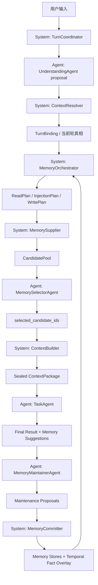

# Agent 记忆系统框架与 Agent 交互协议设计书

日期：2026-05-27

状态：设计书 / 外部记忆系统底座 / 待实施计划书

适用范围：

- `backend/memory_system/*`
- `backend/context_system/resolution/*`
- `backend/task_system/*` 中的记忆请求、任务图、运行语义
- 后续外部记忆系统、长期记忆、工作记忆、会话接续、子 agent 记忆维护接入

## 1. 总结论

本设计解决的不是“用哪种检索方法召回记忆”，而是建立一套不脱节的记忆工程底座：

```text
用户体验目标
  -> 系统控制机制
  -> agent 输入输出协议
  -> 系统验收与提交规则
```

记忆系统不能只靠 prompt 让 agent 自觉判断。成熟 agent 的记忆框架必须把控制权留在系统：

```text
System owns state, policy, lifecycle, budget, commit.
Agent provides semantic judgment, summary, ranking, proposal, execution.
System validates every agent output before it becomes state.
```

本项目推荐采用：

```text
前景态牵引的分层记忆系统
  + 系统级 MemoryOrchestrator
  + 受控 agent 交互协议
  + 后台记忆维护 agent
  + 轻量时间事实链
```

其中：

- `MemoryOrchestrator` 是系统控制层，不是 agent。
- `UnderstandingAgent` 只输出结构化理解候选，不拥有当前轮真相。
- `MemorySelectorAgent` 只在系统给定候选池内选择 candidate id，不全库自由搜索。
- `MemoryMaintainerAgent` 只提出维护建议，不直接写长期记忆。
- `MemoryCommitter` 是系统提交层，负责校验、合并、失效旧记录、落库。

核心目标：

1. 用户说“继续第二个”时，系统能从前景态和 bundle refs 精确接续，而不是靠关键词猜测。
2. 用户当前显式输入永远优先，旧记忆和 restore candidate 只能作为候选。
3. 长期记忆默认不常驻上下文，只有系统计划允许时才注入。
4. 子 agent 和后台维护可以智能，但不能抢控制权。
5. 所有记忆写入都有来源、范围、理由、版本和失效链。

## 2. 当前问题定义

### 2.1 当前风险

当前项目已经有较好的记忆基础，但仍存在一个结构性风险：

```text
系统框架说要结构化控制
  -> 实际 resolver / classifier 仍可能靠自然语言关键词判断
  -> agent prompt 里要求不要越权
  -> 运行时却没有完整的输入输出协议接住 agent
```

这会导致：

- 记忆调度看似智能，实际依赖关键词和正则。
- agent 可能把 restore candidate 当成当前事实。
- 长期记忆可能重复注入，造成 token 空转。
- 后台维护 agent 的建议可能被误当成已提交事实。
- 系统设计和 agent 实际交互脱节。

### 2.2 正确问题表述

本问题本质是：

```text
restore / decide / execute / commit 的权威边界不应由 agent prompt 暗示，
而应由系统状态机、数据结构和 agent 交互协议共同保证。
```

正确终态：

- 当前轮真相由 `TurnBinding` 和显式用户输入绑定。
- 记忆读取由 `MemoryOrchestrator` 生成计划。
- 记忆候选由系统按 plan 拉取。
- agent 只对候选做语义选择、摘要或维护建议。
- 系统验收 agent 输出后才更新状态或记忆库。

## 3. 本项目已有基础

### 3.1 已有正确方向

当前代码中已经具备可复用底座：

| 模块 | 当前价值 | 后续定位 |
|---|---|---|
| `backend/memory_system/runtime_view.py` | `MemoryRuntimeView` 已是只读候选视图，禁止 candidate 覆盖当前轮 | 继续作为 memory supply 的只读出口 |
| `backend/memory_system/foreground_state.py` | 已保存 active goal、active bindings、bundle refs、latest refs | 作为接续体验的第一层记忆 |
| `backend/memory_system/working_memory_service.py` | 已有 status、visibility、scope、handoff、temporal neighbor、read log | 作为 task/node 范围工作记忆 |
| `backend/memory_system/bundle_service.py` | 已有 memory bundle / context package 供应链 | 后续改为消费 Orchestrator plan |
| `backend/task_system/registry/flow_models.py` | 已有 `TaskMemoryRequestProfile` | 作为任务级记忆需求声明来源 |

### 3.2 需要收束的风险点

当前 `backend/context_system/resolution/resolver.py` 中存在自然语言规则：

```text
_looks_compound
_capability_for_text
_ordinal_followups
```

这些逻辑可以保留为弱信号或兼容输入解析，但不能继续作为记忆调度、任务能力、接续绑定的最终权威。

目标是：

```text
自然语言规则 -> weak_signals
结构化状态 + refs + scope + policy -> authority
```

## 4. 方法总结与取舍

### 4.1 Claude Code 类分层接续

可借鉴：

- 多层记忆：静态指令、自动记忆、session memory、agent memory、relevant memories。
- compact 后恢复必要文件、技能和上下文，而不是恢复全部历史。
- relevant memories 按需预取，并有 surfaced 去重。
- 后台提取记忆与主 agent 写入互斥，避免竞态。
- 子 agent 默认隔离，显式共享。

不照搬：

- 不把 markdown topic file 作为唯一存储形态。
- 不让 agent 直接自由编辑所有长期记忆。
- 不把索引常驻 prompt 作为主要召回方式。

### 4.2 Codex 类 coding agent 接续

可借鉴：

- 记忆服务行动，不服务“知道很多”。
- 当前任务、当前文件、测试结果、用户纠正、下一步优先于长期知识。
- 工具执行结果和验证状态必须以结构化方式接续。

不照搬：

- 不把 coding session 的文件读写缓存直接等同于本项目的跨任务记忆。
- 不把所有接续都塞进聊天摘要。

### 4.3 LangGraph 式 thread / namespace 分离

可借鉴：

- thread-scoped short-term state 和 namespace-scoped long-term memory 分离。
- 任务图状态、节点状态、长期记忆不要混成一个 store。
- semantic / episodic / procedural memory 分型。

不照搬：

- 不把 LangGraph store 作为唯一抽象，避免盖住本项目已有 task graph、working memory、durable memory。

### 4.4 Letta / MemGPT 式 core / archival memory

可借鉴：

- 少量 core memory 可常驻，例如用户硬偏好、项目硬约束。
- 大量 archival memory 只能按需检索。
- agent 可以提出记忆编辑，但应被系统管控。

不照搬：

- 不让 agent 自主管理核心记忆。
- 不把“模型工具调用更新记忆”当成最终写入权限。

### 4.5 Graphiti / Zep 式时间知识图谱

可借鉴：

- 事实有时间、来源、失效、冲突。
- 旧事实不能简单删除，应被 `superseded` 或 `invalidated_by` 连接。
- 实体关系能提升复杂长期记忆召回精度。

不照搬：

- 第一版不做全量图数据库。
- 不让每轮热路径都跑图遍历。

### 4.6 A-MEM / Mem0 式后台整理

可借鉴：

- 写入后做链接、合并、演化、去重。
- 维护 agent 可以周期性整理记忆质量。
- 记忆抽取和巩固不应阻塞用户主任务。

不照搬：

- 不让后台 agent 直接提交权威事实。
- 不把“智能整理”放进每个用户 turn 的同步路径。

## 5. 系统控制与 Agent 行为边界

### 5.1 系统控制层

系统控制层必须是代码、状态机、策略、预算和数据模型。

| 控制对象 | 系统职责 | 禁止交给 agent 的原因 |
|---|---|---|
| 当前轮真相 | 显式输入、文件、task refs、artifact handles 优先 | agent 容易受旧上下文影响 |
| 读写权限 | 决定哪些 memory layer 可读可写 | prompt 不能代替权限 |
| 记忆调度 | 生成 `ReadPlan / InjectionPlan / WritePlan` | 自由检索会造成空转和污染 |
| 注入预算 | 控制每层 token 上限 | agent 不可靠估算上下文成本 |
| 生命周期 | candidate、accepted、superseded、archived | 必须可测试、可审计 |
| 冲突失效 | 标记 invalidated/superseded | 旧事实不能无痕覆盖 |
| 提交落库 | 校验 provenance 后写入 | 防止长期记忆污染 |

### 5.2 Agent 行为层

agent 是受控执行单元，不是控制面。

| Agent | 可做 | 不可做 |
|---|---|---|
| `UnderstandingAgent` | 生成结构化理解候选 | 直接决定当前事实 |
| `MemorySelectorAgent` | 在候选池内选择相关 candidate id | 全库搜索、自行拼接记忆内容 |
| `TaskAgent` | 执行任务、产出结果 | 自行读取未授权记忆 |
| `MemoryMaintainerAgent` | 提出 create/update/merge/supersede 建议 | 直接写长期记忆 |
| `ReflectionAgent` | 总结失败原因、retry guidance | 修改任务状态或权限 |

铁律：

```text
Agent output is proposal.
System commit is authority.
```

## 6. 目标架构

### 6.1 分层记忆模型

```text
Foreground Continuity
  当前目标、active bindings、bundle refs、latest result refs、用户纠正、下一步

Working Memory
  task_run / graph / node 范围内的中间结果、handoff、失败反思、accepted 工作事实

Task Durable Memory
  任务级和项目级可复用事实、架构决策、产物索引、流程约束

Long-term Memory
  semantic / episodic / procedural 长期记忆

Temporal Fact Overlay
  事实时间、来源、冲突、superseded / invalidated 链
```

### 6.2 控制链路

```text
UserTurn
  -> TurnCoordinator
  -> UnderstandingAgent proposal
  -> ContextResolver system binding
  -> MemoryOrchestrator read/write/injection plan
  -> MemorySupplier candidate fetch
  -> MemorySelectorAgent candidate ranking
  -> ContextBuilder sealed context package
  -> TaskAgent execution
  -> MemoryMaintainerAgent maintenance proposal
  -> MemoryCommitter validation and commit
```

这条链路中：

- `TurnCoordinator` 到 `ContextBuilder` 都是系统控制。
- agent 只在固定输入包和输出 schema 内行动。
- `MemoryCommitter` 是唯一能把 agent 建议变成长期记忆状态变化的入口。

## 7. 固定系统-Agent 交互协议

### 7.1 TurnCoordinator

类型：系统控制。

输入：

```json
{
  "session_id": "s1",
  "user_message": "继续第二个",
  "task_id": "task_1",
  "available_runtime_refs": {}
}
```

输出：

```json
{
  "turn_id": "turn_001",
  "session_id": "s1",
  "task_id": "task_1",
  "user_message": "继续第二个",
  "created_at": "..."
}
```

系统验收：

- 每轮必须有唯一 `turn_id`。
- 所有后续 agent 输出必须带回 `turn_id`。

### 7.2 UnderstandingAgent

类型：agent 行为。

角色 prompt 应写成：

```text
你是一名当前轮理解分析员。
你只负责把用户当前输入转成结构化候选。
你不能决定系统当前事实，也不能决定读取哪些记忆。
当用户表达模糊指代时，你需要输出可能的目标类型、候选序号、置信度和需要系统确认的歧义。
你的输出必须符合 JSON schema，不要输出解释性散文。
```

输入包：

```json
{
  "turn_id": "turn_001",
  "user_message": "继续第二个",
  "visible_foreground_manifest": [
    {"ordinal": 1, "task_id": "t_pdf", "summary": "..."},
    {"ordinal": 2, "task_id": "t_table", "summary": "..."}
  ],
  "allowed_signal_types": [
    "followup_ordinals",
    "explicit_paths",
    "artifact_handle_refs",
    "correction",
    "new_task"
  ]
}
```

输出 schema：

```json
{
  "turn_id": "turn_001",
  "proposal_type": "turn_understanding",
  "followup_ordinals": [2],
  "explicit_paths": [],
  "artifact_handle_refs": [],
  "correction_candidates": [],
  "confidence": 0.92,
  "ambiguities": []
}
```

系统验收：

- schema 不合法则丢弃，不进入当前轮绑定。
- `confidence` 低于阈值时只能作为弱信号。
- agent 不能输出 `authority=system_bound`。

### 7.3 ContextResolver

类型：系统控制。

输入：

```text
TurnEnvelope
UnderstandingProposal
ForegroundContinuityState
explicit user inputs
task graph runtime scope
restore candidates
```

输出：

```json
{
  "turn_binding": {
    "turn_id": "turn_001",
    "current_goal": "继续处理第二个子任务",
    "bound_targets": [
      {
        "target_ref": "t_table",
        "source": "foreground_bundle_refs",
        "authority": "system_bound"
      }
    ],
    "restore_candidates_used": [],
    "weak_signals": {
      "followup_ordinals": [2]
    }
  }
}
```

系统验收：

- 显式用户输入优先级最高。
- foreground refs 可用于绑定，但必须能追溯。
- restore candidate 只能进入 `restore_candidates_used`，不能自动变 current fact。

### 7.4 MemoryOrchestrator

类型：系统控制。

输入：

```text
TurnBinding
TaskMemoryRequestProfile
MemoryRuntimeView diagnostics
runtime_scope
surfaced_ledger
token_budget
policy
```

输出：

```json
{
  "read_plan": [
    {
      "layer": "foreground",
      "reason": "bound_foreground_target",
      "required": true,
      "selector": {"task_id": "t_table"},
      "token_cap": 1200
    },
    {
      "layer": "working",
      "reason": "accepted_working_context_for_bound_task",
      "required": true,
      "selector": {"task_id": "t_table", "status": "accepted"},
      "token_cap": 3000
    }
  ],
  "long_term_plan": {
    "read": false,
    "reason": "foreground_and_working_memory_sufficient"
  },
  "injection_policy": {
    "allow_raw_long_term_records": false,
    "max_total_memory_tokens": 6000
  },
  "write_plan": []
}
```

系统验收：

- plan reason 必须是枚举。
- 无 plan 不读长期记忆。
- long-term memory 默认关闭，除非有明确 reason。
- budget 必须在 context policy 允许范围内。

### 7.5 MemorySupplier

类型：系统控制。

输入：`ReadPlan`

输出：

```json
{
  "candidate_pool": [
    {
      "candidate_id": "memory-context:t_table:working:wm_1",
      "layer": "working",
      "content_ref": "wm_1",
      "preview": "...",
      "status": "accepted",
      "token_estimate": 320,
      "authority": "candidate_only"
    }
  ],
  "missing_required": []
}
```

系统验收：

- required layer 缺失时 fail closed 或进入补救路径。
- candidate 必须带 `authority=candidate_only`。
- 不把 raw long-term records 直接暴露给 agent。

### 7.6 MemorySelectorAgent

类型：agent 行为。

角色 prompt 应写成：

```text
你是一名记忆候选选择员。
系统已经决定了本轮允许查看的候选池。
你只能从候选池中选择 candidate_id，不能请求额外记忆，不能改写候选内容。
你需要根据当前任务目标选择最有帮助、最少数量的记忆。
如果候选池已经足够小或没有必要注入，请返回空选择并说明枚举化原因。
```

输入包：

```json
{
  "turn_binding": {},
  "candidate_manifest": [
    {
      "candidate_id": "memory-context:t_table:working:wm_1",
      "layer": "working",
      "title": "上一轮表格分析结果",
      "preview": "...",
      "token_estimate": 320
    }
  ],
  "selection_limits": {
    "max_candidates": 5,
    "max_tokens": 3000
  }
}
```

输出 schema：

```json
{
  "selected_candidate_ids": [
    "memory-context:t_table:working:wm_1"
  ],
  "rejected_candidate_ids": [],
  "reason": "supports_bound_target"
}
```

系统验收：

- 只能返回已有 `candidate_id`。
- 超出 token budget 的选择被系统裁剪。
- selector 的 reason 只用于诊断，不改变系统 plan。

### 7.7 ContextBuilder

类型：系统控制。

输出 sealed context：

```json
{
  "turn_id": "turn_001",
  "current_goal": "继续处理第二个子任务",
  "bound_targets": ["t_table"],
  "memory_blocks": [
    {
      "layer": "working",
      "candidate_id": "memory-context:t_table:working:wm_1",
      "content": "...",
      "authority": "context_candidate"
    }
  ],
  "forbidden_assumptions": [
    "不要把 restore candidate 当作当前事实",
    "不要读取未在 ContextPackage 中出现的长期记忆"
  ]
}
```

系统验收：

- 注入内容必须来自 selected candidate ids。
- 不允许 agent 自己拼接外部记忆内容。
- context package 可记录 hash，便于后续审计。

### 7.8 TaskAgent

类型：agent 行为。

角色 prompt 应按具体任务写，不写开发说明。

示例：

```text
你是一名任务执行员。
你只基于当前 sealed context、用户当前请求和系统授权工具完成任务。
如果上下文不足以继续，你需要说明缺少的具体引用，而不是自行假设。
你不能把候选记忆当成未经验证的最终事实。
你需要输出最终结果、使用过的关键上下文引用、可供系统保存的结果摘要候选。
```

输出 schema：

```json
{
  "turn_id": "turn_001",
  "final_answer": "...",
  "used_context_refs": [
    "memory-context:t_table:working:wm_1"
  ],
  "result_summary_candidate": {
    "summary": "...",
    "artifact_refs": [],
    "next_step": []
  },
  "memory_write_suggestions": []
}
```

系统验收：

- 使用了未授权 context ref 时标记违规。
- 输出中的 memory suggestion 不直接落库。
- 长文本产物必须有 artifact refs。

### 7.9 MemoryMaintainerAgent

类型：后台 agent 行为。

角色 prompt 应写成：

```text
你是一名记忆维护员。
你只负责审查系统提供的候选记忆和最近 turn 摘要，提出 create、update、merge、supersede、archive 建议。
你不能直接提交记忆。
你必须为每个建议给出来源引用、作用域、置信度和是否可能与旧事实冲突。
不确定时输出 no_op。
```

输入包：

```json
{
  "recent_turns": [],
  "candidate_existing_memories": [],
  "write_policy": {
    "allowed_scopes": ["foreground", "working", "task_durable", "long_term"],
    "requires_provenance": true
  }
}
```

输出 schema：

```json
{
  "maintenance_proposals": [
    {
      "action": "update",
      "target_memory_id": "mem_1",
      "scope": "procedural",
      "summary": "用户明确反对关键词式意图匹配，偏好结构化状态调度。",
      "source_refs": ["turn_001"],
      "confidence": 0.91,
      "conflict_refs": []
    }
  ]
}
```

系统验收：

- 无 source refs 不提交。
- scope 不允许则拒绝。
- 与旧事实冲突时只标记 pending conflict，不直接覆盖。

### 7.10 MemoryCommitter

类型：系统控制。

输入：

```text
maintenance proposals
write policy
existing memory records
temporal fact overlay
dedupe index
```

输出：

```json
{
  "committed": [
    {
      "memory_id": "mem_1",
      "action": "update",
      "version": 3,
      "superseded_refs": ["mem_1:v2"],
      "source_refs": ["turn_001"]
    }
  ],
  "rejected": []
}
```

系统验收：

- 提交必须幂等。
- 所有 update/merge/supersede 必须保留旧版本引用。
- 系统写入完成后再更新索引和 surfaced ledger。

## 8. 用户体验目标与系统-Agent 绑定表

| 用户体验目标 | 系统机制 | Agent 交互 | 系统验收 |
|---|---|---|---|
| 用户说“继续第二个”能准确接上 | `ForegroundContinuityState.bundle_result_refs` + `TurnBinding.bound_targets` | UnderstandingAgent 只输出 ordinal 候选 | ContextResolver 绑定具体 task ref |
| 当前输入不被旧记忆覆盖 | 显式输入最高优先级，restore candidate 只候选 | Agent 不允许输出 authoritative current fact | schema 中无 authority 字段，系统绑定才有 authority |
| 减少空转 | Orchestrator 无 plan 不读长期记忆 | Selector 只处理候选 manifest | long-term 默认 read=false |
| 召回精准 | 先用结构 selector 缩小候选池 | Selector 只返回 candidate_id | ContextBuilder 只注入 selected ids |
| 长期偏好能生效 | procedural memory 按需进入候选池 | Maintainer 提 update proposal | Committer 校验来源和作用域 |
| 旧事实可被新事实替代 | temporal overlay 记录 superseded/invalidated | Maintainer 标记 conflict/supersede 建议 | Committer 写版本链，不无痕覆盖 |
| 子 agent 不污染主线程 | 子 agent 默认隔离，输出 result refs | 子 agent 返回摘要和 refs | 系统只采纳验收后的 refs |
| compact 后能继续 | foreground state + accepted working memory + result refs | Summary agent 只生成接续摘要候选 | 系统从 accepted/committed checkpoint 恢复 |
| 用户纠正能记住 | correction proposal 进入 procedural/feedback memory | Maintainer 提取纠正 | Committer 合并同类偏好 |
| 记忆注入不重复 | surfaced ledger 记录已注入 candidate | Selector 接收 already surfaced manifest | 已注入记忆默认不重复进入候选 |

## 9. 数据模型建议

### 9.1 MemoryPlan

```python
class MemoryReadPlan:
    plan_id: str
    turn_id: str
    layer: str
    reason: str
    required: bool
    selector: dict
    token_cap: int
    authority: str = "memory_orchestrator"
```

```python
class MemoryInjectionPlan:
    turn_id: str
    selected_candidate_ids: tuple[str, ...]
    max_total_tokens: int
    allow_raw_long_term_records: bool = False
```

```python
class MemoryWritePlan:
    turn_id: str
    allowed_actions: tuple[str, ...]
    allowed_scopes: tuple[str, ...]
    requires_provenance: bool = True
    commit_mode: str = "system_validated"
```

### 9.2 AgentProposal

```python
class AgentProposal:
    proposal_id: str
    turn_id: str
    agent_id: str
    proposal_type: str
    payload: dict
    confidence: float
    source_refs: tuple[str, ...]
    authority: str = "agent_proposal"
```

### 9.3 SurfacedLedger

```python
class SurfacedMemoryLedgerEntry:
    session_id: str
    candidate_id: str
    content_ref: str
    surfaced_at_turn_id: str
    token_estimate: int
    compact_generation: int
```

### 9.4 TemporalFactEdge

```python
class TemporalFactEdge:
    edge_id: str
    source_memory_id: str
    target_memory_id: str
    relation: str  # supersedes / invalidates / refines / conflicts_with
    source_refs: tuple[str, ...]
    created_at: str
    confidence: float
```

## 10. 推荐模块落点

| 新模块 | 类型 | 职责 |
|---|---|---|
| `backend/memory_system/memory_plan_models.py` | 系统模型 | ReadPlan / InjectionPlan / WritePlan |
| `backend/memory_system/orchestrator.py` | 系统控制 | 根据 TurnBinding 和 policy 生成计划 |
| `backend/memory_system/surfaced_ledger.py` | 系统控制 | 记录已注入候选，减少重复 |
| `backend/memory_system/temporal_fact_store.py` | 系统控制 | 维护 superseded / invalidated / conflict 边 |
| `backend/memory_system/agent_protocols.py` | 协议模型 | agent 输入输出 schema |
| `backend/memory_system/maintenance_agent.py` | agent 编排 | 调用维护 agent，接收 proposal |
| `backend/memory_system/committer.py` | 系统控制 | 校验 proposal 并落库 |

现有模块调整：

| 文件 | 调整方向 |
|---|---|
| `runtime_view.py` | 保持只读候选视图，新增 plan diagnostics |
| `bundle_service.py` | 由直接 build 改为消费 Orchestrator plan |
| `foreground_state.py` | 强化 active refs、bundle refs、correction refs |
| `working_memory_service.py` | 继续作为 task/node scoped memory selection |
| `resolver.py` | 自然语言规则降级为 weak signals |

## 11. 分阶段实施计划

### Phase 1：协议与计划对象落地

目标：先建立系统-agent 交互对象，不改变运行行为。

任务：

1. 新增 `memory_plan_models.py`。
2. 新增 `agent_protocols.py`。
3. 为 `MemoryBundleService` 增加 shadow plan diagnostics。
4. 将 `resolver.py` 的关键词结果标记为 weak signals。

完成标准：

- 测试可验证 agent proposal 不等于 system authority。
- 现有行为不变，但能输出 shadow read plan。

### Phase 2：MemoryOrchestrator 接入

目标：让记忆读取先经过系统计划。

任务：

1. 新增 `orchestrator.py`。
2. `build_memory_context_package_result` 接收 `MemoryReadPlan`。
3. long-term memory 默认只有 plan 允许才读。
4. 添加 required layer 缺失时的 fail closed 行为。

完成标准：

- 无 plan 不读 long-term。
- foreground / working / task durable 读取可追溯到 plan reason。

### Phase 3：候选选择与注入收口

目标：减少重复注入和候选漂移。

任务：

1. 新增 `surfaced_ledger.py`。
2. selector agent 只返回 candidate ids。
3. ContextBuilder 只注入 selected candidate ids。
4. compact 后按 generation 重置或继承 ledger。

完成标准：

- 同一 long-term note 不会每轮重复注入。
- selector 不能构造不存在的记忆内容。

### Phase 4：维护 agent 与系统提交分离

目标：智能维护但系统提交。

任务：

1. 新增 `maintenance_agent.py`。
2. 新增 `committer.py`。
3. create/update/merge/supersede 全部经过 provenance 校验。
4. 冲突进入 pending conflict，不自动覆盖。

完成标准：

- maintainer proposal 不会直接落库。
- 无 source refs 的长期记忆写入被拒绝。

### Phase 5：轻量时间事实链

目标：解决旧事实覆盖和版本冲突。

任务：

1. 新增 `temporal_fact_store.py`。
2. memory record 增加 superseded / invalidated 关系。
3. recall 时默认过滤已失效事实，但可在诊断中查看。
4. 冲突事实要求当前轮验证或用户确认。

完成标准：

- 新事实不会无痕覆盖旧事实。
- 旧事实被召回时带有 stale / superseded 标记。

### Phase 6：清理旧权威路径

目标：删除关键词权威和旧兼容壳。

任务：

1. `_looks_compound/_capability_for_text/_ordinal_followups` 不再直接影响 memory layer。
2. 删除旧的无计划 long-term 注入路径。
3. 删除保护旧结构的测试。
4. 更新系统规划和回归测试。

完成标准：

- memory read 全部可追溯到 Orchestrator plan。
- agent 无法通过 prompt 输出绕过系统 commit。

## 12. 验证矩阵

### 12.1 当前轮真相

| 用例 | 断言 |
|---|---|
| 用户显式给新文件 | 旧 active file 只作为候选，不覆盖新文件 |
| 用户说继续第二个 | 绑定到 foreground bundle ordinal 2 |
| ordinal 不存在 | 不凭空绑定，返回需要澄清或 fallback |
| restore candidate 指向旧任务 | 不自动成为 current goal |

### 12.2 记忆读取

| 用例 | 断言 |
|---|---|
| foreground 足够 | long-term read=false |
| working required 缺失 | fail closed 或补救路径 |
| long-term 被读取 | 必须有枚举 reason 和 token cap |
| surfaced 过的 note | 默认不重复注入 |

### 12.3 Agent 协议

| 用例 | 断言 |
|---|---|
| UnderstandingAgent 输出 authority | schema 拒绝 |
| Selector 返回不存在 candidate_id | 系统丢弃 |
| Maintainer 无 source_refs | Committer 拒绝 |
| TaskAgent 使用未授权 ref | 标记违规，不能作为提交来源 |

### 12.4 写入与维护

| 用例 | 断言 |
|---|---|
| create 新长期记忆 | 有 scope、source、confidence |
| update 旧记忆 | 保留旧版本并写 supersedes |
| 冲突记忆 | pending conflict，不覆盖 |
| merge 重复记忆 | 保留 provenance 列表 |

### 12.5 成本与体验

| 用例 | 断言 |
|---|---|
| 连续 10 轮普通问答 | long-term 注入次数受控 |
| 长任务 compact 后继续 | foreground + accepted working memory 可恢复 |
| 子 agent 批量运行 | 子 agent 输出不会污染主线程 |
| 用户纠正偏好 | 后续同类任务能按需召回 procedural memory |

## 13. 迁移与切换规则

迁移顺序：

```text
shadow plan
  -> plan diagnostics tests
  -> Orchestrator controlled read
  -> selector candidate-id only
  -> maintainer proposal only
  -> Committer controlled write
  -> old authority cleanup
```

切换规则：

1. 新 plan 先 shadow，不改变行为。
2. shadow 通过后，long-term read 改为 plan required。
3. selector 先运行在候选池内，不改变候选生成。
4. committer 先拦截无 provenance 写入。
5. 全链路通过后，删除旧无计划路径。

回滚规则：

- 回滚到上一阶段协议，不恢复关键词权威。
- 若 Orchestrator plan 缺失，系统应 fail closed 或走明确补救，不回到“自由读长期记忆”。
- 若 maintainer proposal 出错，只暂停维护任务，不影响主任务执行。

## 14. 禁止实现模式

后续实施禁止：

1. 用关键词表扩展 NeedClassifier。
2. 让 agent 自己决定读取哪些 memory layer。
3. 让 restore candidate 覆盖当前显式输入。
4. 把长期记忆常驻 system prompt。
5. selector 返回记忆内容而不是 candidate id。
6. maintainer agent 直接写长期记忆。
7. 无 source refs 写入长期记忆。
8. 冲突事实无版本覆盖。
9. 用 prompt 代替系统权限和预算。
10. 为兼容旧路径长期保留双轨执行。

## 15. 成功定义

本设计落地后，外部记忆系统应满足：

1. 系统框架与 agent 交互协议一一对应。
2. 每个 agent 都有明确输入包、角色 prompt、输出 schema、系统验收规则。
3. 当前轮真相不由 agent 自由判断。
4. 记忆读取必须可追溯到系统 plan。
5. 长期记忆不再无计划注入。
6. 后台维护智能但不越权。
7. 旧事实可以被新事实失效，而不是被静默覆盖。
8. 用户体验上能自然接续、少重复解释、少空转、少错召回。

## 16. 核心架构图



## 17. 下一步

本设计书是外部记忆系统底座，不直接修改运行代码。

正式实施前应另写实施计划书，至少包含：

```text
阶段输入输出
文件级改动清单
旧路径删除条件
测试矩阵
迁移和回滚规则
```

实施原则：

```text
先 shadow 计划，再接管读取；
先 proposal，再系统提交；
先清权威边界，再做高级检索。
```

