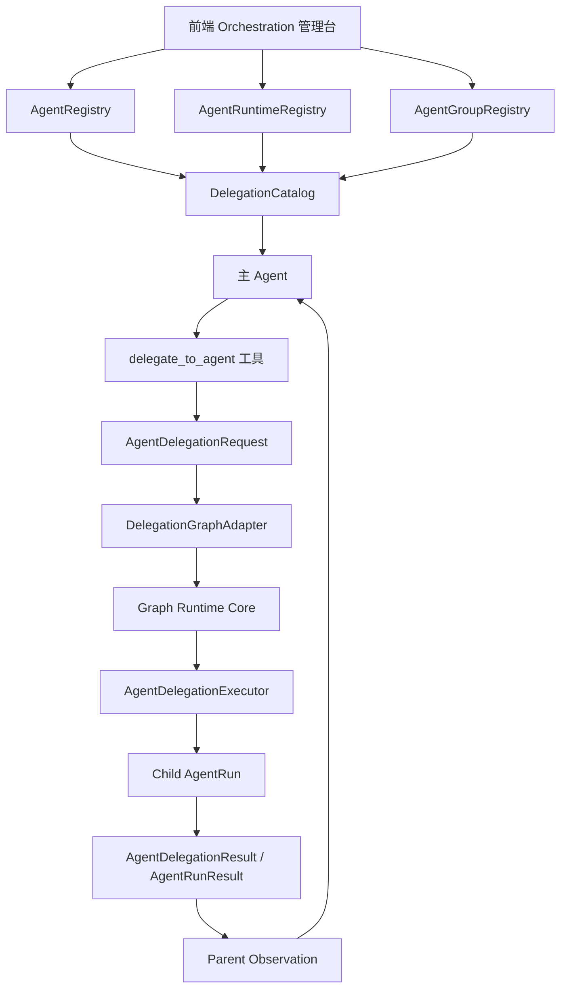

# 68-主Agent调用子Agent装配与运行通道重构计划书

## 0. 文档目标

本文是一份从当前代码出发的完整技术计划书，目标是把“主 Agent 在普通对话/任务运行中调用子 Agent”的能力，与系统已经在建设的“多 Agent 特定任务图”能力统一到同一套底层运行图与状态机之上。

核心判断：

- 上层入口要分开：预设多 Agent 任务图和主 Agent 临时委派不是同一个产品语义。
- 底层运行要统一：两者都应该复用 `AgentRun`、`AgentRunResult`、`AgentHandoffEnvelope`、`CoordinationRun`、`CoordinationNodeRun`、时序、barrier、handoff、状态推进、失败策略和结果合并。
- 主 Agent 不应直接吞入 RAG、PDF、表格等大块中间语义；这些处理应交给受限子 Agent，主 Agent 只接收摘要、证据引用、产物引用和限制说明。
- 子 Agent 调用不能靠单点启发式补丁，也不能只靠 prompt 约束；必须形成可追踪、可授权、可测试、可回滚的运行协议。

本文不会把旧计划书当作事实来源；原则参考来自当前 `docs/设计原则` 中对 Agent、工具、任务、权限、上下文和 MCP 的工程原则，同时落到当前项目代码已有结构上。

## 1. 问题定义

### 1.1 当前要解决的真实问题

当前系统已经有：

- 前端可配置 Agent、AgentRuntimeProfile、AgentGroup。
- 后端可保存 Agent 名册、运行档案、Agent 组。
- runtime 已有 `AgentRun`、`AgentRunResult`、`AgentHandoffEnvelope`、`CoordinationRun`、`CoordinationNodeRun`。
- 任务系统已有 task graph、topology、communication protocol、A2A preview、stage continuation。

但缺少一条正式运行通道：

```text
主 Agent 发现可调用子 Agent
  -> 主 Agent 发起结构化委派请求
  -> runtime 创建子 Agent 运行实例
  -> 子 Agent 使用自己的权限、投影、上下文执行
  -> 子 Agent 产出结构化结果
  -> 主 Agent 只接收摘要和 refs
  -> 主 Agent 自己完成最终收口
```

现在最大风险不是“没有子 Agent 配置能力”，而是已有能力分散在不同系统里：

- Orchestration 管理台能注册 Agent，但主 Agent runtime 不一定能看见“可委派目录”。
- 任务图可以表达多 Agent，但它是预设任务结构，不适合被当作普通委派的唯一入口。
- worker spawn 能生成临时子 Agent，但它服务的是按 adoption plan 动态创建 worker，不等于调用前端已配置好的子 Agent。
- runtime 有 `AgentRun` 等对象，但没有正式的普通委派请求、结果、状态机和 observation 协议。

### 1.2 正确终态

正确终态不是给某个 RAG/PDF/表格场景加一组特殊判断，而是形成统一能力：

- 用户通过前端配置子 Agent 和权限。
- runtime 自动生成可委派 Agent 目录。
- 主 Agent 通过正式工具或 action 选择子 Agent。
- 委派运行被表示为动态生成的轻量运行子图。
- 预设多 Agent 任务图和动态委派子图共享同一个 Graph Runtime Core。
- 子 Agent 的权限来自自己的 `AgentRuntimeProfile`，不是继承主 Agent。
- 子 Agent 原始上下文不污染主 Agent。
- 每次委派都有事件、状态、结果和失败原因可追踪。

## 2. 理论与工程基础

### 2.1 Agent 隔离理论：子 Agent 的价值是隔离上下文

`docs/设计原则/12-Agent-系统.md` 中对多 Agent 的核心解释是：子 Agent 独立运行可以避免搜索、阅读、验证等中间过程污染主 Agent 上下文。

这对本项目尤其关键。RAG 检索、PDF 解析、表格分析都会产生大量中间信息：

- 检索命中文档、chunk、score、rerank 细节。
- PDF 页文本、表格抽取、OCR 噪声。
- 结构化数据扫描、列名推断、统计过程。

这些信息如果直接进入主 Agent 历史，会造成：

- 主 Agent prompt 变长。
- 重要任务目标被噪声淹没。
- 模型被局部证据诱导，提前或错误收口。
- 后续轮次把一次检索的中间材料当作长期事实。

因此子 Agent 的主要职责不是“替主 Agent 做最终决定”，而是承担受限工作：查、读、抽取、验证、压缩、报告。

### 2.2 Prompt 约束必须配合权限约束

`docs/设计原则/13-内置Agent设计模式.md` 中 Explore/Plan/Verification 的设计是双保险：

- prompt 告诉 Agent 它是什么角色，不能做什么。
- 工具层真实移除或禁止对应操作。

因此本项目不能只写：

```text
你是证据检索员，不要修改文件。
```

还必须让子 Agent 的 `AgentRuntimeProfile` 真实限制：

- `allowed_operations`
- `blocked_operations`
- `allowed_context_sections`
- `allowed_memory_scopes`
- `approval_policy`
- `trace_policy`
- 输出契约

如果 prompt 和权限不一致，以权限为准；如果权限未声明，默认不放行。

### 2.3 工具系统原则：委派也应该是正式工具/operation

`docs/设计原则/09-工具系统设计.md` 把工具看作一个完整微服务，包含：

- schema
- validate
- permission check
- isReadOnly / isDestructive / isConcurrencySafe
- execution
- result serialization
- error/rejected rendering

所以 `delegate_to_agent` 不应是散落在 `task_run_loop.py` 里的特殊分支。它应该成为一类正式能力：

- 有输入 schema。
- 有目标 Agent 校验。
- 有权限检查。
- 有状态事件。
- 有结果 schema。
- 有失败返回。
- 可被测试。

第一版可以在 runtime 内部工具池中实现，不一定马上暴露到外部 MCP，但必须遵守工具/operation 的统一边界。

### 2.4 任务系统原则：生命周期必须显式

`docs/设计原则/14-任务系统.md` 强调异步任务需要状态机：

```text
pending -> running -> completed
                  -> failed
                  -> killed
```

主 Agent 调子 Agent 本质上也是一个子任务运行。它不能只是“调用函数然后拿字符串”。必须显式表达：

- 请求已创建。
- 子 Agent run 已创建。
- 子 Agent run 正在执行。
- 子 Agent run 完成、失败、取消或超预算。
- 结果已写入。
- 主 Agent 已收到 observation。

否则长测试失败时无法定位：是主 Agent 没调用、子 Agent 没权限、模型服务失败、工具失败、结果丢失，还是主 Agent 拿到结果后没收口。

### 2.5 MCP 可用性原则：能力要看运行状态，不只看配置

`docs/设计原则/15-MCP-协议实现.md` 中 MCP 服务器有多种连接状态：

- connected
- failed
- needs-auth
- pending
- disabled

因此子 Agent 是否可委派不能只看它声明了 `op.mcp_retrieval` 或 `op.mcp_pdf`。还要看相关 MCP 是否可用。第一版可以先做弱校验，但目录中至少要有：

- `availability_state`
- `missing_requirements`
- `degraded_reasons`

主 Agent 只能看到可用或降级可用的子 Agent；不可用 Agent 不应进入默认候选列表。

### 2.6 权限原则：fail-closed

`docs/设计原则/16-权限系统.md` 和健康 Agent 风险报告都强调：未授权时阻断是正确行为，不应为了测试通过改成 allow all。

对本计划的约束：

- 没有 runtime profile 的子 Agent 默认不可调用，或只能使用极窄只读默认 profile。
- 未声明 allowed operations 时，不允许工具调用。
- 禁用 Agent 不进入委派目录。
- 非 `worker_sub_agent` 不作为普通委派目标。
- 子 Agent 不继承主 Agent 的写权限、shell 权限或记忆写权限。
- `delegate_to_agent` 本身不能绕过 operation gate。

### 2.7 图状态机原则：统一底层，不混淆入口

用户当前系统已经在图系统中加入时序，这非常适合作为多 Agent 状态机的底层。关键是分层：

```text
上层入口：
  A. 预设任务图：用户/任务系统显式设计
  B. 动态委派图：主 Agent 运行中临时生成

底层运行：
  统一 Graph Runtime Core
```

也就是说：

```text
主 Agent 调子 Agent != 用户预设任务图节点
主 Agent 调子 Agent = runtime 动态创建轻量 delegation subgraph
```

这样既能复用图系统的时序、barrier、handoff、merge，又不会把普通会话委派强迫用户先画完整任务图。

## 3. 当前代码事实

### 3.1 前端装配入口

`frontend/src/components/workspace/views/OrchestrationView.tsx` 已有：

- `saveAgent()`：保存 Agent 名册。
- `saveRuntimeProfile()`：保存 Agent 运行档案。
- `saveAgentGroup()`：保存 Agent 组。

对应 API 在 `frontend/src/lib/api.ts`：

- `getOrchestrationAgents()`
- `getNextOrchestrationWorkerAgentId()`
- `upsertOrchestrationAgent()`
- `deleteOrchestrationAgent()`
- `upsertOrchestrationAgentGroup()`
- `deleteOrchestrationAgentGroup()`
- `updateOrchestrationAgentRuntimeProfile()`

结论：子 Agent 装配不需要后端硬编码。前端注册方向是对的。

### 3.2 后端 Agent 名册

`backend/orchestration/agent_registry.py`：

- `AGENT_CATEGORIES = {"main_agent", "system_management_agent", "worker_sub_agent"}`
- 内置默认 Agent 是 `agent:0` 和 `agent:3`。
- `upsert_agent()` 支持创建/更新自定义 Agent。
- `next_worker_agent_id()` 能生成新 worker agent id。

结论：系统已有“主 Agent / 系统管理 Agent / worker 子 Agent”的基础分类。

### 3.3 后端 Agent 运行档案

`backend/orchestration/agent_runtime_registry.py`：

- `default_agent_runtime_profiles()` 为 `agent:0` 和 `agent:3` 提供默认 profile。
- `AgentRuntimeProfile` 包含：
  - `allowed_task_modes`
  - `allowed_runtime_lanes`
  - `allowed_operations`
  - `blocked_operations`
  - `allowed_memory_scopes`
  - `allowed_context_sections`
  - `use_shared_contract`
  - `output_contracts`
  - `approval_policy`
  - `trace_policy`
  - `lifecycle_policy`

结论：权限和上下文边界已有承载模型，子 Agent 委派应复用这里，不新增平行权限体系。

### 3.4 Agent 组

`backend/orchestration/agent_group_registry.py`：

- `AgentGroupRegistry.upsert_group()` 保存组。
- `_validate_member_agents()` 要求 group member 必须是 `worker_sub_agent`。
- `allowed_task_graph_ids` 当前偏任务图授权。

结论：AgentGroup 可以作为“可委派子 Agent 池”的组织来源，但不应强行等同于任务图。

### 3.5 任务图与多 Agent 特定任务

`backend/tasks/flow_models.py` 和 `backend/tasks/task_graph_models.py` 表达：

- task graph
- graph nodes
- graph edges
- coordinator
- participant agents
- agent group
- handoff
- topology
- communication protocol

`frontend/src/components/workspace/views/task-system/CoordinationEditorWorkbench.tsx` 支持图节点、边、A2A preview、时序、并行组、审核门等编辑。

结论：这套适合“预设多 Agent 特定任务”，应继续保留。

### 3.6 runtime 运行对象

`backend/orchestration/runtime_loop/models.py` 已有：

- `AgentDispatchRecord`
- `CoordinationBarrierState`
- `QueuedAgentNotification`
- `AgentDispatchPlan`
- `TaskRun`
- `AgentRun`
- `AgentRunResult`
- `CoordinationRun`
- `CoordinationNodeRun`
- `AgentHandoffEnvelope`
- `CoordinationMergeResult`
- `RuntimeLoopState`

结论：底层状态对象已经接近可复用，只缺动态委派子图的 source/adapter/protocol。

### 3.7 runtime 当前能力

`backend/orchestration/runtime_loop/task_run_loop.py` 已有：

- `graph_ref` 触发 `CoordinationRun`。
- `_sync_coordination_runtime_objects()` 根据 graph/topology 创建 node run 与 participant agent run。
- worker spawn 逻辑根据 blueprint 创建 child `AgentRun`。
- `_continue_coordination_delivery_stream()` 按 stage continuation 继续下一阶段。

结论：runtime 已能管理多 Agent 运行对象，但当前入口偏预设任务图、worker spawn 和 stage continuation。主 Agent 普通委派应补一个 adapter，而不是重写整套 runtime。

## 4. 核心设计决策

### 4.1 共享底层 Graph Runtime Core

统一底层运行图，保留不同图来源：

```text
Graph Runtime Core
  - AgentRun lifecycle
  - CoordinationRun lifecycle
  - CoordinationNodeRun lifecycle
  - Handoff envelope
  - Dispatch plan
  - Timeline / sequence / parallel group
  - Barrier / join policy
  - Merge result
  - Event log / checkpoint / trace

Graph Source Adapters
  - task_graph_adapter
  - delegation_graph_adapter
  - worker_spawn_graph_adapter
```

第一版重点做 `delegation_graph_adapter`。

### 4.2 动态委派图不是任务图编辑器里的图

动态委派图由 runtime 自动生成，最小形态：

```text
coordinator(main agent)
  -> delegated_agent(worker)
  -> coordinator_observation
```

它应该落到 `CoordinationRun` / `CoordinationNodeRun`，但它的 `graph_source` 是 `delegation_graph`，不是 `task_graph`。

### 4.3 主 Agent 通过正式能力发起委派

第一版推荐实现为内部工具/operation：

```text
op.delegate_to_agent
```

理由：

- 现有运行循环已经支持工具调用。
- 工具 schema 能约束输入。
- 工具权限能走 operation gate。
- 工具结果天然可作为 observation 回到模型。
- 不需要先发明一套额外 action parser。

后续可以把它升级为 runtime control action，但第一版不需要扩大范围。

### 4.4 子 Agent 运行权限独立

子 Agent 执行时必须读取自己的 `AgentRuntimeProfile`：

```text
effective_operations = target_agent_profile.allowed_operations - target_agent_profile.blocked_operations
```

不能使用主 Agent profile，也不能让主 Agent 的工具池透传给子 Agent。

### 4.5 子 Agent 输出必须压缩成结构化结果

子 Agent 的输出合同：

```json
{
  "status": "completed | failed | killed | blocked",
  "summary": "...",
  "answer_candidate": "...",
  "evidence_refs": [],
  "artifact_refs": [],
  "confidence": "high | medium | low | unknown",
  "limitations": [],
  "followup_questions": [],
  "diagnostics_ref": "..."
}
```

主 Agent 不接收完整子 Agent model messages，不接收大段 raw retrieval chunks，不接收 PDF 全文，不接收表格全量内容。

### 4.6 最终责任仍属于主 Agent

子 Agent 只提供专业工作结果。主 Agent 负责：

- 判断证据是否足够。
- 判断是否需要更多子 Agent。
- 结合用户目标形成最终回答。
- 对用户收口。

这避免把主 Agent 变成一个被动路由器，也符合“多利用 LLM 智力”的方向：主 Agent 做判断，子 Agent 做受限专业执行。

## 5. 目标架构

### 5.1 分层图



### 5.2 Graph Source Adapter

新增或整理一个图来源概念：

```text
graph_source:
  task_graph
  delegation_graph
  worker_spawn_graph
  runtime_recovery_graph
```

第一版至少需要：

- `task_graph`：现有预设任务图。
- `delegation_graph`：主 Agent 临时委派子 Agent。

`CoordinationRun.diagnostics` 可先承载：

```json
{
  "graph_source": "delegation_graph",
  "graph_intent": "single_agent_delegation",
  "delegation_request_ref": "delegation:req:...",
  "parent_agent_run_ref": "agrun:...",
  "return_policy": "summary_and_refs_only"
}
```

后续若模型允许，可以把 `graph_source` 升成正式字段。

### 5.3 Delegation Catalog

新增：

```text
backend/orchestration/delegation_catalog.py
```

职责：

- 读取 `AgentRegistry`。
- 读取 `AgentRuntimeRegistry`。
- 读取 `AgentGroupRegistry`。
- 生成主 Agent 可见的 `delegate_cards`。
- 标记可用性与不可用原因。
- 不暴露前端管理字段。

`delegate_card` 建议结构：

```json
{
  "agent_id": "agent:7",
  "agent_name": "证据检索 Agent",
  "agent_category": "worker_sub_agent",
  "enabled": true,
  "callable": true,
  "availability_state": "available",
  "unavailable_reasons": [],
  "group_ids": ["group.evidence"],
  "when_to_use": "当任务需要检索本地知识库、PDF 或结构化数据并返回可引用证据时使用。",
  "delegation_kinds": ["evidence_lookup", "pdf_reading", "structured_data_lookup"],
  "allowed_operations": ["op.model_response", "op.mcp_retrieval", "op.mcp_pdf", "op.mcp_structured_data"],
  "blocked_operations": ["op.write_file", "op.edit_file", "op.shell"],
  "context_policy": {
    "parent_context": "minimal_task_brief",
    "child_context": "delegation_scoped",
    "return_policy": "summary_and_refs_only"
  },
  "input_contract": {
    "required": ["question"],
    "optional": ["scope", "expected_output", "constraints", "file_refs", "data_refs"]
  },
  "output_contract": {
    "required": ["summary"],
    "optional": ["evidence_refs", "artifact_refs", "confidence", "limitations"]
  },
  "runtime_profile_ref": "agent_7_runtime"
}
```

### 5.4 Delegation Models

新增：

```text
backend/orchestration/runtime_loop/delegation_models.py
```

#### AgentDelegationRequest

字段建议：

```python
@dataclass(frozen=True, slots=True)
class AgentDelegationRequest:
    request_id: str
    task_run_id: str
    session_id: str
    parent_agent_run_ref: str
    source_agent_id: str
    target_agent_id: str
    delegation_kind: str
    instruction: str
    input_payload: dict[str, Any]
    context_policy: dict[str, Any]
    expected_output_contract: dict[str, Any]
    timeout_policy: dict[str, Any]
    created_at: float
    diagnostics: dict[str, Any] = field(default_factory=dict)
    authority: str = "orchestration.agent_delegation_request"
```

#### AgentDelegationResult

字段建议：

```python
@dataclass(frozen=True, slots=True)
class AgentDelegationResult:
    result_id: str
    request_id: str
    task_run_id: str
    parent_agent_run_ref: str
    child_agent_run_ref: str
    target_agent_id: str
    status: str
    summary: str
    answer_candidate: str = ""
    evidence_refs: tuple[str, ...] = ()
    artifact_refs: tuple[str, ...] = ()
    confidence: str = "unknown"
    limitations: tuple[str, ...] = ()
    followup_questions: tuple[str, ...] = ()
    created_at: float = 0.0
    diagnostics: dict[str, Any] = field(default_factory=dict)
    authority: str = "orchestration.agent_delegation_result"
```

### 5.5 Delegation Graph Adapter

新增：

```text
backend/orchestration/runtime_loop/delegation_graph_adapter.py
```

职责：

- 把 `AgentDelegationRequest` 编译为轻量 graph payload。
- 创建或复用 `CoordinationRun`。
- 创建 `CoordinationNodeRun`。
- 创建 `AgentHandoffEnvelope`。
- 标记时序和 join 策略。

最小 graph payload：

```json
{
  "graph_source": "delegation_graph",
  "graph_id": "graph.delegation:taskrun:...",
  "coordinator_agent_id": "agent:0",
  "nodes": [
    {
      "node_id": "coordinator",
      "node_type": "coordinator",
      "agent_id": "agent:0",
      "role": "coordinator",
      "timeline_order": 0
    },
    {
      "node_id": "delegate_agent_7",
      "node_type": "delegated_agent",
      "agent_id": "agent:7",
      "role": "worker_participant",
      "timeline_order": 1,
      "delegation_request_ref": "delegation:req:..."
    },
    {
      "node_id": "parent_observation",
      "node_type": "merge_observation",
      "agent_id": "agent:0",
      "role": "coordinator",
      "timeline_order": 2
    }
  ],
  "edges": [
    {
      "edge_id": "delegate_request",
      "source_node_id": "coordinator",
      "target_node_id": "delegate_agent_7",
      "message_type": "delegate/request",
      "handoff_policy": "structured_packet"
    },
    {
      "edge_id": "delegate_result",
      "source_node_id": "delegate_agent_7",
      "target_node_id": "parent_observation",
      "message_type": "delegate/result",
      "handoff_policy": "summary_and_refs_only"
    }
  ],
  "timeline_policy": {
    "mode": "sequence",
    "join_policy": "single_success",
    "failure_policy": "return_failed_observation"
  }
}
```

### 5.6 Agent Delegation Executor

新增：

```text
backend/orchestration/runtime_loop/agent_delegation_executor.py
```

职责：

- 校验 request。
- 校验 target Agent。
- 校验 target runtime profile。
- 创建 child `AgentRun`。
- 构建子 Agent 的 runtime input。
- 执行子 Agent。
- 收集输出。
- 生成 `AgentRunResult` 和 `AgentDelegationResult`。
- 生成 parent observation。

第一版可以同步执行单个子 Agent；第二版再支持后台/并行。

### 5.7 delegate_to_agent 内部工具

工具输入：

```json
{
  "target_agent_id": "agent:7",
  "delegation_kind": "evidence_lookup",
  "question": "需要查证的问题",
  "scope": "可选范围",
  "expected_output": "希望返回的证据或摘要类型",
  "constraints": [],
  "file_refs": [],
  "data_refs": []
}
```

工具返回：

```json
{
  "type": "agent_delegation_result",
  "status": "completed",
  "target_agent_id": "agent:7",
  "summary": "...",
  "answer_candidate": "...",
  "evidence_refs": [],
  "artifact_refs": [],
  "confidence": "medium",
  "limitations": [],
  "result_ref": "delegation:result:...",
  "child_agent_run_ref": "agrun:..."
}
```

工具错误返回：

```json
{
  "type": "agent_delegation_result",
  "status": "blocked",
  "target_agent_id": "agent:7",
  "summary": "委派未执行。",
  "limitations": ["目标 Agent 未启用或缺少 runtime profile。"],
  "blocked_reasons": ["target_agent_unavailable"],
  "result_ref": ""
}
```

## 6. 运行流程

### 6.1 启动时/每轮 runtime 装配

1. `AgentRegistry` 读取所有 Agent。
2. `AgentRuntimeRegistry` 读取运行档案。
3. `AgentGroupRegistry` 读取 Agent 组。
4. `DelegationCatalog` 生成 `delegate_cards`。
5. runtime 把可用 delegate cards 注入主 Agent 的工具说明或上下文可见部分。
6. 如果没有可用子 Agent，不注入 `delegate_to_agent` 或注入但返回空目录。

### 6.2 主 Agent 决策

主 Agent prompt 应表达：

```text
当用户问题需要大量检索、PDF 阅读、表格分析、代码探索、验证等受限专业工作时，你可以调用 delegate_to_agent。
你仍负责最终回答。
子 Agent 的结果是证据或候选结论，不自动等于最终答案。
如果子 Agent 返回 limitations 或 confidence 较低，你需要说明不确定性或继续查证。
```

注意 prompt 要写给 Agent，不写成开发说明。例如：

```text
你可以把一段明确、可边界化的工作交给合适的子 Agent。
委派时请给出清楚的问题、范围、期望输出和约束。
不要把最终回答责任交给子 Agent；你需要根据返回的摘要和引用完成最终收口。
```

### 6.3 委派请求执行

1. 模型调用 `delegate_to_agent`。
2. 工具层校验 schema。
3. 工具层查 `DelegationCatalog`，确认 target 可用。
4. 生成 `AgentDelegationRequest`。
5. `DelegationGraphAdapter` 生成轻量 `delegation_graph`。
6. `Graph Runtime Core` 创建/更新 `CoordinationRun`、node run、handoff。
7. `AgentDelegationExecutor` 创建 child `AgentRun`。
8. 子 Agent 使用自己的 profile 执行。
9. 子 Agent 输出被规范化。
10. 写入 `AgentRunResult`。
11. 写入 `AgentDelegationResult`。
12. 生成 `delegate/result` handoff。
13. 工具返回结构化 observation 给主 Agent。

### 6.4 主 Agent 收口

主 Agent 收到 observation 后：

- 如果证据充分，回答用户。
- 如果证据不足，说明限制或继续委派。
- 如果子 Agent failed/blocked，不能假装成功；应根据错误类型决定重试、换 Agent、降级回答或询问用户。

## 7. 状态机设计

### 7.1 Delegation Request 状态

```text
created
  -> accepted
  -> running
  -> completed
  -> failed
  -> blocked
  -> killed
```

含义：

- `created`：请求对象已生成。
- `accepted`：目标 Agent 与权限校验通过。
- `running`：child AgentRun 已开始。
- `completed`：有有效结果。
- `failed`：执行失败。
- `blocked`：准入阶段阻断，如目标 Agent 不可用。
- `killed`：用户或 runtime 取消。

### 7.2 Child AgentRun 状态

复用现有 `AgentRunStatus`：

```text
pending -> running -> completed
                  -> failed
                  -> killed
```

### 7.3 CoordinationNodeRun 状态

委派图节点：

- `coordinator`：通常 running/completed。
- `delegated_agent`：pending/running/completed/failed/killed。
- `parent_observation`：等待 delegate result，之后 completed。

### 7.4 Handoff 状态

`AgentHandoffEnvelope.ack_state` 可使用：

- `pending`
- `accepted`
- `delivered`
- `failed`
- `rejected`

第一版至少写入 pending -> accepted/delivered。

## 8. 上下文与语义隔离

### 8.1 子 Agent 输入原则

子 Agent 输入只包含：

- 用户原始问题或当前子问题。
- 主 Agent 生成的明确任务 brief。
- 明确 scope。
- 允许访问的 refs。
- 必要约束。
- 子 Agent 自身 projection / role prompt。

不包含：

- 主 Agent 全部历史。
- 其他子 Agent 原始日志。
- 无关工具输出。
- 大段 RAG/PDF/table 原文。

### 8.2 子 Agent 输出原则

子 Agent 输出只回传：

- summary
- answer_candidate
- evidence_refs
- artifact_refs
- confidence
- limitations
- followup_questions
- diagnostics_ref

不回传：

- 完整模型消息。
- 全量工具结果。
- 原始检索 chunk 列表。
- PDF 全文。
- 表格全量数据。

### 8.3 主 Agent 上下文更新

主 Agent 只收到一条工具结果/observation：

```text
子 Agent agent:7 已完成 evidence_lookup。
结论摘要：...
证据引用：...
限制：...
结果引用：...
```

如果后续需要看细节，应通过 refs 二次读取，而不是默认塞进上下文。

## 9. 权限与安全设计

### 9.1 委派准入检查

`delegate_to_agent` 执行前必须检查：

- target agent exists
- target agent enabled
- target agent category == `worker_sub_agent`
- target profile exists
- target profile lifecycle not disabled
- delegation kind allowed
- target operations not empty
- required MCP available or可降级
- parent agent 是否允许调用 `op.delegate_to_agent`

### 9.2 子 Agent 权限

子 Agent 工具池来源：

```text
target_agent_runtime_profile.allowed_operations
  - target_agent_runtime_profile.blocked_operations
  ∩ 当前系统可用 operations
  ∩ operation gate 放行结果
```

严禁：

- 继承主 Agent 工具池。
- 在子 Agent 未授权时临时放宽。
- 用 prompt 代替权限。

### 9.3 默认安全策略

默认 worker 子 Agent：

- 不允许 `op.write_file`
- 不允许 `op.edit_file`
- 不允许 `op.shell`
- 不允许 `op.memory_write_candidate`
- 不允许嵌套委派，除非后续显式开启

证据类 Agent 推荐：

- `op.model_response`
- `op.mcp_retrieval`
- `op.mcp_pdf`
- `op.mcp_structured_data`
- `op.read_file` 可选，最好按 scope 限制

### 9.4 失败策略

失败不应静默吞掉。应返回：

```json
{
  "status": "failed",
  "summary": "子 Agent 执行失败。",
  "limitations": ["模型服务不可用", "MCP 检索失败"],
  "diagnostics": {
    "error_code": "...",
    "stage": "child_agent_execution"
  }
}
```

主 Agent 看到 failed 后可以：

- 换另一个 Agent。
- 缩小问题重试。
- 降级回答。
- 询问用户。

## 10. 前端设计

### 10.1 不新增后端内置 Agent

子 Agent 继续由前端注册。后端只提供运行协议与目录生成。

### 10.2 Orchestration 管理台补充字段

建议在现有 Agent metadata 中增加：

- `delegation_enabled`
- `delegation_purpose`
- `delegation_kinds`
- `when_to_use`
- `input_contract_hint`
- `output_contract_hint`
- `return_policy`
- `required_mcp_routes`
- `max_delegation_turns`

### 10.3 Runtime Profile 面板补强

需要确保前端能编辑：

- `allowed_operations`
- `blocked_operations`
- `allowed_context_sections`
- `allowed_memory_scopes`
- `output_contracts`
- `approval_policy`
- `trace_policy`

如果已有字段保存链路缺失，应优先补齐。不能只在 UI 显示，不保存到后端。

### 10.4 Agent Group 的定位

AgentGroup 作为子 Agent 池：

- 可以组织证据组、PDF 组、表格组、验证组。
- 可以为 delegation catalog 提供 group 标签和候选范围。
- 不等于任务图。

任务图仍可引用 AgentGroup 作为预设多 Agent 工作流的成员来源。

## 11. API 设计

### 11.1 目录 API

可新增：

```text
GET /orchestration/delegation-catalog
```

返回：

```json
{
  "authority": "orchestration.delegation_catalog",
  "delegate_cards": [],
  "summary": {
    "agent_count": 0,
    "callable_count": 0,
    "blocked_count": 0
  }
}
```

也可先内嵌到 `/orchestration/agents`，但为了运行时使用清晰，建议独立。

### 11.2 预检 API

可新增：

```text
POST /orchestration/delegation-catalog/preview
```

输入：

```json
{
  "target_agent_id": "agent:7",
  "delegation_kind": "evidence_lookup"
}
```

输出：

```json
{
  "callable": true,
  "blocked_reasons": [],
  "effective_operations": [],
  "missing_requirements": []
}
```

### 11.3 运行 API

第一版不一定需要外部 API 直接触发委派，因为委派应通过 runtime tool 触发。测试可以直接调用 executor。

后续可加入内部调试 API：

```text
POST /orchestration/delegations/dry-run
```

## 12. 文件级实施计划

### 阶段 1：清点当前状态与锁定边界

目标：确认任务图、多 Agent 特定任务、worker spawn、普通委派的边界。

涉及文件：

- `backend/orchestration/runtime_loop/task_run_loop.py`
- `backend/orchestration/runtime_loop/models.py`
- `backend/tasks/flow_models.py`
- `backend/tasks/task_graph_models.py`
- `frontend/src/components/workspace/views/task-system/CoordinationEditorWorkbench.tsx`

完成标准：

- 明确现有 task graph 入口只代表预设任务图。
- 明确普通委派会生成动态 `delegation_graph`。
- 不删除当前任务图能力。

### 阶段 2：新增 Delegation Catalog

新增文件：

- `backend/orchestration/delegation_catalog.py`

可能改动：

- `backend/orchestration/__init__.py`
- `backend/api/orchestration.py`

实现内容：

- `DelegationCatalogBuilder`
- `DelegationCard`
- `build_delegation_catalog(base_dir)`
- 可用性判断
- group membership 汇总
- metadata hint 规范化

完成标准：

- 可列出 worker 子 Agent。
- 禁用 Agent 不 callable。
- 非 worker 不 callable。
- 缺 runtime profile 时 fail-closed。
- 返回字段不泄漏内部管理噪声。

### 阶段 3：新增委派模型

新增文件：

- `backend/orchestration/runtime_loop/delegation_models.py`

实现内容：

- `AgentDelegationRequest`
- `AgentDelegationResult`
- `DelegationStatus`
- `DelegationContextPolicy`
- `DelegationTimeoutPolicy`

完成标准：

- dataclass 可序列化。
- refs 字段稳定。
- status 枚举清晰。
- 不允许 result 没有 summary。

### 阶段 4：新增 Delegation Graph Adapter

新增文件：

- `backend/orchestration/runtime_loop/delegation_graph_adapter.py`

可能改动：

- `backend/orchestration/runtime_loop/models.py`，视情况给 diagnostics 增加固定 key 使用约定。
- `backend/orchestration/runtime_loop/state_index.py`，若需要持久化 delegation request/result。

实现内容：

- `build_delegation_graph_payload(request)`
- `create_delegation_coordination_run(...)`
- `create_delegation_node_runs(...)`
- `create_delegation_handoff(...)`

完成标准：

- 能为单个委派请求生成三节点轻量图。
- graph_source 标记为 `delegation_graph`。
- 可写入 event log。
- 不要求任务图 registry 中存在 graph_id。

### 阶段 5：新增 AgentDelegationExecutor

新增文件：

- `backend/orchestration/runtime_loop/agent_delegation_executor.py`

可能改动：

- `backend/orchestration/runtime_loop/task_run_loop.py`
- `backend/orchestration/runtime_loop/state_index.py`
- `backend/orchestration/runtime_loop/trace_reader.py`

实现内容：

- `validate_request()`
- `prepare_child_agent_run()`
- `build_child_runtime_context()`
- `execute_child_agent()`
- `normalize_child_output()`
- `write_agent_run_result()`
- `build_parent_observation()`

完成标准：

- 能同步执行一个子 Agent。
- 子 Agent 使用自己的 runtime profile。
- 执行失败有结构化 result。
- 主 Agent 得到 observation。

### 阶段 6：接入 delegate_to_agent 工具

可能新增：

- `backend/capability_system/units/internal/delegate_to_agent.py`

或在现有 capability registry 中加入 operation：

- `op.delegate_to_agent`

可能改动：

- `backend/capability_system/catalog.py`
- `backend/capability_system/tool_authorization.py`
- `backend/orchestration/runtime_loop/task_run_loop.py`
- `backend/orchestration/runtime_loop/tool_adoption.py`

实现内容：

- 工具 schema。
- 权限声明。
- isReadOnly 语义。
- 调用 executor。
- 结果序列化为 ToolMessage/observation。

完成标准：

- 主 Agent 能看到工具。
- 工具调用被 operation gate 控制。
- 工具结果进入模型后续思考。

### 阶段 7：前端装配字段补齐

涉及文件：

- `frontend/src/components/workspace/views/OrchestrationView.tsx`
- `frontend/src/components/workspace/views/orchestration/OrchestrationRegistryWorkbench.tsx`
- `frontend/src/components/workspace/views/orchestration/OrchestrationAgentConfigWorkbenches.tsx`
- `frontend/src/components/workspace/views/orchestration/OrchestrationGroupWorkbench.tsx`
- `frontend/src/lib/api.ts`

实现内容：

- delegation metadata 编辑。
- runtime profile operations 保存确认。
- delegation catalog 预览。
- Agent callable 状态展示。

完成标准：

- 用户可以创建“证据检索 Agent”。
- 用户可以配置只读权限。
- 前端能看到 callable/degraded/blocked。

### 阶段 8：Trace 与健康可观测性

涉及文件：

- `backend/orchestration/runtime_loop/trace_reader.py`
- `frontend/src/components/chat/CoordinationRunPanel.tsx`
- `frontend/src/components/health/HealthTraceTimeline.tsx`

实现内容：

- trace 中展示 delegation request/result。
- coordination run panel 能区分 `task_graph` 和 `delegation_graph`。
- long test report 能统计委派成功/失败。

完成标准：

- 长测试失败时能看出委派链路卡在哪里。

## 13. 测试计划

### 13.1 单元测试

新增：

- `backend/tests/agent_delegation_catalog_regression.py`
- `backend/tests/agent_delegation_models_regression.py`
- `backend/tests/agent_delegation_graph_adapter_regression.py`

覆盖：

- callable agent 正确出现。
- disabled agent 不可调用。
- main/system agent 不作为 worker 委派目标。
- runtime profile 缺失 fail-closed。
- delegation graph 生成节点和边。
- result 不允许无 summary。

### 13.2 runtime 集成测试

新增：

- `backend/tests/agent_delegation_runtime_regression.py`

覆盖：

- 主 Agent 调用一个 mock 子 Agent。
- 子 Agent 使用自己的 allowed operations。
- 子 Agent blocked 返回结构化 observation。
- child AgentRun 和 AgentRunResult 写入 state index。
- CoordinationRun diagnostics 标记 `graph_source=delegation_graph`。

### 13.3 权限回归

覆盖：

- 子 Agent 未授权 `op.shell` 时不能 shell。
- 子 Agent 未授权 `op.write_file` 时不能写文件。
- 主 Agent 有写权限不代表子 Agent 有写权限。
- `delegate_to_agent` 未授权时主 Agent 不能调用。

### 13.4 语义回归

长测试中加入：

1. RAG 查证场景：
   - 用户问需要本地知识库查证的问题。
   - 主 Agent 委派证据 Agent。
   - 子 Agent 返回证据摘要和 refs。
   - 主 Agent 最终回答引用证据。

2. PDF 阅读场景：
   - 用户问 PDF 中某段内容。
   - 主 Agent 委派 PDF Agent。
   - 子 Agent 返回页码/段落 refs。
   - 主 Agent 不吞 PDF 全文。

3. 表格分析场景：
   - 用户问结构化数据统计。
   - 主 Agent 委派表格 Agent。
   - 子 Agent 返回统计结论、列名、限制。
   - 主 Agent 收口。

4. 失败场景：
   - MCP 不可用。
   - 子 Agent callable=false。
   - 主 Agent 应说明无法完成或换方案，不假装成功。

### 13.5 现有功能回归

必须跑：

- orchestration agent management tests。
- task graph / coordination runtime tests。
- capability/tool authorization tests。
- long scenario tests。

重点确保：

- 预设多 Agent 任务图不受破坏。
- worker spawn 不受破坏。
- 主 Agent 单 Agent 普通任务不受破坏。

## 14. 迁移与切换策略

### 14.1 Shadow 模式

第一阶段只生成 delegation catalog，不让主 Agent 调用。用于观察：

- 哪些 Agent callable。
- 哪些缺 runtime profile。
- 哪些缺 operations。
- 哪些 MCP 不可用。

### 14.2 Dry-run 模式

允许主 Agent 计划调用，但 runtime 不执行，只返回 preview：

```text
将调用 agent:7，原因：...
可用 operations：...
缺失项：...
```

### 14.3 Cutover 模式

开启真实 `delegate_to_agent` 工具。第一版只允许：

- 单个子 Agent。
- 同步执行。
- 只读操作。
- summary/ref 返回。

### 14.4 Rollback 模式

如果委派通道出现严重问题：

- 禁用 `op.delegate_to_agent`。
- delegation catalog 仍可保留用于管理台观察。
- 任务图系统不受影响。
- 主 Agent 回到单 Agent 执行。

## 15. 风险与控制

### 15.1 风险：把动态委派和任务图混成一套上层概念

控制：

- 使用 `graph_source` 区分。
- UI 上不强迫用户为临时委派画图。
- task graph registry 不存 runtime 临时 delegation graph。

### 15.2 风险：子 Agent 权限扩大

控制：

- 子 Agent profile 独立计算工具池。
- 缺 profile fail-closed。
- 不继承主 Agent operations。
- 增加权限回归测试。

### 15.3 风险：语义污染仍然发生

控制：

- 子 Agent 原始 messages 不回注主 Agent。
- 工具结果设置 max size。
- 大内容只通过 refs。
- summary/ref schema 强制。

### 15.4 风险：主 Agent 过度委派，反而不收口

控制：

- prompt 明确“最终责任在主 Agent”。
- delegation budget。
- 同一问题最多委派次数。
- 子 Agent confidence/limitations 引导收口。
- 运行循环已有收口协议可结合。

### 15.5 风险：长测试不稳定

控制：

- mock executor 单元测试先稳定。
- 再接真实模型。
- 长测试报告统计 delegation events。
- failed/blocked 也算真实结果，不允许伪造 pass。

## 16. 第一版 MVP 范围

第一版必须做：

1. DelegationCatalog。
2. AgentDelegationRequest / Result。
3. DelegationGraphAdapter 单委派图。
4. AgentDelegationExecutor 同步执行。
5. `delegate_to_agent` 内部工具。
6. 子 Agent 使用独立 runtime profile。
7. summary/ref observation。
8. 单元测试和一个真实长测试场景。

第一版不做：

- 并行多个子 Agent。
- 子 Agent 调子 Agent。
- 复杂 UI 图展示。
- 长期记忆写回。
- 跨会话委派恢复。
- 远程 Agent。

## 17. 后续演进

### 17.1 并行委派

多个子 Agent 同时查不同证据源：

```text
main
  -> evidence_agent
  -> pdf_agent
  -> table_agent
join
  -> main observation
```

复用图系统已有并行组和 barrier。

### 17.2 验证 Agent

加入只读验证 Agent：

- 检查子 Agent 证据是否足够。
- 检查最终回答是否引用了不支持的结论。
- 不修改文件。

### 17.3 子 Agent 模板

前端提供模板：

- 证据检索 Agent。
- PDF 阅读 Agent。
- 表格分析 Agent。
- 代码探索 Agent。
- 验证 Agent。

模板只帮助装配，不是后端硬编码。

### 17.4 复杂状态机

把 delegation graph 与 task graph 都统一接入更正式的时序状态机：

- sequence
- parallel
- barrier
- retry
- fallback
- timeout
- cancellation
- final merge

## 18. 验收标准

### 18.1 功能验收

- 主 Agent 能在普通会话中调用前端注册的 worker 子 Agent。
- 子 Agent 使用自己的投影、运行档案和权限。
- 子 Agent 返回结构化 result。
- 主 Agent 收到 summary/ref observation。
- 主 Agent 能基于 observation 完成最终回答。

### 18.2 架构验收

- 动态委派图和预设任务图共享底层运行对象。
- 两者通过 `graph_source` 区分。
- 不要求用户为临时委派配置任务图。
- 不破坏现有 task graph、多 Agent 特定任务、worker spawn。

### 18.3 安全验收

- 子 Agent 不继承主 Agent 全量权限。
- 缺 runtime profile fail-closed。
- 禁用 Agent 不 callable。
- 非 worker Agent 不 callable。
- 原始子 Agent 上下文不进入主 Agent 历史。

### 18.4 可观测性验收

长测试 trace 中能看到：

- delegation request。
- delegation graph / coordination run。
- child AgentRun。
- child AgentRunResult。
- handoff envelope。
- parent observation。
- blocked/failed reason。

## 19. 实施顺序总表

| 阶段 | 名称 | 产物 | 是否阻断后续 |
| --- | --- | --- | --- |
| 1 | 边界清点 | 代码审计结论 | 是 |
| 2 | DelegationCatalog | 可委派目录 | 是 |
| 3 | Delegation Models | 请求/结果模型 | 是 |
| 4 | DelegationGraphAdapter | 动态委派图 | 是 |
| 5 | AgentDelegationExecutor | 子 Agent 执行 | 是 |
| 6 | delegate_to_agent | 主 Agent 可调用工具 | 是 |
| 7 | 前端字段补齐 | 装配可用 | 否，可与 5/6 并行 |
| 8 | Trace/健康观测 | 可诊断 | 否，但长测前必须完成 |
| 9 | 测试与长测 | 验收数据 | 是 |

## 20. 最终判断

这次重构的关键不是“为 RAG/PDF/表格各写一套特殊逻辑”，而是把系统已有的 Agent 装配能力、runtime 运行对象和任务图状态机统一起来。

最终设计应满足：

```text
前端装配 Agent
  -> 后端生成可委派目录
  -> 主 Agent 通过正式工具委派
  -> runtime 动态生成 delegation graph
  -> Graph Runtime Core 管状态机
  -> 子 Agent 用独立权限执行
  -> 子 Agent 返回 summary/ref
  -> 主 Agent 自己收口
```

这样既能利用 LLM 的判断力，又能把高噪声工作隔离出去；既能复用多 Agent 图系统，又不会把普通委派和预设任务图混成一个上层概念。
