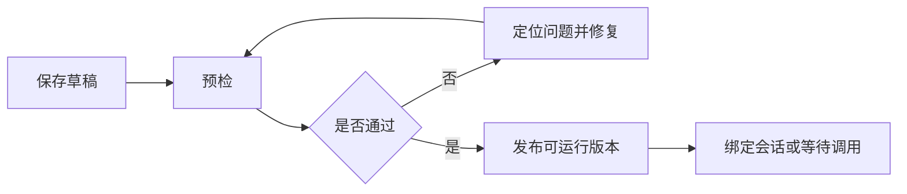
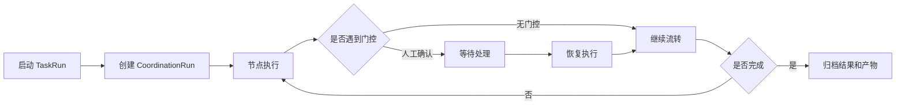

# 76-多Agent持续任务编排平台产品模型与编辑器重构计划

## 0. 文档定位

本文承接 75 号计划，但比 75 号计划更进一步：不再把当前问题定义为“任务图编辑器配置体验不顺”，而是定义为“多 Agent 持续任务编排平台的产品模型、数据模型、编辑模型和运行模型尚未完全对齐”。

75 号计划重点是修复 TaskGraph 配置落点、编辑器体验和运行装配一致性。本文重点是重新确定整个编辑平台的主对象、页面层级、用户心智、编译链路、运行闭环和迁移路线。

本计划有一个核心判断：

```text
我们要建设的不是一个画图工具，
也不是一个主 Agent 临时调用子 Agent 的面板，
而是一个可以设计、发布、运行、监控、续跑的多 Agent 持续任务编排平台。
```

因此，后续实现不应继续以“把旧 CoordinationEditorWorkbench 包装成 TaskGraphWorkbench”为主线，而应以 `TaskGraphDefinition` 作为平台主模型，逐步把旧 coordination/task/topology/protocol 结构收束为兼容层、派生视图或高级配置。

## 1. 当前系统源报告

### 1.1 前端现状

当前主要相关文件：

- `frontend/src/components/workspace/views/TaskSystemView.tsx`
- `frontend/src/components/workspace/views/task-system/TaskGraphWorkbench.tsx`
- `frontend/src/components/workspace/views/task-system/CoordinationEditorWorkbench.tsx`
- `frontend/src/components/workspace/views/task-system/taskGraphDraft.ts`
- `frontend/src/components/workspace/views/task-system/taskGraphTypes.ts`
- `frontend/src/components/workspace/views/task-system/TaskAssemblyPreflightPanel.tsx`
- `frontend/src/components/workspace/views/task-system/TaskRunLoopWorkbenchPanel.tsx`
- `frontend/src/components/workspace/views/task-system/CoordinationTimelinePanel.tsx`

已经存在的优点：

- 有任务域、任务、任务图草稿的选择入口。
- 有画布、节点、边、抽屉、机制控制台、预检面板、运行循环面板。
- 后端已有 TaskGraph 一等模型，前端也已有 `TaskGraphRecord`、`TaskGraphDraft` 等类型基础。
- 任务图已经不只是简单 DAG，已经包含时序、循环、审核门、工作记忆、产物、A2A 通信等能力雏形。

当前主要结构问题：

- `TaskGraphWorkbench.tsx` 仍只是 `CoordinationEditorWorkbench` 的包装层。
- `TaskSystemView.tsx` 同时承担任务管理、图编辑、保存编排、状态桥接、预检入口、运行配置入口，职责过重。
- `CoordinationEditorWorkbench.tsx` 文件体量过大，混合了拓扑、时序、通信、审核、循环、记忆、产物、运行、预检等多个层级。
- `taskGraphDraft.ts` 当前仍是 legacy draft 转换器，而不是平台主草稿模型。
- 前端编辑态仍以 `coordinationDraft/topologyDraft/protocolDraft` 拼装为中心，导致用户以为在编辑 TaskGraph，代码实际仍在维护旧 coordination stack。

### 1.2 后端现状

当前主要相关文件：

- `backend/tasks/task_graph_models.py`
- `backend/tasks/flow_registry.py`
- `backend/tasks/coordination_graph_compiler.py`
- `backend/api/tasks.py`
- `backend/tasks/coordination_graph_models.py`
- `backend/tasks/assembly_builder.py`
- `backend/orchestration/runtime_loop/task_run_loop.py`
- `backend/orchestration/runtime_loop/trace_reader.py`

已经存在的优点：

- `TaskGraphDefinition` 已经是一等后端模型，包含：
  - `entry_node_id`
  - `output_node_id`
  - `nodes`
  - `edges`
  - `runtime_policy`
  - `context_policy`
  - `working_memory_policy`
  - `working_memory_policy_profile_id`
  - `publish_state`
- API 层 `TaskGraphUpsertRequest` 已经支持 `working_memory_policy`、`runtime_policy`、`context_policy`。
- 后端测试已经覆盖部分 TaskGraph 工作记忆策略保存与反读。
- 运行侧已经有 task run、coordination run、trace、checkpoint、resume 的方向。

当前主要结构问题：

- 运行编译入口 `compile_task_graph_runtime_spec()` 仍接收 `CoordinationTaskDefinition`，不是直接接收 `TaskGraphDefinition`。
- `_derive_coordination_task_view_from_graph()` 仍是关键中转层，TaskGraph 的一等语义会在派生成 coordination view 时发生损耗。
- 前端保存时部分配置仍写入 metadata 或旧 draft 字段，而不是稳定写入 TaskGraph 一等字段。
- runtime spec 对节点高级执行字段、边交接契约、工作记忆策略、产物策略、生命周期策略的消费还不够明确。

### 1.3 文档和项目约束

根据项目约束，后续实现必须遵守：

- 遇到问题先考虑结构性问题，少做补丁式修改。
- 大改必须先写计划书，再按计划执行。
- 前端不同架构层级要用明确页面/卡片切换，不要混在一页。
- 不允许用伪造结果应付测试，必须真实通过。
- prompt 必须让 Agent 理解自己的职责，不能把开发字段说明当作 prompt 发给 Agent。
- 无用旧残留代码要清理，不以兼容为理由无限保留。

这意味着本次重构不能只补保存 payload，也不能继续在旧 `CoordinationEditorWorkbench` 里堆更多抽屉字段。必须把平台层级和模型所有权先定清楚。

## 2. 真实问题定义

### 2.1 表面问题

当前用户会感觉：

- 编辑器配置入口太散。
- 不知道先配 Agent、节点、边、时序、记忆还是契约。
- 很多关键能力藏在抽屉里。
- 保存、同步拓扑、发布、预检几个动作语义不清。
- 图编辑器看上去是 TaskGraph，但内部还是 coordination draft。
- 运行时是否真的用了界面配置，用户难以判断。

### 2.2 系统问题

真实系统问题是：

```text
平台缺少一个从“任务意图”到“可运行多 Agent 协同系统”的主流程。
```

具体表现为：

- 主对象不够统一：TaskGraph、CoordinationTask、TopologyTemplate、Protocol 同时争夺编辑中心。
- 配置所有权不够清晰：图级、节点级、边级、阶段级、Agent Profile 默认值之间的优先级没有被界面显式呈现。
- 保存与编译链路不够单一：前端编辑态、保存 payload、后端派生视图、runtime spec 之间存在多次转换。
- 用户界面仍偏底层字段表单，没有充分利用大模型和人类对“职责、交接、审核、返修、产物”的自然理解。
- 运行闭环不够突出：编辑、预检、发布、运行、监控、续跑还没有成为一个连续状态机。

### 2.3 正确终态

正确终态应该是：

```text
用户围绕一个 TaskGraphDefinition 设计持续任务。
平台帮助用户把任务意图转成 Agent 编组、节点职责、交接契约、时序生命周期、记忆产物策略。
保存、反读、预检、发布、运行装配、运行监控都消费同一个规范模型。
```

## 3. 推荐设计方向

### 3.1 产品命名

建议把模块从“任务图编辑器”升级为：

```text
多 Agent 持续任务编排平台
Multi-Agent TaskGraph Studio
```

内部仍可保留 `TaskGraphWorkbench` 命名，但产品设计文档和导航语义应强调“持续任务编排”，而不是“画图”。

### 3.2 主对象

平台 primary object：

```text
TaskGraphDefinition
```

降级为派生视图或兼容对象：

```text
CoordinationTaskDefinition
TopologyTemplate
TaskCommunicationProtocol
CoordinationGraphSpec
RuntimeAssembly
```

不建议继续把 `CoordinationTaskDefinition` 作为编辑器主状态。它可以作为旧接口兼容、列表展示、派生视图和运行桥接，但不能继续主导编辑体验。

### 3.3 设计原则

1. 单一主模型

所有图级配置、节点、边、上下文、记忆、运行策略最终都应落到 `TaskGraphDefinition`。

2. 明确配置所有权

每个字段必须有明确归属：

- 图级字段：只影响整个协同任务。
- 节点字段：只影响该节点执行。
- 边字段：只影响节点间交接。
- 阶段字段：只影响生命周期、审核门、退出条件。
- Agent Profile：只提供默认能力，不覆盖显式配置。
- Runtime：只消费已发布模型，不临时猜测配置。

3. 面向 Agent 理解，而不是面向开发字段

错误写法：

```text
这是 runtime 节点。
根据任务图执行 world_review。
这个节点用于校验资产。
```

正确写法：

```text
你是一名世界观审核员。
你只负责评审当前世界观设定是否完整、一致、可支撑后续写作。
你不负责替创作者扩写设定。
你需要指出问题、给出裁决、说明是否允许进入下一阶段。
```

平台中所有模板、节点职责卡片、Agent 指令预览、运行装配 prompt 都必须遵守这个原则。

4. 配置优先级可见

推荐优先级：

```text
节点显式配置
  -> 边/阶段显式配置
  -> 图级默认策略
  -> Agent 角色预设
  -> Agent Profile 默认能力
  -> 系统默认值
```

界面中关键字段应显示来源，例如：

```text
执行模式：parallel
来源：节点显式配置
```

5. 发布是状态机，不是 checkbox

发布流程应是：

```text
draft
  -> saved
  -> preflight_passed
  -> published
  -> run_bound
  -> running
  -> paused / waiting_human / completed / failed
```

不要再让“发布 checkbox”和“发布按钮”承担同一语义。

## 4. 平台信息架构

### 4.1 顶层结构

建议把平台拆成两个层级：

```text
任务系统管理层
  -> 多 Agent 持续任务编排平台
```

任务系统管理层处理：

- 任务域
- 具体任务
- workflow
- contract library
- projection
- execution policy
- memory profile

多 Agent 持续任务编排平台处理：

- 一个 `TaskGraphDefinition` 的设计、预检、发布、运行、监控、续跑。

两个层级之间用明确卡片入口切换，不在同一页面混杂所有配置。

### 4.2 平台页面

#### 页面一：任务蓝图

用途：回答“这个持续任务是什么”。

主要内容：

- 图名称、图 ID、任务域、绑定任务。
- 任务意图：创作、审核、检索、数据分析、资料整理、长期项目等。
- 图类型：单 Agent 长任务、管线多 Agent、并行审查、审核门返修循环、长期运行循环。
- 协调者 Agent。
- 参与 Agent 概览。
- 入口节点、出口节点。
- 当前状态：草稿、已保存、预检通过、已发布、已绑定运行。

落点：

- `TaskGraphDefinition.graph_id`
- `title`
- `domain_id`
- `task_family`
- `graph_kind`
- `entry_node_id`
- `output_node_id`
- `runtime_policy.coordinator_agent_id`
- `runtime_policy.coordination_mode`
- `publish_state`
- `metadata.task_intent`

#### 页面二：Agent 编组

用途：回答“有哪些 Agent 参与，每个 Agent 是谁、负责什么、有什么权限”。

主要内容：

- 协调者。
- 参与者列表。
- 每个 Agent 的职责描述。
- 每个 Agent 的可用能力、工具授权、上下文权限、记忆权限。
- 角色预设：策划、起草、审核、汇总、检索、表格分析、PDF 分析、RAG 检索等。
- 角色与节点的绑定关系。

落点：

- `runtime_policy.participant_agent_ids`
- `runtime_policy.agent_group_id`
- `nodes[].agent_id`
- `nodes[].work_posture`
- `nodes[].context_visibility_policy`
- `nodes[].memory_read_policy`
- `nodes[].memory_writeback_policy`
- `nodes[].metadata.role_prompt`

关键要求：

- 这里的职责描述必须是可直接给 Agent 理解的自然职责，不是开发字段说明。
- 这里不是主 Agent 调用子 Agent 权限面板，而是持续任务中的 Agent 编组面板。

#### 页面三：拓扑编排

用途：回答“工作如何流动”。

主要内容：

- 画布节点。
- 节点连线。
- 添加任务节点、角色节点、审核节点、汇合节点、人工门控节点。
- 快速设为入口、出口、审核门、汇合点。
- 选中节点后打开节点职责卡片。
- 选中边后打开交接契约卡片。

落点：

- `nodes[]`
- `edges[]`

设计要求：

- 画布只负责结构和选择，不承载所有高级字段。
- 节点 inspector 只展示核心配置。
- 高级配置进入独立页或抽屉，但不能让用户必须靠抽屉完成主路径。

#### 页面四：职责与交接

用途：回答“节点具体负责什么，节点之间交给对方什么”。

节点职责卡片应回答：

```text
这个节点是谁？
它只负责什么？
它不负责什么？
它读取什么输入？
它产出什么输出？
完成标准是什么？
失败后交给谁？
```

边交接卡片应回答：

```text
这条边传递什么？
下游什么时候可以开始？
是否需要确认接收？
失败如何传播？
是否只传摘要/引用？
是否携带文件产物？
```

落点：

- `nodes[].task_id`
- `nodes[].agent_id`
- `nodes[].node_contract_id`
- `nodes[].input_contract_id`
- `nodes[].output_contract_id`
- `nodes[].failure_policy`
- `nodes[].review_gate_policy`
- `edges[].edge_type`
- `edges[].a2a_message_type`
- `edges[].payload_contract_id`
- `edges[].ack_required`
- `edges[].ack_policy`
- `edges[].wait_policy`
- `edges[].result_delivery_policy`
- `edges[].failure_propagation_policy`
- `edges[].working_memory_handoff_policy`

#### 页面五：时序与循环

用途：回答“这个任务如何持续运行、如何返修、如何退出”。

主要内容：

- 阶段列表。
- 每个阶段的入口、出口、审核门。
- 节点 sequence index。
- 并行组。
- 循环体、返修目标、最大尝试次数。
- 阶段退出条件。
- 人工确认点。
- 后台节点和阻塞关系。

落点：

- `metadata.timeline_policy`
- `metadata.timeline_frames`
- `metadata.phase_definitions`
- `nodes[].phase_id`
- `nodes[].sequence_index`
- `nodes[].timeline_group_id`
- `nodes[].main_chain`
- `nodes[].blocks_phase_exit`
- `nodes[].loop_policy`
- `nodes[].review_gate_policy`
- `nodes[].background_policy`
- `nodes[].resource_lifecycle_policy`

#### 页面六：上下文、记忆与产物

用途：回答“Agent 读什么、传什么、写回什么、产物放哪里”。

主要内容：

- 图级上下文共享策略。
- 图级工作记忆策略。
- 节点读策略。
- 节点写回策略。
- 边交接记忆策略。
- 动态读取策略。
- 图级产物目录和命名规则。
- 节点产物要求。
- 产物晋升、归档、冲突处理。

落点：

- `context_policy`
- `working_memory_policy`
- `working_memory_policy_profile_id`
- `metadata.artifact_policy`
- `nodes[].memory_read_policy`
- `nodes[].memory_writeback_policy`
- `nodes[].dynamic_memory_read_policy`
- `nodes[].artifact_policy`
- `edges[].working_memory_handoff_policy`
- `edges[].artifact_ref_policy`
- `edges[].context_filter_policy`

#### 页面七：契约与质量门

用途：回答“如何保证每一步输出可用”。

主要内容：

- 图契约。
- 节点输入/输出契约。
- 边 payload 契约。
- 审核契约。
- 运行质量门。
- 预检问题定位。
- contract manifest 预览。

落点：

- `graph_contract_id`
- `nodes[].node_contract_id`
- `nodes[].input_contract_id`
- `nodes[].output_contract_id`
- `edges[].payload_contract_id`
- `metadata.quality_gate_policy`

#### 页面八：预检、发布与运行

用途：回答“现在能不能运行，运行后如何看见和续跑”。

主要内容：

- 保存草稿。
- 运行预检。
- 预检通过后发布。
- 发布快照。
- 绑定会话。
- 启动运行。
- 查看 TaskRun / CoordinationRun / Trace。
- 人工门控处理。
- 暂停、恢复、续跑。

落点：

- 不新增主要配置。
- 读取并校验：
  - `TaskGraphDefinition`
  - `ContractManifest`
  - `TaskGraphRuntimeSpec`
  - `RuntimeAssembly`
  - `TaskRun`
  - `CoordinationRun`
  - `Trace`

## 5. 用户主流程

### 5.1 新建任务图


模板至少包括：

- 单 Agent 长任务
- 管线式多 Agent
- 并行审查 + 协调者汇总
- 审核门 + 返修循环
- RAG + 资料分析 + 写作
- PDF 分析 + 表格分析 + 汇总
- 长期项目循环执行

### 5.2 编辑任务图


用户不应被迫按这个顺序操作，但平台应该提供这个主路径。

### 5.3 发布任务图



### 5.4 运行与续跑



## 6. 数据模型设计

### 6.1 前端主草稿模型

新增：

```text
frontend/src/components/workspace/views/task-system/taskGraphDraftV2.ts
```

建议类型：

```ts
type TaskGraphDraftV2 = {
  graph_id: string;
  title: string;
  domain_id: string;
  task_family: string;
  task_id: string;
  graph_kind: "single_agent" | "multi_agent" | "coordination";
  entry_node_id: string;
  output_node_id: string;
  nodes: TaskGraphNodeDraftV2[];
  edges: TaskGraphEdgeDraftV2[];
  graph_contract_id: string;
  default_protocol_id: string;
  runtime_policy: TaskGraphRuntimePolicyDraftV2;
  context_policy: TaskGraphContextPolicyDraftV2;
  working_memory_policy_profile_id: string;
  working_memory_policy: TaskGraphWorkingMemoryPolicyDraftV2;
  publish_state: "draft" | "saved" | "preflight_passed" | "published" | "run_bound" | "archived";
  metadata: TaskGraphMetadataDraftV2;
  ui_state: TaskGraphEditorUiState;
};
```

注意：

- `ui_state` 只存在前端，不保存到后端业务模型。
- `publish_state` 前端可以比后端更细，但保存到后端时需要映射到当前后端支持的 `draft/published/archived`，细状态可临时放 `metadata.editor_publish_state`，后端阶段二再一等化。
- 旧 `coordinationDraft/topologyDraft/protocolDraft` 只作为迁移输入，不再作为编辑主状态。

### 6.2 后端模型补齐方向

短期不必大改 `TaskGraphDefinition`，因为它已经比较完整。

短期需要补齐：

- `TaskGraphRecord` 前端类型补齐 `working_memory_policy_profile_id` 和 `working_memory_policy`。
- 保存层保证 runtime/context/working-memory 写入一等字段。
- `_derive_coordination_task_view_from_graph()` 只作为兼容派生，不作为新编译主路径。

中期新增：

```text
compile_task_graph_definition_runtime_spec(graph: TaskGraphDefinition, ...)
```

它直接消费 `TaskGraphDefinition`，不再依赖 `CoordinationTaskDefinition`。

旧函数：

```text
compile_task_graph_runtime_spec(coordination_task: CoordinationTaskDefinition, ...)
```

保留一段迁移期，但内部可转调新函数或作为旧数据入口。

### 6.3 配置落点规则

必须写入一等字段：

- `runtime_policy.coordinator_agent_id`
- `runtime_policy.participant_agent_ids`
- `runtime_policy.agent_group_id`
- `runtime_policy.coordination_mode`
- `runtime_policy.default_execution_mode`
- `runtime_policy.default_wait_policy`
- `runtime_policy.max_parallel_nodes`
- `runtime_policy.default_timeout_seconds`
- `context_policy.shared_context_policy`
- `context_policy.memory_sharing_policy`
- `working_memory_policy_profile_id`
- `working_memory_policy`
- `entry_node_id`
- `output_node_id`

允许保留在 metadata：

- `timeline_policy`
- `timeline_frames`
- `phase_definitions`
- `artifact_policy`
- `quality_gate_policy`
- `editor_publish_state`
- `migration_source`
- `layout`
- `display`

禁止长期保留在 metadata：

- coordinator
- participants
- agent group
- coordination mode
- context policy
- working memory policy
- graph entry/output
- publish state

### 6.4 配置优先级

运行装配时必须按以下顺序解析：

```text
节点显式配置
  -> 边/阶段显式配置
  -> 图级 runtime/context/memory policy
  -> Agent role preset
  -> AgentRuntimeProfile 默认能力
  -> 系统默认值
```

预检层必须能解释配置来源：

```json
{
  "field": "execution_mode",
  "effective_value": "parallel",
  "source": "node.explicit",
  "source_ref": "node:reviewer_1"
}
```

## 7. 编译与运行设计

### 7.1 编译链路目标

目标链路：

```text
TaskGraphDefinition
  -> TaskGraphPreflightReport
  -> TaskGraphRuntimeSpec
  -> RuntimeAssembly
  -> TaskRun / CoordinationRun
  -> Trace / Checkpoint / Resume
```

旧链路：

```text
TaskGraphDefinition
  -> CoordinationTaskDefinition
  -> TaskGraphRuntimeSpec
```

旧链路只用于兼容，不应继续作为新平台核心链路。

### 7.2 RuntimeSpec 必须保留的语义

`TaskGraphRuntimeSpec` 不能只保留节点、边、agent_id。它至少要能表达：

- 节点有效执行模式。
- 节点等待策略。
- 节点 join 策略。
- 节点上下文可见性。
- 节点工作记忆读写策略。
- 节点动态读取策略。
- 节点产物策略。
- 边交接契约。
- 边 ack 策略。
- 边等待策略。
- 边失败传播。
- 边结果投递。
- 阶段、循环、审核门。
- 人工门控。
- 配置来源 diagnostics。

### 7.3 Agent Prompt 装配规则

运行装配生成给 Agent 的 prompt 时，应按职责语言生成：

```text
你是一名{角色名称}。
你只负责{职责范围}。
你不负责{排除范围}。
你将收到{输入来源}。
你必须产出{输出契约}。
你完成后需要{交接方式}。
如果发现{失败条件}，你需要{失败处理}。
```

禁止把以下内容直接作为 Agent prompt：

```text
node_id: world_review
execution_mode: sync
runtime_lane: review
```

这些可以进入 runtime metadata、trace 或调试视图，但不能替代职责 prompt。

## 8. 前端平台设计

### 8.1 Shell 布局

建议布局：

```text
顶部：任务域 / 任务 / 图版本 / 状态 / 保存 / 预检 / 发布
左侧：层级卡片导航
中间：当前页面主工作区
右侧：当前选中对象 inspector
底部：问题条 / 预检摘要 / 最近保存状态
```

左侧层级卡片：

- 任务蓝图
- Agent 编组
- 拓扑编排
- 职责与交接
- 时序与循环
- 上下文/记忆/产物
- 契约与质量门
- 预检/发布/运行

### 8.2 卡片导航规则

不同层级必须用明确页面切换，不混在一个画布页：

- 图级配置在任务蓝图页。
- Agent 角色与权限在 Agent 编组页。
- 节点和边结构在拓扑页。
- 节点职责和边交接在职责与交接页。
- 时序、循环、审核门在时序页。
- 记忆和产物在记忆产物页。
- 预检发布运行在发布页。

### 8.3 Inspector 规则

右侧 inspector 只展示当前页面相关的选中对象配置。

例如：

- 拓扑页选中节点：显示节点名称、节点类型、绑定 Agent、绑定任务、快速操作。
- 职责页选中节点：显示职责 prompt、输入输出、完成标准。
- 记忆页选中节点：显示读写策略、动态读取策略。
- 时序页选中节点：显示阶段、顺序、循环、阻塞关系。

不要让一个 inspector 根据抽屉类型承载所有页面的所有配置。

### 8.4 空态和引导

新图不应直接进入空画布，而应进入模板向导。

空态必须告诉用户下一步动作：

- 没有 Agent：先添加协调者和参与 Agent。
- 没有节点：从模板生成或添加任务节点。
- 没有边：选择两个节点建立交接。
- 没有审核门：如果图类型需要审核门，则提示添加。
- 没有预检：提示先保存草稿再运行预检。

### 8.5 可用性要求

- 保持密集控制台风格，不做营销式页面。
- 使用扁平、低装饰、高信息密度视觉。
- 减少卡片嵌套。
- 关键状态必须显式文字 + 颜色，不只靠颜色。
- 所有 icon button 必须有可访问名称。
- 预检错误可点击定位到节点、边、阶段或图级页面。
- 小屏进入单列分步模式，不挤压三栏。

## 9. 组件拆分计划

新增主组件：

- `TaskGraphStudioShell.tsx`
- `TaskGraphLayerNav.tsx`
- `TaskGraphTopBar.tsx`
- `TaskGraphIssueBar.tsx`

新增页面组件：

- `TaskGraphBlueprintPage.tsx`
- `TaskGraphAgentRosterPage.tsx`
- `TaskGraphTopologyPage.tsx`
- `TaskGraphResponsibilityPage.tsx`
- `TaskGraphTimelinePage.tsx`
- `TaskGraphMemoryArtifactPage.tsx`
- `TaskGraphContractQualityPage.tsx`
- `TaskGraphPublishRunPage.tsx`

新增领域组件：

- `TaskGraphSetupWizard.tsx`
- `AgentRoleCard.tsx`
- `NodeResponsibilityCard.tsx`
- `EdgeHandoffCard.tsx`
- `TimelinePhaseEditor.tsx`
- `ReviewGateEditor.tsx`
- `WorkingMemoryPolicyEditor.tsx`
- `ArtifactPolicyEditor.tsx`
- `TaskGraphPreflightReport.tsx`
- `TaskGraphRuntimeTracePanel.tsx`

新增模型和服务：

- `taskGraphDraftV2.ts`
- `taskGraphDraftMappers.ts`
- `taskGraphSaveMapper.ts`
- `taskGraphEffectivePolicy.ts`
- `taskGraphPreflight.ts`
- `taskGraphTemplates.ts`
- `taskGraphPromptPreview.ts`

逐步瘦身：

- `TaskSystemView.tsx`
- `CoordinationEditorWorkbench.tsx`
- `TaskGraphWorkbench.tsx`
- `taskGraphDraft.ts`

最终目标：

- `TaskSystemView.tsx` 只负责选择上下文和路由到平台。
- `TaskGraphWorkbench.tsx` 成为真正的平台 shell。
- `CoordinationEditorWorkbench.tsx` 删除或只保留短期迁移入口。

## 10. 实施计划

### 阶段一：冻结目标模型与保存映射

目标：

- 明确 `TaskGraphDraftV2`。
- 补齐前端 `TaskGraphRecord` 类型。
- 建立保存/反读 mapper。
- 不重做 UI，只修数据主链路。

任务：

- 新增 `taskGraphDraftV2.ts`。
- 新增 `taskGraphDraftMappers.ts`。
- 新增 `taskGraphSaveMapper.ts`。
- 从 `TaskGraphRecord` 反读时优先读取一等字段。
- 保存时写入 runtime/context/working-memory 一等字段。
- entry/output 使用显式字段，缺失时用统一推断函数。
- metadata 只保留允许保留的扩展策略。

验收：

- coordinator 保存后后端派生不回退 `agent:0`。
- participants 保存后不丢。
- working memory policy 保存和反读不丢。
- runtime policy 保存和反读不丢。
- entry/output 不依赖节点数组顺序。

不允许：

- 不允许只在 `saveCoordinationStack` 里堆临时字段。
- 不允许新增更多 metadata 兜底作为长期方案。

### 阶段二：建立 TaskGraphStudioShell

目标：

- 让平台 UI 不再由旧 `CoordinationEditorWorkbench` 主导。
- 建立层级卡片导航和页面容器。

任务：

- 新增 `TaskGraphStudioShell.tsx`。
- 新增 `TaskGraphLayerNav.tsx`。
- 新增 `TaskGraphTopBar.tsx`。
- 先把现有画布作为 `TaskGraphTopologyPage` 的内部组件迁入。
- 顶部按钮语义改为：
  - 保存草稿
  - 运行预检
  - 发布可运行
  - 带入会话
  - 打开运行

验收：

- 用户进入编辑器后看到的是平台层级，而不是所有字段混在一个画布。
- 不同层级用卡片式导航切换。
- 保存、预检、发布状态清楚。

不允许：

- 不允许把 8 个页面都塞到一个超大组件。
- 不允许继续让发布 checkbox 和发布按钮并存。

### 阶段三：模板向导与 Agent 编组

目标：

- 让用户从任务意图开始，而不是从空画布开始。
- 把 Agent 编组变成一等页面。

任务：

- 新增 `TaskGraphSetupWizard.tsx`。
- 新增 `taskGraphTemplates.ts`。
- 新增 `TaskGraphAgentRosterPage.tsx`。
- 模板生成节点、边、默认入口出口、协调者、参与者、默认记忆策略、默认时序。
- Agent 角色卡片生成可读职责 prompt。

验收：

- 新建图时可以选择模板并生成可预检草稿。
- Agent 页面可以清楚看到协调者、参与者、职责、权限、能力边界。
- 节点 prompt 是职责语言，不是字段说明。

不允许：

- 不允许模板生成没有职责语义的节点。
- 不允许生成假数据绕过预检。

### 阶段四：职责与交接页面

目标：

- 把节点配置从字段表单升级为职责卡片。
- 把边配置从连线属性升级为交接契约。

任务：

- 新增 `TaskGraphResponsibilityPage.tsx`。
- 新增 `NodeResponsibilityCard.tsx`。
- 新增 `EdgeHandoffCard.tsx`。
- 节点职责卡片映射节点字段和 prompt preview。
- 边交接卡片映射 edge contract、ack、wait、failure、memory handoff。

验收：

- 用户不看 JSON 也能配置节点职责和边交接。
- Agent prompt preview 可解释。
- 边的 payload、ack、等待、失败传播都能预检。

### 阶段五：时序、循环、审核门一等化

目标：

- 把持续任务生命周期从抽屉升级为一等页面。

任务：

- 新增 `TaskGraphTimelinePage.tsx`。
- 复用并整理 `taskGraphTimeline.ts`。
- 建立 phase editor、parallel group editor、loop editor、review gate editor。
- 预检能定位阶段错误。

验收：

- 用户能看见阶段、并行、循环、审核门。
- 返修路径和退出条件可视化。
- human gate 不再只是节点字段，而是生命周期节点。

### 阶段六：上下文、记忆与产物页面

目标：

- 让多 Agent 连续协作中的信息边界清晰。

任务：

- 新增 `TaskGraphMemoryArtifactPage.tsx`。
- 新增 `WorkingMemoryPolicyEditor.tsx`。
- 新增 `ArtifactPolicyEditor.tsx`。
- 图级、节点级、边级记忆策略统一展示。
- 产物策略明确根目录、命名、必需产物、晋升规则。

验收：

- 用户能判断每个 Agent 能读什么、写什么、交接什么。
- 工作记忆策略保存到 TaskGraph 一等字段。
- 产物策略保存到明确 metadata 扩展字段并被预检识别。

### 阶段七：契约、预检、发布、运行闭环

目标：

- 把“能不能运行”变成平台明确流程。

任务：

- 新增 `TaskGraphContractQualityPage.tsx`。
- 新增 `TaskGraphPublishRunPage.tsx`。
- 新增 `taskGraphPreflight.ts`。
- 预检报告定位图级、节点、边、阶段、契约、记忆、产物问题。
- 接入 runtime trace panel。
- 发布后绑定 run monitor。

验收：

- 发布前必须有预检结果。
- 预检问题可点击定位。
- 发布后能进入运行监控。
- 等待人工、失败、暂停、续跑状态清楚。

### 阶段八：直接编译 TaskGraphDefinition

目标：

- 后端运行编译不再依赖旧 CoordinationTaskDefinition 作为主路径。

任务：

- 新增 `compile_task_graph_definition_runtime_spec()`。
- 旧 `compile_task_graph_runtime_spec()` 保留兼容入口。
- API 新增或切换到 TaskGraphDefinition 编译路径。
- RuntimeSpec 保留更多配置来源 diagnostics。
- 测试覆盖 direct graph compile 和 legacy coordination compile 一致性。

验收：

- 新图发布运行不需要先损耗成 coordination view。
- 旧图仍可运行。
- RuntimeSpec 能解释有效配置来源。

## 11. 文件级执行清单

### 前端

- `frontend/src/lib/api.ts`
  - 补齐 TaskGraph 类型。
  - 新增必要 runtime/preflight API 类型。

- `frontend/src/components/workspace/views/TaskSystemView.tsx`
  - 瘦身为选择上下文和平台入口。
  - 移出保存 mapper、图状态 reducer、编辑页面逻辑。

- `frontend/src/components/workspace/views/task-system/TaskGraphWorkbench.tsx`
  - 从旧 wrapper 改为真正平台 shell。

- `frontend/src/components/workspace/views/task-system/CoordinationEditorWorkbench.tsx`
  - 分阶段拆分。
  - 最终删除或降级为 legacy migration component。

- `frontend/src/components/workspace/views/task-system/taskGraphDraft.ts`
  - 保留为 legacy 转换器。

- `frontend/src/components/workspace/views/task-system/taskGraphDraftV2.ts`
  - 新增主草稿模型。

- `frontend/src/components/workspace/views/task-system/taskGraphSaveMapper.ts`
  - 新增保存 payload 构造。

- `frontend/src/components/workspace/views/task-system/taskGraphEffectivePolicy.ts`
  - 新增配置优先级解析和来源解释。

- `frontend/src/components/workspace/views/task-system/taskGraphPreflight.ts`
  - 新增前端预检和定位结构。

- `frontend/src/components/workspace/views/task-system/taskGraphTemplates.ts`
  - 新增模板生成器。

### 后端

- `backend/tasks/task_graph_models.py`
  - 保持 TaskGraphDefinition 主模型。
  - 如需要，补充 publish state 或 metadata 规范。

- `backend/tasks/flow_registry.py`
  - 保留旧派生视图。
  - 补齐 TaskGraph 一等字段到 coordination view 的过渡映射。

- `backend/tasks/coordination_graph_compiler.py`
  - 新增直接消费 TaskGraphDefinition 的编译函数。

- `backend/tasks/coordination_graph_models.py`
  - 补齐 runtime spec 需要表达的字段。

- `backend/api/tasks.py`
  - 新增或切换 task graph preflight/runtime spec API。

- `backend/orchestration/runtime_loop/task_run_loop.py`
  - 接入发布后的 TaskGraph runtime spec。

- `backend/orchestration/runtime_loop/trace_reader.py`
  - 支持平台运行页读取 trace。

### 测试

- `backend/tests/task_graph_registry_test.py`
  - 覆盖 TaskGraph 一等字段保存反读。

- `backend/tests/task_system_api_regression.py`
  - 覆盖 API upsert 和 runtime spec 编译。

- 新增前端测试：
  - `frontend/src/components/workspace/views/task-system/taskGraphSaveMapper.test.ts`
  - `frontend/src/components/workspace/views/task-system/taskGraphEffectivePolicy.test.ts`
  - `frontend/src/components/workspace/views/task-system/taskGraphTemplates.test.ts`

## 12. 迁移与切换规则

### 12.1 Shadow 阶段

新旧模型同时存在：

- 新编辑器使用 `TaskGraphDraftV2`。
- 保存时写 TaskGraph 一等字段。
- 同时保留旧 metadata refs，便于旧页面读取。
- 旧 `CoordinationEditorWorkbench` 可继续打开旧数据。

### 12.2 Cutover 阶段

满足以下条件后切换：

- 新 TaskGraphStudio 可完成新建、编辑、保存、预检、发布。
- mapper 测试覆盖核心字段。
- 后端直接编译 TaskGraphDefinition 测试通过。
- 旧图可迁移打开并保存为新格式。

切换动作：

- 默认入口进入 TaskGraphStudio。
- 旧 CoordinationEditorWorkbench 从主路由移除。
- legacy mapper 只在打开旧数据时使用。

### 12.3 Cleanup 阶段

删除：

- 无用旧 draft 字段。
- 不再使用的 topology/protocol 编辑入口。
- 不再使用的旧测试。
- metadata 中已迁移到一等字段的长期兜底逻辑。

保留：

- 旧数据读取迁移函数。
- migration diagnostics。
- 必要的后端兼容 API。

### 12.4 回滚规则

每阶段必须保持可回滚：

- 阶段一只新增 mapper，不删除旧编辑器。
- 阶段二 shell 可用 feature flag 或入口切换回旧 wrapper。
- 阶段八新编译器上线前保留旧 compiler。
- 如果新平台预检或保存出现阻塞，回滚到旧编辑器入口，但保存数据不应破坏 TaskGraph 一等字段。

## 13. 验证矩阵

### 13.1 数据验证

- 新建图保存后，TaskGraph 一等字段完整。
- 旧图打开后，能迁移为 V2 草稿。
- 保存后再打开，配置不丢。
- metadata 中旧 runtime/working_memory/context 不再作为主来源。
- entry/output 不依赖数组顺序。

### 13.2 编译验证

- 单 Agent 长任务可编译。
- 多 Agent 管线可编译。
- 并行审查可编译。
- 审核门返修循环可编译。
- RAG + PDF + 表格分析组合可编译。
- 工作记忆策略进入 runtime diagnostics。
- 产物策略进入 runtime diagnostics 或 artifact assembly。

### 13.3 UI 验证

用本地 Edge 浏览器验证：

- 375 宽度。
- 768 宽度。
- 1024 宽度。
- 1440 宽度。

场景：

- 新建图。
- 选择模板。
- 配置 Agent 编组。
- 添加节点。
- 添加边。
- 配置职责 prompt。
- 配置交接契约。
- 配置审核门和返修。
- 配置工作记忆。
- 保存。
- 预检。
- 发布。
- 带入会话。
- 查看运行监控。

### 13.4 语义验证

必须人工检查：

- 节点 prompt 是否是 Agent 可理解的职责语言。
- 是否有开发字段说明混入 prompt。
- 审核 Agent 是否清楚“只审核，不扩写”。
- 协调者是否清楚“汇总、裁决、推进阶段”。
- RAG/PDF/表格分析 Agent 是否清楚输入输出边界。

## 14. 禁止的反模式

后续实现中禁止：

- 只为了某个失败场景在保存函数里补字段。
- 继续把核心配置藏在 metadata。
- 继续让 `CoordinationEditorWorkbench` 承担所有新页面职责。
- 用 checkbox 表达发布动作。
- 把不同层级配置混在同一个画布页。
- 让用户必须编辑 JSON 才能完成常见任务。
- 把开发说明当作 Agent prompt。
- 为了测试通过伪造运行结果。
- 以兼容为理由长期保留无用旧代码。

## 15. 完成标准

本计划完成后，应满足：

- 平台主对象是 `TaskGraphDefinition`。
- 用户可以从任务意图和模板开始配置持续任务。
- Agent 编组、拓扑、职责、交接、时序、记忆、契约、发布运行各自有清晰页面。
- 保存、反读、预检、发布、运行装配消费同一套规范模型。
- TaskGraph 可直接编译为 runtime spec。
- 旧 coordination view 只是兼容视图，不再主导编辑体验。
- prompt 语言面向 Agent 理解，而不是开发字段说明。
- 运行后能进入 trace、checkpoint、resume 闭环。

最终平台应该让用户能自然回答：

```text
这个任务为什么需要多个 Agent？
每个 Agent 负责什么？
他们如何交接？
什么时候审核？
失败后如何返修？
上下文和记忆如何流动？
产物如何落盘和晋升？
现在是否可以发布运行？
运行中卡在哪里，如何续跑？
```

只要这些问题在平台中都有明确入口和真实落点，多 Agent 持续任务编排才算真正成立。
