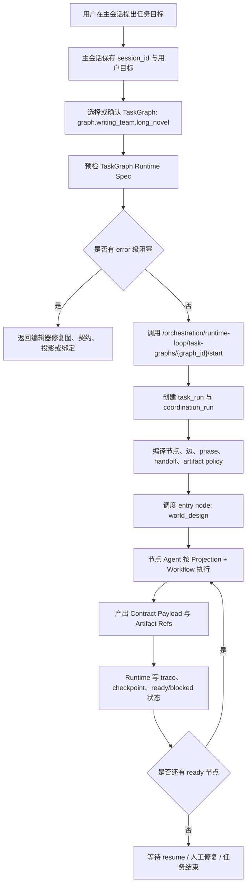
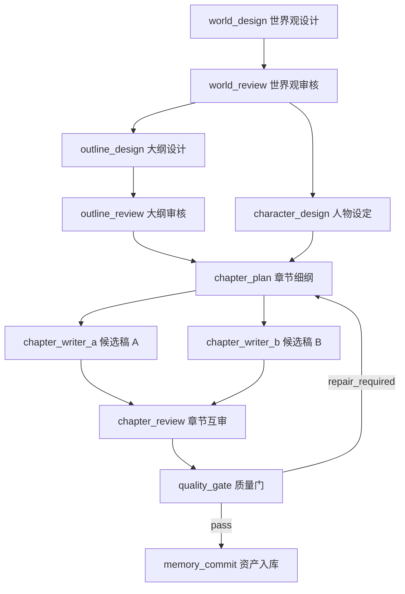
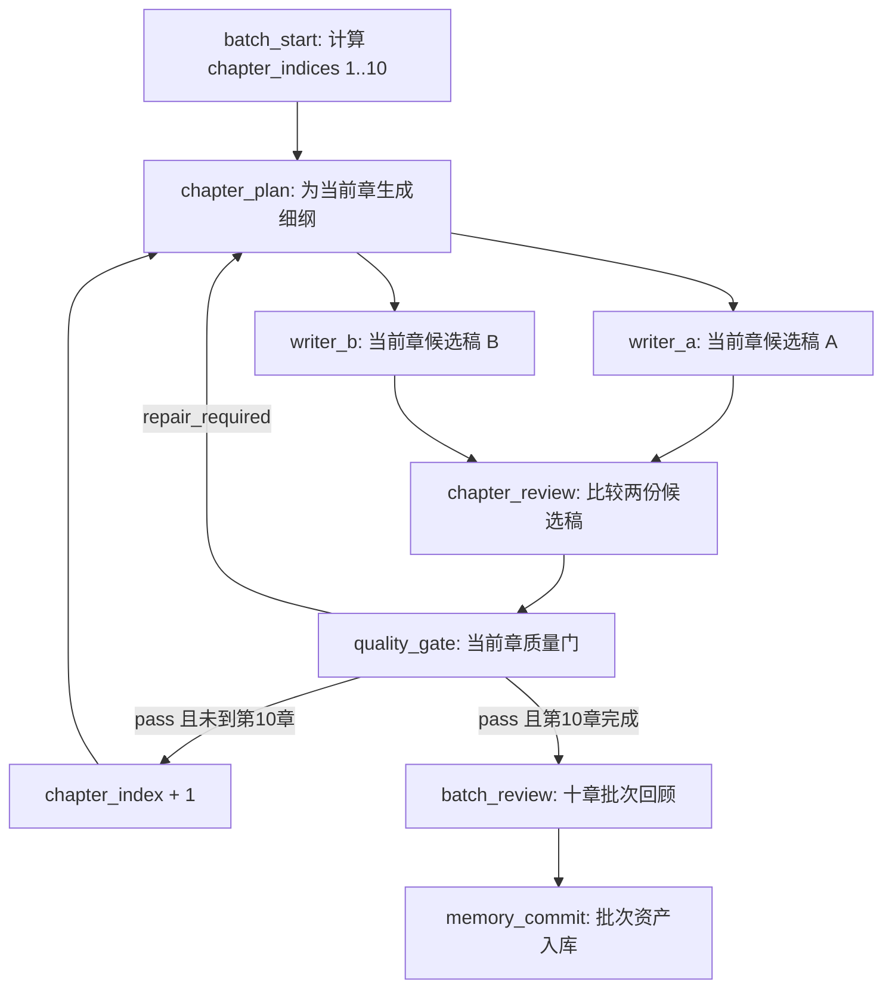

# 89-多Agent协调任务调用流程与十章批次写作测试方案

## 0. 文档定位

本文回答两个问题：

1. 多 Agent 协调任务从主会话、TaskGraph Studio 到 runtime-loop 的完整调用流程是什么。
2. 长篇小说写作团队能否改成“每轮写十章”，以及应该怎么测试和落地。

结论先行：

- 当前系统已经支持 TaskGraph 独立启动，并能绑定主会话 `session_id`。
- 当前 `graph.writing_team.long_novel` 是“单章一轮”的任务图。
- 运行层已有 `chapter_index` 与章节循环的基础能力，但没有完整的“十章批次”主语义。
- “每轮写十章”可以做，但应设计成 `chapter_batch`，而不是让一个写作者节点一次吐出十章正文。
- 第一轮测试不建议直接跑十章正文，应先跑 `world_design -> world_review`，确认主 Agent、Projection、Contract、trace 和 ready 状态正常。

## 1. 当前代码依据

### 1.1 任务图启动入口

后端入口：

- `backend/api/orchestration.py`
- `POST /orchestration/runtime-loop/task-graphs/{graph_id}/start`

请求模型：

- `session_id`
- `task_id`
- `initial_inputs`
- `require_published`
- `include_trace`

该接口会：

1. 从 `TaskFlowRegistry` 读取 `graph_id`。
2. 检查 `publish_state`。
3. 编译 `TaskGraphRuntimeSpec`。
4. 调用 `runtime.query_runtime.task_run_loop.start_task_graph_run(...)`。
5. 返回 `task_run_id`、`coordination_run_id`、checkpoint、runtime spec 和可选 trace。

### 1.2 前端运行入口

前端 API：

- `frontend/src/lib/api.ts`
- `startTaskGraphRuntimeLoopRun(graphId, payload)`

前端页面：

- `frontend/src/components/workspace/views/task-system/TaskGraphPublishRunPage.tsx`

当前页面已经能从 TaskGraph Studio 的“预检与运行”层发起：

```ts
startTaskGraphRuntimeLoopRun(graphId, {
  session_id: runSessionId.trim() || "session:task_graph_studio",
  include_trace: true,
  require_published: true,
})
```

### 1.3 主会话入口

主会话接口：

- `backend/api/chat.py`
- `POST /chat`

它接收：

- `message`
- `session_id`
- `ephemeral_system_messages`
- `explicit_subtasks`
- `search_policy`
- `task_selection`

但当前 `/chat` 不是 TaskGraph 启动接口。它可以携带 `task_selection`，也可以和主会话共享 `session_id`，但还没有直接把“用户说启动写作团队”自动转成 `start_task_graph_runtime_loop_run` 的结构化调用。

因此现在的真实调用方式是：

- 主会话提供上下文和 `session_id`。
- TaskGraph Studio 或编排层显式调用任务图启动接口。
- 运行 trace 再绑定回同一个 `session_id`。

## 2. 多 Agent 协调任务完整调用流程

### 2.1 总流程



### 2.2 主会话与任务图的关系

主会话不应该直接承载所有节点执行细节。正确关系是：

- 主会话：任务目标、用户补充、最终可读进度。
- TaskGraph：结构、节点、边、契约、时序。
- Projection：Agent 角色理解和 prompt。
- Workflow：节点内执行步骤。
- Runtime-loop：创建运行、调度节点、记录 trace、维护 checkpoint。
- Artifact / Memory：保存正式资产和可引用结果。

主会话可以启动任务，但启动动作应是结构化动作：

```json
{
  "graph_id": "graph.writing_team.long_novel",
  "session_id": "<当前主会话 id>",
  "initial_inputs": {
    "project_title": "项目名",
    "project_brief": "用户给定的写作目标",
    "run_scope": "foundation_only | single_chapter | chapter_batch",
    "chapter_start": 1,
    "chapter_count": 1
  },
  "require_published": true,
  "include_trace": true
}
```

### 2.3 主 Agent 在协调任务中的职责

主 Agent 不是每个节点的替代品。它负责：

- 判断是否需要启动任务图。
- 选择目标图和运行范围。
- 把用户自然语言整理成 `initial_inputs`。
- 监控 trace、ready/blocked、质量门结果。
- 在子 Agent 返回后做收口判断。
- 把进度和下一步用主会话可读形式反馈给用户。

主 Agent 不应该：

- 绕过 Projection 自己写全部产物。
- 把节点内部对话直接暴露给主会话。
- 在质量门未通过时直接入库。
- 把返修问题重新从世界观开始，除非质量门明确要求基础设定返修。

### 2.4 节点 Agent 的职责

节点 Agent 只在自己的 Projection 和 Workflow 内工作。

例如章节写作者：

- 读取章节细纲、上游 artifact refs、必要摘要。
- 写候选稿。
- 给出创作取舍说明。
- 输出契约载荷和 artifact refs。

章节写作者不负责：

- 审核自己。
- 覆盖章节规划。
- 修改任务图。
- 判断是否入库。

## 3. 当前写作团队任务图的执行流程

当前图：

- `graph.writing_team.long_novel`
- 11 个节点
- 13 条边
- 单章一轮

流程：



时序：

| Phase | 节点 | 语义 |
| --- | --- | --- |
| `phase.foundation` | `world_design -> world_review -> outline_design -> outline_review + character_design` | 基础资产建立 |
| `phase.chapter_planning` | `chapter_plan` | 当前章细纲 |
| `phase.chapter_drafting` | `chapter_writer_a + chapter_writer_b` | 两个候选稿并行 |
| `phase.review_gate` | `chapter_review -> quality_gate` | 审稿和质量门 |
| `phase.memory_commit` | `memory_commit` | 通过后入库 |

## 4. “每轮写十章”能否做到

可以做到，但不建议把它理解成“一个节点一次写十章正文”。

原因：

- 十章正文量大，单次产出容易降低结构一致性。
- 审稿和质量门如果只看十章总文本，会难以定位返修目标。
- 当前 artifact path 主要围绕 `chapter_index`，不是 `chapter_range` 或 `chapter_batch_id`。
- 当前 TaskGraph 节点结构是单个 `chapter_plan -> writer_a/b -> review -> quality_gate -> memory_commit`。

更合理的做法是把十章定义为一个批次：

- `chapter_batch_size = 10`
- `chapter_start = 1`
- `chapter_end = 10`
- 每章仍有独立章节细纲、正文候选、审稿、质量门和入库引用。
- 批次层负责推进章号、汇总进度和决定是否进入下一批。

## 5. 推荐的十章批次模型

### 5.1 批次层新增概念

新增运行输入：

```json
{
  "run_scope": "chapter_batch",
  "chapter_start": 1,
  "chapter_count": 10,
  "chapter_batch_id": "batch_001_010",
  "chapter_target_words": 5000,
  "batch_quality_policy": "per_chapter_gate_required"
}
```

新增语义：

- `chapter_start`：本批起始章。
- `chapter_count`：本批章数，默认 10。
- `chapter_batch_id`：批次产物命名。
- `chapter_indices`：运行层展开出的章号列表。
- `batch_summary`：十章完成后的批次摘要。

### 5.2 两种实施路径

#### 路径 A：短期测试路径

不改图结构，只通过多次运行或 resume 连续跑十章：

1. 第一次输入 `chapter_index = 1`。
2. 质量门通过后，主 Agent 或 runtime 根据 checkpoint 启动下一章。
3. 重复到第 10 章。
4. 最后让 `memory_commit` 生成批次摘要。

优点：

- 不需要马上改 TaskGraph 模型。
- 风险低，容易测试。
- 每章质量门独立。

缺点：

- 批次不是图上的一等概念。
- 前端不容易展示十章批次进度。
- resume 策略需要主 Agent 或脚本驱动。

#### 路径 B：正式结构路径

把批次变成图和运行层的一等概念：

新增或扩展：

- 图 metadata 增加 `chapter_batch_policy`。
- runtime-loop 支持 `chapter_indices` 展开。
- artifact materializer 支持 `{chapter_start}`、`{chapter_end}`、`{chapter_batch_id}`。
- 前端时序层显示 batch frame。
- 质量门支持 per chapter verdict 与 batch verdict。

优点：

- 符合 TaskGraph 主模型。
- 可视化编辑器可以清楚展示批次。
- 批次运行、暂停、返修、续跑都可追踪。

缺点：

- 需要改运行层、产物命名、前端时序和测试。

推荐：

- 现在测试用路径 A。
- 稳定后按路径 B 做正式重构。

## 6. 十章批次的目标流程

正式流程应是：



关键点：

- 质量门仍然是逐章的。
- 十章批次只是调度窗口，不是把十章混成一个质量门。
- 批次回顾负责十章连续性、节奏和伏笔，不替代逐章审稿。

## 7. 十章批次时各 Agent 的职责变化

### 7.1 章节规划师

新增职责：

- 读取 `chapter_index`、`chapter_batch_id`、上一章摘要。
- 只规划当前章。
- 必须说明与本批前后章的衔接。

不负责：

- 一次写十章细纲后跳过逐章质量门。

### 7.2 写作者 A / B

新增职责：

- 只写当前 `chapter_index`。
- 保持与批次目标一致。
- 输出当前章候选稿和创作取舍。

不负责：

- 一次输出十章正文。
- 直接决定该章入库。

### 7.3 章节审稿人

新增职责：

- 比较当前章两份候选稿。
- 检查当前章是否破坏批次连续性。
- 输出当前章的可修复问题。

### 7.4 质量门

新增职责：

- 当前章裁决。
- 指定返修目标是 `chapter_plan`、`chapter_writer_a`、`chapter_writer_b` 或 `chapter_review`。
- 只有通过才允许推进下一章。

### 7.5 资产管理员

新增职责：

- 逐章写入已通过资产。
- 批次结束后写入十章摘要、伏笔表、人物状态变更表。

## 8. 测试计划

### 8.1 第一轮：启动链路测试

目标：

- 验证任务图能从 API 启动。
- 验证 trace、checkpoint、runtime spec 正常。
- 不测试十章。

调用：

```http
POST /orchestration/runtime-loop/task-graphs/graph.writing_team.long_novel/start
```

Payload：

```json
{
  "session_id": "session:writing_team_test",
  "task_id": "task.writing_team.long_novel.world_design",
  "require_published": true,
  "include_trace": true,
  "initial_inputs": {
    "project_title": "雾港十日",
    "project_brief": "近未来城市悬疑长篇。主角是一名记忆取证师，在十天内追查一起由城市基础模型引发的连环案件。",
    "run_scope": "foundation_only"
  }
}
```

验收：

- 返回 `task_run_id`。
- 返回 `coordination_run_id`。
- runtime spec valid。
- 起点是 `world_design`。
- trace 可读取。

### 8.2 第二轮：基础链路语义测试

目标：

- 验证 `world_design -> world_review` 后 ready 状态合理。

检查：

- `world_design` 是否绑定 `projection.writing_team.long_novel.world_designer`。
- `world_review` 是否绑定 `projection.writing_team.long_novel.world_reviewer`。
- 交接边 payload 是否为 `contract.writing_team.long_novel.world_brief`。
- 如果世界观审核通过，`outline_design` 和 `character_design` 应可进入 ready。

### 8.3 第三轮：单章链路测试

目标：

- 验证当前单章写作链路完整。

Payload 增加：

```json
{
  "run_scope": "single_chapter",
  "chapter_index": 1,
  "chapter_target_words": 1200
}
```

验收：

- `chapter_plan` 生成当前章细纲。
- `chapter_writer_a` 和 `chapter_writer_b` 并行。
- `chapter_review` 等待两个候选稿。
- `quality_gate` 能 pass / repair_required / blocked。
- `memory_commit` 只在允许时入库。

### 8.4 第四轮：十章批次试跑

短期测试不改图，只用驱动器连续启动或 resume 十次。

Payload：

```json
{
  "run_scope": "chapter_batch",
  "chapter_start": 1,
  "chapter_count": 10,
  "chapter_target_words": 1200,
  "chapter_batch_id": "batch_001_010",
  "batch_quality_policy": "per_chapter_gate_required"
}
```

验收：

- 每章都有独立 `chapter_index`。
- 每章都有独立 artifact refs。
- 任一章质量门返修时，批次暂停在该章。
- 第 10 章通过后生成批次摘要。

## 9. 需要补的结构能力

为了正式支持“每轮十章”，建议补以下结构能力。

### 9.1 TaskGraph metadata

新增：

```json
{
  "chapter_batch_policy": {
    "enabled": true,
    "default_chapter_count": 10,
    "max_chapter_count": 10,
    "quality_gate_scope": "per_chapter",
    "batch_summary_required": true
  }
}
```

### 9.2 Runtime pending inputs

新增或规范化：

- `chapter_start`
- `chapter_end`
- `chapter_count`
- `chapter_batch_id`
- `chapter_indices`
- `current_chapter_index`
- `completed_chapter_indices`
- `blocked_chapter_index`

### 9.3 Artifact path

新增命名：

- `chapters/batch_001_010/chapter_001_plan.md`
- `chapters/batch_001_010/chapter_001_draft_a.md`
- `chapters/batch_001_010/chapter_001_draft_b.md`
- `chapters/batch_001_010/chapter_001_review.md`
- `chapters/batch_001_010/chapter_001_quality_gate.md`
- `memory/batch_001_010_summary.md`

### 9.4 前端时序展示

新增显示：

- Batch frame。
- 当前章进度。
- 10 个 chapter slot。
- 每章状态：pending / running / repair_required / passed / blocked。

### 9.5 质量门契约

扩展：

```json
{
  "chapter_index": 1,
  "chapter_batch_id": "batch_001_010",
  "verdict": "pass | repair_required | blocked",
  "repair_targets": [],
  "memory_commit_allowed": true,
  "next_chapter_allowed": true
}
```

## 10. 测试启动建议

现在可以开始测试，但顺序应为：

1. 先测启动接口和 trace。
2. 再测基础设定链路。
3. 再测单章链路。
4. 最后用十章批次的短期驱动方式试跑。

不要第一步就让 DeepSeek 写十章。DeepSeek 上下文长是优势，但协调系统的核心风险不是上下文长度，而是：

- 产物是否分章可追踪。
- 质量门是否逐章生效。
- 返修是否能回到正确章。
- 入库是否只收通过资产。

## 11. 后续执行清单

### 11.1 立即测试

- 调用 `POST /orchestration/runtime-loop/task-graphs/graph.writing_team.long_novel/start`。
- 使用 `session:writing_team_test`。
- `include_trace = true`。
- 先跑 `foundation_only`。

### 11.2 如果启动失败

检查：

- `graph.writing_team.long_novel` 是否 published。
- runtime spec 是否有 error issue。
- Agent id 是否在编排系统可调用。
- Projection 是否存在。
- Contract 是否存在。
- Protocol 是否存在。

### 11.3 如果单章链路失败

检查：

- `chapter_writer_a/b` 是否都进入 ready。
- `chapter_review` 是否正确等待两个上游。
- `quality_gate` 是否产生结构化 verdict。
- `memory_commit` 是否受 `memory_commit_allowed` 控制。

### 11.4 如果十章批次失败

不要补 prompt 绕过。

优先判断是不是缺少：

- batch 状态。
- chapter_indices 展开。
- per-chapter artifact path。
- per-chapter quality gate。
- batch resume/checkpoint。

