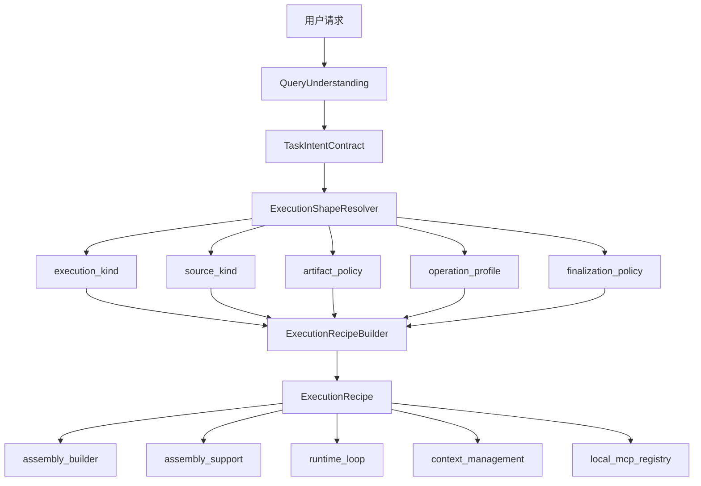
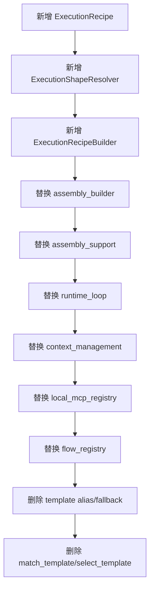

# 92-TaskTemplate选择层拆除流程图-20260515

## 目标

本次要拆的不是整个 `TaskTemplate` 数据载体本身，而是它现在承担的那层“模板选择/模板路由/兼容 fallback 中间层”。

目标是把当前这条链：

`用户请求 -> query_understanding -> TaskTemplateRegistry.match_template() -> selected_template -> assembly/runtime`

改造成：

`用户请求 -> intent / capability / source / execution_shape 判定 -> execution_recipe -> assembly/runtime`

也就是：

1. 去掉 `match_template()` 这类基于模板 id 的中心路由层。
2. 去掉 alias/fallback/旧兼容模板映射。
3. 保留真正有执行意义的结构数据，但把它从 “template” 改成更直接的 “execution recipe / runtime recipe”。

## 先说结论

可以拆。

但不能一把直接删掉 `template_registry.py`，因为现在有两类职责混在一起：

1. 该删除的职责：模板选择、模板别名、fallback 兼容、heuristic 路由。
2. 不能裸删的职责：步骤蓝图、校验规则、产物要求、默认输出、运行约束。

所以正确做法不是“先删文件”，而是：

1. 先把“执行配方”抽出来。
2. 再把所有上游入口改成直接产出配方。
3. 最后清除 template selection layer 和它的兼容映射。

## 当前连接图

```mermaid
flowchart TD
    A[用户请求] --> B[query_understanding / current_turn_context]
    B --> C[TaskTemplateRegistry.build_task_intent_contract]
    C --> D[TaskTemplateRegistry.match_template]
    D --> E[selected_template]

    E --> F[backend/tasks/assembly_builder.py]
    E --> G[backend/tasks/assembly_support.py]
    E --> H[backend/orchestration/runtime_loop/task_run_loop.py]
    E --> I[backend/context_management/projection.py]
    E --> J[backend/context_management/resolver.py]
    E --> K[backend/capability_system/local_mcp_registry.py]
    E --> L[backend/tasks/flow_registry.py]

    K --> M[get_local_mcp_unit_for_template(template_id)]
    I --> N[template_id 推断 file/source kind]
    J --> N
    H --> O[finalize / artifact required / write_file 校验]
```

## 拆除边界

### 可以直接视为遗留层的部分

这些就是应该拆掉的对象：

1. `backend/tasks/template_registry.py`
   - `match_template()`
   - `_select_existing_template_id()`
   - alias 映射
   - `fallback_general_response`
   - capability -> template 的兜底选择

2. 所有“因为 template_id 才能往下走”的路由判断
   - 例如：
     - `template.search.information_search`
     - `template.general.main_conversation`
     - `template.capability.builtin_tool_lane`
   - 这些本质上都不是执行实体，而是路由标签

### 不能直接裸删的部分

这些虽然现在挂在 `TaskTemplate` 下面，但本质是执行配方：

1. `step_blueprints`
2. `validation_rules`
3. `required_operations`
4. `optional_operations`
5. `output_schema`
6. `task_family`
7. `task_mode`
8. `metadata` 里与运行控制直接有关的字段

如果把这些一起删了，`assembly_builder` 和 `task_run_loop` 会立即断。

## 结构性改造原则

新的中心对象不应该叫 template，应该叫：

- `ExecutionRecipe`
  或
- `RuntimeRecipe`

我更建议 `ExecutionRecipe`，因为它表达的是“本次任务该怎么执行”，而不是“匹配到了哪个模板”。

## 新链路设计



## 新对象最小字段

建议新增一个最小替代对象：

```python
ExecutionRecipe(
    recipe_id: str,
    execution_kind: str,
    task_family: str,
    task_mode: str,
    source_kind: str,
    output_schema: dict[str, Any],
    required_operations: tuple[str, ...],
    optional_operations: tuple[str, ...],
    step_blueprints: tuple[TaskStepBlueprint, ...],
    validation_rules: tuple[TaskValidationRule, ...],
    artifact_policy: dict[str, Any],
    finalization_policy: dict[str, Any],
    metadata: dict[str, Any],
)
```

这里最重要的是：`recipe_id` 可以保留，但不能再承担“路由中心”的职责。

## 具体拆除流程

### 第 1 步：冻结 template selection layer 的职责边界

目的：防止一边拆一边继续往 `match_template()` 塞新逻辑。

要做的事：

1. 在设计上宣布：
   - `TaskTemplateRegistry.match_template()` 不再允许继续增加新分支。
2. 列出当前所有输出用途：
   - `selected_template.task_family`
   - `selected_template.task_mode`
   - `selected_template.required_operations`
   - `selected_template.optional_operations`
   - `selected_template.step_blueprints`
   - `selected_template.validation_rules`
   - `selected_template.output_schema`
   - `selected_template.metadata`

这一阶段不改行为，只是确认替代清单。

### 第 2 步：新建 `ExecutionRecipe` 模型

目的：先把“执行配方”和“模板选择”拆开。

要做的事：

1. 在 `backend/tasks/` 下新增 recipe model。
2. 字段先与现有 `TaskTemplate` 对齐，避免 runtime 大范围联动失败。
3. 增加：
   - `execution_kind`
   - `source_kind`
   - `artifact_policy`
   - `finalization_policy`

结果要求：

1. runtime 和 assembly 后续可以只消费 `ExecutionRecipe`。
2. recipe 可以从旧 template 临时转换出来，但上游不再依赖 template id 做决策。

### 第 3 步：新增 `ExecutionShapeResolver`

目的：替换 `match_template()` 的路由职能。

它只负责判定这些结构字段，不返回 template id：

1. `execution_kind`
   - `conversation`
   - `search`
   - `workspace_patch`
   - `document_analysis`
   - `dataset_analysis`
   - `bundle`

2. `source_kind`
   - `none`
   - `workspace`
   - `web`
   - `pdf`
   - `dataset`

3. `artifact_policy`
   - 是否必须产出文件
   - 是否要求真实 `write_file`
   - 目标路径如何确定

4. `finalization_policy`
   - 工具观察能否直接结束
   - 是否必须 model finalize

5. `operation_profile`
   - required/optional operations 的基础集合

这一层只做结构判断，不做兼容 alias，不做 fallback template。

### 第 4 步：新增 `ExecutionRecipeBuilder`

目的：根据 `ExecutionShapeResolver` 结果直接造出 recipe。

职责：

1. 把 execution shape 映射为：
   - `step_blueprints`
   - `validation_rules`
   - `output_schema`
   - `required_operations`
   - `optional_operations`

2. 把原来 template metadata 里真正有运行意义的配置迁过来。

3. 明确分出两种来源：
   - 结构规则内建生成
   - 特定 task / flow / capability 的显式覆盖

这一步完成后，`assembly_builder` 理论上就不该再依赖 `template_registry.get_template()`。

### 第 5 步：替换 `assembly_builder` 入口

当前关键入口：

- [backend/tasks/assembly_builder.py](D:/AI应用/langchain-agent/backend/tasks/assembly_builder.py)

当前链路：

1. `build_task_intent_contract()`
2. `match_template()`
3. `get_template()`
4. `selected_template`

改造后链路：

1. `build_task_intent_contract()`
2. `resolve_execution_shape()`
3. `build_execution_recipe()`
4. `selected_recipe`

替换点：

1. `selected_template` 全部改成 `selected_recipe`
2. `task_contract.template_id` 改成 `recipe_id` 或 `execution_kind`
3. `_build_task_spec()` 的输入改为 recipe
4. `_resolve_task_family()` / `_resolve_task_mode()` 直接读 recipe

### 第 6 步：替换 `assembly_support` 中所有 template 推断

当前文件：

- [backend/tasks/assembly_support.py](D:/AI应用/langchain-agent/backend/tasks/assembly_support.py)

这里有两类问题必须拆：

1. 真正的执行配方读取
   - 可以保留，但改成读 recipe

2. 基于 `template_id` 的语义推断
   - 必须去掉

重点替换：

1. `_template_id_for_capability()` -> 改成 `capability -> source_kind / execution_kind`
2. `get_local_mcp_unit_for_template(template_id)` -> 改成：
   - `get_local_mcp_unit_for_capability(capability_kind)`
   - 或 `get_local_mcp_unit_for_source_kind(source_kind)`

### 第 7 步：替换 runtime_loop 对 template payload 的依赖

当前文件：

- [backend/orchestration/runtime_loop/task_run_loop.py](D:/AI应用/langchain-agent/backend/orchestration/runtime_loop/task_run_loop.py)

当前关键问题：

1. `_task_template_from_payload()`
2. `_template_requires_model_finalize()`
3. `_template_allows_tool_observation_finalization()`
4. `_requires_write_file_artifact()`

这些逻辑都不该继续绑在 template 上。

应该改成：

1. `_recipe_from_payload()`
2. `_recipe_requires_model_finalize()`
3. `_recipe_allows_tool_observation_finalization()`
4. `_recipe_requires_write_file_artifact()`

判定依据也要从：

- `template_id`
- `step_blueprints`
- `validation_rules`

改成：

- `finalization_policy`
- `artifact_policy`
- `step_blueprints`
- `validation_rules`

也就是：保留运行规则，不保留模板路由语义。

### 第 8 步：清理 context_management 里的 template 语义回推

当前文件：

- [backend/context_management/projection.py](D:/AI应用/langchain-agent/backend/context_management/projection.py)
- [backend/context_management/resolver.py](D:/AI应用/langchain-agent/backend/context_management/resolver.py)

当前问题：

这里存在很多“看到 `template_id` 再猜这是 pdf/dataset/search”的逻辑。

这层必须改成显式字段：

1. `source_kind`
2. `capability_kind`
3. `execution_kind`
4. `file_kind`

不能再依赖：

- `"structured" in template_id`
- `"pdf" in template_id`

这种字符串猜测。

### 第 9 步：切断 local MCP 对 template 的绑定

当前文件：

- [backend/capability_system/local_mcp_registry.py](D:/AI应用/langchain-agent/backend/capability_system/local_mcp_registry.py)

当前问题：

本地 MCP 单元现在还是用 `template_ids` 建索引。

这说明 template 已经渗透到了 capability system。

应该改成以下任一方式：

1. `capability_kinds`
2. `source_kinds`
3. `unit_roles`

推荐：

1. `capability_kind` 作为主索引
2. `source_kind` 作为辅助索引

也就是：

`template -> MCP unit`

改成：

`capability/source_kind -> MCP unit`

### 第 10 步：替换 flow_registry 中对 template 的静态引用

当前文件：

- [backend/tasks/flow_registry.py](D:/AI应用/langchain-agent/backend/tasks/flow_registry.py)

当前问题：

这里把 specific task 直接映射到 `template_id`。

应该改成映射到：

1. `execution_kind`
2. `recipe preset`
3. `workflow_id`
4. `task_mode`

也就是说，flow registry 保留“任务定义”，不再负责塞一个 template id 给下游。

### 第 11 步：删除模板别名和 fallback 路由

确认前面几层都切完以后，直接删除：

1. `_select_existing_template_id()`
2. `template.chat.general_response -> template.general.main_conversation`
3. `template.general.response -> template.general.main_conversation`
4. `template.local.workspace_read -> template.capability.builtin_tool_lane`
5. `fallback_general_response`
6. `heuristic_fallback`

这一步才是你真正想要的“拆掉怪层”。

### 第 12 步：最终删除 template selection layer

当以下条件成立时，可以正式删除：

1. `assembly_builder` 不再调用 `match_template()`
2. `runtime_loop` 不再反序列化 `TaskTemplate`
3. `context_management` 不再根据 `template_id` 猜 source kind
4. `local_mcp_registry` 不再用 `template_ids` 做主索引
5. `flow_registry` 不再把 specific task 绑定到 template id

满足后可以删除：

1. `TaskTemplateRegistry.match_template()`
2. `TaskTemplateRegistry.select_template()`
3. `_intent_candidate_template_ids()`
4. `_select_existing_template_id()`
5. 旧 alias/fallback 逻辑

如果 `TaskTemplate` 只剩数据结构壳子，也可以一起删除并替换为 `ExecutionRecipe`。

## 拆除顺序图



## 风险判断

### 可以接受的风险

1. 短期内 trace / payload 字段名会变化
2. 旧日志分析脚本可能需要同步调整
3. 旧测试会大量失效

这些都属于拆旧层的正常代价。

### 真正危险的地方

1. runtime 终态判定失效
   - 例如工具执行成功后无法 finalize

2. 必须写文件的任务丢掉 artifact 校验
   - 例如模型回答了内容，但没真正调用 `write_file`

3. pdf/dataset/search 这些 source_kind 丢失
   - 导致绑定错误的 MCP unit

4. flow/specific task 失去 recipe preset
   - 导致特定任务退化成普通对话

所以风险不在“删 template”本身，而在“删掉了执行配方承载物却没有替身”。

## 是否可以直接把模板选择层清掉

可以，但前提是“直接清掉”指的是：

1. 先建立 `ExecutionRecipe`
2. 先完成 recipe builder / resolver 替代
3. 再删除 template selection layer

如果你的意思是今天直接把 `match_template()` 和 `template_registry.py` 删除掉，不补替代层，那不行，运行链会断在：

1. `assembly_builder`
2. `runtime_loop`
3. `context_management`
4. `local_mcp_registry`

## 最小实施建议

如果你要尽快开拆，我建议按下面这个最小闭环执行：

1. 新增 `ExecutionRecipe`
2. 在 `assembly_builder` 中接入 `ExecutionShapeResolver + ExecutionRecipeBuilder`
3. 让 `runtime_loop` 改读 recipe payload
4. 删掉 `match_template()` 调用
5. 再清理 context / mcp / flow 中的 `template_id` 推断
6. 最后物理删除 template selection layer

这样拆，路径最短，而且不会把运行时直接打穿。

## 最终判断

你的怀疑基本是对的：

`TaskTemplate` 这一层里，真正有价值的是“执行配方数据”；真正有问题的是“模板选择层把路由、兼容、fallback、能力猜测都揉进来了”。

所以应该拆的不是某个天气分支，也不是某个单点补丁，而是这层中间路由结构本身。

下一步就可以按这份流程，从 `ExecutionRecipe` 和 `ExecutionShapeResolver` 开始正式动刀。
