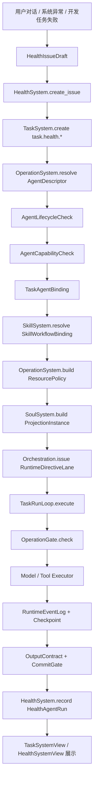

# 链路权限子 Agent 完整链路设计

日期：2026-04-30  
定位：本文件是 `17-OpenAI式链路权限子Agent实例化实施计划-20260430.md` 的完整链路设计稿。它把操作系统、任务系统、Skills 系统、灵魂系统、编排 RuntimeLoop、健康系统和任务系统前端连成一条可施工、可追踪、可验收的链路。

---

## 0. 最终结论

本轮目标不是“先做一个健康页面”，而是打通第一个链路权限子 Agent 样板：

```text
agent:health:maintainer
  -> 由操作系统登记和授权
  -> 由任务系统绑定到健康任务流
  -> 由 Skills 系统分配健康工作流
  -> 由灵魂系统生成玄女健康投影
  -> 由编排系统在 RuntimeLoop 中执行
  -> 由健康系统记录问题、证据、分析和验证
  -> 由任务系统前端展示完整装配与运行链路
```

最终固定口径：

```text
主 Agent：
  任务识别、任务分配、委派与最终整合中心。

子 Agent：
  绑定任务族、链路权限、Skills 工作流和投影模板的受限执行单元。

协调任务：
  未来多 Agent 拓扑、上下文共享、handoff、冲突解决和输出合并的管理对象。

操作系统：
  Agent 生命周期与硬权限裁决 owner。

任务系统：
  Agent 的任务化装配、任务可见性、任务流绑定、协调任务配置和运行追踪 owner。

健康系统：
  维护系统健康，不保存所有正常对话，只保存问题、证据、候选分析和验证。
```

---

## 1. 全链路总览



这条链路有三个硬约束：

```text
1. 子 Agent 不能绕过 OperationSystem 获得生命周期或权限。
2. 子 Agent 不能绕过 TaskSystem 进入任务流。
3. 子 Agent 不能绕过 RuntimeLoop 自己执行。
```

---

## 2. 六条子链

### 2.1 启动链

启动链负责从问题或任务生成健康任务。

输入：

```text
用户指出问题。
系统发现运行异常。
开发者发现 skill / prompt / memory / tool 行为异常。
健康系统从 RuntimeTrace 发现失败节点。
```

输出：

```text
HealthIssue
HealthIssueDraft
task.health.issue_triage
```

固定流程：

```text
HealthSystem.capture_problem()
  -> normalize issue owner / severity / source
  -> attach conversation / runtime / prompt / memory / assertion refs
  -> TaskSystem.create(task.health.issue_triage)
```

失败策略：

```text
没有足够证据：
  创建 issue，但状态为 needs_evidence。

没有 task system：
  issue 保留，等待任务系统恢复。

重复问题：
  合并为 duplicate_of，不新开 agent run。
```

### 2.2 装配链

装配链负责把健康任务变成可执行子 Agent 任务。

输入：

```text
task.health.issue_triage
agent:health:maintainer
health issue refs
```

输出：

```text
TaskAgentBinding
SkillWorkflowBinding
ResourcePolicy
ProjectionInstance
RuntimeDirectiveLane
```

固定流程：

```text
TaskSystem.resolve_task_flow(task_mode)
  -> OperationSystem.resolve_agent(agent_id)
  -> AgentLifecycleCheck
  -> AgentCapabilityCheck
  -> SkillSystem.resolve_workflow(workflow_id)
  -> OperationSystem.build_resource_policy(binding)
  -> SoulSystem.build_projection_instance(binding)
  -> Orchestration.build_runtime_directive_lane(binding)
```

硬校验：

```text
task_mode in AgentCapabilityProfile.allowed_task_modes
runtime_lane in AgentCapabilityProfile.allowed_runtime_lanes
workflow_id in AgentCapabilityProfile.allowed_skill_workflows
projection_template_id in AgentCapabilityProfile.allowed_projection_templates
memory_scope in AgentCapabilityProfile.allowed_memory_scopes
operation_scope subset of AgentCapabilityProfile.allowed_operations
blocked_operations cannot be re-enabled by task binding
```

### 2.3 执行链

执行链负责在 RuntimeLoop 内执行健康子 Agent。

输入：

```text
RuntimeDirectiveLane
ProjectionInstance
ContextSnapshot
ResourcePolicy
SkillWorkflowView
```

输出：

```text
RuntimeEventLog
RuntimeCheckpoint
ExecutorObservation
HealthTriageResult / HealthTraceAnalysis / HealthCaseDraftProposal / HealthFixVerificationProposal
```

固定流程：

```text
TaskRunLoop.start(agent_id, agent_profile_id, runtime_lane)
  -> loop_iteration_started
  -> task_contract_built
  -> memory_runtime_view_built
  -> projection_instance_built
  -> context_snapshot_built
  -> runtime_directive_issued
  -> operation_gate_checked
  -> executor_started
  -> executor_observation_received
  -> output_boundary_applied
  -> commit_gate_checked
  -> loop_terminal
  -> checkpoint_written
```

失败策略：

```text
OperationGate deny:
  terminal_reason = blocked_by_gate
  HealthIssue 增加 blocked evidence。

输出不符合 OutputContract:
  terminal_reason = output_contract_failed
  HealthIssue 增加 invalid_output evidence。

超过 loop limit:
  terminal_reason = max_turns_exceeded / max_events_exceeded
  HealthIssue 增加 loop_limit evidence。

上下文缺失:
  terminal_reason = missing_context_refs
  HealthIssue 状态回到 needs_evidence。
```

### 2.4 健康记录链

健康记录链负责把执行结果变成健康系统资产。

输入：

```text
TaskRunLoop trace
OutputContract result
CommitGate decision
```

输出：

```text
HealthAgentRun
HealthTrace
ProblemNode
CaseDraftProposal
FixVerificationProposal
HealthReport
```

固定流程：

```text
HealthSystem.record_agent_run(task_run_id)
  -> collect runtime event refs
  -> collect prompt_manifest_ref
  -> collect memory_runtime_view_ref
  -> collect operation_gate decisions
  -> extract problem nodes
  -> attach structured result candidate
  -> update issue status
```

保存原则：

```text
正常对话不全量保存。
问题对话只保存 issue 和证据引用。
Prompt 全文不重复保存，保存 prompt_manifest_ref 和必要摘要。
长期记忆仍归记忆系统。
正式测试用例由 CaseDraftProposal 被采纳后生成。
```

### 2.5 前端呈现链

前端呈现链负责让开发者看到“任务如何被装配、为什么失败、下一步怎么修”。

输入：

```text
AgentDescriptor
AgentCapabilityProfile
TaskAgentBinding
SkillWorkflowBinding
ProjectionInstance
RuntimeTrace
HealthIssue
HealthAgentRun
```

输出：

```text
TaskSystemView
HealthSystemView
OperationAgentView
```

任务系统工作区承担主视角：

```text
主 Agent 调度中心。
子 Agent 实例。
单 Agent 任务流。
协调任务。
拓扑模板。
链路权限矩阵。
Skills 工作流。
投影分配。
运行记录。
```

健康系统工作区承担问题视角：

```text
问题对话。
问题节点。
证据链。
Agent 操作流程。
健康分析。
用例草案。
修复验证。
```

操作系统工作区承担治理视角：

```text
Agent Registry。
AgentCapabilityProfile。
OperationGate。
ResourcePolicy。
生命周期与审批记录。
```

### 2.6 未来协调任务链

本轮不执行复杂多 Agent，但必须设计入口。

协调任务链目标：

```text
多个受限 agent 在同一任务目标下协作。
每个 participant 拥有独立 capability、projection、workflow、memory scope 和 output contract。
协调任务负责拓扑、handoff、共享上下文、冲突解决和结果合并。
```

固定对象：

```text
CoordinationTaskDefinition
TopologyTemplate
CoordinatorAgent
ParticipantAgentBinding
SharedContextPolicy
MemorySharingPolicy
HandoffPolicy
ConflictResolutionPolicy
OutputMergePolicy
StopConditions
```

第一版状态：

```text
只读 / 草案 / 配置占位。
不开放任意多 Agent 互相调用。
不允许子 Agent 启动其他子 Agent。
```

---

## 3. 核心数据模型

### 3.1 Operation System

```text
AgentDescriptor
  agent_id
  display_name
  owner_system
  profile_type
  lifecycle_state
  default_soul_id
  default_projection_template_id
  created_at
  updated_at
  governance_status
  deletable
  disable_allowed
  metadata

AgentCapabilityProfile
  agent_profile_id
  agent_id
  allowed_task_modes
  allowed_runtime_lanes
  allowed_operations
  blocked_operations
  allowed_skill_workflows
  allowed_projection_templates
  allowed_memory_scopes
  allowed_context_sections
  output_contracts
  approval_policy
  trace_policy
  lifecycle_policy

AgentLifecycleRecord
  record_id
  agent_id
  action
  operator
  before
  after
  reason
  created_at
```

### 3.2 Task System

```text
TaskFlowDefinition
  flow_id
  task_mode
  task_family
  title
  input_contract_id
  output_contract_id
  default_agent_id
  default_workflow_id
  default_projection_template_id
  default_runtime_lane
  default_memory_scope
  enabled

TaskAgentBinding
  binding_id
  task_id
  flow_id
  agent_id
  agent_profile_id
  runtime_lane
  projection_template_id
  skill_workflow_id
  memory_scope
  output_contract_id
  resource_policy_ref
  validation_state
  diagnostics

TaskVisibilityRecord
  agent_id
  visible_in_task_system
  visible_task_modes
  hidden_reason
```

### 3.3 Skills System

```text
SkillWorkflowBinding
  workflow_id
  title
  task_mode
  visible_skill_ids
  steps
  input_boundary
  output_boundary
  stop_conditions
  required_evidence_refs
  output_contract_id
```

### 3.4 Soul System

```text
ProjectionTemplate
  template_id
  soul_id
  agent_profile_id
  role_type
  task_mode
  default_skill_workflow_id
  default_memory_policy
  default_output_contract
  projection_resolution_policy
  guardrails
  enabled

ProjectionInstance
  projection_id
  template_id
  task_id
  task_run_id
  agent_id
  agent_profile_id
  runtime_lane
  prompt_manifest_id
  resource_policy_ref
  context_snapshot_ref
  created_at
```

### 3.5 Orchestration RuntimeLoop

```text
RuntimeDirectiveLane
  lane_id
  lane_type
  task_id
  task_run_id
  agent_id
  agent_profile_id
  allowed_operations
  memory_scope
  context_section_scope
  output_contract_id
  max_turns
  terminal_policy

RuntimeLoopState additions
  agent_id
  agent_profile_id
  runtime_lane
  task_agent_binding_ref
  skill_workflow_ref
  projection_ref
  prompt_manifest_ref
  health_issue_ref
```

### 3.6 Health System

```text
HealthIssue
  issue_id
  title
  owner_system
  severity
  status
  source
  conversation_ref
  runtime_trace_refs
  prompt_manifest_refs
  memory_refs
  assertion_refs
  duplicate_of
  created_at
  updated_at

HealthAgentRun
  run_id
  issue_id
  task_run_id
  agent_id
  agent_profile_id
  runtime_lane
  task_mode
  workflow_id
  projection_id
  prompt_manifest_id
  status
  terminal_reason
  result_ref
  created_at

ProblemNode
  node_id
  issue_id
  system
  stage
  evidence_refs
  diagnosis
  confidence
  suggested_action
```

---

## 4. 默认健康子 Agent 配置

### 4.1 AgentDescriptor

```text
agent_id = agent:health:maintainer
display_name = 玄女健康管家
owner_system = health_system
profile_type = sub_agent
lifecycle_state = enabled
default_soul_id = xuannv
default_projection_template_id = xuannv__health_maintainer
deletable = archive_only
disable_allowed = true
governance_status = operation_managed
```

### 4.2 AgentCapabilityProfile

```text
agent_profile_id = health_maintainer_agent
agent_id = agent:health:maintainer

allowed_task_modes:
  issue_triage
  trace_analysis
  case_draft
  fix_verification

allowed_runtime_lanes:
  health_issue_read
  health_trace_read
  prompt_trace_read
  memory_trace_read
  runtime_trace_read
  assertion_trace_read
  case_draft_candidate
  fix_verification_candidate

allowed_operations:
  op.model_response
  op.read_file
  op.search_text
  op.memory_read

blocked_operations:
  op.write_file
  op.edit_file
  op.shell
  op.python_repl
  op.memory_write_candidate
  op.agent_bounded

allowed_memory_scopes:
  issue_local_readonly
  health_trace_readonly

allowed_skill_workflows:
  workflow.health.issue_triage
  workflow.health.trace_analysis
  workflow.health.case_draft
  workflow.health.fix_verification

allowed_projection_templates:
  xuannv__health_maintainer
```

### 4.3 Health Task Flows

```text
task.health.issue_triage
  lane = health_issue_read
  workflow = workflow.health.issue_triage
  projection = xuannv__health_maintainer
  output = HealthTriageResult

task.health.trace_analysis
  lane = health_trace_read
  workflow = workflow.health.trace_analysis
  projection = xuannv__health_maintainer
  output = HealthTraceAnalysis

task.health.case_draft
  lane = case_draft_candidate
  workflow = workflow.health.case_draft
  projection = xuannv__health_maintainer
  output = HealthCaseDraftProposal

task.health.fix_verification
  lane = fix_verification_candidate
  workflow = workflow.health.fix_verification
  projection = xuannv__health_maintainer
  output = HealthFixVerificationProposal
```

---

## 5. API 链路

### 5.1 Operation Agent API

```text
GET    /api/operations/agents
POST   /api/operations/agents
GET    /api/operations/agents/{agent_id}
PUT    /api/operations/agents/{agent_id}
POST   /api/operations/agents/{agent_id}/enable
POST   /api/operations/agents/{agent_id}/disable
DELETE /api/operations/agents/{agent_id}

GET    /api/operations/agents/{agent_id}/capability-profile
PUT    /api/operations/agents/{agent_id}/capability-profile
```

约束：

```text
agent:main 不可删除、不可禁用。
agent:health:maintainer 初版只能 archive 删除。
危险权限变更必须生成 governance record。
```

### 5.2 Task System API

```text
GET  /api/tasks/overview
GET  /api/tasks/main-agent-dispatch
PUT  /api/tasks/main-agent-dispatch

GET  /api/tasks/flows
POST /api/tasks/flows
PUT  /api/tasks/flows/{flow_id}

GET  /api/tasks/agent-bindings
POST /api/tasks/agent-bindings
PUT  /api/tasks/agent-bindings/{binding_id}

GET  /api/tasks/link-permission-matrix
GET  /api/tasks/runs

GET  /api/tasks/coordination-tasks
POST /api/tasks/coordination-tasks
PUT  /api/tasks/coordination-tasks/{coordination_task_id}

GET  /api/tasks/topology-templates
```

### 5.3 Skills Workflow API

```text
GET  /api/skills/workflows
GET  /api/skills/workflows/{workflow_id}
POST /api/skills/workflows
PUT  /api/skills/workflows/{workflow_id}
```

### 5.4 Soul Projection API

```text
GET  /api/soul/projection-templates
POST /api/soul/projection-templates
GET  /api/soul/projection-templates/{template_id}
PUT  /api/soul/projection-templates/{template_id}

POST /api/soul/projection-instances
GET  /api/soul/projection-instances/{projection_id}
GET  /api/soul/projection-instances/{projection_id}/manifest
```

### 5.5 Health API

```text
POST /api/health/issues
GET  /api/health/issues
GET  /api/health/issues/{issue_id}
POST /api/health/issues/{issue_id}/agent-runs
GET  /api/health/agent-runs/{run_id}
GET  /api/health/traces/{trace_id}
POST /api/health/case-drafts/{draft_id}/adopt
POST /api/health/fix-verifications/{verification_id}/adopt
```

---

## 6. 存储规划

短期 JSON 存储：

```text
storage/operations/agents.json
storage/operations/agent_capabilities.json
storage/operations/agent_lifecycle_records.json

storage/tasks/task_flows.json
storage/tasks/task_agent_bindings.json
storage/tasks/task_visibility.json
storage/tasks/coordination_tasks.json
storage/tasks/topology_templates.json

storage/skill_system/workflows.json

storage/soul/projection_templates.json
storage/soul/projection_instances.json

storage/health/issues.json
storage/health/agent_runs.json
storage/health/problem_nodes.json
storage/health/case_drafts.json
storage/health/fix_verifications.json
```

持久化原则：

```text
RuntimeLoop 事实以 event log / checkpoint 为准。
HealthSystem 只保存问题级索引和证据引用。
ProjectionInstance 保存索引，prompt 全文由 PromptManifest refs 和必要摘要承载。
TaskSystem 保存任务装配合同。
OperationSystem 保存 agent 生命周期和硬权限。
```

---

## 7. 文件级实施清单

### 7.1 操作系统

```text
backend/operations/agent_models.py
backend/operations/agent_registry.py
backend/operations/agent_capability.py
backend/operations/agent_lifecycle.py
backend/api/operation_agents.py
backend/operations/__init__.py
```

### 7.2 任务系统

```text
backend/tasks/definitions.py
backend/tasks/agent_bindings.py
backend/tasks/flow_models.py
backend/tasks/flow_registry.py
backend/tasks/coordination_models.py
backend/tasks/topology_templates.py
backend/tasks/contract_builder.py
backend/api/tasks.py
```

### 7.3 Skills 系统

```text
backend/skill_system/workflow_models.py
backend/skill_system/workflow_registry.py
backend/skill_system/health_workflows.py
backend/api/skills.py
```

### 7.4 灵魂系统

```text
backend/soul/projection_templates.py
backend/soul/projection_instances.py
backend/soul/projection.py
backend/soul/contracts.py
backend/api/souls.py
```

### 7.5 编排 RuntimeLoop

```text
backend/orchestration/runtime_directive.py
backend/orchestration/runtime_loop/models.py
backend/orchestration/runtime_loop/task_run_loop.py
backend/orchestration/runtime_loop/context_manager.py
backend/orchestration/runtime_loop/stage_projection.py
backend/orchestration/runtime_loop/events.py
backend/orchestration/runtime_loop/trace_reader.py
```

### 7.6 健康系统

```text
backend/health_system/models.py
backend/health_system/issue_registry.py
backend/health_system/trace_registry.py
backend/health_system/agent_tasks.py
backend/health_system/report_builder.py
backend/api/health_system.py
```

### 7.7 前端

```text
frontend/src/components/workspace/views/TaskSystemView.tsx
frontend/src/components/workspace/views/TestSystemView.tsx
frontend/src/components/workspace/views/OperationsView.tsx
frontend/src/components/workspace/WorkspacePanel.tsx
frontend/src/lib/api.ts
frontend/src/lib/store.ts
```

---

## 8. 固定施工顺序

```text
Step 1:
  Operation Agent Registry。
  先让 agent:main 和 agent:health:maintainer 成为真实可查询资源。

Step 2:
  AgentCapabilityProfile。
  先实现 hard contract，不急着执行。

Step 3:
  TaskFlowDefinition + TaskAgentBinding。
  健康任务流绑定 health agent，绑定失败必须可诊断。

Step 4:
  SkillWorkflowBinding。
  健康 workflows 从 skill 列表升级为工作流。

Step 5:
  ProjectionTemplate / ProjectionInstance。
  玄女健康投影从 preview 变成正式实例。

Step 6:
  RuntimeDirectiveLane + RuntimeLoop agent fields。
  RuntimeEvent 必须带 agent_id / profile_id / lane。

Step 7:
  HealthIssue -> HealthAgentRun。
  健康系统能触发健康子 Agent 并记录结果。

Step 8:
  HealthTrace report。
  报告能读 prompt / memory / runtime / operation / output refs。

Step 9:
  TaskSystemView。
  替换系统架构工作区，展示完整任务装配链。

Step 10:
  HealthSystemView。
  以问题视角展示健康分析、用例草案和修复验证。

Step 11:
  OperationsView。
  管理 Agent Registry 和 capability profile。
```

---

## 9. 验收矩阵

### 9.1 主 Agent 不被破坏

```text
主 Agent 可以正常对话。
主 Agent profile 是 system_builtin。
主 Agent 不可删除、不可禁用。
主 Agent 不受 health agent memory scope 限制。
```

### 9.2 健康子 Agent 可实例化

```text
agent:health:maintainer 可在 OperationSystem 查询。
AgentCapabilityProfile 可查询。
TaskSystem 可绑定 task.health.issue_triage。
绑定时校验 task_mode / lane / workflow / projection / memory scope。
```

### 9.3 权限硬收敛

```text
health agent 请求 op.write_file 被拒绝。
health agent 请求 op.shell 被拒绝。
health agent 请求 durable memory write 被拒绝。
blocked reason 可进入 RuntimeEventLog 和 HealthTrace。
```

### 9.4 投影可追踪

```text
xuannv__health_maintainer template 可查询。
ProjectionInstance 包含 task_id / agent_id / lane / prompt_manifest_id。
PromptManifest 可被 HealthTrace 引用。
投影不能扩大 ResourcePolicy。
```

### 9.5 RuntimeLoop 可恢复可追踪

```text
task_run_id 存在。
event log 存在。
checkpoint 存在。
RuntimeLoopState 包含 agent_id / profile_id / lane。
TraceReader 可按 agent_id 和 health_issue_ref 查询。
```

### 9.6 健康系统不变成记忆系统

```text
普通成功对话不全量保存。
问题只保存 issue、证据引用、分析和验证候选。
长期知识仍归 MemorySystem。
```

### 9.7 前端可读

```text
系统架构工作区被任务系统替换。
TaskSystemView 能看到主 Agent、子 Agent、任务流、协调任务、权限矩阵、运行记录。
Health agent 样例链路完整显示。
页面不以 JSON 文件列表作为主要交互。
```

---

## 10. 禁止事项

```text
禁止把链路权限做成全局开关。
禁止让子 Agent 继承主 Agent 全上下文。
禁止让 prompt 文案承担硬权限。
禁止让健康系统保存所有正常对话。
禁止让任务系统直接绕过操作系统创建或扩大 agent 权限。
禁止让子 Agent 调用其他子 Agent。
禁止在本轮开放复杂多 Agent 拓扑执行。
禁止把前端做成后端文件浏览器。
```

---

## 11. 与现有计划关系

本文件承接：

```text
17-OpenAI式链路权限子Agent实例化实施计划-20260430.md
16-健康子Agent投影管理系统规划-20260430.md
15-健康维护子Agent实例化与投影任务绑定方案-20260430.md
06-任务系统前端工作区设计与Agent编排管理计划-20260430.md
```

关系：

```text
17 号：
  主施工计划。

18 号：
  完整链路设计和固定施工顺序。

06 号：
  Phase 9 任务系统前端专项参考。

16 号：
  投影管理和子 Agent 任务绑定细化。

15 号：
  健康维护子 Agent 的角色和职责基础。
```

后续实施时，以本文件的固定链路和 17 号的阶段计划共同作为施工依据。

